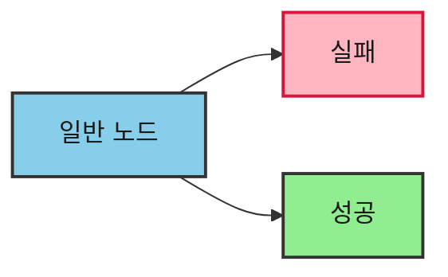

# Mermaid 다이어그램 가이드

> 출처: v1 visual/mermaid
> 관련 스킬: B4.계층-생성기, B5.난이도-곡선기

---

## 기본 원칙

- **노드 최대 7개** — 넘으면 subgraph로 분리
- **`flowchart`** 키워드 사용 (`graph` 아님)

---

## 특수문자 처리

- 괄호/중괄호/대괄호/슬래시가 라벨에 있으면 **큰따옴표 필수**
- 줄바꿈: `<br>` 만 사용 (`\n` 금지)
- 엣지 텍스트: `A -- "텍스트" --> B` 형식 (`-->|텍스트|` 금지)
- 점선: `A -. "텍스트" .-> B`
- 굵은선: `A == "텍스트" ==> B`

---

## Subgraph 규칙

- ID에 공백/특수문자 금지
- `subgraph SubSystem ["시스템 이름"]` 형식

---

## Bold/Italic 절대 금지

Mermaid 안에서 `**` 또는 `*`를 사용하면 **렌더링이 깨진다.**
큰따옴표 안이든 밖이든 절대 사용하지 않는다.

가장 흔한 렌더링 실패 원인이다.

---

## 3색 팔레트

모든 Mermaid 다이어그램은 아래 3가지 색상만 사용한다. 4색 이상 금지.

| 이름 | 용도 | classDef |
|------|------|----------|
| default | 기본 노드 (질문, 처리, 일반) | `fill:#87CEEB,stroke:#333,stroke-width:2px,color:#1a1a1a` |
| danger | 부정/실패/경고 | `fill:#FFB6C1,stroke:#DC143C,stroke-width:2px,color:#1a1a1a` |
| success | 긍정/완료/결과 | `fill:#90EE90,stroke:#333,stroke-width:2px,color:#1a1a1a` |

- `classDef default`로 선언하면 미지정 노드에 자동 적용
- 특별한 의미가 없는 노드는 class 지정 불필요 (default가 적용됨)



---

## 체크리스트

```
□ `flowchart` 키워드 사용했는가?
□ 특수문자 포함 라벨에 큰따옴표를 씌웠는가?
□ 엣지 텍스트가 `-- "텍스트" -->` 형식인가?
□ 노드 7개 이하인가?
□ `**` 또는 `*`가 Mermaid 안에 없는가?
□ 3색 팔레트(default/danger/success)만 사용했는가?
```

---

## 예시


