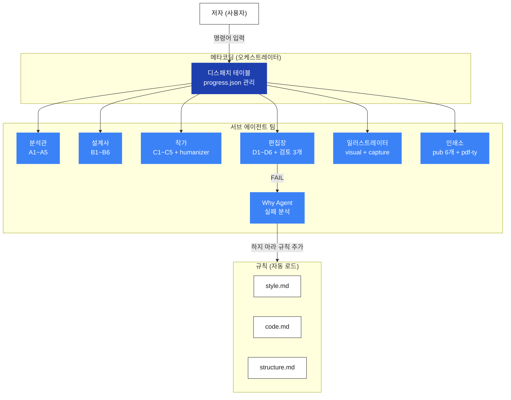
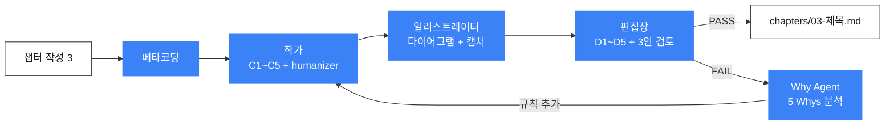

# 집필에이전트 v4

기술 서적(100페이지 권장)을 이야기처럼 쓰는 AI 집필 워크플로우.
코드를 따라치는 튜토리얼이 아니라, **"왜 이게 필요한지"를 이야기로 전달하는 개념서**를 만든다.

---

## 아키텍처



### 핵심 개념

| 개념 | 정체 | 역할 |
|------|------|------|
| **STEP** | 흐름 | 1~7번까지 순서대로 진행하는 워크플로우 단계 |
| **에이전트** | 전문가 | 역할별 규칙과 스킬을 가진 서브 에이전트 (8개) |
| **스킬** | 도구 | 하나의 작업만 수행하는 원자적 도구 (22개) |
| **검토 모드** | 체크리스트 | 산출물 품질을 검증하는 관점과 질문 목록 (3개) |

---

## 빠른 시작

### 1. 완성 코드 준비

책을 쓰기 전에 **완성 코드가 먼저 준비**되어 있어야 한다.

### 2. 프로젝트 생성

```
새 책 만들기
```

프로젝트 디렉토리가 생성되고, 완성 코드를 `code/`에 넣으라는 안내가 나온다.

### 3. 명령어 순서대로 진행

```
씨앗 심기 → 코드 분석 → 시나리오 설계 → 뼈대 세우기 → 챕터 작성 1 → ... → 프롤로그 생성 → 마무리
```

각 STEP이 끝나면 다음 명령어를 안내해준다. `현재 상태`로 진행률을 확인할 수 있다.

---

## 전체 워크플로우 (7 STEP)

```
Phase 1 ── 의도 확립
  STEP 1. 씨앗              "이 책은 뭐다"

Phase 2 ── 재료 파악
  STEP 2. 코드 해부          "재료가 뭐가 있지"

Phase 3 ── 이야기 설계
  STEP 3. 시나리오 + 버전     "어떤 순서로 이야기하지"
  STEP 4. 뼈대 세우기         "목차와 코드 실습 배치"

Phase 4 ── 집필
  STEP 5. 챕터 집필 (반복)    "쓴다"

Phase 5 ── 완성
  STEP 6. 프롤로그            "숲을 보여준다"
  STEP 7. 마무리              "에필로그, 부록"
```

### 명령어 → 에이전트 디스패치

사용자가 명령어를 입력하면 **메타코딩이 디스패치 테이블을 참조**하여 에이전트를 순서대로 호출한다.

| 명령어 | STEP | 에이전트 호출 순서 | 산출물 |
|--------|------|-------------------|--------|
| `씨앗 심기` | 1 | 분석관(A1,A3) → 작가(C2) → 편집장(인사이트+감수) | `planning/seed.md` |
| `코드 분석` | 2 | 분석관(A1~A4+Context7) → 편집장(인사이트+감수) | `planning/code-analysis.md` |
| `시나리오 설계` | 3 | 분석관(A5) → 설계사(B1,B2) → 일러스트레이터 → 편집장 | `planning/scenario.md` |
| `뼈대 세우기` | 4 | 설계사(B3~B6+Context7) → 일러스트레이터 → 작가(C4) → 편집장(D6) | `planning/outline.md` |
| `챕터 작성 [N]` | 5 | 작가(C1~C5+humanizer) → 일러스트레이터 → 편집장(D1~D5) → FAIL 시 Why Agent | `chapters/NN-제목.md` |
| `프롤로그 생성` | 6 | 작가(C2, 일기체) → 편집장(감수) | `book/front/prologue.md` |
| `마무리` | 7 | 작가(C2,C4) → 편집장(D6+감수) → 인쇄소(최종 빌드) | `book/back/` |

### 에이전트 호출 흐름 (STEP 5 예시)



### 유틸리티 명령어

| 명령어 | 설명 |
|--------|------|
| `현재 상태` | 진행률 + STEP/챕터 상태 출력 |
| `검토 [챕터]` | 편집장이 해당 챕터를 재검토 |

---

## 에이전트 팀

### 메타코딩 (오케스트레이터)

> "STEP을 따라가고, 적절한 전문가를 부른다"

- 직접 산출물을 만들지 않음. progress.json 관리 + 에이전트 디스패치만 수행
- 모델: claude-opus-4-6

---

### 분석관 (Analyst) — STEP 1, 2, 3

> "코드가 말하게 한다. 내 해석은 최소화한다"

| 스킬 | 역할 |
|------|------|
| A1. 구조-스캐너 | 프로젝트 트리 생성 |
| A2. 기능-추출기 | 기능 목록 추출 |
| A3. 기술스택-탐지기 | 기술스택 식별 |
| A4. 의존성-매퍼 | 컴포넌트 의존성 매핑 |
| A5. diff-생성기 | 버전 간 차이 생성 |

STEP 2에서 **Context7 MCP**로 기술스택 최신 버전 확인 + 의존성 호환성 검증.

---

### 설계사 (Architect) — STEP 3, 4

> "구조가 잡혀야 글이 산다"

| 스킬 | 역할 |
|------|------|
| B1. 기능-정렬기 | 학습 순서 정렬 |
| B2. 스냅샷-설계기 | 버전별 스냅샷 |
| B3. 코드-태거 | [실습]/[설명]/[참고] 태그 |
| B4. 계층-생성기 | 태그 포함 파일 트리 |
| B5. 난이도-곡선기 | 난이도 시각화 |
| B6. 갭-분석기 | 도메인 표준 대비 누락 분석 |

STEP 4에서 **Context7 MCP**로 공식 문서 기반 [필수/권장/선택/경고] 체크리스트 생성.

---

### 작가 (Writer) — STEP 1, 4, 5, 6, 7

> "설명하지 마라, 보여줘라"

| 스킬 | 역할 |
|------|------|
| C1. 비유-생성기 | 핵심 개념 비유 생성 |
| C2. 요약기 | 답변 정리, 챕터 요약 |
| C3. 브릿지-생성기 | 챕터 간 연결 |
| C4. 제목-생성기 | 챕터/책 제목 후보 |
| C5. 용어-정의기 | 비유 → 정식정의 테이블 |
| humanizer | AI 패턴 교정 |

**비유 일관성 전략**: 버전업형(하나의 비유로 끝까지) vs 독립형(챕터별 각각의 비유). STEP 1에서 자동 결정.

---

### 편집장 (Editor) — 모든 STEP

> "근거 없이 FAIL은 없다"

| 스킬 | 역할 |
|------|------|
| D1. 용어-탐지기 | 어려운 용어 확인 |
| D2. 톤-검사기 | 대화체 유지 확인 |
| D3. 파트-분리-검증기 | 이야기/기술 분리 검증 |
| D4. 포맷-검증기 | 상수 준수 검증 |
| D5. 의도-대조기 | seed.md 대비 이탈 감지 |
| D6. 분량-계산기 | 페이지 배분 + 편차 경고 |

**검토 모드 3개**:

| 모드 | 적용 시점 | 핵심 |
|------|----------|------|
| 인사이트 | STEP 1~5 | 모순, 빠진 개념, 미결정 항목 |
| 의도감시 | STEP 5만 | seed.md 대비 범위/깊이 이탈 |
| 감수 (3인 위원회) | 모든 STEP | 기술/독자/이야기 관점 검토 |

판정: **PASS** / **CONDITIONAL_PASS** / **FAIL** (최대 2회 재시도)

---

### 일러스트레이터 (Illustrator) — STEP 3, 4, 5

> "한 장의 그림이 열 줄의 설명을 대신한다"

| 스킬 | 역할 |
|------|------|
| visual | Mermaid/이미지 규칙 |
| screenshot | 터미널/브라우저 캡처 |
| design-doc-mermaid | Mermaid 다이어그램 생성 |
| pub-d2-diagram | D2 다이어그램 빌드 |

**이미지 2단계 파이프라인**:
1. **집필 시**: Mermaid 코드블록 + `[GEMINI PROMPT]` + `[CAPTURE NEEDED]` 플레이스홀더
2. **챕터 완성 후**: Mermaid → D2 → PNG, rich → PNG, Gemini API, Playwright 캡처

---

### 인쇄소 (Publisher) — STEP 5, 7

> "독자가 '예쁘다'고 느끼면 반은 성공이다"

| 스킬 | 역할 |
|------|------|
| pub-build | PDF 빌드 (MD → Typst → PDF) |
| pub-layout-check | 레이아웃 분석 |
| pub-image-optimize | 이미지 autocrop + 크기 조절 |
| pub-page-fit | 페이지 밀도 조정 |
| pub-typst-design | Typst 템플릿 규칙 |
| pdf-ty | Typst 기반 PDF 빌드 |

---

### Why Agent — 실패 시 자동 호출

> "같은 실수를 두 번 하지 않는다"

**트리거**: 편집장 FAIL / 빌드 에러 / 사용자 수정 지시 / "왜?" 입력

**동작**:
```
실패 발생 → 5 Whys 분석 → "하지 마라" 규칙 추가 → why-log.md 기록 → 재시도
```

규칙은 해당 에이전트의 AGENT.md에 추가되며, 변경 이유는 `why-log.md`에 포인터로 연결.

---

## 프로젝트 폴더 구조

```
projects/{책이름}/
├── progress.json            ← 상태 관리
├── answers.md               ← 모든 답변 누적
├── planning/                ← STEP 1~4 산출물
│   ├── seed-vN.md           ← 의도 (STEP 1)
│   ├── code-analysis-vN.md  ← 코드 분석 (STEP 2)
│   ├── scenario-vN.md       ← 시나리오 (STEP 3)
│   └── outline-vN.md        ← 목차 (STEP 4)
├── chapters/                ← STEP 5 산출물
│   └── NN-제목.md
├── book/
│   ├── front/               ← 프롤로그
│   ├── body/                ← 본문 (빌드용)
│   └── back/                ← 에필로그, 부록
├── versions/exNN/           ← 버전별 예제 코드
├── code/                    ← 완성 코드 (진실의 원천)
├── assets/CHNN/
│   ├── diagram/             ← D2/Mermaid 렌더링 PNG
│   ├── terminal/            ← rich → SVG → PNG 캡처
│   └── gemini/              ← Gemini 생성 개념도
├── questions/pending|done/  ← 인사이트 질문
└── review/                  ← 피드백 로그
```

**버전 관리**: 파일명에 `-vN` 접미사. 절대 덮어쓰지 않는다.

---

## 시스템 파일 구조

```
.claude/
├── agents/                  ← 에이전트 8개 (정의 + 규칙 + 절차)
│   ├── meta/AGENT.md        ← 오케스트레이터 + 디스패치 테이블
│   ├── analyst/AGENT.md
│   ├── architect/AGENT.md
│   ├── writer/AGENT.md
│   ├── editor/AGENT.md
│   ├── illustrator/AGENT.md
│   ├── publisher/AGENT.md
│   └── why/AGENT.md + why-log.md
├── rules/                   ← 글로벌 규칙 3개 (세션 시작 시 자동 로드)
│   ├── style.md             ← 톤, 편집, 포맷
│   ├── code.md              ← 코드 표시 규칙
│   └── structure.md         ← 산출물 구조, 버전 관리
├── skills/                  ← 스킬 (포인터 인덱스 + 실제 스킬)
│   ├── @{에이전트}/SKILL.md  ← 포인터 인덱스 (자동 로드)
│   └── {스킬명}/SKILL.md    ← 실제 스킬 (필요 시만 로드)
└── STRUCTURE.md             ← 전체 파일 구조 맵
```

---

## 규칙 체계

```
세션 시작
  │
  ├─ .claude/rules/*.md (3개) ──────── 모든 에이전트에 자동 적용
  │
  └─ 에이전트 호출 시
       └─ agents/*/AGENT.md ## 규칙 ── 해당 에이전트 컨텍스트에서만
            │
            └─ 실패 시 → Why Agent → "하지 마라" 규칙 추가 + why-log.md 기록
```

**서브 에이전트 컨텍스트 격리**: 작가 에이전트는 작가 규칙만 보고, 인쇄소 에이전트는 인쇄소 규칙만 본다. 글로벌 규칙 3개만 공통으로 적용.

---

## 설계 원칙

- **메타코딩은 지휘만 한다.** 산출물을 직접 만들지 않고, 적절한 에이전트를 호출한다.
- **스킬은 22개.** 각각 하나의 작업만 수행하는 원자적 도구.
- **검토 모드는 3개.** 인사이트(놓친 질문) + 의도감시(seed.md 대조) + 감수(3인 편집장).
- **의도가 필터다.** seed.md의 의도가 이후 모든 결정의 기준.
- **같은 실수를 두 번 하지 않는다.** Why Agent가 실패를 분석하고 규칙을 업데이트한다.
