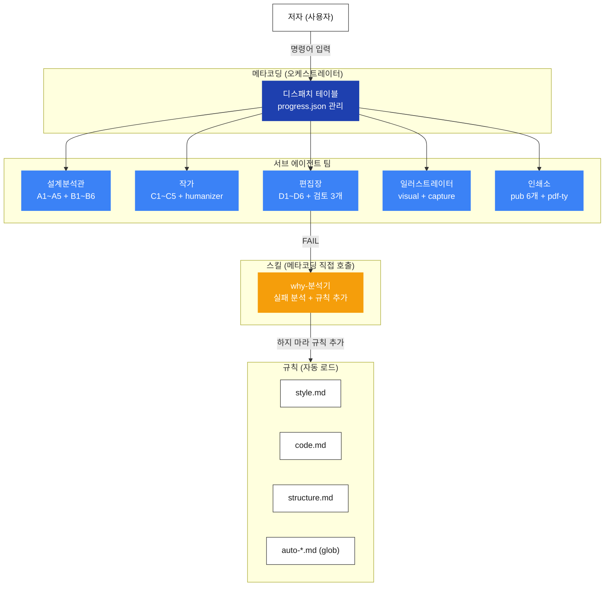

# 집필에이전트 v4

기술 서적(100페이지 권장)을 이야기처럼 쓰는 AI 집필 워크플로우.
코드를 따라치는 튜토리얼이 아니라, **"왜 이게 필요한지"를 이야기로 전달하는 개념서**를 만든다.

---

## 빠른 시작

### 사전 준비

책으로 만들고 싶은 **완성된 코드**가 필요하다. 이 워크플로우는 코드를 만드는 게 아니라, 이미 있는 코드를 기반으로 책을 쓰는 것이다.

### 1단계: 프로젝트 생성

```
새 책 만들기
```

프로젝트 디렉토리가 자동 생성된다. 생성 후 안내에 따라 완성 코드를 `code/` 폴더에 넣는다. 이 코드가 책 전체의 **진실의 원천**이 된다. 챕터의 모든 코드 블록은 이 코드에서 나온다.

### 2단계: 명령어 순서대로 진행

```
씨앗 심기 → 코드 분석 → 시나리오 설계 → 뼈대 세우기 → 챕터 작성 1 → ... → 프롤로그 생성 → 마무리
```

각 STEP이 끝나면 다음에 입력할 명령어를 안내해준다. `현재 상태`를 입력하면 전체 진행률과 챕터별 상태를 확인할 수 있다.

### 3단계: 대화하며 완성

각 STEP에서 에이전트가 질문을 하면 답하면 된다. "이 책은 누구를 위한 건가요?", "어떤 순서로 설명할까요?" 같은 질문에 답하면 그 답변이 책 전체의 방향을 결정한다.

---

## 명령어 레퍼런스

### STEP 명령어

| 명령어 | STEP | 뭘 하는 건지 | 뭐가 나오나 |
|--------|------|------------|-----------|
| `새 책 만들기` | — | 프로젝트 폴더를 생성하고 `code/`에 완성 코드를 넣으라고 안내한다 | 프로젝트 디렉토리 |
| `씨앗 심기` | 1 | "이 책은 뭐다"를 정한다. 대상 독자, 핵심 메시지, 톤을 질문을 통해 확정한다 | `planning/seed-v1.md` |
| `코드 분석` | 2 | `code/`의 완성 코드를 해부한다. 프로젝트 구조, 기능 목록, 기술스택, 의존성을 추출한다 | `planning/code-analysis-v1.md` |
| `시나리오 설계` | 3 | 코드를 어떤 순서로 설명할지 정한다. 기능별 학습 순서를 정렬하고 버전별 스냅샷을 설계한다 | `planning/scenario-v1.md` + `versions/` |
| `뼈대 세우기` | 4 | 목차를 확정한다. 챕터별 이야기/기술 파트 구성, 코드 배치([실습]/[설명]/[참고] 태그), 난이도 곡선을 설계한다 | `planning/outline-v1.md` |
| `챕터 작성 [N]` | 5 | N번 챕터를 집필한다. 이야기 파트(비유+서사)와 기술 파트(코드+설명)를 작성하고 편집장이 검토한다 | `chapters/NN-제목.md` |
| `프롤로그 생성` | 6 | 전체 챕터를 관통하는 도입부를 일기체로 작성한다. 모든 챕터 완성 후에 쓴다 | `book/front/prologue.md` |
| `마무리` | 7 | 에필로그, 부록을 작성하고 최종 PDF를 빌드한다 | `book/back/` + PDF |

### 유틸리티 명령어

| 명령어 | 뭘 하는 건지 |
|--------|------------|
| `현재 상태` | 전체 STEP 진행률 + 챕터별 완성 상태를 프로그레스 바로 보여준다 |
| `검토 [챕터]` | 편집장이 특정 챕터를 다시 검토한다. 수정 후 재검토할 때 사용 |
| `왜?` / `와이` / `why` | 직전 실패 원인을 5 Whys로 분석하고 "하지 마라" 규칙을 자동 추가한다 |

---

## 에이전트는 언제 개입하나

**사용자는 명령어만 입력한다.** 에이전트 호출 순서는 메타코딩(오케스트레이터)이 자동으로 처리한다.

### 에이전트 매핑

| 한글 역할명 | subagent_type | 뭘 하는 에이전트인지 |
|------------|---------------|-------------------|
| 설계분석관 | `analyst-architect` | 코드를 해부하고 구조를 세운다. STEP 1~4에서 활약 |
| 작가 | `writer` | 이야기 파트 + 기술 파트를 작성한다. 비유를 만들고 AI 패턴을 교정(humanizer)한다 |
| 편집장 | `editor` | 모든 산출물을 검토한다. PASS/FAIL 판정. 근거 없이 FAIL은 없다 |
| 일러스트레이터 | `illustrator` | 다이어그램, 터미널 캡처, 브라우저 스크린샷을 만든다 |
| 인쇄소 | `publisher` | Markdown → Typst → PDF로 빌드한다 |

### STEP별 에이전트 호출 순서

| STEP | 명령어 | 누가, 뭘 하나 |
|------|--------|-------------|
| 1 | `씨앗 심기` | `analyst-architect`가 코드 구조 파악 → `writer`가 답변 요약 → `editor`가 모순/빠진 개념 검토 |
| 2 | `코드 분석` | `analyst-architect`가 코드 전체 해부 → `editor`가 분석 결과 검증 |
| 3 | `시나리오 설계` | `analyst-architect`가 학습 순서 설계 → `illustrator`가 다이어그램 → `editor`가 검토 |
| 4 | `뼈대 세우기` | `analyst-architect`가 목차 설계 → `illustrator`가 시각화 → `writer`가 제목 생성 → `editor`가 분량/구조 검증 |
| 5 | `챕터 작성` | `writer`가 집필 + humanizer 교정 → `illustrator`가 캡처 배치 → `editor`가 5개 검사 + 3인 감수 → FAIL 시 why-분석기 |
| 6 | `프롤로그 생성` | `writer`가 일기체 프롤로그 작성 → `editor`가 감수 |
| 7 | `마무리` | `writer`가 에필로그/부록 → `editor`가 최종 검증 → `publisher`가 PDF 빌드 |

### STEP 5 (챕터 작성) 흐름 예시

```
사용자: "챕터 작성 3"
        ↓
메타코딩: progress.json 확인 → 작가 호출
        ↓
작가: outline.md + answers.md 참조 → 이야기 파트 + 기술 파트 작성 → humanizer로 AI 패턴 교정
        ↓
일러스트레이터: [GEMINI PROMPT] / [CAPTURE NEEDED] 플레이스홀더 배치
        ↓
편집장: D1~D5 검사 + 3인 감수 (기술/독자/이야기)
   ├─ PASS → chapters/03-제목.md 완성
   └─ FAIL → why-분석기 → "하지 마라" 규칙 추가 → 작가 재시도 (최대 2회)
```

---

## 컨텍스트는 어떻게 공유되나

에이전트끼리 직접 대화하지 않는다. **파일을 통해** 컨텍스트를 넘긴다.

### 3가지 공유 채널

| 채널 | 파일 | 뭘 하는 건지 |
|------|------|------------|
| **상태 추적** | `progress.json` | 현재 어떤 STEP인지, 산출물이 어디 있는지, 편집장 검토 결과가 뭔지를 기록한다. 세션이 끊겨도 이 파일을 읽으면 이어서 작업할 수 있다 |
| **저자 답변** | `answers.md` | STEP 1~4에서 저자가 한 모든 답변이 누적된다. "이 책의 독자는 누구인가", "핵심 비유는 무엇인가" 등. 챕터 작성 시 작가가 이 파일을 참조해서 톤과 방향을 맞춘다 |
| **산출물 체이닝** | `planning/*.md` → `chapters/*.md` | 이전 STEP의 산출물이 다음 STEP의 입력이 된다. seed → code-analysis → scenario → outline → chapters 순서로 흐른다 |

### 산출물 체이닝 흐름

```
seed.md (이 책은 뭐다)
    ↓ 의도가 이후 모든 결정의 필터
code-analysis.md (코드를 해부했다)
    ↓ 기능 목록 + 기술스택 + 의존성
scenario.md (이 순서로 설명한다)
    ↓ 학습 순서 + 버전별 스냅샷
outline.md (목차가 확정됐다)
    ↓ 챕터별 구성 + [실습]/[설명]/[참고] 태그
chapters/NN-제목.md (챕터를 썼다)
    ↓ 완성된 챕터
prologue.md + epilogue.md (앞뒤를 채웠다)
```

### 서브에이전트 컨텍스트 격리

각 에이전트는 **자기 규칙만** 로드한다. 작가는 작가 규칙만, 편집장은 편집장 규칙만 본다. 글로벌 규칙 3개(`style.md`, `code.md`, `structure.md`)만 공통으로 적용된다.

```
세션 시작
  ├─ .claude/rules/*.md (글로벌) ─── 모든 에이전트에 자동 적용
  ├─ .claude/rules/auto-*.md (glob) ─── 파일 경로 매칭 시 자동 적용
  └─ 에이전트 호출 시
       └─ agents/*/AGENT.md ─── 해당 에이전트 컨텍스트에서만
```

### 자동 트리거 (glob-scoped rules)

특정 경로의 파일을 수정하면 해당 에이전트의 규칙과 스킬 지시가 **자동으로 컨텍스트에 로드**된다. 명령어 없이 파일만 건드려도 작가/편집장 규칙이 적용된다.

| glob rule | 경로 패턴 | 자동 로드되는 것 |
|-----------|----------|----------------|
| `auto-chapters.md` | `chapters/*.md` | `writer` 이야기/기술 파트 규칙 + `editor` 의도감시 + humanizer 스킬 지시 |
| `auto-code.md` | `code/**` | `writer` 코드-챕터 일치 규칙 + `editor` 불일치 감지 |
| `auto-book.md` | `book/front\|body\|back/*.md` | `writer` 톤 규칙(경로별 분기) + `editor` 구조 일관성 + `publisher` PDF 리빌드 감지 |

---

## why-분석기 스킬

같은 실수를 두 번 하지 않기 위한 스킬. 실패 원인을 분석하고 "하지 마라" 규칙을 자동 추가한다.

### 트리거

| 트리거 | 호출 방식 | 예시 |
|--------|----------|------|
| 편집장 FAIL 판정 | 자동 (메타코딩이 호출) | 편집장이 FAIL → 자동 분석 시작 |
| 빌드 에러 | 자동 | PDF 빌드 실패 시 |
| **사용자 직접 호출** | `왜?`, `왜`, `와이`, `why` 입력 | "왜?" 한 마디면 분석 시작 |
| 수정 지시 | 사용자가 직접 수정 요청 | "이거 고쳐줘" |

### 동작 흐름

```
트리거 발생 → 5 Whys 분석 → "하지 마라" 규칙 1줄 추가 → why-log.md 기록 → 재시도
```

### 결과물

- **규칙 추가**: `.claude/rules/*.md` 또는 `agents/*/AGENT.md`에 "하지 마라" 규칙 1줄 추가
- **로그 기록**: `review/why-log.md`에 실패 원인 + 근본 원인 + 추가된 규칙 기록

```markdown
## 2026-03-15-1
- 실패: CH01 편집장 FAIL — 이야기 파트에 코드 블록
- 근본원인: 파트 분리 규칙이 명시되지 않았음
- 규칙: .claude/rules/code.md에 "이야기 파트에 코드 블록 절대 없음" 추가
```

---

## 스크린샷 스킬

챕터 집필 중 `[CAPTURE NEEDED]` 플레이스홀더를 남겨두면, 집필 완료 후 스크린샷 스킬이 실제 PNG 이미지로 교체한다.

### 이미지가 만들어지는 과정

```
Python 스크립트 실행 → Rich Console 출력 (테이블/텍스트)
    ↓
캡처 스크립트가 출력을 가로챔
    ↓
ANSI → SVG 변환 (흰배경 + 검정 텍스트 + 한글 웹폰트 주입)
    ↓
Playwright가 SVG를 PNG로 렌더링
    ↓
assets/CHNN/NN_설명.png 저장
```

### 3가지 캡처 방식

| 방식 | 스크립트 | 생성 원리 | 용도 |
|------|---------|----------|------|
| **서적용 (흰배경)** | `book_capture.py` | Rich SVG export → Playwright PNG | Rich 테이블/실험 결과 (권장) |
| 터미널 (컬러) | `terminal_screenshot.py` | ANSI → HTML → Playwright PNG | macOS 스타일 프레임 + 컬러 출력 |
| 브라우저 | Playwright MCP | 웹 페이지 직접 캡처 | Swagger UI, 관리자 화면 등 웹 UI |

스크립트 위치: `.claude/skills/screenshot/scripts/`

### book_capture.py (가장 많이 쓰는 패턴)

흰 배경 + 검정 텍스트 + 볼드만 유지. 표 정렬이 완벽하고 오른쪽 여백이 없다.

```bash
SCRIPT=".claude/skills/screenshot/scripts/book_capture.py"

python3 "$SCRIPT" \
    --cmd ".venv/bin/python -m tuning.step1_chunk_experiment --step 1-1" \
    --cwd "projects/사내AI비서_v2/code/ex08" \
    --output "projects/사내AI비서_v2/assets/CH08/08_chunk-size.png" \
    --title "step 1-1: 청크 크기 실험" \
    --columns 80
```

| 주요 옵션 | 설명 |
|----------|------|
| `--cmd` | 실행할 셸 명령 (venv 경로 포함 가능) |
| `--output` | 출력 PNG 경로 |
| `--cwd` | 명령 실행 디렉토리 |
| `--columns` | 터미널 너비 (기본 200, 서적용은 80 권장) |
| `--title` | 타이틀 바 텍스트 |
| `--max-lines` | 최대 줄 수 (긴 출력 잘라내기) |

### terminal_screenshot.py (컬러가 필요할 때)

macOS 스타일 프레임(빨/노/초 점 3개) + ANSI 컬러를 그대로 유지한다. `--display`로 독자에게 보여줄 깨끗한 명령어를 따로 지정한다.

```bash
SCRIPT=".claude/skills/screenshot/scripts/terminal_screenshot.py"

python3 "$SCRIPT" ".venv/bin/python src/cli_search.py --query '연차'" \
    --png "assets/CH04/04_cli-search.png" \
    --display "python src/cli_search.py --query '연차'" \
    --cwd "projects/사내AI비서_v2/code/ex04" \
    --title "CLI 검색 테스트"
```

### 캡처 대상 스크립트 작성 규칙

캡처될 Python 스크립트는 Rich Console로 출력해야 한다.

```python
from rich.console import Console
console = Console()

console.print("[bold]제목[/bold]")     # 제목
console.print(table)                    # Rich Table
# console.rule() ← 장식선 금지
# print() ← console.print() 사용
```

### 캡처 후 검증

1. **파일 존재**: PNG 파일이 생성되었는가
2. **파일 크기**: 5KB 이상인가 (빈 이미지 방지)
3. **내용 확인**: Read 도구로 이미지를 열어 하단 잘림/절대경로 노출 확인

> 상세 파라미터, 배치 캡처, 트러블슈팅은 `.claude/skills/screenshot/references/terminal-capture.md` 참조

---

## 프로젝트 폴더 구조

```
projects/{책이름}/
├── progress.json            ← 전체 워크플로우 상태. 현재 STEP, 산출물 경로, 검토 결과
├── answers.md               ← 저자의 모든 답변 누적. 작가가 챕터 작성 시 참조
├── planning/                ← STEP 1~4 산출물. 다음 STEP의 입력이 된다
│   ├── seed-vN.md           ← 의도: 누구를 위한, 어떤 책인지 (STEP 1)
│   ├── code-analysis-vN.md  ← 코드 해부: 구조, 기능, 기술스택 (STEP 2)
│   ├── scenario-vN.md       ← 시나리오: 학습 순서 + 버전별 스냅샷 (STEP 3)
│   └── outline-vN.md        ← 목차: 챕터별 구성 + 코드 태그 (STEP 4)
├── chapters/                ← STEP 5 산출물. 실제 챕터 본문
│   └── NN-제목.md
├── book/                    ← 최종 빌드용 파일
│   ├── front/               ← 프롤로그 (STEP 6)
│   ├── body/                ← 본문 (빌드용 복사본)
│   └── back/                ← 에필로그, 부록 (STEP 7)
├── versions/exNN/           ← 버전별 예제 코드. 챕터 순서에 맞춘 스냅샷
├── code/                    ← 완성 코드 (진실의 원천). 이 코드가 모든 것의 기준
├── assets/CHNN/             ← 챕터별 이미지. diagram/ terminal/ gemini/ 하위 폴더
│   └── NN_설명.png
├── questions/pending|done/  ← 편집장이 던진 인사이트 질문. 저자가 답하면 done/으로 이동
└── review/
    ├── feedback-log.md      ← 편집장 검토 이력 (PASS/FAIL + 사유)
    └── why-log.md           ← why-분석기 변경 이력 (실패 원인 + 추가된 규칙)
```

**버전 관리**: 파일명에 `-vN` 접미사. 절대 덮어쓰지 않는다 (`seed-v1.md → seed-v2.md → ...`).

---

## 시스템 파일 구조

```
.claude/
├── agents/                     ← 에이전트 5개 + 오케스트레이터 (역할 + 규칙 + 절차)
│   ├── meta/AGENT.md           ← 오케스트레이터. 디스패치 테이블 + 에이전트 매핑
│   ├── analyst-architect/AGENT.md  ← 설계분석관. 코드 분석 + 구조 설계
│   ├── writer/AGENT.md         ← 작가. 비유/톤 규칙 + humanizer
│   ├── editor/AGENT.md         ← 편집장. 검토 모드 3개 + 판정 규칙
│   ├── illustrator/AGENT.md    ← 일러스트레이터. 다이어그램 + 캡처
│   └── publisher/AGENT.md      ← 인쇄소. PDF 빌드 파이프라인
├── rules/                      ← 규칙 (자동 로드)
│   ├── style.md                ← 톤, 편집, 포맷 (글로벌 — 모든 에이전트 적용)
│   ├── code.md                 ← 코드 표시 규칙 (글로벌)
│   ├── structure.md            ← 산출물 구조, 버전 관리 (글로벌)
│   └── auto-*.md               ← 경로별 자동 트리거 (glob-scoped — 파일 경로 매칭 시만)
├── skills/                     ← 스킬 (원자적 도구)
│   ├── @{에이전트}/SKILL.md     ← 포인터 인덱스. 에이전트가 어떤 스킬을 쓰는지 매핑
│   ├── why/SKILL.md            ← 실패 분석. 메타코딩이 직접 호출
│   ├── screenshot/             ← 스크린샷. book_capture + terminal_screenshot + Playwright
│   ├── humanizer/              ← AI 패턴 교정. 24개 패턴 기반 (94.88% AUC)
│   └── {스킬명}/SKILL.md       ← 실제 스킬. 필요한 시점에만 로드
└── STRUCTURE.md                ← 전체 파일 구조 맵
```

---

## 부록: 아키텍처와 역할

### 아키텍처



### 에이전트 팀 요약

| 에이전트 | subagent_type | 참여 STEP | 핵심 스킬 | 한 줄 역할 |
|---------|---------------|----------|----------|-----------|
| **메타코딩** | `meta` | 전체 | 디스패치 테이블 | 지휘만 한다. 산출물을 직접 만들지 않는다 |
| **설계분석관** | `analyst-architect` | 1, 2, 3, 4 | code (A1~A5) + planning (B1~B6) | 코드를 해부하고 구조를 세운다 |
| **작가** | `writer` | 1, 4, 5, 6, 7 | writing (C1~C5) + humanizer | 설명하지 마라, 보여줘라 |
| **편집장** | `editor` | 모든 STEP | review (D1~D6) + 검토 모드 3개 | 근거 없이 FAIL은 없다 |
| **일러스트레이터** | `illustrator` | 3, 4, 5 | visual + screenshot + diagram | 한 장의 그림이 열 줄의 설명을 대신한다 |
| **인쇄소** | `publisher` | 5, 7 | pub 6개 + pdf-ty | MD → Typst → PDF 빌드 |
| **why-분석기** | — (스킬) | FAIL 시 | 5 Whys 분석 | 같은 실수를 두 번 하지 않는다 |

### 편집장 검토 모드

| 모드 | 적용 시점 | 뭘 보는 건지 |
|------|----------|------------|
| 인사이트 | STEP 1~5 | 답변 모순, 빠진 선행 개념, 미결정 항목, 분량 현실성 |
| 의도감시 | STEP 5만 | seed.md 대비 범위 이탈, 깊이 적절성, 코드가 교육용인지 |
| 감수 (3인) | 모든 STEP | 기술 위원(정확성) + 독자 위원(이해도) + 이야기 위원(재미) |

### 설계 원칙

- **의도가 필터다.** seed.md의 의도가 이후 모든 결정의 기준.
- **분석과 설계는 같은 맥락에서.** 정보 손실 방지.
- **같은 실수를 두 번 하지 않는다.** why-분석기가 규칙을 업데이트한다.
