# 챕터 2. Docker 이해하기

## 학습 목표

- Docker의 작동 원리와 핵심 구성 요소를 이해합니다.
- Docker CLI로 컨테이너를 실행하고 조작합니다.
- 포트포워딩의 네트워크 원리를 이해합니다.
- 컨테이너의 생명주기를 이해하고 관리합니다.
- 컨테이너를 이미지로 저장하고 Dockerhub에 공유합니다.
- 마운트를 사용하여 컨테이너 삭제 후에도 데이터를 보존합니다.

---

## 2.1 Docker 작동 원리

오픈이는 입사 3개월 차 주니어 개발자입니다. 컨테이너의 개념을 접한 뒤 한 가지 질문이 머릿속을 떠나지 않았습니다. 옆자리 선배에게 물었습니다.

> **오픈이**: "Docker가 뭔데 환경을 통째로 옮길 수 있는 거지?"
>
> **선배**: "가상화부터 알아야 돼. 그래야 Docker가 보여."

### 2.1.1 가상화 : 하나의 컴퓨터를 여러 개로 사용하는 법

오픈이는 선배가 던진 키워드를 파고들기 시작했습니다.

> **가상화(Virtualization)** 는 하나의 물리 서버를 논리적으로 여러 대처럼 나누어 쓰는 기술입니다. 가상화를 도입하면 서버를 효율적으로 쓸 수 있고 서로 다른 환경을 안전하게 격리할 수 있습니다.

선배가 주방에 비유해 주었습니다.

> **선배**: "니 주방에 요리사 네 명이 같이 일하고 있다고 생각해 봐."


*그림 2-1: 하나의 주방을 공유하는 네 명의 요리사*

> **선배**: "**첫 번째 방법** 은 요리사 수만큼 주방을 통째로 복제하는 거야. 냉장고, 가스레인지, 싱크대 전부 따로 마련하는 거지. 서로 안 부딪히긴 하는데, 설비를 네 벌씩 갖춰야 하니까 돈이 장난 아니야."


*그림 2-2: 요리사별 독립 주방 — 주방 전체를 복제하는 방식*

> **선배**: "**두 번째 방법** 은 냉장고나 칼 같은 건 같이 쓰고, 조리대만 각자 따로 두는 거야. 자원은 아끼면서 각자 작업 공간은 확보되거든."


*그림 2-3: 기본 설비 공유 + 개별 조리대 — 컨테이너 가상화 비유*

> **선배**: "Docker 컨테이너 가상화가 딱 두 번째 방식이야."
>
> **오픈이**: "아~ OS를 통째로 복사하는 게 아니라, 쓸 건 같이 쓰고 공간만 따로 나누는 거네요?"

### 2.1.2 컨테이너 가상화 : OS 없이 격리하다

> **컨테이너 가상화(Container Virtualization)** 는 하나의 운영 체제를 함께 쓰면서 애플리케이션이 실행되는 환경만 따로 분리하는 방식입니다.

선배가 조금 더 깊이 설명해 주었습니다.

> **선배**: "서버에 OS가 깔려 있잖아, 그 핵심이 **커널** 이거든. 컨테이너 가상화는 이 커널을 여러 앱이 같이 쓰는데, 실행 공간만 따로 나누는 거야. 그 나눠진 공간 하나하나가 **컨테이너**고."

컨테이너 안에는 앱 실행에 필요한 라이브러리와 설정, 파일시스템만 들어 있습니다. OS 전체를 복제하지 않고, 커널은 호스트의 것을 함께 쓰면서 실행 환경만 격리합니다.

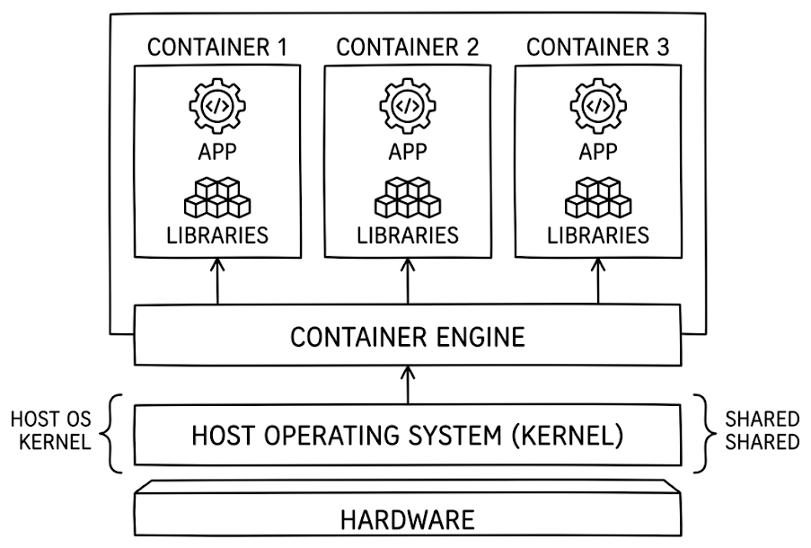
*그림 2-4: 컨테이너 가상화 구조*

컨테이너마다 파일시스템, 네트워크, 프로세스 공간이 분리되어 있어서 컨테이너 A에서 설치한 라이브러리가 컨테이너 B에 영향을 주지 않습니다.

### 2.1.3 Docker : 이미지에서 컨테이너까지

> **오픈이**: "근데 Docker가 이 컨테이너를 어떻게 만드는 건데요?"

선배가 터미널을 열었습니다.

> **선배**: "명령어 하나 따라가 봐. 흐름이 보일 거야."

**[참고]** nginx 컨테이너를 실행하는 명령어입니다.

```bash
docker run nginx   # nginx 컨테이너 실행
```

> **선배**: "이거 실행하면 **Docker 엔진** 이 요청을 받거든. 근데 Docker 엔진이 직접 컨테이너를 만드는 건 아니야. OS **커널** 한테 '격리된 프로세스 하나 만들어 줘' 하고 요청하는 거야."

> **커널(Kernel)** 은 운영체제(OS)의 핵심 구성 요소로, 프로세스를 만들고 실행 순서를 정하며, 프로세스끼리 서로 간섭하지 않도록 메모리를 보호합니다.

Docker 엔진의 요청을 받은 커널은 격리된 환경에서 새 프로세스를 만듭니다. 이것이 컨테이너입니다.

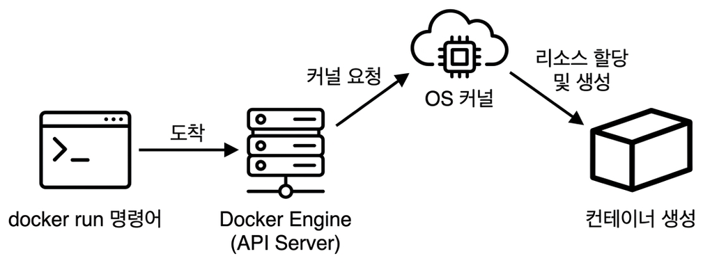
*그림 2-5: docker run 실행 흐름*

### 2.1.4 Docker 이미지

> **오픈이**: "잠깐, 컨테이너가 격리된 프로세스면 안에 뭐가 들어 있는 거예요?"
>
> **선배**: "좋은 질문이야. 컨테이너가 빈 깡통은 아니거든. 뭔가 담겨 있어야 실행이 되잖아. 그게 바로 **이미지**야."

이미지는 컨테이너를 만들기 위한 패키지입니다. 안에는 OS의 기본 라이브러리(커널 제외)와 애플리케이션, 설정 파일이 레이어(층)로 겹쳐 쌓인 구조입니다. 이미지는 붕어빵 틀과 같습니다. 틀(이미지) 하나로 붕어빵(컨테이너)을 여러 개 찍어낼 수 있고, 틀 자체는 변하지 않습니다.

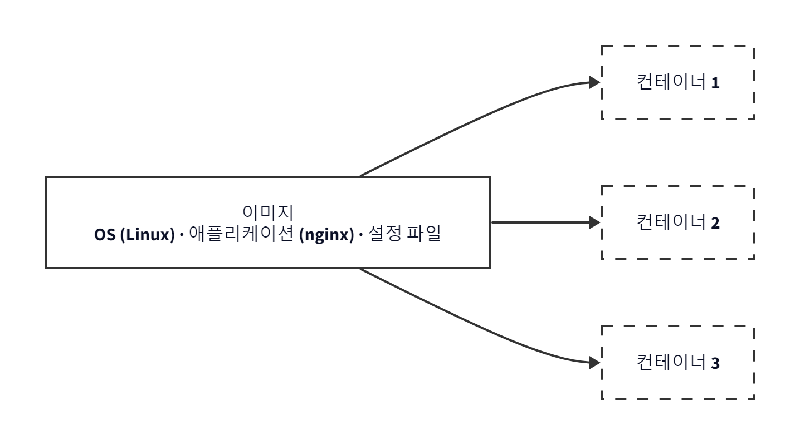
*그림 2-6: 하나의 이미지로 여러 컨테이너를 만들 수 있다*

이미지는 **Docker Hub** 라는 저장소에서 가져다 쓸 수 있습니다. 직접 이미지를 만들어 Docker Hub에 올릴 수도 있습니다.

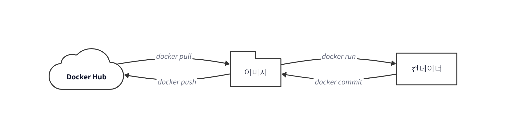
*그림 2-7: Docker의 흐름*

전체 흐름을 정리하면 이렇습니다. Docker Hub에서 이미지를 내려받아 컨테이너를 실행하고, 컨테이너 안에서 작업한 뒤 수정한 내용을 새 이미지로 저장합니다. 이 이미지를 Docker Hub에 올리면 다른 사람도 가져다 쓸 수 있습니다.

오픈이는 이 흐름이 머릿속에 그려지기 시작했습니다.

> **오픈이**: "이미지 받고, 컨테이너 만들고, 수정하고, 다시 이미지로 저장하고... 직접 해보면 확 와닿겠는데요?"
>
> **선배**: "그럼 직접 해보자."

---

## 2.2 Docker Desktop : 설치

1. [Docker 공식 사이트](https://www.docker.com/products/docker-desktop/)에 접속하여 자신의 OS에 맞는 **Docker Desktop** 을 다운로드합니다.
2. 다운로드한 설치 파일을 실행하고, 안내에 따라 설치합니다.
3. 설치가 끝나면 Docker Desktop을 실행합니다.

> **Windows** 의 경우 Docker Desktop 설치 전에 **WSL2(Windows Subsystem for Linux 2)** 를 먼저 설치해야 합니다. Docker는 Linux 커널 기능을 사용해 컨테이너를 실행하는데 Windows에는 Linux 커널이 없으므로, WSL2에서 Linux 커널을 제공받아야 합니다.

설치가 끝났다면 터미널에서 다음 명령어로 정상 설치 여부를 확인합니다.

**[실습]** Docker 설치 상태를 확인하는 명령어입니다.

```bash
docker version   # Docker 버전 확인
```

Client와 Server 정보가 모두 출력되면 Docker가 정상적으로 설치된 것입니다.


## 2.3 Docker CLI : 기본 명령어

오픈이는 선배 옆에 앉아 터미널을 열었습니다.

> **오픈이**: "이론은 알겠는데, 진짜 돌려보고 싶거든요."
>
> **선배**: "좋아, 이미지 내려받는 것부터 해보자."

### 2.3.1 docker pull : 이미지 다운로드

`docker pull` 명령어는 Docker Hub에서 이미지를 내려받습니다.

**[실습]** nginx 이미지를 다운로드하는 명령어입니다.

```bash
docker pull nginx   # nginx 이미지 다운로드
```

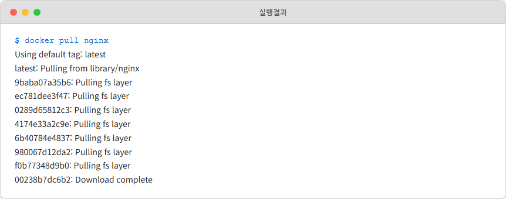
*그림 2-8: nginx 이미지 다운로드*

### 2.3.2 docker run : 컨테이너 실행

오픈이가 이미지를 내려받자마자 바로 실행해 보고 싶어졌습니다.

> **오픈이**: "이제 컨테이너 바로 띄워볼게요!"

**[실습]** nginx 이미지를 기반으로 컨테이너를 실행하는 명령어입니다. 실행하면 터미널이 잠기면서 추가 입력이 안 됩니다. 정상 동작이니 당황하지 마세요.

```bash
docker run nginx   # nginx 컨테이너 실행
```

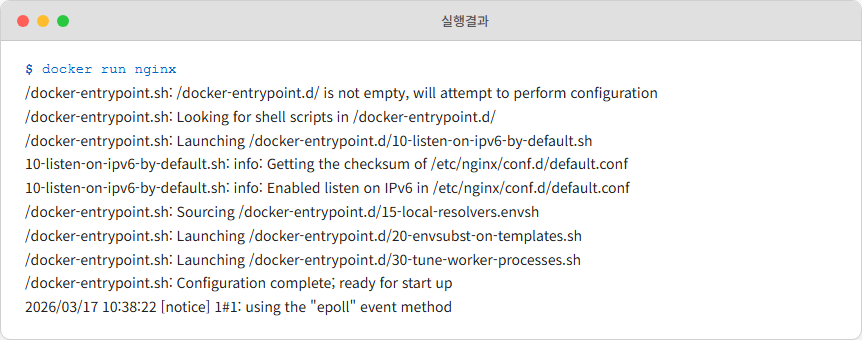
*그림 2-9: nginx 컨테이너 실행*

> **오픈이**: "어? 이게 끝이에요?"

오픈이는 명령어 한 줄만으로 컨테이너가 실행된 것에 놀랐습니다. 그런데 문제가 생겼습니다. 터미널에 추가로 명령어를 입력할 수 없었습니다.

> **선배**: "지금 **포그라운드** 상태거든. 컨테이너가 터미널 잡고 있어서 다른 명령어를 못 쳐. `CTRL + C` 누르면 빠져나올 수 있어."

### 2.3.3 docker run -d : 백그라운드 실행

> **오픈이**: "컨테이너 띄워놓고 터미널도 쓸 수 있는 방법은 없어요?"
>
> **선배**: "있지. `-d` 옵션 붙이면 돼."

**[실습]** `-d` 옵션을 사용하여 nginx를 백그라운드에서 실행하는 명령어입니다.

```bash
docker run -d nginx   # -d : detached 모드
```

**컨테이너 ID** 가 출력되고 터미널은 입력 가능한 상태로 돌아옵니다. 컨테이너 ID는 실행할 때마다 달라집니다.

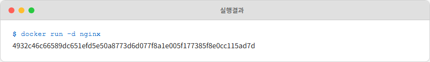
*그림 2-10: 백그라운드 실행 결과*

### 2.3.4 docker ps : 컨테이너 목록 출력

> **오픈이**: "근데 백그라운드면 진짜 돌아가고 있는 건지 어떻게 알아요?"
>
> **선배**: "`docker ps` 치면 바로 보여."

**[실습]** 실행 중인 컨테이너 목록을 출력하는 명령어입니다.

```bash
docker ps   # 실행 중인 컨테이너 출력
```

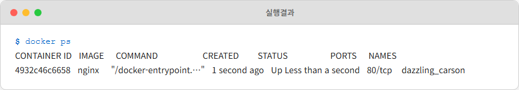
*그림 2-11: 컨테이너 목록 조회*

### 2.3.5 자주 사용하는 Docker 명령어

| 명령어 | 설명 | 예시 |
|--------|------|------|
| `docker pull <이미지명>` | Dockerhub에서 이미지 다운로드 | `docker pull nginx` |
| `docker images` | 로컬에 저장된 이미지 목록 조회 | `docker images` |
| `docker logs <컨테이너ID>` | 컨테이너 로그 출력 | `docker logs 057c` |
| `docker ps -a` | 종료된 컨테이너 포함 전체 목록 출력 | `docker ps -a` |
| `docker stop <컨테이너ID>` | 실행 중인 컨테이너 종료 | `docker stop 057c` |
| `docker rm <컨테이너ID>` | 종료된 컨테이너 삭제 | `docker rm 057c` |
| `docker rmi <이미지ID>` | 이미지 삭제 (`-f`로 강제 삭제) | `docker rmi -f fb01` |

---

## 2.4 포트포워딩과 컨테이너 네트워크

오픈이는 nginx를 띄우는 데까지 성공했습니다. 그런데 브라우저에서 `localhost`로 접속하면 아무것도 나오지 않았습니다.

> **오픈이**: "분명 nginx 돌고 있는데 왜 접속이 안 되는 거지?"
>
> **선배**: "호텔 방에서 외부 전화 받으려면 어떻게 해야 돼?"
>
> **오픈이**: "프런트에서 연결해 줘야... 아! 포트포워딩인가요?"

### 2.4.1 Ubuntu 컨테이너 실행

포트포워딩을 직접 확인하기 위해 Ubuntu 환경을 준비합니다.

**[실습]** Ubuntu 컨테이너를 실행하는 명령어입니다. `-p 80:80`은 포트포워딩 설정으로, 호텔 프런트에서 "305호 손님 찾습니다" 하면 내선전화로 연결해주는 것과 같은 원리입니다.

```bash
docker run -it -p 80:80 ubuntu   # 호스트의 80포트로 요청 시 컨테이너의 80포트로 요청 전달
```

> **포트포워딩(Port Forwarding)** 은 호스트 PC의 특정 포트로 들어오는 요청을 컨테이너 내부의 포트로 전달하는 기능입니다. **-p 호스트포트:컨테이너포트** 형식으로 사용합니다. 예를 들어, **-p 9000:8080** 은 호스트의 9000번 포트로 들어온 요청을 컨테이너의 8080번 포트로 전달합니다.

`-it` 옵션은 `-i`(입력 가능), `-t`(터미널 환경 제공)를 조합한 옵션입니다.

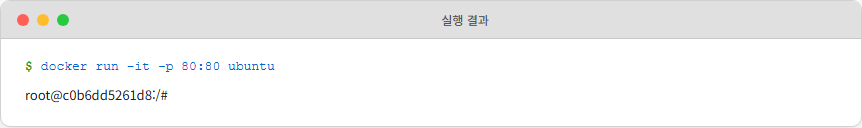
*그림 2-12: Ubuntu 컨테이너 실행*

### 2.4.2 nginx 설치 및 실행

**[실습]** 패키지 목록 갱신 후 nginx를 설치하고 실행하는 명령어입니다.

```bash
apt update           # 패키지 목록 갱신
apt install -y nginx # 패키지 설치
nginx                # 패키지 실행
```

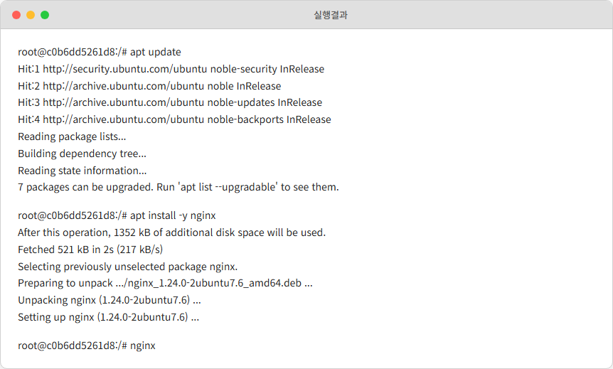
*그림 2-13: nginx 설치 및 실행*

80 포트가 열리면 브라우저에 `localhost:80`으로 접속하여 nginx 페이지가 응답하는지 확인합니다.

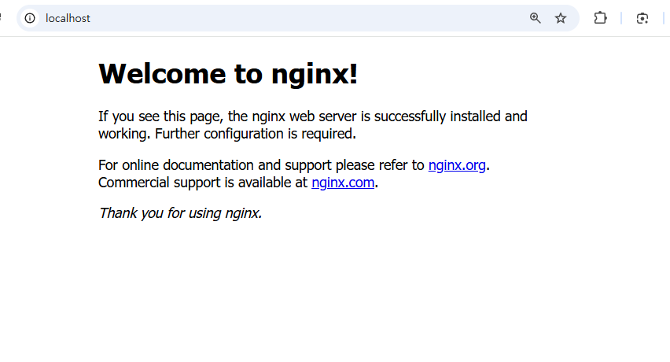
*그림 2-14: nginx 페이지 응답*

오픈이는 브라우저에 nginx 환영 페이지가 뜨는 것을 보며 환호했습니다.

> **오픈이**: "접속 됐어요! 근데 `-p 80:80` 한 줄이 실제로 뭘 하는 건데요?"

선배가 돋보기를 꺼내 들었습니다.

> **네트워크 돋보기: 포트포워딩의 정체 --- Namespace + DNAT**
>
> 네트워크에서 **IP**는 "어떤 컴퓨터인지", **포트**는 "그 컴퓨터의 어떤 프로그램인지"를 가리키는 주소입니다. 예를 들어 `192.168.0.10:80`은 "192.168.0.10 컴퓨터의 80번 포트에서 실행 중인 프로그램"을 의미합니다.
>
> **-p 80:80** 한 줄 뒤에서 Docker는 두 가지 일을 합니다. 첫째, 컨테이너를 위한 **Network Namespace**(독립된 네트워크 공간)를 만들어 호스트와 격리합니다. 컨테이너는 자기만의 IP(**172.17.0.x**)를 받고, 호스트와는 **veth pair**(가상 이더넷 케이블)로 연결됩니다.
>
> 둘째, 호스트의 iptables에 **DNAT** 규칙을 추가합니다. "호스트의 80번 포트로 들어오는 패킷은 목적지를 **172.17.0.2:80** 으로 바꿔라." 이것이 포트포워딩의 정체입니다. 집 공유기에서 "외부 8080 -> 내부 192.168.1.10:80" 규칙을 추가하는 것과 같은 원리입니다.
>
> 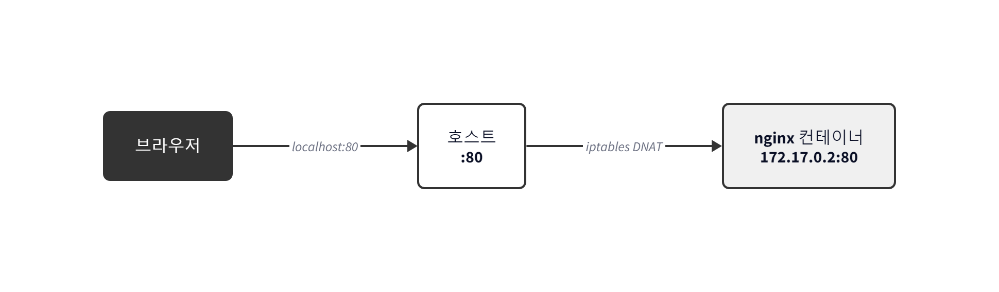
> *그림 2-15: 포트매핑의 정체 --- iptables DNAT*
>
> 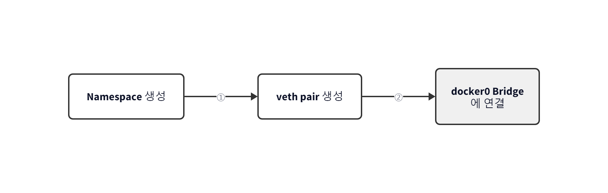
> *그림 2-16: docker run 시 벌어지는 일 --- Namespace, veth pair, docker0 연결*
>
> 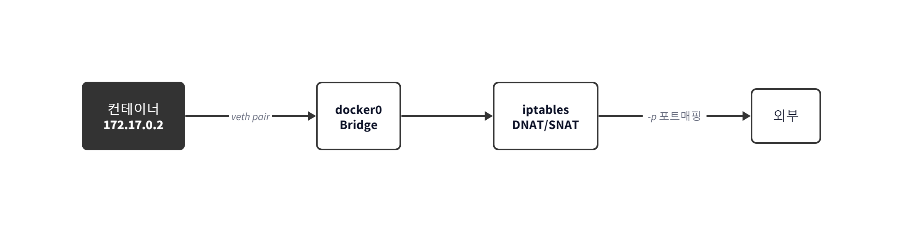
> *그림 2-17: 컨테이너와 외부 통신 --- docker0, iptables, 포트매핑*
>
> **한 줄 정리**: `-p 80:80` 뒤에서 Docker는 Network Namespace로 격리하고, iptables DNAT로 포트를 매핑합니다.

---

## 2.5 컨테이너 생명주기

오픈이는 컨테이너에서 `exit`를 입력하고 빠져나왔습니다. `docker ps`를 쳐보니 목록에 아무것도 없었습니다.

> **오픈이**: "내가 만든 컨테이너가 사라진 거예요?!"
>
> **선배**: "당황하지 마. `docker ps -a`로 확인해 봐. 종료된 상태로 남아 있거든. 삭제한 게 아니니까 데이터도 그대로야. 근데 빠져나오는 방법에 따라 컨테이너가 꺼지느냐 계속 도느냐가 달라져."

### 2.5.1 exit vs detach

실행 중인 컨테이너에서 빠져나오는 방법에 따라 컨테이너가 종료될 수도 있고 계속 살아있을 수도 있습니다.

**[실습]** exit로 빠져나오면 컨테이너가 종료됩니다.

```bash
docker run -it --name dead ubuntu   # dead라는 이름의 ubuntu 컨테이너 실행
exit                                 # 컨테이너 종료
docker ps                            # 실행 중인 컨테이너 확인 → 없음
```

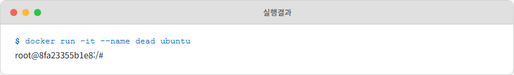
*그림 2-18: 컨테이너 실행*

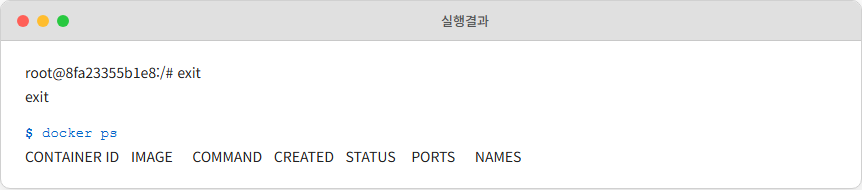
*그림 2-19: exit 후 컨테이너 종료*

> **오픈이**: "진짜 없어졌는데요..."
>
> **선배**: "이번엔 다른 방법으로 해봐."

**[실습]** `CTRL + P` -> `CTRL + Q`로 빠져나오면 컨테이너가 살아있습니다.

```bash
docker run -it --name alive ubuntu   # alive라는 이름의 ubuntu 컨테이너 실행
# CTRL + P → CTRL + Q 입력
docker ps                            # alive 컨테이너가 그대로 실행 중
```

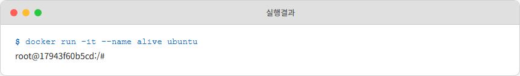
*그림 2-20: alive 컨테이너 실행*

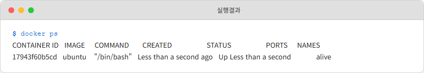
*그림 2-21: 프로세스 유지 확인*

오픈이가 눈이 동그래졌습니다.

> **오픈이**: "`exit`는 프로세스를 끄는 거고, `CTRL + P, Q`는 연결만 끊는 거네요!"

### 2.5.2 -dit : 백그라운드 인터랙티브 실행

| 옵션 | 역할 |
|------|------|
| `-d` | 백그라운드 실행 (detached) |
| `-i` | 입력 가능한 상태 유지 (interactive) |
| `-t` | 터미널 환경 제공 (TTY) |

nginx처럼 요청을 기다리는 서버는 `-d`만으로 충분하지만, ubuntu처럼 메인 프로세스가 bash인 컨테이너는 `-dit`를 써야 백그라운드에서 유지됩니다.

**[실습]** -dit 옵션으로 ubuntu를 백그라운드에서 실행하는 명령어입니다.

```bash
docker run -dit ubuntu   # ubuntu 백그라운드 + 인터랙티브 실행
docker ps                # 정상 실행 확인
```

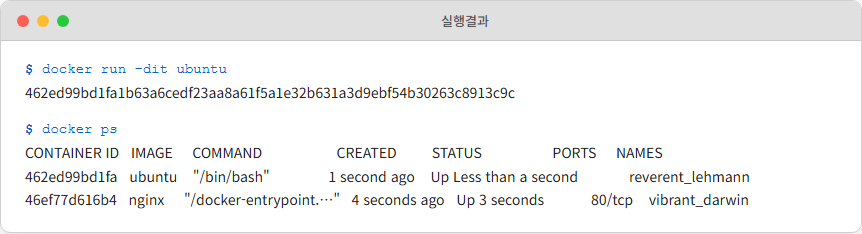
*그림 2-22: ubuntu -dit 실행*

### 2.5.3 exec : 실행 중인 컨테이너에 접근

> **오픈이**: "근데 백그라운드에서 돌고 있는 컨테이너 안으로 다시 들어가려면요?"
>
> **선배**: "`exec` 쓰면 돼. 실행 중인 컨테이너에 **새로운 프로세스** 를 하나 만들어서 들어가는 거야. 메인 프로세스(PID 1)에 영향 안 주니까 안전하고."

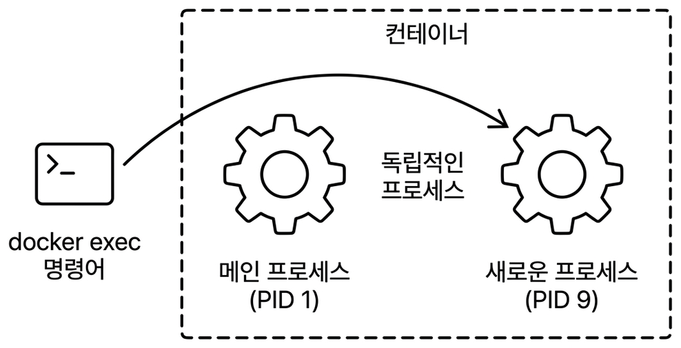
*그림 2-23: exec 명령어의 동작 방식*

**[실습]** exec 명령어로 컨테이너 내부에 새 프로세스를 생성하여 접근하는 명령어입니다.

```bash
docker exec -it d2b1 bash   # 실행 중인 컨테이너에 새 bash 접속
```

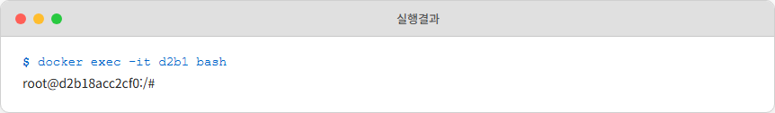
*그림 2-24: exec로 접근*

---

## 2.6 이미지 만들기

오픈이는 컨테이너를 만들고 다루는 법을 익혔습니다. 이번에는 다른 고민이 생겼습니다.

> **오픈이**: "이 환경을 동료한테 공유하고 싶은데, 지금 이 컨테이너 상태 그대로 넘길 수는 없나요?"
>
> **선배**: "컨테이너를 이미지로 만들면 돼. Tomcat으로 직접 해보자."

### 2.6.1 Tomcat : 이미지 내려받기 & 실행하기

**[실습]** Tomcat 컨테이너를 실행하는 명령어입니다.

```bash
docker run -d -p 8080:8080 tomcat   # Tomcat 컨테이너 백그라운드 실행
```

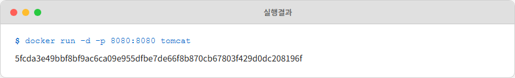
*그림 2-25: Tomcat 컨테이너 실행*

`docker ps`로 실행 중인 Tomcat 컨테이너를 확인합니다. **컨테이너 ID** 는 `5fcd`입니다.

오픈이가 브라우저에 `localhost:8080`으로 접속했습니다. 그런데 404 에러가 떴습니다.

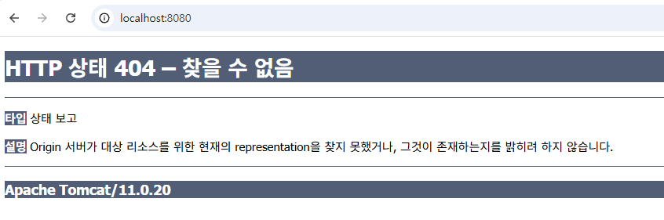
*그림 2-26: Tomcat 404 에러*

> **오픈이**: "에러 나는데요!"
>
> **선배**: "별도 컨트롤러 없으면 슬래시(/)로 들어온 요청은 서버 안에 index.html로 응답하거든. 근데 Tomcat 이미지에 기본 index.html이 없으니까 응답할 페이지가 없어서 404가 뜨는 거야."

### 2.6.2 Tomcat 컨테이너 수정 : index.html 만들기

> **오픈이**: "그럼 직접 만들면 되잖아요!"

Tomcat의 index.html 파일은 webapps/ROOT 폴더에 위치합니다. Tomcat 프로세스 내부로 접근해서 그 경로로 이동해 보겠습니다.

**[실습]** Tomcat 컨테이너 내부로 접근하는 명령어입니다.

```bash
docker exec -it 5fcd bash  # Tomcat 프로세스 연결
cd /usr/local/tomcat/webapps # webapps 경로 이동
```

> webapps 경로는 `find / -name webapps` 등으로 검색해 찾을 수 있습니다.

webapps 폴더에서 `ls` 명령어로 확인하면 내부가 비어 있습니다.

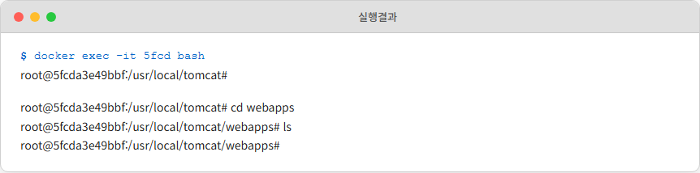
*그림 2-27: webapps 폴더 비어있음*

webapps 폴더에 ROOT 폴더를 만들고 그 안에 index.html 파일을 작성합니다.

**[실습]** vim 패키지를 설치하고 index.html 파일을 생성하는 명령어입니다.

```bash
mkdir ROOT          # ROOT 폴더 생성
cd ROOT             # ROOT 폴더로 이동

apt update          # 패키지 최신화
apt install -y vim  # vim 패키지 설치
vim index.html      # index.html 파일 생성
```

vim은 터미널 기반 텍스트 편집기입니다. 처음 열리면 **일반 모드**라서 바로 타이핑이 안 됩니다. `i` 키를 누르면 **입력 모드**로 전환되어 내용을 입력할 수 있고, 입력이 끝나면 `ESC`를 눌러 일반 모드로 돌아온 뒤 `:wq`를 입력하고 `ENTER`를 누르면 저장 후 종료됩니다. 실수로 잘못 입력했다면 `:q!`로 저장하지 않고 나갈 수 있습니다.

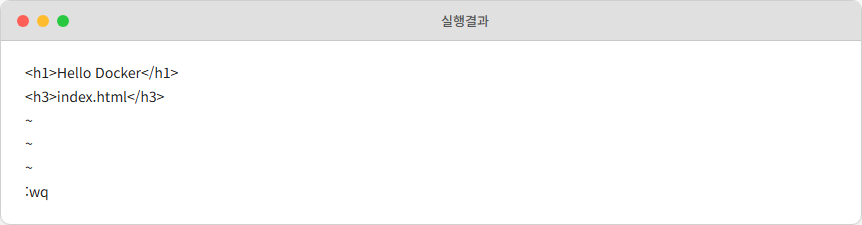
*그림 2-28: index.html 작성*

브라우저에서 `localhost:8080`으로 접속하면 방금 만든 index.html 페이지가 응답합니다.


*그림 2-29: index.html 응답 확인*

오픈이가 뿌듯하게 웃었습니다.

> **오픈이**: "페이지 떴어요!"

### 2.6.3 docker commit : 이미지 굽기

> **선배**: "좋아, 이제 이 상태를 이미지로 구워보자."

먼저 컨테이너에서 빠져나옵니다. `exec`로 만든 셸이므로 `exit`를 입력해도 컨테이너는 종료되지 않습니다. `CTRL+P`, `Q`도 동일하게 동작합니다.

> **docker commit <컨테이너ID> <dockerhub아이디/이미지명:태그>** 형태로 명령어를 작성합니다. Dockerhub에서 계정과 리포지토리를 찾는 데 사용되므로, 본인의 Dockerhub 아이디로 변경해야 합니다.

**[실습]** 컨테이너의 현재 상태를 새 이미지로 저장하는 명령어입니다.

```bash
docker commit 5fcd <본인-dockerhub-id>/tomcat   # 컨테이너 현재 상태를 이미지로 저장
```

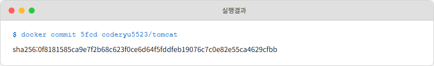
*그림 2-30: 이미지 커밋 완료*

### 2.6.4 docker push : Dockerhub에 저장

> **선배**: "이미지 만들어졌으면 이제 Dockerhub에 올려서 누구나 받을 수 있게 하자."

`docker login` 명령어로 Dockerhub에 로그인합니다. Dockerhub 계정이 없다면 [hub.docker.com](https://hub.docker.com/)에서 먼저 회원가입을 합니다.

**[실습]** Dockerhub에 로그인하는 명령어입니다.

```bash
docker login   # Dockerhub 로그인
```

Username과 Password를 입력한 뒤 ENTER를 누릅니다.

`docker push <이미지명>` 형태로 명령어를 실행하여 내 Dockerhub에 저장합니다.

**[실습]** 이미지를 Dockerhub에 업로드하는 명령어입니다.

```bash
docker push <본인-dockerhub-id>/tomcat   # 이미지를 Dockerhub에 업로드
```

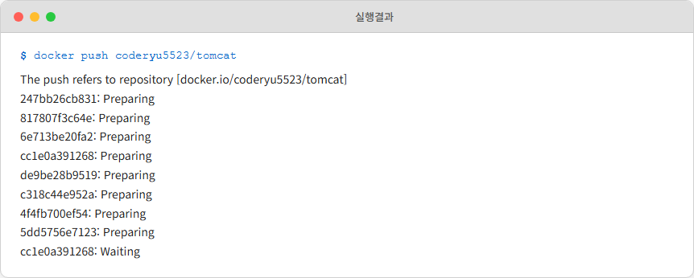
*그림 2-31: 이미지 푸시 완료*

Dockerhub의 Repositories 탭에서 올린 이미지를 확인할 수 있습니다.

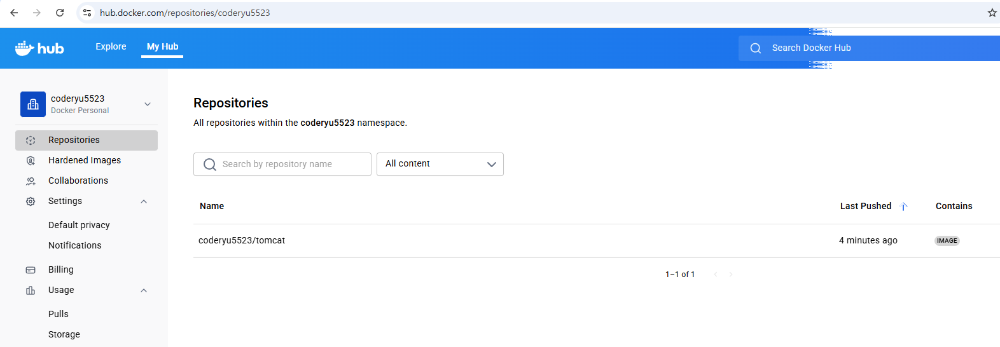
*그림 2-32: Dockerhub 저장소 확인*

오픈이가 감탄했습니다.

> **오픈이**: "이미지 하나면 누구든 같은 환경 그대로 쓸 수 있는 거네요!"

---

## 2.7 마운트 : 데이터 보존

오픈이는 실습을 마무리하며 컨테이너를 정리했습니다. 이전에 만든 컨테이너를 삭제하자 안에 저장해 둔 데이터까지 전부 사라졌습니다.

> **오픈이**: "DB 데이터 날아갔어요!"
>
> **선배**: "컨테이너 지우면 안에 있는 거 다 날아가. 휘발성이거든. 중요한 데이터나 로그는 **마운트**로 밖에 빼놔야 돼."

> **마운트(Mount)** 는 컨테이너 내부의 경로를 외부 저장소에 연결하는 기능입니다. 마운트를 사용하면 컨테이너가 삭제되어도 데이터는 외부에 그대로 남아 있습니다.

Docker는 두 가지 마운트 방식을 제공합니다. 로컬 PC의 폴더에 직접 연결하는 **바인드 마운트(Bind Mount)** 와 Docker가 관리하는 저장소를 사용하는 **볼륨 마운트(Volume Mount)** 입니다.

### 2.7.1 바인드 마운트 : 호스트 폴더를 직접 연결

> **바인드 마운트(Bind Mount)** 는 호스트 PC의 실제 폴더를 그대로 컨테이너 내부에 연결하는 방식입니다.

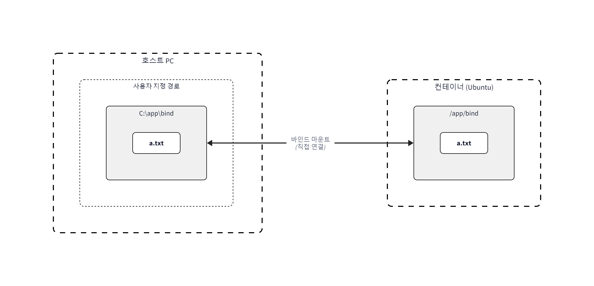
*그림 2-33: 호스트 PC의 폴더와 컨테이너 내부 폴더가 직접 연결*

**[실습]** 바인드 마운트를 설정하여 ubuntu 컨테이너를 실행하는 명령어입니다.

먼저 호스트에 마운트할 폴더를 생성합니다. 바인드 마운트는 호스트에 해당 경로가 존재해야 동작합니다.

```bash
# Windows
mkdir C:\app\bind

# Mac / Linux
mkdir -p ~/app/bind
```

```bash
# Windows
docker run -it --mount type=bind,src=C:/app/bind,dst=/app/bind ubuntu

# Mac / Linux
docker run -it --mount type=bind,src=$HOME/app/bind,dst=/app/bind ubuntu
```

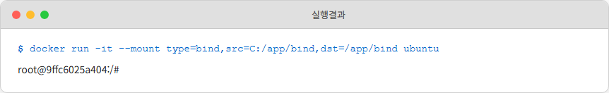
*그림 2-34: 바인드 마운트 실행*

명령어를 실행하면 호스트의 `bind` 폴더와 컨테이너 내부의 `/app/bind` 폴더가 연결됩니다.

**[실습]** 마운트된 폴더에 파일을 생성하는 명령어입니다.

```bash
touch /app/bind/a.txt
```

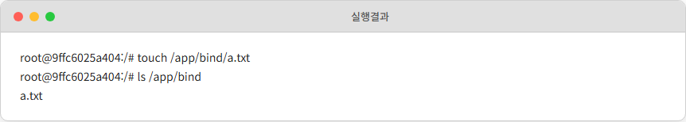
*그림 2-35: 파일 생성 확인*

생성한 파일이 PC의 하드디스크에 저장됩니다.

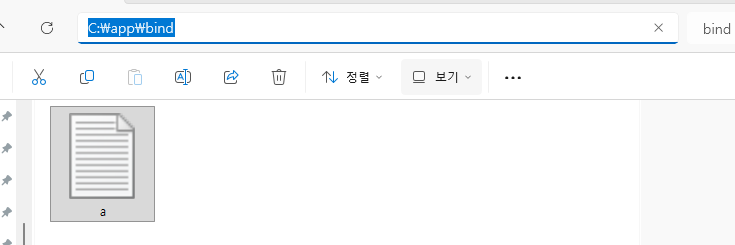
*그림 2-36: 호스트 PC에 저장 확인*

오픈이가 확인했습니다.

> **오픈이**: "컨테이너 안에서 만든 파일이 제 PC에도 있어요!"

실습 후 **exit** 명령어로 컨테이너를 빠져나옵니다.

### 2.7.2 볼륨 마운트 : Docker가 관리하는 저장소

> **볼륨 마운트(Volume Mount)** 는 Docker 엔진 내부의 전용 저장 공간(Volume)을 컨테이너 폴더와 연결하는 방식입니다.

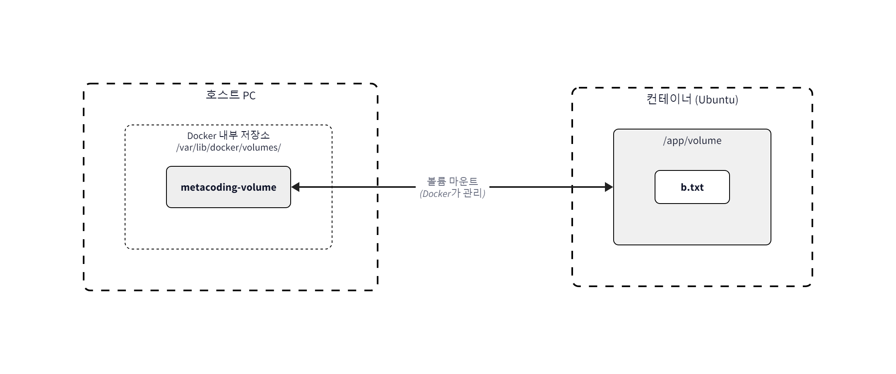
*그림 2-37: Docker 엔진이 관리하는 내부 저장 공간에 데이터 저장*

**[실습]** 볼륨 마운트를 설정하여 ubuntu 컨테이너를 실행하는 명령어입니다.

```bash
docker run -it --mount type=volume,src=metacoding-volume,dst=/app/volume ubuntu   # 볼륨 마운트로 ubuntu 실행
```

`/app/volume` 폴더가 자동으로 생성됩니다. 여기에 파일을 만들어 보겠습니다.

**[실습]** 볼륨 마운트된 폴더에 파일을 생성하는 명령어입니다.

```bash
touch /app/volume/b.txt
```

`exit` 명령어로 컨테이너를 종료한 뒤 볼륨 정보를 확인합니다.

**[실습]** 컨테이너 종료 후 볼륨이 유지되는지 확인하는 명령어입니다.

```bash
exit
docker volume ls
```

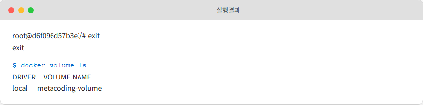
*그림 2-38: 볼륨 유지 확인*

컨테이너는 종료되었지만 볼륨은 유지되고 있습니다. 새 컨테이너에 같은 볼륨을 연결하면 이전 데이터를 그대로 사용할 수 있습니다.

**[실습]** 새로운 컨테이너에서 기존 볼륨의 데이터를 확인하는 명령어입니다.

```bash
docker run -it --mount type=volume,src=metacoding-volume,dst=/app/volume ubuntu   # 볼륨 마운트로 ubuntu 재실행
ls /app/volume
```

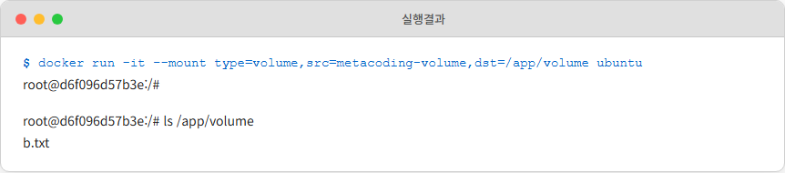
*그림 2-39: 볼륨 데이터 재사용*

오픈이가 감탄했습니다.

> **오픈이**: "컨테이너를 새로 만들었는데 이전 데이터가 그대로 있잖아요!"

새로 만든 컨테이너에서도 이전 컨테이너가 쓰던 볼륨의 데이터를 그대로 볼 수 있습니다. 볼륨이 컨테이너와 독립적으로 유지되기 때문입니다.

| 구분 | 바인드 마운트 | 볼륨 마운트 |
|------|------------|-----------|
| 저장 위치 | 호스트 PC의 지정 폴더 | Docker 엔진 내부 저장 공간 |
| 관리 주체 | 사용자 직접 관리 | Docker 엔진이 관리 |
| 경로 지정 | 절대 경로 필요 | 볼륨 이름만 지정 |
| 사용 사례 | 개발 중 소스 코드 공유, 설정 파일 연결 | DB 데이터 보존, 컨테이너 간 데이터 공유 |

---

## 이것만은 기억하자

- **이미지는 레시피, 컨테이너는 요리.** 하나의 이미지로 여러 컨테이너를 만들 수 있고, 수정한 컨테이너는 `commit`으로 새 이미지를 만들어 Dockerhub에 공유할 수 있습니다.
- **마운트는 외부 USB.** 컨테이너가 사라져도 마운트로 연결한 데이터는 외부에 안전하게 남아있습니다.
- **포트포워딩은 호텔 프런트.** 호스트의 포트로 들어온 요청을 컨테이너 내부의 포트로 전달합니다.

오픈이는 이제 컨테이너 하나를 만들 수 있게 되었습니다. 이미지도 만들고, Dockerhub에 공유하고, 데이터도 보존할 수 있습니다. 하지만 실제 서비스는 컨테이너 하나로 끝나지 않습니다. 웹 서버, 백엔드 API, 데이터베이스를 각각 컨테이너로 띄워야 하고, 사용자가 늘면 같은 서버를 여러 대 복제해야 합니다. 컨테이너를 하나씩 따로 실행하고 관리하는 건 한계가 있습니다.

> **오픈이**: "선배, 컨테이너를 여러 개 한꺼번에 관리하는 방법도 있어요?"
>
> **선배**: "다음 장에서 알려줄게."
