# 챕터 3. Docker 다루기

## 학습 목표
- Dockerfile로 컨테이너 환경 구성을 자동화합니다.
- NGINX로 경로 기반 라우팅과 로드밸런싱을 구현합니다.
- Redis로 여러 서버 간 세션을 공유합니다.
- Docker Compose로 여러 컨테이너를 한 번에 실행하고 관리합니다.
- 프론트엔드, 백엔드, DB가 연동되는 풀스택 웹사이트를 만듭니다.

---

2장을 마친 오픈이는 Docker의 기본기를 익혔습니다. 컨테이너를 띄우고, 이미지를 만들고, 공유하는 것까지. 하지만 컨테이너를 새로 만들 때마다 같은 패키지를 일일이 설치하는 게 은근히 번거로웠습니다.

> **오픈이**: "아 또 설치야? 매번 이러면 진짜 귀찮은데..."
>
> **선배**: "밀키트 알지? **Dockerfile** 이란 데 레시피를 적어두면 돼. 한 번 써두면 누가 돌려도 똑같은 환경이 나와."

---

## 3.1 Dockerfile : 환경 자동화

> **Dockerfile** 은 컨테이너 환경을 자동으로 구성하는 레시피입니다. 한 번 작성하면 누가, 어디서 실행해도 같은 환경이 만들어집니다.

### 3.1.1 Dockerfile에서 컨테이너까지

Dockerfile -> `docker build` -> 이미지 -> `docker run` -> 컨테이너

| 지시어 | 시점 | 역할 | 예시 |
|--------|------|------|------|
| `FROM` | 빌드 | 베이스 이미지 선택 | `FROM ubuntu:24.04` |
| `WORKDIR` | 빌드 | 작업 경로 설정 | `WORKDIR /app` |
| `COPY` | 빌드 | 호스트 파일을 이미지 내부로 복사 | `COPY index.html /app/` |
| `RUN` | 빌드 | 명령어 실행 (패키지 설치 등) | `RUN apt install -y vim` |
| `CMD` | 실행 | 컨테이너 시작 시 기본 명령 | `CMD ["/bin/bash"]` |
| `ENTRYPOINT` | 실행 | 컨테이너 시작 시 고정 명령 | `ENTRYPOINT ["nginx"]` |

### 3.1.2 실습 : Ubuntu + vim 이미지 만들기

> **선배**: "좋아, vim 깔린 Ubuntu 이미지 하나 만들어 봐."

선배가 오픈이에게 파일을 작성하게 했습니다.

**[작성]** `Dockerfile`을 아래와 같이 작성합니다.

```dockerfile
FROM ubuntu:24.04                      # Ubuntu 24.04 이미지 사용
RUN apt update && apt install -y vim   # vim 패키지 설치
CMD ["/bin/bash"]                      # 컨테이너 시작 시 bash 실행
```

> **오픈이**: "에? 이게 레시피 전부예요? 세 줄이면 끝이라고요?"
>
> **선배**: "그래, 세 줄이면 끝이거든. 빌드하고 돌려봐."

**[실습]** 이미지를 빌드하고 컨테이너를 실행합니다.

```bash
docker build -t ubuntu-vim .       # Dockerfile 기반 이미지 생성
docker run -it ubuntu-vim          # 컨테이너 실행
vim a.txt                          # vim이 설치되어 있는지 확인
```

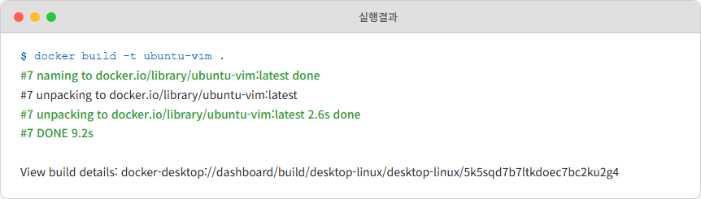
*그림 3-1: docker build 실행 결과*

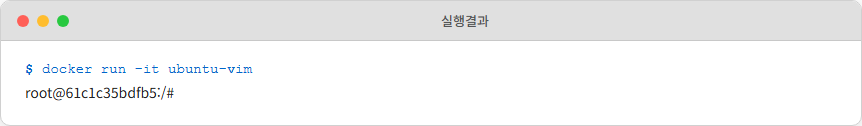
*그림 3-2: 컨테이너 실행 및 접속*

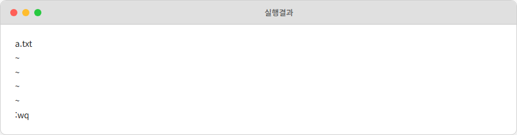
*그림 3-3: vim 에디터 실행 확인*

오픈이의 눈이 빛났습니다.

> **오픈이**: "vim이 바로 되는데요? 설치 명령 한 줄도 안 쳤는데!"

Dockerfile 하나면 컨테이너의 원하는 환경을 동일하게 재현할 수 있습니다.

다음 실습을 위해 실행한 컨테이너를 종료합니다.

```bash
docker stop $(docker ps -q)   # 실행 중인 컨테이너 모두 중지
docker rm $(docker ps -aq)    # 중지된 컨테이너 모두 삭제
```

Dockerfile을 익힌 오픈이에게 새로운 고민이 생겼습니다. 프로젝트가 점점 커지면서 프론트엔드 페이지도 필요하고, 백엔드 API도 따로 돌아가야 했습니다. 한 서버에 전부 때려넣자니 뒤엉켜서 관리가 안 됩니다.

> **오픈이**: "선배, 근데 서비스를 나눠서 돌리고 싶거든요. 프론트엔드랑 백엔드를 따로 띄우면 요청을 어떻게 나눠요?"
>
> **선배**: "NGINX 들어봤어? 요청 들어오면 URL 보고 알아서 맞는 서버로 보내주는 안내 데스크 같은 거야. 직접 해봐."

---

## 3.2 NGINX : 웹 서버와 리버스 프록시

> **NGINX**: 웹 서버이자 프록시 서버로, 정적 파일을 매우 빠르게 처리하고 백엔드 서버에 요청을 중계합니다. 로드밸런싱과 HTTPS 처리는 물론 캐싱 기능까지 제공해 대규모 트래픽을 안정적으로 처리하는 데 널리 사용됩니다.

오픈이가 찾아본 NGINX는 안내 데스크처럼 방문객을 적절한 담당자에게 연결해 주는 역할이었습니다. 클라이언트가 서버로 요청을 보내면 NGINX가 가장 앞단에서 요청을 분석한 뒤 로드밸런싱, 정적 파일 제공 등의 처리를 담당합니다.

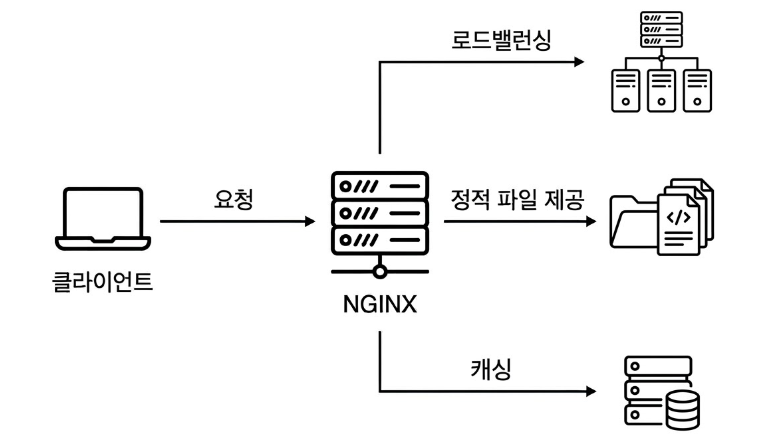
*그림 3-4: NGINX의 주요 기능*

> **리버스 프록시**: NGINX처럼 서버를 대신해 요청을 받는 서버를 리버스 프록시라고 합니다. 서버를 외부에 직접 노출하지 않도록 보호하고 들어오는 트래픽을 분산해 서버의 부하를 줄여줍니다.

### 3.2.1 경로 기반 라우팅 : URL로 요청을 나누다

> **경로 기반 라우팅**: 클라이언트가 요청한 URL 경로를 기준으로 해당 서버나 서비스로 트래픽을 전달하는 방식입니다.

오픈이의 서비스에는 프론트엔드(app1)와 백엔드(app2)가 따로 있습니다. 클라이언트가 `/app1`, `/app2` 경로로 요청을 보내면 NGINX는 그 경로에 매핑된 서버로 요청을 전달합니다. 선배가 말한 "안내 데스크"의 정체가 바로 이것이었습니다.

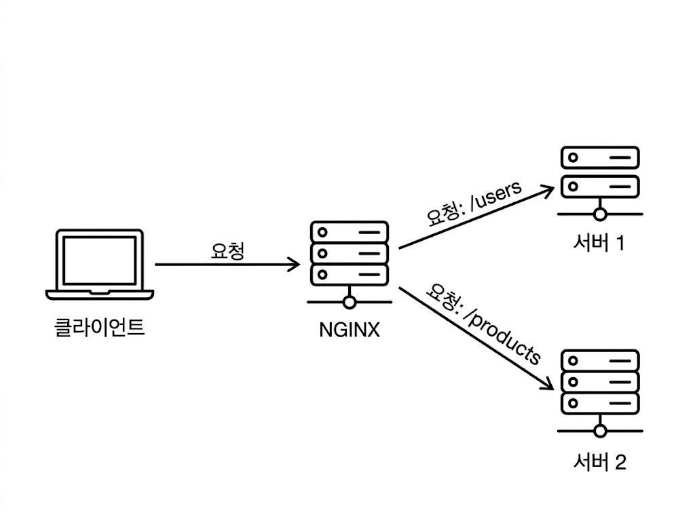
*그림 3-5: 경로 기반 라우팅 구조*

#### 실습해보기

> 실습 코드는 https://github.com/metacoding-10-linux-docker/docker/tree/master/ex01 에서 확인할 수 있습니다.

app1, app2, lb 폴더에 있는 Dockerfile은 개별 이미지를 생성하며, 각각 독립적인 컨테이너로 실행됩니다.

**[EX01 패키지 구조]**

```
ex01/
├── app1/                # 첫 번째 웹 서버
│   ├── Dockerfile
│   └── index.html
├── app2/                # 두 번째 웹 서버
│   ├── Dockerfile
│   └── index.html
└── lb/                  # 로드밸런서 (NGINX)
    ├── Dockerfile
    └── nginx.conf       # 라우팅 설정
```

#### lb 이미지

lb 폴더의 Dockerfile은 로컬에 있는 nginx.conf를 컨테이너 내부로 복사하여 이미지를 생성합니다.

**[참고]** `lb/Dockerfile`

```dockerfile
FROM nginx                                          # NGINX 이미지 사용
COPY nginx.conf /etc/nginx/conf.d/default.conf      # 로컬의 nginx.conf를 컨테이너의 NGINX 설정 경로로 복사
ENTRYPOINT ["nginx", "-g", "daemon off;"]            # NGINX를 포그라운드로 실행
```

오픈이가 nginx.conf를 열어보았습니다. NGINX가 어떤 방식으로 요청을 처리할지 정의하는 파일입니다.

**[참고]** `lb/nginx.conf`

```nginx
upstream app1 {                           # 요청을 전달할 목적지를 app1이라는 이름으로 등록
    server host.docker.internal:8000;     # 이 그룹에 속한 서버 (여러 개 등록하면 자동 분산)
}

upstream app2 {                           # "app2" 서버 그룹
    server host.docker.internal:9000;
}

server {
    listen 80;
    server_name localhost;

    location /app1 {                  # /app1 경로 요청을 잡아서
        proxy_pass http://app1/;      # proxy_pass에 등록된 서버로 전달
    }

    location /app2 {
        proxy_pass http://app2/;
    }
}
```

여러 설정이 있지만 핵심은 `location`과 `upstream` 두 블록입니다. `location`은 "이 경로로 들어오면"이라는 조건이고, `upstream`은 **"여기로 보내라"라는 목적지입니다.** `proxy_pass`가 이 둘을 연결합니다.

오픈이가 이 설정이 실제로 어떻게 동작하는지 따라가 보았습니다. 브라우저에서 `localhost:80/app1`을 입력한 경우입니다.

브라우저 요청이 호스트 PC의 80번 포트로 들어옵니다. 이 포트는 `-p 80:80`으로 lb 컨테이너와 연결되어 있으므로, 요청이 lb 컨테이너의 NGINX에 도달합니다.

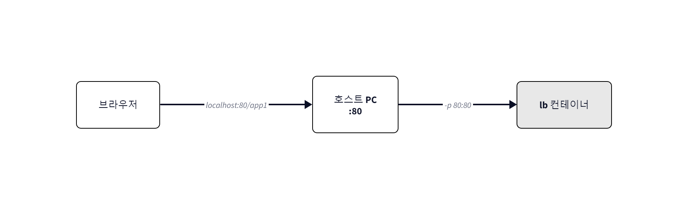
*그림 3-6: 브라우저 → lb 컨테이너*

NGINX는 요청 경로가 `/app1`인 것을 보고 `location /app1` 블록에 매칭합니다. 이 블록 안의 `proxy_pass http://app1`이 요청을 `upstream app1`으로 넘깁니다.

그러면 upstream app1에 등록된 서버 주소 `host.docker.internal:8000`으로 요청이 전달됩니다. 여기서 오픈이는 한 가지 의문이 들었습니다.

> **오픈이**: "어? 근데 왜 app1 주소를 직접 안 쓰고 `host.docker.internal`을 쓰는 거지?"

이 예제에서는 컨테이너를 `docker run`으로 각각 따로 실행합니다. 이렇게 개별 실행된 컨테이너들은 서로의 존재를 모르기 때문에, lb 컨테이너가 app1 컨테이너를 직접 찾을 수 없습니다. 대신 호스트 PC를 경유해야 합니다.

> **host.docker.internal** 은 컨테이너 안에서 '호스트 PC'를 가리키는 특수한 주소입니다. 컨테이너 내부에서 localhost를 입력하면 호스트 PC가 아닌 컨테이너 자기 자신을 가리키게 됩니다. 따라서 바깥에 있는 호스트 PC로 요청을 보낼 때는 반드시 이 주소를 사용해야 합니다.

`host.docker.internal:8000`은 호스트 PC의 8000번 포트를 가리킵니다. 이 포트는 `-p 8000:80`으로 app1 컨테이너와 연결되어 있으므로, 최종적으로 app1 컨테이너에 도달합니다.

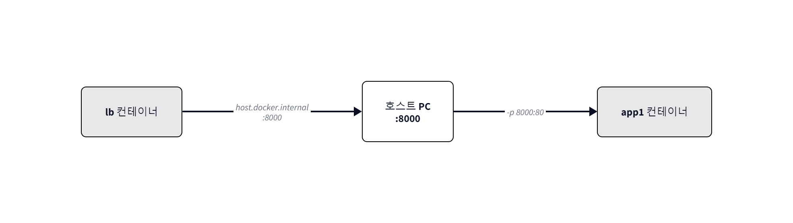
*그림 3-7: upstream → 호스트 PC → app1 컨테이너*

> **네트워크 돋보기: 왜 컨테이너끼리 직접 통신이 안 될까?**
>
> **docker run** 으로 개별 실행한 컨테이너들은 모두 기본 브리지(**docker0**)에 연결됩니다. 기본 브리지에서는 **DNS가 작동하지 않으므로** 컨테이너 이름으로 서로를 찾을 수 없습니다. IP 주소를 직접 알아내서 쓸 수는 있지만, 컨테이너가 재시작되면 IP가 바뀌므로 실용적이지 않습니다.
>
> 그래서 호스트 PC를 경유하는 우회 경로(**host.docker.internal**)를 쓸 수밖에 없습니다. 3.4절에서 배울 **사용자 정의 네트워크** 를 사용하면 이 우회 없이 컨테이너 이름으로 직접 통신할 수 있게 됩니다.
>
> **한 줄 정리**: 기본 브리지에서는 DNS가 작동하지 않아 컨테이너 이름으로 통신할 수 없습니다.

오픈이는 고개를 끄덕였습니다.

> **오픈이**: "아, 지금은 컨테이너를 따로따로 띄우니까 서로를 모르는 거구나. 그래서 호스트를 거치는 거고..."

이제 이미지를 빌드하고 실행해보겠습니다.

**[실습]** EX01 폴더로 이동 후, 터미널에서 app1, app2, lb 이미지를 빌드하고 컨테이너를 실행합니다.

```bash
# 서버 1 실행
docker build -t app1 ./app1       # app1 이미지 빌드
docker run -dit -p 8000:80 app1   # 호스트 8000번 포트 → 컨테이너 80번 포트

# 서버 2 실행
docker build -t app2 ./app2       # app2 이미지 빌드
docker run -dit -p 9000:80 app2   # 호스트 9000번 포트 → 컨테이너 80번 포트

# lb 실행
docker build -t lb ./lb
docker run -dit -p 80:80 lb
```

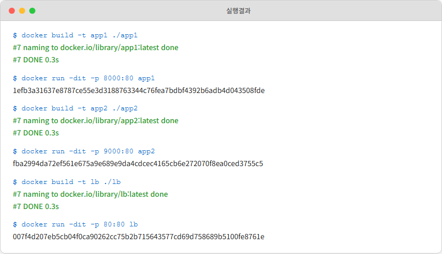
*그림 3-8: Docker Desktop에서 컨테이너 확인*

오픈이가 브라우저에서 `localhost:80/app1`으로 요청을 보내자 `app1` 서버가 응답했습니다.

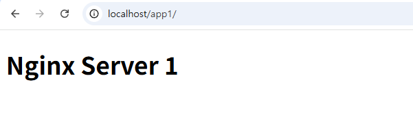
*그림 3-9: /app1 경로 응답 결과*

`localhost:80/app2`로 요청을 보내면 `app2` 서버가 응답합니다.

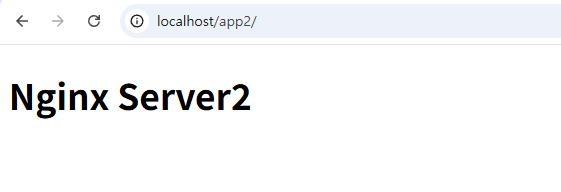
*그림 3-10: /app2 경로 응답 결과*

> **오픈이**: "오, 된다!"

오픈이의 눈이 반짝였습니다. URL 경로만 바꿨을 뿐인데 서로 다른 서버가 응답합니다. 선배가 말한 안내 데스크가 바로 이런 거였습니다.

다음 실습을 위해 실행한 서버를 종료합니다.

```bash
docker stop $(docker ps -q)   # 실행 중인 컨테이너 모두 중지
docker rm $(docker ps -aq)    # 중지된 컨테이너 모두 삭제
```


---

## 3.3 로드밸런싱

오픈이의 서비스에 사용자가 점점 늘어났습니다. 처음에는 서버 한 대로 충분했는데 접속이 몰리면서 응답이 느려지기 시작했습니다.

> **오픈이**: "선배, 서버가 느려졌는데요. 이거 어떻게 해요?"
>
> **선배**: "같은 서버 2대 돌리면 되잖아. 트래픽 나눠 받으면 돼."
>
> **오픈이**: "근데 요청을 어떻게 나눠요? 사용자한테 '니는 1번, 니는 2번' 이렇게 안내하는 건 아닐 테고..."
>
> **선배**: "NGINX upstream에 서버 여러 개 등록하면 어떻게 될 것 같아? 직접 해봐."

### 3.3.1 라운드 로빈 : 요청을 골고루 나누다

놀이공원 매표소가 3개 있을 때, 손님을 1번 → 2번 → 3번 → 1번 순서로 배정하는 것처럼 **라운드 로빈(Round-Robin)** 은 여러 서버에 요청을 순차적으로 번갈아 가며 분배하는 로드밸런싱 방식입니다.

NGINX에서는 `upstream` 블록에 서버를 여러 개 등록하면, 별도 설정 없이 기본적으로 라운드 로빈 방식이 적용됩니다.

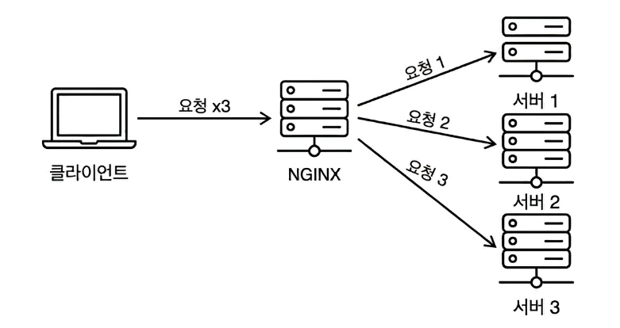
*그림 3-11: 라운드 로빈 로드밸런싱 구조*

#### 실습해보기

> 실습 코드는 https://github.com/metacoding-10-linux-docker/docker/tree/master/ex02 에서 확인할 수 있습니다.

**[EX02 패키지 구조]**

```
ex02/
├── app1/                # 웹 서버 (2개 컨테이너로 실행)
│   ├── Dockerfile
│   └── index.html
└── lb/                  # 로드밸런서 (NGINX)
    ├── Dockerfile
    └── nginx.conf       # 라운드 로빈 설정
```

#### lb 이미지

nginx.conf의 `upstream` 설정에 두 개의 서버가 등록되어 있습니다.

**[참고]** `lb/nginx.conf`

```nginx
upstream app1 {                               # app1 서버 그룹 정의
    server host.docker.internal:8000;         # 호스트의 8000번 포트로 연결
    server host.docker.internal:8001;         # 호스트의 8001번 포트로 연결
}

server {
    listen 80;
    server_name localhost;

    location /app1 {
        proxy_pass http://app1/;              # 라운드 로빈으로 분배
    }
}
```

동일한 app1 이미지로 컨테이너 2개를 서로 다른 포트(8000, 8001)에 실행합니다.

**[실습]** EX02 폴더로 이동 후, 터미널에서 app1 이미지를 빌드하고, 2개의 컨테이너와 lb를 실행합니다.

```bash
# 서버 1, 2 생성
docker build -t app1 ./app1       # app1 이미지 빌드
docker run -dit -p 8000:80 app1   # app1 서버 1 실행 (8000번 포트)
docker run -dit -p 8001:80 app1   # app1 서버 2 실행 (8001번 포트)

# nginx 실행
docker build -t lb ./lb
docker run -dit -p 80:80 lb       # 로드밸런서 실행 (80번 포트)
```

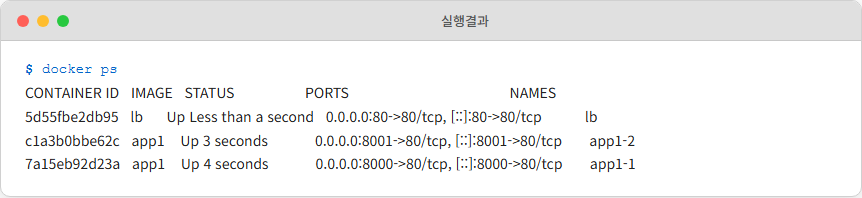
*그림 3-12: 라운드 로빈 컨테이너 실행 확인*

오픈이가 `localhost:80/app1` 주소로 동일한 요청을 반복해서 보내보았습니다. 새로고침할 때마다 요청이 두 서버로 번갈아 전달되었습니다. 브라우저 화면은 동일하지만, Docker Desktop에서 각 컨테이너의 로그를 확인하면 요청이 분산되는 것을 볼 수 있습니다.

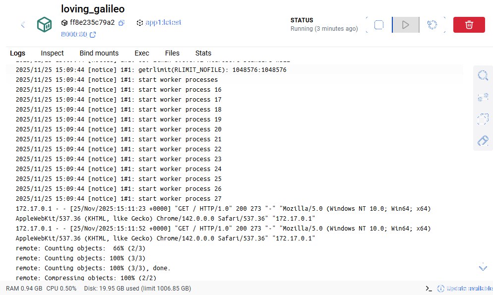
*그림 3-13: 8000 포트 서버 요청*

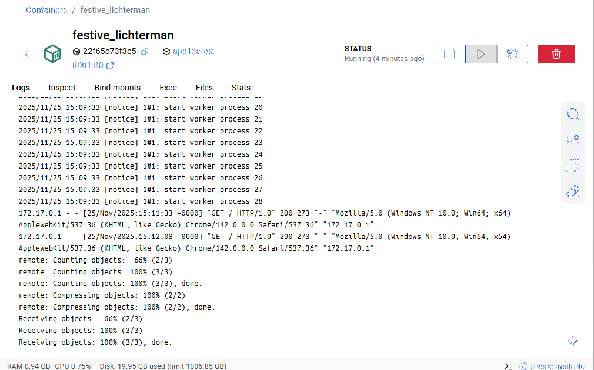
*그림 3-14: 8001 포트 서버 요청*

> **오픈이**: "오, 새로고침만 했는데 서버가 번갈아 응답하는데요?"
>
> **선배**: "그게 라운드 로빈이야. NGINX가 알아서 나눠주는 거거든. 근데... 이걸로 끝이 아니야."

오픈이는 아직 몰랐습니다. 로드밸런싱에는 숨겨진 함정이 기다리고 있다는 것을.

다음 실습을 위해 실행한 서버를 종료합니다.

```bash
docker stop $(docker ps -q)   # 실행 중인 컨테이너 모두 중지
docker rm $(docker ps -aq)    # 중지된 컨테이너 모두 삭제
```

---

## 3.4 Redis : 세션 저장소

로드밸런싱을 적용하고 기뻐하던 오픈이에게 문제가 터졌습니다. 사용자가 로그인한 뒤 페이지를 이동하면 갑자기 로그인이 풀리는 것입니다.

> **오픈이**: "선배! 사용자가 로그인했는데 다음 페이지 가면 로그아웃돼요!"
>
> **선배**: "서버 1에서 로그인했는데 다음 요청이 서버 2로 갔겠지. 서버 2가 그 사용자 로그인한 걸 알겠어?"

오픈이의 머릿속에 그림이 그려졌습니다. 사용자가 서버 1에 로그인하면 세션 정보가 서버 1의 메모리에 저장됩니다. 그런데 다음 요청이 라운드 로빈으로 서버 2에 전달되면? 서버 2에는 이 사용자의 세션이 없습니다. 요청이 실패할 수밖에 없습니다.

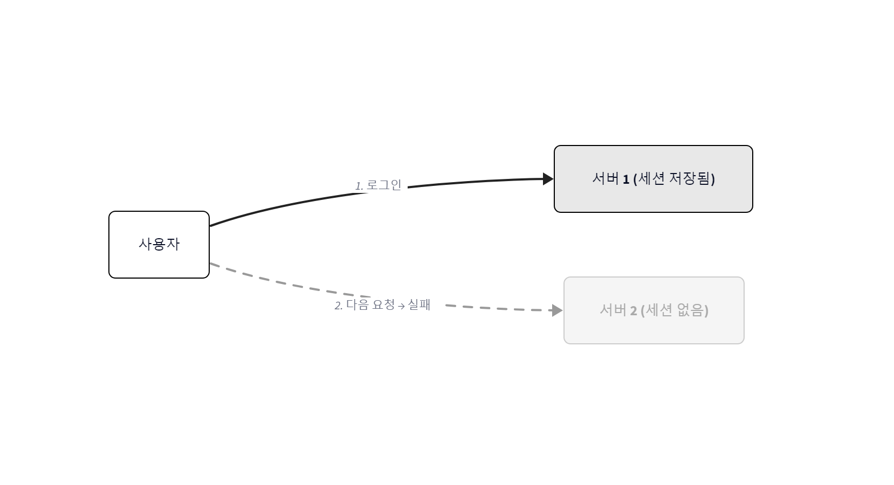
*그림 3-15: 세션 불일치 -- 서버 1에 저장된 세션이 서버 2에는 없어 요청이 실패*

> **오픈이**: "그럼 어떻게 해야 돼요?"
>
> **선배**: "세션을 서버 안에 두지 말고 바깥에 공용 저장소 하나 두면 돼. Redis라고, 엄청 빠른 메모리 DB야. 여러 서버가 같이 쓰는 사물함이라고 생각해."

Redis는 여러 서버가 함께 사용하는 **공용 사물함** 과 같습니다. 서버 1이 사물함에 데이터를 넣어두면 서버 2도 같은 사물함을 열어 그 데이터를 꺼낼 수 있습니다.

> **레디스(Redis)**: 메모리 기반의 데이터베이스로, 키-값(Key-Value) 구조로 데이터를 저장합니다. 디스크가 아닌 메모리에 저장하기 때문에 속도가 매우 빨라 데이터 캐싱, 세션 저장 등 고성능 처리가 필요한 곳에 주로 사용됩니다.

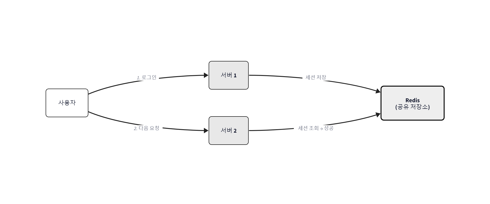
*그림 3-16: Redis로 해결 -- 세션을 공유 저장소에 보관하여 어떤 서버에서든 조회 가능*

### 3.4.1 Redis : 실습

> 실습 코드는 https://github.com/metacoding-10-linux-docker/docker/tree/master/ex04 에서 확인할 수 있습니다.

이 실습에서는 Python Flask로 작성된 API 서버 2대와 Redis 1대를 같은 네트워크에 연결합니다. API 서버의 `/save` 엔드포인트로 데이터를 저장하고, `/read` 엔드포인트로 다른 서버에서 같은 데이터를 조회할 수 있는지 확인합니다.

**[참고]** `api/Dockerfile`

```dockerfile
FROM python:3.10-alpine                          # Python 3.10 경량 이미지 사용
WORKDIR /app                                     # 작업 경로를 /app으로 설정
COPY app.py .                                    # app.py를 컨테이너의 /app으로 복사
RUN pip install flask && pip install redis        # Flask + Redis 패키지 설치
CMD ["python", "app.py"]                         # Flask 서버 실행
```

`app.py`의 핵심 코드입니다. `/save` 요청이 들어오면 Redis에 값을 저장하고, `/read` 요청이 들어오면 Redis에 저장된 값을 조회합니다.

```python
# Redis 연결 -- 컨테이너 이름 'redis'를 호스트명으로 사용
r = redis.Redis(host='redis', port=6379, db=0)

@app.route("/save")
def save_name():
    r.set("name", "metacoding")       # Redis에 값 저장
    return "이름이 저장되었습니다."

@app.route("/read")
def read_name():
    value = r.get("name")             # Redis에서 값 조회
    if value is None:
        return "저장된 이름이 없습니다."
    return f"name = {value.decode('utf-8')}"
```

오픈이는 코드를 보다가 `host='redis'`에서 멈췄습니다. IP 주소가 아닌 **컨테이너 이름** 으로 Redis에 접속하고 있었습니다. 3.2절에서 `host.docker.internal`로 우회해야 했던 것과 달라 보입니다.

> **오픈이**: "선배, 근데 여기서는 왜 컨테이너 이름으로 바로 접속이 돼요?"
>
> **선배**: "그건 사용자 정의 네트워크 덕분이거든. `docker network create`로 네트워크 직접 만들어서 컨테이너들 연결하면 이름으로 서로 찾을 수 있어."

**[실습]** EX04 폴더로 이동 후, 네트워크를 생성하고 Redis, API 컨테이너를 실행합니다.

```bash
# 네트워크 만들기
docker network create myNetwork                                     # myNetwork 네트워크 생성

# redis 실행
docker run -d --name redis --network myNetwork -p 6379:6379 redis   # Redis 컨테이너 실행

# api 실행
docker build -t api ./api                                           # API 이미지 빌드
docker run -d --name api1 --network myNetwork -p 5001:5000 api      # API 서버 1 실행
docker run -d --name api2 --network myNetwork -p 5002:5000 api      # API 서버 2 실행
```

핵심은 `--network myNetwork` 옵션입니다. 세 컨테이너를 같은 사용자 정의 네트워크에 연결하면 컨테이너 이름으로 서로 통신할 수 있습니다.

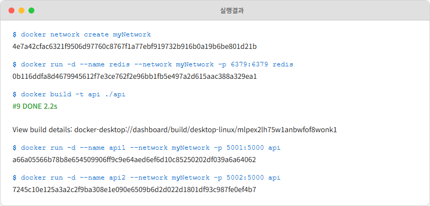
*그림 3-17: Redis 실습 컨테이너 확인*

오픈이가 브라우저에서 `api1` 서버의 `localhost:5001/save`로 요청을 보내자 이름이 저장되었습니다.


*그림 3-18: api1에서 데이터 저장*

이제 다른 서버인 `api2`에서 같은 데이터를 조회할 수 있는지가 관건입니다. `localhost:5002/read`로 요청을 보내자 `api1`에서 저장했던 값이 그대로 나왔습니다.

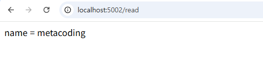
*그림 3-19: api2에서 데이터 조회*

> **오픈이**: "선배, 됩니다! 서버 1에서 저장한 거를 서버 2에서 읽을 수 있어요!"
>
> **선배**: "그래, 이제 서버가 몇 대든 세션 안 풀리겠지?"

> **네트워크 돋보기: Docker DNS (127.0.0.11)**
>
> **host='redis'** 라고 쓸 수 있는 이유는 Docker **내장 DNS 서버** 덕분입니다. Docker는 **127.0.0.11** 주소에 DNS 서버를 운영합니다. 컨테이너가 생성되면 이름과 IP를 자동 등록하고, 제거되면 삭제합니다.
>
> api1이 **redis** 라는 이름으로 접속을 시도하면: (1) OS가 **/etc/resolv.conf** 를 보고 **127.0.0.11** 에 DNS 질의를 보냅니다. (2) Docker DNS가 "redis는 172.18.0.2야"라고 응답합니다. (3) 해당 IP로 실제 연결이 이루어집니다.
>
> 단, **사용자 정의 네트워크에서만 동작합니다.** 기본 **docker0** 브리지에서는 DNS가 작동하지 않습니다. 이것이 3.2절에서 **host.docker.internal** 을 써야 했던 이유이고, 여기서 **docker network create** 를 쓰는 이유입니다.
>
> 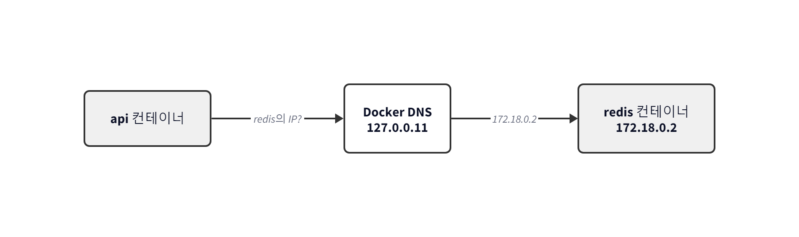
> *그림 3-20: Docker DNS --- 사용자 정의 네트워크에서 이름 기반 통신*
>
> **한 줄 정리**: 사용자 정의 네트워크에서는 Docker DNS(127.0.0.11)가 컨테이너 이름을 IP로 변환합니다.

실습이 끝나면 컨테이너와 네트워크를 정리합니다.

```bash
docker stop $(docker ps -q)    # 실행 중인 컨테이너 모두 중지
docker rm $(docker ps -aq)     # 중지된 컨테이너 모두 삭제
docker network rm myNetwork    # 네트워크 삭제
```


---

## 3.5 Docker Compose : 여러 컨테이너를 한 번에

오픈이는 실습을 하면서 점점 피로감을 느끼고 있었습니다. 지금까지 해온 것을 돌아보겠습니다. NGINX + 앱 서버 2개만 돼도 `docker build` 3번, `docker run` 3번, 네트워크도 따로 만들어야 했습니다. Redis까지 추가하면 명령어가 벌써 7~8줄입니다. 내릴 때도 하나씩 내려야 합니다.

> **오픈이**: "이걸 매번 치는 건 진짜 아닌데... 한 번에 하는 방법 없나?"
>
> **선배**: "드디어 그 질문 하는구나. Docker Compose라는 게 있거든."

**Docker Compose** 는 `docker-compose.yml`이라는 YAML 파일 하나에 모든 컨테이너의 구성을 정의합니다.

> **도커 컴포즈(Docker Compose)**: 하나의 스크립트 파일로 여러 컨테이너를 하나의 환경으로 묶어 관리하는 도구입니다.

Compose가 해결하는 것은 세 가지입니다.

**순서:** 어떤 컨테이너를 먼저 띄울지 `depends_on`으로 지정합니다. DB 컨테이너가 먼저 시작된 뒤 백엔드가 시작되도록 순서를 보장합니다.

**네트워크:** 같은 Compose 파일에 정의된 컨테이너는 자동으로 하나의 네트워크에 묶입니다. `docker network create`를 직접 실행할 필요가 없습니다.

**일괄 관리:** `docker compose up` 한 줄이면 모든 컨테이너가 시작되고, `docker compose down` 한 줄이면 전부 정리됩니다.

오픈이의 눈이 커졌습니다.

> **오픈이**: "진짜요? 명령어 한 줄이면 끝이라고요?"

### 3.5.1 docker-compose.yml 기본 구조

```yaml
services:
  <서비스명>:
    container_name: <컨테이너명> # 컨테이너 이름 지정
    image: <이미지명>           # 이미지 이름 지정
    build: <경로>               # Dockerfile 경로 (이미지를 직접 빌드)
    ports:
      - "호스트포트:컨테이너포트" # 포트 매핑
    depends_on:
      - <다른서비스명>           # 이 서비스보다 먼저 시작해야 하는 서비스
    environment:
      - KEY=VALUE               # 환경 변수 설정
    volumes:
      - <호스트경로:컨테이너경로> # 데이터 저장소 연결
    networks:
      - <네트워크명>             # 연결할 네트워크

volumes:
  <볼륨명>:

networks:
  <네트워크명>:
```

### 3.5.2 Docker Compose : 실습

> 실습 코드는 https://github.com/metacoding-10-linux-docker/docker/tree/master/ex06 에서 확인할 수 있습니다.

EX06은 EX01(경로 기반 라우팅)과 동일한 구조이지만 Docker Compose로 전환한 버전입니다. 오픈이는 3.2절에서 했던 것과 비교하며 따라가 보기로 했습니다.

**[EX06 패키지 구조]**

```
ex06/
├── app1/                # 첫 번째 웹 서버
│   ├── Dockerfile
│   └── index.html
├── app2/                # 두 번째 웹 서버
│   ├── Dockerfile
│   └── index.html
├── lb/                  # 로드밸런서 (NGINX)
│   ├── Dockerfile
│   └── nginx.conf       # 라우팅 설정
└── docker-compose.yml   # 전체 컨테이너 통합 실행
```

EX01에서는 컨테이너를 개별 실행했기 때문에 nginx.conf에서 `host.docker.internal`로 호스트 PC를 경유해야 했습니다. Docker Compose에서는 같은 네트워크에 묶인 서비스끼리 **서비스 이름으로 직접 통신** 할 수 있으므로, nginx.conf의 upstream 주소가 바뀌었습니다.

```nginx
# EX01 (docker run 개별 실행)
upstream app1 {
    server host.docker.internal:8000;    # 호스트 PC를 경유
}

# EX06 (Docker Compose)
upstream app1 {
    server app1:80;                      # 서비스 이름으로 직접 통신!
}
```

오픈이는 감탄했습니다.

> **오픈이**: "아까는 `host.docker.internal`로 돌아가야 했잖아요. 근데 Compose에서는 서비스 이름으로 바로 가는 거네요!"

**[참고]** `docker-compose.yml`

```yaml
services:
  app1:                    # 서버 1
    build:
      context: ./app1      # Dockerfile 경로
    ports:
      - 8000:80            # localhost:8000으로 접근
    networks:
      - ex06-network       # 공용 네트워크 연결
  app2:                    # 서버 2
    build:
      context: ./app2
    ports:
      - 9000:80
    networks:
      - ex06-network
  lb:                      # 로드밸런서
    build:
      context: ./lb
    ports:
      - 80:80
    networks:
      - ex06-network

networks:
  ex06-network:            # 3개 서비스를 하나로 묶는 가상 네트워크
```

**[실습]** EX06 폴더로 이동 후, docker compose up 명령으로 모든 서비스를 한 번에 실행합니다.

```bash
docker compose up   # 모든 컨테이너 한 번에 실행
```

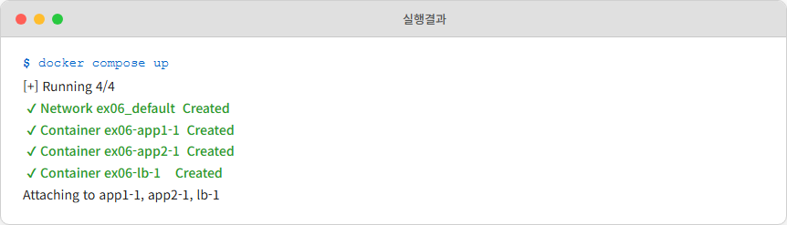
*그림 3-21: docker compose up 실행*

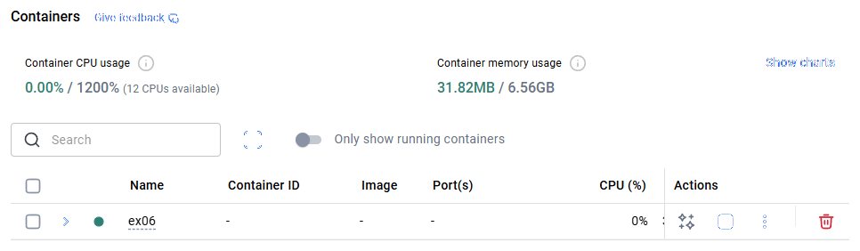
*그림 3-22: Docker Desktop에서 Compose 컨테이너 확인*

EX01과 동일하게 브라우저에 `localhost:80/app1`, `localhost:80/app2`를 입력하면 각 서버에 접근할 수 있습니다. 명령어 한 줄로 모든 서비스가 올라갔습니다.

> **네트워크 돋보기: Compose가 자동으로 만드는 네트워크**
>
> **docker compose up** 을 실행하는 순간, Compose는 프로젝트 전용 **사용자 정의 네트워크** 를 자동 생성합니다. 사용자 정의 네트워크에서는 Docker DNS가 작동하므로, **app1** 이라는 서비스 이름이 자동으로 해당 컨테이너의 IP로 해석됩니다. **docker network create** 를 직접 실행할 필요가 없어진 것입니다.
>
> 3.4절에서 `docker network create myNetwork`를 직접 실행했던 것을 기억하시나요? Compose는 이 작업을 자동으로 처리합니다. **docker compose down** 을 실행하면 네트워크도 함께 삭제됩니다.
>
> 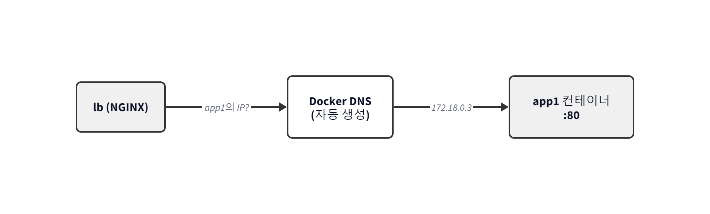
> *그림 3-23: Docker Compose가 자동 생성하는 네트워크와 DNS*
>
> **한 줄 정리**: Compose는 사용자 정의 네트워크를 자동 생성하여 서비스 이름만으로 통신할 수 있게 합니다.

실습이 끝나면 다음 명령어로 컨테이너를 종료합니다.

```bash
docker compose down   # 모든 컨테이너 중지 및 삭제
```

### 3.5.3 docker compose 주요 명령어

| 명령어 | 설명 |
|--------|------|
| `docker compose up` | 모든 서비스를 빌드하고 실행 |
| `docker compose up -d` | 백그라운드에서 실행 |
| `docker compose down` | 모든 서비스를 중지하고 삭제 |
| `docker compose ps` | 실행 중인 서비스 목록 확인 |
| `docker compose logs` | 서비스 로그 확인 |
| `docker compose build` | 서비스 이미지만 빌드 |


---

## 3.6 종합 실습 : 풀스택 웹사이트 만들기

Dockerfile, NGINX, Redis, Docker Compose까지. 오픈이는 지금까지 배운 기술들을 되짚어 보았습니다. 이제 이 모든 것을 한 곳에 모아볼 시간입니다.

> **오픈이**: "선배, 이제 진짜 웹사이트 만들어보고 싶거든요. 프론트에서 버튼 누르면 백엔드가 DB에서 데이터 가져오는 그런 거요."
>
> **선배**: "좋아. Compose로 프론트엔드, 백엔드, DB 한 번에 띄워봐. 지금까지 배운 거 전부 쓰게 될 거야."

오픈이는 드디어 프론트엔드 + 백엔드 + DB가 연동되는 진짜 웹사이트를 Compose로 띄워보기로 했습니다.

> 실습 코드는 https://github.com/metacoding-10-linux-docker/docker/tree/master/ex07 에서 확인할 수 있습니다.

**[EX07 패키지 구조]**

```
ex07/
├── backend/             # 백엔드 서버 (Spring Boot)
│   ├── Dockerfile
│   └── entrypoint.sh   # Git clone + 빌드 + 실행 스크립트
├── db/                  # MySQL 데이터베이스
│   ├── Dockerfile
│   └── init.sql         # 초기 테이블 및 데이터 생성 SQL
├── frontend/            # 프론트엔드 (NGINX)
│   ├── Dockerfile
│   ├── index.html       # 화면 페이지
│   └── nginx.conf       # 정적 파일 제공 + API 프록시 설정
└── docker-compose.yml   # 전체 컨테이너 통합 실행
```

### 3.6.1 아키텍처 개요

이번에 만들 웹사이트는 3개의 서비스로 구성됩니다.

- **Frontend (NGINX)**: 브라우저에 HTML 페이지를 제공하고, `/api/` 요청을 백엔드로 프록시합니다.
- **Backend (Spring Boot)**: `/api/users` API를 제공하여 DB에서 사용자 목록을 조회합니다.
- **DB (MySQL)**: 사용자 데이터를 영구 저장합니다.

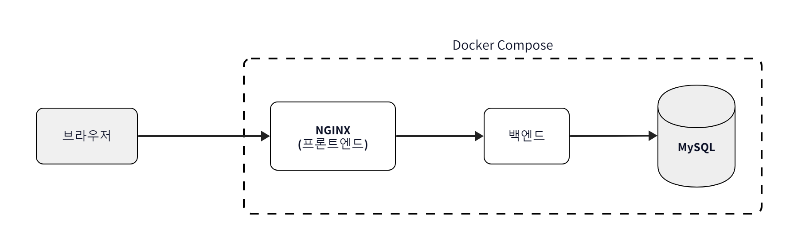
*그림 3-24: 풀스택 애플리케이션 아키텍처*

3.2절에서 NGINX가 URL 경로를 보고 요청을 나눠주는 것을 배웠습니다. 여기서도 같은 원리가 쓰입니다. NGINX가 `/` 요청에는 HTML 페이지를 제공하고, `/api/` 요청은 백엔드로 넘겨줍니다.

### 3.6.2 Frontend : NGINX 설정

nginx.conf에서 `/api/` 요청은 백엔드 서비스로 프록시합니다. `server backend:8080`에서 `backend`는 Docker Compose에서 정의한 서비스 이름입니다. 3.5절에서 배운 것처럼, Compose 네트워크 안에서는 서비스 이름이 곧 호스트명입니다.

**[참고]** `frontend/nginx.conf`

```nginx
events {}

http {
    upstream backend {
        server backend:8080;       # Docker Compose 서비스명으로 통신
    }

    server {
        listen 80;
        server_name _;

        location / {
            root   /usr/share/nginx/html;
            index  index.html;
        }

        location /api/ {
            proxy_pass http://backend;   # API 요청은 백엔드로 프록시
        }
    }
}
```

### 3.6.3 Docker Compose : 통합 구성

**[참고]** `docker-compose.yml`

```yaml
services:
  backend:                    # 백엔드 서비스 (Spring Boot)
    build:
      context: ./backend
    ports:
      - "8080:8080"
    environment:
      SPRING_DATASOURCE_URL: jdbc:mysql://db:3306/metadb?useSSL=false&serverTimezone=UTC&useLegacyDatetimeCode=false&allowPublicKeyRetrieval=true
      SPRING_DATASOURCE_DRIVER_CLASS_NAME: com.mysql.cj.jdbc.Driver
      SPRING_DATASOURCE_USERNAME: root
      SPRING_DATASOURCE_PASSWORD: root1234   # 학습용 비밀번호. 운영 환경에서는 Docker Secrets이나 .env 파일을 사용합니다
    networks:
      - ex07-network

  db:                         # 데이터베이스 서비스 (MySQL)
    build:
      context: ./db
    ports:
      - 3306:3306
    networks:
      - ex07-network

  frontend:                   # 프론트엔드 서비스 (Nginx)
    build:
      context: ./frontend
    ports:
      - "80:80"
    networks:
      - ex07-network

networks:
  ex07-network:               # 3개 서비스를 하나로 묶는 가상 네트워크
```

`environment`로 Spring Boot의 DB 접속 정보를 주입합니다. 여기서 DB 호스트가 `db:3306`인 점에 주목하겠습니다. Compose 네트워크에서는 서비스 이름(`db`)이 곧 호스트명입니다.

### 3.6.4 통합 실행

**[실습]** EX07 폴더로 이동 후, docker compose up 명령으로 전체 서비스를 실행합니다.

```bash
docker compose up   # 풀스택 애플리케이션 실행
```

> 백엔드 컨테이너는 Gradle 빌드를 실행하므로 처음 실행 시 약 3~5분이 소요됩니다. 터미널에 로그가 멈춘 것처럼 보여도 정상이니 Ctrl+C를 누르지 말고 기다립니다. 참고로, 컨테이너 내부에서 빌드하는 방식은 학습 편의를 위한 구성이며 실제 운영 환경에서는 미리 빌드된 이미지를 사용합니다.

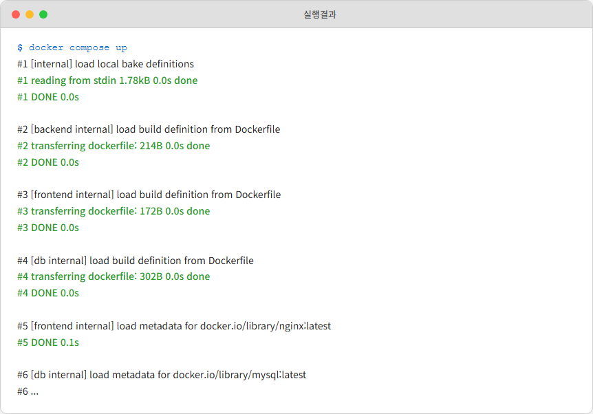
*그림 3-25: docker compose up 실행 결과*

#### 결과 확인

1. 브라우저에서 `localhost` 또는 `localhost:80`에 접속하여 "사용자 리스트" 페이지가 표시되는지 확인합니다.
2. 테이블에 ID와 이름 컬럼이 표시되고 init.sql에서 입력한 ssar, cos 데이터가 조회되는지 확인합니다.
3. 데이터가 표시되지 않으면 백엔드 서버 빌드가 아직 진행 중일 수 있으므로 잠시 기다린 후 새로고침합니다.

오픈이가 브라우저에서 `localhost`를 열자, 사용자 목록이 조회되었습니다.

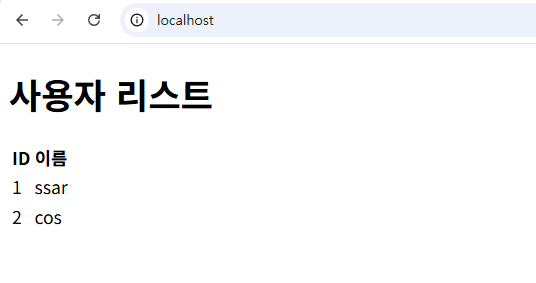
*그림 3-26: 사용자 목록 조회 성공*

> **오픈이**: "와, 진짜 된다! 프론트에서 버튼 누르면 백엔드가 DB에서 가져오는 거잖아요! 이게 명령어 한 줄이라니..."
>
> **선배**: "이게 Docker Compose의 힘이야. 프론트엔드, 백엔드, DB가 각각 다른 컨테이너에서 돌아가는데, Compose가 네트워크를 알아서 연결해주니까 서비스 이름만으로 통신이 되는 거거든."

실습이 끝나면 다음 명령어로 정리합니다.

```bash
docker compose down   # 모든 컨테이너 중지 및 삭제
```

---

## 3.7 종합 : Docker 네트워크 전체 그림

오픈이는 3장을 마무리하면서 지금까지 배운 Docker 네트워크 개념을 정리해보기로 했습니다. 실습을 하면서 네트워크 개념이 곳곳에 등장했는데, 이 모든 것을 한 장의 그림으로 정리하면 이렇게 됩니다.

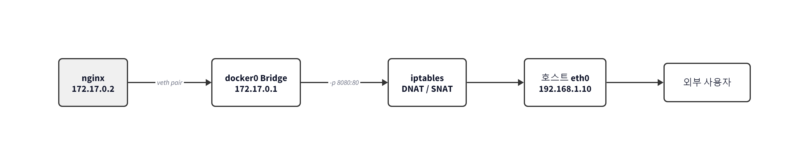
*그림 3-27: Docker 네트워크 전체 구조 -- 컨테이너에서 외부까지의 경로*

| Docker 동작 | 네트워크 정체 | 이 장에서 만난 곳 |
|-------------|-------------|-----------------|
| 컨테이너 네트워크 격리 | Network Namespace | 2장 포트포워딩 돋보기 |
| 컨테이너 ↔ 호스트 연결 | veth pair | 2장 포트포워딩 돋보기 |
| docker0 | Bridge (가상 스위치) | 3.2 host.docker.internal 설명 |
| `-p` 포트매핑 | iptables DNAT | 2장 포트포워딩 돋보기 |
| Docker DNS (127.0.0.11) | DNS 원리 | 3.4 Redis 돋보기 |
| Compose 네트워크 | 사용자 정의 Bridge + DNS | 3.5 Compose 돋보기 |

Docker는 이 도구들을 우리 대신 자동으로 조립해주는 **자동화 도구** 입니다. `docker run` 한 줄이면 Namespace 생성, veth 연결, 브리지 연결, IP 할당, DNS 등록까지 모두 끝납니다. 마법이 아니라 자동화입니다.

---

## 이것만은 기억하자

- **안내 데스크가 있으면 길을 잃지 않습니다.** NGINX는 URL 경로를 보고 적절한 서버로 요청을 보내주고 트래픽이 몰려도 여러 서버에 골고루 나눠줍니다.
- **공용 사물함이 있으면 어디서든 꺼낼 수 있습니다.** Redis를 세션 저장소로 사용하면 어떤 서버가 요청을 받든 동일한 데이터에 접근할 수 있습니다.
- **상자가 여러 개면, 악보 한 장으로 한꺼번에 실어라.** Docker Compose는 프론트엔드, 백엔드, DB 등 여러 컨테이너를 `docker-compose.yml` 하나에 정의하고 명령어 한 줄로 전부 실행합니다.

Docker Compose로 풀스택 웹사이트까지 완성한 오픈이. 선배에게 자랑스럽게 보여주자 선배가 물었습니다.

> **선배**: "잘했어. 근데 새벽에 서버 죽으면 누가 살려줄 건데?"

오픈이는 멈칫했습니다. 컨테이너를 `docker stop`으로 종료하면 사용자는 바로 오류 화면을 만나게 됩니다. 서비스를 복구하려면 개발자가 직접 `docker compose up`을 실행해야 하고, 사용자가 몰려도 컨테이너 수를 수동으로 조절하는 것이 전부입니다. 새벽에 컨테이너가 죽으면? 누군가 직접 다시 띄워야 합니다.

다음 챕터에서는 이 문제들을 해결합니다. 쿠버네티스로 원하는 수만큼 Pod을 자동으로 유지하고 컨테이너가 죽으면 자동으로 복구합니다. 롤링 업데이트로 서비스 중단 없이 새 버전을 배포합니다.
