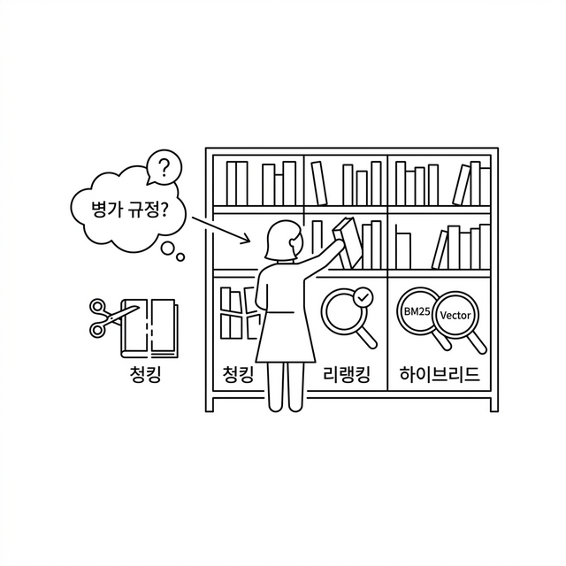
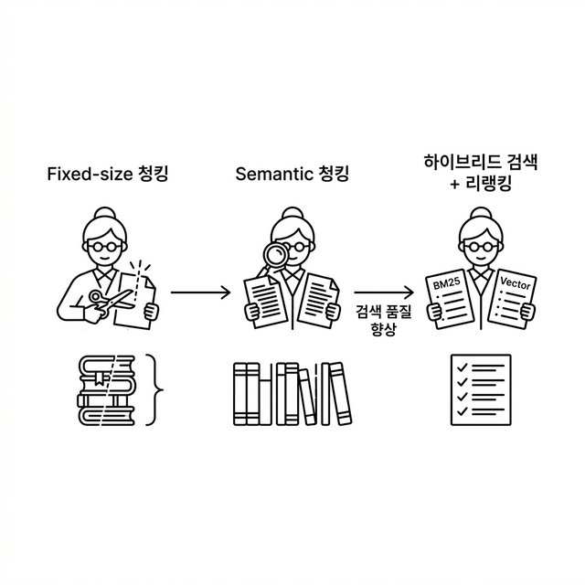
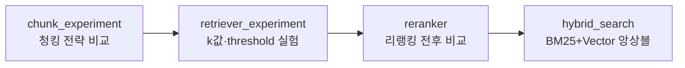
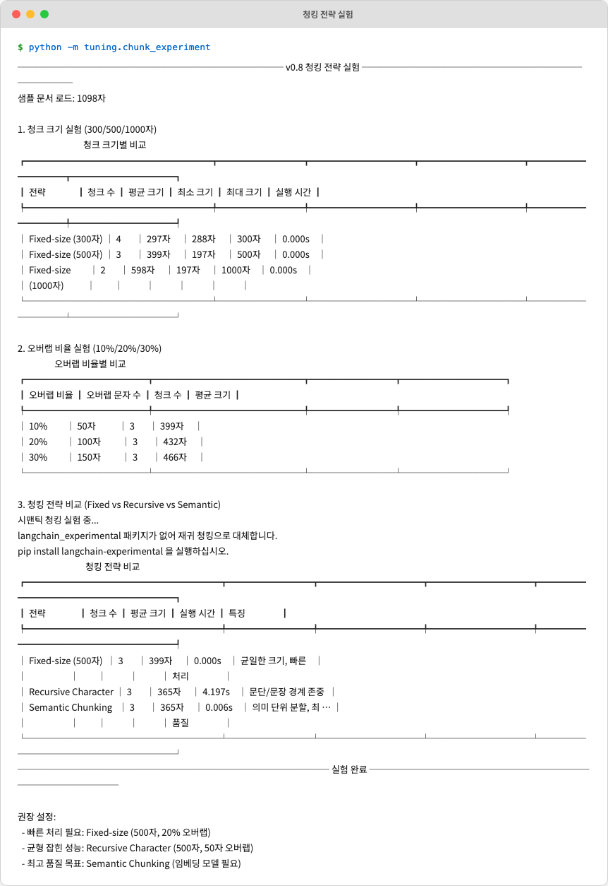
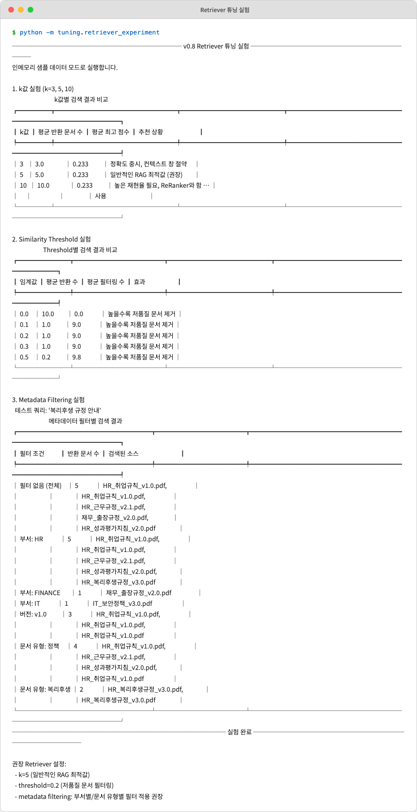
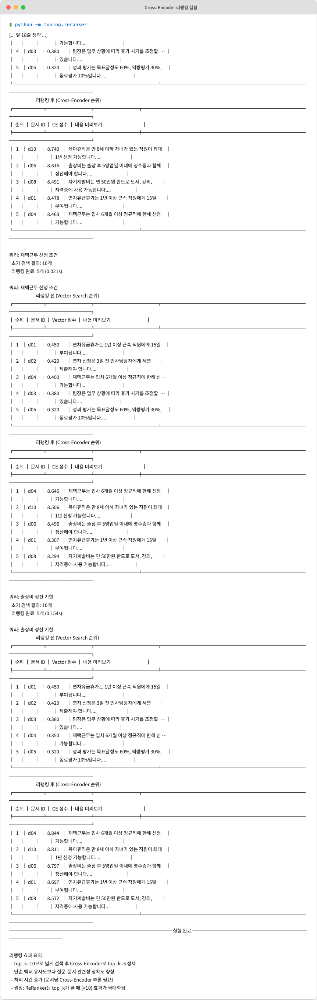
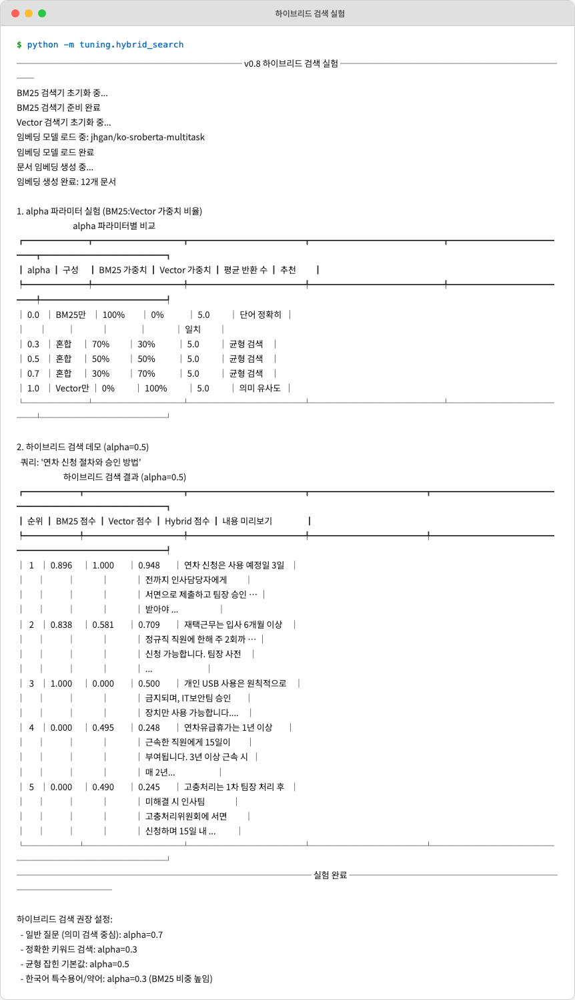

# Ch.8: "엉뚱한 문서를 가져온다" — 검색 품질 튜닝 (ex08)

> 이번 버전: ex07 → ex08
> 한 줄 요약: 검색이 바뀌면 답변이 바뀐다. RAG의 품질은 LLM이 아니라 Retriever가 결정한다.
> 핵심 개념: 청킹 최적화, 리랭킹, 하이브리드 검색

---

## 이야기 파트

<!-- [GEMINI PROMPT: 08_chapter-opening]
path: assets/CH08/08_chapter-opening.png
A minimalist black and white technical diagram with a strict 16:9 aspect ratio
on a solid white background. No shading, no 3D effects, only clean thin line art.
The entire assembly of icons, lines, and text is perfectly centered globally
within the 16:9 frame, leaving generous and equal white space on all sides.

Center: a minimalist line-art librarian icon standing at a bookshelf.
Left shelf section: books cut in half with scissors icon, labeled '청킹'.
Middle shelf: a magnifying glass with checkmark, labeled '리랭킹'.
Right shelf: two overlapping magnifying glasses (one labeled 'BM25', one labeled 'Vector'), labeled '하이브리드'.
An arrow from a question bubble '병가 규정?' pointing to the librarian,
and the librarian picking the correct book from the shelf.
Style: scene-opener
-->


### "병가 규정을 물어봤는데 출장 규정이 나왔다"

CH07에서 캐시와 모니터링까지 달았습니다. 운영은 안정됐습니다. 같은 질문엔 캐시로 빠르게 답하고, 토큰도 추적합니다.

그런데 동료가 한 가지 이상한 걸 발견했습니다.

**동료 C**: "병가 규정이 어떻게 되는지 물어봤는데요, 출장 규정을 가져와서 답변하더라고요."

확인해봤더니 정말 그렇습니다. "병가 신청 절차가 어떻게 되나요?"라고 물었는데, AI 비서가 출장 규정 문서를 근거로 답변을 만들어냈습니다. 출장비 정산 기한이라든가, 숙박비 한도라든가 — 병가와는 전혀 관계없는 이야기를 그럴듯하게 늘어놓습니다.

문제는 LLM이 아닙니다. LLM은 받은 문서를 가지고 성실하게 답변했을 뿐입니다. **잘못된 문서를 가져다 준 건 검색 단계**입니다.

비유를 하나 떠올려봅시다.

---

### 사서의 검색 실력

CH04에서 우리는 사서에게 서가를 만들어줬습니다. 문서를 잘게 쪼개서(청킹), 숫자 배열로 바꿔서(임베딩), 서가에 꽂아뒀습니다(ChromaDB). 질문이 들어오면 사서가 서가에서 비슷한 문서를 꺼내옵니다.

그런데 이 사서의 검색 실력이 아직 초보 수준입니다.

**제목만 보고 찾는 사서** — 지금 사서는 문서를 일정한 크기(500자)로 잘라서 꽂아뒀습니다. 가위로 종이를 자르듯이, 내용과 상관없이 500자마다 끊었습니다. "병가"와 "출장"이 같은 문서 안에 있으면? 하나의 조각에 두 내용이 섞입니다. 사서가 그 조각을 꺼내면 병가를 물어봤는데 출장 이야기가 따라옵니다.

더 나은 사서는 어떻게 할까요?

**목차를 보고 찾는 사서** — 문서를 자를 때 "여기서 주제가 바뀌네?"를 감지합니다. 연차 이야기를 하다가 출장 이야기로 넘어가는 지점을 알아채고, 거기서 끊습니다. 이렇게 하면 하나의 조각에 하나의 주제만 담깁니다. 이게 **Semantic Chunking(의미 단위 청킹)**입니다.

**내용까지 훑고 다시 확인하는 사서** — 검색 결과를 10개 가져왔다고 합시다. 이 중에 진짜 관련 있는 건 3~4개이고 나머지는 비슷하게 생겼지만 관련 없는 문서입니다. 사서가 10개를 펼쳐놓고 질문을 다시 읽으면서 "이건 맞고, 이건 아니고"를 하나하나 확인합니다. 이게 **리랭킹(ReRanking)**입니다.

<!-- [GEMINI PROMPT: 08_search-evolution]
path: assets/CH08/08_search-evolution.png
A minimalist black and white technical diagram with a strict 16:9 aspect ratio
on a solid white background. No shading, no 3D effects, only clean thin line art.
The entire assembly of icons, lines, and text is perfectly centered globally
within the 16:9 frame, leaving generous and equal white space on all sides.

Three-stage horizontal flow diagram:
Stage 1 (left): A librarian icon with scissors cutting a paper at fixed intervals.
  Label above: 'Fixed-size 청킹'. Below: books with mixed topics in one chunk.
Stage 2 (center): Same librarian but now with a magnifying glass reading content.
  Label above: 'Semantic 청킹'. Below: books with clean single-topic chunks.
Stage 3 (right): Librarian holding two lists (BM25 + Vector) and merging them.
  Label above: '하이브리드 검색 + 리랭킹'. Below: final ranked list with checkmarks.
Arrow connecting Stage 1 → Stage 2 → Stage 3, labeled '검색 품질 향상'.
Style: concept-diagram
-->

*그림 8-1: 사서가 성장하는 과정. 가위로 자르던 사서가, 의미를 읽고, 두 가지 방법을 섞어 찾고, 최종 확인까지 하게 된다.*

그리고 하나 더. 지금 사서는 한 가지 방법으로만 찾습니다 — 의미가 비슷한 문서를 찾는 벡터 검색. 하지만 "BM25"라는 정확한 키워드 매칭 방식도 있습니다.

**두 가지 방법을 섞어 쓰는 사서** — "연차 신청"이라는 질문에, 벡터 검색은 "휴가 사용"이라는 의미적으로 비슷한 문서를 찾아옵니다. BM25는 "연차"와 "신청"이라는 단어가 정확히 들어간 문서를 찾아옵니다. 둘을 합치면? 의미도 맞고 키워드도 맞는 문서가 상위에 올라옵니다. 이게 **하이브리드 검색**입니다.

---

### 이번 버전에서 뭘 바꾸나

이번 장은 지금까지와 조금 다릅니다. 새로운 기능을 "만드는" 게 아니라, 기존 검색 파이프라인을 "실험하고 개선하는" 장입니다.

네 가지 실험을 순서대로 진행합니다.

| 순서 | 실험 | 뭘 알아내나 |
|------|------|------------|
| 실험 1 | 청킹 전략 비교 | Fixed-size vs Semantic, 어떤 방식이 더 깔끔하게 자르나 |
| 실험 2 | Retriever 튜닝 | 몇 개를 가져올지(k값), 몇 점 이상만 가져올지(threshold) |
| 실험 3 | 리랭킹 | 가져온 문서를 다시 정렬하면 정확도가 올라가나 |
| 실험 4 | 하이브리드 검색 | BM25 + Vector를 섞으면 어떤 효과가 있나 |

비유로 돌아가면, 사서의 서가 정리법(실험 1)을 바꾸고, 서가에서 꺼내오는 규칙(실험 2)을 조정하고, 꺼낸 문서를 재확인(실험 3)하고, 두 가지 검색법을 동시에 쓰는 방법(실험 4)을 배우는 것입니다.

이 네 가지 실험이 끝나면, "병가를 물어봤는데 출장 규정이 나오는" 문제는 사라집니다.

---

## 기술 파트

### 용어 정리

| 이야기 속 비유 | 진짜 용어 | 정식 정의 |
|---------------|----------|----------|
| 가위로 500자마다 자르기 | **Fixed-size Chunking** | 텍스트를 고정 문자 수(예: 500자)로 분할하는 방식. 오버랩을 두어 문맥 유실을 줄인다 |
| 주제가 바뀌는 지점에서 자르기 | **Semantic Chunking** | 임베딩 유사도로 인접 문장 간 의미 변화를 감지하여, 의미 단위로 분할하는 방식 |
| 꺼낸 문서를 다시 확인 | **ReRanking (리랭킹)** | 초기 검색 결과를 Cross-Encoder 모델로 (query, document) 쌍을 재채점하여 순위를 재정렬하는 기법 |
| 두 가지 방법을 섞어 찾기 | **Hybrid Search (하이브리드 검색)** | BM25(키워드 매칭)와 Vector Search(의미 검색)를 가중 결합하는 검색 방식. alpha로 비율 조정 |
| 몇 개 가져올지 | **k값 (top-k)** | 검색 시 반환할 최대 문서 수. 작으면 정확도 중시, 크면 재현율 중시 |
| 몇 점 이상만 가져올지 | **Similarity Threshold** | 유사도 점수가 이 값 이하인 문서를 필터링하는 임계값 |
| 질문 단어와 문서 단어 매칭 | **BM25** | 단어의 출현 빈도(TF)와 역문서 빈도(IDF)를 기반으로 관련성을 계산하는 전통적 키워드 검색 알고리즘 |

### 파일 계층 구조

```
ex08/tuning/
├── chunk_experiment.py      [실습] Fixed vs Semantic, 크기/오버랩 실험
├── retriever_experiment.py  [실습] k값, threshold, metadata 필터 실험
├── reranker.py              [실습] Cross-Encoder 리랭킹 전후 비교
└── hybrid_search.py         [실습] BM25+Vector 앙상블, alpha 조정
```

> 이번 챕터의 코드는 모두 **독립 실험 모듈**입니다. ex07의 에이전트와 직접 통합하지 않고, 각각 독립적으로 실행하여 결과를 비교합니다. 실험 결과를 확인한 뒤 "어떤 설정이 우리 데이터에 맞는지"를 결정하고, 이후 챕터에서 에이전트에 반영합니다.

### 실습 환경 구축

> 기본 환경(Python 3.12, Ollama, Docker)이 없다면 **부록(환경 설정)** 을 먼저 참고하세요.

```bash
cd ex08
cp .env.example .env
python3.12 -m venv .venv
source .venv/bin/activate  # Windows: .venv\Scripts\activate
docker compose up -d       # PostgreSQL 실행
pip install -r requirements.txt
```

> **이전 챕터 Docker 종료**: CH07의 Docker가 실행 중이라면 `cd ex07 && docker compose down` 으로 먼저 종료하세요.

| 패키지 | 역할 |
|--------|------|
| `langchain-experimental` | 시맨틱 청킹 |
| `langchain-text-splitters` | 텍스트 분할기 |
| `rank-bm25` | BM25 키워드 검색 |
| `sentence-transformers` | ko-sroberta 임베딩 + Cross-Encoder 리랭킹 |
| `rich` | 터미널 출력 서식 |
| `easyocr` | OCR 문자 인식 |

### 실습 순서



네 가지 실험을 순서대로 진행합니다. 먼저 청킹 전략(Fixed/Recursive/Semantic)을 비교하고, 다음으로 Retriever의 k값과 threshold를 조정합니다. 이어서 리랭킹으로 검색 순위를 재정렬하고, 마지막으로 BM25와 벡터 검색을 합쳐 하이브리드 검색을 테스트합니다.

---

### [실습] chunk_experiment.py — 청킹 전략 실험

"병가를 물어봤는데 출장 규정이 나오는" 문제의 시작점이 여기입니다. 문서를 어떻게 자르느냐가 검색 품질의 첫 번째 관문입니다.

이 실험 파일은 세 가지를 비교합니다: 고정 크기 청킹, 재귀 문자 청킹, 시맨틱 청킹.

아래 코드를 `ex08/tuning/chunk_experiment.py`에 작성합니다.

#### fixed_size_chunking — 가위로 자르기

가장 단순한 방법입니다. 500자마다 끊고, 앞뒤 50자를 겹치게 합니다:

```python
def fixed_size_chunking(text, chunk_size=500, overlap=50):
    """고정 크기 청킹을 수행합니다."""
    chunks = []
    start = 0
    text_length = len(text)

    while start < text_length:
        end = min(start + chunk_size, text_length)
        chunk = text[start:end]

        if chunk.strip():
            chunks.append(chunk.strip())

        if end >= text_length:
            break

        start = end - overlap

    return chunks
```

`start`를 `end - overlap`으로 옮기는 부분이 핵심입니다. 500자를 잘랐으면 다음 시작점을 450(= 500 - 50)으로 잡습니다. 이러면 앞 청크의 마지막 50자와 다음 청크의 처음 50자가 겹칩니다. 문장이 잘리더라도 앞뒤 문맥이 남아 있게 하려는 장치입니다.

하지만 이 방법은 "연차 규정"과 "출장 규정"이 연이어 나올 때 하나의 청크에 두 주제가 섞이는 문제를 막을 수 없습니다.

#### semantic_chunking — 의미를 읽고 자르기

시맨틱 청킹은 인접한 문장의 임베딩을 비교해서 "의미가 크게 달라지는 지점"에서 분할합니다:

```python
def semantic_chunking(text, embedding_model="jhgan/ko-sroberta-multitask",
                      breakpoint_threshold_type="percentile"):
    """의미 단위 기반 시맨틱 청킹을 수행합니다."""
    try:
        from langchain_community.embeddings import HuggingFaceEmbeddings
        from langchain_experimental.text_splitter import SemanticChunker

        console.print("[dim]시맨틱 청킹: 임베딩 모델 로드 중...[/dim]")
        embeddings = HuggingFaceEmbeddings(
            model_name=embedding_model,
            model_kwargs={"device": "cpu"}
        )

        chunker = SemanticChunker(
            embeddings,
            breakpoint_threshold_type=breakpoint_threshold_type
        )
        chunks = chunker.split_text(text)
        return chunks

    except ImportError:
        console.print(
            "[yellow]langchain_experimental 패키지가 없어 "
            "재귀 청킹으로 대체합니다.[/yellow]"
        )
        console.print("pip install langchain-experimental 을 실행하십시오.")
        return recursive_character_chunking(text, chunk_size=500, chunk_overlap=50)
```

`SemanticChunker`는 LangChain의 실험적 모듈입니다. 내부적으로 문장마다 임베딩 벡터를 계산한 뒤, 인접 문장 간 코사인 유사도를 측정합니다. 유사도가 급격히 떨어지는 지점 = 주제가 바뀌는 지점으로 판단하고 거기서 잘라냅니다.

`breakpoint_threshold_type`에 `"percentile"`을 넣으면, "유사도 하위 몇 %에 해당하는 지점에서 자른다"는 뜻입니다. 기본값은 하위 5% 지점입니다.

#### run_all_experiments — 전체 실험 실행

세 가지 실험이 하나의 함수에서 순서대로 돌아갑니다:

```python
def run_all_experiments():
    """모든 청킹 실험을 순서대로 실행합니다."""
    console.rule("[bold blue]ex08 청킹 전략 실험[/bold blue]")

    # --- INPUT: 문서 로드 ---
    text = load_sample_document()
    console.print(f"[green]샘플 문서 로드:[/green] {len(text)}자")

    # --- PROCESS: 청크 크기 실험 ---
    console.print("\n[bold yellow]1. 청크 크기 실험 (300/500/1000자)[/bold yellow]")
    size_results = run_chunk_size_experiment(text)
    print_experiment_table("청크 크기별 비교", size_results)

    # --- PROCESS: 오버랩 비율 실험 ---
    console.print("\n[bold yellow]2. 오버랩 비율 실험 (10%/20%/30%)[/bold yellow]")
    overlap_results = run_overlap_experiment(text)
    print_experiment_table("오버랩 비율별 비교", overlap_results)

    # --- PROCESS: 전략 비교 ---
    console.print("\n[bold yellow]3. 청킹 전략 비교 (Fixed vs Recursive vs Semantic)[/bold yellow]")
    strategy_results = run_strategy_comparison(text)
    print_experiment_table("청킹 전략 비교", strategy_results)

    # --- OUTPUT: 권장 사항 ---
    console.rule("[bold green]실험 완료[/bold green]")
    console.print(
        "\n[bold]권장 설정:[/bold]\n"
        "  - 빠른 처리 필요: Fixed-size (500자, 20% 오버랩)\n"
        "  - 균형 잡힌 성능: Recursive Character (500자, 50자 오버랩)\n"
        "  - 최고 품질 목표: Semantic Chunking (임베딩 모델 필요)"
    )
```

실험 1은 청크 크기(300/500/1000자)를 바꿔보고, 실험 2는 오버랩 비율(10%/20%/30%)을 바꿔봅니다. 실험 3은 Fixed-size, Recursive, Semantic 세 전략을 직접 비교합니다.

`run_chunk_size_experiment`은 각 크기 설정별로 `fixed_size_chunking`을 호출하고 결과를 테이블로 정리합니다:

```python
def run_chunk_size_experiment(text):
    """청크 크기 실험 (300/500/1000자)을 실행합니다."""
    results = []
    chunk_sizes = [300, 500, 1000]

    for size in chunk_sizes:
        overlap = size // 10  # 10% 오버랩
        start_time = time.time()
        chunks = fixed_size_chunking(text, chunk_size=size, overlap=overlap)
        elapsed = time.time() - start_time

        stats = analyze_chunks(chunks)
        results.append({
            "전략": f"Fixed-size ({size}자)",
            "청크 수": stats["count"],
            "평균 크기": f"{stats['avg_size']:.0f}자",
            "최소 크기": f"{stats['min_size']}자",
            "최대 크기": f"{stats['max_size']}자",
            "실행 시간": f"{elapsed:.3f}s"
        })

    return results
```

300자로 자르면 청크 수가 많아지고, 1000자로 자르면 하나의 청크에 여러 주제가 섞입니다. 적절한 균형점을 실험으로 찾는 겁니다.

```bash
# 실행
python -m ex08.tuning.chunk_experiment
```

<!-- [CAPTURE NEEDED: 08_chunk-experiment
  path: assets/CH08/08_chunk-experiment.png
  desc: chunk_experiment.py 실행 결과. '청크 크기별 비교' 테이블(300/500/1000자 행), '오버랩 비율별 비교' 테이블(10%/20%/30% 행), '청킹 전략 비교' 테이블(Fixed-size/Recursive/Semantic 행)이 Rich 테이블로 출력된 화면.
] -->

*그림 8-2: 청크 크기, 오버랩 비율, 전략별 비교 결과. Semantic Chunking이 의미 단위로 깔끔하게 분할된다.*

---

### [실습] retriever_experiment.py — Retriever 튜닝 실험

청킹 전략을 정했으면, 다음은 "서가에서 몇 개를 꺼낼 것인가"입니다.

아래 코드를 `ex08/tuning/retriever_experiment.py`에 작성합니다.

#### InMemoryRetriever — 실험용 경량 검색기

ChromaDB 없이도 실험할 수 있도록 인메모리 검색기를 만들어뒀습니다:

```python
class InMemoryRetriever:
    """인메모리 샘플 데이터를 사용하는 검색기."""

    def __init__(self, documents):
        """초기화합니다."""
        self.documents = documents

    def similarity_score(self, query, doc_content):
        """쿼리와 문서 간 단순 키워드 유사도를 계산합니다."""
        query_words = set(query.lower().split())
        doc_words = set(doc_content.lower().split())

        if not query_words:
            return 0.0

        intersection = query_words & doc_words
        return len(intersection) / len(query_words)

    def search(self, query, k=5, threshold=0.0, metadata_filter=None):
        """문서를 검색합니다."""
        # 메타데이터 필터링
        candidates = self.documents
        if metadata_filter:
            candidates = [
                doc for doc in candidates
                if all(
                    doc["metadata"].get(k) == v
                    for k, v in metadata_filter.items()
                )
            ]

        # 유사도 계산
        scored_docs = []
        for doc in candidates:
            score = self.similarity_score(query, doc["content"])
            if score >= threshold:
                scored_docs.append({
                    "score": score,
                    "content": doc["content"],
                    "metadata": doc["metadata"],
                    "id": doc["id"]
                })

        # 점수 내림차순 정렬 후 top-k 반환
        scored_docs.sort(key=lambda x: x["score"], reverse=True)
        return scored_docs[:k]
```

`search()`의 파라미터 세 개가 이번 실험의 주인공입니다. `k`는 몇 개를 가져올지, `threshold`는 몇 점 이상만 가져올지, `metadata_filter`는 특정 부서나 문서 유형으로 범위를 좁히는 필터입니다.

#### run_k_value_experiment — k값 실험

k=3, k=5, k=10으로 바꿔가며 결과를 비교합니다:

```python
def run_k_value_experiment(retriever, test_queries):
    """k값(3, 5, 10) 실험을 실행합니다."""
    results = []
    k_values = [3, 5, 10]

    for k in k_values:
        avg_results_count = 0
        avg_top_score = 0.0

        for query in test_queries:
            docs = retriever.search(query, k=k)
            avg_results_count += len(docs)
            if docs:
                avg_top_score += docs[0]["score"]

        avg_results_count /= len(test_queries)
        avg_top_score /= len(test_queries)

        results.append({
            "k값": k,
            "평균 반환 문서 수": f"{avg_results_count:.1f}",
            "평균 최고 점수": f"{avg_top_score:.3f}",
            "추천 상황": _get_k_recommendation(k)
        })

    return results
```

k=3이면 정확한 문서 3개만 가져옵니다. 정확도는 높지만 필요한 정보를 놓칠 수 있습니다. k=10이면 넓게 가져오지만 관련 없는 문서도 섞입니다. 일반적으로 **k=5가 RAG 최적값**으로 권장됩니다. k=10 이상은 리랭커와 함께 쓸 때 효과적입니다.

#### run_threshold_experiment — 임계값 실험

유사도가 낮은 문서를 걸러내는 실험입니다:

```python
def run_threshold_experiment(retriever, test_queries):
    """similarity threshold 실험을 실행합니다."""
    results = []
    thresholds = [0.0, 0.1, 0.2, 0.3, 0.5]

    for threshold in thresholds:
        total_returned = 0
        total_filtered = 0

        for query in test_queries:
            docs_no_threshold = retriever.search(query, k=10, threshold=0.0)
            docs_with_threshold = retriever.search(query, k=10, threshold=threshold)
            total_returned += len(docs_with_threshold)
            total_filtered += len(docs_no_threshold) - len(docs_with_threshold)

        avg_returned = total_returned / len(test_queries)
        avg_filtered = total_filtered / len(test_queries)

        results.append({
            "임계값": threshold,
            "평균 반환 수": f"{avg_returned:.1f}",
            "평균 필터링 수": f"{avg_filtered:.1f}",
            "효과": "높을수록 저품질 문서 제거"
        })

    return results
```

threshold=0.0이면 모든 문서를 가져옵니다. threshold=0.3이면 유사도 0.3 미만인 문서는 버립니다. 높이면 노이즈가 줄지만, 너무 높이면 필요한 문서까지 잘려나갑니다. **threshold=0.2가 적당한 시작점**입니다.

```bash
# 실행
python -m ex08.tuning.retriever_experiment
```

<!-- [CAPTURE NEEDED: 08_retriever-experiment
  path: assets/CH08/08_retriever-experiment.png
  desc: retriever_experiment.py 실행 결과. 'k값별 검색 결과 비교' 테이블(k=3/5/10), 'Threshold별 검색 결과 비교' 테이블(0.0~0.5), '메타데이터 필터별 검색 결과' 테이블이 Rich 테이블로 출력된 화면.
] -->

*그림 8-3: k=5가 균형 잡힌 기본값. threshold=0.2로 저품질 문서를 필터링한다.*

---

### [실습] reranker.py — Cross-Encoder 리랭킹

검색이 10개를 가져왔습니다. 이 중에 진짜 관련 있는 건 몇 개일까요? 초기 벡터 검색은 "대략 비슷한 문서"를 빠르게 가져오는 데 좋지만, 미세한 관련성 차이를 구분하는 데는 약합니다. 리랭커가 이 차이를 잡아냅니다.

아래 코드를 `ex08/tuning/reranker.py`에 작성합니다.

#### CrossEncoderReranker — 문서 재정렬

Cross-Encoder는 (질문, 문서) 쌍을 한 번에 읽고 관련성 점수를 매기는 모델입니다:

```python
class CrossEncoderReranker:
    """Cross-Encoder 기반 리랭커."""

    def __init__(self, model_name=CROSS_ENCODER_MODEL):
        """초기화 및 모델 로드를 수행합니다."""
        self.model_name = model_name
        self.model = None
        self._load_model()

    def _load_model(self):
        """Cross-Encoder 모델을 로드합니다."""
        try:
            from sentence_transformers import CrossEncoder

            console.print(f"[dim]Cross-Encoder 모델 로드 중: {self.model_name}[/dim]")
            self.model = CrossEncoder(self.model_name)
            console.print("[green]Cross-Encoder 모델 로드 완료[/green]")

        except ImportError:
            console.print(
                "[red]sentence-transformers 패키지가 설치되지 않았습니다.[/red]"
            )
            console.print("pip install sentence-transformers 를 실행하십시오.")
            sys.exit(1)

        except Exception as e:
            console.print(f"[red]모델 로드 실패: {e}[/red]")
            console.print("[yellow]오프라인 환경이거나 모델 이름을 확인하십시오.[/yellow]")
            raise

    def rerank(self, query, documents, top_k=5):
        """검색 결과를 Cross-Encoder로 재정렬합니다."""
        if self.model is None:
            console.print("[red]모델이 로드되지 않았습니다.[/red]")
            return documents[:top_k]

        # Cross-Encoder에 입력할 쌍(query, document) 생성
        pairs = [(query, doc["content"]) for doc in documents]

        # Cross-Encoder 점수 계산
        scores = self.model.predict(pairs)

        # 점수 부여 및 정렬
        for doc, score in zip(documents, scores):
            doc["cross_encoder_score"] = float(score)

        reranked = sorted(
            documents,
            key=lambda x: x.get("cross_encoder_score", 0),
            reverse=True
        )

        return reranked[:top_k]
```

`rerank()`의 흐름은 간단합니다:

1. (질문, 문서) 쌍을 만듭니다 — `pairs`
2. Cross-Encoder가 각 쌍에 점수를 매깁니다 — `model.predict(pairs)`
3. 점수 순으로 재정렬하고 top_k만 반환합니다

벡터 검색은 질문과 문서를 **따로** 임베딩한 뒤 코사인 유사도를 봅니다(Bi-Encoder). Cross-Encoder는 질문과 문서를 **한 번에** 읽습니다. 그래서 더 정확하지만, 문서마다 모델 추론이 필요해서 느립니다. 이것이 "넓게 가져와서(top_k=10~20) → 좁게 정제(top_k=5)"하는 2단계 패턴을 쓰는 이유입니다.

#### compare_before_after_reranking — 전후 비교

리랭킹 전과 후의 순위를 나란히 놓고 비교합니다:

```python
def compare_before_after_reranking(query, initial_results, reranked_results):
    """리랭킹 전후 순위를 비교합니다."""
    comparison = {
        "query": query,
        "before": [],
        "after": []
    }

    for rank, doc in enumerate(initial_results, 1):
        comparison["before"].append({
            "rank": rank,
            "id": doc["id"],
            "score": doc.get("score", 0.0),
            "content_preview": doc["content"][:40] + "..."
        })

    for rank, doc in enumerate(reranked_results, 1):
        comparison["after"].append({
            "rank": rank,
            "id": doc["id"],
            "score": doc.get("cross_encoder_score", 0.0),
            "content_preview": doc["content"][:40] + "..."
        })

    return comparison
```

"연차 신청 절차"를 검색하면, 리랭킹 전에는 3위였던 "연차 신청은 3일 전 인사담당자에게..." 문서가 리랭킹 후 1위로 올라옵니다. Cross-Encoder가 질문과 문서를 함께 읽었기 때문에 더 정확한 판단이 가능합니다.

```bash
# 실행
python -m ex08.tuning.reranker
```

<!-- [CAPTURE NEEDED: 08_reranker
  path: assets/CH08/08_reranker.png
  desc: reranker.py 실행 결과. '연차 신청 절차' 쿼리에 대해 '리랭킹 전 (Vector Search 순위)' 테이블과 '리랭킹 후 (Cross-Encoder 순위)' 테이블이 나란히 출력된 화면. 순위가 바뀐 문서가 보임.
] -->

*그림 8-4: 리랭킹 전에는 3위였던 문서가 리랭킹 후 1위로 올라온다. Cross-Encoder가 질문-문서 관련성을 더 정확히 판단한다.*

---

### [실습] hybrid_search.py — 하이브리드 검색

마지막 실험입니다. 벡터 검색만으로는 부족한 경우가 있습니다. "BM25"라는 키워드 기반 검색을 섞으면 어떨까요?

아래 코드를 `ex08/tuning/hybrid_search.py`에 작성합니다.

#### BM25Retriever — 키워드 기반 검색기

BM25는 "이 단어가 이 문서에 얼마나 중요한가"를 계산하는 전통적인 검색 알고리즘입니다:

```python
class BM25Retriever:
    """BM25 키워드 기반 검색기."""

    def __init__(self, documents, metadatas=None):
        """BM25 인덱스를 생성합니다."""
        self.documents = documents
        self.metadatas = metadatas or [{} for _ in documents]
        self.bm25 = self._build_index(documents)

    def _build_index(self, documents):
        """BM25 인덱스를 빌드합니다."""
        try:
            from rank_bm25 import BM25Okapi

            # 한국어 공백 기반 토크나이징
            tokenized_docs = [doc.lower().split() for doc in documents]
            return BM25Okapi(tokenized_docs)

        except ImportError:
            console.print(
                "[red]rank-bm25 패키지가 설치되지 않았습니다.[/red]"
            )
            console.print("pip install rank-bm25 를 실행하십시오.")
            sys.exit(1)

    def search(self, query, top_k=5):
        """BM25로 문서를 검색합니다."""
        tokenized_query = query.lower().split()
        scores = self.bm25.get_scores(tokenized_query)

        # 점수와 인덱스를 함께 정렬
        scored_indices = sorted(
            enumerate(scores),
            key=lambda x: x[1],
            reverse=True
        )[:top_k]

        results = []
        for idx, score in scored_indices:
            results.append({
                "content": self.documents[idx],
                "score": float(score),
                "metadata": self.metadatas[idx],
                "retriever_type": "bm25"
            })

        return results
```

`BM25Okapi`가 핵심입니다. 문서를 공백으로 토크나이징한 뒤 인덱스를 빌드합니다. 검색할 때 `get_scores()`가 각 문서에 대해 BM25 점수를 계산합니다. "연차"라는 단어가 들어간 문서에 높은 점수를 줍니다.

벡터 검색과의 차이가 여기서 드러납니다. 벡터 검색은 "연차"와 "휴가"가 의미적으로 비슷하다는 걸 알지만, BM25는 "연차"라는 글자가 정확히 있는 문서만 찾습니다. 각각 장단점이 있으니, 둘을 합치면 더 좋겠죠?

#### VectorRetriever — 벡터 기반 검색기

```python
class VectorRetriever:
    """벡터 기반 시맨틱 검색기."""

    def __init__(self, documents, metadatas=None, model_name=EMBEDDING_MODEL):
        """임베딩 모델과 문서 인덱스를 초기화합니다."""
        self.documents = documents
        self.metadatas = metadatas or [{} for _ in documents]
        self.model = self._load_model(model_name)
        self.embeddings = self._embed_documents(documents)

    def _load_model(self, model_name):
        """임베딩 모델을 로드합니다."""
        try:
            from sentence_transformers import SentenceTransformer

            console.print(f"[dim]임베딩 모델 로드 중: {model_name}[/dim]")
            model = SentenceTransformer(model_name)
            console.print("[green]임베딩 모델 로드 완료[/green]")
            return model

        except ImportError:
            console.print(
                "[red]sentence-transformers 패키지가 설치되지 않았습니다.[/red]"
            )
            console.print("pip install sentence-transformers 를 실행하십시오.")
            sys.exit(1)

    def _embed_documents(self, documents):
        """문서 임베딩을 사전 계산합니다."""
        import numpy as np

        console.print("[dim]문서 임베딩 생성 중...[/dim]")
        embeddings = self.model.encode(documents, convert_to_numpy=True)
        console.print(f"[green]임베딩 생성 완료:[/green] {len(documents)}개 문서")
        return embeddings

    def search(self, query, top_k=5):
        """코사인 유사도 기반 검색을 수행합니다."""
        import numpy as np

        query_embedding = self.model.encode([query], convert_to_numpy=True)[0]

        # 코사인 유사도 계산
        norms = np.linalg.norm(self.embeddings, axis=1) * np.linalg.norm(query_embedding)
        norms = np.where(norms == 0, 1e-9, norms)
        similarities = np.dot(self.embeddings, query_embedding) / norms

        # 상위 k개 추출
        top_indices = np.argsort(similarities)[::-1][:top_k]

        results = []
        for idx in top_indices:
            results.append({
                "content": self.documents[idx],
                "score": float(similarities[idx]),
                "metadata": self.metadatas[idx],
                "retriever_type": "vector"
            })

        return results
```

CH04에서 ChromaDB가 해주던 일을 numpy로 직접 구현한 버전입니다. `model.encode()`로 임베딩을 만들고, `np.dot()`으로 코사인 유사도를 계산합니다. 실험 목적이므로 ChromaDB 없이도 돌아갑니다.

#### EnsembleRetriever — 두 검색을 합치는 앙상블

이제 BM25와 Vector를 합칩니다:

```python
class EnsembleRetriever:
    """BM25 + Vector 검색 결합 앙상블 검색기."""

    def __init__(self, bm25_retriever, vector_retriever, alpha=0.5):
        """앙상블 검색기를 초기화합니다."""
        self.bm25_retriever = bm25_retriever
        self.vector_retriever = vector_retriever
        self.alpha = alpha

    def search(self, query, top_k=5, fetch_k=10):
        """하이브리드 검색을 수행합니다."""
        # 각 검색기에서 결과 가져오기
        bm25_results = self.bm25_retriever.search(query, top_k=fetch_k)
        vector_results = self.vector_retriever.search(query, top_k=fetch_k)

        # 점수 정규화
        bm25_results = self._normalize_scores(bm25_results)
        vector_results = self._normalize_scores(vector_results)

        # 문서별 점수 통합
        doc_scores = {}

        for result in bm25_results:
            key = result["content"]
            doc_scores[key] = {
                "content": result["content"],
                "metadata": result["metadata"],
                "bm25_score": result["normalized_score"],
                "vector_score": 0.0
            }

        for result in vector_results:
            key = result["content"]
            if key in doc_scores:
                doc_scores[key]["vector_score"] = result["normalized_score"]
            else:
                doc_scores[key] = {
                    "content": result["content"],
                    "metadata": result["metadata"],
                    "bm25_score": 0.0,
                    "vector_score": result["normalized_score"]
                }

        # 하이브리드 점수 계산 (alpha: vector 가중치)
        final_results = []
        for doc_data in doc_scores.values():
            hybrid_score = (
                self.alpha * doc_data["vector_score"]
                + (1 - self.alpha) * doc_data["bm25_score"]
            )
            doc_data["hybrid_score"] = hybrid_score
            doc_data["retriever_type"] = "hybrid"
            final_results.append(doc_data)

        # 최종 정렬 및 반환
        final_results.sort(key=lambda x: x["hybrid_score"], reverse=True)
        return final_results[:top_k]
```

`search()`의 핵심 흐름은 이렇습니다:

1. BM25와 Vector 각각 `fetch_k=10`개씩 가져옵니다
2. 두 검색기의 점수 스케일이 다르므로 0~1로 **정규화**합니다
3. 같은 문서가 양쪽에 있으면 점수를 **합산**합니다
4. `alpha`로 가중치를 조절합니다 — `alpha=0.5`면 BM25 50% + Vector 50%

`alpha`가 이 실험의 핵심 파라미터입니다. alpha=0.0이면 BM25만 씁니다(키워드 정확 매칭). alpha=1.0이면 Vector만 씁니다(의미 유사도). alpha=0.5면 반반. 한국어 사내 문서에서는 **alpha=0.5~0.7**이 대체로 좋은 결과를 냅니다.

```bash
# 실행 (sentence-transformers, rank-bm25 필요)
python -m ex08.tuning.hybrid_search
```

<!-- [CAPTURE NEEDED: 08_hybrid-search
  path: assets/CH08/08_hybrid-search.png
  desc: hybrid_search.py 실행 결과. 'alpha 파라미터별 비교' 테이블(0.0~1.0)과 '하이브리드 검색 결과 (alpha=0.5)' 테이블이 출력된 화면. BM25 점수, Vector 점수, Hybrid 점수 컬럼이 보임.
] -->

*그림 8-5: alpha=0.5일 때 BM25 점수와 Vector 점수가 합산되어 최종 순위가 결정된다.*

---

### 더 알아보기

**Semantic Chunking은 왜 Fixed-size보다 나은가요?**

핵심은 "무엇을 기준으로 자르느냐"입니다.

Fixed-size 청킹은 글자 수만 봅니다. 500자가 되면 자릅니다. "연차 규정"이 480자째에서 시작해도, 500자에서 잘려버립니다. 다음 청크는 연차 규정의 뒷부분과 출장 규정의 앞부분이 하나로 합쳐집니다. 이러면 "연차"를 검색했을 때 출장 규정이 딸려 나옵니다.

Semantic Chunking은 의미의 변화를 봅니다. 문장마다 임베딩 벡터를 구하고, 인접한 두 문장의 코사인 유사도를 계산합니다. "연차 유급 휴가는 15일이 부여된다"와 "연차 신청은 3일 전까지 제출한다"의 유사도는 높습니다(둘 다 연차 이야기). 하지만 "연차 신청은 3일 전까지 제출한다"와 "재택근무는 입사 6개월 이상 직원에 한해 가능하다"의 유사도는 낮습니다(주제가 바뀜). 유사도가 크게 떨어지는 이 지점에서 잘라내는 것이 Semantic Chunking입니다.

단점도 있습니다. 임베딩 모델을 로드해야 하므로 처리 시간이 길고, 청크 크기가 불균일합니다. 문서가 자주 바뀌는 환경에서는 Recursive Character 청킹(단락, 문장 경계에서 분할)이 속도와 품질의 균형점입니다.

**BM25와 Vector Search는 언제 강점이 다른가요?**

- **BM25가 유리한 경우**: 고유명사, 약어, 정확한 수치가 중요할 때. "BRS-2024"라는 코드를 찾을 때 벡터 검색은 "업무 규정 시스템"과 비슷한 문서를 가져오지만, BM25는 "BRS-2024"가 정확히 적힌 문서를 찾습니다.
- **Vector가 유리한 경우**: 동의어, 유사 표현을 포괄해야 할 때. "연차"와 "유급 휴가"가 같은 뜻이라는 것을 벡터 검색은 알지만, BM25는 모릅니다.
- **둘을 합친 하이브리드가 유리한 경우**: 대부분의 실제 업무 환경. 사내 문서에는 고유 용어와 일반 표현이 섞여 있기 때문입니다.

---

### 이것만은 기억하세요

- **검색이 바뀌면 답변이 바뀝니다.** RAG의 품질은 LLM이 아니라 Retriever가 결정합니다. LLM에게 엉뚱한 문서를 주면, 아무리 똑똑한 모델이라도 엉뚱한 답을 할 수밖에 없습니다.
- **청킹은 의미 단위로 하세요.** Fixed-size 청킹은 빠르지만 주제가 섞입니다. Semantic Chunking이 이상적이고, Recursive Character 청킹이 현실적인 균형점입니다.
- **리랭킹은 2단계 전략으로.** 넓게 가져와서(top_k=10~20) Cross-Encoder로 좁게 정제(top_k=5)합니다.
- **하이브리드 검색이 단일 검색보다 낫습니다.** BM25(키워드) + Vector(의미)를 alpha로 가중 결합하면, 한쪽만 쓸 때의 약점을 보완합니다.
- 다음 챕터에서는 검색이 아니라 **질문 자체**를 다듬습니다. 사용자가 "규정 알려줘"처럼 모호하게 물어봤을 때, 질문을 구체화하는 Query Rewriting을 배웁니다.
