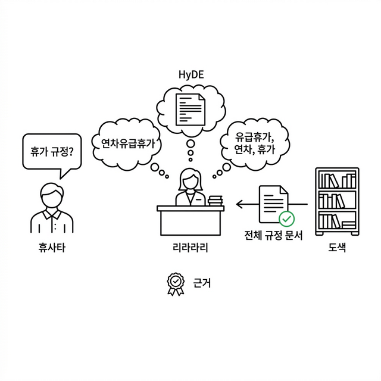
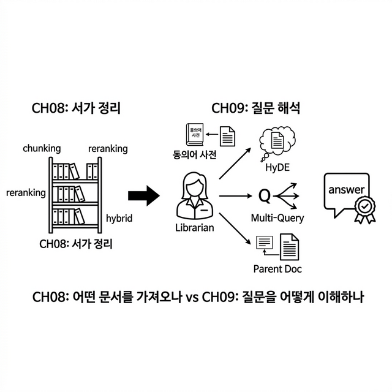
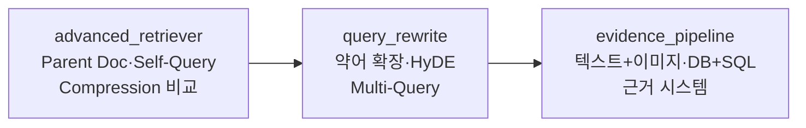
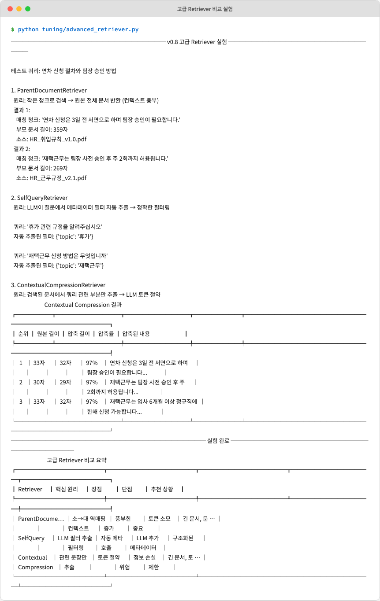
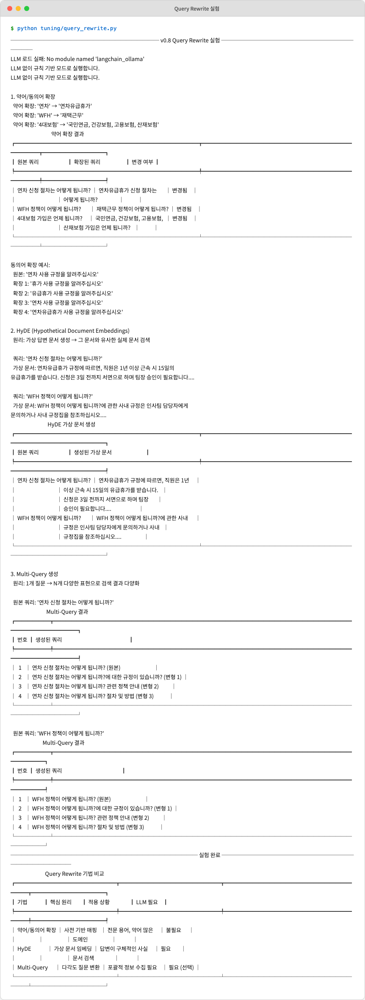
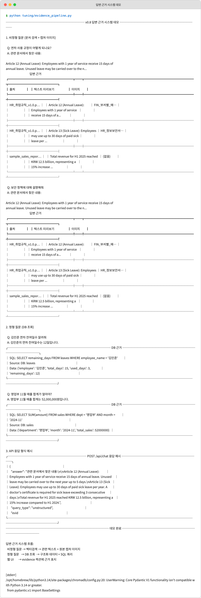

# Ch.9: "질문을 제대로 이해 못한다" — 질문+답변 고급 튜닝 (ex09)

> 이번 버전: ex08 → ex09
> 한 줄 요약: 질문을 바꿔야 답변이 달라진다. RAG에서 진짜 병목은 LLM이 아니라, 질문을 어떻게 해석하느냐다.
> 핵심 개념: Parent Document Retriever, HyDE, 답변 근거(Evidence)

---

## 이야기 파트

<!-- [GEMINI PROMPT: 09_chapter-opening]
path: assets/CH09/09_chapter-opening.png
A minimalist black and white technical diagram with a strict 16:9 aspect ratio
on a solid white background. No shading, no 3D effects, only clean thin line art.
The entire assembly of icons, lines, and text is perfectly centered globally
within the 16:9 frame, leaving generous and equal white space on all sides.

Left: a visitor icon with a speech bubble containing '휴가 규정?' (the original question).
Center: a librarian icon at a desk with three thought bubbles radiating outward:
  top-left: '연차유급휴가' (synonym expansion),
  top-center: a hypothetical document snippet (HyDE),
  top-right: '유급휴가, 연차, 휴가' (multi-query).
Right: a bookshelf icon with an arrow returning a parent document
labeled '전체 규정 문서' with a green checkmark.
Below center: a small evidence badge icon labeled '근거'.
Style: scene-opener
-->


### "휴가"라고 물었는데 못 찾는다

CH08에서 검색 품질을 튜닝했습니다. 청킹 크기를 실험하고, 리랭커로 순서를 바로잡고, BM25와 벡터 검색을 합쳐서 하이브리드로 만들었습니다. 검색 정확도가 꽤 올라갔습니다.

동료가 다시 테스트합니다.

**동료**: "휴가 규정 알려줘."

AI 비서가 대답합니다. 하지만 가져온 문서가 이상합니다. "복리후생 안내" 문서의 일부분이 나왔습니다. 정작 찾고 싶었던 "취업규칙 제15조 연차유급휴가" 규정은 빠져 있습니다.

왜일까요? 문서에는 "연차유급휴가"라고 적혀 있습니다. 동료는 "휴가"라고 물었습니다. 같은 뜻인데, 단어가 다릅니다.

한 번 더 테스트해봅니다.

**동료**: "WFH 정책이 뭐야?"

AI 비서: *"관련 문서를 찾지 못했습니다."*

문서에는 "재택근무"라고 적혀 있습니다. WFH(Work From Home)를 재택근무로 연결하지 못한 겁니다.

CH08에서 해결한 건 **"어떤 문서를 가져오느냐"** 였습니다. 검색 엔진 자체의 성능을 올렸습니다. 그런데 지금 문제는 다릅니다. **검색 엔진이 잘 동작해도, 질문 자체를 이해 못하면 소용없습니다.**

---

### 사서의 언어 능력이 자라다

도서관 비유를 이어가봅시다.

CH08에서 사서는 서가 정리 방법을 배웠습니다. 책을 잘 분류하고, 중요한 책은 앞으로 빼놓고, 키워드 색인과 주제 색인을 동시에 쓰는 법을 배웠습니다.

그런데 방문자가 이렇게 물으면 어떨까요?

**방문자**: "쉬는 날 규정 좀 알려주세요."

초보 사서는 서가에서 "쉬는 날"이라는 단어를 찾습니다. 없습니다. 서가에는 "연차유급휴가"라고 적혀 있으니까요.

경험 많은 사서는 다릅니다.

첫째, **단어를 번역합니다.** "쉬는 날"이라는 말을 들으면 "아, 연차유급휴가를 찾는 거구나"라고 자동 변환합니다. 이게 **약어/동의어 확장**입니다.

둘째, **답을 먼저 상상합니다.** "쉬는 날 규정이라면... 아마 '1년 근속 시 15일 유급휴가' 같은 내용이 있는 문서겠지." 그리고 그 상상한 답과 비슷한 실제 문서를 찾습니다. 이게 **HyDE(Hypothetical Document Embeddings)** 입니다. 질문을 검색하는 게 아니라, 상상한 답변을 검색하는 겁니다.

셋째, **질문을 여러 갈래로 바꿔봅니다.** "쉬는 날 규정"이라는 한 가지 질문을 "연차 사용 방법", "유급휴가 일수", "휴가 신청 절차"처럼 여러 각도로 바꿔서 각각 검색합니다. 이게 **Multi-Query**입니다.

넷째, **찾은 조각에서 원본 전체를 꺼냅니다.** 검색에서 "연차 신청은 3일 전 서면으로 합니다"라는 짧은 조각이 걸렸다면, 그 조각이 속한 원래 문서 전체("취업규칙 제15조~16조")를 꺼내옵니다. 이게 **Parent Document Retriever**입니다. 조각만 보면 맥락을 놓칠 수 있으니, 부모 문서 전체를 보여주는 겁니다.

<!-- [GEMINI PROMPT: 09_librarian-growth]
path: assets/CH09/09_librarian-growth.png
A minimalist black and white technical diagram with a strict 16:9 aspect ratio
on a solid white background. No shading, no 3D effects, only clean thin line art.
The entire assembly of icons, lines, and text is perfectly centered globally
within the 16:9 frame, leaving generous and equal white space on all sides.

A horizontal flow diagram showing the librarian's language skills growth:
Left section labeled 'CH08: 서가 정리' showing a bookshelf with reorganized books
(chunking, reranking, hybrid).
Arrow pointing right to center section labeled 'CH09: 질문 해석' showing
a librarian icon with four skills branching out:
  1. '동의어 사전' — a small dictionary book icon
  2. 'HyDE' — a thought bubble with imagined document
  3. 'Multi-Query' — one question splitting into three arrows
  4. 'Parent Doc' — a small piece linking back to a full document
Right section: a final answer with an evidence badge.
Below: a comparison line — 'CH08: 어떤 문서를 가져오나' vs 'CH09: 질문을 어떻게 이해하나'
Style: concept-diagram
-->

*그림 9-1: CH08이 서가 정리(검색 엔진 튜닝)였다면, CH09는 사서의 언어 능력(질문 해석 튜닝)이다.*

---

### CH08과 CH09의 차이

혼동하기 쉬우니 정리합니다.

| | CH08: 검색 튜닝 | CH09: 질문+답변 튜닝 |
|---|---|---|
| **해결하는 문제** | 엉뚱한 문서를 가져온다 | 질문을 제대로 이해 못한다 |
| **비유** | 서가 정리 방법 개선 | 사서의 언어 능력 향상 |
| **핵심 기법** | 청킹, 리랭킹, 하이브리드 검색 | 동의어 확장, HyDE, Multi-Query, Parent Doc |
| **질문은** | 그대로 둔다 | 바꾼다 |
| **문서 인덱스는** | 바꾼다 | 그대로 둔다 |

CH08은 "같은 질문에 더 좋은 문서를 가져오게" 만들었습니다. CH09는 "질문 자체를 더 잘 이해하게" 만듭니다. 둘 다 중요하지만, 방향이 다릅니다.

---

### 그런데 근거는요?

한 가지 더. 답변의 **신뢰도** 문제가 있습니다.

동료가 AI 비서의 답변을 받았습니다. "연차는 15일입니다." 그럴듯합니다. 하지만 동료가 이렇게 물을 수 있습니다.

**동료**: "이거 어디에 써 있어? 원본 보여줘."

CH05에서 출처(문서명)를 붙이는 건 만들었습니다. 하지만 "HR_취업규칙_v1.0.pdf"라는 파일명만 나옵니다. 그 문서의 몇 페이지, 어떤 조항에 그 내용이 있는지는 모릅니다.

진짜 신뢰할 수 있는 답변이 되려면 **근거(Evidence)** 가 필요합니다. 텍스트 근거뿐 아니라, 원본 문서의 캡처 이미지나 DB 조회 SQL까지 보여주면 "이건 AI가 지어낸 게 아니라 실제 문서에 있는 내용이다"라고 확인할 수 있습니다.

이번 챕터에서 이 세 가지를 모두 다룹니다.

1. **고급 Retriever** — 질문과 문서를 더 잘 연결하는 검색 전략
2. **Query Rewrite** — 질문 자체를 변환해서 검색 품질을 올리는 기법
3. **답변 근거 시스템** — 답변에 원본 이미지와 DB 데이터를 증거로 첨부

---

## 기술 파트

### 용어 정리

| 이야기 속 표현 | 진짜 이름 | 정의 |
|---------------|----------|------|
| 조각에서 원본 전체를 꺼낸다 | **Parent Document Retriever** | 작은 자식 청크로 검색하되, 매칭된 청크가 속한 원본(부모) 문서 전체를 반환하는 검색 전략. 짧은 청크의 정밀한 매칭과 긴 문서의 풍부한 컨텍스트를 동시에 확보한다 |
| LLM이 질문에서 필터를 뽑아낸다 | **Self-Query Retriever** | 자연어 질문에서 메타데이터 필터(topic, source 등)를 자동 추출하여 필터링 후 검색하는 전략. "휴가 관련 규정"이라고 물으면 `topic=휴가` 필터를 자동 적용한다 |
| 관련 부분만 추려낸다 | **Contextual Compression** | 검색된 문서에서 질문과 관련된 문장만 추출하여 LLM에 전달하는 전략. 긴 문서에서 핵심만 뽑아 토큰을 절약한다 |
| 답을 먼저 상상한다 | **HyDE** | Hypothetical Document Embeddings. 질문 대신 가상의 답변 문서를 생성하고, 그 문서의 임베딩으로 실제 문서를 검색하는 기법. 질문과 문서의 의미 간극을 줄인다 |
| 질문을 여러 갈래로 바꾼다 | **Multi-Query** | 하나의 질문을 여러 표현으로 변환하여 각각 검색한 뒤 결과를 합치는 기법. 검색 범위를 넓혀 누락을 줄인다 |
| 약어를 풀어쓴다 | **약어/동의어 확장** | 사내 약어(WFH→재택근무)와 동의어(연차→유급휴가)를 사전으로 관리하여 쿼리를 확장하는 전처리 기법 |
| 증거를 보여준다 | **Evidence Pipeline** | 답변에 원본 텍스트, 캡처 이미지, DB SQL 쿼리 등을 근거로 첨부하여 신뢰도를 높이는 시스템 |

### 파일 계층 구조

```
ex09/tuning/
├── advanced_retriever.py  [실습] Parent Document / Self-Query / Contextual Compression
├── query_rewrite.py       [실습] HyDE, Multi-Query, 약어/동의어 확장
└── evidence_pipeline.py   [실습] 이미지+DB 근거 동시 제공
```

> **코드 위치 참고**: ex09의 코드는 `code/ex08/tuning/` 디렉토리에 함께 위치합니다. CH08(검색 튜닝)과 CH09(질문+답변 튜닝)가 같은 튜닝 파이프라인에 속하기 때문입니다.

### 실습 순서



세 가지 실험을 순서대로 진행합니다. 먼저 고급 Retriever 세 가지(Parent Document, Self-Query, Contextual Compression)를 비교하고, 다음으로 질문을 변환하는 기법(약어 확장, HyDE, Multi-Query)을 테스트합니다. 마지막으로 답변에 원본 이미지와 DB SQL을 근거로 첨부하는 파이프라인을 확인합니다.

---

### [실습] advanced_retriever.py — 고급 Retriever 세 가지

이 파일은 세 가지 고급 검색 전략을 비교 실험합니다. CH08에서 리랭커와 하이브리드 검색으로 "가져오는 문서의 품질"을 높였다면, 여기서는 "검색과 반환 방식 자체"를 바꿉니다.

아래 코드를 `ex08/tuning/advanced_retriever.py`에 작성합니다.

| 파일 | 클래스 | 역할 |
|------|--------|------|
| `advanced_retriever.py` | `ParentDocumentRetrieverDemo` | 자식 청크로 검색 → 부모 문서 전체 반환 |
| `advanced_retriever.py` | `SelfQueryRetrieverDemo` | 질문에서 메타데이터 필터 자동 추출 → 필터링 검색 |
| `advanced_retriever.py` | `ContextualCompressionRetrieverDemo` | 검색된 문서에서 관련 부분만 압축 추출 |
| `advanced_retriever.py` | `run_advanced_retriever_experiment()` | 세 가지 Retriever 비교 실험 실행 |

#### Parent Document Retriever — 조각으로 찾고, 원본을 돌려준다

CH04에서 문서를 500자씩 잘랐습니다. 검색할 때는 이 짧은 청크가 효율적입니다. 하지만 LLM에게 답변을 생성하라고 줄 때는 짧은 조각만으로는 맥락이 부족합니다.

Parent Document Retriever는 이 문제를 해결합니다. **검색은 작은 청크로, 반환은 원본 문서로.**

먼저 부모 문서와 자식 청크의 구조를 봅시다:

```python
PARENT_DOCUMENTS = [
    {
        "id": "parent_001",
        "title": "HR 취업규칙 - 휴가 규정",
        "content": """제15조 (연차유급휴가)
사용자는 1년간 80퍼센트 이상 출근한 근로자에게 15일의 유급휴가를 주어야 한다.
사용자는 3년 이상 계속하여 근로한 근로자에게는 제1항에 따른 휴가에 최초 1년을 초과하는
계속 근로 연수 매 2년에 대하여 1일을 가산한 유급휴가를 주어야 한다.
이 경우 가산휴가를 포함한 총 휴가 일수는 25일을 한도로 한다.

제16조 (연차 신청)
연차유급휴가를 사용하고자 할 때에는 사용 예정일 3일 전까지 인사담당자에게 서면으로
신청하여야 한다. 단, 긴급한 경우에는 구두 신청 후 사후 서면 제출이 가능하다.
팀장은 업무 상황을 고려하여 휴가 시기를 조정할 수 있으나, 근로자의 휴가 사용 권리는
침해하여서는 아니 된다.""",
        "metadata": {"source": "HR_취업규칙_v1.0.pdf", "chapter": "15-16", "topic": "휴가"}
    },
]

CHILD_CHUNKS = [
    {"parent_id": "parent_001", "content": "연차유급휴가는 1년간 80% 이상 출근 시 15일이 부여됩니다.", "metadata": {"source": "HR_취업규칙_v1.0.pdf"}},
    {"parent_id": "parent_001", "content": "3년 이상 근속 시 매 2년마다 1일씩 추가되며 최대 25일입니다.", "metadata": {"source": "HR_취업규칙_v1.0.pdf"}},
    {"parent_id": "parent_001", "content": "연차 신청은 3일 전 서면으로 하며 팀장 승인이 필요합니다.", "metadata": {"source": "HR_취업규칙_v1.0.pdf"}},
]
```

부모 문서는 제15조~16조 전체 텍스트입니다. 자식 청크는 핵심 내용을 한 줄로 요약한 것입니다. 검색은 짧은 자식 청크로, 반환은 긴 부모 문서로 합니다.

핵심 클래스입니다:

```python
class ParentDocumentRetrieverDemo:
    """작은 자식 청크로 검색하고 부모 문서 전체를 반환하는 데모."""

    def __init__(self, parent_docs, child_chunks):
        """초기화합니다."""
        self.parent_docs = {doc["id"]: doc for doc in parent_docs}
        self.child_chunks = child_chunks

    def search(self, query, top_k=2):
        """자식 청크로 검색하고 부모 문서를 반환합니다."""
        # 자식 청크에서 쿼리 키워드 매칭
        query_words = set(query.lower().split())
        scored_chunks = []

        for chunk in self.child_chunks:
            chunk_words = set(chunk["content"].lower().split())
            score = len(query_words & chunk_words) / len(query_words) if query_words else 0
            scored_chunks.append((score, chunk))

        scored_chunks.sort(key=lambda x: x[0], reverse=True)

        # 상위 자식 청크에서 부모 문서 ID 추출 (중복 제거)
        seen_parents = set()
        results = []

        for score, chunk in scored_chunks:
            parent_id = chunk["parent_id"]
            if parent_id not in seen_parents and len(results) < top_k:
                seen_parents.add(parent_id)
                parent_doc = self.parent_docs.get(parent_id)
                if parent_doc:
                    results.append({
                        "parent_content": parent_doc["content"],
                        "child_chunk": chunk["content"],
                        "metadata": parent_doc["metadata"],
                        "score": score,
                        "retriever_type": "parent_document"
                    })

        return results
```

`__init__`에서 부모 문서를 `{id: doc}` 딕셔너리로 변환합니다. 빠른 역참조를 위해서입니다.

`search()`의 흐름은 두 단계입니다. 먼저 모든 자식 청크에 대해 쿼리 키워드 매칭 점수를 계산합니다. 쿼리 단어와 청크 단어의 교집합 비율이 점수입니다. 그 다음 상위 청크에서 `parent_id`를 꺼내 부모 문서 전체를 반환합니다. `seen_parents`로 같은 부모가 중복 반환되는 걸 막습니다.

결과를 보면 `child_chunk`(매칭된 조각)와 `parent_content`(부모 문서 전체)가 함께 들어 있습니다. LLM에게는 `parent_content`를 넘겨서 풍부한 맥락으로 답변하게 합니다.

#### Self-Query Retriever — 질문에서 필터를 자동 추출

"휴가 관련 규정을 알려주세요"라고 물었을 때, 사람은 자연스럽게 "아, 이건 휴가 토픽이구나"라고 파악합니다. Self-Query Retriever는 이걸 자동화합니다:

```python
class SelfQueryRetrieverDemo:
    """질문에서 메타데이터 필터를 자동 추출하여 검색하는 데모."""

    def __init__(self, documents, llm=None):
        """초기화합니다."""
        self.documents = documents
        self.llm = llm

    def extract_filter_from_query(self, query):
        """쿼리에서 메타데이터 필터를 추출합니다."""
        filters = {}

        # 토픽 키워드 매핑
        topic_keywords = {
            "휴가": ["연차", "휴가", "유급"],
            "재택근무": ["재택", "원격", "WFH"],
            "출장": ["출장", "여비", "출장비"],
            "평가": ["성과", "평가", "KPI"],
            "복리후생": ["복지", "복리", "자기계발", "건강검진"]
        }

        query_lower = query.lower()
        for topic, keywords in topic_keywords.items():
            if any(kw in query_lower for kw in keywords):
                filters["topic"] = topic
                break

        return filters

    def search(self, query, top_k=3):
        """메타데이터 자동 필터링으로 검색합니다."""
        # 자동 필터 추출
        filters = self.extract_filter_from_query(query)
        console.print(f"  [dim]자동 추출된 필터: {filters}[/dim]")

        # 필터 적용
        filtered_docs = self.documents
        for key, value in filters.items():
            filtered_docs = [
                doc for doc in filtered_docs
                if doc.get("metadata", {}).get(key) == value
            ]

        # 키워드 기반 점수 계산
        query_words = set(query.lower().split())
        scored_docs = []
        for doc in filtered_docs:
            content_words = set(doc["content"].lower().split())
            score = len(query_words & content_words) / len(query_words) if query_words else 0
            scored_docs.append((score, doc))

        scored_docs.sort(key=lambda x: x[0], reverse=True)

        results = []
        for score, doc in scored_docs[:top_k]:
            results.append({
                "content": doc["content"],
                "score": score,
                "metadata": doc.get("metadata", {}),
                "applied_filter": filters,
                "retriever_type": "self_query"
            })

        return results
```

`extract_filter_from_query()`가 핵심입니다. `topic_keywords` 딕셔너리에 토픽별 키워드를 등록해두고, 쿼리에 해당 키워드가 있으면 필터를 추출합니다. "연차 신청 절차"라고 물으면 `{"topic": "휴가"}` 필터가 자동 적용되어, 휴가와 무관한 재택근무나 출장 문서는 아예 검색 대상에서 제외됩니다.

이 구현은 규칙 기반이지만, 실제 LangChain의 `SelfQueryRetriever`는 LLM이 필터를 추출합니다. 규칙으로 커버할 수 없는 복잡한 질문("작년에 바뀐 규정 중 연차 관련된 거")도 LLM이라면 `{"topic": "휴가", "year": "2025"}` 같은 필터를 뽑아낼 수 있습니다.

#### Contextual Compression — 관련 부분만 추려낸다

검색된 문서가 길면 LLM 토큰을 많이 잡아먹습니다. Contextual Compression은 검색 결과에서 질문과 관련된 문장만 추출합니다:

```python
class ContextualCompressionRetrieverDemo:
    """검색 결과에서 쿼리 관련 부분만 추출하여 컨텍스트를 절약하는 데모."""

    def __init__(self, documents):
        """초기화합니다."""
        self.documents = documents

    def compress_document(self, query, document):
        """문서에서 쿼리 관련 문장만 추출합니다."""
        query_words = set(query.lower().split())
        sentences = [s.strip() for s in document.replace("\n", ". ").split(".") if s.strip()]

        relevant_sentences = []
        for sentence in sentences:
            sentence_words = set(sentence.lower().split())
            overlap = len(query_words & sentence_words)
            if overlap >= 1 and len(sentence) > 10:
                relevant_sentences.append(sentence)

        return ". ".join(relevant_sentences[:3]) if relevant_sentences else document[:100]

    def search(self, query, top_k=3):
        """검색 후 관련 내용만 압축하여 반환합니다."""
        query_words = set(query.lower().split())

        # 초기 검색
        scored_docs = []
        for doc in self.documents:
            content_words = set(doc["content"].lower().split())
            score = len(query_words & content_words) / len(query_words) if query_words else 0
            scored_docs.append((score, doc))

        scored_docs.sort(key=lambda x: x[0], reverse=True)

        results = []
        for score, doc in scored_docs[:top_k]:
            original_content = doc["content"]
            compressed_content = self.compress_document(query, original_content)

            results.append({
                "original_content": original_content,
                "compressed_content": compressed_content,
                "compression_ratio": len(compressed_content) / len(original_content),
                "score": score,
                "metadata": doc.get("metadata", {}),
                "retriever_type": "contextual_compression"
            })

        return results
```

`compress_document()`가 압축 로직입니다. 문서를 문장 단위로 쪼개고, 쿼리 단어와 겹치는 문장만 골라냅니다. 결과에 `compression_ratio`가 포함되어 얼마나 압축했는지 확인할 수 있습니다.

Parent Document Retriever가 "더 많이 보여주는" 방향이라면, Contextual Compression은 "핵심만 추려주는" 방향입니다. 정반대 전략인데, 상황에 따라 선택합니다.

> **세 가지 Retriever 비교**
>
> | Retriever | 핵심 원리 | 장점 | 단점 | 추천 상황 |
> |---|---|---|---|---|
> | Parent Document | 작은 청크 검색 → 부모 문서 반환 | 풍부한 컨텍스트 | 토큰 소모 증가 | 긴 문서, 문맥이 중요한 답변 |
> | Self-Query | 질문에서 메타데이터 필터 자동 추출 | 정확한 필터링 | LLM 추가 호출 필요 | 구조화된 메타데이터가 있는 문서 |
> | Contextual Compression | 검색 결과에서 관련 문장만 추출 | 토큰 절약 | 정보 손실 위험 | 긴 문서, 토큰 제한 환경 |

```bash
# 실행
python tuning/advanced_retriever.py
```

<!-- [CAPTURE NEEDED: 09_advanced-retriever
  path: assets/CH09/09_advanced-retriever.png
  desc: advanced_retriever.py 실행 결과. ParentDocumentRetriever, SelfQueryRetriever, ContextualCompressionRetriever 세 가지 비교 실험. 테스트 쿼리 "연차 신청 절차와 팀장 승인 방법"에 대해 각 Retriever의 결과가 테이블로 출력되는 화면.
] -->

*그림 9-2: 같은 쿼리에 대해 세 가지 Retriever가 다른 방식으로 문서를 찾는다.*

---

### [실습] query_rewrite.py — 질문을 바꿔서 검색한다

이 파일은 세 가지 쿼리 변환 기법을 구현합니다. 검색 엔진을 건드리지 않고, 질문 자체를 바꿔서 검색 품질을 올리는 접근입니다.

아래 코드를 `ex08/tuning/query_rewrite.py`에 작성합니다.

| 파일 | 함수/클래스 | 역할 |
|------|------------|------|
| `query_rewrite.py` | `expand_abbreviations(query)` | 약어를 전체 용어로 확장 |
| `query_rewrite.py` | `add_synonyms(query)` | 동의어 변형 쿼리 리스트 생성 |
| `query_rewrite.py` | `generate_hypothetical_document(query, llm)` | HyDE 가상 문서 생성 |
| `query_rewrite.py` | `generate_multi_queries(query, llm)` | Multi-Query 다각도 질문 생성 |
| `query_rewrite.py` | `merge_multi_query_results(all_results)` | 다중 쿼리 결과 병합 및 중복 제거 |

#### 약어/동의어 확장 — LLM 없이 바로 되는 첫 번째 개선

가장 간단하면서도 효과 큰 방법입니다. 사내에서 쓰는 약어와 동의어를 사전으로 등록해둡니다:

```python
ABBREVIATION_MAP = {
    "연차": "연차유급휴가",
    "WFH": "재택근무",
    "WFH 정책": "재택근무 규정",
    "OT": "초과근무 (잔업)",
    "HR": "인사부서",
    "PIP": "성과개선계획",
    "연봉 협상": "임금 조정 절차",
    "퇴직금": "퇴직급여",
    "4대보험": "국민연금, 건강보험, 고용보험, 산재보험",
    "경조사": "경조금 지원 규정",
    "반차": "반일 연차",
    "반반차": "2시간 단위 연차",
}

SYNONYM_MAP = {
    "연차": ["유급휴가", "휴가", "연차유급휴가"],
    "재택근무": ["원격근무", "WFH", "홈오피스"],
    "성과평가": ["인사고과", "평가", "KPI 달성"],
    "출장": ["외근", "출장업무", "여비"],
    "복리후생": ["복지", "혜택", "베네핏"],
    "온보딩": ["신입교육", "입사교육", "오리엔테이션"],
}
```

약어 확장 함수는 단순합니다:

```python
def expand_abbreviations(query):
    """쿼리의 약어를 전체 용어로 확장합니다."""
    expanded = query
    for abbrev, full_form in ABBREVIATION_MAP.items():
        if abbrev in expanded:
            expanded = expanded.replace(abbrev, full_form)
            console.print(f"  [dim]약어 확장: '{abbrev}' → '{full_form}'[/dim]")

    return expanded
```

"WFH 정책이 뭐야?" → "재택근무 규정이 뭐야?"로 바뀝니다. LLM 호출 없이 문자열 치환만으로 됩니다.

동의어 확장은 원본 쿼리를 여러 변형으로 늘립니다:

```python
def add_synonyms(query):
    """동의어를 추가한 확장 쿼리 목록을 생성합니다."""
    queries = [query]

    for term, synonyms in SYNONYM_MAP.items():
        if term in query:
            for synonym in synonyms:
                new_query = query.replace(term, synonym)
                if new_query != query:
                    queries.append(new_query)

    return list(set(queries))
```

"연차 사용 규정을 알려주세요" 하나가 ["연차 사용 규정을 알려주세요", "유급휴가 사용 규정을 알려주세요", "휴가 사용 규정을 알려주세요", "연차유급휴가 사용 규정을 알려주세요"]로 확장됩니다.

이 사전은 조직마다 다릅니다. 도입 후 첫 한 달간 사용자들이 자주 쓰는 약어를 모아서 사전에 추가하면 됩니다.

#### HyDE — 답을 먼저 상상하고, 그 답과 비슷한 문서를 찾는다

HyDE는 직관적이지 않은 기법입니다. 질문을 검색하는 게 아니라, **가상의 답변을 생성해서 그 답변으로 검색**합니다.

왜 이게 효과적일까요? 질문("휴가 규정 알려줘")과 문서("제15조 연차유급휴가. 사용자는 1년간 80퍼센트 이상 출근한 근로자에게...")는 표현이 많이 다릅니다. 질문은 짧고 구어체이고, 문서는 길고 공문서체입니다. 임베딩 벡터 간 거리가 멀 수 있습니다.

하지만 가상 답변("연차유급휴가 규정에 따르면, 직원은 1년 이상 근속 시 15일의 유급휴가를 받습니다")은 실제 문서와 표현이 비슷합니다. 가상 답변의 임베딩으로 검색하면 실제 문서가 더 잘 잡힙니다.

```python
def generate_hypothetical_document_llm(query, llm):
    """LLM으로 HyDE 가상 답변 문서를 생성합니다."""
    try:
        from langchain_core.messages import HumanMessage

        hyde_prompt = f"""다음 질문에 대한 가상의 사내 규정 문서 발췌문을 생성하십시오.
실제 존재하는 문서처럼 구체적인 내용으로 작성하십시오.

질문: {query}

사내 규정 발췌문 (3-5문장):"""

        response = llm.invoke([HumanMessage(content=hyde_prompt)])
        return response.content.strip()

    except Exception as e:
        console.print(f"[yellow]LLM 생성 실패: {e}[/yellow]")
        return generate_hypothetical_document_rule_based(query)
```

LLM에게 "이 질문에 대한 가상의 규정 문서를 써줘"라고 요청합니다. LLM이 만든 가상 문서는 정확할 필요가 없습니다. **실제 문서와 비슷한 어투, 비슷한 키워드**를 갖고 있으면 됩니다. 이 가상 문서의 임베딩 벡터로 ChromaDB를 검색하면, 질문으로 직접 검색하는 것보다 관련 문서를 더 잘 찾습니다.

LLM이 없으면 규칙 기반 폴백을 씁니다:

```python
def generate_hypothetical_document_rule_based(query):
    """규칙 기반으로 가상 답변 문서를 생성합니다."""
    templates = {
        "연차": "연차유급휴가 규정에 따르면, 직원은 1년 이상 근속 시 15일의 유급휴가를 받습니다. 신청은 3일 전까지 서면으로 하며 팀장 승인이 필요합니다.",
        "재택": "재택근무 정책에 의거하여, 입사 6개월 이상 정규직 직원은 주 2회까지 재택근무를 신청할 수 있습니다. 팀장 사전 승인이 필요하며 정규 근무시간을 준수해야 합니다.",
        "출장": "출장 규정에 따라, 출장비는 완료 후 5영업일 이내에 영수증과 함께 정산 신청해야 합니다. 숙박비 15만원, 식비 5만원이 한도입니다.",
        "평가": "성과 평가 지침에 따르면, 평가는 상하반기 각 1회 실시하며 목표달성도 60%, 역량평가 30%, 동료평가 10%로 구성됩니다.",
    }

    query_lower = query.lower()
    for keyword, template in templates.items():
        if keyword in query_lower:
            return template

    return f"{query}에 관한 사내 규정은 인사팀 담당자에게 문의하거나 사내 규정집을 참조하십시오."
```

키워드별로 미리 만들어둔 가상 문서 템플릿을 반환합니다. LLM만큼 정교하지는 않지만, 최소한의 HyDE 효과를 냅니다.

#### Multi-Query — 한 질문을 여러 각도로

Multi-Query는 쉬운 개념입니다. 한 질문을 여러 표현으로 바꿔서 각각 검색한 다음, 결과를 합칩니다:

```python
def generate_multi_queries_llm(query, llm, num_queries=3):
    """LLM으로 다양한 관점의 쿼리를 생성합니다."""
    try:
        from langchain_core.messages import HumanMessage

        prompt = f"""다음 질문을 {num_queries}가지 다른 방식으로 재표현하십시오.
각 질문은 같은 정보를 구하지만 다른 표현 방식을 사용해야 합니다.
번호 없이 각 질문을 한 줄씩 출력하십시오.

원본 질문: {query}

재표현된 질문들:"""

        response = llm.invoke([HumanMessage(content=prompt)])
        lines = [
            line.strip()
            for line in response.content.strip().split("\n")
            if line.strip() and not line.strip().startswith("#")
        ]

        return [query] + lines[:num_queries]

    except Exception as e:
        console.print(f"[yellow]Multi-Query LLM 생성 실패: {e}[/yellow]")
        return generate_multi_queries_rule_based(query)
```

"연차 신청 절차는 어떻게 됩니까?"라는 질문이 들어오면, LLM이 "유급휴가 신청 방법은?", "휴가를 쓰려면 어떤 절차를 밟아야 하나요?", "연차 사용 신청서 제출 방법은?" 같은 변형을 만듭니다. 원본 쿼리로는 못 잡는 문서를 변형 쿼리로 잡을 수 있습니다.

결과를 합칠 때는 중복 제거가 중요합니다:

```python
def merge_multi_query_results(all_results, top_k=5):
    """다중 쿼리 결과를 병합하고 중복을 제거합니다."""
    seen_contents = set()
    merged = []

    for results in all_results:
        for result in results:
            content_key = result.get("content", "")[:50]
            if content_key not in seen_contents:
                seen_contents.add(content_key)
                merged.append(result)

    # 점수 기준 정렬
    merged.sort(key=lambda x: x.get("score", 0), reverse=True)
    return merged[:top_k]
```

`content_key`로 내용 앞 50자를 비교해서 같은 문서가 중복 포함되는 걸 막습니다. 점수순으로 정렬한 뒤 상위 `top_k`개만 반환합니다.

```bash
# 실행
python tuning/query_rewrite.py
```

<!-- [CAPTURE NEEDED: 09_query-rewrite
  path: assets/CH09/09_query-rewrite.png
  desc: query_rewrite.py 실행 결과. 약어 확장("WFH 정책" → "재택근무 규정"), HyDE 가상 문서 생성, Multi-Query 변형 쿼리 3개가 테이블로 출력되는 화면.
] -->

*그림 9-3: 약어 확장, HyDE, Multi-Query가 질문을 어떻게 변환하는지 확인한다.*

---

### [실습] evidence_pipeline.py — 답변에 근거를 붙인다

지금까지는 검색을 잘 하는 데 집중했습니다. 이 파일은 방향이 다릅니다. **검색 결과에 근거(evidence)를 첨부**합니다.

아래 코드를 `ex08/tuning/evidence_pipeline.py`에 작성합니다.

| 파일 | 함수 | 역할 |
|------|------|------|
| `evidence_pipeline.py` | `retrieve_with_evidence(query, query_type)` | 질문 유형별 근거 포함 검색 |
| `evidence_pipeline.py` | `_retrieve_unstructured_evidence(query)` | 비정형 질문 → 벡터검색 + 캡처 이미지 근거 |
| `evidence_pipeline.py` | `_retrieve_structured_evidence(query)` | 정형 질문 → DB 조회 + SQL 근거 |
| `evidence_pipeline.py` | `format_evidence_response(result)` | 근거를 API 응답 형식으로 변환 |

#### 근거의 두 가지 종류

비정형 질문과 정형 질문에 따라 근거의 형태가 다릅니다:

```python
def retrieve_with_evidence(query, query_type="unstructured", top_k=3):
    """질문에 대해 답변 근거를 포함한 검색 결과를 반환합니다."""
    if query_type == "structured":
        return _retrieve_structured_evidence(query)
    else:
        return _retrieve_unstructured_evidence(query, top_k)
```

**비정형 질문** ("연차 규정 알려줘")의 근거는 텍스트 발췌 + 원본 문서 캡처 이미지입니다:

```python
def _retrieve_unstructured_evidence(query, top_k=3):
    """비정형 질문에 대해 벡터검색 + 캡처 이미지 근거를 반환합니다."""
    try:
        import chromadb
        from chromadb.config import Settings

        client = chromadb.Client(Settings(anonymized_telemetry=False))

        try:
            collection = client.get_collection("document_captures")
        except Exception:
            return _get_sample_unstructured_evidence(query)

        results = collection.query(
            query_texts=[query],
            n_results=top_k,
            include=["documents", "metadatas", "distances"],
        )

        evidence = []
        for i in range(len(results["ids"][0])):
            doc_text = results["documents"][0][i]
            meta = results["metadatas"][0][i]
            distance = results["distances"][0][i]

            evidence.append({
                "text": doc_text[:300],
                "image_path": meta.get("image_path", ""),
                "source": meta.get("source", "unknown"),
                "page": meta.get("page", ""),
                "relevance": round(1 - distance, 3),
            })

        context = "\n".join(e["text"][:200] for e in evidence)
        answer = f"관련 문서에서 찾은 내용:\n\n{context}" if evidence else "관련 문서를 찾지 못했습니다."

        return {
            "answer": answer,
            "query_type": "unstructured",
            "evidence": evidence,
        }

    except (ImportError, Exception):
        return _get_sample_unstructured_evidence(query)
```

ChromaDB의 `document_captures` 컬렉션에서 검색합니다. 각 결과에는 텍스트뿐 아니라 `image_path`(원본 문서 캡처 이미지 경로)와 `page`(페이지 번호)가 메타데이터로 포함됩니다. `relevance`는 `1 - distance`로 계산해서 높을수록 관련도가 높게 표시합니다.

**정형 질문** ("김민준 연차 잔여일수")의 근거는 SQL 쿼리와 DB 데이터입니다:

```python
def _retrieve_structured_evidence(query):
    sample_db_results = {
        "연차": {
            "answer": "김민준의 연차 잔여일수는 12일입니다.",
            "evidence": [{
                "table_data": {
                    "employee": "김민준",
                    "total_days": 15,
                    "used_days": 3,
                    "remaining_days": 12,
                },
                "query": "SELECT remaining_days FROM leaves WHERE employee_name = '김민준'",
                "source": "DB: leaves",
            }],
        },
        "매출": {
            "answer": "영업부 11월 매출 합계는 52,000,000원입니다.",
            "evidence": [{
                "table_data": {
                    "department": "영업부",
                    "month": "2024-11",
                    "total_sales": 52000000,
                },
                "query": "SELECT SUM(amount) FROM sales WHERE dept = '영업부' AND month = '2024-11'",
                "source": "DB: sales",
            }],
        },
    }

    for keyword, result in sample_db_results.items():
        if keyword in query:
            return {
                "answer": result["answer"],
                "query_type": "structured",
                "evidence": result["evidence"],
            }

    return {
        "answer": "해당 데이터를 찾을 수 없습니다.",
        "query_type": "structured",
        "evidence": [],
    }
```

DB 조회 결과에 실행한 SQL 쿼리까지 첨부합니다. "이 숫자는 leaves 테이블에서 이 쿼리로 가져온 겁니다"라고 보여주면, 동료가 직접 DB를 열어서 검증할 수도 있습니다.

#### API 응답 형식

근거를 웹 UI에 보여주려면 일관된 형식이 필요합니다:

```python
def format_evidence_response(result):
    formatted_evidence = []

    for ev in result.get("evidence", []):
        if result["query_type"] == "unstructured":
            image_path = ev.get("image_path", "")
            image_url = ""
            if image_path:
                try:
                    rel_path = Path(image_path).relative_to(BASE_DIR)
                    image_url = f"/static/{rel_path}"
                except ValueError:
                    image_url = image_path

            formatted_evidence.append({
                "text": ev.get("text", ""),
                "image_url": image_url,
                "source": ev.get("source", ""),
                "page": ev.get("page", ""),
                "relevance": ev.get("relevance", 0),
            })
        else:
            formatted_evidence.append({
                "table_data": ev.get("table_data", {}),
                "query": ev.get("query", ""),
                "source": ev.get("source", ""),
            })

    return {
        "answer": result["answer"],
        "query_type": result["query_type"],
        "evidence": formatted_evidence,
    }
```

비정형 근거에는 `image_url`(웹에서 접근 가능한 이미지 경로)과 `text`(발췌문)가 들어갑니다. 정형 근거에는 `table_data`(구조화된 데이터)와 `query`(SQL)가 들어갑니다. 웹 UI에서 이 형식을 받으면 비정형은 이미지+텍스트로, 정형은 테이블+SQL로 렌더링합니다.

```bash
# 실행
python tuning/evidence_pipeline.py
```

<!-- [CAPTURE NEEDED: 09_evidence-pipeline
  path: assets/CH09/09_evidence-pipeline.png
  desc: evidence_pipeline.py 실행 결과. 비정형 질문("연차 사용 규정")에 대해 텍스트+이미지 근거가, 정형 질문("김민준 연차 잔여일수")에 대해 DB 데이터+SQL 근거가 출력되는 화면. API 응답 JSON 예시도 포함.
] -->

*그림 9-4: 비정형은 문서 텍스트+캡처 이미지, 정형은 DB 데이터+SQL. 답변의 출처를 증거로 보여준다.*

---

### 더 알아보기

**HyDE가 항상 좋은 건 아닙니다.** LLM이 잘못된 가상 문서를 만들면 오히려 관련 없는 실제 문서를 가져올 수 있습니다. 특히 질문이 모호하거나 해당 도메인의 문서가 적을 때 그렇습니다. HyDE는 "답변이 구체적인 사실 문서로 존재하는" 환경(사내 규정, 법률 문서 등)에서 가장 효과적입니다.

**약어 사전은 수동 관리가 필요합니다.** `ABBREVIATION_MAP`과 `SYNONYM_MAP`은 하드코딩된 사전입니다. 새 약어가 생기면 직접 추가해야 합니다. 운영 환경에서는 관리자 UI에서 사전을 편집할 수 있게 만들거나, 사용자 질문 로그에서 빈번한 미매칭 패턴을 분석해서 사전을 갱신하는 방법이 있습니다.

**Parent Document Retriever + Contextual Compression을 조합할 수 있습니다.** 부모 문서 전체를 가져온 뒤(Parent), 거기서 관련 문장만 추출(Compression)하면, 풍부한 컨텍스트와 토큰 절약을 동시에 얻을 수 있습니다. LangChain에서는 `ParentDocumentRetriever`에 `ContextualCompressionRetriever`를 체이닝할 수 있습니다.

---

### 이것만은 기억하세요

- **질문을 바꿔야 답변이 달라집니다.** RAG에서 진짜 병목은 LLM이 아니라, 질문을 어떻게 해석하느냐입니다. 약어 확장, HyDE, Multi-Query로 질문의 의도를 정확히 전달하면 같은 검색 엔진에서도 더 좋은 문서를 찾습니다.
- **근거를 보여줘야 신뢰합니다.** 원본 문서 이미지와 DB SQL을 증거로 첨부하면 "AI가 지어낸 게 아니라 실제 데이터에 있는 내용"임을 확인할 수 있습니다.
- 다음 챕터에서는 **PDF 이미지까지 처리**합니다. 표나 차트가 포함된 문서도 인식하고, 지금까지 만든 RAG 시스템 전체의 **품질을 숫자로 평가**하는 프레임워크를 구축합니다.
