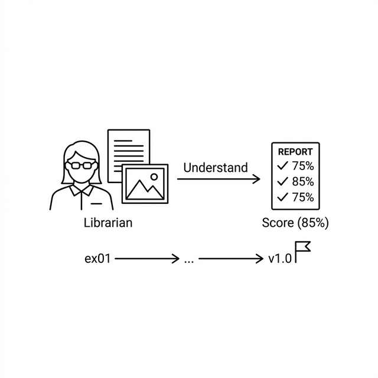
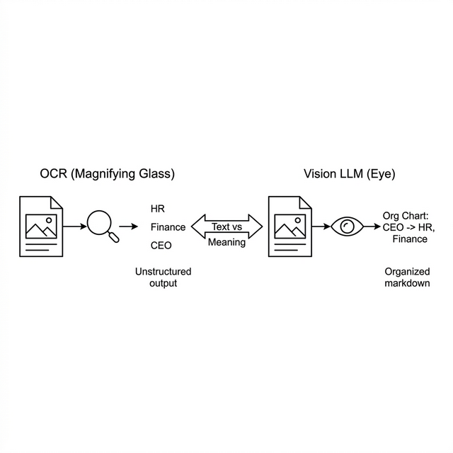
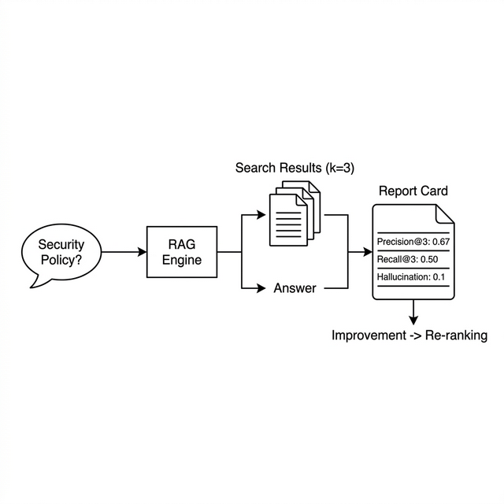
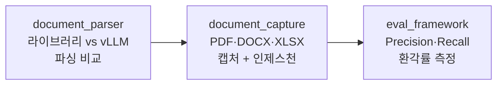
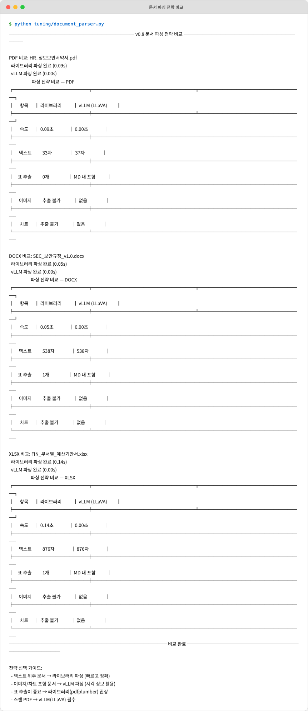
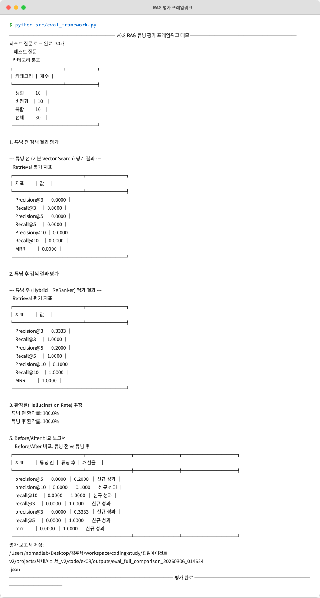

# Ch.10: "PDF 이미지까지 잡아라" — 고급 문서 처리와 평가 (v1.0)

> 이번 버전: ex09 → v1.0
> 한 줄 요약: 측정해야 개선할 수 있다. 느낌이 아니라 숫자로 품질을 측정해야 진짜 개선할 수 있다.
> 핵심 개념: Vision LLM, OCR, Precision@k

---

## 이야기 파트

<!-- [GEMINI PROMPT: 10_chapter-opening]
path: assets/CH10/10_chapter-opening.png
A minimalist black and white technical diagram with a strict 16:9 aspect ratio
on a solid white background. No shading, no 3D effects, only clean thin line art.
The entire assembly of icons, lines, and text is perfectly centered globally
within the 16:9 frame, leaving generous and equal white space on all sides.

Left: a minimalist line-art librarian icon with glasses looking at both
a text document AND a photo/image (two overlapping rectangles, one with lines
for text, one with a mountain/landscape icon for image).
Center: an arrow pointing right labeled 'Understand'.
Right: a report card icon with checkmarks and percentage scores
labeled 'Score (85%)'.
Below: a timeline bar showing 'ex01 → ... → v1.0' with a flag at the end.
Style: scene-opener
-->


### 표가 깨졌다

CH04에서 PDF를 파싱했습니다. pypdf로 텍스트를 추출하고, 청킹하고, 벡터DB에 넣었습니다. 텍스트가 주된 문서에서는 잘 동작했습니다.

어느 날 팀장이 PDF 파일 하나를 던져줍니다.

**팀장**: "이 조직도 PDF도 검색되게 해줘."

PDF를 열어봅니다. 조직도가 그림으로 들어 있고, 표도 여러 개 있습니다. 부서별 인원 현황, 직급별 연봉 테이블.

pypdf로 파싱해봅니다.

```
대표이사  경영지원본부  기술개발본부  영업본부
인사팀재무팀개발1팀개발2팀국내영업해외영업
```

*...뭐지?*

조직도의 박스와 화살표가 사라지고 텍스트만 한 줄로 쭉 이어졌습니다. 표는 더 심합니다. 셀 경계가 없어지면서 "인사팀"과 "재무팀"이 붙어버렸습니다.

pdfplumber로 표를 다시 시도하면 어떨까요? 셀이 병합된 표에서는 `None`이 가득 나옵니다. 조직도 같은 시각 정보는 아예 추출이 안 됩니다.

사람이 PDF를 열면 한눈에 "아, 인사팀은 경영지원본부 아래구나"를 파악합니다. 그런데 pypdf는 **글자만 읽을 수 있는 사서**입니다. 그림을 보는 눈이 없습니다.

---

### 사서에게 눈을 달아주자

지금까지 우리 사서는 글만 읽었습니다. 텍스트를 추출하고, 벡터로 바꾸고, 검색해서 답했습니다.

하지만 사내 문서에는 글이 아닌 정보가 많습니다.

- 조직도 (박스와 화살표)
- 매출 추이 차트 (막대그래프, 선그래프)
- 복잡한 표 (셀 병합, 다단 구조)
- 스캔한 종이 문서 (아예 이미지만 있는 PDF)

이런 문서에서 텍스트만 뽑으면 정보의 절반을 잃습니다.

해결 방법은 두 가지입니다.

**방법 1: OCR — 이미지 속 글자를 읽는다**

OCR(Optical Character Recognition)은 이미지에서 글자를 인식하는 기술입니다. 스캔한 종이 문서처럼 텍스트가 이미지 형태로 박혀 있을 때 씁니다. 사서에게 **확대경**을 준 것과 같습니다. 작은 글씨를 읽게 해주지만, 조직도의 "박스 안에 있다"거나 표의 "이 셀과 저 셀의 관계"까지는 이해하지 못합니다.

**방법 2: Vision LLM — 이미지를 이해한다**

그래서 등장하는 것이 Vision LLM입니다. LLaVA 같은 멀티모달 모델은 이미지를 보고 "이건 조직도이고, 인사팀은 경영지원본부 산하입니다"라고 설명할 수 있습니다. 글자를 읽는 것이 아니라 **그림을 이해**하는 것입니다. 사서에게 **눈**을 달아준 셈입니다. 확대경은 글씨를 읽게 해주지만, 눈은 그림 전체를 이해하게 해줍니다.

<!-- [GEMINI PROMPT: 10_ocr-vs-vision]
path: assets/CH10/10_ocr-vs-vision.png
A minimalist black and white technical diagram with a strict 16:9 aspect ratio
on a solid white background. No shading, no 3D effects, only clean thin line art.
The entire assembly of icons, lines, and text is perfectly centered globally
within the 16:9 frame, leaving generous and equal white space on all sides.

Two side-by-side diagrams:
Left diagram labeled 'OCR (Magnifying Glass)':
  A document icon with an image area → magnifying glass icon →
  scattered text fragments 'HR', 'Finance', 'CEO' (unstructured).
Right diagram labeled 'Vision LLM (Eye)':
  Same document icon → eye icon →
  structured output: 'Org Chart: CEO → HR, Finance'
  (organized markdown).
A comparison arrow between them labeled 'Text vs Meaning'.
Style: concept-diagram
-->

*그림 10-1: OCR은 이미지 속 글자를 읽고, Vision LLM은 이미지의 의미를 이해한다.*

---

### 그런데, 진짜 좋아진 건 맞아?

CH08에서 청킹을 바꿔보고, 리랭킹을 적용하고, 하이브리드 검색을 도입했습니다. CH09에서 Query Rewrite와 근거 시스템까지 추가했습니다.

그때마다 "오, 좋아졌다"고 느꼈습니다. 그런데 **느낌**입니다.

"좋아진 것 같다"와 "85점에서 92점으로 올랐다"는 완전히 다른 이야기입니다.

팀장이 묻습니다.

**팀장**: "AI 비서 검색 정확도가 몇 퍼센트야?"

**나**: "음... 꽤 좋아졌는데요..."

**팀장**: "숫자로."

느낌이 아니라 측정이 필요합니다. 학교에서 시험을 보면 성적표가 나오듯이, AI 비서에게도 성적표가 필요합니다.

이것이 **평가 프레임워크**입니다. 질문을 던지고, 나온 답을 정답과 비교해서 점수를 매깁니다.

- **Precision@k**: 가져온 문서 k개 중 정답이 몇 개인가? (정확도)
- **Recall@k**: 정답 문서 전체 중 몇 개를 찾았는가? (재현율)
- **Hallucination Rate**: 답변에 출처 없는 내용이 섞여 있는가? (환각률)

성적표가 있으면 "리랭킹을 적용하니까 Precision@3이 0.60에서 0.85로 올랐다"고 말할 수 있습니다. 느낌이 아니라 숫자입니다.

<!-- [GEMINI PROMPT: 10_eval-concept]
path: assets/CH10/10_eval-concept.png
A minimalist black and white technical diagram with a strict 16:9 aspect ratio
on a solid white background. No shading, no 3D effects, only clean thin line art.
The entire assembly of icons, lines, and text is perfectly centered globally
within the 16:9 frame, leaving generous and equal white space on all sides.

A horizontal pipeline:
Left: a question bubble 'Security Policy?'
→ box labeled 'RAG Engine'
→ two outputs:
  Top: a stack of 3 document icons labeled 'Search Results (k=3)'
  Bottom: a text block labeled 'Answer'
→ Right: a report card icon labeled 'Report Card' with three rows:
  'Precision@3: 0.67'
  'Recall@3: 0.50'
  'Hallucination: 0.1'
An arrow from report card pointing down to text 'Improvement → Re-ranking'.
Style: concept-diagram
-->

*그림 10-2: RAG 엔진의 성적표. 질문마다 검색 정확도와 환각률을 수치로 측정한다.*

---

### 이번 버전에서 뭘 만드나

v1.0은 마지막 버전입니다. 두 가지를 추가합니다.

| 기능 | 비유 | 코드 |
|------|------|------|
| 문서 파싱 전략 비교 | 사서의 읽기 방식 비교 (라이브러리 vs 눈) | `document_parser.py` |
| OCR 캡처 + 자동 인제스천 | 사서의 확대경 + 서가 정리 | `document_capture.py` |
| RAG 평가 프레임워크 | 사서의 성적표 | `eval_framework.py` |

먼저 문서 파싱을 두 전략으로 비교합니다. 라이브러리로 빠르게 읽을 것인가, Vision LLM의 눈으로 깊이 볼 것인가. 다음으로 문서를 캡처하고 벡터DB에 자동으로 넣는 파이프라인을 만듭니다. 마지막으로 성적표를 만듭니다. 지금까지 만든 모든 것의 품질을 숫자로 증명합니다.

---

### 전체 프로젝트 회고

CH01에서 LLM에게 "우리 회사 휴가 규정 알려줘"라고 물었습니다. LLM은 그럴듯하게 거짓말했습니다. 환각이었습니다. "아, LLM은 우리 회사 문서를 모르는구나." 그 깨달음에서 이 여정이 시작됐습니다.

CH02~CH03에서 사내 시스템의 기반을 다졌습니다. 직원, 연차, 매출 데이터를 API로 만들고, 사내 문서의 표준을 정했습니다. CH04에서 문서를 벡터로 바꾸는 기술을 배웠고, CH05에서 드디어 질문하면 답해주는 RAG 엔진을 완성했습니다.

하지만 "연차 몇 개? 규정은?"이라는 복합 질문에는 답하지 못했습니다. DB와 문서를 동시에 볼 수 없었으니까요. CH06에서 에이전트를 만들어 이 문제를 해결했고, CH07에서는 캐시와 모니터링으로 운영 안정성을 갖췄습니다.

CH08부터 본격적인 튜닝이 시작됐습니다. "엉뚱한 문서를 가져온다"는 문제를 청킹 최적화, 리랭킹, 하이브리드 검색으로 해결했습니다. CH09에서 질문 자체를 재구성하고 답변에 근거를 붙이는 기술을 추가했습니다. 그리고 이번 CH10에서 이미지까지 이해하는 사서를 만들고, 성적표로 품질을 수치화합니다.

돌이켜보면 이 책은 하나의 질문에서 출발했습니다. **"AI가 우리 회사 문서를 알게 하려면 어떻게 해야 하지?"** 그 질문의 답이 RAG이고, 10개 챕터가 그 답을 점진적으로 완성해가는 과정이었습니다.

환각을 보고 → 문서를 넣고 → 검색하고 → 답변하고 → 통합하고 → 안정화하고 → 튜닝하고 → 측정하고. 이 흐름 자체가 실무에서 AI 시스템을 만드는 과정과 같습니다.

---

## 기술 파트

### 용어 정리

| 이야기 속 표현 | 진짜 이름 | 정의 |
|---------------|----------|------|
| 사서의 확대경 | **OCR (Optical Character Recognition)** | 이미지에서 문자를 인식하는 기술. EasyOCR, Tesseract 등의 엔진이 이미지 속 글자 위치와 내용을 추출한다 |
| 사서의 눈 | **Vision LLM** | 이미지를 입력으로 받아 내용을 이해하고 설명하는 멀티모달 대형 언어 모델. LLaVA, GPT-4V 등이 대표적 |
| 사서의 성적표 — 정확도 | **Precision@k** | 검색된 상위 k개 문서 중 실제 관련 문서의 비율. k=3일 때 3개 중 2개가 정답이면 Precision@3 = 0.67 |
| 사서의 성적표 — 재현율 | **Recall@k** | 전체 정답 문서 중 상위 k개 안에 포함된 비율. 정답 4개 중 2개를 찾았으면 Recall@3 = 0.50 |
| 사서의 성적표 — 환각률 | **Hallucination Rate** | 답변에서 출처 문서에 근거하지 않은 내용의 비율. 0에 가까울수록 좋다 |
| 라이브러리 파싱 | **pypdf / pdfplumber** | PDF 파일 구조를 직접 분석하여 텍스트와 표를 추출하는 파이썬 라이브러리 |
| vLLM 파싱 | **LLaVA (Large Language and Vision Assistant)** | Ollama에서 실행 가능한 오픈소스 Vision LLM. 이미지를 base64로 인코딩하여 전달하면 구조화된 설명을 생성한다 |

### 파일 계층 구조

```
v1.0/tuning/
├── document_parser.py    [실습] 라이브러리 vs vLLM 파싱 전략 비교
├── document_capture.py   [실습] OCR 캡처 + 메타데이터 추출 + 벡터DB 인제스천
v1.0/src/
└── eval_framework.py     [실습] Precision@k, Recall@k, Hallucination Rate 평가
```

### 실습 순서



먼저 같은 PDF를 라이브러리(pypdf)와 vLLM(LLaVA)으로 파싱해 비교합니다. 다음으로 문서를 페이지별 이미지로 캡처하고 벡터DB에 저장하는 파이프라인을 실행합니다. 마지막으로 RAG 시스템 전체의 성적표(Precision@k, Recall@k, Hallucination Rate)를 만들어 튜닝 전후 효과를 숫자로 확인합니다.

---

### [실습] document_parser.py — 문서 파싱 전략 비교

같은 PDF를 두 가지 방식으로 파싱하고 결과를 비교합니다.

> **파일 위치**: `v1.0/tuning/document_parser.py`

| 파일 | 함수 | 역할 |
|------|------|------|
| `document_parser.py` | `parse_pdf_library(pdf_path)` | pypdf + pdfplumber로 텍스트/표/이미지 참조 추출 |
| `document_parser.py` | `parse_pdf_vllm(pdf_path)` | PyMuPDF로 페이지 이미지 변환 후 LLaVA로 구조화 분석 |
| `document_parser.py` | `_call_llava(image_path)` | LLaVA(Ollama)에 이미지 base64 전달, 캡션 반환 |
| `document_parser.py` | `compare_strategies(lib, vllm)` | 두 전략 결과를 Rich 비교표로 출력 |

#### 전략 1: 라이브러리 파싱

라이브러리 파싱은 빠르고 정확하지만, 이미지 내용을 이해하지 못합니다.

```python
def parse_pdf_library(pdf_path):
    """라이브러리 기반 PDF 파싱 (pypdf + pdfplumber)."""
    result = {
        "strategy": "library",
        "format": "PDF",
        "text": "",
        "tables": [],
        "images": [],
        "elapsed": 0.0,
    }

    start = time.time()

    # pypdf로 텍스트 추출
    try:
        import pypdf

        reader = pypdf.PdfReader(str(pdf_path))
        pages_text = []
        image_count = 0
        for page in reader.pages:
            text = page.extract_text() or ""
            pages_text.append(text)
            image_count += len(page.images)

        result["text"] = "\n\n".join(pages_text)
        result["images"] = [f"[image_{i+1}]" for i in range(image_count)]

    except ImportError:
        result["text"] = "[pypdf 패키지 필요: pip install pypdf]"

    # pdfplumber로 표 추출
    try:
        import pdfplumber

        with pdfplumber.open(str(pdf_path)) as pdf:
            for page in pdf.pages:
                tables = page.extract_tables()
                for table in tables:
                    result["tables"].append(table)

    except ImportError:
        pass  # pdfplumber 없으면 표 추출 생략
    except FileNotFoundError:
        pass  # 파일이 없으면 생략

    result["elapsed"] = time.time() - start
    return result
```

pypdf가 텍스트를 추출하고, pdfplumber가 표를 추출합니다. 두 라이브러리를 조합하면 텍스트 + 표까지는 잡을 수 있습니다. 하지만 `images` 필드에는 `[image_1]` 같은 참조만 남습니다. 이미지의 내용이 뭔지는 모릅니다.

#### 전략 2: vLLM 파싱

vLLM 파싱은 느리지만, 이미지의 의미까지 이해합니다.

```python
def parse_pdf_vllm(pdf_path):
    """vLLM(LLaVA) 기반 PDF 파싱."""
    result = {
        "strategy": "vllm",
        "format": "PDF",
        "text": "",
        "tables": [],
        "images": [],
        "elapsed": 0.0,
    }

    start = time.time()

    try:
        import fitz  # PyMuPDF

        doc = fitz.open(str(pdf_path))
        page_texts = []

        for page_num in range(len(doc)):
            page = doc[page_num]
            pix = page.get_pixmap(dpi=150)

            img_path = OUTPUTS_DIR / f"_vllm_page_{page_num + 1}.png"
            img_path.parent.mkdir(parents=True, exist_ok=True)
            pix.save(str(img_path))

            caption = _call_llava(img_path)
            page_texts.append(f"## Page {page_num + 1}\n\n{caption}")
            result["images"].append(str(img_path))

            img_path.unlink(missing_ok=True)

        doc.close()
        result["text"] = "\n\n".join(page_texts)

        # LLaVA 출력에서 표 패턴 카운트
        table_markers = result["text"].count("|")
        if table_markers > 10:
            result["tables"].append("[LLaVA detected table structure]")

    except ImportError:
        result["text"] = "[PyMuPDF 패키지 필요: pip install PyMuPDF]"

    result["elapsed"] = time.time() - start
    return result
```

핵심은 `get_pixmap(dpi=150)`입니다. PDF 페이지를 통째로 이미지로 렌더링합니다. 그리고 그 이미지를 LLaVA에게 보냅니다. "이 문서 이미지를 분석해서 텍스트, 표, 차트를 모두 마크다운으로 정리해줘."

LLaVA는 조직도를 보고 "대표이사 아래에 경영지원본부, 기술개발본부, 영업본부가 있다"고 구조화할 수 있습니다. pypdf가 "대표이사경영지원본부기술개발본부"로 뭉개버린 그 정보를요.

임시 이미지는 분석 후 `unlink()`로 바로 삭제합니다. 디스크 공간을 아끼기 위해서입니다.

#### LLaVA 호출 함수

```python
def _call_llava(image_path):
    """LLaVA(Ollama)에 이미지를 전달하고 설명을 받는다."""
    try:
        import base64
        import httpx

        with open(image_path, "rb") as f:
            img_b64 = base64.b64encode(f.read()).decode("utf-8")

        resp = httpx.post(
            f"{OLLAMA_BASE_URL}/api/chat",
            json={
                "model": VISION_MODEL,
                "messages": [
                    {
                        "role": "user",
                        "content": (
                            "Analyze this document image. "
                            "Extract all text, tables, and describe any charts or diagrams. "
                            "Output in structured Markdown format."
                        ),
                        "images": [img_b64],
                    }
                ],
                "stream": False,
            },
            timeout=120.0,
        )
        resp.raise_for_status()
        return resp.json()["message"]["content"]

    except ImportError:
        return "[httpx 패키지 필요: pip install httpx]"
    except Exception as e:
        return f"[LLaVA 분석 실패: {str(e)[:80]}]"
```

Ollama의 `/api/chat` 엔드포인트에 이미지를 base64 인코딩해서 보냅니다. `VISION_MODEL`은 기본값 `llava:7b`입니다. 프롬프트가 중요합니다 — "Analyze this document image... Output in structured Markdown format"으로 구조화된 마크다운 출력을 유도합니다. 타임아웃은 120초로 넉넉하게 잡았습니다. 이미지 분석은 텍스트보다 훨씬 오래 걸립니다.

#### 비교 결과 출력

`compare_strategies()` 함수가 두 전략의 결과를 나란히 보여줍니다.

```python
def compare_strategies(lib_result, vllm_result):
    """두 파싱 전략의 결과를 비교표로 출력한다."""
    table = Table(
        title=f"파싱 전략 비교 — {lib_result['format']}",
        show_lines=True,
    )
    table.add_column("항목", style="cyan", justify="center", width=14)
    table.add_column("라이브러리", style="yellow", width=20)
    table.add_column("vLLM (LLaVA)", style="green", width=20)

    table.add_row(
        "속도",
        f"{lib_result['elapsed']:.2f}초",
        f"{vllm_result['elapsed']:.2f}초",
    )
    table.add_row(
        "텍스트",
        f"{len(lib_result['text']):,}자",
        f"{len(vllm_result['text']):,}자",
    )
    table.add_row(
        "표 추출",
        f"{len(lib_result['tables'])}개",
        f"{len(vllm_result['tables'])}개" if vllm_result["tables"] else "MD 내 포함",
    )

    lib_img_desc = "추출 불가" if not lib_result["images"] else f"{len(lib_result['images'])}개 참조"
    vllm_img_desc = "설명 생성" if vllm_result["images"] else "없음"
    table.add_row("이미지", lib_img_desc, vllm_img_desc)

    has_chart_lib = any("chart" in str(i).lower() for i in lib_result["images"])
    has_chart_vllm = "chart" in vllm_result["text"].lower() or "그래프" in vllm_result["text"]
    table.add_row(
        "차트",
        "참조만" if has_chart_lib else "추출 불가",
        "내용 설명" if has_chart_vllm else "없음",
    )

    console.print(table)
```

속도, 텍스트 분량, 표 추출 수, 이미지 처리, 차트 처리 — 다섯 가지 관점에서 비교합니다. 라이브러리는 0.3초 만에 끝나지만 이미지는 "추출 불가"입니다. vLLM은 4초가 걸리지만 "설명 생성"이 가능합니다.

```bash
# 실행 (Ollama + LLaVA 필요)
ollama pull llava:7b && ollama serve
python tuning/document_parser.py
```

<!-- [CAPTURE NEEDED: 10_parser-comparison
  path: assets/CH10/10_parser-comparison.png
  desc: document_parser.py 실행 결과. PDF/DOCX/XLSX 각각의 파싱 전략 비교표. 라이브러리(0.3초, 1240자, 표 2개, 이미지 추출 불가) vs vLLM(4.2초, 1180자, 표 MD 내 포함, 이미지 설명 생성). 전략 선택 가이드가 함께 출력되는 화면.
] -->

*그림 10-3: 같은 PDF를 라이브러리와 vLLM으로 파싱한 결과 비교. 속도는 라이브러리, 이미지 이해는 vLLM이 우세.*

> **전략 선택 가이드**
>
> | 상황 | 추천 전략 |
> |------|----------|
> | 텍스트 위주 문서 | 라이브러리 파싱 (빠르고 정확) |
> | 이미지/차트 포함 문서 | vLLM 파싱 (시각 정보 활용) |
> | 표 추출이 중요 | 라이브러리 + pdfplumber 권장 |
> | 스캔 PDF | vLLM(LLaVA) 필수 |

---

### [실습] document_capture.py — 캡처 + 인제스천 파이프라인

파싱 전략을 정했으면, 이제 문서를 체계적으로 캡처하고 벡터DB에 넣는 파이프라인을 만듭니다.

> **파일 위치**: `v1.0/tuning/document_capture.py`

| 파일 | 함수 | 역할 |
|------|------|------|
| `document_capture.py` | `capture_pdf_pages(pdf_path)` | PDF를 페이지별 PNG로 캡처 + 텍스트 추출 |
| `document_capture.py` | `capture_docx_images(docx_path)` | DOCX 임베디드 이미지 추출 + 본문 텍스트 |
| `document_capture.py` | `capture_xlsx_sheets(xlsx_path)` | XLSX 시트를 테이블 이미지로 렌더링 + 데이터 추출 |
| `document_capture.py` | `extract_metadata(file_path)` | 파일 메타데이터 추출 (제목, 저자, 페이지 수 등) |
| `document_capture.py` | `ingest_to_vectordb(documents)` | 텍스트 + 이미지 참조를 ChromaDB에 저장 |

#### PDF 페이지별 캡처

```python
def capture_pdf_pages(pdf_path):
    """PDF를 페이지별 PNG로 캡처하고 텍스트를 추출한다."""
    results = []
    output_dir = CAPTURED_DIR / "pdf"
    output_dir.mkdir(parents=True, exist_ok=True)

    try:
        import fitz  # PyMuPDF

        doc = fitz.open(str(pdf_path))
        stem = pdf_path.stem

        for page_num in range(len(doc)):
            page = doc[page_num]

            # 페이지를 PNG로 렌더링
            pix = page.get_pixmap(dpi=200)
            img_filename = f"{stem}_page_{page_num + 1}.png"
            img_path = output_dir / img_filename
            pix.save(str(img_path))

            # 텍스트 추출
            text = page.get_text()

            results.append({
                "page": page_num + 1,
                "image_path": str(img_path),
                "text": text,
                "metadata": {
                    "source": pdf_path.name,
                    "page": page_num + 1,
                    "total_pages": len(doc),
                    "format": "pdf",
                    "image_path": str(img_path),
                },
            })

        doc.close()
        console.print(f"  [green]PDF 캡처 완료: {len(results)}페이지 → {output_dir}[/green]")

    except ImportError:
        console.print("[yellow]PyMuPDF 없음. pip install PyMuPDF 를 실행하십시오.[/yellow]")

        # 대체: pypdf로 텍스트만 추출
        try:
            import pypdf

            reader = pypdf.PdfReader(str(pdf_path))
            for page_num, page in enumerate(reader.pages):
                results.append({
                    "page": page_num + 1,
                    "image_path": "",
                    "text": page.extract_text() or "",
                    "metadata": {
                        "source": pdf_path.name,
                        "page": page_num + 1,
                        "format": "pdf",
                    },
                })
        except ImportError:
            console.print("[red]pypdf도 없습니다. pip install pypdf 를 실행하십시오.[/red]")

    return results
```

`get_pixmap(dpi=200)` — 각 페이지를 200 DPI PNG 이미지로 렌더링합니다. 이 이미지가 나중에 검색 결과와 함께 표시됩니다. "이 문서의 3페이지에서 찾았습니다"와 함께 해당 페이지 캡처 이미지를 보여줄 수 있습니다.

핵심은 텍스트와 이미지를 **동시에** 저장하는 것입니다. 텍스트는 벡터 검색용이고, 이미지 경로는 검색 결과에 시각적 근거를 제공합니다. CH09의 EvidencePipeline과 연결되는 부분입니다.

PyMuPDF가 없을 때 pypdf로 폴백하는 패턴도 눈여겨보세요. 운영 환경에서 의존성 문제로 특정 라이브러리가 설치 안 될 수 있습니다. 기능이 줄어들더라도 동작은 해야 합니다.

#### 벡터DB 인제스천

캡처한 결과를 벡터DB에 넣는 함수입니다.

```python
def ingest_to_vectordb(documents, collection_name="document_captures"):
    """텍스트 청크와 이미지 참조를 ChromaDB에 저장한다."""
    try:
        import chromadb
        from chromadb.config import Settings

        client = chromadb.Client(Settings(anonymized_telemetry=False))
        collection = client.get_or_create_collection(
            name=collection_name,
            metadata={"hnsw:space": "cosine"},
        )

        ids = []
        texts = []
        metadatas = []

        for i, doc in enumerate(documents):
            text = doc.get("text") or doc.get("data_text") or doc.get("context_text") or ""
            if not text.strip():
                continue

            doc_id = f"doc_{i}_{hash(text[:50]) % 10000}"
            meta = doc.get("metadata", {})

            # 이미지 경로를 메타데이터에 포함
            image_path = doc.get("image_path", "")
            if image_path:
                meta["image_path"] = image_path

            ids.append(doc_id)
            texts.append(text[:5000])  # ChromaDB 제한
            metadatas.append({k: str(v) for k, v in meta.items()})

        if ids:
            collection.add(ids=ids, documents=texts, metadatas=metadatas)

        result = {
            "collection": collection_name,
            "total_documents": len(ids),
            "skipped": len(documents) - len(ids),
        }

        console.print(
            f"  [green]벡터DB 인제스천 완료: {len(ids)}건 저장[/green]"
        )
        return result

    except ImportError:
        console.print("[yellow]chromadb 패키지 필요: pip install chromadb[/yellow]")
        return {"error": "chromadb not installed", "total_documents": 0}
```

`image_path`를 메타데이터에 포함하는 것이 핵심입니다. 검색할 때 `meta["image_path"]`를 통해 원본 페이지 이미지를 바로 찾을 수 있습니다. 텍스트에 담기지 않는 시각 정보는 이 이미지를 통해 확인합니다.

`text[:5000]` — ChromaDB는 문서당 저장 길이에 제한이 있습니다. 5,000자로 잘라서 저장합니다.

```bash
# 실행
python tuning/document_capture.py
```

<!-- [CAPTURE NEEDED: 10_capture-pipeline
  path: assets/CH10/10_capture-pipeline.png
  desc: document_capture.py 실행 결과. PDF 캡처 결과 테이블(페이지, 이미지, 텍스트 길이), XLSX 캡처 결과, 벡터DB 인제스천 완료 메시지, 캡처 파이프라인 요약 테이블이 표시되는 화면.
] -->

*그림 10-4: 문서 → 페이지 캡처(PNG) → 텍스트 추출 → 메타데이터 + 이미지 참조 → ChromaDB 저장. 검색 시 텍스트와 원본 이미지를 함께 반환한다.*

---

### [실습] eval_framework.py — RAG 평가 프레임워크

마지막 실습입니다. AI 비서의 성적표를 만듭니다.

> **파일 위치**: `v1.0/src/eval_framework.py`

| 파일 | 함수 | 역할 |
|------|------|------|
| `eval_framework.py` | `calculate_precision_at_k(retrieved, relevant, k)` | 검색된 상위 k개 중 관련 문서 비율 |
| `eval_framework.py` | `calculate_recall_at_k(retrieved, relevant, k)` | 전체 관련 문서 중 상위 k개에 포함된 비율 |
| `eval_framework.py` | `estimate_hallucination_rate(answers, contexts)` | 답변 목록에 대한 환각 발생률 추정 |
| `eval_framework.py` | `compare_experiments(before, after)` | 튜닝 전후 성능 비교 + 개선율 계산 |

#### Precision@k — "가져온 것 중 맞는 게 몇 개야?"

```python
def calculate_precision_at_k(retrieved_sources, relevant_sources, k):
    """Precision@k를 계산한다."""
    if k == 0 or not retrieved_sources:
        return 0.0

    top_k = retrieved_sources[:k]
    relevant_set = set(relevant_sources)

    hits = sum(1 for src in top_k if any(rel in src for rel in relevant_set))
    return hits / k
```

3개를 가져왔는데 2개가 정답이면 Precision@3 = 2/3 = 0.67. 직관적입니다. "사서가 서가에서 책 3권을 가져왔는데, 2권이 질문과 관련된 책이었다."

`any(rel in src for rel in relevant_set)` — 정답 소스명이 검색 결과에 **부분 매칭**되는지 확인합니다. "HR_취업규칙_v1.0.pdf"가 정답인데 검색 결과가 "data/HR_취업규칙_v1.0.pdf"처럼 경로가 붙어 있어도 매칭됩니다.

#### Recall@k — "놓친 건 없어?"

```python
def calculate_recall_at_k(retrieved_sources, relevant_sources, k):
    """Recall@k를 계산한다."""
    if not relevant_sources:
        return 0.0

    top_k = retrieved_sources[:k]
    relevant_set = set(relevant_sources)

    hits = sum(
        1 for rel in relevant_set
        if any(rel in src for src in top_k)
    )
    return hits / len(relevant_set)
```

정답 문서가 4개인데 3개만 찾았으면 Recall@3 = 3/4 = 0.75. "서가에 관련 책이 4권 있었는데, 사서가 3권만 가져왔다." 나머지 1권은 놓친 것입니다.

Precision과 Recall의 관계가 중요합니다. k를 늘리면 Recall은 올라가지만 Precision은 떨어질 수 있습니다. 10권을 가져오면 정답 4개를 다 찾을 수 있지만, 나머지 6권은 관련 없는 문서입니다.

#### Hallucination Rate — "지어낸 건 없어?"

```python
def estimate_hallucination_rate(answers, contexts):
    """환각(Hallucination) 발생률을 휴리스틱으로 추정한다."""
    hallucination_count = 0

    for answer, context_docs in zip(answers, contexts):
        if not context_docs:
            hallucination_count += 1
            continue

        context_combined = " ".join(context_docs).lower()
        answer_words = set(answer.lower().split())
        context_words = set(context_combined.split())

        # 답변 핵심 단어가 컨텍스트에 없으면 환각으로 간주
        key_words = [w for w in answer_words if len(w) > 3]
        if key_words:
            overlap_ratio = len(
                [w for w in key_words if w in context_words]
            ) / len(key_words)
            if overlap_ratio < 0.3:
                hallucination_count += 1

    return hallucination_count / len(answers) if answers else 0.0
```

답변과 컨텍스트의 키워드 겹침을 측정합니다. 3글자 이하 단어(조사, 접속사)를 제외하고, 핵심 단어 중 30% 미만만 컨텍스트에 있으면 "출처에 없는 내용을 지어냈다"고 판정합니다.

이 방식은 LLM 호출 없이 빠르게 환각을 잡아내는 휴리스틱입니다. 완벽하지는 않지만, 비용 없이 대략적인 환각률을 추정할 수 있습니다.

#### Before/After 비교 — 튜닝 효과를 숫자로 증명

```python
def compare_experiments(before_metrics, after_metrics, before_name="튜닝 전", after_name="튜닝 후"):
    """두 실험의 before/after 성능을 비교한다."""
    comparison = {}

    all_keys = set(before_metrics.keys()) | set(after_metrics.keys())

    for key in all_keys:
        before_val = before_metrics.get(key, 0.0)
        after_val = after_metrics.get(key, 0.0)

        if before_val and before_val > 0:
            improvement = (after_val - before_val) / before_val * 100
            improvement_label = f"+{improvement:.1f}%" if improvement >= 0 else f"{improvement:.1f}%"
        elif before_val == 0.0 and after_val > 0:
            # before가 0이고 after가 개선된 경우
            improvement = None
            improvement_label = "신규 성과"
        else:
            improvement = 0.0
            improvement_label = "변화 없음"

        comparison[key] = {
            before_name: before_val,
            after_name: after_val,
            "개선율(%)": improvement,
            "개선율_표시": improvement_label
        }

    # 비교 테이블 출력
    table = Table(title=f"Before/After 비교: {before_name} vs {after_name}")
    table.add_column("지표", style="cyan")
    table.add_column(before_name, style="yellow")
    table.add_column(after_name, style="green")
    table.add_column("개선율", style="magenta")

    for key, vals in comparison.items():
        label = vals["개선율_표시"]
        improvement_val = vals["개선율(%)"]

        if improvement_val is None:
            improvement_str = "[green]신규 성과[/green]"
        elif improvement_val > 0:
            improvement_str = f"[green]+{improvement_val:.1f}%[/green]"
        elif improvement_val < 0:
            improvement_str = f"[red]{improvement_val:.1f}%[/red]"
        else:
            improvement_str = "[dim]변화 없음[/dim]"

        table.add_row(
            key,
            f"{vals[before_name]:.4f}",
            f"{vals[after_name]:.4f}",
            improvement_str
        )

    console.print(table)
    return comparison
```

이 함수가 CH08~CH10 튜닝의 최종 결산입니다. 튜닝 전 지표와 튜닝 후 지표를 나란히 놓고, 각 지표별 개선율을 계산합니다. "Precision@3이 +41.7% 올랐다"처럼 숫자로 증명합니다. 이제 팀장에게 "느낌이 아니라 숫자로" 보고할 수 있습니다.

```bash
# 실행
python src/eval_framework.py
```

<!-- [CAPTURE NEEDED: 10_eval-report
  path: assets/CH10/10_eval-report.png
  desc: eval_framework.py 실행 결과. 테스트 질문 카테고리 분포(정형/비정형/복합), 튜닝 전 Retrieval 평가 지표 테이블, 튜닝 후 Retrieval 평가 지표 테이블, Before/After 비교 테이블(지표별 개선율 포함). Rich 테이블로 표시.
] -->

*그림 10-5: 튜닝 전후 비교. Precision@3, Recall@5, Hallucination Rate의 변화를 한눈에 확인한다.*

### 더 알아보기

**RAGAS는 뭔가요?** — RAGAS(Retrieval Augmented Generation Assessment)는 RAG 시스템을 자동으로 평가하는 프레임워크입니다. Faithfulness, Context Relevancy, Answer Relevancy 등 더 정교한 메트릭을 제공합니다. 이 책에서는 평가의 기본 개념(Precision, Recall, Hallucination)에 집중하고, RAGAS 같은 고급 프레임워크는 다루지 않습니다. `eval_framework.py`에 RAGAS 연동 코드(`run_ragas_evaluation`)가 준비되어 있으니, 관심 있다면 `USE_RAGAS=true` 환경 변수를 설정하고 시도해보세요.

**테스트 케이스를 어떻게 만들어야 하나요?** — 실제 사용자가 자주 하는 질문 20~30개를 모으세요. 각 질문에 대해 "이 질문의 정답은 이 문서에 있다"를 표시합니다. 이걸 골든 세트(Golden Set)라고 합니다. `data/test_questions.json`이 바로 이 골든 세트입니다. 처음 만들 때 수작업이 필요하지만, 한 번 만들면 튜닝할 때마다 재사용할 수 있습니다.

**Precision과 Recall 중 뭐가 더 중요한가요?** — 사내 AI 비서에서는 Precision이 더 중요합니다. 사용자는 상위 3개 결과만 봅니다. 3개 중 2개가 엉뚱한 문서이면 신뢰를 잃습니다. Recall은 놓친 문서가 있어도 상위 결과가 정확하면 사용자 경험에 큰 영향이 없습니다.

**라이브러리 파싱과 vLLM 파싱을 같이 쓸 수는 없나요?** — 가능합니다. 실무에서는 라이브러리로 빠르게 텍스트를 뽑고, 이미지가 포함된 페이지만 vLLM으로 추가 분석하는 하이브리드 전략을 씁니다. `document_parser.py`의 비교 결과를 보고 문서 유형별로 전략을 다르게 가져가면 됩니다.

---

### 이것만은 기억하세요

- **측정해야 개선할 수 있습니다.** Precision@k, Recall@k, Hallucination Rate — 이 세 가지 숫자가 RAG 시스템의 성적표입니다. 느낌이 아니라 숫자로 말하세요.
- **이미지도 문서입니다.** PDF 속 표, 차트, 조직도는 텍스트로 변환하면 정보가 손실됩니다. Vision LLM으로 이미지 자체를 이해하세요.
- **v1.0이 끝이 아닙니다.** 성적표가 있으니 이제 어디를 개선해야 하는지 보입니다. Precision@3이 0.67이면 리랭킹을 강화하고, Hallucination Rate가 높으면 프롬프트를 조정하세요.
- **CH01에서 v1.0까지, 이 여정의 핵심은 하나입니다.** "직접 만들어봐야 이해한다." 환각을 보고, 문서를 넣고, 검색하고, 답변하고, 통합하고, 안정화하고, 튜닝하고, 측정하고 — 이 흐름을 한 번 경험한 여러분은, 이제 어떤 RAG 시스템이든 만들 준비가 되었습니다.

에필로그에서 이 여정을 마무리합니다.
