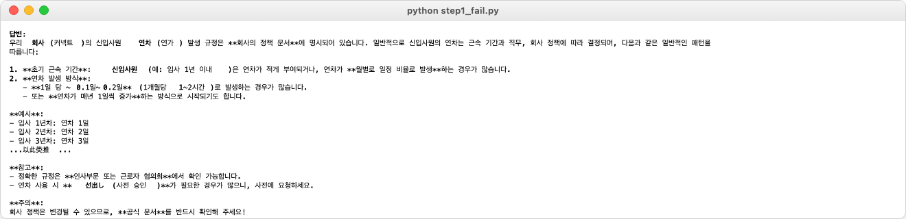
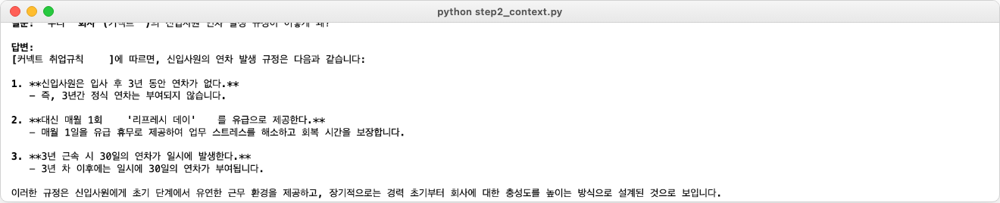
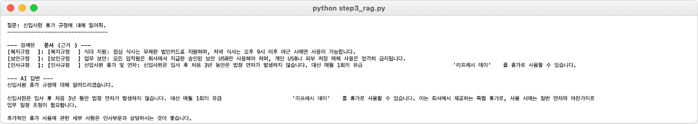
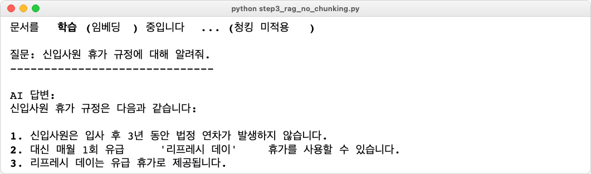
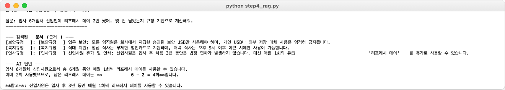

# Ch.1: 엉뚱한 대답 (ex01)

> 이번 버전: 없음 --> ex01<br>
> 한 줄 요약: LLM은 우리 회사 문서를 읽은 적이 없습니다. 문서를 직접 넣어줘야 합니다.<br>
> 핵심 개념: LLM 환각, Context Injection, RAG

---

커넥트에서 사내 시스템을 유지보수한 지 2년째. Python과 FastAPI로 어지간한 건 혼자 처리하는 백엔드 개발자입니다. 오전 10시, 팀장이 자리로 다가옵니다.

**팀장**: "AI로 사내 문서 검색 시스템 만들어봐. 직원들이 규정이나 정책 찾는 게 번거롭다고 해서. 채팅창에 물어보면 바로 답해주는 거."

(AI 비서. 사내 문서. 대화식 검색. 나 혼자서?)

**나**: "언제까지요?"

**팀장**: "급하진 않아. 2주 내로 간단한 프로토타입만."

팀장이 돌아가고, 노트북을 열었습니다. ChatGPT를 띄워 이것저것 물어보다 보니 한 가지 생각이 떠올랐습니다.

(ChatGPT도 뭐든 대답하잖아. LLM에게 우리 회사 규정을 물어보면 되는 거 아니야?)

일단 코드부터 짰습니다.

---

### 자신감 넘치는 거짓말

연차 규정을 예시로 물어봤습니다.

> **나**: 우리 회사(커넥트)의 신입사원 연차 발생 규정이 어떻게 돼?

LLM이 답했습니다.

> **LLM**: 커넥트 사의 신입사원 연차 규정은 근로기준법에 따라, 입사 후 1년 미만 기간에는 1개월 개근 시 1일의 유급휴가가 발생합니다. 1년 이상 근무 시에는 15일의 연차가 발생하며...

그럴듯했습니다. 공식적인 느낌도 나고요.

입사할 때 받은 규정집을 꺼내 비교해봤습니다. 커넥트의 실제 규정은 이랬습니다.

(신입사원은 입사 후 3년 동안은 연차가 없다. 대신 매월 1회 '리프레시 데이'를 유급으로 제공한다. 3년 근속 시 30일의 연차가 일시에 발생한다.)

(잠깐, 뭐라고?)

다시 읽었습니다. 완전히 다른 내용이었습니다. LLM이 방금 그럴듯한 거짓말을 한 겁니다.

---

### 길에서 행인에게 물어보기

여기서 잠깐, 길을 걷다가 아무 행인을 붙잡고 물어보는 상황을 떠올려 보겠습니다.

"저기요, 이 근처 '커넥트 식당' 점심 메뉴가 뭐예요?"

그 행인은 온갖 동네 맛집 정보를 섭렵한 사람입니다. 블로그 리뷰도 읽고 방송에 나온 가게 이름도 외우고 있습니다. 그런데 '커넥트 식당'은 어제 막 오픈한 곳이라 어디에도 정보가 없습니다. 행인이 이 가게를 알 방법이 없습니다.

문제는 이 행인이 "모르겠어요"라고 말하지 않는다는 점입니다. 비슷한 이름의 가게를 떠올리거나, "보통 한식집이면 이런 메뉴겠지"라고 추측해서 자신감 있게 알려줍니다. 듣는 쪽에서는 진짜 아는 것처럼 느껴집니다.

LLM도 똑같습니다. 인터넷에 공개된 거의 모든 텍스트를 학습했습니다. 뉴스, 논문, 블로그, 법률 조항까지. 근로기준법은 줄줄 외우고 일반적인 회사 연차 제도도 잘 압니다. 그런데 커넥트의 사내 규정집은 공개된 적이 없습니다. LLM이 읽을 방법이 없었어요.

그런데도 "모릅니다"라고 하지 않습니다. 자기가 아는 것 중에서 가장 비슷해 보이는 걸 자신감 있게 내놓습니다.

이것을 **환각(Hallucination)** 이라고 부릅니다. GPT든 Claude든 Gemini든 마찬가지입니다. 학습 데이터에 없는 정보를 솔직히 모른다고 하지 않고 그럴듯하게 지어냅니다.

<!-- [GEMINI PROMPT: 01_hallucination-concept]
path: assets/CH01/01_hallucination-concept.png
A minimalist black and white technical diagram with a strict 16:9 aspect ratio
on a solid white background. No shading, no 3D effects, only clean thin line art.
The entire assembly of icons, lines, and text is perfectly centered globally
within the 16:9 frame, leaving generous and equal white space on all sides.

Left side: minimalist line-art person icon labeled '사용자' with speech bubble '커넥트 연차 규정 알려줘'.
Arrow pointing right to minimalist line-art brain icon labeled 'LLM'.
Inside LLM brain: small icons representing 뉴스, 논문, 블로그, 법률 (학습 데이터).
A crossed-out document icon labeled '사내 규정' with text '학습한 적 없음'.
Arrow pointing right from LLM to speech bubble labeled '자신감 넘치는 거짓말'
with text '근로기준법에 따라 15일...' and a small warning triangle icon.
Bottom label: '환각(Hallucination) — 모르는 걸 그럴듯하게 지어낸다'
Style: base
-->

*그림 1-1: LLM은 학습하지 않은 정보를 자신감 있게 지어낸다*

---

### 메뉴판을 보여주며 물어보기

해결책은 단순합니다. 행인에게 물어볼 때 메뉴판을 직접 보여주면 됩니다.

"이 메뉴판 보고 점심 추천해줘."

메뉴판을 보면서 답하면 지어낼 이유가 없습니다. 눈앞에 정답이 있으니까요.

LLM에게도 같은 방식을 써봤습니다. 커넥트의 규정 내용을 통째로 프롬프트에 붙여서 다시 물어봤습니다.

> **나**: 아래 [커넥트 취업규칙]을 참고해서 신입사원 연차 규정을 알려줘.

이번엔 달랐습니다. 커넥트의 실제 규정 그대로 정확하게 설명해줬습니다.

(오, 이거면 되는 거 아니야?)

잠깐 기뻤습니다. 그런데 사내 문서가 규정집 하나가 아닙니다. 복지 정책, 보안 지침, 업무 가이드, 회의록, 프로젝트 문서까지 파일만 수십 개입니다.

LLM에는 한 번에 처리할 수 있는 텍스트 길이의 한도가 있습니다. 이 한도를 **토큰(Token)** 단위로 잽니다. 한국어 기준으로 한 글자가 대략 1~2토큰입니다. 모델에 따라 다르지만 보통 수천에서 수만 토큰이 상한선입니다. 문서가 쌓일수록 한도를 넘기기 쉽고, 관련 없는 내용이 섞이면 LLM이 정작 필요한 부분을 놓칩니다.

메뉴판 한 장이면 괜찮지만, 가게의 모든 서류를 한꺼번에 들이밀면 오히려 읽지 못합니다. 문서를 통째로 넣는 방식은 임시방편이었습니다.

---

### 전문 안내원을 고용하다

더 나은 방법이 있습니다.

가게에 전문 안내원을 한 명 두는 겁니다. 손님이 "점심 추천해줘"라고 물어보면 안내원이 먼저 메뉴판에서 점심 메뉴 페이지만 찾아옵니다. 그 페이지만 보면서 답해줍니다. 저녁 메뉴나 와인 리스트까지 전부 외울 필요가 없습니다. 질문에 맞는 페이지만 펼치면 됩니다.

LLM도 마찬가지입니다. 사내 문서 전체를 외울 필요가 없습니다. 질문이 들어왔을 때 **그 질문과 관련된 문서 조각만 찾아서 건네주면 됩니다.**

이 방식을 **RAG** 라고 부릅니다. Retrieval-Augmented Generation, 한국어로 검색 증강 생성입니다. 흐름을 보면 이렇습니다.

1. 사내 문서를 미리 조각으로 나눠서 저장해 둡니다 (메뉴판 정리)
2. 질문이 들어오면, 그 질문과 관련된 조각을 찾습니다 (안내원이 페이지를 찾음)
3. 찾은 조각과 질문을 LLM에게 함께 넘깁니다
4. LLM이 그 조각을 보면서 답합니다 (메뉴판 보고 추천)

<!-- [GEMINI PROMPT: 01_rag-concept]
path: assets/CH01/01_rag-concept.png
A minimalist black and white technical diagram with a strict 16:9 aspect ratio
on a solid white background. No shading, no 3D effects, only clean thin line art.
The entire assembly of icons, lines, and text is perfectly centered globally
within the 16:9 frame, leaving generous and equal white space on all sides.

Horizontal flow from left to right, five stages connected by arrows:
1. minimalist line-art person icon labeled '사용자' with speech bubble '질문'
2. Arrow to minimalist line-art magnifying glass icon labeled '검색기(안내원)'
3. Arrow to minimalist line-art cylinder database icon labeled '벡터 DB(메뉴판 보관함)' with small document icons inside
4. Arrow labeled '관련 문서 조각 + 질문' to minimalist line-art brain icon labeled 'LLM'
5. Arrow to speech bubble labeled '출처 포함 답변'
Below the flow: bracket spanning stages 2-4 with label 'RAG (Retrieval-Augmented Generation)'
Korean labels throughout.
Style: base
-->

*그림 1-2: RAG 파이프라인 — 질문에 맞는 문서를 찾아서 LLM에게 건넨다*

이제 LLM이 우리 회사 규정을 외울 필요가 없습니다. 질문할 때마다 관련 규정을 찾아서 보여주면 되니까요. 어느 문서를 참고했는지도 함께 돌려줄 수 있고요.

이번 챕터에서는 이 흐름을 직접 만들어봅니다. 더미 문서 3개짜리 간단한 버전으로 시작합니다.

---

## 기술 파트

### 용어 정리

| 이야기 속 표현 | 진짜 용어 | 정식 정의 |
|------------|----------|---------|
| 행인에게 물어보기 | LLM 단독 호출 | 외부 정보 없이 LLM의 학습 데이터만으로 답변을 생성하는 방식 |
| 자신감 넘치는 거짓말 | 환각(Hallucination) | LLM이 학습 데이터에 없는 정보를 그럴듯하게 만들어내는 현상 |
| 메뉴판을 보여주며 물어보기 | 컨텍스트 주입(Context Injection) | 관련 정보를 프롬프트에 직접 삽입하여 LLM에 제공하는 방법 |
| 전문 안내원 고용 | RAG (Retrieval-Augmented Generation) | 외부 저장소에서 관련 문서를 검색한 뒤 LLM 생성에 활용하는 방식 |
| 메뉴판 정리 | 임베딩 + 벡터 DB 저장 | 문서를 수치 벡터로 변환하여 ChromaDB에 인덱싱하는 과정 |
| 안내원이 페이지를 찾음 | 벡터 유사도 검색 | 질문 벡터와 문서 벡터 간 코사인 유사도를 계산하여 관련 문서를 반환하는 것 |
| 텍스트 길이 한도 | 토큰(Token) | LLM이 텍스트를 처리하는 최소 단위. 한국어 한 글자는 대략 1~2토큰 |

---

### 이번 챕터 파일 구조

```
ex01/
├── step1_fail.py              [실습] LLM 단독 호출 --> 환각 체험
├── step2_context.py           [실습] 컨텍스트 직접 주입 --> 임시 해결
├── step3_rag.py               [실습] RAG 기본 파이프라인 구성
├── step3_rag_no_chunking.py   [설명] 청킹 없이 비교 --> 차이 체감
├── step4_rag.py               [설명] 추론이 필요한 복잡한 질문
└── requirements.txt           [참고] 의존성 목록
```

> **참고: LangChain 버전에 대해**
> 이 챕터에서는 `langchain-classic`의 `RetrievalQA` 체인을 사용합니다. LangChain 0.1 시절의 방식이지만 구조가 직관적이라 RAG를 처음 이해하기에 적합합니다. CH05에서 최신 방식인 LCEL(LangChain Expression Language) 파이프라인으로 전환합니다.

---

### 실습 환경 구축

> 기본 환경(Python 3.12, Ollama)이 아직 없다면 **부록(환경 설정)** 을 먼저 참고하세요.

이 책의 실습은 두 개의 Git 레포를 사용합니다.

| 레포 | 용도 |
|------|------|
| **ai-qa-lag-ex** | 예제 레포. 디렉토리 구조와 빈 파일이 준비되어 있습니다. 챕터를 따라가며 직접 코드를 채워 넣습니다. |
| **ai-qa-lag** | 완성본 레포. 전체 동작하는 코드입니다. 막힐 때 참고하거나 복사 붙여넣기할 수 있습니다. |

먼저 예제 레포를 클론합니다.

```bash
git clone https://github.com/your-org/ai-qa-lag-ex.git
cd ai-qa-lag-ex/ex01
python3.12 -m venv .venv
source .venv/bin/activate  # Windows: .venv\Scripts\activate
pip install -r requirements.txt
```

> **팁**: 완성본이 필요하면 `git clone https://github.com/your-org/ai-qa-lag.git`으로 별도 클론하세요.

Ollama 모델이 아직 없다면 다운로드합니다.

```bash
ollama pull deepseek-r1:8b
ollama pull nomic-embed-text
```

> **팁: LLM 선택**
> 기본값은 Ollama + `deepseek-r1:8b`입니다(16GB RAM 이상 권장). RAM이 부족하거나 응답이 너무 느리면 `llama3.1:8b`로 바꿔 보세요. OpenAI API를 쓸 수도 있지만 비용이 발생합니다.

이번 챕터에서는 **LangChain** 이라는 프레임워크를 사용합니다. LLM 호출, 벡터 검색, 체인 조립처럼 RAG에 필요한 부품을 제공하는 도구입니다. 여기서는 맛보기로만 쓰고, CH05에서 본격적으로 다룹니다.

| 패키지 | 역할 |
|--------|------|
| `langchain-ollama` | Ollama LLM 및 임베딩 연동 |
| `langchain-chroma` | ChromaDB 벡터 저장소 |
| `langchain-classic` | RetrievalQA 체인 (CH05에서 LCEL로 전환) |
| `chromadb` | 벡터 DB 엔진 |

> **팁: 지금은 개념만 잡으세요**
> LangChain, 임베딩, 벡터 DB 같은 용어가 한꺼번에 나와서 부담스러울 수 있습니다. 지금은 "문서를 넣어주면 LLM이 정확하게 답한다"는 RAG의 개념만 잡으면 충분합니다. 각 기술의 동작 원리는 CH04~CH05에서 차근차근 다룹니다.

---

### 실습 1 --- step1_fail.py: LLM에게 직접 물어보기

아래 코드를 `step1_fail.py`에 작성합니다.

```python
from langchain_ollama import ChatOllama
from rich.console import Console

console = Console()

# 로컬 LLM 연결
llm = ChatOllama(model="deepseek-r1:8b", temperature=0)

# 질문: 모델이 학습했을 리 없는 가상의 회사 규정
question = "우리 회사(커넥트)의 신입사원 연차 발생 규정이 어떻게 돼?"

console.print(f"[bold]질문:[/bold] {question}\n")
response = llm.invoke(question)
console.print(f"[bold]답변:[/bold]\n{response.content}")
```

`ChatOllama`는 LangChain이 Ollama LLM을 호출할 때 쓰는 래퍼입니다. `temperature=0`은 LLM이 가장 확률 높은 답변을 내놓게 하는 설정입니다. 실행하면 그럴듯하게 들리지만 커넥트의 실제 규정과는 다른 답변이 나옵니다.

```bash
python step1_fail.py
```



*그림 1-3: LLM이 그럴듯하게 지어낸 답변*

---

### 실습 2 --- step2_context.py: 문서를 직접 넣어보기

step1에서 LLM이 거짓말하는 걸 봤습니다. 이번에는 규정 내용을 프롬프트에 직접 포함시켜 봅니다. 아래 코드를 `step2_context.py`에 작성합니다.

```python
from langchain_ollama import ChatOllama
from rich.console import Console

console = Console()
llm = ChatOllama(model="deepseek-r1:8b", temperature=0)

# 1. 정보를 변수에 담습니다 (아직 DB 안 씀)
context_data = """
[커넥트 취업규칙]
1. 신입사원은 입사 후 3년 동안은 연차가 없다. (파격적인 규정)
2. 대신 매월 1회 '리프레시 데이'를 유급으로 제공한다.
3. 3년 근속 시 30일의 연차가 일시에 발생한다.
"""

question = "우리 회사(커넥트)의 신입사원 연차 발생 규정이 어떻게 돼?"

# 2. 프롬프트에 정보를 포함시킵니다.
prompt = f"""
아래 [참고 정보]를 보고 질문에 답해줘.
[참고 정보]
{context_data}

질문: {question}
"""
console.print(f"[bold]질문:[/bold] {question}\n")
response = llm.invoke(prompt)
console.print(f"[bold]답변:[/bold]\n{response.content}")
```

step1과 달라진 부분은 `context_data`를 프롬프트에 직접 넣었다는 것뿐입니다. 이제 정확한 답변이 나옵니다.

```bash
python step2_context.py
```



*그림 1-4: 규정을 직접 넣어주니 정확하게 답한다*

step1에서는 근로기준법을 지어냈지만, step2에서는 커넥트의 실제 규정 그대로 답합니다. 프롬프트에 정보를 넣어주니 환각이 사라졌습니다. 하지만 이야기 파트에서 살펴봤듯이, 문서가 수십 개로 늘어나면 전부 넣을 수 없습니다.

---

### 실습 3 --- step3_rag.py: RAG 파이프라인 구성

step2에서는 문서를 수동으로 넣었습니다. 이번에는 벡터 DB에 문서를 저장하고, 질문에 맞는 문서를 자동으로 찾아오는 RAG 파이프라인을 만들어 봅니다. 아래 코드를 `step3_rag.py`에 작성합니다.

```python
from langchain_classic.chains import RetrievalQA
from langchain_chroma import Chroma
from langchain_ollama import OllamaEmbeddings, ChatOllama
from langchain_core.documents import Document
from langchain_core.prompts import PromptTemplate
from rich.console import Console

console = Console()

# 1. 더미 데이터 준비
docs = [
    Document(page_content="[인사규정] 신입사원 휴가 및 연차: 신입사원은 입사 후 처음 3년 동안은 법정 연차가 발생하지 않습니다. 대신 매월 1회의 유급 '리프레시 데이'를 휴가로 사용할 수 있습니다.", metadata={"source": "인사규정"}),
    Document(page_content="[보안규정] 업무 보안: 모든 임직원은 회사에서 지급한 승인된 보안 USB만 사용해야 하며, 개인 USB나 외부 저장 매체 사용은 엄격히 금지됩니다.", metadata={"source": "보안규정"}),
    Document(page_content="[복지규정] 식대 지원: 점심 식사는 무제한 법인카드로 지원하며, 저녁 식사는 오후 9시 이후 야근 시에만 사용이 가능합니다.", metadata={"source": "복지규정"}),
]

# 2. VectorDB 생성
console.print("문서를 학습(임베딩) 중입니다...")
try:
    embeddings = OllamaEmbeddings(model="nomic-embed-text")
    vectorstore = Chroma.from_documents(documents=docs, embedding=embeddings)

    # 3. 검색기(Retriever) 설정
    retriever = vectorstore.as_retriever(search_kwargs={"k": 3})

    # 4. 프롬프트 템플릿
    template = """당신은 회사의 규정에 대해 설명해주는 AI 비서입니다.
아래의 참고 정보를 바탕으로 질문에 답하세요. 반드시 한국어로 답변해야 합니다.

참고 정보: {context}

질문: {question}
답변:"""

    PROMPT = PromptTemplate(template=template, input_variables=["context", "question"])

    # 5. RAG 체인 연결
    llm = ChatOllama(model="deepseek-r1:8b", temperature=0)
    qa_chain = RetrievalQA.from_chain_type(
        llm=llm, retriever=retriever,
        return_source_documents=True,
        chain_type_kwargs={"prompt": PROMPT}
    )

    # 6. 질문하기
    question = "신입사원 휴가 규정에 대해 알려줘."
    console.print(f"\n질문: {question}")
    console.print("-" * 30)

    result = qa_chain.invoke({"query": question})

    console.print("\n--- 검색된 문서(근거) ---")
    for doc in result['source_documents']:
        console.print(f"[{doc.metadata['source']}]: {doc.page_content}")

    console.print("\n--- AI 답변 ---")
    console.print(result['result'])

except Exception as e:
    console.print(f"\n에러 발생: {e}")
```

코드가 길어 보이지만 흐름은 네 단계입니다.

1. **문서 준비** --- `Document` 객체 3개를 만듭니다. 인사규정, 보안규정, 복지규정.
2. **벡터 DB 저장** --- `OllamaEmbeddings`가 각 문서를 수백 차원의 숫자 배열(벡터)로 변환하고 `Chroma.from_documents()`가 ChromaDB에 저장합니다.
3. **검색기 + LLM 연결** --- `k=3`은 질문과 가장 비슷한 문서 3개를 가져오라는 설정입니다. `RetrievalQA`가 검색기와 LLM을 하나의 체인으로 묶어줍니다.
4. **질문 + 출처 확인** --- `return_source_documents=True` 덕분에 어떤 문서를 참고했는지도 함께 돌아옵니다.

> **참고: 이번 챕터의 임베딩 모델**
> `nomic-embed-text`를 사용합니다. 다국어를 지원하지만 한국어에 최적화된 모델은 아닙니다. CH04에서 한국어 전용 모델인 `ko-sroberta-multitask`로 교체합니다.

```bash
python step3_rag.py
```



*그림 1-5: RAG가 관련 문서를 찾아 정확하게 답한다*

답변과 함께 어느 문서를 참고했는지가 나옵니다. step2에서는 문서를 수동으로 넣어줬지만, 이번에는 질문에 맞는 문서를 자동으로 찾아왔습니다.

---

### 비교 --- step3_rag_no_chunking.py: 청킹이 왜 필요한가

step3에서 문서 3개를 각각 따로 벡터 DB에 넣었습니다. 이번에는 반대로, 모든 문서를 하나의 덩어리로 합쳐서 저장하면 어떻게 되는지 비교해 봅니다. 핵심 차이 부분만 살펴보겠습니다. 전체 코드는 `code/ex01/step3_rag_no_chunking.py`를 참고하세요.

```python
# 핵심 차이: 모든 텍스트를 하나의 문자열로 합침 (통짜 데이터)
context_all = """
[인사규정] 신입사원 휴가 및 연차: ...
[보안규정] 업무 보안: ...
[복지규정] 식대 지원: ...
"""

# 하나의 거대한 문서로 만듦
docs_bad = [Document(page_content=context_all, metadata={"source": "전체규정"})]
```

step3과 달라진 부분은 딱 하나입니다. 문서 3개를 하나의 문자열로 합쳐서 `Document` 1개로 만들었습니다. 벡터 DB에 저장되는 문서가 하나뿐이므로 `k=1`로도 전체가 다 나옵니다.

```bash
python step3_rag_no_chunking.py
```



*그림 1-6: 청킹 없이 통째로 넣으면 관련 없는 내용까지 딸려온다*

step3에서는 인사규정만 깔끔하게 찾아왔지만 여기서는 세 규정이 통째로 들어옵니다. 지금은 문서가 3개뿐이라 큰 차이가 없어 보입니다. 그런데 문서가 수백 개로 늘어나면 어떨까요. 관련 없는 내용이 대량으로 섞이면 LLM이 정작 필요한 부분을 놓칩니다. 문서를 적절한 크기로 나누는 것을 **청킹(Chunking)** 이라고 합니다. 왜 필요한지 여기서 체감되실 겁니다. 청킹 전략의 상세 비교는 CH08에서 다룹니다.

---

### 비교 --- step4_rag.py: 추론이 필요한 질문

step3까지의 질문은 "규정이 뭐야?" 같은 단순 검색이었습니다. 이번에는 규정을 찾은 뒤 계산까지 해야 하는 질문을 던져봅니다. 핵심 차이만 살펴보겠습니다. 전체 코드는 `code/ex01/step4_rag.py`를 참고하세요.

```python
# 핵심 차이: 추론이 필요한 복잡한 질문
question = "입사 6개월차 신입인데 리프레시 데이 2번 썼어. 몇 번 남았는지 규정 기반으로 계산해줘."
```

코드 구조는 step3과 동일합니다. 달라진 건 질문뿐입니다. "매월 1회 제공"이라는 규정을 찾고, "6개월이면 6번", "2번 썼으면 4번 남음"까지 계산해야 답할 수 있습니다.

```bash
python step4_rag.py
```



*그림 1-7: 검색은 잘 되지만 추론 품질은 모델 성능에 달려 있다*

DeepSeek R1은 `<think>` 태그 안에서 단계별로 추론하는 방식을 사용합니다. 실행하면 검색된 문서와 함께 계산 과정이 포함된 답변이 나옵니다.

결과가 정확할 수도 있고 틀릴 수도 있습니다. "매월 1회"를 어떻게 해석하느냐에 따라 계산이 달라지기도 합니다. 문서 검색은 잘 됐지만 추론 품질은 모델 성능에 달려 있습니다. 이 한계는 CH05에서 프롬프트를 정교하게 다듬고 CH08~09에서 검색 품질을 끌어올리면서 점차 개선합니다.

---

### 더 알아보기

**RetrievalQA vs LCEL** --- 이 챕터에서 사용한 `RetrievalQA`는 LangChain 구버전 API입니다. "검색 --> 프롬프트 --> LLM" 흐름을 하나의 객체로 감싸주기 때문에 처음 RAG를 이해하기에 적합합니다. CH05에서 파이프 연산자(`|`)로 각 단계를 자유롭게 조립하는 LCEL 방식으로 전환합니다.

**ChromaDB** --- 로컬에서 Python 패키지만으로 바로 쓸 수 있는 벡터 DB입니다. 이 챕터에서는 메모리 안에서만 동작하므로 프로그램을 재시작하면 저장된 내용이 사라집니다. CH04에서 디스크에 영구 저장하는 방식으로 바꿉니다.

---

### 이것만은 기억하자

- LLM은 우리 회사 문서를 읽은 적이 없습니다. 길에서 아무 행인을 붙잡고 물어보는 것과 같습니다.
- 문서를 직접 넣어주면(메뉴판을 보여주면) 정확하게 답하지만, 문서가 많아지면 한계에 부딪힙니다.
- RAG는 전문 안내원을 고용하는 것입니다. 질문이 들어올 때마다 관련 문서만 찾아서 LLM에게 건네줍니다.

다음 챕터에서는 이 AI 비서가 조회할 실제 사내 시스템을 만듭니다. "연차 며칠 남았어?"처럼 숫자 데이터를 물어보면 문서 검색만으로는 답할 수 없습니다. FastAPI와 PostgreSQL로 CRUD API를 먼저 세워야 합니다.
