# 5장. 서버가 다 할 필요는 없잖아요

## 디스크 사용량 90%

월요일 아침, 모니터링 알림이 울렸습니다.

**팀장**: "서버 디스크 90% 찼대. 이미지 때문인 것 같은데 좀 봐줘."

(90%?)

지난 장에서 프로필 사진 업로드를 만들 때 이미지를 서버 로컬 디스크에 저장했습니다. uploads 폴더에 파일이 쌓이는 구조였습니다. 서비스를 오픈한 지 두 달밖에 안 됐는데 벌써 디스크가 가득 차고 있었습니다.

(서버 한 대에 이미지를 직접 저장하면 언젠가 이런 일이 생기긴 하지.)

**동료** 에게 물어봤습니다.

**나**: "이미지 저장소를 밖으로 빼야 할 것 같은데 어떻게 해?"

**동료**: "클라우드 스토리지 써. AWS S3 같은 거. 그리고 **Presigned URL** 쓰면 서버가 파일을 직접 받지도 않아."

**나**: "서버가 파일을 안 받는다고?"

**동료**: "서버는 허가증만 발급해. 파일은 클라이언트가 직접 S3에 올려."

(서버가 파일을 안 만지고 허가증만 준다?)

---

이사를 한 번이라도 해봤으면 이해가 빠릅니다.

원래 집에는 창고가 있었습니다. 택배가 오면 직접 받아서 창고에 넣었습니다. 그런데 물건이 너무 많아져서 창고가 터지기 직전입니다. 그래서 외부 창고를 빌리기로 했습니다.

보통은 택배를 받아서 외부 창고까지 직접 들고 가야 합니다. 그런데 더 좋은 방법이 있습니다. 외부 창고 회사에 전화해서 "오늘 택배 하나 올 건데 이 출입증 보여주면 3번 선반에 넣어주세요"라고 말하는 것입니다. 택배 기사에게 그 출입증을 건네주면 기사가 직접 외부 창고에 물건을 넣습니다. 집주인은 전화 한 통만 하면 됩니다.

**Presigned URL** 이 이 출입증입니다. Spring 서버가 AWS S3에 "이 주소로 업로드하면 받아줘"라는 출입증을 요청합니다. 클라이언트는 그 출입증을 들고 S3에 직접 파일을 올립니다. 서버는 파일을 한 번도 만지지 않습니다.

그런데 물건이 창고에 들어간 다음에 한 가지 더 할 일이 있습니다. 원본 사진이 5MB짜리 고해상도라면 목록 화면에서 매번 5MB를 내려받는 건 낭비입니다. 외부 창고에 직원을 한 명 두고 "원본이 들어오면 작은 사이즈로 하나 더 만들어 놓으세요"라고 부탁하는 것입니다. 이 직원이 **Lambda** 입니다. S3에 이미지가 올라오면 자동으로 리사이즈 버전을 만들어 둡니다.

**동료** 에게 다시 말했습니다.

**나**: "그러면 서버는 출입증 발급이랑 결과 기록만 하면 되는 거네."

**동료**: "맞아. 참고로 이 장은 AWS 계정이 필요해. 프리 티어로 충분하니까 없으면 하나 만들어."

(서버가 모든 걸 직접 할 필요는 없구나.)

이제 직접 만들어 보겠습니다. 이 장은 AWS 계정이 필요한 유일한 장입니다.

---

이 장의 실습 코드는 아래 레포에서 확인할 수 있습니다. start 레포를 클론해서 따라 작성하고 막히면 end 레포를 참고합니다.

```bash
git clone https://github.com/metacoding-11-spring-reference/spring-presign-url-start
```

완성 코드입니다.

```bash
git clone https://github.com/metacoding-11-spring-reference/spring-presign-url-end
```

```
spring-presign-url-start → end/
├── AwsS3Config.java            [실습] AWS S3 클라이언트 설정
├── ImageService.java           [실습] Presigned URL 생성 + Resized URL 저장
├── ImageController.java        [실습] 업로드/조회 엔드포인트
├── ImageEntity.java            [설명] 엔티티 (원본URL + 리사이즈URL)
├── ImageRequest.java           [설명] 요청 DTO
├── ImageResponse.java          [설명] 응답 DTO
├── application.properties      [실습] AWS 접속 정보
└── lambda/
    └── resize_function.py      [설명] Lambda 리사이즈 코드 (Python)
```

### 5.1 아키텍처 구조

전체 흐름은 5단계입니다.

<!-- [GEMINI PROMPT] 시퀀스 다이어그램 (화살표 3개)
참여자: Client, Spring, S3
1. Client → Spring: "Presigned URL 발급 요청"
2. Spring → Client: "Presigned URL 응답"
3. Client → S3: "Presigned URL로 이미지 직접 업로드"
배경: 흰색, 폰트: 맑은고딕, 화살표 색: #333
캡션: "그림 5-1a: 업로드 단계 -- 서버는 URL만 발급하고 파일은 클라이언트가 S3에 직접 올린다" -->


*그림 5-1a: 업로드 단계 -- 서버는 URL만 발급하고 파일은 클라이언트가 S3에 직접 올린다*

<!-- [GEMINI PROMPT] 시퀀스 다이어그램 (화살표 3개)
참여자: S3, Lambda, Spring
1. S3 → Lambda: "ObjectCreated 이벤트 발생"
2. Lambda → S3: "리사이즈 이미지 저장"
3. Client → Spring: "/complete 호출 → DB 메타 저장"
배경: 흰색, 폰트: 맑은고딕, 화살표 색: #333
캡션: "그림 5-1b: 후처리 단계 -- Lambda가 자동으로 리사이즈하고 Spring은 결과만 기록한다" -->


*그림 5-1b: 후처리 단계 -- Lambda가 자동으로 리사이즈하고 Spring은 결과만 기록한다*

| 순서 | 구간 | 설명 |
|------|------|------|
| 1 | Client -> Spring | Presigned URL 발급 요청 |
| 2 | Client -> S3 | 발급받은 URL로 original/{uuid}.ext에 직접 업로드 |
| 3 | S3 -> Lambda | ObjectCreated 이벤트 자동 발생 |
| 4 | Lambda -> S3 | 리사이즈한 이미지를 resized/{uuid}.jpg로 저장 |
| 5 | Client -> Spring | /complete 호출로 원본 URL + 리사이즈 URL을 DB에 저장 |

외부 창고 비유로 보면 1번이 "출입증 발급"이고 2번이 "택배 기사가 직접 창고에 물건 넣기"입니다. 3~4번은 "창고 직원이 자동으로 축소본 만들기"이고 5번은 "집주인에게 보관 완료 보고"입니다.

4장에서는 서버가 파일을 직접 받아서 디코딩하고 저장했습니다. 이 장에서는 서버가 허가증만 발급합니다. 파일은 서버를 거치지 않습니다.

### 5.2 Spring 서버 구현 1 -- Presigned URL 발급

먼저 AWS SDK 의존성을 추가합니다.

```gradle
implementation 'software.amazon.awssdk:s3:2.25.31'
```

AWS S3 클라이언트와 Presigner를 빈으로 등록합니다. 아래 코드를 `AwsS3Config.java` 에 작성합니다.

```java
@Bean
public S3Client s3Client() {
    return S3Client.builder()
            .region(Region.of(region))
            .credentialsProvider(StaticCredentialsProvider.create(
                AwsBasicCredentials.create(accessKey, secretKey)))
            .build();
}

@Bean
public S3Presigner s3Presigner() {
    return S3Presigner.builder()
            .region(Region.of(region))
            .credentialsProvider(StaticCredentialsProvider.create(
                AwsBasicCredentials.create(accessKey, secretKey)))
            .build();
}
```

`S3Client` 는 S3 버킷에 직접 명령을 보내는 클라이언트입니다. `S3Presigner` 는 출입증(Presigned URL)을 만드는 전용 객체입니다. 둘 다 같은 인증 정보를 사용합니다.

`application.properties` 에 AWS 접속 정보를 설정합니다. 아래 코드를 `application.properties` 에 작성합니다.

```properties
cloud.aws.s3.bucket=${AWS_S3_BUCKET}
cloud.aws.region=${AWS_REGION}
cloud.aws.credentials.access-key=${AWS_ACCESS_KEY}
cloud.aws.credentials.secret-key=${AWS_SECRET_KEY}
```

환경 변수로 관리하면 코드에 키가 노출되지 않습니다. `.env` 파일이나 IDE 환경 변수에 실제 값을 넣습니다. AWS 계정 설정이 처음이라면 5.6절을 먼저 진행합니다.

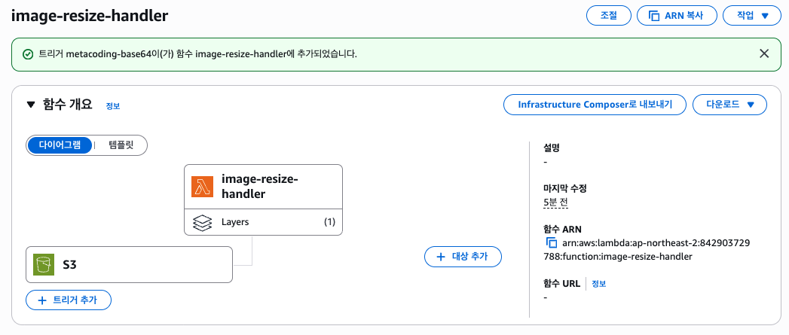

*그림 5-2: 환경 변수 설정 -- AWS 키를 환경 변수로 관리하면 코드에 노출되지 않는다*

이 장의 핵심 코드입니다. Presigned URL을 생성하는 서비스 메서드입니다. 아래 코드를 `ImageService.java` 에 작성합니다.

```java
String uuid = UUID.randomUUID().toString();
String ext = reqDTO.fileName()
        .substring(reqDTO.fileName().lastIndexOf('.') + 1);
String key = "original/" + uuid + "." + ext;

PutObjectRequest objectRequest = PutObjectRequest.builder()
        .bucket(bucket).key(key)
        .contentType(reqDTO.contentType()).build();

PresignedPutObjectRequest presignedRequest = presigner
        .presignPutObject(b -> b
            .signatureDuration(Duration.ofMinutes(15))
            .putObjectRequest(objectRequest));
```

`UUID.randomUUID()` 로 고유한 파일명을 만들고 `original/` 폴더 아래에 저장될 경로(key)를 구성합니다. `PutObjectRequest` 는 "이 버킷의 이 경로에 이 타입의 파일을 올릴 것이다"라는 명세서입니다. `presignPutObject()` 가 이 명세서를 기반으로 15분짜리 출입증을 발급합니다. 15분이 지나면 출입증은 자동으로 만료됩니다.

컨트롤러입니다. 아래 코드를 `ImageController.java` 에 작성합니다.

```java
@PostMapping("/presigned")
public ImageResponse.PresignedDTO generatePresignedUrl(
        @RequestBody ImageRequest.PresignedDTO reqDTO) {
    return imageService.generatePresignedUrl(reqDTO);
}
```

Postman으로 테스트해 보겠습니다.

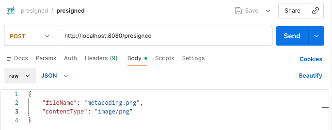

*그림 5-3: Presigned URL 요청 -- fileName과 contentType을 JSON으로 보낸다*

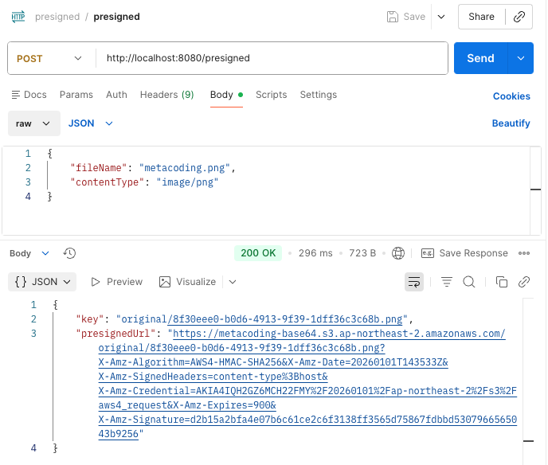

*그림 5-4: Presigned URL 응답 -- presignedUrl과 key가 반환된다*

응답의 `presignedUrl` 이 출입증입니다. 이 URL로 S3에 직접 파일을 올릴 수 있습니다. `key` 는 S3 내부에서의 저장 경로입니다.

발급받은 Presigned URL로 S3에 직접 이미지를 업로드합니다. Postman에서 PUT 요청을 보냅니다.

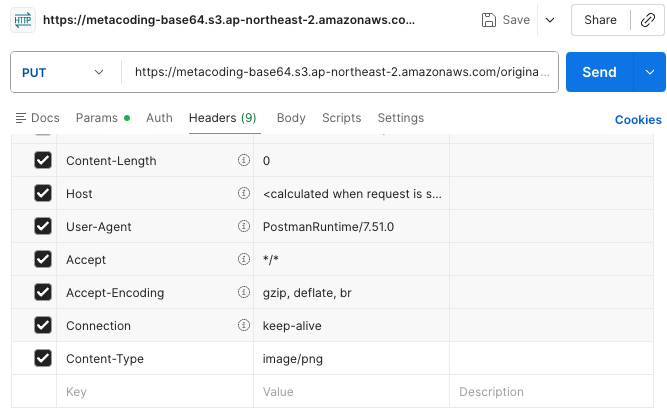

*그림 5-5: S3 PUT 헤더 -- Content-Type을 presigned 요청과 동일하게 맞춘다*

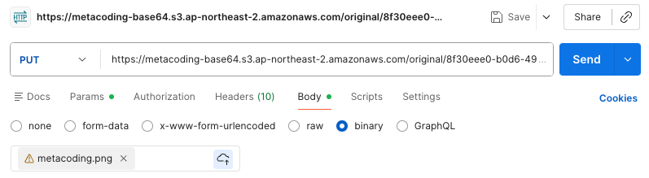

*그림 5-6: S3 PUT Body -- Binary 탭에서 이미지 파일을 직접 선택한다*

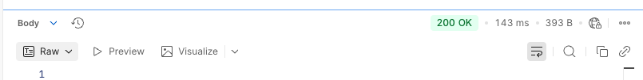

*그림 5-7: S3 업로드 성공 -- 200 OK가 반환되면 S3에 파일이 올라간 것이다*

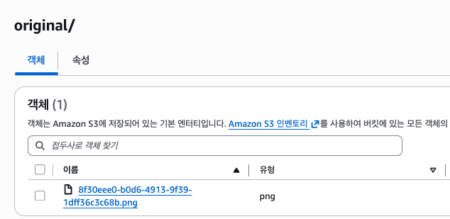

*그림 5-8: S3 확인 -- original 폴더에 업로드한 이미지가 저장되어 있다*

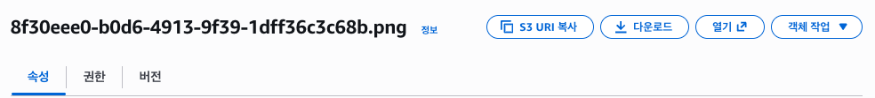

*그림 5-9: 원본 이미지 확인 -- S3에 저장된 이미지를 미리보기로 확인할 수 있다*

서버는 출입증만 발급했을 뿐입니다. 파일은 클라이언트가 S3에 직접 올렸습니다. 4장에서 서버가 Base64를 디코딩하고 파일을 쓰던 부하가 사라졌습니다.

### 5.3 Lambda 리사이즈 구현

S3에 이미지가 올라오면 자동으로 리사이즈하는 **Lambda** 함수를 만듭니다. Lambda는 AWS에서 제공하는 서버리스 함수입니다. 서버를 따로 띄울 필요 없이 이벤트가 발생하면 코드가 실행됩니다. 외부 창고에 상주하는 직원처럼 "물건이 들어오면 축소본 만들기"를 자동으로 수행합니다.

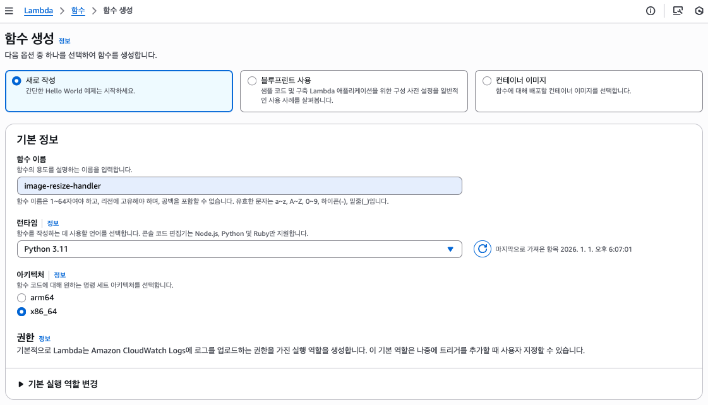

*그림 5-10: Lambda 함수 생성 -- Python 3.x 런타임으로 함수를 만든다*

Lambda 코드입니다. S3 이벤트를 받아서 이미지를 리사이즈합니다.

```python
bucket = event["Records"][0]["s3"]["bucket"]["name"]
key = event["Records"][0]["s3"]["object"]["key"]

original_obj = s3.get_object(Bucket=bucket, Key=key)
image = Image.open(io.BytesIO(original_obj["Body"].read()))
image = image.convert("RGB")
image.thumbnail((800, 800))

buffer = io.BytesIO()
image.save(buffer, format="JPEG", quality=85)

uuid = key.split("/")[-1].split(".")[0]
resized_key = f"resized/{uuid}.jpg"
s3.put_object(Bucket=bucket, Key=resized_key,
              Body=buffer.getvalue(), ContentType="image/jpeg")
```

`event` 에서 버킷 이름과 파일 경로를 꺼냅니다. S3에서 원본 이미지를 내려받아 **Pillow** 라이브러리로 열고 800x800 이내로 리사이즈합니다. JPEG로 변환해서 `resized/` 폴더에 저장합니다. 원본이 `original/abc.png` 였다면 리사이즈 결과는 `resized/abc.jpg` 가 됩니다.

Pillow는 Lambda에 기본 내장되어 있지 않으므로 Layer로 추가해야 합니다.

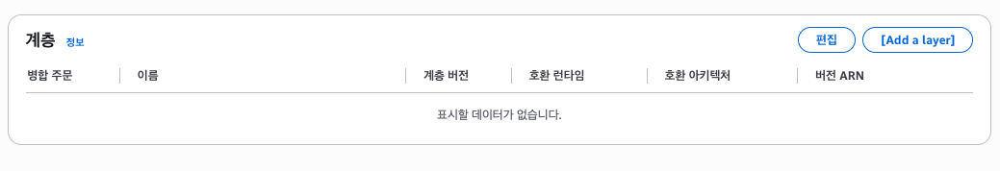

*그림 5-11: Pillow Layer 추가 -- Lambda에 이미지 처리 라이브러리를 Layer로 추가한다*

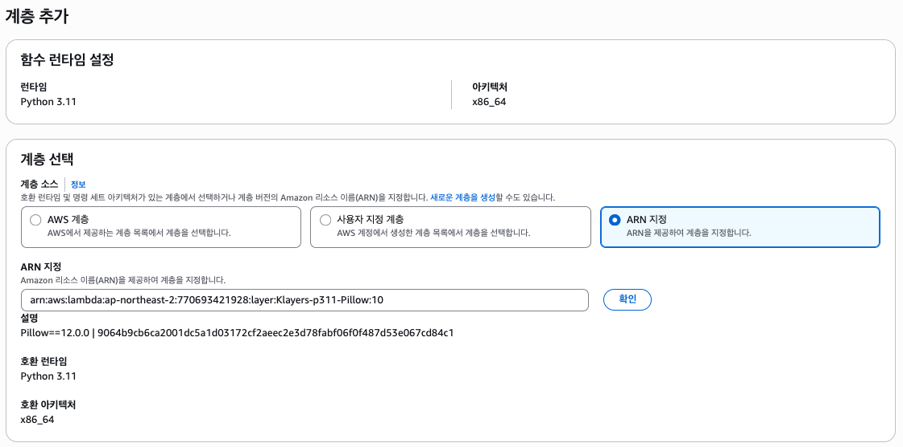

*그림 5-12: Layer ARN -- Pillow Layer의 ARN을 지정한다*

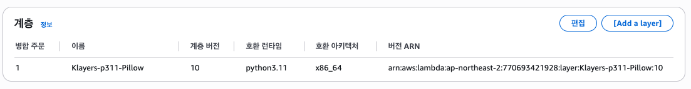

*그림 5-13: Layer 확인 -- Pillow Layer가 정상적으로 추가되었다*

S3 이벤트 트리거를 설정합니다. `original/` 폴더에 파일이 올라오면 Lambda가 자동으로 실행되도록 연결합니다.

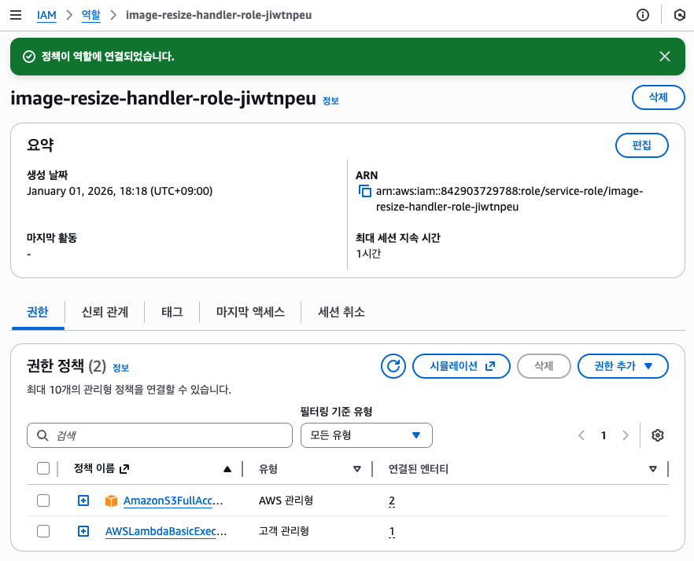

*그림 5-14: S3 트리거 설정 -- original/ prefix로 ObjectCreated 이벤트를 연결한다*

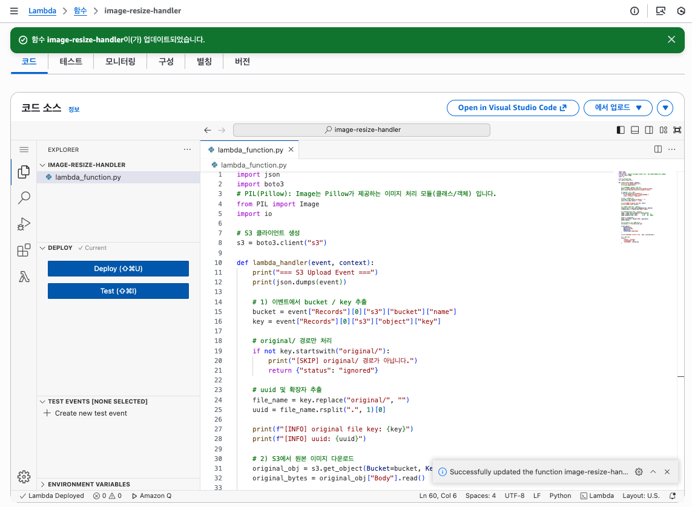

*그림 5-15: Lambda 배포 -- 코드를 작성하고 Deploy 버튼으로 배포한다*

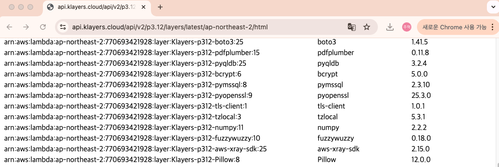

*그림 5-16: Lambda 테스트 -- 테스트 이벤트로 함수가 정상 실행되는지 확인한다*

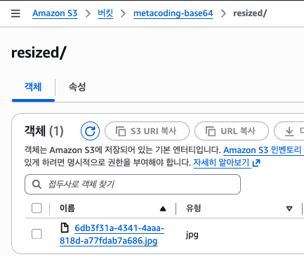

*그림 5-17: 리사이즈 확인 -- resized 폴더에 축소된 이미지가 자동으로 생성되었다*

### 5.4 Spring 서버 구현 2 -- Resized URL 저장

클라이언트가 S3에 업로드를 완료한 뒤 Spring 서버에 "업로드 끝났어"라고 알려주는 `/complete` 엔드포인트를 만듭니다. 외부 창고에 물건을 넣은 뒤 집주인에게 보관 위치를 알려주는 단계입니다.

아래 코드를 `ImageService.java` 에 작성합니다.

```java
String uuid = originalKey
        .replace("original/", "").split("\\.")[0];
String resizedKey = "resized/" + uuid + ".jpg";
String base = "https://" + bucket + ".s3."
        + region + ".amazonaws.com/";
String originalUrl = base + originalKey;
String resizedUrl = base + resizedKey;

imageRepository.save(ImageEntity.builder()
        .originalUrl(originalUrl)
        .resizedUrl(resizedUrl)
        .createdAt(LocalDateTime.now()).build());
```

클라이언트가 보내온 `originalKey` 에서 UUID를 추출합니다. `original/abc-123.png` 에서 `abc-123` 을 꺼내서 `resized/abc-123.jpg` 를 조합합니다. 원본 URL과 리사이즈 URL을 모두 DB에 저장합니다. 목록 화면에서는 리사이즈 URL을 보여주고 상세 화면에서는 원본 URL을 보여주면 됩니다.

컨트롤러입니다. 아래 코드를 `ImageController.java` 에 작성합니다.

```java
@PostMapping("/complete")
public ImageResponse.DTO completeUpload(
        @RequestBody ImageRequest.CompleteDTO reqDTO) {
    return imageService.checkAndSave(reqDTO);
}
```

Postman으로 /complete를 호출합니다.

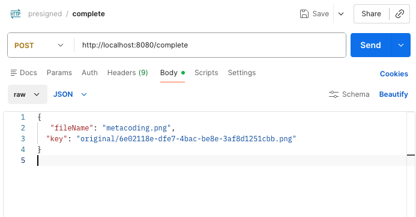

*그림 5-18: /complete 요청 -- originalKey를 JSON으로 보낸다*

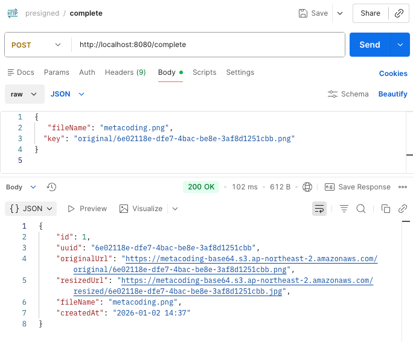

*그림 5-19: /complete 응답 -- originalUrl과 resizedUrl이 모두 저장되어 반환된다*

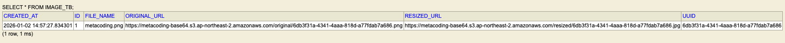

*그림 5-20: DB 확인 -- H2 콘솔에서 원본 URL과 리사이즈 URL이 저장된 것을 확인한다*

### 5.5 전체 흐름 통합

목록 조회와 상세 조회 API입니다.

```java
@GetMapping("/list")
public List<ImageResponse.DTO> getAllImages() {
    return imageService.listAll();
}

@GetMapping("/{id}")
public ImageResponse.DTO getImageDetail(
        @PathVariable Long id) {
    return imageService.findById(id);
}
```

3단계 통합 실습입니다. Postman에서 순서대로 실행합니다.

| 순서 | 요청 | 설명 |
|------|------|------|
| 1 | POST /presigned | Presigned URL 발급 |
| 2 | PUT {presignedUrl} | S3에 이미지 직접 업로드 |
| 3 | POST /complete | 업로드 완료 알림 + DB 저장 |
| 4 | GET /list | 저장된 이미지 목록 확인 |
| 5 | GET /{id} | 특정 이미지 상세 확인 |

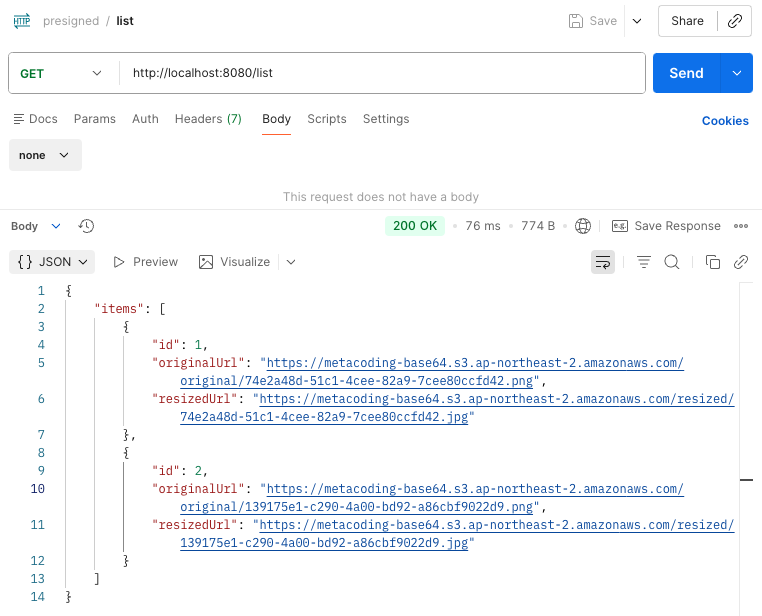

*그림 5-21: 목록 조회 -- 저장된 모든 이미지의 원본 URL과 리사이즈 URL이 반환된다*

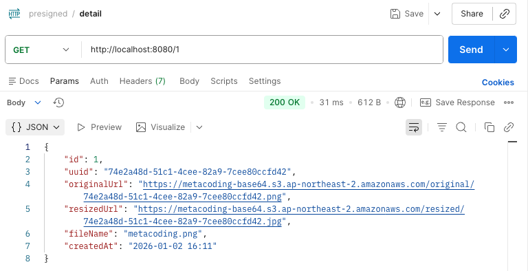

*그림 5-22: 상세 조회 -- 특정 이미지의 전체 정보가 반환된다*

### 5.6 AWS 콘솔 설정 요약

이 장의 실습에 필요한 AWS 설정을 정리합니다. 각 단계의 상세 캡처는 부록을 참고합니다.

**S3 버킷 생성**

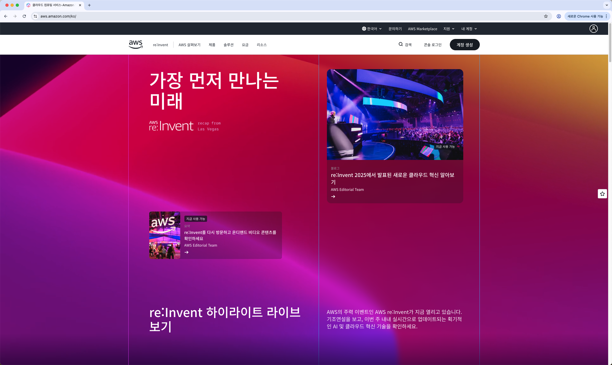

*그림 5-23: S3 버킷 생성 -- 리전을 선택하고 버킷 이름을 지정한다*

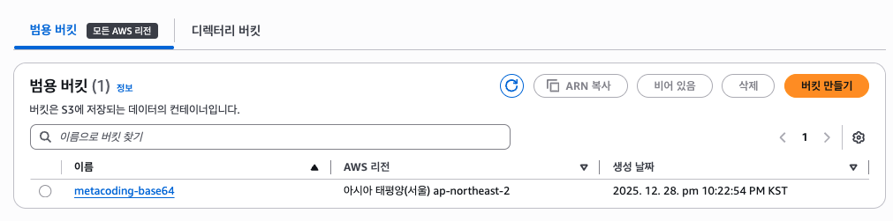

*그림 5-24: 폴더 구조 -- original과 resized 두 개의 폴더를 만든다*

| 설정 항목 | 값 |
|----------|-----|
| 버킷 이름 | 프로젝트에 맞게 지정 |
| 리전 | ap-northeast-2 (서울) |
| 퍼블릭 액세스 | 차단 해제 (실습용) |
| 폴더 | original/, resized/ |

**IAM 사용자**

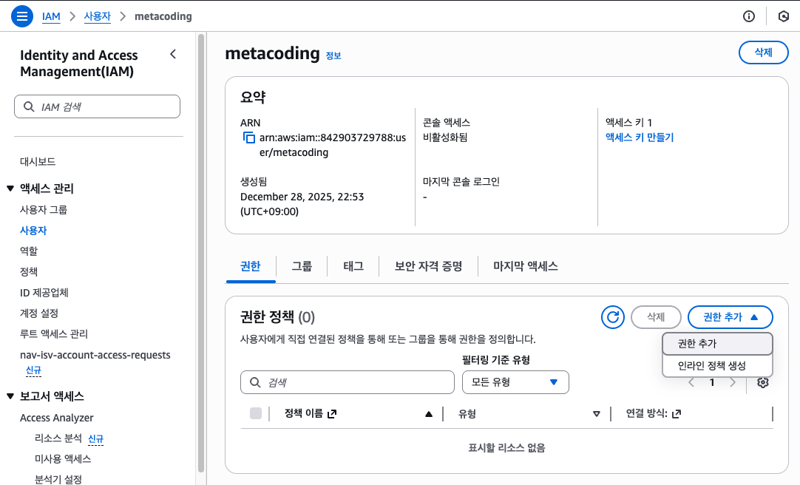

*그림 5-25: IAM 사용자 생성 -- S3 접근용 사용자를 만든다*

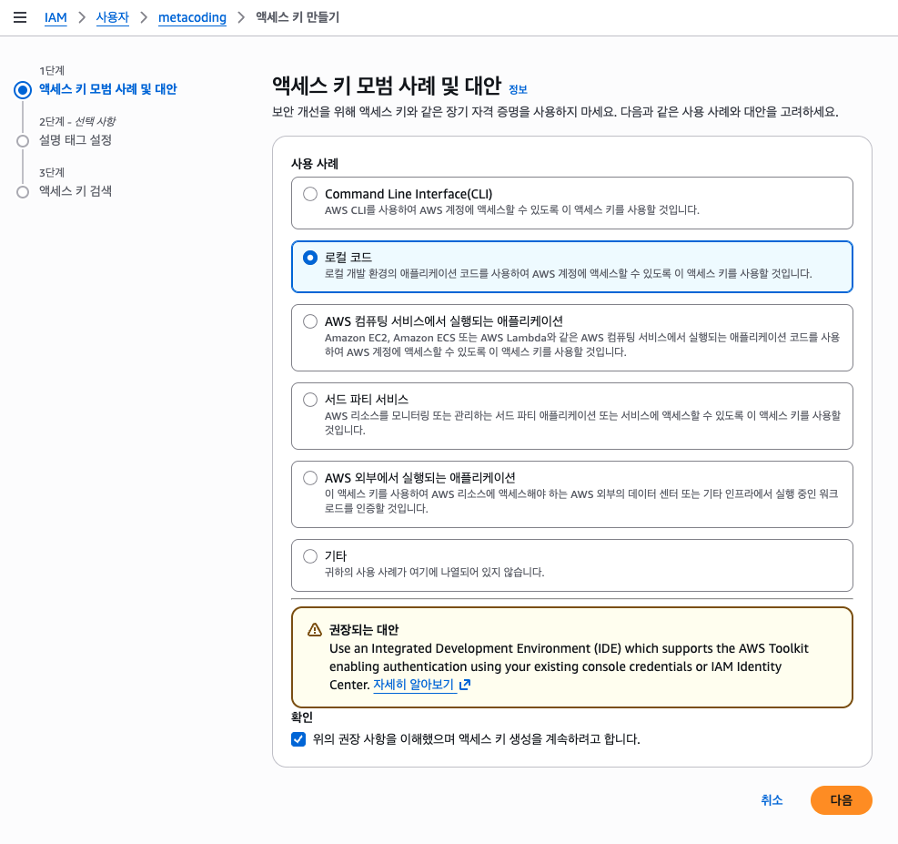

*그림 5-26: 액세스 키 발급 -- Access Key와 Secret Key를 발급받아 환경 변수에 설정한다*

| 설정 항목 | 값 |
|----------|-----|
| 사용자 이름 | 프로젝트에 맞게 지정 |
| 권한 정책 | AmazonS3FullAccess |
| 액세스 키 | 발급 후 환경 변수에 저장 |

**S3 CORS 설정**

React 등 프론트엔드에서 S3에 직접 업로드하려면 CORS 설정이 필요합니다.

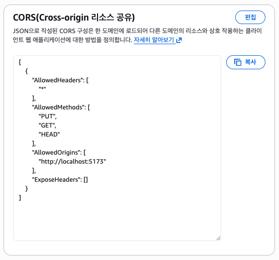

*그림 5-27: S3 CORS -- 프론트엔드에서 S3에 직접 요청할 수 있도록 CORS를 설정한다*

| 비유 | 기술 용어 | 정식 정의 |
|------|----------|----------|
| 외부 창고 | **S3 (Simple Storage Service)** | AWS의 객체 스토리지 서비스. 파일을 버킷 단위로 저장하고 HTTP로 접근한다 |
| 출입증 | **Presigned URL** | 임시 서명이 포함된 URL. 인증 없이도 지정된 시간 동안 S3에 업로드/다운로드할 수 있다 |
| 창고 직원 | **Lambda** | AWS의 서버리스 컴퓨팅 서비스. 이벤트가 발생하면 코드가 자동 실행된다 |
| 물건 도착 알림 | **S3 이벤트 트리거** | S3에 객체가 생성/삭제될 때 지정된 서비스(Lambda 등)를 자동 호출하는 기능 |
| 축소본 | **이미지 리사이즈** | 원본 이미지의 해상도를 줄여 용량을 낮춘 버전을 생성하는 처리 |
| 보관 위치 기록 | **DB 메타데이터 저장** | 파일의 URL, 생성일 등 부가 정보를 데이터베이스에 기록하는 과정 |

---

## 이것만은 기억하자

서버가 모든 일을 직접 할 필요는 없습니다. Presigned URL을 쓰면 서버는 허가증만 발급하고 클라이언트가 S3에 직접 파일을 올립니다. 서버는 파일을 한 번도 만지지 않으므로 디스크 부담도 네트워크 부담도 없습니다. Lambda를 연결하면 이미지가 올라올 때마다 리사이즈 같은 후처리가 자동으로 실행됩니다. 서버가 해야 할 일은 URL 발급과 결과 기록, 이 두 가지뿐입니다.

다음 장에서는 사용자에게 실시간으로 알림을 보내야 하는 상황을 만납니다.
