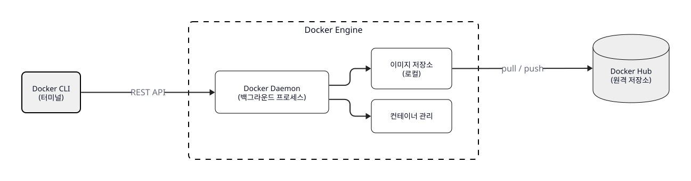
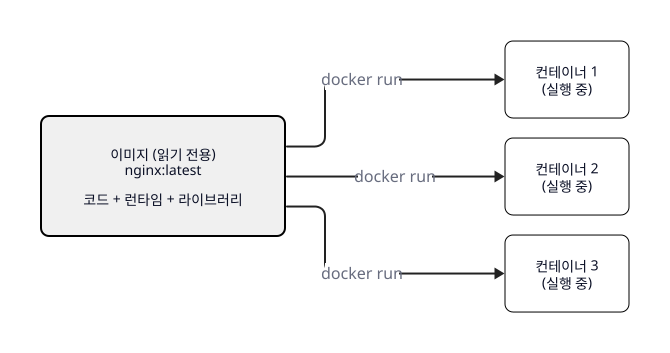
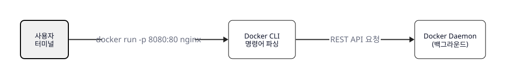
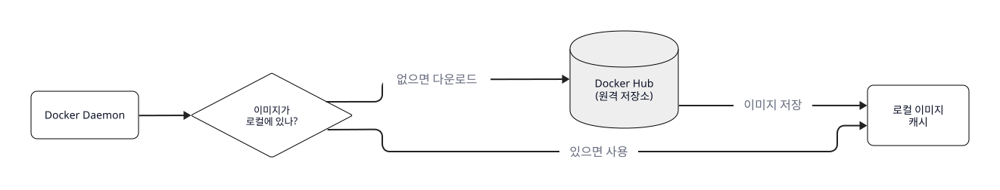
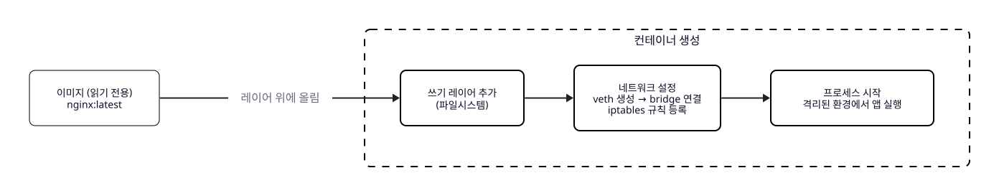
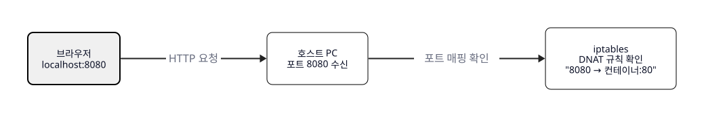
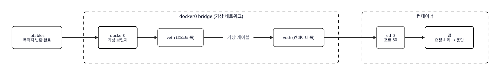

# Ch.1 컨테이너가 뭐길래

> 한 줄 요약: 실행 환경을 표준 상자에 담으면, 어떤 서버에서든 똑같이 돌아간다
> 핵심 개념: 컨테이너의 탄생 배경, VM vs 컨테이너, Docker 동작 흐름, 네트워크 흐름

## 1. 컨테이너 - 표준 상자

### 1.1 환경 충돌

입사 첫 달, 오픈이는 사내 직원 조회 웹 앱을 만들었습니다.

로컬에서 개발하고, 테스트도 통과했습니다. 브라우저에서 직원 이름을 검색하면 결과가 잘 나왔습니다. 이제 운영 서버에 올리기만 하면 됩니다.

코드를 서버에 배포하고 실행했습니다. 에러가 나왔습니다. 라이브러리를 설치했더니 또 다른 에러가 나왔습니다. 로컬과 서버의 언어 버전이 달랐습니다. 오픈이가 쓴 라이브러리가 서버의 버전과 맞지 않았습니다.

**동료**: "오픈아, 너도 그거 걸렸어? 나도 저번에 똑같은 거 겪었는데."

**오픈이**: "로컬에서는 분명히 됐거든요."

**동료**: "다 그래. 로컬이랑 서버 환경이 달라서 그런 거야. 나도 OS 버전 다른 거 때문에 이틀 날렸어."

결국 서버 환경에 맞춰 라이브러리 버전을 하나하나 바꾸고, 설정을 고치고, 반나절을 쏟아서 겨우 올렸습니다. 그런데 며칠 뒤, 다른 팀이 같은 서버에 자기 앱을 올리면서 설정을 바꿨고 오픈이의 앱이 또 깨졌습니다.

**팀장**: "매번 이럴 순 없지. 환경 자체를 묶어서 가져가면 되지 않을까?"

**오픈이**: "환경을 묶는다는 게 무슨 뜻이에요?"

**팀장**: "언어, 라이브러리, 설정 파일을 통째로 하나의 상자에 담는 거야. 그 상자를 어떤 서버에 올려도 똑같이 돌아가게. 그게 컨테이너야."

### 1.2 컨테이너의 탄생

컨테이너의 아이디어는 소프트웨어에서 시작된 게 아닙니다.

1950년대 미국의 항구는 혼란 그 자체였습니다. 트럭에서 내린 물건을 부두 노동자가 하나씩 배에 실었습니다. 자루, 나무 상자, 드럼통. 크기도 모양도 제각각이었습니다. 배 한 척을 채우는 데 며칠이 걸렸고, 물건이 깨지거나 사라지는 일도 흔했습니다.

트럭 운전사 출신의 사업가 말콤 맥린은 이 비효율을 보며 생각했습니다.

*물건을 하나씩 옮기지 말고, 표준 상자에 담아서 상자째로 옮기면 어떨까?*

1956년, 맥린은 58개의 금속 상자를 크레인으로 배에 실었습니다. 며칠 걸리던 작업이 몇 시간으로 줄었습니다. 상자 규격이 같으니 어떤 배, 어떤 트럭, 어떤 항구에서든 같은 방식으로 실을 수 있었습니다. 이것이 해운 컨테이너의 시작입니다.

오픈이가 겪은 문제도 본질은 같습니다. 로컬에서 서버로 앱을 옮길 때마다 환경이 달라서 깨집니다. 물건의 크기가 제각각이던 항구처럼, 서버마다 실행 환경이 제각각인 것입니다.

해운 컨테이너가 물건의 운송을 표준화했듯이, 소프트웨어 컨테이너는 앱의 실행 환경을 표준화합니다. 앱, 라이브러리, 설정 파일을 하나의 상자에 담아서 어떤 서버에서든 똑같이 실행할 수 있게 만드는 것입니다.

<!-- [GEMINI PROMPT: 01_shipping-container]
path: assets/CH01/gemini/01_shipping-container.png
A minimalist black and white infographic-style technical diagram with a strict 16:9
aspect ratio on a solid white background. No shading, no 3D effects, only clean thin
line art. Use everyday metaphors to visualize abstract concepts.
The entire assembly of icons, lines, and text is perfectly centered globally
within the 16:9 frame, leaving generous and equal white space on all sides.
A 1950s harbor scene with standardized metal containers being loaded onto a ship by crane.
All containers are the same size and shape, emphasizing standardization.
Korean label: "표준 상자에 담으면 어떤 배, 어떤 트럭에든 실을 수 있다"
Style: metaphor-infographic
-->

*그림 1-1: 표준 상자에 담으면 어떤 배, 어떤 트럭에든 같은 방식으로 실을 수 있습니다*

소프트웨어도 같은 방식입니다. 앱, 라이브러리, 설정 파일을 하나의 표준 패키지에 담으면 어떤 서버에서든 똑같이 실행할 수 있습니다.

<!-- [GEMINI PROMPT: 01_software-container]
path: assets/CH01/gemini/01_software-container.png
A minimalist black and white infographic-style technical diagram with a strict 16:9
aspect ratio on a solid white background. No shading, no 3D effects, only clean thin
line art. Use everyday metaphors to visualize abstract concepts.
The entire assembly of icons, lines, and text is perfectly centered globally
within the 16:9 frame, leaving generous and equal white space on all sides.
A single package (box icon) containing three labeled items: "앱", "라이브러리", "설정".
Three arrows pointing from this package to three minimalist server rack icons
labeled "서버 A", "서버 B", "서버 C". Each server shows the same package inside,
emphasizing identical environments. Korean label: "어떤 서버에서든 동일하게 실행"
Style: metaphor-infographic
-->

*그림 1-2: 앱과 실행 환경을 하나의 패키지에 담으면 어떤 서버에서든 동일하게 실행됩니다*

> **참고: 소프트웨어 컨테이너**
>
> | 항목 | 설명 |
> |------|------|
> | **정의** | 앱과 실행에 필요한 모든 것(라이브러리, 설정)을 하나의 패키지에 담은 것 |
> | **핵심 가치** | 어떤 서버에서든 동일한 환경으로 실행 가능 |
> | **해결하는 문제** | "내 컴퓨터에선 되는데" — 환경 차이로 인한 오류 |

### 1.3 VM vs 컨테이너

환경을 분리하는 방법은 컨테이너 이전에도 있었습니다. 공유 주방을 떠올려 보겠습니다.

식당 하나에 요리사 세 명이 일하고 있습니다. 한 명이 냉장고에 넣어둔 재료를 다른 사람이 써버리고, 불판을 동시에 쓰려다 부딪힙니다. 하나의 서버에서 여러 앱이 충돌하는 것과 같은 상황입니다.

<!-- [GEMINI PROMPT: 01_shared-kitchen-problem]
path: assets/CH01/gemini/01_shared-kitchen-problem.png
A minimalist black and white infographic-style technical diagram with a strict 16:9
aspect ratio on a solid white background. No shading, no 3D effects, only clean thin
line art. Use everyday metaphors to visualize abstract concepts.
The entire assembly of icons, lines, and text is perfectly centered globally
within the 16:9 frame, leaving generous and equal white space on all sides.
A single kitchen with three minimalist line-art chef icons working in the same space.
Chef A reaching for a refrigerator while Chef B also reaches for it (conflict).
Chef C at a stove with not enough burners. Ingredients mixed together on the counter.
Korean label: "하나의 서버에 앱 3개 = 재료 섞이고 불판 충돌"
Style: metaphor-infographic
-->

*그림 1-3: 하나의 서버에 여러 앱이 올라가면, 공유 주방처럼 환경이 섞이고 충돌합니다*

이 문제를 해결하는 방법은 두 가지입니다.

#### 가상머신 - 주방을 통째로 나누기

첫 번째 방법은 각 요리사에게 냉장고, 가스레인지, 싱크대를 따로 주는 것입니다. 완전히 독립된 주방이 세 개 생깁니다. 충돌은 사라지지만, 비용이 세 배로 늘어납니다.

이것이 **가상머신(VM)** 입니다. 하나의 물리 서버 위에 여러 개의 가상 서버를 만들고, 각각에 운영체제(OS)를 통째로 설치합니다. 완전히 격리되지만, 앱 하나를 띄우기 위해 OS 전체를 올려야 하니 무겁습니다.

<!-- [GEMINI PROMPT: 01_vm-structure]
path: assets/CH01/gemini/01_vm-structure.png
A minimalist black and white infographic-style technical diagram with a strict 16:9
aspect ratio on a solid white background. No shading, no 3D effects, only clean thin
line art. Use everyday metaphors to visualize abstract concepts.
The entire assembly of icons, lines, and text is perfectly centered globally
within the 16:9 frame, leaving generous and equal white space on all sides.
A layered architecture diagram showing Virtual Machine structure from bottom to top:
Bottom layer: "물리 서버 (하드웨어)" in dark gray.
Second layer: "호스트 OS" in light gray.
Third layer: "하이퍼바이저" in white.
Top: Three VM boxes side by side, each containing "Guest OS" (light gray) and "앱" (white).
Emphasize the tall height of the stack. Korean label: "무겁다 — VM마다 OS를 각각 설치"
Style: architecture-infographic
-->

*그림 1-4: VM은 앱마다 Guest OS를 설치합니다. 완전히 격리되지만 무겁습니다*

#### 컨테이너 - 칸막이 치기

두 번째 방법은 가스와 수도는 공유하되, 조리 공간만 칸막이로 분리하는 것입니다. 각자의 재료는 섞이지 않고, 비용도 주방을 통째로 나누는 것보다 훨씬 적습니다.

이것이 **컨테이너**입니다. 호스트 운영체제의 핵심 부분(커널)을 공유하면서, 앱과 라이브러리만 격리합니다. OS를 따로 설치하지 않으니 가볍고 빠릅니다.

<!-- [GEMINI PROMPT: 01_container-structure]
path: assets/CH01/gemini/01_container-structure.png
A minimalist black and white infographic-style technical diagram with a strict 16:9
aspect ratio on a solid white background. No shading, no 3D effects, only clean thin
line art. Use everyday metaphors to visualize abstract concepts.
The entire assembly of icons, lines, and text is perfectly centered globally
within the 16:9 frame, leaving generous and equal white space on all sides.
A layered architecture diagram showing Container structure from bottom to top:
Bottom layer: "물리 서버 (하드웨어)" in dark gray.
Second layer: "호스트 OS (커널 공유)" in light gray.
Third layer: "Docker Engine" in white.
Top: Three container boxes side by side, each containing only "앱 + 라이브러리" (white).
No Guest OS layer — the stack is visibly shorter than a VM diagram.
Korean label: "가볍다 — OS 없이 커널 공유"
IMPORTANT: Use the same layout and size as 01_vm-structure.png for easy comparison.
Style: architecture-infographic
-->

*그림 1-5: 컨테이너는 Guest OS 없이 커널을 공유합니다. VM보다 가볍고 빠릅니다*

| 구분 | 가상머신(VM) | 컨테이너 |
|------|------------|---------|
| 비유 | 주방을 통째로 나누기 | 칸막이로 나누기 |
| 격리 수준 | OS 전체 분리 | 앱+라이브러리만 분리 |
| OS | 각각 설치 | 호스트 OS 커널 공유 |
| 크기 | GB 단위 | MB 단위 |
| 시작 속도 | 수십 초~수 분 | 수 초 |
| 자원 사용 | 많음 (OS마다 메모리/디스크) | 적음 (앱 실행에 필요한 만큼) |

> **참고: 커널(Kernel)이란?**
> 운영체제의 핵심 프로그램입니다. 하드웨어(CPU, 메모리, 디스크)를 관리하고, 앱이 이 자원을 사용할 수 있게 해줍니다. 컨테이너는 이 커널을 호스트와 공유하기 때문에 OS를 따로 설치하지 않아도 됩니다.

오픈이에게 필요한 것은 서버를 통째로 나누는 것(VM)이 아니었습니다. 앱과 필요한 라이브러리를 칸막이 안에 넣어서, 서버에 뭐가 깔려 있든 상관없이 돌아가게 만드는 것이었습니다. 그게 컨테이너입니다.

### 1.4 Docker 아키텍처

컨테이너를 만들고 관리하는 도구가 **Docker**입니다. Docker는 크게 세 가지로 구성되어 있습니다.

*Docker CLI로 명령을 내리면 Daemon이 이미지와 컨테이너를 관리합니다*

> **참고: Docker 구성 요소**
>
> | 구성 요소 | 역할 |
> |----------|------|
> | **Docker CLI** | 사용자가 명령을 입력하는 터미널 인터페이스 |
> | **Docker Daemon** | 명령을 받아 이미지/컨테이너를 관리하는 백그라운드 프로세스 |
> | **Docker Hub** | 이미지를 저장하고 공유하는 원격 저장소 |

여기서 **이미지**와 **컨테이너**의 차이가 중요합니다. 이미지는 앱을 실행하는 데 필요한 모든 것(코드, 런타임, 라이브러리)을 담은 패키지입니다. 한 번 만들면 변하지 않습니다. 컨테이너는 이 이미지를 실제로 실행한 인스턴스입니다.

하나의 이미지로 컨테이너를 열 개든 백 개든 만들 수 있습니다.

*하나의 이미지에서 여러 컨테이너를 만들 수 있습니다*

> **참고: 이미지와 컨테이너**
>
> | 항목 | 이미지(Image) | 컨테이너(Container) |
> |------|-------------|-------------------|
> | 성격 | 읽기 전용 패키지 | 실행 중인 인스턴스 |
> | 변경 | 변하지 않음 | 실행 중 변경 가능 |
> | 개수 | 하나의 이미지로 | 여러 컨테이너 생성 가능 |

그러면 터미널에서 `docker run -p 8080:80 nginx`를 치면 내부에서 어떤 일이 벌어질까요? 단계별로 따라가 보겠습니다.

#### 명령 전달

사용자가 터미널에 명령어를 입력하면, Docker CLI가 이 명령을 파싱하여 Docker Daemon에 REST API로 전달합니다.

*사용자의 명령이 CLI를 거쳐 Daemon에 도달합니다*

#### 이미지 확인

Daemon은 `nginx` 이미지가 로컬에 있는지 확인합니다. 없으면 Docker Hub에서 다운로드합니다. Docker Hub는 앱 스토어와 비슷하지만, 앱이 아니라 앱을 실행할 수 있는 환경(이미지)을 다운로드하는 곳입니다.

*로컬에 이미지가 없으면 Docker Hub에서 받아옵니다*

#### 컨테이너 생성과 실행

이미지가 준비되면 Daemon이 컨테이너를 생성합니다. 이 과정에서 세 가지가 순서대로 일어납니다.

1. **파일시스템 생성** — 이미지(읽기 전용) 위에 쓰기 가능한 레이어를 올립니다
2. **네트워크 설정** — 가상 네트워크 인터페이스(veth)를 만들고, bridge에 연결하고, iptables에 포트 매핑 규칙을 등록합니다
3. **프로세스 시작** — 격리된 환경에서 앱을 실행합니다

*이미지 위에 파일시스템, 네트워크, 프로세스가 차례로 세팅됩니다*

오픈이가 앱과 라이브러리를 이미지로 만들어두면, 어떤 서버에서든 그 이미지로 컨테이너를 띄우기만 하면 됩니다. "내 컴퓨터에선 되는데"가 사라지는 것입니다.

### 1.5 네트워크 흐름

컨테이너 안에서 웹 앱이 돌아가고 있습니다. 브라우저에서 `localhost:8080`을 치면, 이 요청은 어떤 경로로 컨테이너까지 도달할까요?

#### 포트 매핑

브라우저의 요청이 호스트 PC의 8080 포트에 도착합니다. 여기서 **iptables**가 동작합니다. iptables는 리눅스의 네트워크 규칙 관리자인데, Docker가 컨테이너를 띄울 때 "8080으로 온 요청은 컨테이너의 80번 포트로 보내라"는 규칙을 자동으로 등록해둡니다.

*요청이 호스트에 도착하면 iptables가 목적지를 컨테이너로 변환합니다*

#### bridge 네트워크

iptables가 목적지를 변환하면, 요청은 **docker0 bridge**를 거칩니다. bridge는 호스트와 컨테이너를 연결하는 가상 네트워크입니다. bridge에서 **veth pair**(가상 케이블)를 타고 컨테이너의 네트워크로 들어갑니다. 컨테이너 안의 앱이 80번 포트에서 요청을 받아 처리하고 응답을 돌려보냅니다.

*bridge와 veth pair를 통해 요청이 컨테이너 안의 앱에 도달합니다*

`docker run -p 8080:80 nginx`라는 명령어를 풀어보면 이렇습니다.

- `docker run` — 컨테이너를 실행해라
- `-p 8080:80` — 호스트의 8080 포트를 컨테이너의 80 포트에 연결해라
- `nginx` — nginx 이미지를 사용해라

> **참고: 네트워크 구성 요소**
>
> | 구성 요소 | 역할 |
> |----------|------|
> | **iptables** | 리눅스의 네트워크 규칙 관리자. Docker가 포트 매핑 규칙을 자동으로 등록합니다 |
> | **docker0 bridge** | Docker가 만드는 가상 네트워크. 호스트와 컨테이너, 컨테이너끼리를 연결합니다 |
> | **veth pair** | 호스트와 컨테이너를 연결하는 가상 케이블 쌍입니다 |
> | **포트포워딩 (-p)** | 호스트 포트와 컨테이너 포트를 연결합니다. `-p 호스트:컨테이너` 형식입니다 |

## 이것만은 기억하자

| 개념 | 예시 | 핵심 |
|------|------|------|
| 컨테이너 | 해운 표준 상자 | 앱 실행 환경을 표준 패키지에 담아 어디서든 동일하게 실행 |
| VM vs 컨테이너 | 주방 통째로 나누기 vs 칸막이 | 컨테이너는 OS 커널을 공유하여 가볍고 빠름 |
| Docker 흐름 | CLI → Daemon → 이미지 확인 → 컨테이너 생성 | 명령 입력 → 이미지 준비 → 파일시스템+네트워크+프로세스 세팅 |
| 네트워크 흐름 | 요청 → iptables → bridge → veth → 컨테이너 | 포트포워딩으로 호스트 포트와 컨테이너 포트를 연결 |

다음 챕터에서는 직접 컨테이너를 띄우고, 들어가보고, 꺼보는 기본 조작을 해봅니다.
