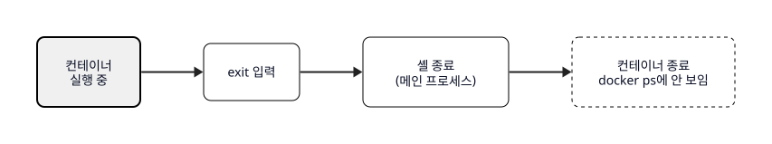
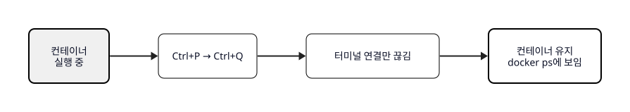
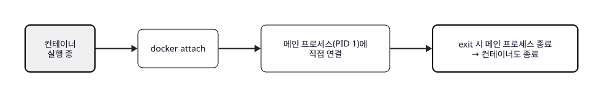
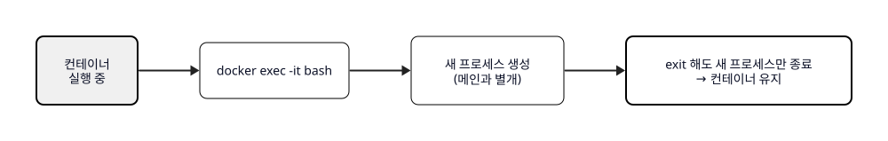
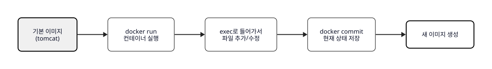
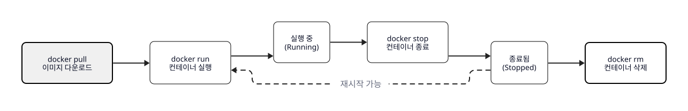

# Ch.2 상자 하나 띄워보기

> 한 줄 요약: 컨테이너를 띄우고, 안에서 리눅스 명령어를 배우고, 데이터를 남기는 방법까지
> 핵심 개념: Docker CLI, 리눅스 기본 명령어, 컨테이너 생명주기, 마운트, docker commit

## 2. Docker CLI - 첫 번째 상자

### 2.1 docker run

다음 날 아침, 오픈이는 Docker Desktop을 설치하고 터미널을 열었습니다.

```bash
docker version
```

버전 정보가 쏟아져 나왔습니다. 설치는 잘 된 것 같았습니다.

**팀장**: "nginx 이미지부터 받아봐."

```bash
docker pull nginx
```

여러 줄의 다운로드 로그가 지나갔습니다. CH01에서 배운 Docker Hub에서 이미지를 받아온 것입니다. 오픈이는 이 이미지로 바로 컨테이너를 띄워봤습니다.

```bash
docker run nginx
```

터미널에 로그가 쏟아지면서 nginx가 실행됐습니다. 그런데 터미널이 멈춰버렸습니다. 다른 명령어를 칠 수가 없었습니다. `Ctrl + C`를 눌러 빠져나왔습니다.

팀장이 `-d` 옵션을 알려줬습니다.

```bash
docker run -d nginx
```

이번에는 긴 ID 문자열만 출력되고 터미널이 바로 돌아왔습니다. 백그라운드에서 실행된 것입니다. 오픈이는 정말 돌아가고 있는지 확인해봤습니다.

```bash
docker ps
```

목록에 nginx가 떠 있었습니다.

> **참고: 자주 쓰는 Docker 명령어**
>
> | 명령어 | 역할 |
> |--------|------|
> | `docker pull <이미지명>` | 이미지 다운로드 |
> | `docker images` | 로컬 이미지 목록 조회 |
> | `docker logs <컨테이너ID>` | 컨테이너 로그 출력 |
> | `docker ps -a` | 종료된 컨테이너 포함 전체 목록 |
> | `docker stop <컨테이너ID>` | 컨테이너 종료 |
> | `docker rm <컨테이너ID>` | 종료된 컨테이너 삭제 |
> | `docker rmi <이미지ID>` | 이미지 삭제 (-f로 강제 삭제) |

### 2.2 리눅스 기본 명령어

이번에는 컨테이너 안에 직접 들어가봤습니다.

```bash
docker run -it -p 80:80 ubuntu
```

프롬프트가 `root@컨테이너ID:/#`으로 바뀌었습니다. 호스트와 완전히 분리된 리눅스 환경 안에 들어온 것입니다.

오픈이는 여기가 어딘지부터 확인했습니다.

```bash
pwd
```

`/`가 나왔습니다. 루트 디렉토리입니다. 다른 폴더로 이동해봤습니다.

```bash
cd /home
cd ..
cd /
```

현재 폴더에 뭐가 있는지 봤습니다.

```bash
ls
ls -l
ls -a
ls -la
```

`-l`은 권한이나 크기 같은 상세 정보를 보여줬고, `-a`는 숨김 파일까지 보여줬습니다. 화면이 복잡해지면 `clear`로 비울 수 있었습니다.

절대 경로로도 이동할 수 있었습니다.

```bash
cd /home/ubuntu
cd /
```

> **참고: 탐색 명령어**
>
> | 명령어 | 역할 |
> |--------|------|
> | `pwd` | 현재 위치 경로 출력 |
> | `cd 경로` | 해당 폴더로 이동 |
> | `cd ..` | 상위 폴더로 이동 |
> | `ls` | 파일/폴더 목록 |
> | `ls -l` / `ls -a` / `ls -la` | 상세 / 숨김 포함 / 둘 다 |
> | `clear` | 터미널 화면 비우기 |

오픈이는 폴더를 만들고 파일을 생성해봤습니다.

```bash
mkdir mydir
touch myfile.txt
rm myfile.txt
rm -r mydir
cp 원본 사본
mv 원본 대상
```

`mkdir`은 폴더, `touch`는 빈 파일을 만들었습니다. `rm`은 파일을, `rm -r`은 폴더를 하위까지 통째로 지웠습니다. `cp`는 복사, `mv`는 이동이나 이름 변경이었습니다.

> **참고: 파일/폴더 관리 명령어**
>
> | 명령어 | 역할 |
> |--------|------|
> | `mkdir 폴더명` | 폴더 생성 |
> | `touch 파일명` | 빈 파일 생성 |
> | `rm 파일명` | 파일 삭제 |
> | `rm -r 폴더명` | 폴더 삭제 (하위 포함) |
> | `cp 원본 사본` | 파일 복사 |
> | `mv 원본 대상` | 파일 이동 또는 이름 변경 |

컨테이너 안에는 기본적으로 아무것도 설치되어 있지 않았습니다. 오픈이는 nginx를 직접 설치해보기로 했습니다.

```bash
apt update
apt install -y nginx
nginx
```

설치가 끝나고 nginx를 실행했습니다. 정말 실행됐는지 확인하고 싶어서 net-tools를 설치했습니다.

```bash
apt install -y net-tools
netstat -nlpt
```

80번 포트에 nginx가 떠 있는 게 보였습니다. `-p 80:80` 옵션으로 컨테이너를 실행했으니, 호스트 브라우저에서 `localhost`에 접속하면 nginx 기본 페이지가 나옵니다.

오픈이는 파일을 직접 편집해보고 싶었습니다. vim을 설치했습니다.

```bash
apt install -y vim
vim test1.txt
```

vim이 열렸습니다. `i`를 눌러 입력 모드로 들어가고, 내용을 작성한 뒤, `ESC`를 누르고 `:wq`로 저장하고 나왔습니다.

```bash
cat test1.txt
```

방금 적은 내용이 그대로 나왔습니다.

> **참고: vim 기본 조작**
>
> | 키 | 동작 |
> |----|------|
> | `i` | 입력 모드 진입 |
> | `ESC` | 입력 모드 종료 |
> | `:wq` | 저장 후 종료 |
> | `:q!` | 저장하지 않고 종료 |

오픈이는 컨테이너 안에서 돌아가는 프로세스도 확인해봤습니다.

```bash
ps -ef
ps -ef | grep nginx
```

nginx 프로세스가 보였습니다. 프로세스를 종료하려면 PID를 확인한 뒤 `kill`을 쓰면 됐습니다.

```bash
kill <PID>
kill -9 <PID>
```

`kill`은 안전 종료, `kill -9`는 강제 종료였습니다.

아까 nginx를 설치했는데, 기본 페이지 파일이 어디에 있는지 찾아봤습니다.

```bash
find / -name index.html
find / -name index*
```

경로가 나왔습니다. `find`는 파일 이름으로 위치를 검색하고, `*`을 쓰면 패턴으로 찾을 수 있었습니다. 로그 파일처럼 큰 파일의 끝부분만 보려면 `tail`을 쓰면 됐습니다.

```bash
tail /var/log/nginx/access.log
tail -n 50 /var/log/nginx/access.log
```

> **참고: 프로세스/검색/로그 명령어**
>
> | 명령어 | 역할 |
> |--------|------|
> | `ps -ef` | 전체 프로세스 목록 |
> | `ps -ef \| grep 키워드` | 특정 프로세스 검색 |
> | `kill PID` | 프로세스 안전 종료 |
> | `kill -9 PID` | 프로세스 강제 종료 |
> | `find / -name 파일명` | 파일 검색 |
> | `tail 파일` | 마지막 10줄 출력 |
> | `tail -n N 파일` | 마지막 N줄 출력 |

할 일을 마친 오픈이는 컨테이너에서 나왔습니다.

```bash
exit
```

그런데 `docker ps`를 쳐보니 아무것도 나오지 않았습니다. `exit`을 치면 셸이 종료되고, 셸이 메인 프로세스였기 때문에 컨테이너 자체가 꺼진 것입니다. 컨테이너를 살려둔 채 나오려면 `Ctrl+P → Ctrl+Q`를 쓰면 됩니다.

### 2.3 컨테이너 생명주기

오픈이는 `exit`과 `Ctrl+P+Q`의 차이를 직접 확인해봤습니다.

```bash
docker run -it --name dead ubuntu
exit
docker ps
```

`docker ps`에 아무것도 나오지 않았습니다.

```bash
docker run -it --name alive ubuntu
# Ctrl + P → Ctrl + Q
docker ps
```

이번에는 `alive`가 목록에 남아 있었습니다.


*그림 2-1: exit을 치면 셸이 종료되고 컨테이너도 꺼집니다*


*그림 2-2: Ctrl+P+Q는 터미널 연결만 끊고 컨테이너는 살려둡니다*

> **참고: exit vs detach**
>
> | 방법 | 동작 | 컨테이너 상태 |
> |------|------|-------------|
> | `exit` | 셸 종료 → 메인 프로세스 종료 → 컨테이너 종료 | 꺼짐 |
> | `Ctrl+P → Ctrl+Q` | 터미널 연결만 끊음 | 계속 실행 |

백그라운드에서 실행할 때는 이미지에 따라 결과가 달랐습니다.

```bash
docker run -d nginx
docker ps
```

nginx는 `-d`만으로 계속 살아 있었습니다.

```bash
docker run -d ubuntu
docker ps
```

ubuntu는 바로 종료됐습니다.

```bash
docker run -dit ubuntu
docker ps
```

`-dit`를 붙이니 ubuntu도 살아 있었습니다. nginx처럼 자체 프로세스가 있는 이미지는 `-d`만으로 유지되지만, ubuntu처럼 셸만 있는 이미지는 `-dit`를 써야 했습니다.

CMD를 덮어써서 유지할 수도 있었습니다.

```bash
docker run -d ubuntu sleep 1000
docker ps
```

`sleep 1000`이 메인 프로세스가 되어 1000초 동안 살아 있었습니다.

> **참고: -d vs -dit**
>
> | 옵션 | 동작 | 적합한 이미지 |
> |------|------|-------------|
> | `-d` | 백그라운드 실행. 자체 프로세스가 있어야 유지 | nginx, mysql 등 서버 |
> | `-dit` | 백그라운드 + 터미널 할당. 프로세스 없어도 유지 | ubuntu 등 셸 기반 |

살아 있는 컨테이너에 다시 들어가는 방법도 두 가지였습니다.

```bash
docker run -dit ubuntu
docker ps
docker attach <컨테이너ID>
# Ctrl + P → Ctrl + Q로 빠져나오기
```

`attach`는 메인 프로세스에 직접 연결하는 것이었습니다. 이 상태에서 `exit`을 치면 메인 프로세스가 종료되면서 컨테이너도 꺼졌습니다.

```bash
docker exec -it <컨테이너ID> bash
docker exec <컨테이너ID> ps aux
```

`exec`는 새로운 프로세스를 만들어서 접속하는 것이었습니다. `exit`을 쳐도 새 프로세스만 종료되고 컨테이너는 유지됐습니다.


*그림 2-3: attach는 메인 프로세스에 직접 연결합니다. exit 시 컨테이너가 종료될 수 있습니다*


*그림 2-4: exec는 새 프로세스를 만들어 접속합니다. exit 해도 컨테이너는 유지됩니다*

> **참고: attach vs exec**
>
> | 항목 | attach | exec |
> |------|--------|------|
> | 연결 대상 | 메인 프로세스 (PID 1) | 새로 생성한 프로세스 |
> | exit 시 | 컨테이너 종료될 수 있음 | 컨테이너 유지 |
> | 주 용도 | 로그 확인, 메인 프로세스 조작 | 디버깅, 파일 확인, 명령 실행 |

### 2.4 docker commit

오픈이는 tomcat 컨테이너를 실행해봤습니다.

```bash
docker run -d -p 8080:8080 tomcat
docker ps
```

브라우저에서 `localhost:8080`에 접속했더니 404 에러가 나왔습니다. tomcat의 기본 웹 페이지 폴더가 비어 있었던 것입니다. exec로 들어가서 직접 만들어봤습니다.

```bash
docker exec -it <컨테이너ID> bash
cd /usr/local/tomcat/webapps

mkdir ROOT
cd ROOT

apt update
apt install -y vim
vim index.html
# i → HTML 내용 작성 → ESC → :wq
```

브라우저를 새로고침하니 방금 만든 페이지가 나왔습니다. exec 셸에서 나왔습니다.

```bash
exit   # exec 셸 종료 (컨테이너는 유지)
```

이 상태를 이미지로 저장해두면 다른 사람도 바로 쓸 수 있습니다.

```bash
docker commit <컨테이너ID> <본인-dockerhub-id>/tomcat
```


*그림 2-5: docker commit으로 컨테이너의 현재 상태를 새 이미지로 저장할 수 있습니다*

Docker Hub에 업로드할 수도 있었습니다.

```bash
docker login
docker push <본인-dockerhub-id>/tomcat
```

다만 이 방식은 수동이었습니다. 어떤 과정을 거쳤는지 기록이 남지 않고, 다시 만들려면 같은 작업을 반복해야 했습니다.

> **참고: docker commit**
>
> | 항목 | 설명 |
> |------|------|
> | 역할 | 컨테이너의 현재 상태를 새 이미지로 저장 |
> | 형식 | `docker commit <컨테이너> <이미지이름>` |
> | 한계 | 수동 작업이라 재현이 어려움 |

### 2.5 마운트

오픈이는 한 가지 걱정이 생겼습니다. 컨테이너 안에서 만든 파일은 컨테이너를 삭제하면 함께 사라집니다. 남겨야 할 데이터는 호스트에 연결해두어야 했습니다.

#### 바인드 마운트

호스트의 특정 폴더를 컨테이너 안에 직접 연결하는 방식입니다.

<!-- [GEMINI PROMPT: 02_bind-mount]
path: assets/CH02/gemini/02_bind-mount.png
A minimalist black and white infographic-style technical diagram with a strict 16:9
aspect ratio on a solid white background. No shading, no 3D effects, only clean thin
line art. Use everyday metaphors to visualize abstract concepts.
The entire assembly of icons, lines, and text is perfectly centered globally
within the 16:9 frame, leaving generous and equal white space on all sides.
Left side: a minimalist computer icon labeled "호스트 PC" with a folder icon inside
labeled "/c/app/bind". Right side: a minimalist container box labeled "컨테이너" with
a folder icon inside labeled "/app/bind". A double-headed arrow connects the two folders,
labeled "바인드 마운트 — 같은 파일을 공유". Below: "컨테이너 삭제해도 호스트 폴더는 유지"
Style: architecture-infographic
-->

*그림 2-4: 바인드 마운트는 호스트 폴더를 컨테이너에 직접 연결합니다*

오픈이는 호스트에 폴더를 만들고 바인드 마운트로 컨테이너를 실행했습니다.

```bash
mkdir -p /c/app/bind

docker run -it --mount type=bind,src=/c/app/bind,dst=/app/bind ubuntu
```

컨테이너 안에서 파일을 만들어봤습니다.

```bash
ls /app
touch /app/bind/a.txt
exit
```

호스트의 `/c/app/bind`를 확인하니 `a.txt`가 있었습니다. 컨테이너는 종료됐지만 파일은 호스트에 남아 있었습니다.

#### 볼륨 마운트

Docker가 관리하는 전용 저장소를 사용하는 방식입니다.

<!-- [GEMINI PROMPT: 02_volume-mount]
path: assets/CH02/gemini/02_volume-mount.png
A minimalist black and white infographic-style technical diagram with a strict 16:9
aspect ratio on a solid white background. No shading, no 3D effects, only clean thin
line art. Use everyday metaphors to visualize abstract concepts.
The entire assembly of icons, lines, and text is perfectly centered globally
within the 16:9 frame, leaving generous and equal white space on all sides.
Left side: a minimalist Docker logo/icon labeled "Docker 관리 볼륨" with a cylinder
storage icon labeled "metacoding-volume". Right side: a minimalist container box labeled
"컨테이너" with a folder icon inside labeled "/app/volume". A double-headed arrow connects
them, labeled "볼륨 마운트". Below: "Docker가 저장 위치를 관리. 컨테이너 삭제해도 볼륨은 유지"
Style: architecture-infographic
-->

*그림 2-5: 볼륨 마운트는 Docker가 관리하는 저장소를 사용합니다*

```bash
docker volume ls

docker run -it --mount type=volume,src=metacoding-volume,dst=/app/volume ubuntu
ls /app/volume
touch /app/volume/b.txt

exit
docker volume ls
```

볼륨이 유지되고 있었습니다. 오픈이는 새 컨테이너를 같은 볼륨으로 실행해봤습니다.

```bash
docker run -it --mount type=volume,src=metacoding-volume,dst=/app/volume ubuntu
ls /app/volume
```

`b.txt`가 그대로 있었습니다. 컨테이너는 사라졌지만 볼륨은 Docker가 관리하고 있기 때문이었습니다.

> **참고: 바인드 마운트 vs 볼륨 마운트**
>
> | 항목 | 바인드 마운트 | 볼륨 마운트 |
> |------|------------|-----------|
> | 저장 위치 | 호스트의 지정 경로 | Docker가 관리하는 영역 |
> | 설정 | `type=bind,src=호스트경로,dst=컨테이너경로` | `type=volume,src=볼륨이름,dst=컨테이너경로` |
> | 관리 | 사용자가 직접 | Docker가 자동 |
> | 주 용도 | 개발 중 소스코드 공유 | 데이터 영속화 (DB 등) |

## 이것만은 기억하자


*그림 2-8: 컨테이너의 생명주기입니다*

> **참고: Docker CLI 정리**
>
> | 명령어 | 역할 |
> |--------|------|
> | `docker pull <이미지>` | 이미지 다운로드 |
> | `docker run <옵션> <이미지>` | 컨테이너 실행 |
> | `docker ps` / `docker ps -a` | 실행 중 / 전체 컨테이너 목록 |
> | `docker stop <ID>` | 컨테이너 종료 |
> | `docker rm <ID>` | 컨테이너 삭제 |
> | `docker images` | 로컬 이미지 목록 |
> | `docker rmi <ID>` | 이미지 삭제 |
> | `docker logs <ID>` | 컨테이너 로그 출력 |
> | `docker attach <ID>` | 메인 프로세스에 연결 |
> | `docker exec -it <ID> bash` | 새 프로세스로 접속 |
> | `docker commit <ID> <이름>` | 이미지 저장 |

| 개념 | 핵심 |
|------|------|
| 리눅스 명령어 | 컨테이너 안은 리눅스 환경. pwd, ls, mkdir, touch, apt, vim 등으로 조작 |
| exit vs detach | exit은 컨테이너 종료, Ctrl+P+Q는 유지한 채 빠져나옴 |
| -d vs -dit | 서버 이미지는 -d, 셸 이미지는 -dit로 백그라운드 실행 |
| attach vs exec | attach는 메인 프로세스 연결, exec는 새 프로세스 생성 |
| 마운트 | 바인드(호스트 경로 직접 연결), 볼륨(Docker 관리 저장소) |
| docker commit | 컨테이너 현재 상태를 이미지로 저장. 수동이라 재현 어려움 |

docker commit은 편리하지만 수동이었습니다. 다음 챕터에서는 Dockerfile을 작성하여 이미지 빌드를 자동화합니다.
