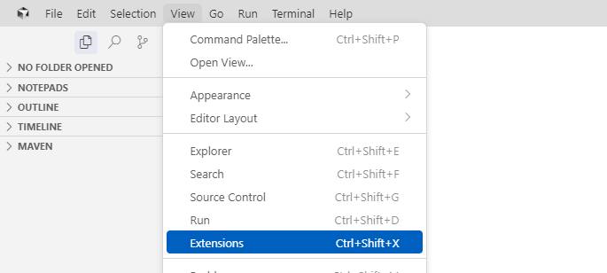
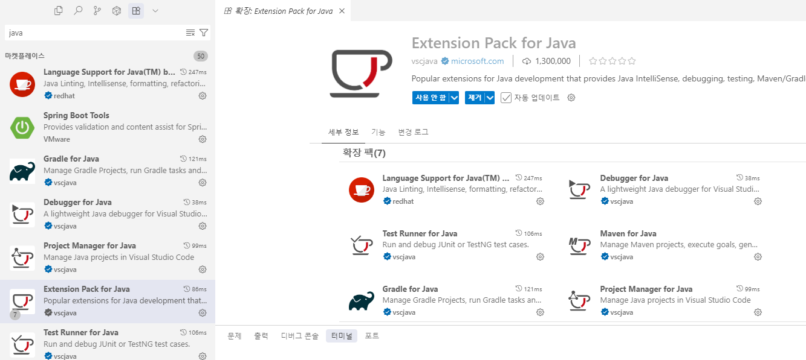
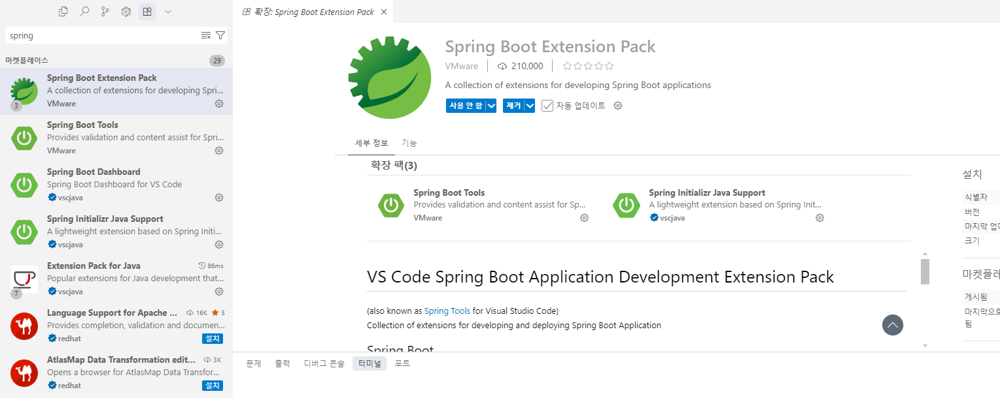
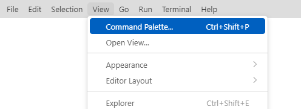
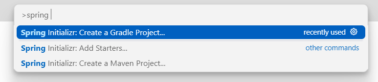
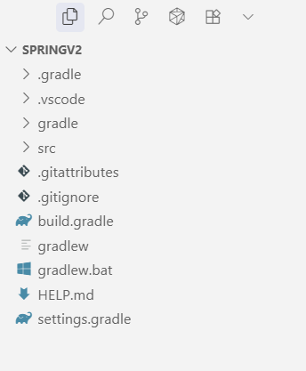

# 챕터 2. 게시판 CRUD

스프링이 내 코드를 어떻게 찾아 실행하는지 그 원리를 이해한 오픈이는, 이제 본격적으로 스프링을 다뤄 보기로 했습니다. 첫 목표는 가장 기본이 되는 게시판입니다. 새 글을 쓰고, 목록을 조회하고, 글을 수정하거나 삭제하는 핵심 기능을 직접 구현해 볼 계획입니다.

이 게시판의 핵심은 글을 데이터베이스에 저장하고 다시 불러오는 일입니다. 사용자가 쓴 글을 데이터베이스에 남겨 두고, 목록이나 글 하나를 요청하면 저장해 둔 글을 꺼내 정해진 형식으로 돌려줍니다.

오픈이는 새 글을 저장하는 것부터 시작해, 조회와 수정, 삭제까지 한 기능씩 완성해 가기로 했습니다.

<div class="svg-figure">
<svg viewBox="0 0 1000 400" xmlns="http://www.w3.org/2000/svg" role="img" aria-label="챕터 2 한눈에 보기. 클라이언트가 게시글에 대한 다섯 가지 요청(목록·상세·작성·수정·삭제)을 컨트롤러로 보내면, 컨트롤러가 서비스로, 서비스가 리포지토리로 넘기고, 리포지토리가 H2 데이터베이스의 board_tb 테이블을 다룬 뒤 결과가 JSON으로 되돌아온다.">
  <defs>
    <marker id="c2ov-i" markerWidth="10" markerHeight="10" refX="8" refY="3" orient="auto"><path d="M0,0 L0,6 L8,3 z" fill="#4f46e5"/></marker>
    <marker id="c2ov-b" markerWidth="10" markerHeight="10" refX="8" refY="3" orient="auto"><path d="M0,0 L0,6 L8,3 z" fill="#94a3b8"/></marker>
  </defs>
  <text x="500" y="30" text-anchor="middle" font-size="17" font-weight="700" fill="#0f172a">챕터 2 한눈에 보기 - 요청 하나가 게시글이 되기까지</text>
  <rect x="30" y="70" width="210" height="250" rx="10" fill="#fff" stroke="#475569" stroke-width="1.6"/>
  <text x="135" y="98" text-anchor="middle" font-size="14" font-weight="800" fill="#0f172a">클라이언트</text>
  <text x="135" y="117" text-anchor="middle" font-size="11" fill="#6b7280">게시글 요청 5가지</text>
  <rect x="48" y="130" width="174" height="30" rx="5" fill="#fff" stroke="#cbd5e1" stroke-width="1.2"/>
  <text x="135" y="149" text-anchor="middle" font-size="11" fill="#334155">GET /api/boards · 목록</text>
  <rect x="48" y="166" width="174" height="30" rx="5" fill="#fff" stroke="#cbd5e1" stroke-width="1.2"/>
  <text x="135" y="185" text-anchor="middle" font-size="11" fill="#334155">GET /api/boards/{id} · 상세</text>
  <rect x="48" y="202" width="174" height="30" rx="5" fill="#fff" stroke="#cbd5e1" stroke-width="1.2"/>
  <text x="135" y="221" text-anchor="middle" font-size="11" fill="#334155">POST /api/boards · 작성</text>
  <rect x="48" y="238" width="174" height="30" rx="5" fill="#fff" stroke="#cbd5e1" stroke-width="1.2"/>
  <text x="135" y="257" text-anchor="middle" font-size="11" fill="#334155">PUT /api/boards/{id} · 수정</text>
  <rect x="48" y="274" width="174" height="30" rx="5" fill="#fff" stroke="#cbd5e1" stroke-width="1.2"/>
  <text x="135" y="293" text-anchor="middle" font-size="11" fill="#334155">DELETE /api/boards/{id} · 삭제</text>
  <rect x="300" y="150" width="150" height="90" rx="8" fill="#eef2ff" stroke="#4f46e5" stroke-width="1.8"/>
  <text x="375" y="188" text-anchor="middle" font-size="13" font-weight="800" fill="#3730a3">컨트롤러</text>
  <text x="375" y="210" text-anchor="middle" font-size="11" fill="#3730a3">@RestController</text>
  <rect x="490" y="150" width="140" height="90" rx="8" fill="#fff" stroke="#475569" stroke-width="1.6"/>
  <text x="560" y="188" text-anchor="middle" font-size="13" font-weight="700" fill="#0f172a">서비스</text>
  <text x="560" y="210" text-anchor="middle" font-size="11" fill="#6b7280">@Service</text>
  <rect x="670" y="150" width="150" height="90" rx="8" fill="#fff" stroke="#475569" stroke-width="1.6"/>
  <text x="745" y="188" text-anchor="middle" font-size="13" font-weight="700" fill="#0f172a">리포지토리</text>
  <text x="745" y="210" text-anchor="middle" font-size="11" fill="#6b7280">@Repository</text>
  <rect x="860" y="160" width="120" height="70" rx="8" fill="#fff" stroke="#475569" stroke-width="1.6"/>
  <text x="920" y="190" text-anchor="middle" font-size="13" font-weight="700" fill="#0f172a">H2</text>
  <text x="920" y="210" text-anchor="middle" font-size="11" fill="#6b7280">board_tb</text>
  <line x1="240" y1="185" x2="298" y2="185" stroke="#4f46e5" stroke-width="1.8" marker-end="url(#c2ov-i)"/>
  <line x1="450" y1="185" x2="488" y2="185" stroke="#4f46e5" stroke-width="1.8" marker-end="url(#c2ov-i)"/>
  <line x1="630" y1="185" x2="668" y2="185" stroke="#4f46e5" stroke-width="1.8" marker-end="url(#c2ov-i)"/>
  <line x1="820" y1="185" x2="858" y2="185" stroke="#4f46e5" stroke-width="1.8" marker-end="url(#c2ov-i)"/>
  <line x1="858" y1="212" x2="822" y2="212" stroke="#94a3b8" stroke-width="1.5" marker-end="url(#c2ov-b)"/>
  <line x1="668" y1="212" x2="632" y2="212" stroke="#94a3b8" stroke-width="1.5" marker-end="url(#c2ov-b)"/>
  <line x1="488" y1="212" x2="452" y2="212" stroke="#94a3b8" stroke-width="1.5" marker-end="url(#c2ov-b)"/>
  <line x1="298" y1="212" x2="242" y2="212" stroke="#94a3b8" stroke-width="1.5" marker-end="url(#c2ov-b)"/>
  <text x="560" y="300" text-anchor="middle" font-size="11" fill="#94a3b8">회색 화살표: 결과가 JSON(Resp)으로 되돌아오는 길</text>
</svg>
</div>

*그림 2-1. 게시글 요청 하나가 컨트롤러, 서비스, 리포지토리를 거쳐 H2까지 전달되고, 결과가 JSON으로 되돌아옵니다*

이 그림의 왼쪽 다섯 줄이 이번 챕터에서 만들 게시판 API 전부입니다. 오른쪽 세 층은 요청이 차례로 지나는 계층으로, 하나씩 직접 만들며 채워 나갑니다.

:::goal
**이번 챕터가 끝나면**

- REST API가 무엇이고, 게시판을 왜 자원으로 다루는지 이해합니다
- 객체와 테이블의 생김새 차이를 JPA가 어떻게 메우는지, JPQL은 어떻게 쓰는지, 영속성 컨텍스트의 캐싱·쓰기 지연·더티체킹이 무엇인지 설명할 수 있습니다
- 엔티티, 리포지토리, 서비스, 컨트롤러를 직접 만들어 글을 저장하고 불러오는 API를 완성하고, 단위 테스트로 검증합니다
- 요청 하나가 톰캣에서 데이터베이스까지 어떤 계층을 지나는지 그릴 수 있습니다
:::

::::prep
**소스코드 준비**

앞 챕터에서 클론한 예제 저장소에서 이번 챕터 폴더로 이동합니다.

```bash [터미널] 챕터 2 폴더로 이동
cd spring-start/ch02
```

`ch02` 폴더는 다음과 같이 구성되어 있습니다. 패키지 루트는 `com.metacoding.spring`입니다.

```
spring-start/ch02  (com.metacoding.spring)
├── board/Board.java                  [실습] 게시글 클래스
├── board/BoardRepository.java        [실습] DB 저장·조회·삭제
├── board/BoardService.java           [실습] 게시글 처리 흐름
├── board/BoardController.java        [실습] REST 엔드포인트 5개
├── board/BoardRequest.java           [실습] 요청 데이터
├── core/util/Resp.java               [참고] 공통 응답 래퍼
├── resources/application.properties  [참고] H2·JPA 설정
├── resources/db/data.sql             [참고] 더미 데이터
└── test/.../BoardRepositoryTest.java [실습] 단위 테스트
```

핵심 로직 자리는 비어 있습니다. 챕터를 따라 코드를 채우고, 막히면 `spring-end`의 완성 코드를 참고하세요.
::::

이 파일들이 앞의 한눈에 보기 그림에서 본 세 층을 이룹니다. 각 클래스가 맡는 역할은 다음과 같습니다.

| 클래스 | 역할 |
|--------|------|
| Board | 게시글 한 건을 담는 클래스입니다. 데이터베이스의 게시글 표 한 줄에 대응합니다. |
| BoardRepository | 게시글을 데이터베이스에 저장하고, 데이터베이스에서 조회하고 삭제합니다. |
| BoardService | 목록, 상세, 작성, 수정, 삭제의 처리 흐름을 맡습니다. |
| BoardController | REST 요청을 받아 서비스로 넘기는 입구입니다. |
| BoardRequest | 작성과 수정 요청으로 들어온 데이터를 담습니다. |
| Resp | 모든 응답을 한 가지 모양으로 통일하는 공통 래퍼입니다. |
## 2.1 REST API

REST API(Representational State Transfer API)는 서버와 클라이언트가 데이터를 주고받는 방식입니다. 클라이언트가 주소(URI)로 자원을 가리키고, HTTP 메서드로 그 자원에 대한 요청과 응답을 처리합니다.

### 2.1.1 REST API 탄생 배경

REST API가 왜 지금의 방식이 됐는지 잠깐 거슬러 올라가 보겠습니다. 초창기 웹 서버는 미리 만들어 둔 문서나 이미지 같은 정적 자원을 그대로 돌려주는 일만 했습니다. 브라우저가 주소를 요청하면 서버는 그 자리에 있는 파일을 찾아 그대로 보냈습니다.

<div class="svg-figure">
<svg viewBox="0 0 760 230" style="max-width:520px" xmlns="http://www.w3.org/2000/svg" role="img" aria-label="브라우저와 서버가 마주 보고 있다. 브라우저가 서버로 요청을 보내면, 서버는 문서나 이미지 같은 정적 자원을 그대로 돌려준다.">
  <defs>
    <marker id="c2st-a" markerWidth="10" markerHeight="10" refX="8" refY="3" orient="auto"><path d="M0,0 L0,6 L8,3 z" fill="#4f46e5"/></marker>
  </defs>
  <rect x="60" y="66" width="200" height="100" rx="10" fill="#fff" stroke="#475569" stroke-width="2.4"/>
  <text x="160" y="125" text-anchor="middle" font-size="21" font-weight="700" fill="#0f172a">브라우저</text>
  <rect x="500" y="66" width="200" height="100" rx="10" fill="#fff" stroke="#475569" stroke-width="2.4"/>
  <text x="600" y="125" text-anchor="middle" font-size="21" font-weight="700" fill="#0f172a">서버</text>
  <line x1="268" y1="100" x2="492" y2="100" stroke="#4f46e5" stroke-width="2.4" marker-end="url(#c2st-a)"/>
  <text x="380" y="86" text-anchor="middle" font-size="17" font-weight="700" fill="#3730a3">1. 요청</text>
  <line x1="492" y1="140" x2="268" y2="140" stroke="#4f46e5" stroke-width="2.4" marker-end="url(#c2st-a)"/>
  <text x="380" y="168" text-anchor="middle" font-size="17" font-weight="700" fill="#3730a3">2. 정적 자원</text>
</svg>
</div>

*그림 2-2. 초창기 서버는 요청을 받으면 미리 만들어 둔 정적 자원을 그대로 돌려줍니다*

이후 인터넷이 커지면서 서버는 요청에 따라 그때그때 내용을 만들어 응답하는 WAS(Web Application Server)로 발전했습니다. 돌려주는 것이 미리 만들어 둔 파일에서 요청마다 새로 만든 HTML 화면으로 바뀌었습니다. 다만 그 화면을 해석하는 것은 여전히 브라우저뿐이었습니다.

<div class="svg-figure">
<svg viewBox="0 0 760 230" style="max-width:520px" xmlns="http://www.w3.org/2000/svg" role="img" aria-label="같은 자리의 브라우저와 서버. 브라우저가 요청을 보내면 서버가 HTML 화면을 만들어 동적 자원으로 돌려준다.">
  <defs>
    <marker id="c2dy-a" markerWidth="10" markerHeight="10" refX="8" refY="3" orient="auto"><path d="M0,0 L0,6 L8,3 z" fill="#4f46e5"/></marker>
  </defs>
  <rect x="60" y="66" width="200" height="100" rx="10" fill="#fff" stroke="#475569" stroke-width="2.4"/>
  <text x="160" y="125" text-anchor="middle" font-size="21" font-weight="700" fill="#0f172a">브라우저</text>
  <rect x="500" y="66" width="200" height="100" rx="10" fill="#fff" stroke="#475569" stroke-width="2.4"/>
  <text x="600" y="112" text-anchor="middle" font-size="21" font-weight="700" fill="#0f172a">서버</text>
  <text x="600" y="140" text-anchor="middle" font-size="15" fill="#6b7280">HTML 생성</text>
  <line x1="268" y1="100" x2="492" y2="100" stroke="#4f46e5" stroke-width="2.4" marker-end="url(#c2dy-a)"/>
  <text x="380" y="86" text-anchor="middle" font-size="17" font-weight="700" fill="#3730a3">1. 요청</text>
  <line x1="492" y1="140" x2="268" y2="140" stroke="#4f46e5" stroke-width="2.4" marker-end="url(#c2dy-a)"/>
  <text x="380" y="168" text-anchor="middle" font-size="17" font-weight="700" fill="#3730a3">2. 동적 자원</text>
</svg>
</div>

*그림 2-3. WAS는 요청을 받을 때마다 화면을 만들어 돌려줍니다*

문제는 서버에 요청을 보내는 것이 브라우저만이 아니게 됐다는 점입니다. 스마트폰 앱, TV, 다른 서버까지 같은 데이터를 요청하기 시작했습니다. 이들에게 HTML 화면을 통째로 넘기는 것은 맞지 않습니다.

<div class="svg-figure">
<svg viewBox="0 0 640 320" style="max-width:440px" xmlns="http://www.w3.org/2000/svg" role="img" aria-label="왼쪽에 브라우저, 스마트폰, TV, 다른 서버 네 개가 세로로 놓여 있고 오른쪽에 서버가 있다. 네 기기가 저마다 서버와 양방향 화살표로 이어져 같은 데이터를 주고받는다.">
  <defs>
    <marker id="c2mul-a" markerWidth="10" markerHeight="10" refX="8" refY="3" orient="auto"><path d="M0,0 L0,6 L8,3 z" fill="#4f46e5"/></marker>
    <marker id="c2mul-b" markerWidth="10" markerHeight="10" refX="8" refY="3" orient="auto-start-reverse"><path d="M0,0 L0,6 L8,3 z" fill="#4f46e5"/></marker>
  </defs>
  <rect x="30" y="18" width="170" height="54" rx="9" fill="#fff" stroke="#475569" stroke-width="2.2"/>
  <text x="115" y="52" text-anchor="middle" font-size="20" font-weight="700" fill="#0f172a">브라우저</text>
  <rect x="30" y="94" width="170" height="54" rx="9" fill="#fff" stroke="#475569" stroke-width="2.2"/>
  <text x="115" y="128" text-anchor="middle" font-size="20" font-weight="700" fill="#0f172a">스마트폰</text>
  <rect x="30" y="170" width="170" height="54" rx="9" fill="#fff" stroke="#475569" stroke-width="2.2"/>
  <text x="115" y="204" text-anchor="middle" font-size="20" font-weight="700" fill="#0f172a">TV</text>
  <rect x="30" y="246" width="170" height="54" rx="9" fill="#fff" stroke="#475569" stroke-width="2.2"/>
  <text x="115" y="280" text-anchor="middle" font-size="20" font-weight="700" fill="#0f172a">다른 서버</text>
  <rect x="430" y="125" width="180" height="90" rx="10" fill="#eef2ff" stroke="#4f46e5" stroke-width="2.4"/>
  <text x="520" y="178" text-anchor="middle" font-size="21" font-weight="800" fill="#3730a3">서버</text>
  <line x1="208" y1="45" x2="422" y2="140" stroke="#4f46e5" stroke-width="2.2" marker-start="url(#c2mul-b)" marker-end="url(#c2mul-a)"/>
  <line x1="208" y1="121" x2="422" y2="158" stroke="#4f46e5" stroke-width="2.2" marker-start="url(#c2mul-b)" marker-end="url(#c2mul-a)"/>
  <line x1="208" y1="197" x2="422" y2="182" stroke="#4f46e5" stroke-width="2.2" marker-start="url(#c2mul-b)" marker-end="url(#c2mul-a)"/>
  <line x1="208" y1="273" x2="422" y2="200" stroke="#4f46e5" stroke-width="2.2" marker-start="url(#c2mul-b)" marker-end="url(#c2mul-a)"/>
</svg>
</div>

*그림 2-4. 브라우저뿐 아니라 여러 기기가 같은 서버에 요청을 보내고 같은 데이터를 받아 갑니다*

그래서 서버는 화면 대신 데이터만, 그것도 어떤 기기든 해석할 수 있는 형식으로 넘기는 방향으로 바뀌었습니다. 그 형식이 JSON입니다.

### 2.1.2 JSON과 자원

우리가 만들 서버도 화면을 돌려주지 않고 글 데이터를 JSON 형식으로 주고받습니다. JSON(JavaScript Object Notation)은 데이터를 키와 값의 쌍으로 표현하는, 사람이 읽기 쉬운 텍스트 형식입니다. 게시글 하나는 이런 모습입니다.

```json
{
  "id": 1,
  "title": "첫 번째 글",
  "content": "안녕하세요"
}
```

위 JSON에 담긴 게시글처럼, REST에서 다루려는 대상을 자원(Resource)이라고 부르고, 각 자원을 주소로 가리킵니다.

### 2.1.3 요청과 응답

브라우저와 서버가 주고받는 요청과 응답에는 정해진 형식이 있습니다. 요청은 요청 라인(Request Line), 헤더(Header), 바디(Body) 세 부분으로 이루어집니다. 요청 라인에는 HTTP 메서드와 주소가 들어갑니다. 헤더에는 데이터 형식 같은 부가 정보가 담깁니다. 바디에는 서버로 보낼 데이터가 담깁니다.

<div class="svg-figure">
<svg viewBox="0 0 700 300" xmlns="http://www.w3.org/2000/svg" role="img" aria-label="게시글 작성 요청 메시지. 맨 위 요청 라인에 POST 슬래시 api 슬래시 boards가 있고, 가운데 헤더에 Content-Type이, 아래 바디에 제목과 내용을 담은 JSON이 들어 있다.">
  <rect x="60" y="26" width="420" height="248" rx="8" fill="#fff" stroke="#475569" stroke-width="1.8"/>
  <text x="84" y="68" font-size="16" font-weight="800" fill="#3730a3">POST /api/boards</text>
  <line x1="60" y1="96" x2="480" y2="96" stroke="#cbd5e1" stroke-width="1.4"/>
  <text x="84" y="140" font-size="13" fill="#334155">Content-Type: application/json</text>
  <line x1="60" y1="176" x2="480" y2="176" stroke="#cbd5e1" stroke-width="1.4"/>
  <text x="84" y="216" font-size="13" fill="#334155">{ "title": "첫 번째 글",</text>
  <text x="84" y="242" font-size="13" fill="#334155">  "content": "안녕하세요" }</text>
  <path d="M496,32 L508,32 L508,90 L496,90" fill="none" stroke="#94a3b8" stroke-width="1.4"/>
  <line x1="508" y1="61" x2="520" y2="61" stroke="#94a3b8" stroke-width="1.4"/>
  <text x="530" y="66" font-size="14" font-weight="700" fill="#0f172a">요청 라인</text>
  <path d="M496,102 L508,102 L508,170 L496,170" fill="none" stroke="#94a3b8" stroke-width="1.4"/>
  <line x1="508" y1="136" x2="520" y2="136" stroke="#94a3b8" stroke-width="1.4"/>
  <text x="530" y="141" font-size="14" font-weight="700" fill="#0f172a">헤더</text>
  <path d="M496,182 L508,182 L508,268 L496,268" fill="none" stroke="#94a3b8" stroke-width="1.4"/>
  <line x1="508" y1="225" x2="520" y2="225" stroke="#94a3b8" stroke-width="1.4"/>
  <text x="530" y="230" font-size="14" font-weight="700" fill="#0f172a">바디</text>
</svg>
</div>

*그림 2-5. 요청은 메서드와 주소를 담은 요청 라인, 헤더, 바디로 이루어집니다*

응답도 응답 라인(Status Line), 헤더, 바디 세 부분으로 이루어집니다. 응답 라인에는 요청이 어떻게 처리됐는지 알리는 상태 코드가 들어갑니다. 게시글 목록을 요청하면 앞에서 본 JSON이 바디에 담겨 돌아옵니다.

<div class="svg-figure">
<svg viewBox="0 0 700 300" xmlns="http://www.w3.org/2000/svg" role="img" aria-label="응답 메시지. 맨 위 응답 라인에 상태 코드 200 OK가 있고, 가운데 헤더에 Content-Type이, 아래 바디에 게시글 하나를 담은 JSON이 들어 있다.">
  <rect x="60" y="26" width="420" height="248" rx="8" fill="#fff" stroke="#475569" stroke-width="1.8"/>
  <text x="84" y="68" font-size="16" font-weight="800" fill="#c2410c">200 OK</text>
  <line x1="60" y1="96" x2="480" y2="96" stroke="#cbd5e1" stroke-width="1.4"/>
  <text x="84" y="140" font-size="13" fill="#334155">Content-Type: application/json</text>
  <line x1="60" y1="176" x2="480" y2="176" stroke="#cbd5e1" stroke-width="1.4"/>
  <text x="84" y="216" font-size="13" fill="#334155">{ "id": 1, "title": "첫 번째 글",</text>
  <text x="84" y="242" font-size="13" fill="#334155">  "content": "안녕하세요" }</text>
  <path d="M496,32 L508,32 L508,90 L496,90" fill="none" stroke="#94a3b8" stroke-width="1.4"/>
  <line x1="508" y1="61" x2="520" y2="61" stroke="#94a3b8" stroke-width="1.4"/>
  <text x="530" y="66" font-size="14" font-weight="700" fill="#0f172a">응답 라인</text>
  <path d="M496,102 L508,102 L508,170 L496,170" fill="none" stroke="#94a3b8" stroke-width="1.4"/>
  <line x1="508" y1="136" x2="520" y2="136" stroke="#94a3b8" stroke-width="1.4"/>
  <text x="530" y="141" font-size="14" font-weight="700" fill="#0f172a">헤더</text>
  <path d="M496,182 L508,182 L508,268 L496,268" fill="none" stroke="#94a3b8" stroke-width="1.4"/>
  <line x1="508" y1="225" x2="520" y2="225" stroke="#94a3b8" stroke-width="1.4"/>
  <text x="530" y="230" font-size="14" font-weight="700" fill="#0f172a">바디</text>
</svg>
</div>

*그림 2-6. 응답은 상태 코드를 담은 응답 라인, 헤더, 바디로 이루어집니다*

### 2.1.4 메서드와 주소

주소는 어떤 자원인지를 가리키고, 그 자원에 무엇을 할지는 HTTP 메서드로 나타냅니다. 게시판에서 쓰는 메서드는 네 가지입니다.

| 메서드 | 하는 일 | 예 |
|--------|---------|-----|
| GET | 조회한다 | 게시글 목록을 가져온다 |
| POST | 새로 만든다 | 게시글을 작성한다 |
| PUT | 수정한다 | 게시글 내용을 고친다 |
| DELETE | 삭제한다 | 게시글을 지운다 |

주소를 짓는 데도 몇 가지 약속이 있습니다.

| 규칙 | 권장 | 피할 것 |
|------|------|---------|
| 소문자로 쓴다 | `/boards` | `/Boards` |
| 행위는 메서드로 표현한다 | `PUT /boards/1` | `/boards/1/put` |
| 자원은 복수형으로 쓴다 | `/boards/1` | `/board/1` |
| 긴 단어는 하이픈으로 연결한다 | `/check-username` | `/check_username` |
| 확장자를 붙이지 않는다 | `/users` | `/users.json` |

주소에는 확장자를 포함하지 않습니다. 대신 헤더에 타입을 포함합니다.

## 2.2 스프링 부트

앞에서 옮겨 온 `ch02`는 스프링 부트 프로젝트입니다. 스프링 부트는 스프링을 쓰는 데 필요한 것들을 미리 묶어 둔 도구로, 서버를 붙이고 설정을 맞추는 일을 대신 해 줍니다. 개발자는 명령 한 줄로 서버를 실행하고 기능부터 만들면 됩니다.

### 2.2.1 프로젝트 생성

실습은 클론한 `ch02`로 진행하지만, 이 프로젝트가 어떻게 만들어졌는지는 알아 두어야 합니다. IDE는 Cursor를 기준으로 설명하며, VS Code도 화면이 같습니다.

먼저 자바와 스프링을 다룰 확장 프로그램을 설치합니다. 상단 탭에서 `View > Extensions`를 선택합니다.



*그림 2-7. 상단 탭 View에서 Extensions를 선택합니다*

검색창에 `java`를 넣어 Extension Pack for Java를 설치합니다.



*그림 2-8. 자바 개발에 필요한 확장을 한 번에 묶은 Extension Pack for Java입니다*

이어서 `spring`으로 검색해 Spring Boot Extension Pack을 설치합니다. 이 확장에 스프링 프로젝트를 만들어 주는 Spring Initializr가 들어 있습니다.



*그림 2-9. Spring Boot Extension Pack에는 Spring Initializr Java Support가 함께 들어 있습니다*

설치가 끝나면 `View > Command Palette`를 엽니다.



*그림 2-10. 상단 탭 View에서 Command Palette를 선택합니다*

`spring`을 입력해 Spring Initializr: Create a Gradle Project를 실행합니다.



*그림 2-11. Gradle 프로젝트를 만드는 명령을 고릅니다*

이후 묻는 항목에 이 값들을 넣습니다.

| 항목 | 값 |
|------|-----|
| 스프링 부트 버전 | 4.0.3 |
| 언어 | Java |
| Group Id | com.metacoding |
| Artifact Id | spring-ch02 |
| Packaging | JAR |
| 자바 버전 | 21 |

마지막으로 프로젝트에 넣을 의존성을 고릅니다. 챕터 2에서 쓰는 것은 네 가지입니다.

| 의존성 | 역할 |
|--------|------|
| Spring Web | REST 요청을 받는 웹 계층과 내장 웹 서버가 들어 있습니다 |
| Spring Data JPA | 객체와 테이블을 잇는 JPA와 하이버네이트가 들어 있습니다 |
| H2 Database | 메모리에서만 동작하는 실습용 데이터베이스입니다 |
| Lombok | 게터·세터 같은 반복 코드를 대신 만들어 줍니다 |

생성이 끝나면 이런 구조가 만들어집니다. `build.gradle`에 방금 고른 의존성이 적혀 있고, 코드는 `src` 아래에 들어갑니다.



*그림 2-12. 생성된 스프링 부트 프로젝트의 구조입니다*

## 2.3 객체와 테이블

앞에서 고른 의존성 가운데 Spring Data JPA는 객체와 테이블을 이어 주는 기술입니다. 이어 준다는 말이 나온 이상, 둘이 왜 떨어져 있는지부터 봐야 합니다. 자바의 객체(Object)와 데이터베이스의 테이블(Table)은 데이터를 담는 방식이 처음부터 다릅니다.

### 2.3.1 데이터를 담는 방식의 차이

데이터베이스는 데이터를 정확하게 보관하고 빠르게 찾기 위해 만들어졌습니다. 모든 데이터를 행(Row)과 열(Column)로 이루어진 표에 값으로만 담고, 한 칸에는 값 하나만 넣습니다. 다른 표를 가리켜야 할 때도 표 안에 표를 넣지 않고 외래 키(Foreign Key)라는 값을 공유합니다.

반면 자바는 값을 공유하는 대신 객체를 직접 필드로 가집니다. 현실의 사물을 객체로 옮겨 다루기 위해 만들어졌기 때문입니다. 객체는 필드(상태)와 메서드(행위)를 함께 가지고, 다른 객체를 필드로 가지는 참조(Reference) 방식으로 서로를 연결합니다.

담는 방식이 다르니 표현할 수 있는 것도 어긋납니다. 어긋나는 지점은 크게 세 군데입니다.

| 구분 | 데이터베이스 | 자바 |
|------|-------------|------|
| 구조 | 행과 열로 이루어진 평면적인 표입니다. 값만 담습니다 | 상태와 행위를 함께 가진 입체적인 객체입니다 |
| 상속 | 상속이라는 개념이 없습니다 | 부모의 특징을 물려받는 상속이 있습니다 |
| 자료형 | 숫자·문자는 비슷하지만, 객체나 컬렉션을 한 칸에 담을 수 없습니다 | 객체 안에 다른 객체도, List·Map 같은 컬렉션도 담습니다 |

<div class="svg-figure">
<svg viewBox="0 0 860 330" xmlns="http://www.w3.org/2000/svg" role="img" aria-label="왼쪽은 데이터베이스의 평면적인 표로, 아이디와 제목과 내용 열에 값만 채워져 있고 다른 표는 외래 키 값으로만 가리킨다. 오른쪽은 자바의 입체적인 객체로, 하나의 Board 객체가 필드와 메서드를 함께 가지고 다른 객체와 목록도 필드로 가진다.">
  <text x="215" y="32" text-anchor="middle" font-size="14" font-weight="800" fill="#0f172a">데이터베이스 - 평면적인 표</text>
  <rect x="30" y="46" width="370" height="252" rx="10" fill="#fff" stroke="#475569" stroke-width="1.7"/>
  <rect x="52" y="72" width="70" height="32" fill="#f1f5f9" stroke="#94a3b8" stroke-width="1.3"/>
  <rect x="122" y="72" width="128" height="32" fill="#f1f5f9" stroke="#94a3b8" stroke-width="1.3"/>
  <rect x="250" y="72" width="128" height="32" fill="#f1f5f9" stroke="#94a3b8" stroke-width="1.3"/>
  <text x="87" y="93" text-anchor="middle" font-size="11" font-weight="700" fill="#334155">id</text>
  <text x="186" y="93" text-anchor="middle" font-size="11" font-weight="700" fill="#334155">title</text>
  <text x="314" y="93" text-anchor="middle" font-size="11" font-weight="700" fill="#334155">content</text>
  <rect x="52" y="104" width="70" height="32" fill="#fff" stroke="#cbd5e1" stroke-width="1.2"/>
  <rect x="122" y="104" width="128" height="32" fill="#fff" stroke="#cbd5e1" stroke-width="1.2"/>
  <rect x="250" y="104" width="128" height="32" fill="#fff" stroke="#cbd5e1" stroke-width="1.2"/>
  <text x="87" y="125" text-anchor="middle" font-size="11" fill="#475569">1</text>
  <text x="186" y="125" text-anchor="middle" font-size="11" fill="#475569">title1</text>
  <text x="314" y="125" text-anchor="middle" font-size="11" fill="#475569">content1</text>
  <rect x="52" y="136" width="70" height="32" fill="#fff" stroke="#cbd5e1" stroke-width="1.2"/>
  <rect x="122" y="136" width="128" height="32" fill="#fff" stroke="#cbd5e1" stroke-width="1.2"/>
  <rect x="250" y="136" width="128" height="32" fill="#fff" stroke="#cbd5e1" stroke-width="1.2"/>
  <text x="87" y="157" text-anchor="middle" font-size="11" fill="#475569">2</text>
  <text x="186" y="157" text-anchor="middle" font-size="11" fill="#475569">title2</text>
  <text x="314" y="157" text-anchor="middle" font-size="11" fill="#475569">content2</text>
  <text x="215" y="200" text-anchor="middle" font-size="11" fill="#6b7280">한 칸에는 값 하나만 들어갑니다</text>
  <rect x="90" y="218" width="250" height="52" rx="6" fill="#fff" stroke="#94a3b8" stroke-width="1.4" stroke-dasharray="5,3"/>
  <text x="215" y="240" text-anchor="middle" font-size="11" fill="#475569">다른 표를 가리킬 때는</text>
  <text x="215" y="258" text-anchor="middle" font-size="11" fill="#475569">외래 키 값만 공유합니다</text>
  <text x="645" y="32" text-anchor="middle" font-size="14" font-weight="800" fill="#3730a3">자바 - 입체적인 객체</text>
  <rect x="460" y="46" width="370" height="252" rx="10" fill="#fff" stroke="#4f46e5" stroke-width="1.7"/>
  <rect x="486" y="72" width="318" height="198" rx="9" fill="#f8fafc" stroke="#4f46e5" stroke-width="1.6"/>
  <text x="645" y="96" text-anchor="middle" font-size="12" font-weight="800" fill="#3730a3">Board 객체</text>
  <rect x="506" y="110" width="132" height="60" rx="7" fill="#eef2ff" stroke="#4f46e5" stroke-width="1.5"/>
  <text x="572" y="132" text-anchor="middle" font-size="11" font-weight="700" fill="#3730a3">필드</text>
  <text x="572" y="152" text-anchor="middle" font-size="10" fill="#3730a3">상태를 담습니다</text>
  <rect x="652" y="110" width="132" height="60" rx="7" fill="#eef2ff" stroke="#4f46e5" stroke-width="1.5"/>
  <text x="718" y="132" text-anchor="middle" font-size="11" font-weight="700" fill="#3730a3">메서드</text>
  <text x="718" y="152" text-anchor="middle" font-size="10" fill="#3730a3">행위를 담습니다</text>
  <rect x="506" y="188" width="278" height="62" rx="7" fill="#fff" stroke="#94a3b8" stroke-width="1.5"/>
  <text x="645" y="212" text-anchor="middle" font-size="11" fill="#475569">다른 객체도, List 같은 컬렉션도</text>
  <text x="645" y="232" text-anchor="middle" font-size="11" fill="#475569">필드로 가집니다</text>
</svg>
</div>

*그림 2-13. 데이터베이스는 한 칸에 값 하나만 담지만, 자바 객체는 다른 객체와 컬렉션도 필드로 가집니다*

이 차이 때문에, 자바에서 객체 하나로 다루던 것을 저장하려면 여러 표로 쪼개야 하고, 꺼낼 때는 흩어진 값을 다시 하나로 모아야 합니다.

### 2.3.2 직접 SQL을 쓰던 방식

쪼개고 모으는 일을 대신해 주는 기술이 없을 때는 개발자가 직접 했습니다. 데이터를 저장하거나 조회할 때마다 SQL을 작성하고, 돌아온 결과를 한 칸씩 꺼내 객체에 채워 넣었습니다.

이 방식에는 세 가지 문제가 따릅니다.

- 표가 하나 늘어날 때마다 비슷하게 생긴 SQL과 매핑 코드를 수십 줄씩 다시 썼습니다.
- 실제 기능을 짜는 시간보다 조회 결과를 객체에 옮겨 담는 시간이 더 길었습니다.
- 컬럼 하나만 바뀌어도 그 컬럼을 쓰는 SQL을 전부 찾아 고쳐야 했습니다.

### 2.3.3 ORM과 JPA, 하이버네이트

이 소모적인 번역을 대신해 주는 기술이 ORM입니다. 개발자는 객체만 다루고, 객체와 표 사이를 오가는 SQL은 ORM이 만듭니다. 자바 진영은 ORM을 JPA라는 표준으로 정리했고, 하이버네이트가 그 표준을 구현한 대표적인 엔진입니다.

<div class="svg-figure">
<svg viewBox="0 0 820 250" xmlns="http://www.w3.org/2000/svg" role="img" aria-label="자바 객체에서 ORM으로, ORM에서 SQL로 바뀌어 데이터베이스에 전달되고, 조회 결과는 다시 객체가 되어 돌아온다.">
  <defs>
    <marker id="c2orm-ar" markerWidth="10" markerHeight="10" refX="8" refY="3" orient="auto"><path d="M0,0 L0,6 L8,3 z" fill="#4f46e5"/></marker>
    <marker id="c2orm-back" markerWidth="10" markerHeight="10" refX="8" refY="3" orient="auto"><path d="M0,0 L0,6 L8,3 z" fill="#94a3b8"/></marker>
  </defs>
  <rect x="30" y="46" width="180" height="72" rx="8" fill="#fff" stroke="#475569" stroke-width="1.8"/>
  <text x="120" y="90" text-anchor="middle" font-size="15" font-weight="700" fill="#0f172a">자바 객체</text>
  <line x1="218" y1="82" x2="288" y2="82" stroke="#4f46e5" stroke-width="2" marker-end="url(#c2orm-ar)"/>
  <rect x="300" y="46" width="180" height="72" rx="8" fill="#eef2ff" stroke="#4f46e5" stroke-width="1.9"/>
  <text x="390" y="90" text-anchor="middle" font-size="15" font-weight="800" fill="#3730a3">ORM</text>
  <line x1="488" y1="82" x2="578" y2="82" stroke="#4f46e5" stroke-width="2" marker-end="url(#c2orm-ar)"/>
  <text x="533" y="70" text-anchor="middle" font-size="12" font-weight="700" fill="#3730a3">SQL</text>
  <rect x="590" y="46" width="200" height="72" rx="8" fill="#fff" stroke="#475569" stroke-width="1.8"/>
  <text x="690" y="90" text-anchor="middle" font-size="15" font-weight="700" fill="#0f172a">데이터베이스</text>
  <path d="M690,126 L690,182 L120,182 L120,128" fill="none" stroke="#94a3b8" stroke-width="1.8" marker-end="url(#c2orm-back)"/>
  <text x="405" y="204" text-anchor="middle" font-size="13" fill="#475569">조회 결과는 다시 객체가 되어 돌아옵니다</text>
</svg>
</div>

*그림 2-14. 개발자가 객체로 짠 코드를 ORM이 SQL로 바꿔 전하고, 결과를 다시 객체로 돌려줍니다*

우리가 프로젝트에 추가한 Spring Data JPA 의존성 내부에는 이 하이버네이트가 포함되어 있어, 복잡한 설정이나 반복적인 SQL 작성 없이도 객체와 데이터베이스를 쉽게 연결할 수 있습니다.

| 기술 | 정체 |
|------|------|
| ORM(Object-Relational Mapping) | 개발자가 자바 객체 중심으로 코드를 작성하면, 적절한 SQL로 번역해 데이터베이스와 통신하고 그 결과를 다시 객체로 변환해 주는 기술입니다 |
| JPA(Java Persistence API) | 자바 진영에서 정한 ORM 기술의 표준 규칙(인터페이스)입니다 |
| 하이버네이트(Hibernate) | JPA라는 규칙을 실제 코드로 구현해 작동하게 만든 대표적인 엔진입니다 |

## 2.4 엔티티와 데이터베이스 설정

가장 먼저 만들 것은 게시글을 표현하는 엔티티입니다. 자바에서 관리되는 데이터 하나하나를 엔티티(Entity)라고 부르며, 엔티티 클래스 하나가 자바에서는 객체가 되고 데이터베이스에서는 테이블의 한 행이 됩니다.

`board/Board.java`를 열고 아래 코드를 작성합니다.

```java [실습 1] board/Board.java. 게시글 엔티티
@Data // 롬복(Lombok). 게터·세터·toString을 컴파일 시점에 대신 만든다
@Entity
@Table(name = "board_tb") // 이 클래스를 board_tb 테이블에 매핑한다
public class Board {
    @Id // 기본 키. DB가 자동으로 1씩 증가시켜 채운다
    @GeneratedValue(strategy = GenerationType.IDENTITY)
    private Integer id;

    private String title;
    private String content;

    @CreationTimestamp // 저장 시점의 현재 시간을 자동으로 기록한다
    private Timestamp createdAt;
}
```

애플리케이션이 뜰 때 하이버네이트가 이 클래스 정의를 바탕으로 `board_tb` 테이블을 만듭니다.

:::tip
**필드는 카멜, 컬럼은 스네이크로 만들어집니다**

엔티티 필드 `createdAt`은 카멜 표기지만, 테이블에는 `created_at`처럼 밑줄로 나뉜 스네이크 표기 컬럼이 만들어집니다. 하이버네이트가 대문자 앞에 밑줄을 넣어 자동으로 바꿔 주므로, 개발자는 자바 표기만 신경 쓰면 됩니다.
:::

이 책은 설치 없이 바로 쓸 수 있는 H2 데이터베이스를 씁니다. 메모리에서만 동작하는 데이터베이스라 애플리케이션을 내리면 데이터가 사라지기 때문에, 스프링이 시작할 때마다 `data.sql`의 insert 문을 실행합니다.

## 2.5 리포지토리와 EntityManager

엔티티와 데이터베이스 사이에서 실제로 저장하고 꺼내는 일은 리포지토리(Repository)가 맡습니다. 데이터의 조회·저장·수정·삭제를 담당하는 계층입니다.

리포지토리가 그 일에 쓰는 도구가 `EntityManager`입니다. JPA에서 데이터베이스 작업을 총괄하는 객체로, 개발자가 객체로 요청하면 `EntityManager`가 SQL로 바꿔 데이터베이스에 전하고 돌아온 결과를 다시 객체로 만들어 돌려줍니다.

`EntityManager`는 스프링이 빈으로 등록해 두므로 직접 만들지 않고 주입받아 씁니다. 앞 챕터에서 개념만 짚었던 의존성 주입이 여기서 실제로 일어납니다. `@RequiredArgsConstructor`가 `final` 필드를 받는 생성자를 대신 만들고, 스프링이 그 생성자로 `EntityManager`를 넣어 줍니다.

`board/BoardRepository.java`를 열고 아래 코드를 작성합니다.

```java [실습 2] board/BoardRepository.java. 리포지토리 골격
@RequiredArgsConstructor
@Repository // 스프링이 빈으로 등록하고, 생성자로 EntityManager를 주입한다
public class BoardRepository {

    private final EntityManager em;

    // 아래 절에서 메서드를 하나씩 채운다
}
```

게시판에 필요한 메서드는 한 건 조회, 전체 조회, 저장, 삭제 네 가지입니다. 하나씩 채워 나갑니다.

`application.properties`에 `spring.jpa.show-sql=true`가 켜져 있어, 메서드를 실행하면 하이버네이트가 만든 SQL이 콘솔에 그대로 찍힙니다. 각 메서드가 어떤 질의로 번역되는지 함께 보겠습니다.

### 2.5.1 한 건 조회

`em.find`는 기본 키(PK)로 엔티티 한 건을 조회하는 메서드입니다. 첫 번째 인자로 어떤 엔티티를 찾을지 클래스 타입을 넘기고, 두 번째 인자로 찾을 기본 키 값을 넘깁니다. 결과는 `Board` 엔티티 하나로 돌아옵니다.

`board/BoardRepository.java`의 주석 자리에 아래 메서드를 작성합니다.

```java [실습 3] board/BoardRepository.java. 기본 키로 한 건 조회
    public Board findById(int boardId) {
        return em.find(Board.class, boardId);
    }
```

데이터베이스에 전달되는 질의는 기본 키 하나로 행을 골라내는 select 문입니다.

```sql
select id, title, content, created_at from board_tb where id = ?
```

### 2.5.2 전체 조회

전체 조회에는 기준으로 삼을 기본 키가 없으니 `em.find`를 쓸 수 없습니다. 대신 질의를 직접 적어 넘기는데, 이때 쓰는 언어가 JPQL(Java Persistence Query Language)입니다. 테이블이 아니라 엔티티를 기준으로 쓰는 JPA의 질의 언어라 `board_tb`가 아니라 `Board`를 대상으로 삼습니다. 결과는 여러 건이므로 `List`로 받습니다.

```java [실습 4] board/BoardRepository.java. JPQL로 전체 조회
    public List<Board> findAll() {
        return em.createQuery("select b from Board b", Board.class).getResultList();
    }
```

`em.createQuery`에 JPQL 문자열과 결과 타입을 넘겨 질의를 만들고, `getResultList`로 실행합니다. 하이버네이트는 이 JPQL을 아래 SQL로 번역합니다. 엔티티 이름 `Board`가 실제 테이블 이름 `board_tb`로 바뀝니다.

```sql
select id, title, content, created_at from board_tb
```

JPQL은 이 챕터에서 계속 쓰게 되므로 다음 절에서 문법을 따로 정리합니다.

### 2.5.3 저장

`em.persist`는 새로 만든 엔티티를 JPA의 관리 대상으로 등록하는 메서드입니다. 등록된 뒤에는 원본 엔티티 객체에 기본 키가 채워집니다. `Board`의 기본 키는 `@GeneratedValue(IDENTITY)`로 데이터베이스가 매기므로, 그 값을 받아 와 객체에 넣어 줍니다.

```java [실습 5] board/BoardRepository.java. 새 게시글 저장
    public void save(Board board) {
        em.persist(board);
    }
```

기본 키를 데이터베이스가 채우므로, 질의에는 나머지 세 컬럼만 담깁니다.

```sql
insert into board_tb (title, content, created_at) values (?, ?, ?)
```

### 2.5.4 삭제

`em.remove`는 엔티티를 삭제 대상으로 표시하는 메서드입니다. 인자로 받는 것이 기본 키가 아니라 엔티티라서, 지우려면 `findById`로 먼저 조회해 가져와야 합니다.

```java [실습 6] board/BoardRepository.java. 게시글 삭제
    public void delete(Board board) {
        em.remove(board);
    }
```

넘긴 엔티티의 기본 키를 조건으로 삼은 delete 문이 나갑니다.

```sql
delete from board_tb where id = ?
```

네 메서드를 채우고 나면 빠진 것이 눈에 띕니다. 게시판에는 수정도 있는데 수정 메서드가 없습니다. JPA에서는 값을 바꿔 저장하라고 지시하는 메서드를 따로 만들지 않는데, 그 이유는 조회한 엔티티가 어디에 어떻게 놓이는지를 봐야 드러납니다. 그 전에 방금 처음 쓴 JPQL부터 정리하겠습니다.

## 2.6 JPQL

JPQL은 테이블이 아니라 엔티티와 필드 이름을 기준으로 작성하는 JPA의 질의 언어입니다. 실행 시점에 JPA가 SQL로 번역해 데이터베이스에 전달합니다. SELECT, UPDATE, DELETE를 지원하고 INSERT는 지원하지 않습니다. 새 데이터를 넣을 때는 앞에서 쓴 `em.persist`를 씁니다.

기본 형태는 테이블 이름 자리에 엔티티 이름을 넣고, 별칭을 붙여 그 별칭으로 대상을 가리키는 것입니다. 전체 조회에 쓴 질의가 이 형태입니다.

```java
select b from Board b
```

일부 필드만 조회하려면 별칭 뒤에 점을 찍고 필드 이름을 적습니다. 이때 적는 것은 컬럼 이름 `created_at`이 아니라 엔티티 필드 이름 `createdAt`입니다.

```java
select b.title, b.content from Board b
```

조건을 걸 때는 `where` 절에 콜론을 붙인 파라미터를 두고, 실행하는 시점에 값을 채웁니다.

```java
select b from Board b where b.id = :id
```

수정과 삭제도 같은 방식으로 씁니다.

```java
update Board b set b.title = '제목 수정' where b.id = :id

delete from Board b where b.id = :id
```

작성한 JPQL은 `em.createQuery`에 넘겨 실행합니다. 파라미터가 있으면 `setParameter`로 값을 채운 뒤, 결과가 여러 건이면 `getResultList`로, 한 건이면 `getSingleResult`로 받습니다.

```java
em.createQuery("select b from Board b where b.id = :id", Board.class)
  .setParameter("id", boardId)
  .getResultList();
```

기본 키로 한 건을 찾는 일은 `em.find`가 맡으므로, 이 프로젝트에서 JPQL을 쓰는 곳은 전체 조회 하나입니다. 나머지 문법은 조건이 붙는 조회가 필요해지는 뒤 챕터에서 다시 꺼내 씁니다.

## 2.7 영속성 컨텍스트

리포지토리 코드를 보면 `em.persist`나 `em.find`를 호출할 뿐, 데이터베이스에 직접 SQL을 던지는 부분이 없습니다. `EntityManager`가 데이터베이스로 가기 전에 엔티티를 올려 두고 관리하는 공간을 하나 두기 때문입니다. 이 공간을 영속성 컨텍스트(Persistence Context)라고 합니다. `em.persist`나 `em.find`로 엔티티가 등록되거나 조회되는 순간, 그 엔티티는 영속 상태가 되어 이 공간에 들어갑니다.

영속성 컨텍스트가 하는 일은 크게 세 가지입니다. 하나씩 그림으로 따라가 보겠습니다.

### 2.7.1 캐싱

캐싱은 한 번 조회한 엔티티를 영속성 컨텍스트에 담아 두고, 같은 엔티티를 다시 찾으면 데이터베이스까지 가지 않고 그 자리에서 돌려주는 동작입니다. 그래서 같은 글을 두 번 조회해도 select 문은 한 번만 실행됩니다.

<div class="svg-figure">
<svg viewBox="0 0 940 440" xmlns="http://www.w3.org/2000/svg" role="img" aria-label="영속성 컨텍스트의 캐싱. 위쪽은 처음 조회. 리포지토리가 em.find를 부르면 영속성 컨텍스트는 캐시에 없어(miss) select SQL로 DB에서 읽어 와 영속화한 뒤 엔티티를 돌려준다. 아래쪽은 같은 글을 다시 조회. 이번엔 캐시에 있어서(hit) DB에 가지 않고 영속성 컨텍스트가 바로 돌려준다.">
  <defs>
    <marker id="c2cache-a" markerWidth="10" markerHeight="10" refX="8" refY="3" orient="auto"><path d="M0,0 L0,6 L8,3 z" fill="#4f46e5"/></marker>
    <marker id="c2cache-b" markerWidth="10" markerHeight="10" refX="8" refY="3" orient="auto"><path d="M0,0 L0,6 L8,3 z" fill="#94a3b8"/></marker>
  </defs>
  <text x="120" y="30" text-anchor="middle" font-size="12" font-weight="800" fill="#0f172a">리포지토리</text>
  <text x="470" y="30" text-anchor="middle" font-size="12" font-weight="800" fill="#3730a3">영속성 컨텍스트</text>
  <text x="820" y="30" text-anchor="middle" font-size="12" font-weight="800" fill="#0f172a">데이터베이스</text>
  <text x="60" y="62" font-size="12" font-weight="800" fill="#4f46e5">① 처음 조회 - 캐시에 없음 (miss)</text>
  <rect x="40" y="74" width="160" height="120" rx="8" fill="#fff" stroke="#475569" stroke-width="1.5"/>
  <rect x="380" y="74" width="180" height="120" rx="8" fill="#f8fafc" stroke="#4f46e5" stroke-width="1.6"/>
  <text x="470" y="100" text-anchor="middle" font-size="11" font-weight="700" fill="#c2410c">캐시 miss</text>
  <rect x="392" y="118" width="156" height="40" rx="6" fill="#eef2ff" stroke="#4f46e5" stroke-width="1.6"/>
  <text x="470" y="143" text-anchor="middle" font-size="11" fill="#3730a3">board(제목1) 영속화</text>
  <rect x="740" y="74" width="160" height="120" rx="8" fill="#fff" stroke="#475569" stroke-width="1.5"/>
  <text x="820" y="128" text-anchor="middle" font-size="11" fill="#334155">board(제목1, 내용1)</text>
  <text x="820" y="150" text-anchor="middle" font-size="11" fill="#334155">board(제목2, 내용2)</text>
  <line x1="200" y1="108" x2="378" y2="108" stroke="#4f46e5" stroke-width="1.7" marker-end="url(#c2cache-a)"/>
  <text x="289" y="100" text-anchor="middle" font-size="10" fill="#4f46e5">1. em.find()</text>
  <line x1="560" y1="108" x2="738" y2="108" stroke="#4f46e5" stroke-width="1.7" marker-end="url(#c2cache-a)"/>
  <text x="649" y="100" text-anchor="middle" font-size="10" fill="#4f46e5">2. select SQL</text>
  <line x1="738" y1="150" x2="562" y2="150" stroke="#94a3b8" stroke-width="1.5" marker-end="url(#c2cache-b)"/>
  <text x="649" y="170" text-anchor="middle" font-size="10" fill="#6b7280">3. 영속화</text>
  <line x1="378" y1="176" x2="202" y2="176" stroke="#94a3b8" stroke-width="1.5" marker-end="url(#c2cache-b)"/>
  <text x="289" y="196" text-anchor="middle" font-size="10" fill="#6b7280">4. 엔티티 반환</text>
  <text x="60" y="256" font-size="12" font-weight="800" fill="#4f46e5">② 같은 글 다시 조회 - 캐시 적중 (hit)</text>
  <rect x="40" y="268" width="160" height="120" rx="8" fill="#fff" stroke="#475569" stroke-width="1.5"/>
  <rect x="380" y="268" width="180" height="120" rx="8" fill="#f8fafc" stroke="#4f46e5" stroke-width="1.6"/>
  <text x="470" y="294" text-anchor="middle" font-size="11" font-weight="700" fill="#3730a3">캐시 hit</text>
  <rect x="392" y="312" width="156" height="40" rx="6" fill="#eef2ff" stroke="#4f46e5" stroke-width="1.6"/>
  <text x="470" y="337" text-anchor="middle" font-size="11" fill="#3730a3">board(제목1) 그대로</text>
  <rect x="740" y="268" width="160" height="120" rx="8" fill="#f1f5f9" stroke="#cbd5e1" stroke-width="1.4" stroke-dasharray="5,4"/>
  <text x="820" y="324" text-anchor="middle" font-size="11" fill="#94a3b8">접근하지 않음</text>
  <text x="820" y="344" text-anchor="middle" font-size="10" fill="#94a3b8">SQL 실행 없음</text>
  <line x1="200" y1="302" x2="378" y2="302" stroke="#4f46e5" stroke-width="1.7" marker-end="url(#c2cache-a)"/>
  <text x="289" y="294" text-anchor="middle" font-size="10" fill="#4f46e5">em.find()</text>
  <line x1="378" y1="360" x2="202" y2="360" stroke="#94a3b8" stroke-width="1.5" marker-end="url(#c2cache-b)"/>
  <text x="289" y="380" text-anchor="middle" font-size="10" fill="#6b7280">캐시에서 바로 반환</text>
</svg>
</div>

*그림 2-15. 처음 조회는 캐시에 없어 DB까지 가지만, 같은 글을 다시 조회하면 캐시에서 바로 돌려주어 SQL이 다시 실행되지 않습니다*

### 2.7.2 쓰기 지연

쓰기 지연은 등록·수정·삭제로 만들어진 SQL을 곧바로 데이터베이스에 보내지 않고, 영속성 컨텍스트 안의 버퍼에 모아 두는 동작입니다. `em.persist`로 저장하라고 해도 INSERT 문은 버퍼에 쌓이고, `flush` 시점에 만들어진 순서대로 한꺼번에 나갑니다.

<div class="svg-figure">
<svg viewBox="0 0 960 300" xmlns="http://www.w3.org/2000/svg" role="img" aria-label="영속성 컨텍스트의 쓰기 지연. 리포지토리가 em.persist로 새 엔티티를 넘기면 영속성 컨텍스트가 그것을 영속 객체로 만들고, insert 문을 곧장 DB로 보내지 않고 버퍼에 저장한다. 이후 flush 시점에 버퍼의 insert 문이 DB로 전송된다.">
  <defs>
    <marker id="c2wb-a" markerWidth="10" markerHeight="10" refX="8" refY="3" orient="auto"><path d="M0,0 L0,6 L8,3 z" fill="#4f46e5"/></marker>
  </defs>
  <text x="120" y="34" text-anchor="middle" font-size="12" font-weight="800" fill="#0f172a">리포지토리</text>
  <text x="480" y="34" text-anchor="middle" font-size="12" font-weight="800" fill="#3730a3">영속성 컨텍스트</text>
  <text x="840" y="34" text-anchor="middle" font-size="12" font-weight="800" fill="#0f172a">데이터베이스</text>
  <rect x="40" y="54" width="160" height="200" rx="8" fill="#fff" stroke="#475569" stroke-width="1.5"/>
  <rect x="340" y="54" width="280" height="200" rx="8" fill="#f8fafc" stroke="#4f46e5" stroke-width="1.6"/>
  <rect x="380" y="74" width="200" height="44" rx="7" fill="#eef2ff" stroke="#4f46e5" stroke-width="1.6"/>
  <text x="480" y="101" text-anchor="middle" font-size="11" fill="#3730a3">board(제목3) 영속 객체</text>
  <rect x="380" y="176" width="200" height="46" rx="7" fill="#fff" stroke="#94a3b8" stroke-width="1.5"/>
  <text x="480" y="198" text-anchor="middle" font-size="11" font-weight="700" fill="#475569">insert SQL</text>
  <text x="480" y="214" text-anchor="middle" font-size="10" fill="#6b7280">버퍼</text>
  <line x1="480" y1="118" x2="480" y2="174" stroke="#4f46e5" stroke-width="1.6" marker-end="url(#c2wb-a)"/>
  <text x="600" y="150" text-anchor="middle" font-size="10" fill="#4f46e5">2. 버퍼에 저장</text>
  <rect x="760" y="54" width="160" height="200" rx="8" fill="#fff" stroke="#475569" stroke-width="1.5"/>
  <text x="840" y="140" text-anchor="middle" font-size="11" fill="#334155">board(제목1)</text>
  <text x="840" y="162" text-anchor="middle" font-size="11" fill="#334155">board(제목2)</text>
  <text x="840" y="184" text-anchor="middle" font-size="11" fill="#3730a3">board(제목3)</text>
  <line x1="200" y1="96" x2="338" y2="96" stroke="#4f46e5" stroke-width="1.7" marker-end="url(#c2wb-a)"/>
  <text x="269" y="88" text-anchor="middle" font-size="10" fill="#4f46e5">1. em.persist()</text>
  <line x1="580" y1="199" x2="758" y2="199" stroke="#4f46e5" stroke-width="1.7" marker-end="url(#c2wb-a)"/>
  <text x="669" y="191" text-anchor="middle" font-size="10" fill="#4f46e5">3. em.flush()</text>
  <text x="669" y="216" text-anchor="middle" font-size="10" fill="#6b7280">insert 문 전송</text>
</svg>
</div>

*그림 2-16. 저장 명령은 곧바로 나가지 않고 버퍼에 쌓였다가, flush 시점에 INSERT 문으로 한꺼번에 데이터베이스에 전송됩니다*

:::tip
**IDENTITY 전략에서는 insert가 즉시 나갑니다**

일반적으로는 insert도 버퍼에 모였다가 flush 시점에 나갑니다. 다만 이 책의 엔티티는 기본 키를 `@GeneratedValue(IDENTITY)`로 데이터베이스에 맡깁니다. 이때는 JPA가 데이터베이스가 매긴 키를 받아 와야 엔티티를 관리할 수 있어서, insert만은 `em.persist`를 호출하는 순간 곧바로 실행합니다. 그래서 이 프로젝트에서 쓰기 지연이 뚜렷하게 드러나는 것은 수정과 삭제입니다.
:::

### 2.7.3 더티체킹

더티체킹은 조회하던 시점의 상태와 지금 상태를 견주어 달라진 곳을 찾아내는 동작입니다. 영속성 컨텍스트는 `em.find`로 조회한 순간의 상태를 스냅샷으로 찍어 둡니다. 이후 엔티티의 값을 바꾸면 스냅샷과 지금 상태가 달라지고, 영속성 컨텍스트는 그 차이를 감지해 UPDATE 문을 버퍼에 만들어 둡니다. 이 UPDATE 문 역시 `flush` 시점에 데이터베이스로 나갑니다. 개발자가 저장 명령을 따로 내리지 않아도, 값을 바꾸기만 하면 변경이 감지됩니다.

<div class="svg-figure">
<svg viewBox="0 0 960 360" xmlns="http://www.w3.org/2000/svg" role="img" aria-label="영속성 컨텍스트의 더티체킹. em.find로 조회한 board가 영속화되면서 조회 당시 상태가 스냅샷으로 찍힌다. 이후 setTitle로 값을 바꾸면 board가 달라지고, 영속성 컨텍스트는 스냅샷과 현재를 비교해 변경을 감지한 뒤 update 문을 버퍼에 만든다. flush 시점에 update 문이 DB로 전송되어 반영된다.">
  <defs>
    <marker id="c2dc-a" markerWidth="10" markerHeight="10" refX="8" refY="3" orient="auto"><path d="M0,0 L0,6 L8,3 z" fill="#4f46e5"/></marker>
    <marker id="c2dc-b" markerWidth="10" markerHeight="10" refX="8" refY="3" orient="auto"><path d="M0,0 L0,6 L8,3 z" fill="#94a3b8"/></marker>
  </defs>
  <text x="480" y="30" text-anchor="middle" font-size="12" font-weight="800" fill="#3730a3">영속성 컨텍스트</text>
  <text x="850" y="30" text-anchor="middle" font-size="12" font-weight="800" fill="#0f172a">데이터베이스</text>
  <rect x="60" y="48" width="640" height="290" rx="10" fill="#f8fafc" stroke="#4f46e5" stroke-width="1.6"/>
  <rect x="110" y="70" width="180" height="44" rx="7" fill="#fff" stroke="#94a3b8" stroke-width="1.4" stroke-dasharray="5,3"/>
  <text x="200" y="90" text-anchor="middle" font-size="10" fill="#94a3b8">스냅샷 (조회 당시)</text>
  <text x="200" y="106" text-anchor="middle" font-size="11" fill="#475569">board(제목1, 내용1)</text>
  <rect x="110" y="140" width="180" height="44" rx="7" fill="#eef2ff" stroke="#4f46e5" stroke-width="1.7"/>
  <text x="200" y="160" text-anchor="middle" font-size="10" fill="#3730a3">영속 엔티티 (현재)</text>
  <text x="200" y="176" text-anchor="middle" font-size="11" fill="#3730a3">board(제목수정1, 내용1)</text>
  <line x1="200" y1="114" x2="200" y2="138" stroke="#4f46e5" stroke-width="1.6" marker-end="url(#c2dc-a)"/>
  <text x="200" y="132" text-anchor="middle" font-size="9" fill="#4f46e5">1. setTitle로 값 변경</text>
  <rect x="380" y="105" width="150" height="60" rx="8" fill="#fff" stroke="#475569" stroke-width="1.5"/>
  <text x="455" y="130" text-anchor="middle" font-size="11" font-weight="700" fill="#0f172a">변경 감지</text>
  <text x="455" y="150" text-anchor="middle" font-size="10" fill="#475569">스냅샷과 비교</text>
  <line x1="290" y1="135" x2="378" y2="135" stroke="#4f46e5" stroke-width="1.6" marker-end="url(#c2dc-a)"/>
  <text x="334" y="126" text-anchor="middle" font-size="9" fill="#4f46e5">2. 감지</text>
  <rect x="560" y="200" width="120" height="46" rx="7" fill="#fff" stroke="#94a3b8" stroke-width="1.5"/>
  <text x="620" y="222" text-anchor="middle" font-size="11" font-weight="700" fill="#475569">update SQL</text>
  <text x="620" y="238" text-anchor="middle" font-size="10" fill="#6b7280">버퍼</text>
  <line x1="455" y1="165" x2="600" y2="198" stroke="#4f46e5" stroke-width="1.6" marker-end="url(#c2dc-a)"/>
  <text x="470" y="192" text-anchor="middle" font-size="9" fill="#4f46e5">3. update 문 저장</text>
  <rect x="770" y="130" width="160" height="130" rx="8" fill="#fff" stroke="#475569" stroke-width="1.5"/>
  <text x="850" y="188" text-anchor="middle" font-size="11" fill="#3730a3">board(제목수정1)</text>
  <text x="850" y="210" text-anchor="middle" font-size="11" fill="#334155">board(제목2)</text>
  <line x1="680" y1="223" x2="768" y2="200" stroke="#4f46e5" stroke-width="1.7" marker-end="url(#c2dc-a)"/>
  <text x="724" y="240" text-anchor="middle" font-size="9" fill="#4f46e5">4. flush</text>
</svg>
</div>

*그림 2-17. 조회 당시 상태를 스냅샷으로 찍어 두고, 값이 바뀌면 그 차이를 감지해 UPDATE 문을 만든 뒤 flush 시점에 데이터베이스에 반영합니다*

쓰기 지연과 더티체킹이 만든 SQL은 `flush` 시점에 데이터베이스로 나갑니다. 캐싱은 조회를 빠르게 하는 읽기 최적화라 이 시점과는 무관합니다. 개발자가 `flush`를 직접 호출하지 않아도, 뒤에서 서비스에 붙일 `@Transactional`이 끝날 때 자동으로 호출됩니다.

리포지토리에 수정 메서드를 만들지 않은 것도 더티체킹 때문입니다. 조회해 온 엔티티는 영속 상태라서 값만 바꿔 두면 변경이 감지되므로, 저장하라고 지시하는 메서드가 필요하지 않습니다. 이 동작은 곧 게시글 수정을 만들며 직접 확인합니다.

## 2.8 서비스와 컨트롤러

리포지토리가 데이터베이스를 다루고, 그 리포지토리를 언제 어떻게 호출할지는 서비스가 정하며, 바깥의 요청을 받아 서비스로 넘기는 것이 컨트롤러입니다. 도입부의 그림 2-1에서 본 세 층이 이 구조이며, 이렇게 나눈 것을 3계층 아키텍처라고 합니다.

한 클래스에 요청을 받는 일과 데이터를 저장하는 일을 모두 넣어도 게시판은 동작합니다. 문제는 고칠 때 드러납니다. 주소를 바꿀 일과 저장 방식을 바꿀 일이 한자리에 섞여 있으면, 한쪽을 손볼 때마다 다른 쪽까지 함께 들여다봐야 합니다.

<div class="svg-figure">
<svg viewBox="0 0 520 290" xmlns="http://www.w3.org/2000/svg" role="img" aria-label="칸막이가 없는 창고 한 칸에 요청을 다루는 물건과 저장을 다루는 물건이 기울어진 채 뒤섞여 쌓여 있다.">
  <path d="M46,64 L260,18 L474,64" fill="none" stroke="#475569" stroke-width="1.9"/>
  <rect x="60" y="64" width="400" height="200" rx="4" fill="#fff" stroke="#475569" stroke-width="1.9"/>
  <g transform="rotate(-9 130 122)">
    <rect x="95" y="97" width="70" height="50" rx="4" fill="#eef2ff" stroke="#4f46e5" stroke-width="1.6"/>
    <text x="130" y="127" text-anchor="middle" font-size="12" font-weight="700" fill="#3730a3">요청</text>
  </g>
  <g transform="rotate(7 232 110)">
    <rect x="197" y="85" width="70" height="50" rx="4" fill="#fff7ed" stroke="#ff7849" stroke-width="1.6"/>
    <text x="232" y="115" text-anchor="middle" font-size="12" font-weight="700" fill="#c2410c">저장</text>
  </g>
  <g transform="rotate(-5 336 128)">
    <rect x="301" y="103" width="70" height="50" rx="4" fill="#f1f5f9" stroke="#94a3b8" stroke-width="1.6"/>
  </g>
  <g transform="rotate(11 168 205)">
    <rect x="133" y="180" width="70" height="50" rx="4" fill="#fff7ed" stroke="#ff7849" stroke-width="1.6"/>
  </g>
  <g transform="rotate(-6 272 212)">
    <rect x="237" y="187" width="70" height="50" rx="4" fill="#eef2ff" stroke="#4f46e5" stroke-width="1.6"/>
  </g>
  <g transform="rotate(8 380 198)">
    <rect x="345" y="173" width="70" height="50" rx="4" fill="#f1f5f9" stroke="#94a3b8" stroke-width="1.6"/>
  </g>
</svg>
</div>

*그림 2-18. 한 곳에 모아 두면 고칠 때마다 전체를 함께 살펴야 합니다*

층을 나누면 바꿀 이유가 같은 것끼리 모입니다. 하나씩 떼어 확인할 수도 있어서, 뒤에서 리포지토리 하나만 놓고 제대로 도는지 검증하는 것도 이 구조 덕입니다. 저장 방식이 바뀌면 리포지토리만, 주소가 바뀌면 컨트롤러만 손대면 됩니다.

<div class="svg-figure">
<svg viewBox="0 0 520 330" xmlns="http://www.w3.org/2000/svg" role="img" aria-label="삼층 건물. 맨 위 층에 컨트롤러, 가운데 층에 서비스, 맨 아래 층에 리포지토리가 있고 각 층에는 같은 종류의 물건만 놓여 있다.">
  <path d="M66,62 L260,16 L454,62" fill="none" stroke="#475569" stroke-width="1.9"/>
  <rect x="80" y="62" width="360" height="80" fill="#fff" stroke="#475569" stroke-width="1.8"/>
  <text x="120" y="110" font-size="14" font-weight="700" fill="#0f172a">컨트롤러</text>
  <rect x="270" y="82" width="60" height="40" rx="4" fill="#eef2ff" stroke="#4f46e5" stroke-width="1.5"/>
  <rect x="348" y="82" width="60" height="40" rx="4" fill="#eef2ff" stroke="#4f46e5" stroke-width="1.5"/>
  <rect x="80" y="142" width="360" height="80" fill="#fff" stroke="#475569" stroke-width="1.8"/>
  <text x="120" y="190" font-size="14" font-weight="700" fill="#0f172a">서비스</text>
  <rect x="270" y="162" width="60" height="40" rx="4" fill="#f1f5f9" stroke="#94a3b8" stroke-width="1.5"/>
  <rect x="348" y="162" width="60" height="40" rx="4" fill="#f1f5f9" stroke="#94a3b8" stroke-width="1.5"/>
  <rect x="80" y="222" width="360" height="80" fill="#fff" stroke="#475569" stroke-width="1.8"/>
  <text x="120" y="270" font-size="14" font-weight="700" fill="#0f172a">리포지토리</text>
  <rect x="270" y="242" width="60" height="40" rx="4" fill="#fff7ed" stroke="#ff7849" stroke-width="1.5"/>
  <rect x="348" y="242" width="60" height="40" rx="4" fill="#fff7ed" stroke="#ff7849" stroke-width="1.5"/>
</svg>
</div>

*그림 2-19. 층을 나누면 바꿀 이유가 같은 것끼리 모여, 고칠 곳과 확인할 곳이 분명해집니다*

컨트롤러가 제공할 게시판 API는 앞에서 본 주소와 HTTP 메서드를 조합한 것입니다.

| HTTP 메서드 | 경로 | 기능 |
|---|---|---|
| GET | /api/boards | 게시글 목록 |
| GET | /api/boards/{boardId} | 게시글 상세 |
| POST | /api/boards | 게시글 작성 |
| PUT | /api/boards/{boardId} | 게시글 수정 |
| DELETE | /api/boards/{boardId} | 게시글 삭제 |

### 2.8.1 서비스

먼저 서비스를 만듭니다. 서비스는 리포지토리를 호출해 목록, 상세, 작성, 삭제를 처리합니다. 수정은 더티체킹과 함께 다음 절에서 따로 다루므로, 여기서는 네 가지만 채웁니다.

`board/BoardService.java`를 열고 아래 코드를 작성합니다.

```java [실습 7] board/BoardService.java. 목록·상세·작성·삭제
@RequiredArgsConstructor
@Service
public class BoardService {

    private final BoardRepository boardRepository;

    public List<Board> 게시글목록() {
        return boardRepository.findAll();
    }

    public Board 게시글상세(Integer boardId) {
        return boardRepository.findById(boardId);
    }

    // 1. 새 엔티티를 만들어 값을 채우고 저장한다
    @Transactional
    public Board 게시글추가(BoardRequest.SaveDTO requestDTO) {
        Board board = new Board();
        board.setTitle(requestDTO.title());
        board.setContent(requestDTO.content());
        boardRepository.save(board);
        return board;
    }

    // 2. 조회한 글을 삭제 대상으로 넘긴다
    @Transactional
    public void 게시글삭제(Integer boardId) {
        Board board = boardRepository.findById(boardId);
        boardRepository.delete(board);
    }
}
```

`게시글추가`에서 `new Board()`로 만든 엔티티는 `boardRepository.save(board)`를 호출하는 순간 영속 상태가 됩니다. 앞 절의 자동 `flush`는 `@Transactional`이 끝나는 순간에 일어납니다. 여기 쓰인 `BoardRequest.SaveDTO`는 뒤에서 만들므로, 관련 파일을 다 채운 뒤 실행합니다.

:::tip
**트랜잭션은 전부 성공하거나 전부 되돌리는 단위입니다**

트랜잭션(Transaction)은 여러 작업을 하나로 묶어, 전부 성공하거나 전부 없던 일로 되돌리는 단위입니다. 계좌 이체에서 출금과 입금이 한 묶음으로 처리되어 하나라도 실패하면 통째로 취소되는 것과 같습니다. 데이터를 바꾸는 작업은 이 단위 안에서 이뤄져야 하므로 쓰기 메서드에만 `@Transactional`을 붙이고, 읽기만 하는 목록·상세에는 붙이지 않습니다.
:::

### 2.8.2 컨트롤러와 요청 DTO

이제 이 서비스를 바깥과 연결할 컨트롤러를 만듭니다. 컨트롤러는 위의 API 표대로, 주소와 HTTP 메서드에 맞춰 요청을 서비스로 넘깁니다.

`board/BoardController.java`를 열고 아래 코드를 작성합니다.

```java [실습 8] board/BoardController.java. REST 엔드포인트
@RequiredArgsConstructor
@RestController
@RequestMapping("/api/boards")
public class BoardController {

    private final BoardService boardService;

    // 1. 목록 조회 (GET /api/boards)
    @GetMapping
    public ResponseEntity<?> findAll() {
        List<Board> boardList = boardService.게시글목록();
        return Resp.ok(boardList);
    }

    // 2. 상세 조회 (GET /api/boards/1)
    @GetMapping("/{boardId}")
    public ResponseEntity<?> detail(@PathVariable("boardId") Integer boardId) {
        Board board = boardService.게시글상세(boardId);
        return Resp.ok(board);
    }

    // 3. 작성 (POST /api/boards)
    @PostMapping
    public ResponseEntity<?> save(@RequestBody BoardRequest.SaveDTO requestDTO) {
        Board board = boardService.게시글추가(requestDTO);
        return Resp.ok(board);
    }

    // 4. 삭제 (DELETE /api/boards/1)
    @DeleteMapping("/{boardId}")
    public ResponseEntity<?> deleteById(@PathVariable("boardId") Integer boardId) {
        boardService.게시글삭제(boardId);
        return Resp.ok(null);
    }
}
```

`@RestController`는 반환값을 JSON으로 내보내고, `@RequestMapping`이 공통 주소를 정합니다. 주소에 박힌 값은 `@PathVariable`로, 요청 바디의 JSON은 `@RequestBody`로 받습니다. 여기서 받는 `SaveDTO`는 `board/BoardRequest.java`에 정의합니다.

`board/BoardRequest.java`를 열고 아래 코드를 작성합니다.

```java [실습 9] board/BoardRequest.java. 요청 데이터 DTO
public class BoardRequest {
    public record SaveDTO(String title, String content) {
    }

    public record UpdateDTO(String title, String content) {
    }
}
```

`record`는 값만 담는 클래스를 짧게 정의하는 자바 문법입니다. 저장과 수정은 서로 다른 요청이라, 지금은 필드가 같아도 DTO를 나눠 둡니다.

컨트롤러의 반환값은 모두 `Resp.ok(...)`로 감쌉니다. `core/util/Resp.java`에 준비된 공통 래퍼로, 어떤 요청이든 응답이 `status`·`msg`·`body` 세 필드를 가진 같은 모양으로 나갑니다.

이제 애플리케이션을 실행하고 목록을 조회해 보겠습니다.

```bash [터미널] 애플리케이션 실행
./gradlew bootRun
```

서버가 뜨면 `GET /api/boards`로 목록을 요청합니다. `data.sql`로 들어간 게시글 두 개가 `Resp` 형식에 감싸여 돌아옵니다.

목록 조회 같은 GET 요청은 브라우저 주소창에 주소를 넣으면 됩니다. 값을 함께 보내는 POST·PUT은 입력할 화면이 없어, API 테스트 도구인 Hoppscotch(hoppscotch.io)로 요청을 보내고 결과를 확인합니다.

:::tip
**브라우저 버전은 localhost 요청이 막혀 있습니다**

Hoppscotch 브라우저 버전은 `localhost`나 `127.0.0.1` 주소로 직접 요청할 수 없습니다. 로컬 API를 테스트하려면 데스크톱 앱을 쓰거나, 설정의 Interceptor에서 브라우저에 맞는 확장 프로그램을 설치합니다.
:::

<!-- [CAPTURE NEEDED: 01_api-response
  path: assets/CH2/terminal/01_api-response.png
  desc: GET /api/boards 요청에 대한 JSON 응답. { "status": 200, "msg": "성공", "body": [ {id:1, title:"title1", ...}, {id:2, title:"title2", ...} ] } 형태로 data.sql로 들어간 게시글 두 개가 Resp 래퍼에 감싸여 나온 화면. Hoppscotch 또는 브라우저 응답.
] -->

*그림 2-20. 목록 조회 요청에 게시글 두 개가 Resp 형식으로 감싸여 돌아온 응답입니다*

## 2.9 더티체킹으로 수정

이제 마지막으로 남은 수정을 만듭니다.

`board/BoardService.java`에 아래 수정 메서드를 추가합니다.

```java [실습 10] board/BoardService.java. 더티체킹으로 수정
    // 1. 수정할 글을 조회해 영속 상태로 가져온다
    @Transactional
    public Board 게시글수정(Integer boardId, BoardRequest.UpdateDTO requestDTO) {
        Board board = boardRepository.findById(boardId);
        // 2. 값만 바꾼다. save() 호출이 없다
        board.setTitle(requestDTO.title());
        board.setContent(requestDTO.content());
        return board;
    } // 트랜잭션이 끝나는 이 지점에서 변경이 반영된다
```

이 메서드에는 저장하는 호출이 없습니다. `findById`로 가져온 `board`가 영속 상태이므로, `@Transactional`이 끝날 때 `flush`가 스냅샷과 지금 값을 비교해 달라진 엔티티를 UPDATE로 내보냅니다.

이 수정 메서드를 컨트롤러의 PUT 엔드포인트에 연결합니다. `board/BoardController.java`에 아래 메서드를 추가합니다.

```java [실습 11] board/BoardController.java. 수정 엔드포인트
    // 수정 (PUT /api/boards/1)
    @PutMapping("/{boardId}")
    public ResponseEntity<?> update(@PathVariable("boardId") Integer boardId,
                                    @RequestBody BoardRequest.UpdateDTO requestDTO) {
        Board board = boardService.게시글수정(boardId, requestDTO);
        return Resp.ok(board);
    }
```

이것으로 작성, 조회, 수정, 삭제가 모두 갖춰졌습니다. 그런데 더티체킹은 눈에 바로 보이지 않습니다. 저장 호출이 없으니, 정말 반영됐는지 확인하려면 데이터베이스를 다시 조회해 봐야 합니다. 이때 필요한 것이 테스트입니다.

## 2.10 단위 테스트

지금까지는 애플리케이션 전체를 띄워 API로 결과를 봤습니다. 하지만 리포지토리 하나가 제대로 도는지 확인하려고 매번 서버를 띄우고 요청을 보내는 것은 번거롭습니다.

### 2.10.1 단위 테스트와 통합 테스트

커피 머신을 떠올려 보겠습니다. 커피 머신에는 커피콩을 1cm로 갈아 주는 분쇄기와, 그 콩으로 커피를 뽑는 추출기라는 두 기능이 들어 있습니다. 둘을 한 통에 넣고 한 번에 돌리면 커피가 안 나올 때 어느 쪽이 문제인지 알기 어렵습니다. 각 기능을 따로 떼어 독립된 환경에서 검증하면, 분쇄기에서 문제가 나면 분쇄기만 고치면 됩니다. 이렇게 가장 작은 단위를 외부 의존 없이 따로 검증하는 것이 단위 테스트(Unit Test)이고, 검증된 기능들을 결합해 전체 흐름을 확인하는 것이 통합 테스트입니다.

<div class="svg-figure">
<svg viewBox="0 0 940 360" xmlns="http://www.w3.org/2000/svg" role="img" aria-label="커피 머신으로 본 단위 테스트와 통합 테스트. 왼쪽은 분쇄기와 추출기를 한 기계에 넣고 커피콩에서 커피까지 한 번에 돌리는 통합 방식으로, 문제가 나면 어디가 원인인지 알기 어렵다. 오른쪽은 분쇄기와 추출기를 따로 떼어 각각 커피콩에서 1cm 커피콩, 1cm 커피콩에서 커피를 독립적으로 검증하는 단위 방식이다.">
  <defs>
    <marker id="c2coffee-a" markerWidth="10" markerHeight="10" refX="8" refY="3" orient="auto"><path d="M0,0 L0,6 L8,3 z" fill="#4f46e5"/></marker>
    <marker id="c2coffee-w" markerWidth="10" markerHeight="10" refX="8" refY="3" orient="auto"><path d="M0,0 L0,6 L8,3 z" fill="#ff7849"/></marker>
  </defs>
  <rect x="24" y="40" width="420" height="300" rx="12" fill="#fff" stroke="#cbd5e1" stroke-width="1.6"/>
  <text x="234" y="68" text-anchor="middle" font-size="14" font-weight="800" fill="#0f172a">한 번에 돌리기 (통합)</text>
  <text x="234" y="98" text-anchor="middle" font-size="11" fill="#475569">커피콩</text>
  <line x1="234" y1="104" x2="234" y2="126" stroke="#475569" stroke-width="1.5" marker-end="url(#c2coffee-a)"/>
  <rect x="94" y="128" width="280" height="60" rx="8" fill="#eef2ff" stroke="#4f46e5" stroke-width="1.6"/>
  <text x="234" y="153" text-anchor="middle" font-size="12" font-weight="700" fill="#3730a3">분쇄기 + 추출기</text>
  <text x="234" y="174" text-anchor="middle" font-size="10" fill="#3730a3">한 통에 같이</text>
  <line x1="234" y1="188" x2="234" y2="212" stroke="#475569" stroke-width="1.5" marker-end="url(#c2coffee-a)"/>
  <text x="234" y="232" text-anchor="middle" font-size="11" fill="#475569">커피</text>
  <text x="234" y="290" text-anchor="middle" font-size="11" font-weight="700" fill="#c2410c">안 나오면 어디가 문제인지</text>
  <text x="234" y="308" text-anchor="middle" font-size="11" font-weight="700" fill="#c2410c">알기 어렵다</text>
  <rect x="496" y="40" width="420" height="300" rx="12" fill="#fff" stroke="#4f46e5" stroke-width="1.6"/>
  <text x="706" y="68" text-anchor="middle" font-size="14" font-weight="800" fill="#3730a3">따로 돌리기 (단위)</text>
  <rect x="528" y="92" width="170" height="150" rx="8" fill="#f8fafc" stroke="#4f46e5" stroke-width="1.4"/>
  <text x="613" y="114" text-anchor="middle" font-size="10" fill="#6b7280">테스트 1</text>
  <text x="613" y="134" text-anchor="middle" font-size="10" fill="#475569">커피콩</text>
  <line x1="613" y1="140" x2="613" y2="158" stroke="#4f46e5" stroke-width="1.4" marker-end="url(#c2coffee-a)"/>
  <rect x="548" y="160" width="130" height="40" rx="6" fill="#eef2ff" stroke="#4f46e5" stroke-width="1.5"/>
  <text x="613" y="185" text-anchor="middle" font-size="11" font-weight="700" fill="#3730a3">분쇄기</text>
  <line x1="613" y1="200" x2="613" y2="216" stroke="#4f46e5" stroke-width="1.4" marker-end="url(#c2coffee-a)"/>
  <text x="613" y="232" text-anchor="middle" font-size="10" fill="#475569">1cm 커피콩</text>
  <rect x="714" y="92" width="170" height="150" rx="8" fill="#f8fafc" stroke="#4f46e5" stroke-width="1.4"/>
  <text x="799" y="114" text-anchor="middle" font-size="10" fill="#6b7280">테스트 2</text>
  <text x="799" y="134" text-anchor="middle" font-size="10" fill="#475569">1cm 커피콩</text>
  <line x1="799" y1="140" x2="799" y2="158" stroke="#4f46e5" stroke-width="1.4" marker-end="url(#c2coffee-a)"/>
  <rect x="734" y="160" width="130" height="40" rx="6" fill="#eef2ff" stroke="#4f46e5" stroke-width="1.5"/>
  <text x="799" y="185" text-anchor="middle" font-size="11" font-weight="700" fill="#3730a3">추출기</text>
  <line x1="799" y1="200" x2="799" y2="216" stroke="#4f46e5" stroke-width="1.4" marker-end="url(#c2coffee-a)"/>
  <text x="799" y="232" text-anchor="middle" font-size="10" fill="#475569">커피</text>
  <text x="706" y="290" text-anchor="middle" font-size="11" font-weight="700" fill="#3730a3">문제가 나면 그 기능만</text>
  <text x="706" y="308" text-anchor="middle" font-size="11" font-weight="700" fill="#3730a3">떼어 고치면 된다</text>
</svg>
</div>

*그림 2-21. 두 기능을 한 번에 돌리면 원인을 찾기 어렵지만, 따로 떼어 검증하면 문제가 난 기능만 고치면 됩니다*

리포지토리도 마찬가지입니다. 애플리케이션 전체가 아니라 리포지토리 하나만 떼어 검증하면 됩니다. 스프링은 리포지토리 계층만 가볍게 띄우는 `@DataJpaTest`를 제공합니다. 여기에 우리가 만든 `BoardRepository`를 `@Import`로 함께 올려 검증합니다.

### 2.10.2 given-when-eye

테스트는 세 단계로 씁니다. 준비하고(given), 실행하고(when), 결과를 확인하는(then) 순서입니다. 원래 마지막 단계는 결과가 기대값과 맞는지 assert로 검증하는 then이지만, 학습 초기에는 결과를 화면에 찍어 눈으로 확인하는 eye로 대체할 수 있습니다. 우리는 eye 단계로 진행합니다.

<div class="svg-figure">
<svg viewBox="0 0 900 230" xmlns="http://www.w3.org/2000/svg" role="img" aria-label="given-when-eye 세 단계. given은 테스트에 필요한 환경과 데이터를 준비하는 단계, when은 검증 대상 기능을 실제로 호출해 실행하는 단계, eye는 실행 결과를 화면에 찍어 눈으로 확인하는 단계다. 원래 then은 assert로 검증하지만 학습 단계에서는 eye로 대체한다.">
  <defs>
    <marker id="c2gwt-a" markerWidth="10" markerHeight="10" refX="8" refY="3" orient="auto"><path d="M0,0 L0,6 L8,3 z" fill="#4f46e5"/></marker>
  </defs>
  <text x="450" y="34" text-anchor="middle" font-size="15" font-weight="800" fill="#0f172a">given → when → eye</text>
  <rect x="40" y="66" width="240" height="110" rx="10" fill="#eef2ff" stroke="#4f46e5" stroke-width="1.7"/>
  <text x="160" y="98" text-anchor="middle" font-size="14" font-weight="800" fill="#3730a3">given</text>
  <text x="160" y="124" text-anchor="middle" font-size="11" fill="#334155">준비</text>
  <text x="160" y="146" text-anchor="middle" font-size="11" fill="#475569">환경과 데이터를</text>
  <text x="160" y="162" text-anchor="middle" font-size="11" fill="#475569">갖춘다</text>
  <rect x="330" y="66" width="240" height="110" rx="10" fill="#eef2ff" stroke="#4f46e5" stroke-width="1.7"/>
  <text x="450" y="98" text-anchor="middle" font-size="14" font-weight="800" fill="#3730a3">when</text>
  <text x="450" y="124" text-anchor="middle" font-size="11" fill="#334155">실행</text>
  <text x="450" y="146" text-anchor="middle" font-size="11" fill="#475569">검증 대상 기능을</text>
  <text x="450" y="162" text-anchor="middle" font-size="11" fill="#475569">호출한다</text>
  <rect x="620" y="66" width="240" height="110" rx="10" fill="#fff" stroke="#ff7849" stroke-width="1.8"/>
  <text x="740" y="98" text-anchor="middle" font-size="14" font-weight="800" fill="#c2410c">eye</text>
  <text x="740" y="124" text-anchor="middle" font-size="11" fill="#334155">확인</text>
  <text x="740" y="146" text-anchor="middle" font-size="11" fill="#475569">결과를 찍어</text>
  <text x="740" y="162" text-anchor="middle" font-size="11" fill="#475569">눈으로 본다</text>
  <line x1="280" y1="121" x2="328" y2="121" stroke="#4f46e5" stroke-width="1.8" marker-end="url(#c2gwt-a)"/>
  <line x1="570" y1="121" x2="618" y2="121" stroke="#4f46e5" stroke-width="1.8" marker-end="url(#c2gwt-a)"/>
  <text x="740" y="200" text-anchor="middle" font-size="10" fill="#6b7280">원래 then(assert) 자리를 학습 단계에선 eye로 대체합니다</text>
</svg>
</div>

*그림 2-22. 테스트는 준비(given), 실행(when), 확인(eye) 세 단계로 씁니다*

### 2.10.3 리포지토리 테스트 작성

`test/.../BoardRepositoryTest.java`를 열고 먼저 클래스 골격을 작성합니다.

```java [실습 12] BoardRepositoryTest.java. 테스트 클래스 골격
@Import(BoardRepository.class)
@DataJpaTest
public class BoardRepositoryTest {

    @Autowired
    private BoardRepository boardRepository;

    @Autowired
    private EntityManager em;

    // 테스트 메서드를 하나씩 채운다
}
```

`@DataJpaTest`가 JPA 관련 부분만 띄우고, `@Import(BoardRepository.class)`로 검증할 리포지토리를 함께 올립니다. `@Autowired`는 스프링이 타입에 맞는 빈을 찾아 필드에 넣어 주는 어노테이션으로, 테스트에서는 이 방식으로 리포지토리와 `EntityManager`를 받습니다. 테스트가 시작될 때 `data.sql`이 실행되어 게시글 두 개가 들어와 있으므로, 조회는 `id=2`인 글을 기준으로 확인합니다.

먼저 한 건 조회입니다. 찾을 기본 키를 준비하고(given), `findById`를 호출하고(when), 돌아온 엔티티의 값을 찍어 봅니다(eye).

```java [실습 13] BoardRepositoryTest.java. 한 건 조회
    @Test
    public void findById_test() {
        // given
        int id = 2;
        // when
        Board board = boardRepository.findById(id);
        // eye
        System.out.println("Board Title : " + board.getTitle());
        System.out.println("Board Content : " + board.getContent());
    }
```

전체 조회는 준비할 값이 없어 given이 비어 있습니다. 결과가 여러 건이므로 개수와 첫 번째 글의 제목을 확인합니다.

```java [실습 14] BoardRepositoryTest.java. 전체 조회
    @Test
    public void findAll_test() {
        // given

        // when
        List<Board> boards = boardRepository.findAll();
        // eye
        System.out.println("Board Count : " + boards.size());
        System.out.println("Board 1 title : " + boards.get(0).getTitle());
    }
```

저장은 저장된 결과를 그 자리에서 볼 수 없어, `findAll`로 다시 조회해 확인합니다. 두 개였던 게시글이 세 개가 되고, 세 번째 자리에 방금 넣은 글이 있으면 저장된 것입니다.

```java [실습 15] BoardRepositoryTest.java. 저장
    @Test
    public void save_test() {
        // given
        Board board = new Board();
        board.setTitle("title3");
        board.setContent("content3");
        // when
        boardRepository.save(board);
        // eye
        List<Board> boards = boardRepository.findAll();
        System.out.println("Board Count : " + boards.size());
        System.out.println("Board Title : " + boards.get(2).getTitle());
    }
```

수정은 더티체킹을 눈으로 보게 해 주는 테스트입니다. 제목과 내용을 바꾸고 저장하라는 호출은 하지 않은 채, `em.flush()`로 변경을 데이터베이스에 밀어 넣습니다. 이어서 `em.clear()`로 영속성 컨텍스트를 비웁니다. 컨텍스트가 비었으니 다음 `findById`는 캐싱된 엔티티가 아니라 데이터베이스에서 새로 읽어 오고, 그 제목이 `title-update`라면 저장 호출 없이 반영됐다는 증거입니다.

```java [실습 16] BoardRepositoryTest.java. 수정과 더티체킹
    @Test
    public void update_test() {
        // given
        int id = 2;
        // when
        Board board = boardRepository.findById(id);
        board.setTitle("title-update");
        board.setContent("Update-test");
        em.flush();
        em.clear(); // 영속성 컨텍스트를 강제로 비운다
        // eye
        Board result = boardRepository.findById(id);
        System.out.println("Board title : " + result.getTitle());
    }
```

삭제는 지울 엔티티를 먼저 조회해 준비합니다. `em.remove`는 삭제 대상으로 표시만 하므로, `em.flush()`까지 호출해야 delete 문이 데이터베이스로 나갑니다. 남은 개수가 하나면 지워진 것입니다.

```java [실습 17] BoardRepositoryTest.java. 삭제
    @Test
    public void delete_test() {
        // given
        int id = 2;
        Board board = boardRepository.findById(id);
        // when
        boardRepository.delete(board);
        em.flush();
        // eye
        List<Board> boards = boardRepository.findAll();
        System.out.println("Board count : " + boards.size());
    }
```

다섯 테스트를 모두 채웠으니 한꺼번에 실행해 보겠습니다.

```bash [터미널] 리포지토리 테스트 실행
./gradlew test
```

<!-- [CAPTURE NEEDED: 02_test-pass
  path: assets/CH2/terminal/02_test-pass.png
  desc: BoardRepositoryTest 실행 결과. findById_test, findAll_test, save_test, update_test, delete_test 다섯 개가 모두 초록색으로 통과한 화면. IDE의 테스트 러너 창 또는 gradle 콘솔 BUILD SUCCESSFUL. update_test의 콘솔 출력에 "Board title : title-update"가 보이면 더욱 좋음.
] -->

*그림 2-23. 리포지토리 테스트가 모두 통과했습니다. update_test는 save 호출 없이도 수정이 반영됐음을 보여 줍니다*

다섯 테스트가 모두 초록색으로 통과했습니다. 서버를 띄우지 않고 리포지토리만 떼어 놓고도 조회·저장·수정·삭제가 제대로 도는지 확인할 수 있습니다.

## 2.11 요청 처리 흐름

지금까지 만든 것을 요청 하나의 관점에서 이어 보겠습니다. 클라이언트가 주소를 부른 순간부터 데이터베이스의 값이 바뀌기까지, 요청은 여러 계층을 차례로 지납니다.

먼저 톰캣(Tomcat)이 8080 포트로 들어온 요청을 받습니다. 헤더와 바디를 담은 요청 객체를 만든 뒤, 미리 만들어 둔 스레드 풀(Thread Pool)에서 스레드 하나를 꺼내 그 요청을 맡깁니다. 요청마다 스레드를 새로 만들지 않고 빌려 쓴 다음 반납하는 방식이라, 요청이 몰려도 서버가 감당할 수 있습니다.

요청은 스프링 컨테이너로 넘어갑니다. 앞 챕터에서 본 디스패처 서블릿(DispatcherServlet)이 첫 관문입니다. 주소와 HTTP 메서드를 보고 어느 컨트롤러의 어느 메서드가 맡을지 찾아 호출합니다.

컨트롤러는 요청에서 값을 꺼내 서비스로 넘깁니다. 서비스에서는 `@Transactional`이 붙은 메서드가 시작되며 트랜잭션이 열리고, 그 메서드가 끝나는 순간 닫힙니다. 앞에서 본 자동 `flush`가 일어나는 지점이 이 순간입니다.

서비스는 리포지토리를 호출하고, 리포지토리는 `EntityManager`로 영속성 컨텍스트를 다룹니다. 조회한 엔티티가 놓이고 만들어진 SQL이 버퍼에 쌓이는 곳입니다. 데이터베이스로 나가야 하는 SQL은 커넥션 풀(Connection Pool)에서 빌린 연결로 전달됩니다. 연결도 스레드와 마찬가지라, 요청마다 새로 맺지 않고 미리 만들어 둔 것을 빌려 쓴 뒤 반납합니다.

<div class="svg-figure">
<svg viewBox="0 0 1000 350" xmlns="http://www.w3.org/2000/svg" role="img" aria-label="요청이 지나는 전체 경로. 윗줄에서 클라이언트가 톰캣으로 요청을 보내고, 톰캣은 스레드 풀에서 스레드를 꺼내 디스패처 서블릿으로 넘기며, 디스패처 서블릿이 담당 컨트롤러를 호출한다. 컨트롤러는 아랫줄의 서비스를 호출하고, 서비스에서 트랜잭션이 열린 채 리포지토리를 거쳐 영속성 컨텍스트로 전달된다. 영속성 컨텍스트가 만든 SQL은 커넥션 풀에서 빌린 연결로 데이터베이스에 전달된다.">
  <defs>
    <marker id="c2flow-a" markerWidth="10" markerHeight="10" refX="8" refY="3" orient="auto"><path d="M0,0 L0,6 L8,3 z" fill="#4f46e5"/></marker>
  </defs>
  <rect x="30" y="70" width="150" height="72" rx="8" fill="#fff" stroke="#475569" stroke-width="1.6"/>
  <text x="105" y="100" text-anchor="middle" font-size="13" font-weight="700" fill="#0f172a">클라이언트</text>
  <text x="105" y="122" text-anchor="middle" font-size="10" fill="#6b7280">요청을 보냅니다</text>
  <rect x="230" y="70" width="170" height="72" rx="8" fill="#fff" stroke="#475569" stroke-width="1.6"/>
  <text x="315" y="100" text-anchor="middle" font-size="13" font-weight="700" fill="#0f172a">톰캣</text>
  <text x="315" y="122" text-anchor="middle" font-size="10" fill="#6b7280">스레드 풀에서 꺼내 배정</text>
  <rect x="450" y="70" width="190" height="72" rx="8" fill="#eef2ff" stroke="#4f46e5" stroke-width="1.8"/>
  <text x="545" y="100" text-anchor="middle" font-size="13" font-weight="800" fill="#3730a3">디스패처 서블릿</text>
  <text x="545" y="122" text-anchor="middle" font-size="10" fill="#3730a3">담당 메서드를 찾습니다</text>
  <rect x="690" y="70" width="150" height="72" rx="8" fill="#fff" stroke="#475569" stroke-width="1.6"/>
  <text x="765" y="100" text-anchor="middle" font-size="13" font-weight="700" fill="#0f172a">컨트롤러</text>
  <text x="765" y="122" text-anchor="middle" font-size="10" fill="#6b7280">값을 꺼냅니다</text>
  <line x1="182" y1="106" x2="226" y2="106" stroke="#4f46e5" stroke-width="1.8" marker-end="url(#c2flow-a)"/>
  <line x1="402" y1="106" x2="446" y2="106" stroke="#4f46e5" stroke-width="1.8" marker-end="url(#c2flow-a)"/>
  <line x1="642" y1="106" x2="686" y2="106" stroke="#4f46e5" stroke-width="1.8" marker-end="url(#c2flow-a)"/>
  <path d="M765,144 L765,182 L105,182 L105,222" fill="none" stroke="#4f46e5" stroke-width="1.7" marker-end="url(#c2flow-a)"/>
  <text x="435" y="174" text-anchor="middle" font-size="10" fill="#4f46e5">컨트롤러가 서비스를 호출합니다</text>
  <rect x="30" y="226" width="170" height="72" rx="8" fill="#fff" stroke="#475569" stroke-width="1.6"/>
  <text x="115" y="256" text-anchor="middle" font-size="13" font-weight="700" fill="#0f172a">서비스</text>
  <text x="115" y="278" text-anchor="middle" font-size="10" fill="#c2410c">트랜잭션이 열리고 닫힙니다</text>
  <rect x="250" y="226" width="150" height="72" rx="8" fill="#fff" stroke="#475569" stroke-width="1.6"/>
  <text x="325" y="256" text-anchor="middle" font-size="13" font-weight="700" fill="#0f172a">리포지토리</text>
  <text x="325" y="278" text-anchor="middle" font-size="10" fill="#6b7280">EntityManager 사용</text>
  <rect x="450" y="226" width="190" height="72" rx="8" fill="#eef2ff" stroke="#4f46e5" stroke-width="1.8"/>
  <text x="545" y="256" text-anchor="middle" font-size="13" font-weight="800" fill="#3730a3">영속성 컨텍스트</text>
  <text x="545" y="278" text-anchor="middle" font-size="10" fill="#3730a3">엔티티와 SQL 버퍼</text>
  <rect x="690" y="226" width="130" height="72" rx="8" fill="#fff" stroke="#475569" stroke-width="1.6"/>
  <text x="755" y="256" text-anchor="middle" font-size="13" font-weight="700" fill="#0f172a">커넥션 풀</text>
  <text x="755" y="278" text-anchor="middle" font-size="10" fill="#6b7280">연결을 빌려 줍니다</text>
  <rect x="870" y="226" width="110" height="72" rx="8" fill="#fff" stroke="#475569" stroke-width="1.6"/>
  <text x="925" y="256" text-anchor="middle" font-size="13" font-weight="700" fill="#0f172a">H2</text>
  <text x="925" y="278" text-anchor="middle" font-size="10" fill="#6b7280">board_tb</text>
  <line x1="202" y1="262" x2="246" y2="262" stroke="#4f46e5" stroke-width="1.8" marker-end="url(#c2flow-a)"/>
  <line x1="402" y1="262" x2="446" y2="262" stroke="#4f46e5" stroke-width="1.8" marker-end="url(#c2flow-a)"/>
  <line x1="642" y1="262" x2="686" y2="262" stroke="#4f46e5" stroke-width="1.8" marker-end="url(#c2flow-a)"/>
  <line x1="822" y1="262" x2="866" y2="262" stroke="#4f46e5" stroke-width="1.8" marker-end="url(#c2flow-a)"/>
  <text x="500" y="330" text-anchor="middle" font-size="11" fill="#94a3b8">응답은 같은 경로를 거꾸로 지나 JSON으로 클라이언트에 돌아갑니다</text>
</svg>
</div>

*그림 2-24. 요청 하나는 톰캣과 디스패처 서블릿을 지나 세 계층을 거치고, 영속성 컨텍스트와 커넥션 풀을 통해 데이터베이스로 전달됩니다*

응답은 같은 경로를 거꾸로 지납니다. 리포지토리가 돌려준 엔티티가 서비스를 거쳐 컨트롤러로 돌아오고, `@RestController`가 그것을 JSON으로 바꿔 톰캣을 지나 클라이언트에게 갑니다.

오픈이는 화면을 열어 목록을 부르는 대신, 테스트 하나로 리포지토리가 제대로 도는지 확인하는 방법을 손에 넣었습니다. 키보드에서 손을 떼고 잠깐 화면을 바라봤습니다.

동료가 화면 작업을 붙여 보려고 목록 API를 받아 갔습니다. 잠시 뒤 자리로 왔습니다.

**동료**: "목록이랑 상세 잘 나와요. 그런데 없는 번호로 상세를 부르면 어떻게 돼요? 3번 글은 아직 없는데."

오픈이는 순간 답이 막혔습니다. `findById`로 없는 글을 찾으면 무엇이 돌아오는지, 그다음 어떻게 되는지 확인해 본 적이 없었습니다.

*없는 번호를 넣으면. 그대로 터지는 거 아닌가?*

## 2.12 이것만은 기억하자

:::remember
**이것만은 기억하자**

- JPA는 객체와 테이블 사이를 변환합니다. 조회한 엔티티는 영속성 컨텍스트에서 관리되고, 값을 바꾸면 트랜잭션이 끝날 때 더티체킹으로 변경이 반영됩니다. 그래서 수정에는 `save()`가 없습니다.
- 컨트롤러, 서비스, 리포지토리 세 층으로 나눠 요청을 받고, 처리하고, 데이터베이스를 다룹니다. 이 흐름으로 게시글의 작성, 조회, 수정, 삭제 API를 완성하고 단위 테스트로 검증했습니다.
- 그런데 없는 글을 조회하면 없는데도 성공이라 답하며 빈 값이 돌아옵니다. 다음 챕터에서는 없는 글을 404로 바로잡고, 엔티티가 응답에 그대로 실리지 않도록 DTO로 정리합니다.
:::
