# 챕터 2. 게시판 CRUD

오픈이는 컴포넌트 스캔으로 대상을 찾고 리플렉션으로 메서드를 호출하는 스프링의 동작 방식을 이해했습니다. 이제 남은 건 기능을 만들어보는 일이었습니다.

다음 날 저녁, 새 프로젝트를 만들기 위해 노트북을 열었습니다. 첫 번째 목표는 게시판이었습니다.

*스프링으로 게시판의 기본 기능을 만들어 보자.*

<div class="svg-figure svg-figure--wide">
<svg viewBox="0 0 1000 400" xmlns="http://www.w3.org/2000/svg" role="img" aria-label="챕터 2 한눈에 보기. 클라이언트가 게시글에 대한 다섯 가지 요청(목록·상세·작성·수정·삭제)을 컨트롤러로 보내면, 컨트롤러가 서비스로, 서비스가 리포지토리로 넘기고, 리포지토리가 H2 데이터베이스의 board_tb 테이블을 다룬 뒤 결과가 JSON으로 되돌아온다.">
  <defs>
    <marker id="c2ov-i" markerWidth="10" markerHeight="10" refX="8" refY="3" orient="auto"><path d="M0,0 L0,6 L8,3 z" fill="#4f46e5"/></marker>
    <marker id="c2ov-b" markerWidth="10" markerHeight="10" refX="8" refY="3" orient="auto"><path d="M0,0 L0,6 L8,3 z" fill="#94a3b8"/></marker>
  </defs>
  <text x="500" y="30" text-anchor="middle" font-size="19.2" font-weight="700" fill="#0f172a">챕터 2 한눈에 보기 - 요청이 응답이 되기까지</text>
  <rect x="30" y="70" width="210" height="250" rx="10" fill="#fff" stroke="#475569" stroke-width="1.6"/>
  <text x="135" y="98" text-anchor="middle" font-size="15.8" font-weight="800" fill="#0f172a">클라이언트</text>
  <text x="135" y="117" text-anchor="middle" font-size="12.4" fill="#6b7280">게시글 요청 5가지</text>
  <rect x="48" y="130" width="174" height="30" rx="5" fill="#fff" stroke="#cbd5e1" stroke-width="1.2"/>
  <text x="135" y="149" text-anchor="middle" font-size="12.4" fill="#334155">GET /api/boards · 목록</text>
  <rect x="48" y="166" width="174" height="30" rx="5" fill="#fff" stroke="#cbd5e1" stroke-width="1.2"/>
  <text x="135" y="185" text-anchor="middle" font-size="12.4" fill="#334155">GET /api/boards/{id} · 상세</text>
  <rect x="48" y="202" width="174" height="30" rx="5" fill="#fff" stroke="#cbd5e1" stroke-width="1.2"/>
  <text x="135" y="221" text-anchor="middle" font-size="12.4" fill="#334155">POST /api/boards · 작성</text>
  <rect x="48" y="238" width="174" height="30" rx="5" fill="#fff" stroke="#cbd5e1" stroke-width="1.2"/>
  <text x="135" y="257" text-anchor="middle" font-size="12.4" fill="#334155">PUT /api/boards/{id} · 수정</text>
  <rect x="48" y="274" width="174" height="30" rx="5" fill="#fff" stroke="#cbd5e1" stroke-width="1.2"/>
  <text x="135" y="293" text-anchor="middle" font-size="12.4" fill="#334155">DELETE /api/boards/{id} · 삭제</text>
  <rect x="300" y="150" width="150" height="90" rx="8" fill="#eef2ff" stroke="#4f46e5" stroke-width="1.8"/>
  <text x="375" y="188" text-anchor="middle" font-size="14.6" font-weight="800" fill="#3730a3">컨트롤러</text>
  <text x="375" y="210" text-anchor="middle" font-size="12.4" fill="#3730a3">@RestController</text>
  <rect x="490" y="150" width="140" height="90" rx="8" fill="#fff" stroke="#475569" stroke-width="1.6"/>
  <text x="560" y="188" text-anchor="middle" font-size="14.6" font-weight="700" fill="#0f172a">서비스</text>
  <text x="560" y="210" text-anchor="middle" font-size="12.4" fill="#6b7280">@Service</text>
  <rect x="670" y="150" width="150" height="90" rx="8" fill="#fff" stroke="#475569" stroke-width="1.6"/>
  <text x="745" y="188" text-anchor="middle" font-size="14.6" font-weight="700" fill="#0f172a">리포지토리</text>
  <text x="745" y="210" text-anchor="middle" font-size="12.4" fill="#6b7280">@Repository</text>
  <rect x="860" y="160" width="120" height="70" rx="8" fill="#fff" stroke="#475569" stroke-width="1.6"/>
  <text x="920" y="190" text-anchor="middle" font-size="14.6" font-weight="700" fill="#0f172a">H2</text>
  <text x="920" y="210" text-anchor="middle" font-size="12.4" fill="#6b7280">board_tb</text>
  <line x1="240" y1="185" x2="298" y2="185" stroke="#4f46e5" stroke-width="1.8" marker-end="url(#c2ov-i)"/>
  <line x1="450" y1="185" x2="488" y2="185" stroke="#4f46e5" stroke-width="1.8" marker-end="url(#c2ov-i)"/>
  <line x1="630" y1="185" x2="668" y2="185" stroke="#4f46e5" stroke-width="1.8" marker-end="url(#c2ov-i)"/>
  <line x1="820" y1="185" x2="858" y2="185" stroke="#4f46e5" stroke-width="1.8" marker-end="url(#c2ov-i)"/>
  <line x1="858" y1="212" x2="822" y2="212" stroke="#94a3b8" stroke-width="1.5" marker-end="url(#c2ov-b)"/>
  <line x1="668" y1="212" x2="632" y2="212" stroke="#94a3b8" stroke-width="1.5" marker-end="url(#c2ov-b)"/>
  <line x1="488" y1="212" x2="452" y2="212" stroke="#94a3b8" stroke-width="1.5" marker-end="url(#c2ov-b)"/>
  <line x1="298" y1="212" x2="242" y2="212" stroke="#94a3b8" stroke-width="1.5" marker-end="url(#c2ov-b)"/>
  <text x="560" y="300" text-anchor="middle" font-size="12.4" fill="#94a3b8">회색 화살표: 결과를 JSON(Resp)으로 응답</text>
</svg>
</div>

*그림 2-1. 챕터 2의 실습 흐름*

::::prep
**준비하기**

### 1. 소스 코드 클론

```bash [터미널] 레포 클론
git clone https://github.com/metacoding-06-springboot-v1/start.git
cd start/ch02
```

완성 코드는 final 레포(`https://github.com/metacoding-06-springboot-v1/final`)의 `ch02` 폴더에서 확인할 수 있습니다.

### 2. 파일 구조

이번 챕터에서 실습할 패키지 구조는 다음과 같습니다.

```text ch02 디렉토리
start/ch02/src/main/java/com/metacoding/spring/
├── board/
│   ├── Board.java                # [참고] 게시글 엔티티
│   ├── BoardController.java      # [작성] 게시글 컨트롤러
│   ├── BoardRepository.java      # [작성] 게시글 리포지토리
│   └── BoardService.java         # [작성] 게시글 서비스
└── core/util/Resp.java           # [참고] 공통 응답 형식

start/ch02/src/main/resources/
├── application.properties        # [참고] H2·JPA 설정
└── db/data.sql                   # [참고] 더미 데이터

start/ch02/src/test/java/com/metacoding/spring/board/
└── BoardRepositoryTest.java      # [작성] 리포지토리 단위 테스트
```

### 3. 클래스 역할

| 클래스 | 역할 |
|--------|------|
| **Board** | 게시글 데이터를 담는 클래스입니다. 데이터베이스의 게시글 테이블과 연결됩니다. |
| **BoardRepository** | 게시글 데이터의 데이터베이스 접근을 담당합니다. |
| **BoardService** | 비즈니스 로직을 담당합니다. |
| **BoardController** | REST 요청을 받아 서비스로 넘기는 입구입니다. |
| **Resp** | 모든 응답을 한 가지 형식으로 통일합니다. |
::::

## 2.1 REST API

**REST API(Representational State Transfer API)** 는 서버와 클라이언트가 데이터를 주고받는 방식입니다. 클라이언트는 원하는 대상의 주소(URI)로 요청을 보내고, 그 대상에 어떤 행위를 할지를 HTTP 메서드로 정합니다.

이때 주소가 가리키는 것을 **자원(Resource)** 이라고 합니다. 예를 들어 이 책에서는 1번 게시글을 조회할 때 클라이언트가 `/api/boards/1` 주소에 GET 메서드로 요청을 보냅니다.

### 2.1.1 API 서버의 등장

API 서버가 어떻게 자리 잡게 되었는지, 웹 서버가 발전해 온 과정을 세 단계로 살펴보겠습니다.

초창기의 웹 서버는 미리 만들어 둔 문서나 이미지 같은 정적 자원을 그대로 돌려주는 역할만 했습니다. 브라우저가 특정 주소를 요청하면, 서버는 그 주소에 있는 파일을 찾아 보내주었습니다.

<div class="svg-figure">
<svg viewBox="0 0 760 230" style="max-width:520px" xmlns="http://www.w3.org/2000/svg" role="img" aria-label="브라우저와 서버가 마주 보고 있다. 브라우저가 서버로 요청을 보내면, 서버는 문서나 이미지 같은 정적 자원을 그대로 돌려준다.">
  <defs>
    <marker id="c2st-a" markerWidth="10" markerHeight="10" refX="8" refY="3" orient="auto"><path d="M0,0 L0,6 L8,3 z" fill="#4f46e5"/></marker>
  </defs>
  <rect x="60" y="66" width="200" height="100" rx="10" fill="#fff" stroke="#475569" stroke-width="2.4"/>
  <text x="160" y="125" text-anchor="middle" font-size="17.5" font-weight="700" fill="#0f172a">브라우저</text>
  <rect x="500" y="66" width="200" height="100" rx="10" fill="#fff" stroke="#475569" stroke-width="2.4"/>
  <text x="600" y="125" text-anchor="middle" font-size="17.5" font-weight="700" fill="#0f172a">서버</text>
  <line x1="268" y1="100" x2="492" y2="100" stroke="#4f46e5" stroke-width="2.4" marker-end="url(#c2st-a)"/>
  <text x="380" y="86" text-anchor="middle" font-size="14.2" font-weight="700" fill="#3730a3">1. 요청</text>
  <line x1="492" y1="140" x2="268" y2="140" stroke="#4f46e5" stroke-width="2.4" marker-end="url(#c2st-a)"/>
  <text x="380" y="168" text-anchor="middle" font-size="14.2" font-weight="700" fill="#3730a3">2. 정적 자원</text>
</svg>
</div>

*그림 2-2. 초창기 서버의 정적 응답*

인터넷이 발전하면서 정적인 파일을 응답하던 기존의 방식을 넘어, 동적인 결과를 생성하는 WAS(웹 애플리케이션 서버)가 등장했습니다. WAS는 사용자의 데이터나 상황에 따라 매번 다른 HTML 문서를 실시간으로 만들어 응답했고, 브라우저는 전달받은 HTML을 화면에 렌더링했습니다.

<div class="svg-figure">
<svg viewBox="0 0 760 230" style="max-width:520px" xmlns="http://www.w3.org/2000/svg" role="img" aria-label="같은 자리의 브라우저와 서버. 브라우저가 요청을 보내면 서버가 HTML 화면을 만들어 동적 자원으로 돌려준다.">
  <defs>
    <marker id="c2dy-a" markerWidth="10" markerHeight="10" refX="8" refY="3" orient="auto"><path d="M0,0 L0,6 L8,3 z" fill="#4f46e5"/></marker>
  </defs>
  <rect x="60" y="66" width="200" height="100" rx="10" fill="#fff" stroke="#475569" stroke-width="2.4"/>
  <text x="160" y="125" text-anchor="middle" font-size="21.7" font-weight="700" fill="#0f172a">브라우저</text>
  <rect x="500" y="66" width="200" height="100" rx="10" fill="#fff" stroke="#475569" stroke-width="2.4"/>
  <text x="600" y="112" text-anchor="middle" font-size="21.7" font-weight="700" fill="#0f172a">서버</text>
  <text x="600" y="140" text-anchor="middle" font-size="15.5" fill="#6b7280">HTML 생성</text>
  <line x1="268" y1="100" x2="492" y2="100" stroke="#4f46e5" stroke-width="2.4" marker-end="url(#c2dy-a)"/>
  <text x="380" y="86" text-anchor="middle" font-size="17.5" font-weight="700" fill="#3730a3">1. 요청</text>
  <line x1="492" y1="140" x2="268" y2="140" stroke="#4f46e5" stroke-width="2.4" marker-end="url(#c2dy-a)"/>
  <text x="380" y="168" text-anchor="middle" font-size="17.5" font-weight="700" fill="#3730a3">2. 동적 자원</text>
</svg>
</div>

*그림 2-3. WAS의 동적 화면 생성*

문제는 스마트폰 앱, 스마트 TV, 심지어 다른 서버들까지 등장하면서 시작됐습니다. 이 기기들도 서버에 같은 데이터를 요청했지만, 브라우저 전용인 **HTML 화면**은 이들이 쓰기에 맞지 않았습니다.

<div class="svg-figure">
<svg viewBox="0 0 640 320" style="max-width:440px" xmlns="http://www.w3.org/2000/svg" role="img" aria-label="왼쪽에 브라우저, 스마트폰, TV, 다른 서버 네 개가 세로로 놓여 있고 오른쪽에 서버가 있다. 네 기기가 저마다 서버와 양방향 화살표로 이어져 같은 데이터를 주고받는다.">
  <defs>
    <marker id="c2mul-a" markerWidth="10" markerHeight="10" refX="8" refY="3" orient="auto"><path d="M0,0 L0,6 L8,3 z" fill="#4f46e5"/></marker>
    <marker id="c2mul-b" markerWidth="10" markerHeight="10" refX="8" refY="3" orient="auto-start-reverse"><path d="M0,0 L0,6 L8,3 z" fill="#4f46e5"/></marker>
  </defs>
  <rect x="30" y="18" width="170" height="54" rx="9" fill="#fff" stroke="#475569" stroke-width="2.2"/>
  <text x="115" y="52" text-anchor="middle" font-size="17.5" font-weight="700" fill="#0f172a">브라우저</text>
  <rect x="30" y="94" width="170" height="54" rx="9" fill="#fff" stroke="#475569" stroke-width="2.2"/>
  <text x="115" y="128" text-anchor="middle" font-size="17.5" font-weight="700" fill="#0f172a">스마트폰</text>
  <rect x="30" y="170" width="170" height="54" rx="9" fill="#fff" stroke="#475569" stroke-width="2.2"/>
  <text x="115" y="204" text-anchor="middle" font-size="17.5" font-weight="700" fill="#0f172a">TV</text>
  <rect x="30" y="246" width="170" height="54" rx="9" fill="#fff" stroke="#475569" stroke-width="2.2"/>
  <text x="115" y="280" text-anchor="middle" font-size="17.5" font-weight="700" fill="#0f172a">다른 서버</text>
  <rect x="430" y="125" width="180" height="90" rx="10" fill="#eef2ff" stroke="#4f46e5" stroke-width="2.4"/>
  <text x="520" y="178" text-anchor="middle" font-size="18.3" font-weight="800" fill="#3730a3">서버</text>
  <line x1="208" y1="45" x2="422" y2="140" stroke="#4f46e5" stroke-width="2.2" marker-start="url(#c2mul-b)" marker-end="url(#c2mul-a)"/>
  <line x1="208" y1="121" x2="422" y2="158" stroke="#4f46e5" stroke-width="2.2" marker-start="url(#c2mul-b)" marker-end="url(#c2mul-a)"/>
  <line x1="208" y1="197" x2="422" y2="182" stroke="#4f46e5" stroke-width="2.2" marker-start="url(#c2mul-b)" marker-end="url(#c2mul-a)"/>
  <line x1="208" y1="273" x2="422" y2="200" stroke="#4f46e5" stroke-width="2.2" marker-start="url(#c2mul-b)" marker-end="url(#c2mul-a)"/>
</svg>
</div>

*그림 2-4. 하나의 서버를 함께 사용하는 여러 기기*

결국 서버는 무거운 화면(HTML) 대신 **데이터** 그 자체만 전달하는 방향으로 변화했습니다. 서버는 HTML이 아닌 JSON 같은 데이터로 응답하고, 화면 구성은 데이터를 받은 클라이언트가 맡습니다. 이렇게 데이터만 응답하는 서버를 **API 서버**라고 하며, API 서버를 만드는 방식 중 가장 널리 쓰이는 것이 REST API입니다.

그 결과 브라우저뿐 아니라 스마트폰, TV, IoT 기기, 다른 서버도 하나의 API 서버를 함께 사용할 수 있습니다.

### 2.1.2 JSON

REST API에서 데이터를 전송할 때 가장 널리 쓰이는 형식은 JSON입니다.

**JSON(JavaScript Object Notation)** 은 데이터를 **키(Key)** 와 **값(Value)** 의 쌍으로 묶어 표현하는 텍스트 형식입니다. 다음은 1번 게시글 데이터를 JSON 형태로 표현한 예시입니다.

```json
{
  "id": 1,
  "title": "title1",
  "content": "content1"
}
```

JSON은 구조가 단순해서 기계뿐만 아니라 사람도 읽고 이해하기 쉽고, 용량도 작아 데이터 전송에 주로 사용됩니다.

### 2.1.3 메서드와 주소

REST API의 핵심은 **무엇을(주소)**, **어떻게(메서드)** 할 것인가를 명확하게 나누는 데 있습니다.

게시판을 예로 들면, 게시글이라는 자원을 다룰 때 주로 다음 네 가지 메서드를 사용합니다.

| 메서드 | 하는 일 | 예 |
|--------|---------|-----|
| GET | 조회한다 | 게시글 목록을 가져온다 |
| POST | 새로 만든다 | 게시글을 작성한다 |
| PUT | 수정한다 | 게시글 내용을 고친다 |
| DELETE | 삭제한다 | 게시글을 지운다 |

REST API에는 다른 개발자가 주소만 보고도 어떤 자원을 다루는지 알 수 있도록 자원 이름을 짓는 몇 가지 권장 규칙이 있습니다.

| 규칙 | 권장 | 피할 것 |
|------|------|---------|
| 주소는 영문 소문자로 쓴다 | **/boards** | **/Boards** |
| 주소에 행위를 넣지 않고 메서드로 표현한다 | **PUT /boards/1** | **/boards/1/put** |
| 자원은 단수형이 아닌 복수형으로 쓴다 | **/boards/1** | **/board/1** |
| 긴 단어는 하이픈으로 구분한다 | **/user-profiles** | **/user_profiles** |
| 확장자를 붙이지 않고 헤더에 타입을 담는다 | **/users** + 헤더 **application/json** | **/users.json** |

### 2.1.4 요청과 응답

클라이언트와 서버가 통신할 때는 미리 정해진 규격에 맞춰 메시지를 주고받습니다. 이 메시지는 클라이언트가 보내는 **요청(Request)** 과 서버가 돌려주는 **응답(Response)** 으로 나뉘며, 둘 다 세 부분으로 이루어집니다.

먼저 HTTP 요청의 세 부분은 **요청 라인(Request Line)**, **헤더(Header)**, **바디(Body)** 입니다.

- **요청 라인**: HTTP 메서드와 주소가 들어갑니다.
- **헤더**: 바디에 담긴 데이터의 형식(`application/json` 등)과 같이 서버가 참고할 부가 정보가 담깁니다.
- **바디**: 서버로 보낼 실제 데이터가 담깁니다.

<div class="svg-figure">
<svg viewBox="0 0 700 300" xmlns="http://www.w3.org/2000/svg" role="img" aria-label="게시글 작성 요청 메시지. 맨 위 요청 라인에 POST 슬래시 api 슬래시 boards가 있고, 가운데 헤더에 Content-Type이, 아래 바디에 제목과 내용을 담은 JSON이 들어 있다.">
  <rect x="60" y="26" width="420" height="248" rx="8" fill="#fff" stroke="#475569" stroke-width="1.8"/>
  <text x="84" y="68" font-size="13.3" font-weight="800" fill="#3730a3">POST /api/boards</text>
  <line x1="60" y1="96" x2="480" y2="96" stroke="#cbd5e1" stroke-width="1.4"/>
  <text x="84" y="140" font-size="10.8" fill="#334155">Content-Type: application/json</text>
  <line x1="60" y1="176" x2="480" y2="176" stroke="#cbd5e1" stroke-width="1.4"/>
  <text x="84" y="216" font-size="10.8" fill="#334155">{ "title": "title3",</text>
  <text x="84" y="242" font-size="10.8" fill="#334155">  "content": "content3" }</text>
  <path d="M496,32 L508,32 L508,90 L496,90" fill="none" stroke="#94a3b8" stroke-width="1.4"/>
  <line x1="508" y1="61" x2="520" y2="61" stroke="#94a3b8" stroke-width="1.4"/>
  <text x="530" y="66" font-size="11.7" font-weight="700" fill="#0f172a">요청 라인</text>
  <path d="M496,102 L508,102 L508,170 L496,170" fill="none" stroke="#94a3b8" stroke-width="1.4"/>
  <line x1="508" y1="136" x2="520" y2="136" stroke="#94a3b8" stroke-width="1.4"/>
  <text x="530" y="141" font-size="11.7" font-weight="700" fill="#0f172a">헤더</text>
  <path d="M496,182 L508,182 L508,268 L496,268" fill="none" stroke="#94a3b8" stroke-width="1.4"/>
  <line x1="508" y1="225" x2="520" y2="225" stroke="#94a3b8" stroke-width="1.4"/>
  <text x="530" y="230" font-size="11.7" font-weight="700" fill="#0f172a">바디</text>
</svg>
</div>

*그림 2-5. HTTP 요청의 구조*

요청을 받아 처리한 서버는 마찬가지로 세 부분으로 나뉜 HTTP 응답을 돌려줍니다. 다만 첫 줄은 요청 라인이 아니라 **응답 라인(Status Line)** 입니다.

- **응답 라인**: 요청이 성공했는지(200 OK), 아니면 문제가 생겼는지를 나타내는 **상태 코드(Status Code)** 가 들어갑니다.
- **헤더**: 클라이언트에게 돌려주는 데이터의 형식 등 부가 정보가 담깁니다.
- **바디**: 요청을 처리한 결과 데이터가 담깁니다. 앞의 게시글 작성 요청이라면 저장된 게시글이 JSON으로 담겨 옵니다.

<div class="svg-figure">
<svg viewBox="0 0 700 300" xmlns="http://www.w3.org/2000/svg" role="img" aria-label="응답 메시지. 맨 위 응답 라인에 상태 코드 200 OK가 있고, 가운데 헤더에 Content-Type이, 아래 바디에 저장된 게시글을 담은 JSON이 들어 있다.">
  <rect x="60" y="26" width="420" height="248" rx="8" fill="#fff" stroke="#475569" stroke-width="1.8"/>
  <text x="84" y="68" font-size="13.3" font-weight="800" fill="#c2410c">200 OK</text>
  <line x1="60" y1="96" x2="480" y2="96" stroke="#cbd5e1" stroke-width="1.4"/>
  <text x="84" y="140" font-size="10.8" fill="#334155">Content-Type: application/json</text>
  <line x1="60" y1="176" x2="480" y2="176" stroke="#cbd5e1" stroke-width="1.4"/>
  <text x="84" y="216" font-size="10.8" fill="#334155">{ "id": 3, "title": "title3",</text>
  <text x="84" y="242" font-size="10.8" fill="#334155">  "content": "content3" }</text>
  <path d="M496,32 L508,32 L508,90 L496,90" fill="none" stroke="#94a3b8" stroke-width="1.4"/>
  <line x1="508" y1="61" x2="520" y2="61" stroke="#94a3b8" stroke-width="1.4"/>
  <text x="530" y="66" font-size="11.7" font-weight="700" fill="#0f172a">응답 라인</text>
  <path d="M496,102 L508,102 L508,170 L496,170" fill="none" stroke="#94a3b8" stroke-width="1.4"/>
  <line x1="508" y1="136" x2="520" y2="136" stroke="#94a3b8" stroke-width="1.4"/>
  <text x="530" y="141" font-size="11.7" font-weight="700" fill="#0f172a">헤더</text>
  <path d="M496,182 L508,182 L508,268 L496,268" fill="none" stroke="#94a3b8" stroke-width="1.4"/>
  <line x1="508" y1="225" x2="520" y2="225" stroke="#94a3b8" stroke-width="1.4"/>
  <text x="530" y="230" font-size="11.7" font-weight="700" fill="#0f172a">바디</text>
</svg>
</div>

*그림 2-6. HTTP 응답의 구조*

## 2.2 프로젝트 생성과 구조

스프링은 자바 기반의 웹 애플리케이션 프레임워크이고, 스프링 부트(Spring Boot)는 스프링을 쉽고 빠르게 사용할 수 있도록 초기 설정을 자동화해 주는 도구입니다. 필요한 라이브러리를 제공하고 톰캣 같은 WAS까지 내장하고 있어, 개발자는 복잡한 환경 설정 없이 핵심 기능 구현에만 집중할 수 있습니다.

### 2.2.1 프로젝트 생성

실습 코드는 챕터 1과 동일하게 GitHub의 start 레포를 사용합니다. 따라서 여기서는 스프링 프로젝트를 생성하는 과정만 짚고 넘어가겠습니다.

먼저 View > Extensions에서 spring으로 검색해 Spring Boot Extension Pack을 설치합니다. 이 확장 프로그램에 스프링 프로젝트를 만들어 주는 Spring Initializr가 들어 있습니다.

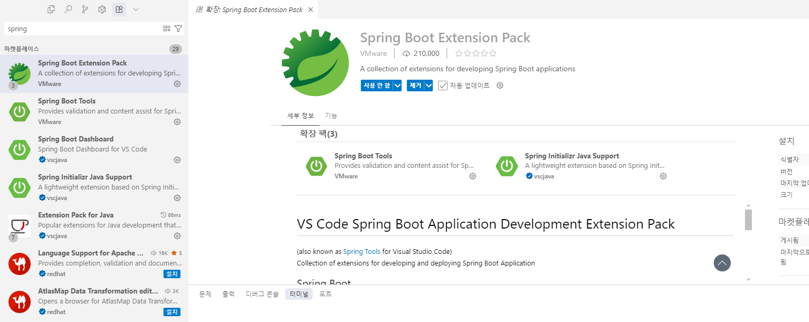

*그림 2-7. Spring Boot Extension Pack*

설치가 끝나면 View > Command Palette를 엽니다.

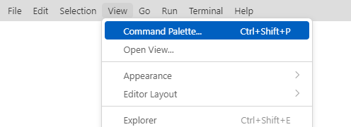

*그림 2-8. Command Palette 선택*

spring을 입력해 Spring Initializr: Create a Gradle Project를 실행합니다.

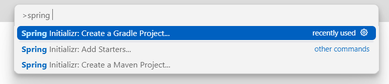

*그림 2-9. Gradle 프로젝트 생성 명령*

이어서 나오는 항목에 다음 값을 넣습니다.

| 항목 | 값 |
|------|-----|
| 스프링 부트 버전 | 4.0.7 |
| 언어 | Java |
| Group Id | com.metacoding |
| Artifact Id | spring-ch02 |
| Packaging | JAR |
| 자바 버전 | 21 |

마지막으로 프로젝트에 추가할 의존성을 고릅니다. 의존성은 프로젝트에서 사용하는 외부 라이브러리를 말합니다.

| 의존성 | 역할 |
|--------|------|
| Spring Web | REST 요청을 받는 웹 계층과 내장 웹 서버가 들어 있습니다 |
| Spring Data JPA | 객체와 테이블을 연결하는 JPA와 하이버네이트가 들어 있습니다 |
| H2 Database | 메모리에서만 동작하는 실습용 데이터베이스입니다 |
| Lombok | 게터·세터 같은 반복 코드를 자동으로 생성합니다 |

생성이 끝나면 다음과 같은 구조가 됩니다. 앞에서 고른 의존성은 `build.gradle`에 추가되어 있고, 자바 코드는 `src` 폴더 안에 작성합니다.

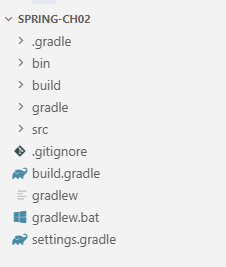

*그림 2-10. 스프링 부트 프로젝트 구조*

## 2.3 데이터베이스와 엔티티

### 2.3.1 테이블과 객체

관계형 데이터베이스는 데이터를 **테이블**에 저장합니다. 데이터의 구조를 **열(Column)** 로 미리 정의하고, 실제 데이터는 행(Row) 단위로 쌓아 올립니다. 각 행은 고유한 **기본 키(Primary Key)** 로 식별하며, 데이터를 다룰 때는 SQL이라는 데이터베이스 전용 언어를 사용합니다.

<div class="svg-figure">
<svg viewBox="0 0 760 206" xmlns="http://www.w3.org/2000/svg" role="img" aria-label="board_tb 테이블. id, title, content, created_at 열이 있고, 첫 행에는 1, title1, content1, 2026-10-04가, 둘째 행에는 2, title2, content2, 2026-10-04가 값으로 들어 있다. title 열에 열, 첫 행에 행이라는 표시가 붙어 있다.">
  <text x="380" y="30" text-anchor="middle" font-size="15" font-weight="800" fill="#0f172a">board_tb 테이블</text>
  <rect x="110" y="52" width="70" height="36" fill="#f1f5f9" stroke="#94a3b8" stroke-width="1.3"/>
  <rect x="180" y="52" width="140" height="36" fill="#f1f5f9" stroke="#94a3b8" stroke-width="1.3"/>
  <rect x="320" y="52" width="150" height="36" fill="#f1f5f9" stroke="#94a3b8" stroke-width="1.3"/>
  <rect x="470" y="52" width="180" height="36" fill="#f1f5f9" stroke="#94a3b8" stroke-width="1.3"/>
  <text x="145" y="75" text-anchor="middle" font-size="12.5" font-weight="700" font-family="ui-monospace, Consolas, monospace" fill="#334155">id</text>
  <text x="250" y="75" text-anchor="middle" font-size="12.5" font-weight="700" font-family="ui-monospace, Consolas, monospace" fill="#334155">title</text>
  <text x="395" y="75" text-anchor="middle" font-size="12.5" font-weight="700" font-family="ui-monospace, Consolas, monospace" fill="#334155">content</text>
  <text x="560" y="75" text-anchor="middle" font-size="12.5" font-weight="700" font-family="ui-monospace, Consolas, monospace" fill="#334155">created_at</text>
  <rect x="110" y="88" width="70" height="36" fill="#eef2ff" stroke="#c7d2fe" stroke-width="1.2"/>
  <rect x="180" y="88" width="140" height="36" fill="#eef2ff" stroke="#c7d2fe" stroke-width="1.2"/>
  <rect x="320" y="88" width="150" height="36" fill="#eef2ff" stroke="#c7d2fe" stroke-width="1.2"/>
  <rect x="470" y="88" width="180" height="36" fill="#eef2ff" stroke="#c7d2fe" stroke-width="1.2"/>
  <text x="145" y="111" text-anchor="middle" font-size="12.5" font-family="ui-monospace, Consolas, monospace" fill="#3730a3">1</text>
  <text x="250" y="111" text-anchor="middle" font-size="12.5" font-family="ui-monospace, Consolas, monospace" fill="#3730a3">title1</text>
  <text x="395" y="111" text-anchor="middle" font-size="12.5" font-family="ui-monospace, Consolas, monospace" fill="#3730a3">content1</text>
  <text x="560" y="111" text-anchor="middle" font-size="12.5" font-family="ui-monospace, Consolas, monospace" fill="#3730a3">2026-10-04</text>
  <rect x="110" y="124" width="70" height="36" fill="#fff" stroke="#cbd5e1" stroke-width="1.2"/>
  <rect x="180" y="124" width="140" height="36" fill="#fff" stroke="#cbd5e1" stroke-width="1.2"/>
  <rect x="320" y="124" width="150" height="36" fill="#fff" stroke="#cbd5e1" stroke-width="1.2"/>
  <rect x="470" y="124" width="180" height="36" fill="#fff" stroke="#cbd5e1" stroke-width="1.2"/>
  <text x="145" y="147" text-anchor="middle" font-size="12.5" font-family="ui-monospace, Consolas, monospace" fill="#475569">2</text>
  <text x="250" y="147" text-anchor="middle" font-size="12.5" font-family="ui-monospace, Consolas, monospace" fill="#475569">title2</text>
  <text x="395" y="147" text-anchor="middle" font-size="12.5" font-family="ui-monospace, Consolas, monospace" fill="#475569">content2</text>
  <text x="560" y="147" text-anchor="middle" font-size="12.5" font-family="ui-monospace, Consolas, monospace" fill="#475569">2026-10-04</text>
  <rect x="180" y="52" width="140" height="108" fill="none" stroke="#ff7849" stroke-width="2" stroke-dasharray="6 4"/>
  <text x="250" y="186" text-anchor="middle" font-size="13" font-weight="800" fill="#c2410c">열</text>
  <path d="M662,90 h8 v32 h-8" fill="none" stroke="#4f46e5" stroke-width="1.8"/>
  <text x="690" y="111" text-anchor="middle" font-size="13" font-weight="800" fill="#3730a3">행</text>
</svg>
</div>

*그림 2-11. board_tb 테이블*

반면, 자바는 데이터를 **객체** 형태로 다룹니다. 테이블이 단순히 데이터를 나열한 구조라면, 객체는 데이터(필드)와 데이터를 다루는 기능(메서드)을 하나로 묶은 입체적인 형태입니다.

<div class="svg-figure">
<svg viewBox="0 0 760 250" xmlns="http://www.w3.org/2000/svg" role="img" aria-label="Board 객체. 위 칸의 필드에는 id = 1, title = title1, content = content1, createdAt = 2026-10-04가 들어 있고, 아래 칸에는 getTitle(), setTitle() 같은 메서드가 함께 들어 있다. 오른쪽에 필드는 상태, 메서드는 행위라고 표시되어 있다.">
  <rect x="200" y="20" width="360" height="214" rx="10" fill="#fff" stroke="#4f46e5" stroke-width="1.9"/>
  <rect x="200" y="20" width="360" height="40" rx="10" fill="#eef2ff"/>
  <rect x="200" y="48" width="360" height="12" fill="#eef2ff"/>
  <line x1="200" y1="60" x2="560" y2="60" stroke="#4f46e5" stroke-width="1.4"/>
  <text x="380" y="46" text-anchor="middle" font-size="15" font-weight="800" fill="#3730a3">Board 객체</text>
  <text x="228" y="88" font-size="12.5" font-family="ui-monospace, Consolas, monospace" fill="#334155">id = 1</text>
  <text x="228" y="112" font-size="12.5" font-family="ui-monospace, Consolas, monospace" fill="#334155">title = "title1"</text>
  <text x="228" y="136" font-size="12.5" font-family="ui-monospace, Consolas, monospace" fill="#334155">content = "content1"</text>
  <text x="228" y="160" font-size="12.5" font-family="ui-monospace, Consolas, monospace" fill="#334155">createdAt = 2026-10-04</text>
  <line x1="200" y1="176" x2="560" y2="176" stroke="#c7d2fe" stroke-width="1.4"/>
  <text x="228" y="202" font-size="12.5" font-weight="700" font-family="ui-monospace, Consolas, monospace" fill="#3730a3">getTitle()</text>
  <text x="228" y="224" font-size="12.5" font-weight="700" font-family="ui-monospace, Consolas, monospace" fill="#3730a3">setTitle()</text>
  <path d="M572,70 h8 v96 h-8" fill="none" stroke="#94a3b8" stroke-width="1.6"/>
  <text x="598" y="123" font-size="13" font-weight="700" fill="#475569">필드 (상태)</text>
  <path d="M572,184 h8 v44 h-8" fill="none" stroke="#4f46e5" stroke-width="1.6"/>
  <text x="598" y="211" font-size="13" font-weight="700" fill="#3730a3">메서드 (행위)</text>
</svg>
</div>

*그림 2-12. Board 객체*

이렇게 서로 다른 두 구조 사이에서, 데이터베이스의 데이터를 스프링으로 관리하려면 형태를 알맞게 변환하고 연결해 줄 기술이 필요합니다.

### 2.3.2 JPA

객체와 테이블을 연결하는 기술은 어댑터에 비유할 수 있습니다. 220V 플러그를 110V 콘센트에 꽂으려면 규격이 달라 어댑터가 필요하듯, 자바와 데이터베이스 역시 데이터를 다루는 구조가 달라 객체를 테이블에 그대로 넣을 수 없습니다.

<div class="svg-figure">
<svg viewBox="0 0 760 250" xmlns="http://www.w3.org/2000/svg" role="img" aria-label="왼쪽 플러그는 자바가 쓰는 Board 객체, 오른쪽 콘센트는 데이터베이스가 쓰는 board_tb 테이블이고, 가운데 어댑터가 JPA로서 둘을 연결한다.">
  <defs>
    <marker id="c2ad-l" markerWidth="9" markerHeight="9" refX="1" refY="3" orient="auto"><path d="M9,0 L9,6 L1,3 z" fill="#94a3b8"/></marker>
    <marker id="c2ad-r" markerWidth="9" markerHeight="9" refX="8" refY="3" orient="auto"><path d="M0,0 L0,6 L8,3 z" fill="#94a3b8"/></marker>
  </defs>
  <path d="M26,111 C48,111 54,111 70,111" fill="none" stroke="#94a3b8" stroke-width="2.4"/>
  <rect x="70" y="76" width="84" height="70" rx="14" fill="#fff" stroke="#475569" stroke-width="1.8"/>
  <rect x="154" y="92" width="34" height="11" rx="5" fill="#cbd5e1" stroke="#64748b" stroke-width="1.2"/>
  <rect x="154" y="120" width="34" height="11" rx="5" fill="#cbd5e1" stroke="#64748b" stroke-width="1.2"/>
  <text x="112" y="196" text-anchor="middle" font-size="12.7" font-weight="700" fill="#3730a3">Board 객체</text>
  <text x="112" y="216" text-anchor="middle" font-size="10.7" fill="#64748b">자바의 구조</text>
  <line x1="202" y1="111" x2="256" y2="111" stroke="#94a3b8" stroke-width="1.8" marker-start="url(#c2ad-l)" marker-end="url(#c2ad-r)"/>
  <rect x="264" y="62" width="170" height="98" rx="12" fill="#eef2ff" stroke="#4f46e5" stroke-width="1.9"/>
  <text x="349" y="117" text-anchor="middle" font-size="13.6" font-weight="800" fill="#3730a3">JPA</text>
  <rect x="434" y="88" width="26" height="9" rx="3" fill="#cbd5e1" stroke="#64748b" stroke-width="1.2"/>
  <rect x="434" y="126" width="26" height="9" rx="3" fill="#cbd5e1" stroke="#64748b" stroke-width="1.2"/>
  <text x="349" y="196" text-anchor="middle" font-size="10.7" fill="#64748b">객체와 테이블을 연결합니다</text>
  <line x1="472" y1="111" x2="526" y2="111" stroke="#94a3b8" stroke-width="1.8" marker-start="url(#c2ad-l)" marker-end="url(#c2ad-r)"/>
  <rect x="534" y="58" width="130" height="106" rx="10" fill="#fff" stroke="#475569" stroke-width="1.8"/>
  <rect x="578" y="88" width="11" height="34" rx="2" fill="#334155"/>
  <rect x="610" y="88" width="11" height="34" rx="2" fill="#334155"/>
  <text x="599" y="196" text-anchor="middle" font-size="12.7" font-weight="700" fill="#0f172a">board_tb 테이블</text>
  <text x="599" y="216" text-anchor="middle" font-size="10.7" fill="#64748b">데이터베이스의 구조</text>
</svg>
</div>

*그림 2-13. 어댑터를 끼운 플러그와 콘센트*

이처럼 어댑터 역할을 하며 두 구조의 간극을 메워주는 기술을 **ORM(Object-Relational Mapping)** 이라고 합니다. 자바에서는 ORM 기술의 표준 규칙을 **JPA(Java Persistence API)** 로 정의하고 있습니다. 그리고 이 규칙에 따라 실제 코드로 구현한 대표적인 도구가 **하이버네이트(Hibernate)** 입니다. 앞서 우리가 추가한 Spring Data JPA 의존성에는 이 하이버네이트가 기본 엔진으로 내장되어 있습니다.

JPA를 사용하면 개발자는 복잡한 SQL 대신 자바 객체를 통해 데이터베이스를 다룰 수 있습니다. 클래스에 어노테이션을 추가해 연결할 테이블을 지정하면, JPA가 이를 읽고 클래스의 필드와 테이블의 컬럼을 짝지어 줍니다. 이후 코드에서 객체를 저장·조회·수정·삭제하면 JPA가 상황에 맞는 SQL 문을 알아서 생성해 실행하고, 조회한 데이터 역시 다시 객체에 담아 반환해 줍니다.

### 2.3.3 데이터베이스 설정

프로젝트의 환경 설정은 `resources/application.properties` 파일에서 관리합니다. 서버 포트나 데이터베이스 연결 정보, JPA 동작 방식 등을 이곳에 지정합니다.

```properties [참고] resources/application.properties. 프로젝트 환경 설정
# 8080 포트로 실행하고, 요청과 응답의 문자를 UTF-8로 처리해 한글이 깨지지 않게 한다
server.port=8080
spring.servlet.encoding.charset=UTF-8
spring.servlet.encoding.enabled=true
spring.servlet.encoding.force=true

# 메모리에서 동작하는 H2에 sa 계정으로 접속한다
spring.datasource.driver-class-name=org.h2.Driver
spring.datasource.url=jdbc:h2:mem:test
spring.datasource.username=sa
spring.datasource.password=

# 브라우저에서 H2 콘솔로 테이블을 확인할 수 있게 한다
spring.h2.console.enabled=true

# 시작 시점에 실행할 SQL 파일의 위치
spring.sql.init.data-locations=classpath:db/data.sql

# 테이블이 만들어진 뒤에 위 파일을 실행한다
spring.jpa.defer-datasource-initialization=true

# 스프링 실행 시 @Entity가 표시된 클래스를 테이블로 자동 생성한다
spring.jpa.hibernate.ddl-auto=create

# JPA가 만든 SQL을 콘솔에 보기 좋게 출력한다
spring.jpa.show-sql=true
spring.jpa.properties.hibernate.format_sql=true
```

실습에 사용할 데이터베이스는 **H2**입니다. 자바로 만들어진 가벼운 관계형 데이터베이스로, 별도의 설치 과정이 필요 없습니다. 다만 메모리 기반으로 동작하기 때문에 서버를 종료하면 저장된 데이터는 모두 사라집니다.

:::tip
**ddl-auto=create는 개발 단계에서만**

**ddl-auto=create** 는 스프링을 실행할 때마다 테이블을 새로 생성하는 설정입니다. 운영 환경에 이 설정을 적용하면 재시작할 때마다 데이터가 모두 사라지므로, 개발 단계에서만 사용합니다.
:::

### 2.3.4 엔티티

데이터베이스의 테이블과 1:1로 짝을 이루도록 설계한 자바 클래스를 **엔티티(Entity)** 라고 부릅니다. **board_tb** 테이블과 매핑되는 **Board** 엔티티를 살펴보겠습니다.

```java [참고] board/Board.java. 게시글 엔티티
@Data // 롬복(Lombok). 게터·세터·toString을 컴파일 시점에 대신 만든다
@Entity
@Table(name = "board_tb") // 이 클래스를 board_tb 테이블에 매핑한다
public class Board {
    @Id // 기본 키
    @GeneratedValue(strategy = GenerationType.IDENTITY) // 자동 증가
    private Integer id;

    private String title;
    private String content;

    @CreationTimestamp // 저장 시점의 현재 시간을 자동으로 기록한다
    private LocalDateTime createdAt;
}
```

애플리케이션을 실행하면 하이버네이트가 이 클래스를 읽어 **board_tb** 테이블을 생성합니다.

### 2.3.5 더미 데이터

실습을 위해 미리 넣어 두는 가상의 데이터를 **더미 데이터(Dummy Data)** 라고 합니다. `resources/db/data.sql`에는 아래와 같은 더미 데이터가 들어 있습니다.

```sql [참고] resources/db/data.sql. 게시글 더미 데이터
insert into board_tb (title, content, created_at)
values ('title1', 'content1', now());
insert into board_tb (title, content, created_at)
values ('title2', 'content2', now());
```

### 2.3.6 프로젝트 실행

터미널에 `./gradlew bootRun`을 입력해 스프링을 실행합니다.

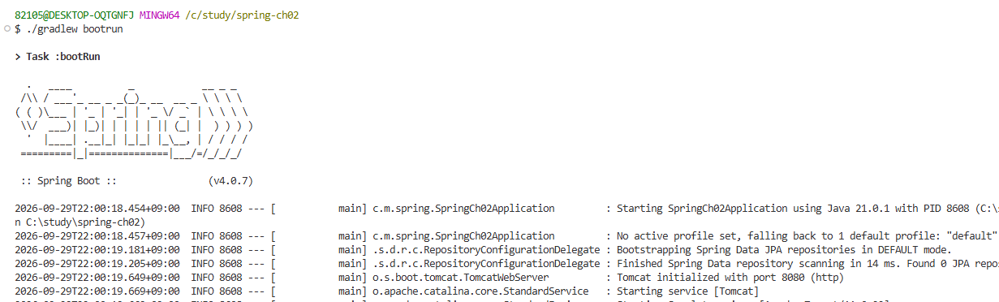
*그림 2-14. 스프링 실행 결과*

브라우저 주소창에 `http://localhost:8080/h2-console`을 입력하면 H2 콘솔에 접속할 수 있습니다. 로그인 화면에 입력할 JDBC URL과 User Name, Password는 `application.properties`에서 설정한 값입니다.

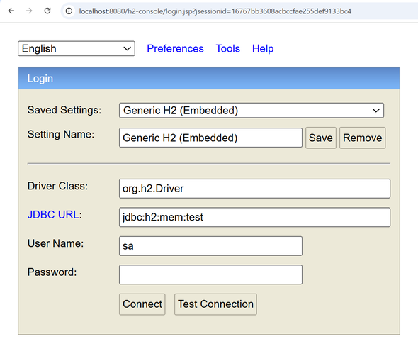
*그림 2-15. H2 콘솔 로그인 화면*

H2 콘솔에서 **board_tb** 테이블을 확인할 수 있습니다.

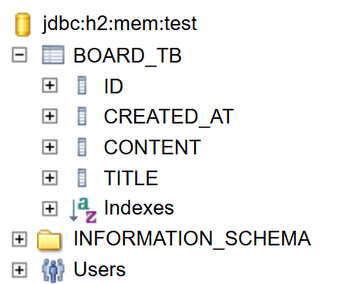
*그림 2-16. H2 콘솔의 board_tb 테이블*

H2 콘솔에서는 SQL문을 실행할 수 있습니다. SELECT 쿼리로 테이블을 조회하면 `data.sql`에 넣어 둔 데이터를 확인할 수 있습니다.

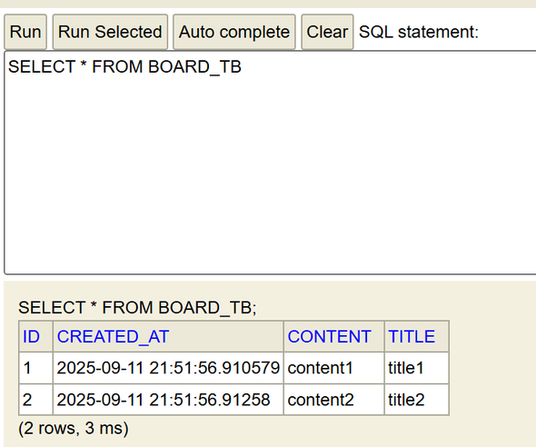
*그림 2-17. board_tb 조회 결과*

:::tip
**자바의 카멜 케이스와 DB의 스네이크 케이스**

자바는 두 번째 단어부터 첫 글자를 대문자로 적는 **카멜 표기법(createdAt)** 을 주로 사용하고, 데이터베이스는 단어 사이를 밑줄로 구분하는 **스네이크 표기법(created_at)** 을 관례로 사용합니다. 하이버네이트는 엔티티 필드의 카멜 표기를 DB의 스네이크 표기 컬럼명으로 자동 변환해 주므로, 개발자는 자바의 네이밍 규칙만 신경 쓰면 됩니다.
:::

## 2.4 3계층 아키텍처

게시판에 필요한 모든 코드를 하나의 클래스에 작성해도 프로그램은 정상적으로 돌아갑니다. 하지만 요청과 응답을 다루는 코드, 비즈니스 로직을 처리하는 코드, 데이터베이스에 접근하는 코드가 한 곳에 섞여 있으면 코드가 복잡해져 어디서 에러가 났는지 찾기 힘듭니다.

<div class="svg-figure">
<svg viewBox="0 0 320 210" style="max-width:330px" xmlns="http://www.w3.org/2000/svg" role="img" aria-label="BoardAll.java 파일 상자 하나 안에 요청과 응답, 데이터베이스 접근, 비즈니스 로직이 순서 없이 섞여 있다.">
  <text x="30" y="26" font-size="12.6" font-weight="800" fill="#0f172a">BoardAll.java</text>
  <rect x="30" y="36" width="260" height="156" rx="8" fill="#fff" stroke="#475569" stroke-width="1.8"/>
  <rect x="50" y="50" width="220" height="28" rx="6" fill="#eef2ff" stroke="#4f46e5" stroke-width="1.3"/>
  <text x="160" y="69" text-anchor="middle" font-size="11.6" font-weight="700" fill="#3730a3">요청과 응답</text>
  <rect x="50" y="86" width="220" height="28" rx="6" fill="#fff7ed" stroke="#ff7849" stroke-width="1.3"/>
  <text x="160" y="105" text-anchor="middle" font-size="11.6" font-weight="700" fill="#c2410c">데이터베이스 접근</text>
  <rect x="50" y="122" width="220" height="28" rx="6" fill="#f1f5f9" stroke="#94a3b8" stroke-width="1.3"/>
  <text x="160" y="141" text-anchor="middle" font-size="11.6" font-weight="700" fill="#334155">비즈니스 로직</text>
  <rect x="50" y="158" width="220" height="28" rx="6" fill="#fff7ed" stroke="#ff7849" stroke-width="1.3"/>
  <text x="160" y="177" text-anchor="middle" font-size="11.6" font-weight="700" fill="#c2410c">데이터베이스 접근</text>
</svg>
</div>

*그림 2-18. 한 클래스에 섞인 코드*

이런 문제를 막기 위해 코드를 역할별로 나누어 각각 다른 클래스에 작성합니다. 클래스마다 맡은 역할이 분명해지므로, 에러가 나면 어느 클래스를 살펴봐야 할지 바로 알 수 있고 한쪽 코드를 고쳐도 다른 클래스에 미치는 영향이 줄어듭니다.

<div class="svg-figure svg-figure--wide">
<svg viewBox="0 0 900 200" xmlns="http://www.w3.org/2000/svg" role="img" aria-label="왼쪽에서 요청이 들어와 컨트롤러, 서비스, 리포지토리를 차례로 지나 오른쪽 데이터베이스에 닿는다. 응답은 같은 길을 거꾸로 되짚어 데이터베이스에서 리포지토리, 서비스, 컨트롤러 순서로 돌아온다.">
  <defs>
    <marker id="rt" markerWidth="9" markerHeight="9" refX="7" refY="3" orient="auto"><path d="M0,0 L0,6 L7,3 z" fill="#475569"/></marker>
    <marker id="bk" markerWidth="9" markerHeight="9" refX="7" refY="3" orient="auto"><path d="M0,0 L0,6 L7,3 z" fill="#94a3b8"/></marker>
  </defs>
  <text x="46" y="78" text-anchor="middle" font-size="13.8" font-weight="700" fill="#475569">요청</text>
  <line x1="14" y1="88" x2="82" y2="88" stroke="#475569" stroke-width="1.8" marker-end="url(#rt)"/>
  <line x1="82" y1="124" x2="14" y2="124" stroke="#94a3b8" stroke-width="1.6" stroke-dasharray="6,4" marker-end="url(#bk)"/>
  <text x="46" y="146" text-anchor="middle" font-size="13.8" font-weight="700" fill="#94a3b8">응답</text>
  <rect x="90" y="56" width="190" height="94" rx="8" fill="#fff" stroke="#4f46e5" stroke-width="1.9"/>
  <text x="185" y="98" text-anchor="middle" font-size="17.3" font-weight="800" fill="#3730a3">컨트롤러</text>
  <text x="185" y="122" text-anchor="middle" font-size="13.8" fill="#64748b">요청과 응답</text>
  <line x1="284" y1="88" x2="312" y2="88" stroke="#475569" stroke-width="1.8" marker-end="url(#rt)"/>
  <line x1="312" y1="124" x2="284" y2="124" stroke="#94a3b8" stroke-width="1.6" stroke-dasharray="6,4" marker-end="url(#bk)"/>
  <rect x="316" y="56" width="190" height="94" rx="8" fill="#fff" stroke="#475569" stroke-width="1.9"/>
  <text x="411" y="98" text-anchor="middle" font-size="17.3" font-weight="800" fill="#0f172a">서비스</text>
  <text x="411" y="122" text-anchor="middle" font-size="13.8" fill="#64748b">비즈니스 로직</text>
  <line x1="510" y1="88" x2="538" y2="88" stroke="#475569" stroke-width="1.8" marker-end="url(#rt)"/>
  <line x1="538" y1="124" x2="510" y2="124" stroke="#94a3b8" stroke-width="1.6" stroke-dasharray="6,4" marker-end="url(#bk)"/>
  <rect x="542" y="56" width="190" height="94" rx="8" fill="#fff" stroke="#ff7849" stroke-width="1.9"/>
  <text x="637" y="98" text-anchor="middle" font-size="17.3" font-weight="800" fill="#c2410c">리포지토리</text>
  <text x="637" y="122" text-anchor="middle" font-size="13.8" fill="#64748b">데이터베이스 접근</text>
  <line x1="736" y1="88" x2="766" y2="88" stroke="#475569" stroke-width="1.8" marker-end="url(#rt)"/>
  <line x1="766" y1="124" x2="736" y2="124" stroke="#94a3b8" stroke-width="1.6" stroke-dasharray="6,4" marker-end="url(#bk)"/>
  <ellipse cx="830" cy="70" rx="56" ry="12" fill="#fff" stroke="#475569" stroke-width="1.8"/>
  <path d="M774,70 L774,136" fill="none" stroke="#475569" stroke-width="1.8"/>
  <path d="M886,70 L886,136" fill="none" stroke="#475569" stroke-width="1.8"/>
  <ellipse cx="830" cy="136" rx="56" ry="12" fill="#fff" stroke="#475569" stroke-width="1.8"/>
  <text x="830" y="110" text-anchor="middle" font-size="13.8" font-weight="700" fill="#0f172a">데이터베이스</text>
</svg>
</div>

*그림 2-19. 계층으로 나눈 코드*

스프링 웹 개발에서는 이렇게 역할에 따라 코드를 세 계층으로 나누는 **3계층 아키텍처(3-Layer Architecture)** 를 주로 사용합니다.

| 계층 | 하는 일 |
|----|---------|
| 컨트롤러(Controller) | HTTP 요청을 받아 서비스를 호출하고, 그 결과를 응답합니다 |
| 서비스(Service) | 리포지토리를 호출해 요청에 필요한 **비즈니스 로직**을 수행합니다 |
| 리포지토리(Repository) | 엔티티를 데이터베이스에서 조회하고 저장·수정·삭제합니다 |

## 2.5 공통 응답

`core` 폴더는 프로젝트에 필요한 설정 파일, 도구 파일 등을 모아 놓은 폴더입니다.

**Resp** 클래스는 API 응답 구조를 정하는 역할을 합니다. 요청이 성공하면 `status`에 200을, `body`에 응답 데이터를 담고, 실패하면 `status`에 에러 상태 코드를, `msg`에 에러 메시지를 담습니다.

```java [참고] core/util/Resp.java. 공통 응답 형식
public record Resp<T>(Integer status, String msg, T body) {

    public static <B> ResponseEntity<Resp<B>> ok(B body) {
        return new ResponseEntity<>(new Resp<>(200, "성공", body), HttpStatus.OK);
    }

    public static ResponseEntity<?> fail(HttpStatus status, String msg) {
        return new ResponseEntity<>(new Resp<>(status.value(), msg, null), status);
    }
}
```

## 2.6 리포지토리(Repository)

먼저 데이터베이스에 접근하는 리포지토리를 만들어 보겠습니다. 리포지토리가 데이터베이스에 접근할 때 사용하는 도구가 **EntityManager**입니다. 이 객체는 스프링이 미리 빈(Bean)으로 등록해 두므로, 직접 만들 필요 없이 생성자로 주입받아 사용하면 됩니다.

`board/BoardRepository.java`를 열어 아래 코드를 확인합니다.

```java [참고] board/BoardRepository.java. 리포지토리 골격
@RequiredArgsConstructor
@Repository // 스프링이 빈으로 등록한다
public class BoardRepository {

    private final EntityManager em; // 의존성 주입

    // 아래 절에서 메서드를 하나씩 채운다
}
```

:::tip
**의존성 주입 방법**

이 책에서는 의존성을 주입받을 때 final 필드와 @RequiredArgsConstructor를 조합하는 방식을 사용합니다.

@RequiredArgsConstructor는 final 필드를 매개변수로 받는 생성자를 자동으로 만들어 주고, 스프링은 객체를 생성할 때 이 생성자를 통해 필요한 빈을 전달합니다. 이렇게 생성자로 의존성을 주입받으면 필요한 객체가 누락되었을 때 실행 전 컴파일 단계에서 곧바로 오류를 발견할 수 있습니다. 또한 주입된 객체는 final 특성상 도중에 값이 바뀌지 않으므로 안전하게 사용할 수 있습니다.
:::

### 2.6.1 게시글 한 건 조회

**EntityManager**의 `find()`는 기본 키(PK)로 엔티티 한 건을 조회하는 메서드입니다. 첫 번째 인자에는 조회할 엔티티의 클래스 타입을, 두 번째 인자에는 찾으려는 기본 키 값을 넣어줍니다. 그러면 `find()`가 조건에 맞는 **Board** 엔티티 한 건을 반환합니다.

`board/BoardRepository.java`의 `findById()`를 아래와 같이 작성합니다.

```java [실습 1] board/BoardRepository.java. 기본 키로 한 건 조회
    public Board findById(int boardId) {
        return em.find(Board.class, boardId);
    }
```

`find()` 메서드는 데이터베이스에 다음과 같은 select 문을 전달합니다.

```sql
select id, content, created_at, title from board_tb where id = 1;
```

### 2.6.2 게시글 전체 조회

**EntityManager**에는 전체 목록을 한 번에 조회하는 전용 메서드가 없습니다. 따라서 전체 데이터를 가져오려면 **JPQL(Java Persistence Query Language)** 을 사용해 직접 쿼리를 작성해서 실행해야 합니다.

`board/BoardRepository.java`의 `findAll()`을 아래와 같이 작성합니다.

```java [실습 2] board/BoardRepository.java. JPQL로 전체 조회
    public List<Board> findAll() {
        return em.createQuery("select b from Board b", Board.class).getResultList();
    }
```

`createQuery()`에 JPQL 문자열과 반환 타입을 넘겨 쿼리를 생성한 뒤, `getResultList()`를 호출해 실행합니다. 그러면 하이버네이트가 이 JPQL을 아래와 같은 실제 SQL로 번역해 줍니다.

```sql
select id, content, created_at, title from board_tb;
```

JPQL의 문법은 다음 절에서 따로 다루겠습니다.

### 2.6.3 게시글 저장

데이터를 조회할 때 `find()`를 사용한다면, 새로운 데이터를 추가할 때는 `persist()` 메서드를 사용합니다. 새로 만든 엔티티를 `persist()`에 넘겨주기만 하면, 하이버네이트가 이를 분석해 INSERT 쿼리를 생성하고 데이터베이스에 저장합니다.

`board/BoardRepository.java`의 `save()`를 아래와 같이 작성합니다.

```java [실습 3] board/BoardRepository.java. 새 게시글 저장
    public void save(Board board) {
        em.persist(board);
    }
```

`persist()`가 데이터베이스에 전달하는 SQL은 다음과 같습니다.

```sql
insert into board_tb (content, created_at, title)
values ('content3', now(), 'title3');
```

### 2.6.4 게시글 수정

JPA에는 데이터를 수정하는 메서드가 없습니다. 대신 조회해 온 엔티티의 값만 변경하면 변경 내용이 데이터베이스에 자동으로 반영됩니다. 이를 **더티체킹(변경 감지)** 이라 부르며, 자세한 원리는 뒤에서 다루겠습니다.

### 2.6.5 게시글 삭제

게시글을 삭제할 때는 `remove()` 메서드를 사용합니다. 이 메서드에 삭제할 엔티티를 넘겨주면 JPA가 이를 삭제 대상으로 표시하고, 데이터베이스에 삭제 쿼리를 전달합니다.

`board/BoardRepository.java`의 `delete()`를 아래와 같이 작성합니다.

```java [실습 4] board/BoardRepository.java. 게시글 삭제
    public void delete(Board board) {
        em.remove(board);
    }
```

`remove()`가 데이터베이스에 전달하는 SQL은 다음과 같습니다.

```sql
delete from board_tb where id = 2;
```

## 2.7 JPQL

JPQL은 데이터베이스 테이블이 아닌 자바 엔티티와 필드 이름을 기준으로 작성하는 JPA 전용 쿼리 언어입니다. 작성된 JPQL은 실행 시점에 JPA가 SQL로 번역하여 데이터베이스에 전달합니다.

JPQL은 테이블 이름 대신 엔티티 이름을 적고, 별칭을 사용해 대상을 가리키는 형태로 작성합니다. 기본 조회 문법은 다음과 같습니다.

```java
select b from Board b
```

일부 필드만 조회할 때는 별칭 뒤에 점(.)을 찍고 필드 이름을 적습니다. 이때 데이터베이스의 컬럼명(`created_at`)이 아니라 엔티티의 필드명(`createdAt`)을 적어야 합니다.

```java
select b.title, b.content from Board b
```

조건을 추가할 때는 `where` 절에서 파라미터 이름 앞에 콜론(:)을 붙입니다.

```java
select b from Board b where b.id = :id
```

수정과 삭제도 같은 방식으로 작성합니다.

```java
update Board b set b.title = '제목 수정' where b.id = :id

delete from Board b where b.id = :id
```

## 2.8 영속성 컨텍스트

JPA의 **EntityManager**는 SQL을 데이터베이스에 보내기 전에 엔티티를 별도 공간에 보관하고 관리합니다. 이 공간을 **영속성 컨텍스트(Persistence Context)** 라고 부릅니다. **EntityManager**를 통해 저장하거나 조회한 엔티티는 영속성 컨텍스트에 보관되는데, 이 상태를 **영속 상태**라고 합니다.

영속성 컨텍스트의 특징은 크게 세 가지입니다.

### 2.8.1 캐싱

캐싱은 한 번 조회한 엔티티를 영속성 컨텍스트에 보관해 두었다가, **똑같은 엔티티를 다시 요청할 때 데이터베이스를 거치지 않고 바로 반환하는 기능입니다**.

처음 조회하는 게시글은 아직 영속성 컨텍스트에 없습니다. 따라서 JPA가 데이터베이스에 SELECT 쿼리를 보내 데이터를 조회해 온 뒤, 이를 영속성 컨텍스트에 보관하고 반환합니다.

<div class="svg-figure">
<svg viewBox="0 0 660 200" xmlns="http://www.w3.org/2000/svg" role="img" aria-label="캐시에 없는 첫 조회. 리포지토리가 find()를 호출하면 영속성 컨텍스트는 캐시 miss 상태라 select SQL로 데이터베이스에서 읽어 오고, 읽어 온 board를 영속화한 뒤 리포지토리에 엔티티를 돌려준다.">
  <defs>
    <marker id="c2c1-a" markerWidth="9" markerHeight="9" refX="7" refY="3" orient="auto"><path d="M0,0 L0,6 L7,3 z" fill="#475569"/></marker>
  </defs>
  <text x="80" y="22" text-anchor="middle" font-size="12.6" font-weight="800" fill="#0f172a">리포지토리</text>
  <text x="330" y="22" text-anchor="middle" font-size="12.6" font-weight="800" fill="#3730a3">영속성 컨텍스트</text>
  <text x="580" y="22" text-anchor="middle" font-size="12.6" font-weight="800" fill="#0f172a">데이터베이스</text>
  <rect x="20" y="36" width="120" height="146" rx="9" fill="#fff" stroke="#475569" stroke-width="1.5"/>
  <rect x="240" y="36" width="180" height="146" rx="9" fill="#f8fafc" stroke="#4f46e5" stroke-width="1.6"/>
  <rect x="520" y="36" width="120" height="146" rx="9" fill="#fff" stroke="#475569" stroke-width="1.5"/>
  <text x="330" y="66" text-anchor="middle" font-size="11.5" font-weight="700" fill="#475569">캐시 miss</text>
  <rect x="256" y="86" width="148" height="34" rx="6" fill="#eef2ff" stroke="#4f46e5" stroke-width="1.5"/>
  <text x="330" y="107" text-anchor="middle" font-size="11" fill="#3730a3">board(제목1, 내용1)</text>
  <text x="330" y="136" text-anchor="middle" font-size="10.5" fill="#64748b">영속화된 엔티티</text>
  <text x="580" y="98" text-anchor="middle" font-size="11" fill="#334155">board(제목1, 내용1)</text>
  <text x="580" y="118" text-anchor="middle" font-size="11" fill="#334155">board(제목2, 내용2)</text>
  <line x1="140" y1="70" x2="238" y2="70" stroke="#475569" stroke-width="1.5" marker-end="url(#c2c1-a)"/>
  <text x="189" y="62" text-anchor="middle" font-size="10.5" fill="#475569">1. find()</text>
  <line x1="420" y1="70" x2="518" y2="70" stroke="#475569" stroke-width="1.5" marker-end="url(#c2c1-a)"/>
  <text x="469" y="62" text-anchor="middle" font-size="10.5" fill="#475569">2. select SQL</text>
  <line x1="518" y1="103" x2="422" y2="103" stroke="#94a3b8" stroke-width="1.4" marker-end="url(#c2c1-a)"/>
  <text x="470" y="122" text-anchor="middle" font-size="10.5" fill="#64748b">3. 영속화</text>
  <line x1="238" y1="152" x2="142" y2="152" stroke="#94a3b8" stroke-width="1.4" marker-end="url(#c2c1-a)"/>
  <text x="190" y="170" text-anchor="middle" font-size="10.5" fill="#64748b">4. 엔티티 반환</text>
</svg>
</div>

*그림 2-20. 첫 조회와 영속화*

반면 같은 게시글을 다시 조회할 때는 데이터베이스를 거치지 않습니다. 영속성 컨텍스트에 보관된 엔티티를 바로 반환하기 때문에, **한 트랜잭션 안에서** 여러 번 조회하더라도 SELECT 쿼리는 최초 한 번만 실행됩니다.

<div class="svg-figure">
<svg viewBox="0 0 660 200" xmlns="http://www.w3.org/2000/svg" role="img" aria-label="캐시에 있는 두 번째 조회. 리포지토리가 같은 게시글을 다시 find()로 찾으면 영속성 컨텍스트가 이미 가지고 있던 board를 그대로 돌려준다. 데이터베이스로는 select SQL이 나가지 않는다.">
  <defs>
    <marker id="c2c2-a" markerWidth="9" markerHeight="9" refX="7" refY="3" orient="auto"><path d="M0,0 L0,6 L7,3 z" fill="#475569"/></marker>
  </defs>
  <text x="80" y="22" text-anchor="middle" font-size="12.6" font-weight="800" fill="#0f172a">리포지토리</text>
  <text x="330" y="22" text-anchor="middle" font-size="12.6" font-weight="800" fill="#3730a3">영속성 컨텍스트</text>
  <text x="580" y="22" text-anchor="middle" font-size="12.6" font-weight="800" fill="#0f172a">데이터베이스</text>
  <rect x="20" y="36" width="120" height="146" rx="9" fill="#fff" stroke="#475569" stroke-width="1.5"/>
  <rect x="240" y="36" width="180" height="146" rx="9" fill="#f8fafc" stroke="#4f46e5" stroke-width="1.6"/>
  <rect x="520" y="36" width="120" height="146" rx="9" fill="#fff" stroke="#475569" stroke-width="1.5"/>
  <rect x="256" y="86" width="148" height="34" rx="6" fill="#eef2ff" stroke="#4f46e5" stroke-width="1.5"/>
  <text x="330" y="107" text-anchor="middle" font-size="11" fill="#3730a3">board(제목1, 내용1)</text>
  <text x="330" y="136" text-anchor="middle" font-size="10.5" fill="#64748b">영속화된 엔티티</text>
  <text x="580" y="98" text-anchor="middle" font-size="11" fill="#334155">board(제목1, 내용1)</text>
  <text x="580" y="118" text-anchor="middle" font-size="11" fill="#334155">board(제목2, 내용2)</text>
  <line x1="140" y1="70" x2="238" y2="70" stroke="#475569" stroke-width="1.5" marker-end="url(#c2c2-a)"/>
  <text x="189" y="62" text-anchor="middle" font-size="10.5" fill="#475569">1. find()</text>
  <line x1="238" y1="152" x2="142" y2="152" stroke="#94a3b8" stroke-width="1.4" marker-end="url(#c2c2-a)"/>
  <text x="190" y="170" text-anchor="middle" font-size="10.5" fill="#64748b">2. 캐시에서 반환</text>
</svg>
</div>

*그림 2-21. 캐시 조회*

:::tip
**트랜잭션이란?**

**트랜잭션(Transaction)** 은 여러 작업을 하나로 묶어 전부 반영하거나 전부 취소하는 작업 단위입니다. 스프링에서는 보통 서비스 계층의 메서드 하나가 한 트랜잭션 단위가 됩니다.

영속성 컨텍스트도 기본적으로 이 트랜잭션이 실행되는 동안 유지됩니다. 메서드가 정상적으로 끝나 트랜잭션이 종료되면 컨텍스트도 닫히고, 안에 있던 엔티티는 더 이상 관리되지 않습니다.
:::

### 2.8.2 쓰기 지연

우리는 마트에서 물건을 고를 때마다 계산하지 않고, 장바구니에 담은 후 한 번에 결제합니다. 이와 같이 영속성 컨텍스트는 **데이터를 변경하는 SQL을 곧바로 실행하지 않고 내부의 임시 공간(버퍼)에 모은 뒤 한 번에 데이터베이스로 전송합니다**. 이런 방식을 **쓰기 지연(Write Behind)** 이라고 합니다.

예를 들어 1번과 2번 게시글을 `remove()`로 삭제하면, JPA는 DELETE 문을 곧바로 전송하지 않고 버퍼에 쌓아 둡니다. 이 시점에 데이터베이스에는 두 게시글이 그대로 남아 있습니다.

<div class="svg-figure">
<svg viewBox="0 0 660 200" xmlns="http://www.w3.org/2000/svg" role="img" aria-label="쓰기 지연 첫 단계. 리포지토리가 remove()로 board1과 board2를 차례로 삭제하면 delete SQL이 데이터베이스로 가지 않고 영속성 컨텍스트의 버퍼에 쌓인다. 데이터베이스에는 board1과 board2가 그대로 남아 있다.">
  <defs>
    <marker id="c2wb1-a" markerWidth="9" markerHeight="9" refX="7" refY="3" orient="auto"><path d="M0,0 L0,6 L7,3 z" fill="#475569"/></marker>
  </defs>
  <text x="80" y="22" text-anchor="middle" font-size="12.6" font-weight="800" fill="#0f172a">리포지토리</text>
  <text x="330" y="22" text-anchor="middle" font-size="12.6" font-weight="800" fill="#3730a3">영속성 컨텍스트</text>
  <text x="580" y="22" text-anchor="middle" font-size="12.6" font-weight="800" fill="#0f172a">데이터베이스</text>
  <rect x="20" y="36" width="120" height="146" rx="9" fill="#fff" stroke="#475569" stroke-width="1.5"/>
  <rect x="240" y="36" width="180" height="146" rx="9" fill="#f8fafc" stroke="#4f46e5" stroke-width="1.6"/>
  <rect x="520" y="36" width="120" height="146" rx="9" fill="#fff" stroke="#475569" stroke-width="1.5"/>
  <rect x="252" y="48" width="156" height="104" rx="7" fill="#fff" stroke="#94a3b8" stroke-width="1.4"/>
  <text x="330" y="62" text-anchor="middle" font-size="10.5" font-weight="700" fill="#64748b">버퍼</text>
  <rect x="264" y="68" width="132" height="34" rx="6" fill="#f8fafc" stroke="#cbd5e1" stroke-width="1.2"/>
  <text x="330" y="82" text-anchor="middle" font-size="11" font-weight="700" fill="#475569">delete SQL</text>
  <text x="330" y="96" text-anchor="middle" font-size="10" fill="#64748b">board(제목1)</text>
  <rect x="264" y="108" width="132" height="34" rx="6" fill="#f8fafc" stroke="#cbd5e1" stroke-width="1.2"/>
  <text x="330" y="122" text-anchor="middle" font-size="11" font-weight="700" fill="#475569">delete SQL</text>
  <text x="330" y="136" text-anchor="middle" font-size="10" fill="#64748b">board(제목2)</text>
  <line x1="140" y1="85" x2="262" y2="85" stroke="#475569" stroke-width="1.5" marker-end="url(#c2wb1-a)"/>
  <text x="190" y="77" text-anchor="middle" font-size="10.5" fill="#475569">1. remove()</text>
  <line x1="140" y1="125" x2="262" y2="125" stroke="#475569" stroke-width="1.5" marker-end="url(#c2wb1-a)"/>
  <text x="190" y="117" text-anchor="middle" font-size="10.5" fill="#475569">2. remove()</text>
  <text x="580" y="84" text-anchor="middle" font-size="11" fill="#334155">board(제목1, 내용1)</text>
  <text x="580" y="104" text-anchor="middle" font-size="11" fill="#334155">board(제목2, 내용2)</text>
  <text x="580" y="124" text-anchor="middle" font-size="11" fill="#334155">board(제목3, 내용3)</text>
  <text x="580" y="152" text-anchor="middle" font-size="10" fill="#94a3b8">변경 없음</text>
</svg>
</div>

*그림 2-22. 버퍼에 쌓이는 DELETE 문*

이후 트랜잭션이 성공하면 JPA가 버퍼에 쌓인 DELETE 문을 한 번에 데이터베이스로 전송합니다.

<div class="svg-figure">
<svg viewBox="0 0 660 200" xmlns="http://www.w3.org/2000/svg" role="img" aria-label="쓰기 지연 둘째 단계. 트랜잭션이 성공하면 flush()가 버퍼에 쌓인 delete SQL을 한 번에 데이터베이스로 전송하고, board1과 board2가 삭제된다.">
  <defs>
    <marker id="c2wb2-a" markerWidth="9" markerHeight="9" refX="7" refY="3" orient="auto"><path d="M0,0 L0,6 L7,3 z" fill="#4f46e5"/></marker>
  </defs>
  <text x="185" y="22" text-anchor="middle" font-size="12.6" font-weight="800" fill="#3730a3">영속성 컨텍스트</text>
  <text x="580" y="22" text-anchor="middle" font-size="12.6" font-weight="800" fill="#0f172a">데이터베이스</text>
  <rect x="60" y="36" width="250" height="146" rx="9" fill="#f8fafc" stroke="#4f46e5" stroke-width="1.6"/>
  <rect x="520" y="36" width="120" height="146" rx="9" fill="#fff" stroke="#475569" stroke-width="1.5"/>
  <rect x="107" y="48" width="156" height="104" rx="7" fill="#fff" stroke="#94a3b8" stroke-width="1.4"/>
  <text x="185" y="62" text-anchor="middle" font-size="10.5" font-weight="700" fill="#64748b">버퍼</text>
  <rect x="119" y="68" width="132" height="34" rx="6" fill="#f8fafc" stroke="#cbd5e1" stroke-width="1.2"/>
  <text x="185" y="82" text-anchor="middle" font-size="11" font-weight="700" fill="#475569">delete SQL</text>
  <text x="185" y="96" text-anchor="middle" font-size="10" fill="#64748b">board(제목1)</text>
  <rect x="119" y="108" width="132" height="34" rx="6" fill="#f8fafc" stroke="#cbd5e1" stroke-width="1.2"/>
  <text x="185" y="122" text-anchor="middle" font-size="11" font-weight="700" fill="#475569">delete SQL</text>
  <text x="185" y="136" text-anchor="middle" font-size="10" fill="#64748b">board(제목2)</text>
  <line x1="263" y1="100" x2="518" y2="100" stroke="#4f46e5" stroke-width="2.2" marker-end="url(#c2wb2-a)"/>
  <text x="415" y="92" text-anchor="middle" font-size="10.5" font-weight="700" fill="#4f46e5">3. 트랜잭션 성공 시 flush()</text>
  <text x="415" y="116" text-anchor="middle" font-size="10.5" fill="#64748b">delete SQL 함께 전송</text>
  <text x="580" y="94" text-anchor="middle" font-size="11" fill="#94a3b8">board(제목1, 내용1)</text>
  <line x1="528" y1="90" x2="632" y2="90" stroke="#94a3b8" stroke-width="1.2"/>
  <text x="580" y="114" text-anchor="middle" font-size="11" fill="#94a3b8">board(제목2, 내용2)</text>
  <line x1="528" y1="110" x2="632" y2="110" stroke="#94a3b8" stroke-width="1.2"/>
  <text x="580" y="134" text-anchor="middle" font-size="11" fill="#334155">board(제목3, 내용3)</text>
</svg>
</div>

*그림 2-23. 쓰기 지연*

:::tip
**flush()란?**

**flush()** 는 영속성 컨텍스트의 변경 사항을 데이터베이스에 동기화하기 위해, 버퍼에 쌓여 있던 SQL을 전송하는 메서드입니다. 개발자가 직접 호출하지 않아도 트랜잭션이 성공할 때 JPA가 실행합니다.

단, 기본 키 생성을 DB에 맡기는 IDENTITY 전략에서는 persist()를 호출하는 즉시 INSERT 쿼리가 전송됩니다. DB가 만들어준 기본 키를 먼저 알아야 영속성 컨텍스트에 엔티티를 등록할 수 있기 때문입니다.
:::

### 2.8.3 더티체킹

렌터카를 빌릴 때 직원이 차 상태를 사진으로 남겨 두었다가, 반납할 때 그 사진과 지금 차를 비교해서 달라진 곳을 찾아냅니다. 이와 같이 **영속성 컨텍스트는 엔티티가 영속 상태가 되는 순간의 값을 스냅샷으로 찍어 둡니다**. 이후 엔티티의 값이 변경되면, `flush()` 시점에 JPA가 스냅샷과 비교해 변경된 내용을 UPDATE 문으로 만들어 데이터베이스로 내보냅니다. 이를 **더티체킹(Dirty Checking)** 이라고 합니다.

예를 들어 수정할 게시글을 `find()`로 조회하면, 게시글이 영속 상태가 되면서 그 시점의 값이 스냅샷으로 남습니다.

<div class="svg-figure">
<svg viewBox="0 0 660 200" xmlns="http://www.w3.org/2000/svg" role="img" aria-label="더티체킹 첫 단계. 리포지토리가 find()로 수정할 게시글을 조회하면 캐시에 없으므로 select SQL이 데이터베이스로 나가고, 읽어 온 board가 영속성 컨텍스트에서 영속화된다.">
  <defs>
    <marker id="c2d1-a" markerWidth="9" markerHeight="9" refX="7" refY="3" orient="auto"><path d="M0,0 L0,6 L7,3 z" fill="#475569"/></marker>
  </defs>
  <text x="80" y="22" text-anchor="middle" font-size="12.6" font-weight="800" fill="#0f172a">리포지토리</text>
  <text x="330" y="22" text-anchor="middle" font-size="12.6" font-weight="800" fill="#3730a3">영속성 컨텍스트</text>
  <text x="580" y="22" text-anchor="middle" font-size="12.6" font-weight="800" fill="#0f172a">데이터베이스</text>
  <rect x="20" y="36" width="120" height="146" rx="9" fill="#fff" stroke="#475569" stroke-width="1.5"/>
  <rect x="240" y="36" width="180" height="146" rx="9" fill="#f8fafc" stroke="#4f46e5" stroke-width="1.6"/>
  <rect x="520" y="36" width="120" height="146" rx="9" fill="#fff" stroke="#475569" stroke-width="1.5"/>
  <text x="330" y="66" text-anchor="middle" font-size="11.5" font-weight="700" fill="#475569">캐시 miss</text>
  <rect x="256" y="86" width="148" height="34" rx="6" fill="#eef2ff" stroke="#4f46e5" stroke-width="1.5"/>
  <text x="330" y="107" text-anchor="middle" font-size="11" fill="#3730a3">board(제목1, 내용1)</text>
  <text x="330" y="136" text-anchor="middle" font-size="10.5" fill="#64748b">영속화된 엔티티</text>
  <text x="580" y="98" text-anchor="middle" font-size="11" fill="#334155">board(제목1, 내용1)</text>
  <text x="580" y="118" text-anchor="middle" font-size="11" fill="#334155">board(제목2, 내용2)</text>
  <line x1="140" y1="70" x2="238" y2="70" stroke="#475569" stroke-width="1.5" marker-end="url(#c2d1-a)"/>
  <text x="189" y="62" text-anchor="middle" font-size="10.5" fill="#475569">1. find()</text>
  <line x1="420" y1="70" x2="518" y2="70" stroke="#475569" stroke-width="1.5" marker-end="url(#c2d1-a)"/>
  <text x="469" y="62" text-anchor="middle" font-size="10.5" fill="#475569">2. select SQL</text>
  <line x1="518" y1="103" x2="422" y2="103" stroke="#94a3b8" stroke-width="1.4" marker-end="url(#c2d1-a)"/>
  <text x="470" y="122" text-anchor="middle" font-size="10.5" fill="#64748b">3. 영속화</text>
</svg>
</div>

*그림 2-24. 수정할 게시글 조회와 영속화*

영속화된 엔티티의 값을 바꾸면 스냅샷과 달라집니다. 영속성 컨텍스트는 `flush()` 시점에 이 차이를 감지해 UPDATE 문을 만들고, 데이터베이스로 내보냅니다.

<div class="svg-figure">
<svg viewBox="0 0 660 270" xmlns="http://www.w3.org/2000/svg" role="img" aria-label="더티체킹 둘째 단계. 영속성 컨텍스트 안에서 영속 엔티티의 제목이 수정된다. 이후 flush 시점에 스냅샷과 비교해 만든 update 문이 버퍼를 거쳐 데이터베이스로 전송되어 반영된다.">
  <defs>
    <marker id="c2d2-a" markerWidth="9" markerHeight="9" refX="7" refY="3" orient="auto"><path d="M0,0 L0,6 L7,3 z" fill="#475569"/></marker>
  </defs>
  <text x="230" y="22" text-anchor="middle" font-size="12.6" font-weight="800" fill="#3730a3">영속성 컨텍스트</text>
  <text x="575" y="22" text-anchor="middle" font-size="12.6" font-weight="800" fill="#0f172a">데이터베이스</text>
  <rect x="60" y="36" width="340" height="212" rx="9" fill="#f8fafc" stroke="#4f46e5" stroke-width="1.6"/>
  <rect x="505" y="36" width="140" height="212" rx="9" fill="#fff" stroke="#475569" stroke-width="1.5"/>
  <rect x="145" y="56" width="170" height="34" rx="6" fill="#eef2ff" stroke="#4f46e5" stroke-width="1.5"/>
  <text x="230" y="77" text-anchor="middle" font-size="11" fill="#3730a3">board(제목1, 내용1)</text>
  <line x1="230" y1="92" x2="230" y2="118" stroke="#475569" stroke-width="1.5" marker-end="url(#c2d2-a)"/>
  <text x="242" y="109" font-size="10.5" fill="#475569">4. 데이터 수정</text>
  <rect x="145" y="124" width="170" height="34" rx="6" fill="#eef2ff" stroke="#4f46e5" stroke-width="1.5"/>
  <text x="230" y="145" text-anchor="middle" font-size="11" fill="#3730a3">board(제목수정 1, 내용1)</text>
  <line x1="230" y1="160" x2="230" y2="186" stroke="#475569" stroke-width="1.5" marker-end="url(#c2d2-a)"/>
  <text x="242" y="177" font-size="10.5" fill="#475569">5. flush() 시 스냅샷과 비교</text>
  <rect x="145" y="192" width="170" height="42" rx="7" fill="#fff" stroke="#94a3b8" stroke-width="1.4"/>
  <text x="230" y="211" text-anchor="middle" font-size="11.5" font-weight="700" fill="#475569">update SQL</text>
  <text x="230" y="227" text-anchor="middle" font-size="10.5" fill="#64748b">버퍼</text>
  <line x1="315" y1="213" x2="503" y2="213" stroke="#475569" stroke-width="1.5" marker-end="url(#c2d2-a)"/>
  <text x="409" y="205" text-anchor="middle" font-size="10.5" fill="#475569">6. update문 전송</text>
  <text x="575" y="120" text-anchor="middle" font-size="11" fill="#3730a3">board(제목수정 1, 내용1)</text>
  <text x="575" y="142" text-anchor="middle" font-size="11" fill="#334155">board(제목2, 내용2)</text>
</svg>
</div>

*그림 2-25. 더티체킹*

## 2.9 단위 테스트

리포지토리에 조회, 저장, 삭제 메서드 작성을 마쳤으니 기능이 의도대로 동작하는지 검증할 차례입니다. 이렇게 작성한 코드를 검증할 때는 **단위 테스트(Unit Test)** 를 사용합니다.

커피 머신을 예로 들어 보겠습니다. 커피 머신은 원두를 가는 분쇄기와 커피를 내리는 추출기로 구성됩니다. 두 기능이 하나로 결합되어 있다면, 커피가 정상적으로 나오지 않을 때 어느 쪽 문제인지 파악하기 어렵습니다.

반면 두 기능을 분리해 독립적으로 작동시키면 원인 파악이 쉬워집니다. 소프트웨어 역시 문제의 원인을 쉽게 찾기 위해 다른 기능과 분리해 가장 작은 기능 단위만 검증합니다. 이 방식이 단위 테스트입니다.

<div class="svg-figure svg-figure--wide">
<svg viewBox="0 0 940 360" xmlns="http://www.w3.org/2000/svg" role="img" aria-label="커피 머신으로 본 단위 테스트. 왼쪽은 분쇄기와 추출기가 한 몸통에 들어 있는 커피 머신으로, 원두를 넣어 커피까지 한 번에 뽑기 때문에 잔이 비면 어디가 원인인지 알기 어렵다. 오른쪽은 분쇄기만 있는 머신과 추출기만 있는 머신을 따로 두고, 원두에서 분쇄된 원두, 분쇄된 원두에서 커피를 각각 독립적으로 검증하는 단위 방식이다.">
  <defs>
    <marker id="c2coffee-a" markerWidth="9" markerHeight="9" refX="7" refY="3" orient="auto"><path d="M0,0 L0,6 L7,3 z" fill="#4f46e5"/></marker>
    <g id="c2bean"><ellipse rx="6.2" ry="4.4" fill="#92400e" transform="rotate(-20)"/><path d="M-4.2,-1.4 Q0,0 4.2,1.4" fill="none" stroke="#fde68a" stroke-width="1" transform="rotate(-20)"/></g>
  </defs>
  <rect x="24" y="40" width="420" height="300" rx="12" fill="#fff" stroke="#cbd5e1" stroke-width="1.6"/>
  <text x="234" y="68" text-anchor="middle" font-size="18.4" font-weight="800" fill="#0f172a">한 번에 돌리기</text>
  <use href="#c2bean" x="196" y="90"/>
  <use href="#c2bean" x="210" y="86"/>
  <use href="#c2bean" x="224" y="90"/>
  <text x="238" y="94" font-size="14.5" fill="#475569">원두</text>
  <polygon points="182,102 286,102 264,128 204,128" fill="#f8fafc" stroke="#4f46e5" stroke-width="1.6" stroke-linejoin="round"/>
  <rect x="164" y="128" width="140" height="104" rx="10" fill="#eef2ff" stroke="#4f46e5" stroke-width="1.8"/>
  <text x="234" y="164" text-anchor="middle" font-size="15.8" font-weight="700" fill="#3730a3">분쇄기</text>
  <line x1="184" y1="180" x2="284" y2="180" stroke="#a5b4fc" stroke-width="1.2" stroke-dasharray="4 4"/>
  <text x="234" y="208" text-anchor="middle" font-size="15.8" font-weight="700" fill="#3730a3">추출기</text>
  <rect x="226" y="232" width="16" height="12" rx="2" fill="#4f46e5"/>
  <line x1="234" y1="246" x2="234" y2="256" stroke="#475569" stroke-width="1.4" stroke-dasharray="3 3" marker-end="url(#c2coffee-a)"/>
  <path d="M208,258 L260,258 L252,286 L216,286 Z" fill="#fff" stroke="#475569" stroke-width="1.6" stroke-linejoin="round"/>
  <path d="M260,264 Q273,272 259,281" fill="none" stroke="#475569" stroke-width="1.6"/>
  <text x="234" y="280" text-anchor="middle" font-size="18.4" font-weight="800" fill="#c2410c">?</text>
  <text x="234" y="306" text-anchor="middle" font-size="14.5" font-weight="700" fill="#c2410c">안 나오면 어디가 문제인지</text>
  <text x="234" y="322" text-anchor="middle" font-size="14.5" font-weight="700" fill="#c2410c">알기 어렵다</text>
  <rect x="496" y="40" width="420" height="300" rx="12" fill="#fff" stroke="#4f46e5" stroke-width="1.6"/>
  <text x="706" y="68" text-anchor="middle" font-size="18.4" font-weight="800" fill="#3730a3">따로 돌리기 (단위)</text>
  <rect x="522" y="86" width="176" height="196" rx="10" fill="#fcfdff" stroke="#c7d2fe" stroke-width="1.3" stroke-dasharray="5 4"/>
  <text x="610" y="108" text-anchor="middle" font-size="13.1" fill="#6b7280">테스트 1</text>
  <use href="#c2bean" x="580" y="126"/>
  <use href="#c2bean" x="592" y="126"/>
  <text x="602" y="130" font-size="13.1" fill="#475569">원두</text>
  <polygon points="576,138 644,138 630,156 590,156" fill="#f8fafc" stroke="#4f46e5" stroke-width="1.4" stroke-linejoin="round"/>
  <rect x="562" y="156" width="96" height="62" rx="8" fill="#eef2ff" stroke="#4f46e5" stroke-width="1.5"/>
  <text x="610" y="192" text-anchor="middle" font-size="14.5" font-weight="700" fill="#3730a3">분쇄기</text>
  <rect x="604" y="218" width="12" height="10" rx="2" fill="#4f46e5"/>
  <line x1="610" y1="230" x2="610" y2="240" stroke="#4f46e5" stroke-width="1.3" stroke-dasharray="3 3" marker-end="url(#c2coffee-a)"/>
  <circle cx="601" cy="252" r="2.2" fill="#92400e"/>
  <circle cx="610" cy="252" r="2.2" fill="#92400e"/>
  <circle cx="619" cy="252" r="2.2" fill="#92400e"/>
  <text x="610" y="274" text-anchor="middle" font-size="13.1" fill="#475569">분쇄된 원두</text>
  <rect x="712" y="86" width="176" height="196" rx="10" fill="#fcfdff" stroke="#c7d2fe" stroke-width="1.3" stroke-dasharray="5 4"/>
  <text x="800" y="108" text-anchor="middle" font-size="13.1" fill="#6b7280">테스트 2</text>
  <circle cx="762" cy="126" r="2.2" fill="#92400e"/>
  <circle cx="770" cy="126" r="2.2" fill="#92400e"/>
  <circle cx="778" cy="126" r="2.2" fill="#92400e"/>
  <text x="786" y="130" font-size="13.1" fill="#475569">분쇄된 원두</text>
  <polygon points="766,138 834,138 820,156 780,156" fill="#f8fafc" stroke="#4f46e5" stroke-width="1.4" stroke-linejoin="round"/>
  <rect x="752" y="156" width="96" height="62" rx="8" fill="#eef2ff" stroke="#4f46e5" stroke-width="1.5"/>
  <text x="800" y="192" text-anchor="middle" font-size="14.5" font-weight="700" fill="#3730a3">추출기</text>
  <rect x="794" y="218" width="12" height="10" rx="2" fill="#4f46e5"/>
  <line x1="800" y1="230" x2="800" y2="240" stroke="#4f46e5" stroke-width="1.3" stroke-dasharray="3 3" marker-end="url(#c2coffee-a)"/>
  <path d="M787,244 L813,244 L809,262 L791,262 Z" fill="#fff" stroke="#475569" stroke-width="1.4" stroke-linejoin="round"/>
  <path d="M813,248 Q822,254 812,259" fill="none" stroke="#475569" stroke-width="1.4"/>
  <text x="800" y="274" text-anchor="middle" font-size="13.1" fill="#475569">커피</text>
  <text x="706" y="306" text-anchor="middle" font-size="14.5" font-weight="700" fill="#3730a3">문제가 나면 그 기능만</text>
  <text x="706" y="322" text-anchor="middle" font-size="14.5" font-weight="700" fill="#3730a3">떼어 고치면 된다</text>
</svg>
</div>

*그림 2-26. 단위 테스트가 필요한 이유*

자바에서는 이러한 단위 테스트 실행을 **JUnit**이 담당합니다. 테스트 메서드 위에 **@Test** 어노테이션만 추가하면 해당 메서드를 개별적으로 실행할 수 있습니다.

### 2.9.1 given-when-then 패턴

단위 테스트 코드는 일반적으로 **given-when-then**이라는 세 단계로 나누어 작성합니다. 테스트에 필요한 데이터를 준비하는 **given**, 검증할 대상 메서드를 호출하는 **when**, 그리고 실행 결과가 기대한 대로 나왔는지 확인하는 **then** 순서입니다.

<div class="svg-figure svg-figure--wide">
<svg viewBox="0 0 900 200" xmlns="http://www.w3.org/2000/svg" role="img" aria-label="given-when-then 세 단계. given은 테스트에 필요한 환경과 데이터를 준비하는 단계, when은 검증 대상 기능을 실제로 호출해 실행하는 단계, then은 예상값과 실제 결괏값을 비교해 검증하는 단계다.">
  <defs>
    <marker id="c2gwt-a" markerWidth="10" markerHeight="10" refX="8" refY="3" orient="auto"><path d="M0,0 L0,6 L8,3 z" fill="#4f46e5"/></marker>
  </defs>
  <text x="450" y="34" text-anchor="middle" font-size="18.9" font-weight="800" fill="#0f172a">given → when → then</text>
  <rect x="40" y="66" width="240" height="110" rx="10" fill="#eef2ff" stroke="#4f46e5" stroke-width="1.7"/>
  <text x="160" y="98" text-anchor="middle" font-size="17.6" font-weight="800" fill="#3730a3">given</text>
  <text x="160" y="124" text-anchor="middle" font-size="13.8" fill="#334155">준비</text>
  <text x="160" y="146" text-anchor="middle" font-size="13.8" fill="#475569">환경과 데이터를</text>
  <text x="160" y="162" text-anchor="middle" font-size="13.8" fill="#475569">갖춘다</text>
  <rect x="330" y="66" width="240" height="110" rx="10" fill="#eef2ff" stroke="#4f46e5" stroke-width="1.7"/>
  <text x="450" y="98" text-anchor="middle" font-size="17.6" font-weight="800" fill="#3730a3">when</text>
  <text x="450" y="124" text-anchor="middle" font-size="13.8" fill="#334155">실행</text>
  <text x="450" y="146" text-anchor="middle" font-size="13.8" fill="#475569">검증 대상 기능을</text>
  <text x="450" y="162" text-anchor="middle" font-size="13.8" fill="#475569">호출한다</text>
  <rect x="620" y="66" width="240" height="110" rx="10" fill="#eef2ff" stroke="#4f46e5" stroke-width="1.7"/>
  <text x="740" y="98" text-anchor="middle" font-size="17.6" font-weight="800" fill="#3730a3">then</text>
  <text x="740" y="124" text-anchor="middle" font-size="13.8" fill="#334155">검증</text>
  <text x="740" y="146" text-anchor="middle" font-size="13.8" fill="#475569">예상값과 결괏값을</text>
  <text x="740" y="162" text-anchor="middle" font-size="13.8" fill="#475569">비교한다</text>
  <line x1="280" y1="121" x2="328" y2="121" stroke="#4f46e5" stroke-width="1.8" marker-end="url(#c2gwt-a)"/>
  <line x1="570" y1="121" x2="618" y2="121" stroke="#4f46e5" stroke-width="1.8" marker-end="url(#c2gwt-a)"/>
</svg>
</div>

*그림 2-27. given-when-then 세 단계*

본래 마지막 then 단계에서는 테스트 도구를 사용해 예상값과 실제 결괏값을 코드로 비교하고 검증합니다. 하지만 이 책에서는 편의상 검증 코드 대신, 실행 결과를 콘솔에 출력해 눈으로 확인하는 **eye** 단계를 사용합니다.

:::tip
**행위 주도 개발(Behavior Driven Development)**

Given-When-Then 패턴은 사용자 관점에서 시스템이 **어떤 행위**를 하는지 시나리오 형태로 작성하는 행위 주도 개발 기법에서 유래했습니다. 테스트 코드가 시나리오처럼 읽히기 때문에, 개발자뿐만 아니라 다른 협업자들도 요구사항과 테스트의 목적을 쉽게 파악할 수 있습니다.
:::

### 2.9.2 리포지토리 테스트 작성

이제 given-when-eye 형식에 맞춰 실제 테스트를 만들어 보겠습니다.

**BoardRepository**를 검증하는 `BoardRepositoryTest.java`는 `src/test/java` 아래, 같은 `board` 패키지에 있습니다. 이 파일을 열어 아래 코드를 확인합니다.

```java [참고] BoardRepositoryTest.java. 테스트 클래스 골격
@Import(BoardRepository.class) // 검증할 BoardRepository를 빈으로 등록한다
@DataJpaTest // 데이터베이스 연결과 EntityManager를 등록한다
public class BoardRepositoryTest {

    @Autowired // 등록된 빈을 주입받는다
    private BoardRepository boardRepository;

    @Autowired
    private EntityManager em;

    // 테스트 메서드를 하나씩 채운다
}
```

:::tip
**테스트 클래스의 의존성 주입**

이 책은 **final** 필드와 **@RequiredArgsConstructor**를 사용해 생성자로 의존성을 주입받습니다. 하지만 테스트 클래스의 객체는 스프링이 아니라 JUnit이 생성하므로, 스프링은 기본적으로 테스트 클래스의 생성자에 빈을 전달하지 않습니다. 그래서 테스트에서는 필드에 **@Autowired**를 추가해, JUnit이 테스트 객체를 생성한 뒤 스프링이 필드에 빈을 주입하도록 합니다.
:::

먼저 게시글 한 건 조회입니다. 테스트 메서드를 아래와 같이 작성합니다.

```java [실습 5] BoardRepositoryTest.java. 한 건 조회
    @Test
    public void findById_test() {
        // given
        int id = 2;
        // when
        Board board = boardRepository.findById(id);
        // eye
        System.out.println("=======================");
        System.out.println("Board Title : " + board.getTitle());
        System.out.println("Board Content : " + board.getContent());
    }
```

테스트 메서드 왼쪽의 실행 버튼을 누르면 해당 테스트만 실행됩니다.

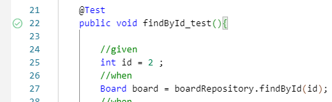
*그림 2-28. 테스트 실행 버튼*

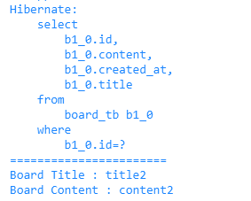
*그림 2-29. 한 건 조회 실행 결과*

전체 게시글 조회는 결과가 여러 개의 엔티티로 반환되므로, 이를 담기 위해 List 타입을 사용합니다. 테스트 메서드를 아래와 같이 작성합니다.

```java [실습 6] BoardRepositoryTest.java. 전체 조회
    @Test
    public void findAll_test() {
        // given

        // when
        List<Board> boards = boardRepository.findAll();
        // eye
        System.out.println("=======================");
        System.out.println("Board Count : " + boards.size());
        System.out.println("Board 1 title :" + boards.get(0).getTitle());
        System.out.println("Board 2 content :" + boards.get(1).getContent());
    }
```

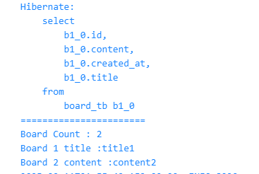
*그림 2-30. 전체 조회 실행 결과*

저장 테스트는 `save()`를 호출한 뒤, `findAll()`로 목록을 조회해 새 게시글이 추가되었는지 확인합니다. 테스트 메서드를 아래와 같이 작성합니다.

```java [실습 7] BoardRepositoryTest.java. 저장
    @Test
    public void save_test() {
        // given
        Board board = new Board();
        board.setTitle("title3");
        board.setContent("content3");
        // when
        boardRepository.save(board);
        // eye
        List<Board> boards = boardRepository.findAll();
        System.out.println("=======================");
        System.out.println("Board Count : " + boards.size());
        System.out.println("Board ID: " + boards.get(2).getId());
        System.out.println("Board Title: " + boards.get(2).getTitle());
        System.out.println("Board Content: " + boards.get(2).getContent());
    }
```

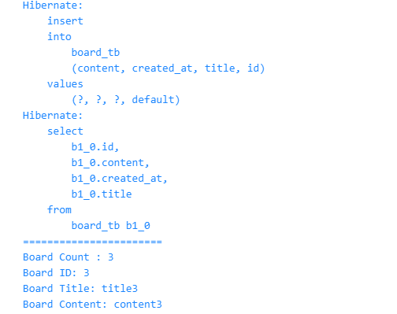
*그림 2-31. 저장 실행 결과*

수정 테스트에서는 update 메서드 없이 더티체킹으로 값을 수정합니다.

테스트는 트랜잭션이 끝나기 전에 결과를 확인하므로 `flush()`를 직접 호출해 데이터베이스에 반영해야 합니다. 그리고 `clear()`로 영속성 컨텍스트를 비운 뒤 데이터베이스에서 다시 조회합니다.

```java [실습 8] BoardRepositoryTest.java. 수정과 더티체킹
    @Test
    public void update_test() {
        // given
        int id = 2;
        // when
        Board board = boardRepository.findById(id);
        board.setTitle("title-update");
        board.setContent("Update-test");
        em.flush(); // 변경 내용을 데이터베이스에 강제로 반영한다
        em.clear(); // 영속성 컨텍스트를 강제로 비운다
        // eye
        Board result = boardRepository.findById(id);
        System.out.println("=======================");
        System.out.println("Board title : " + result.getTitle());
        System.out.println("Board content : " + result.getContent());
    }
```

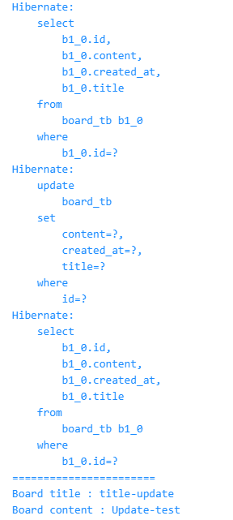
*그림 2-32. 수정 실행 결과*

게시글 삭제 테스트를 아래와 같이 작성합니다.

```java [실습 9] BoardRepositoryTest.java. 삭제
    @Test
    public void delete_test() {
        // given
        int id = 2;
        Board board = boardRepository.findById(id);
        // when
        boardRepository.delete(board);
        em.flush();
        // eye
        List<Board> boards = boardRepository.findAll();
        System.out.println("=======================");
        System.out.println("Board count : " + boards.size());
    }
```

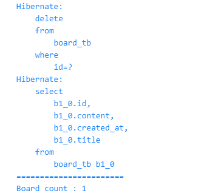
*그림 2-33. 삭제 실행 결과*

이렇게 단위 테스트로 리포지토리만 따로 검증하면 서버를 실행하지 않아도 기능이 의도대로 동작하는지 확인할 수 있습니다.

:::note
다음 챕터부터는 단위 테스트 코드를 다루지 않습니다. 하지만 각 챕터의 완성 코드에 테스트 코드가 준비되어 있으니 직접 실습해 볼 수 있습니다.
:::

## 2.10 게시글 목록

### 2.10.1 서비스

서비스 계층을 작성해 보겠습니다. 서비스는 컨트롤러와 리포지토리 사이에서 비즈니스 로직을 처리하며, 데이터 작업 시 리포지토리를 호출합니다. 게시글 목록은 따로 처리할 로직이 없어 리포지토리의 조회 결과를 그대로 반환합니다.

`board/BoardService.java`를 열어 아래와 같이 작성합니다.

```java [실습 10] board/BoardService.java. 게시글 목록
@RequiredArgsConstructor
@Service // 스프링이 빈으로 등록한다
public class BoardService {

    private final BoardRepository boardRepository; // 의존성 주입

    public List<Board> 게시글목록() {
        return boardRepository.findAll();
    }
}
```

### 2.10.2 컨트롤러

이어서 요청을 받을 컨트롤러를 작성합니다. 컨트롤러는 서비스를 주입받고, 서비스의 `게시글목록()`을 호출해 결과를 반환합니다.

`board/BoardController.java`를 열어 아래와 같이 작성합니다.

```java [실습 11] board/BoardController.java. 게시글 목록
@RequiredArgsConstructor
@RestController
@RequestMapping("/api/boards") // 공통 주소
public class BoardController {

    private final BoardService boardService; // 의존성 주입

    @GetMapping
    public ResponseEntity<?> findAll() {
        List<Board> responseBoardList = boardService.게시글목록();
        return Resp.ok(responseBoardList);
    }
}
```

### 2.10.3 API 요청

터미널에 아래의 명령어를 입력해 애플리케이션을 실행합니다.

```bash [터미널] 애플리케이션 실행
./gradlew bootRun
```

서버를 실행했으니, 이제 API를 호출해 잘 동작하는지 확인해 보겠습니다. 이 책에서는 브라우저에서 API를 호출하는 도구인 **Hoppscotch**(https://hoppscotch.io/)를 사용합니다.

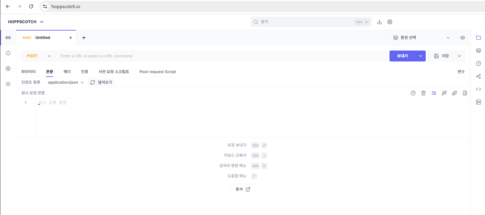
*그림 2-34. Hoppscotch 화면*

Hoppscotch는 브라우저 보안 때문에 localhost로 바로 요청을 보내지 못합니다. 그래서 요청을 대신 전달해 주는 **Hoppscotch Browser Extension**을 Chrome 웹 스토어에서 설치하고, **설정 > Interceptor**에서 확장 프로그램을 선택합니다.

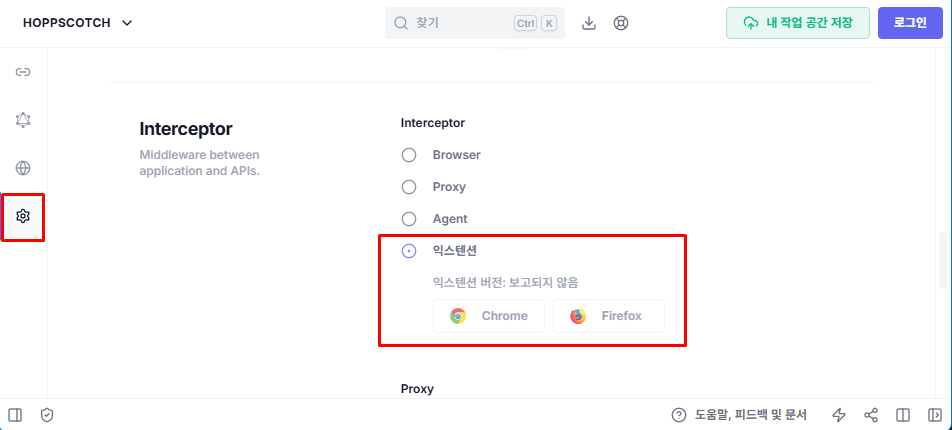
*그림 2-35. Browser Extension 인터셉터 설정*

확장 프로그램을 설치했다면 게시글 목록 API를 호출합니다.

```json [Hoppscotch] 게시글 목록 조회
GET http://localhost:8080/api/boards
```

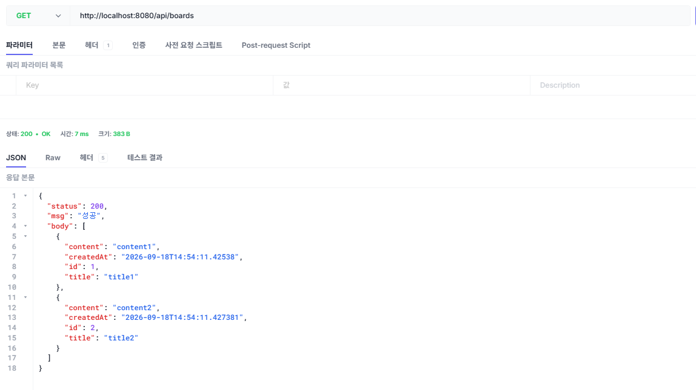
*그림 2-36. 게시글 목록 응답*

## 2.11 게시글 상세

### 2.11.1 서비스

게시글 상세 조회는 기본 키로 게시글 한 건을 가져옵니다. 서비스에서 리포지토리의 `findById()`를 호출하도록 `board/BoardService.java`의 `게시글상세()`를 아래와 같이 작성합니다.

```java [실습 12] board/BoardService.java. 게시글 상세
    public Board 게시글상세(Integer boardId) {
        return boardRepository.findById(boardId);
    }
```

### 2.11.2 컨트롤러

컨트롤러는 URL 경로에 포함된 게시글 번호를 추출하여 서비스로 전달합니다. 경로 변수인 `{boardId}` 값은 **@PathVariable**을 사용해 가져옵니다.

`board/BoardController.java`의 `findById()`를 아래와 같이 작성합니다.

```java [실습 13] board/BoardController.java. 게시글 상세
    @GetMapping("/{boardId}")
    public ResponseEntity<?> findById(@PathVariable("boardId") Integer boardId) {
        Board responseBoard = boardService.게시글상세(boardId);
        return Resp.ok(responseBoard);
    }
```

서버를 실행한 뒤 1번 게시글의 상세 조회 API를 호출합니다.

```json [Hoppscotch] 게시글 상세 조회
GET http://localhost:8080/api/boards/1
```

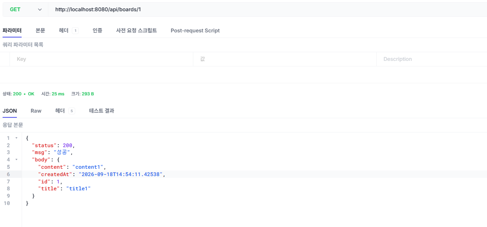
*그림 2-37. 게시글 상세 응답*

## 2.12 게시글 추가

### 2.12.1 서비스

게시글 추가는 데이터를 변경하는 작업입니다. 중간에 오류가 발생하더라도 데이터에 잘못 반영되지 않도록, 메서드 전체를 하나의 트랜잭션으로 묶어 처리합니다.

`board/BoardService.java`의 `게시글추가()`를 아래와 같이 작성합니다.

```java [실습 14] board/BoardService.java. 게시글 추가
    @Transactional
    public Board 게시글추가(Board requestBoard) {
        boardRepository.save(requestBoard);
        return requestBoard;
    }
```

**@Transactional**은 메서드가 실행되는 동안 트랜잭션을 열어 두었다가, 정상적으로 끝나면 변경 내용을 반영하고 중간에 예외가 발생하면 되돌립니다.

### 2.12.2 컨트롤러

클라이언트의 요청이 들어오면 디스패처 서블릿이 담당 컨트롤러 메서드를 찾아 호출합니다. 이때 매개변수에 **@RequestBody**가 있으면, 스프링이 요청 바디에 담긴 JSON 데이터를 자바 객체로 변환해 전달합니다.

`board/BoardController.java`의 `save()`를 아래와 같이 작성합니다.

```java [실습 15] board/BoardController.java. 게시글 추가
    @PostMapping
    public ResponseEntity<?> save(@RequestBody Board requestBoard) {
        Board responseBoard = boardService.게시글추가(requestBoard);
        return Resp.ok(responseBoard);
    }
```

컨트롤러는 서비스가 저장한 게시글을 응답합니다.

:::tip
**POST와 PUT의 응답**

데이터를 생성(POST)하거나 수정(PUT)할 때 응답 바디로 결과를 돌려주는 이유는, 추가적인 서버 요청 없이 화면을 즉시 갱신하기 위해서입니다.

예를 들어 게시글을 작성했을 때 처리 결과를 돌려주지 않으면, 변경된 내용을 확인하기 위해 사용자가 직접 새로고침을 하거나 서버에 데이터를 다시 요청해야 합니다. 반면 완성된 데이터를 바로 응답받으면 추가적인 통신 없이 화면을 업데이트할 수 있습니다.

결과적으로 불필요한 네트워크 낭비를 막고 사용자 경험을 높이기 위해 데이터를 응답하는 것이 좋습니다.
:::

Hoppscotch의 본문 탭에서 컨텐츠 종류를 application/json으로 선택한 뒤, 제목과 내용을 담아 게시글 추가 API를 호출합니다.

```json [Hoppscotch] 게시글 추가
POST http://localhost:8080/api/boards

{
  "title": "title3",
  "content": "content3"
}
```

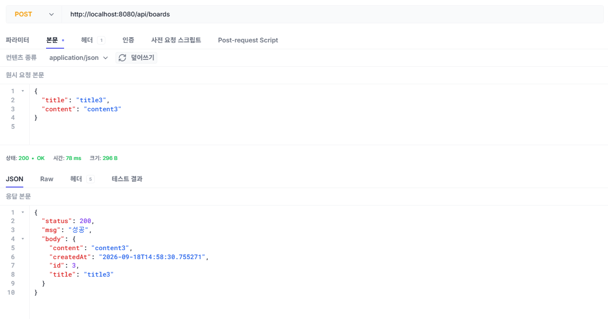
*그림 2-38. 게시글 추가 응답*

## 2.13 게시글 수정

### 2.13.1 서비스

`게시글수정()`은 URL에 담긴 게시글 번호와 요청 바디로 들어온 값을 함께 전달받습니다.

`board/BoardService.java`의 `게시글수정()`을 아래와 같이 작성합니다.

```java [실습 16] board/BoardService.java. 더티체킹으로 수정
    @Transactional
    public Board 게시글수정(Integer boardId, Board requestBoard) {
        // 1. 수정할 게시글을 조회해 영속 상태로 가져온다
        Board board = boardRepository.findById(boardId);
        // 2. 데이터 수정
        board.setTitle(requestBoard.getTitle());
        board.setContent(requestBoard.getContent());
        return board;
    } // 트랜잭션이 끝나는 이 지점에서 변경이 반영된다
```

값만 변경해도 트랜잭션이 끝나는 시점에 더티체킹이 동작해 변경된 내용을 데이터베이스에 반영합니다.

### 2.13.2 컨트롤러

`board/BoardController.java`의 `update()`를 아래와 같이 작성합니다.

```java [실습 17] board/BoardController.java. 게시글 수정
    @PutMapping("/{boardId}")
    public ResponseEntity<?> update(@PathVariable("boardId") Integer boardId,
                                    @RequestBody Board requestBoard) {
        Board responseBoard = boardService.게시글수정(boardId, requestBoard);
        return Resp.ok(responseBoard);
    }
```

바꿀 제목과 내용을 요청 바디에 담아 1번 게시글의 수정 API를 호출합니다.

```json [Hoppscotch] 게시글 수정
PUT http://localhost:8080/api/boards/1

{
  "title": "title-update",
  "content": "content-update"
}
```

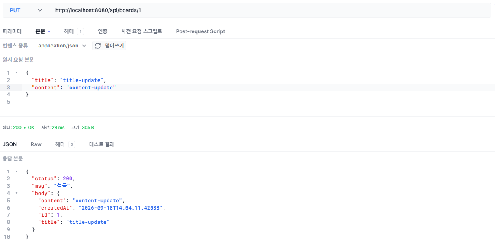
*그림 2-39. 게시글 수정 응답*

## 2.14 게시글 삭제

### 2.14.1 서비스

`게시글삭제()`는 삭제할 게시글을 먼저 조회한 뒤, 조회한 엔티티를 리포지토리에 전달합니다.

`board/BoardService.java`의 `게시글삭제()`를 아래와 같이 작성합니다.

```java [실습 18] board/BoardService.java. 게시글 삭제
    @Transactional
    public void 게시글삭제(Integer boardId) {
        Board board = boardRepository.findById(boardId);
        boardRepository.delete(board);
    }
```

### 2.14.2 컨트롤러

`board/BoardController.java`의 `deleteById()`를 아래와 같이 작성합니다.

```java [실습 19] board/BoardController.java. 게시글 삭제
    @DeleteMapping("/{boardId}")
    public ResponseEntity<?> deleteById(@PathVariable("boardId") Integer boardId) {
        boardService.게시글삭제(boardId);
        return Resp.ok(null);
    }
```

삭제는 반환할 데이터가 없으므로 `Resp.ok(null)`로 성공 응답만 반환합니다.

1번 게시글의 삭제 API를 호출합니다.

```json [Hoppscotch] 게시글 삭제
DELETE http://localhost:8080/api/boards/1
```

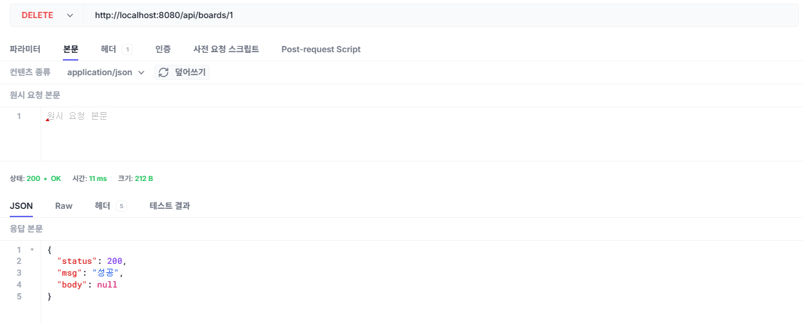
*그림 2-40. 게시글 삭제 응답*

실습이 끝난 서버는 종료합니다.

스프링 프레임워크의 웹 계층 구조를 활용해 게시판의 기본 기능을 완성했습니다. 데이터베이스와 통신하는 리포지토리, 비즈니스 로직을 처리하는 서비스, 클라이언트의 요청을 받는 컨트롤러까지, 스프링의 구성 요소들이 어떻게 하나의 애플리케이션으로 동작하는지 확인해 보았습니다.

다음 챕터에서는 클라이언트와 주고받을 데이터를 DTO로 분리하여 구조를 개선하고, 잘못된 조회 요청에 대비한 예외 처리를 다룹니다.

:::remember
**이것만은 기억하자**

- **JPA는 객체와 테이블 사이를 연결합니다.** 엔티티를 저장·조회·수정·삭제하면 JPA가 알맞은 SQL을 생성해 실행하고, 조회한 데이터는 다시 엔티티에 담아 반환합니다.
- **영속성 컨텍스트는 조회한 엔티티를 트랜잭션 동안 관리합니다.** 같은 엔티티를 다시 조회하면 캐시에 있는 것을 반환하고, 변경 쿼리는 버퍼에 모았다가 `flush()` 시점에 내보냅니다.
- **애플리케이션은 컨트롤러, 서비스, 리포지토리 세 계층으로 나눕니다.** 컨트롤러는 요청을 받고, 서비스는 트랜잭션 내에서 비즈니스 로직을 처리하며, 리포지토리는 데이터베이스를 다룹니다.
:::