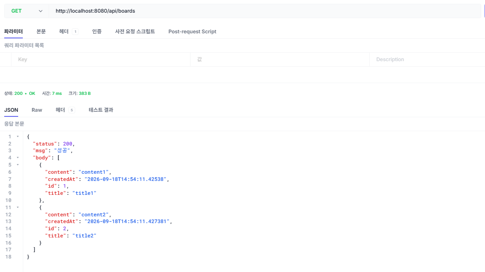

# 챕터 2. 게시판 CRUD - 글을 저장하고 불러온다

리플렉션으로 스프링이 내 메서드를 찾아 실행하는 원리까지 봤습니다. 하지만 지금까지 만든 것은 콘솔에 글자를 찍는 컨트롤러뿐입니다. 진짜 게시판이라면 글을 어딘가에 저장하고, 목록과 상세를 불러오고, 수정하고 지울 수 있어야 합니다.

**동료**: "리플렉션은 알겠는데, 글은 실제로 어디에 저장하고 어떻게 주고받아요?"

이제 콘솔이 아니라 데이터베이스에 글을 저장하고 꺼내 주는 서버를 만들 차례입니다.

게시판을 만든다고 하면 보통 글을 쓰는 화면부터 떠올립니다. 그런데 요즘 서버는 화면을 직접 그리지 않습니다. 글이라는 데이터를 저장하고 꺼내 주는 일만 맡고, 화면은 그 데이터를 받아 프론트엔드가 그립니다. 화면을 받는 쪽이 브라우저 하나가 아니라 스마트폰 앱, TV, 다른 서버까지 늘어났기 때문입니다. 그래서 이번 챕터에서 만들 것은 눈에 보이는 페이지가 아니라, 글이라는 자원을 다루는 서버입니다.

서버가 데이터만 주고받도록 정해 둔 규칙을 REST라고 부릅니다. 이 규칙 위에서 글을 쓰면 저장되고, 목록을 부르면 지금까지 쓴 글이 돌아오는 게시판 API를 만듭니다.

<div class="svg-figure">
<svg viewBox="0 0 1000 400" xmlns="http://www.w3.org/2000/svg" role="img" aria-label="챕터 2 한눈에 보기. 클라이언트가 게시글에 대한 다섯 가지 요청(목록·상세·작성·수정·삭제)을 컨트롤러로 보내면, 컨트롤러가 서비스로, 서비스가 리포지토리로 넘기고, 리포지토리가 H2 데이터베이스의 board_tb 테이블을 다룬 뒤 결과가 JSON으로 되돌아온다.">
  <defs>
    <marker id="c2ov-i" markerWidth="10" markerHeight="10" refX="8" refY="3" orient="auto"><path d="M0,0 L0,6 L8,3 z" fill="#4f46e5"/></marker>
    <marker id="c2ov-b" markerWidth="10" markerHeight="10" refX="8" refY="3" orient="auto"><path d="M0,0 L0,6 L8,3 z" fill="#94a3b8"/></marker>
  </defs>
  <text x="500" y="30" text-anchor="middle" font-size="17" font-weight="700" fill="#0f172a">챕터 2 한눈에 보기 - 요청 하나가 게시글이 되기까지</text>
  <rect x="30" y="70" width="210" height="250" rx="10" fill="#fff" stroke="#475569" stroke-width="1.6"/>
  <text x="135" y="98" text-anchor="middle" font-size="14" font-weight="800" fill="#0f172a">클라이언트</text>
  <text x="135" y="117" text-anchor="middle" font-size="11" fill="#6b7280">게시글 요청 5가지</text>
  <rect x="48" y="130" width="174" height="30" rx="5" fill="#fff" stroke="#cbd5e1" stroke-width="1.2"/>
  <text x="135" y="149" text-anchor="middle" font-size="11" fill="#334155">GET /api/boards · 목록</text>
  <rect x="48" y="166" width="174" height="30" rx="5" fill="#fff" stroke="#cbd5e1" stroke-width="1.2"/>
  <text x="135" y="185" text-anchor="middle" font-size="11" fill="#334155">GET /api/boards/{id} · 상세</text>
  <rect x="48" y="202" width="174" height="30" rx="5" fill="#fff" stroke="#cbd5e1" stroke-width="1.2"/>
  <text x="135" y="221" text-anchor="middle" font-size="11" fill="#334155">POST /api/boards · 작성</text>
  <rect x="48" y="238" width="174" height="30" rx="5" fill="#fff" stroke="#cbd5e1" stroke-width="1.2"/>
  <text x="135" y="257" text-anchor="middle" font-size="11" fill="#334155">PUT /api/boards/{id} · 수정</text>
  <rect x="48" y="274" width="174" height="30" rx="5" fill="#fff" stroke="#cbd5e1" stroke-width="1.2"/>
  <text x="135" y="293" text-anchor="middle" font-size="11" fill="#334155">DELETE /api/boards/{id} · 삭제</text>
  <rect x="300" y="150" width="150" height="90" rx="8" fill="#eef2ff" stroke="#4f46e5" stroke-width="1.8"/>
  <text x="375" y="188" text-anchor="middle" font-size="13" font-weight="800" fill="#3730a3">컨트롤러</text>
  <text x="375" y="210" text-anchor="middle" font-size="11" fill="#3730a3">@RestController</text>
  <rect x="490" y="150" width="140" height="90" rx="8" fill="#fff" stroke="#475569" stroke-width="1.6"/>
  <text x="560" y="188" text-anchor="middle" font-size="13" font-weight="700" fill="#0f172a">서비스</text>
  <text x="560" y="210" text-anchor="middle" font-size="11" fill="#6b7280">@Service</text>
  <rect x="670" y="150" width="150" height="90" rx="8" fill="#fff" stroke="#475569" stroke-width="1.6"/>
  <text x="745" y="188" text-anchor="middle" font-size="13" font-weight="700" fill="#0f172a">리포지토리</text>
  <text x="745" y="210" text-anchor="middle" font-size="11" fill="#6b7280">@Repository</text>
  <rect x="860" y="160" width="120" height="70" rx="8" fill="#fff" stroke="#475569" stroke-width="1.6"/>
  <text x="920" y="190" text-anchor="middle" font-size="13" font-weight="700" fill="#0f172a">H2</text>
  <text x="920" y="210" text-anchor="middle" font-size="11" fill="#6b7280">board_tb</text>
  <line x1="240" y1="185" x2="298" y2="185" stroke="#4f46e5" stroke-width="1.8" marker-end="url(#c2ov-i)"/>
  <line x1="450" y1="185" x2="488" y2="185" stroke="#4f46e5" stroke-width="1.8" marker-end="url(#c2ov-i)"/>
  <line x1="630" y1="185" x2="668" y2="185" stroke="#4f46e5" stroke-width="1.8" marker-end="url(#c2ov-i)"/>
  <line x1="820" y1="185" x2="858" y2="185" stroke="#4f46e5" stroke-width="1.8" marker-end="url(#c2ov-i)"/>
  <line x1="858" y1="212" x2="822" y2="212" stroke="#94a3b8" stroke-width="1.5" marker-end="url(#c2ov-b)"/>
  <line x1="668" y1="212" x2="632" y2="212" stroke="#94a3b8" stroke-width="1.5" marker-end="url(#c2ov-b)"/>
  <line x1="488" y1="212" x2="452" y2="212" stroke="#94a3b8" stroke-width="1.5" marker-end="url(#c2ov-b)"/>
  <line x1="298" y1="212" x2="242" y2="212" stroke="#94a3b8" stroke-width="1.5" marker-end="url(#c2ov-b)"/>
  <text x="560" y="300" text-anchor="middle" font-size="11" fill="#94a3b8">회색 화살표: 결과가 JSON(Resp)으로 되돌아오는 길</text>
</svg>
</div>

*그림 2-1. 게시글 요청 하나가 컨트롤러, 서비스, 리포지토리를 거쳐 H2까지 전달되고, 결과가 JSON으로 되돌아옵니다*

이 그림의 왼쪽 다섯 줄이 이번 챕터에서 만들 게시판 API 전부입니다. 오른쪽 세 층은 요청이 지나가는 통로로, 하나씩 직접 만들며 채워 나갑니다.

:::goal
**이번 챕터가 끝나면**

- REST API가 무엇이고, 게시판을 왜 자원으로 다루는지 이해합니다
- 객체와 테이블이라는 두 세계의 불일치를 JPA가 어떻게 잇는지, 영속성 컨텍스트의 캐싱·쓰기 지연·더티체킹이 무엇인지 설명할 수 있습니다
- 엔티티, 리포지토리, 서비스, 컨트롤러를 직접 만들어 글을 저장하고 불러오는 API를 완성하고, 단위 테스트로 검증합니다
:::

## 2.1 우리가 만들 건 REST API다

REST가 왜 지금의 방식이 됐는지 잠깐 거슬러 올라가 보겠습니다. 초창기 웹 서버는 미리 만들어 둔 문서나 이미지 같은 정적 자원을 그대로 돌려주는 일만 했습니다. 이후 인터넷이 커지면서 서버는 요청에 따라 그때그때 내용을 만들어 응답하는 WAS(Web Application Server)로 발전했습니다. 이 시절 서버가 돌려주는 것은 브라우저가 해석하는 완성된 HTML 화면이었습니다.

문제는 화면을 받는 쪽이 브라우저 하나가 아니게 됐다는 점입니다. 스마트폰 앱, TV, 다른 서버까지 같은 데이터를 요청하기 시작했습니다. 이들에게 HTML 화면을 통째로 넘기는 것은 맞지 않습니다. 그래서 서버는 화면 대신 데이터만, 그것도 어떤 기기든 해석할 수 있는 형식으로 넘기는 방향으로 바뀌었습니다. 그 형식이 JSON입니다.

<div class="svg-figure">
<svg viewBox="0 0 1000 320" xmlns="http://www.w3.org/2000/svg" role="img" aria-label="REST가 자리 잡기까지의 흐름. 왼쪽 정적 자원의 시대에는 서버가 문서와 이미지를 브라우저에만 돌려준다. 가운데 동적 응답 WAS 시대에는 서버가 요청마다 HTML 화면을 만들어 브라우저에 돌려준다. 오른쪽 REST API 시대에는 서버가 JSON 데이터를 돌려주고, 브라우저뿐 아니라 스마트폰, TV, 다른 서버까지 같은 데이터를 받는다.">
  <defs>
    <marker id="c2rest-a" markerWidth="10" markerHeight="10" refX="8" refY="3" orient="auto"><path d="M0,0 L0,6 L8,3 z" fill="#4f46e5"/></marker>
  </defs>
  <text x="500" y="28" text-anchor="middle" font-size="16" font-weight="800" fill="#0f172a">REST가 자리 잡기까지</text>
  <rect x="24" y="52" width="286" height="230" rx="10" fill="#fff" stroke="#cbd5e1" stroke-width="1.6"/>
  <text x="167" y="78" text-anchor="middle" font-size="13" font-weight="800" fill="#0f172a">정적 자원의 시대</text>
  <rect x="52" y="100" width="90" height="46" rx="6" fill="#fff" stroke="#475569" stroke-width="1.5"/>
  <text x="97" y="128" text-anchor="middle" font-size="12" font-weight="700" fill="#0f172a">서버</text>
  <rect x="192" y="100" width="90" height="46" rx="6" fill="#fff" stroke="#94a3b8" stroke-width="1.3"/>
  <text x="237" y="122" text-anchor="middle" font-size="11" fill="#334155">브라우저</text>
  <text x="237" y="138" text-anchor="middle" font-size="10" fill="#6b7280">문서·이미지</text>
  <line x1="142" y1="123" x2="190" y2="123" stroke="#4f46e5" stroke-width="1.6" marker-end="url(#c2rest-a)"/>
  <text x="167" y="200" text-anchor="middle" font-size="11" fill="#6b7280">미리 만든 파일을</text>
  <text x="167" y="218" text-anchor="middle" font-size="11" fill="#6b7280">그대로 돌려준다</text>
  <rect x="356" y="52" width="286" height="230" rx="10" fill="#fff" stroke="#cbd5e1" stroke-width="1.6"/>
  <text x="499" y="78" text-anchor="middle" font-size="13" font-weight="800" fill="#0f172a">동적 응답 (WAS)</text>
  <rect x="384" y="100" width="90" height="46" rx="6" fill="#fff" stroke="#475569" stroke-width="1.5"/>
  <text x="429" y="122" text-anchor="middle" font-size="12" font-weight="700" fill="#0f172a">서버</text>
  <text x="429" y="138" text-anchor="middle" font-size="10" fill="#6b7280">HTML 생성</text>
  <rect x="524" y="100" width="90" height="46" rx="6" fill="#fff" stroke="#94a3b8" stroke-width="1.3"/>
  <text x="569" y="122" text-anchor="middle" font-size="11" fill="#334155">브라우저</text>
  <text x="569" y="138" text-anchor="middle" font-size="10" fill="#6b7280">화면</text>
  <line x1="474" y1="123" x2="522" y2="123" stroke="#4f46e5" stroke-width="1.6" marker-end="url(#c2rest-a)"/>
  <text x="499" y="200" text-anchor="middle" font-size="11" fill="#6b7280">요청마다 화면을</text>
  <text x="499" y="218" text-anchor="middle" font-size="11" fill="#6b7280">만들어 돌려준다</text>
  <rect x="688" y="52" width="288" height="230" rx="10" fill="#eef2ff" stroke="#4f46e5" stroke-width="1.8"/>
  <text x="832" y="78" text-anchor="middle" font-size="13" font-weight="800" fill="#3730a3">REST API (JSON)</text>
  <rect x="710" y="100" width="80" height="46" rx="6" fill="#fff" stroke="#4f46e5" stroke-width="1.6"/>
  <text x="750" y="122" text-anchor="middle" font-size="12" font-weight="700" fill="#3730a3">서버</text>
  <text x="750" y="138" text-anchor="middle" font-size="10" fill="#3730a3">JSON</text>
  <rect x="852" y="92" width="104" height="26" rx="5" fill="#fff" stroke="#94a3b8" stroke-width="1.2"/>
  <text x="904" y="109" text-anchor="middle" font-size="10" fill="#334155">브라우저</text>
  <rect x="852" y="124" width="104" height="26" rx="5" fill="#fff" stroke="#94a3b8" stroke-width="1.2"/>
  <text x="904" y="141" text-anchor="middle" font-size="10" fill="#334155">스마트폰</text>
  <rect x="852" y="156" width="104" height="26" rx="5" fill="#fff" stroke="#94a3b8" stroke-width="1.2"/>
  <text x="904" y="173" text-anchor="middle" font-size="10" fill="#334155">TV · 다른 서버</text>
  <line x1="790" y1="123" x2="850" y2="107" stroke="#4f46e5" stroke-width="1.6" marker-end="url(#c2rest-a)"/>
  <line x1="790" y1="130" x2="850" y2="140" stroke="#4f46e5" stroke-width="1.6" marker-end="url(#c2rest-a)"/>
  <line x1="790" y1="137" x2="850" y2="167" stroke="#4f46e5" stroke-width="1.6" marker-end="url(#c2rest-a)"/>
  <text x="832" y="212" text-anchor="middle" font-size="11" font-weight="700" fill="#3730a3">데이터만 넘기면</text>
  <text x="832" y="230" text-anchor="middle" font-size="11" font-weight="700" fill="#3730a3">어떤 기기든 받는다</text>
</svg>
</div>

*그림 2-2. 정적 자원을 돌려주던 서버가 화면을 만들어 주는 WAS를 거쳐, 데이터만 JSON으로 넘기는 REST API로 발전했습니다*

우리가 만들 서버도 화면을 돌려주지 않고 글 데이터를 JSON 형식으로 주고받습니다. JSON(JavaScript Object Notation)은 데이터를 키와 값의 쌍으로 표현하는, 사람이 읽기 쉬운 텍스트 형식입니다. 게시글 하나는 이런 모습입니다.

```json
{
  "id": 1,
  "title": "첫 번째 글",
  "content": "안녕하세요"
}
```

이렇게 자원을 정해진 방식으로 주고받도록 약속한 설계 방식을 REST(Representational State Transfer)라고 합니다. REST에서는 게시글, 회원, 댓글처럼 다루려는 대상을 자원(Resource)이라고 부르고, 각 자원을 주소(URI)로 가리킵니다. 게시글이라는 자원은 `/api/boards`라는 주소가 됩니다.

같은 주소를 두고도 무엇을 하고 싶은지는 HTTP 메서드로 구분합니다. 택배를 보낼 때 같은 상자라도 송장에 배송인지 반품인지 적어 구분하듯, 게시글이라는 같은 자원이라도 조회할 때와 저장할 때 붙이는 메서드가 다릅니다.

| 메서드 | 하는 일 | 예 |
|--------|---------|-----|
| GET | 조회한다 | 게시글 목록을 가져온다 |
| POST | 새로 만든다 | 게시글을 작성한다 |
| PUT | 수정한다 | 게시글 내용을 고친다 |
| DELETE | 삭제한다 | 게시글을 지운다 |

게시판에 필요한 동작이 이 네 가지에 그대로 들어맞습니다. 새로 쓰고(Create), 읽고(Read), 고치고(Update), 지우는(Delete) 네 동작을 앞 글자만 따 CRUD라고 부릅니다. 이번 챕터에서 만들 것이 게시글의 CRUD API입니다.

주소를 짓는 데도 몇 가지 약속이 있습니다. 뒤에서 실제로 주소를 붙일 때 이 규칙을 따르게 됩니다.

| 규칙 | 권장 | 피할 것 |
|------|------|---------|
| 소문자로 쓴다 | `/boards` | `/Boards` |
| 행위는 메서드로 표현한다 | `PUT /boards/1` | `/boards/1/put` |
| 자원은 복수형으로 쓴다 | `/boards/1` | `/board/1` |
| 긴 단어는 하이픈으로 잇는다 | `/check-username` | `/check_username` |
| 확장자를 붙이지 않는다 | `/users` | `/users.json` |

## 2.2 소스코드 준비

::::prep
**소스코드 준비**

앞 챕터에서 클론한 예제 저장소에서 이번 챕터 폴더로 이동합니다. 여기서부터는 순수 자바가 아니라 스프링 부트 프로젝트입니다.

```bash [터미널] 챕터 2 폴더로 이동
cd spring-start/ch02
```

`ch02` 폴더는 다음과 같이 구성되어 있습니다. 패키지 루트는 `com.metacoding.spring`입니다.

```
spring-start/ch02  (com.metacoding.spring)
├── board/Board.java                  [실습] 엔티티
├── board/BoardRepository.java        [실습] EntityManager로 CRUD
├── board/BoardService.java           [실습] 3계층 + 더티체킹
├── board/BoardController.java        [실습] REST 엔드포인트 5개
├── board/BoardRequest.java           [실습] SaveDTO/UpdateDTO
├── core/util/Resp.java               [참고] 공통 응답 래퍼
├── resources/application.properties  [참고] H2·JPA 설정
├── resources/db/data.sql             [참고] 더미 데이터
└── test/.../BoardRepositoryTest.java [실습] 단위 테스트
```

핵심 로직 자리는 비어 있습니다. 챕터를 따라 코드를 채우고, 막히면 `spring-end`의 완성 코드를 참고하세요.
::::

이 파일들이 앞의 한눈에 보기 그림에서 본 세 층을 이룹니다. 각 클래스가 맡는 역할은 다음과 같습니다.

| 클래스 | 역할 |
|--------|------|
| Board | 게시글 한 건을 표현하는 엔티티. `board_tb` 테이블의 한 행과 매핑됩니다. |
| BoardRepository | EntityManager로 게시글을 저장하고 조회하고 삭제합니다. |
| BoardService | 목록, 상세, 작성, 수정, 삭제의 처리 흐름을 맡습니다. |
| BoardController | REST 요청을 받아 서비스로 넘기는 입구입니다. |
| BoardRequest | 작성과 수정 요청 데이터를 담는 DTO(SaveDTO, UpdateDTO)입니다. |
| Resp | 모든 응답을 `{status, msg, body}` 한 가지 모양으로 통일하는 공통 래퍼입니다. |

파일을 채우기 전에, 스프링이 데이터베이스를 어떻게 다루는지부터 짚어야 합니다. 저장한 글은 결국 데이터베이스의 한 줄로 남지만, 자바 코드가 다루는 것은 `Board`라는 객체입니다. 이 둘 사이에는 생각보다 큰 간격이 있습니다.

## 2.3 두 세계의 불일치와 하이버네이트

소프트웨어를 만들 때 개발자는 서로 다른 철학을 가진 두 세계를 동시에 마주합니다. 데이터의 정확성을 지키려는 관계형 데이터베이스와, 현실의 복잡함을 표현하려는 객체지향 언어입니다.

데이터베이스의 목표는 데이터를 안전하게 보관하고 빠르게 꺼내는 것입니다. 그래서 모든 데이터를 행과 열로 이루어진 평평한 표에 값으로만 담습니다. 다른 표를 가리키려면 외래 키(Foreign Key)라는 값을 공유해 조인으로 이어 붙일 뿐, 표 안에 다른 표를 통째로 넣지는 못합니다. 상속 같은 개념도 없습니다. 반면 자바는 현실의 사물을 객체로 다룹니다. 객체는 값뿐 아니라 행동(메서드)을 가지고, 다른 객체를 필드로 품어 참조(Reference)로 서로를 가리킵니다. 같은 관계를 두고도 한쪽은 값으로 잇고, 다른 쪽은 참조로 품습니다.

<div class="svg-figure">
<svg viewBox="0 0 900 340" xmlns="http://www.w3.org/2000/svg" role="img" aria-label="객체 세계와 DB 세계의 연결 방식 차이. 왼쪽 객체 세계에서는 주문 객체가 회원 객체를 필드로 참조한다. 오른쪽 DB 세계에서는 주문 테이블과 회원 테이블이 각각 따로 있고, user_id라는 값으로 조인해서 이어 붙인다.">
  <defs>
    <marker id="c2two-a" markerWidth="10" markerHeight="10" refX="8" refY="3" orient="auto"><path d="M0,0 L0,6 L8,3 z" fill="#4f46e5"/></marker>
    <marker id="c2two-b" markerWidth="10" markerHeight="10" refX="8" refY="3" orient="auto"><path d="M0,0 L0,6 L8,3 z" fill="#c2410c"/></marker>
  </defs>
  <rect x="30" y="40" width="380" height="280" rx="12" fill="#f8fafc" stroke="#4f46e5" stroke-width="1.6" stroke-dasharray="6,4"/>
  <text x="220" y="70" text-anchor="middle" font-size="14" font-weight="800" fill="#3730a3">객체 세계 · 참조로 품는다</text>
  <rect x="140" y="92" width="160" height="60" rx="8" fill="#eef2ff" stroke="#4f46e5" stroke-width="1.8"/>
  <text x="220" y="122" text-anchor="middle" font-size="13" font-weight="800" fill="#3730a3">주문 객체</text>
  <text x="220" y="140" text-anchor="middle" font-size="10" fill="#334155">member 필드를 가진다</text>
  <rect x="140" y="232" width="160" height="60" rx="8" fill="#eef2ff" stroke="#4f46e5" stroke-width="1.8"/>
  <text x="220" y="268" text-anchor="middle" font-size="13" font-weight="800" fill="#3730a3">회원 객체</text>
  <line x1="220" y1="152" x2="220" y2="230" stroke="#4f46e5" stroke-width="1.8" marker-end="url(#c2two-a)"/>
  <text x="300" y="196" text-anchor="middle" font-size="11" fill="#3730a3">필드로 참조</text>
  <rect x="490" y="40" width="380" height="280" rx="12" fill="#fff" stroke="#ff7849" stroke-width="1.6" stroke-dasharray="6,4"/>
  <text x="680" y="70" text-anchor="middle" font-size="14" font-weight="800" fill="#c2410c">DB 세계 · 값으로 잇는다</text>
  <rect x="600" y="92" width="160" height="60" rx="8" fill="#fff" stroke="#ff7849" stroke-width="1.8"/>
  <text x="680" y="118" text-anchor="middle" font-size="13" font-weight="800" fill="#c2410c">주문 테이블</text>
  <text x="680" y="138" text-anchor="middle" font-size="10" fill="#475569">user_id 칸을 가진다</text>
  <rect x="600" y="232" width="160" height="60" rx="8" fill="#fff" stroke="#ff7849" stroke-width="1.8"/>
  <text x="680" y="268" text-anchor="middle" font-size="13" font-weight="800" fill="#c2410c">회원 테이블</text>
  <line x1="680" y1="152" x2="680" y2="230" stroke="#c2410c" stroke-width="1.8" marker-end="url(#c2two-b)"/>
  <text x="763" y="196" text-anchor="middle" font-size="11" fill="#c2410c">user_id 값으로 조인</text>
</svg>
</div>

*그림 2-3. 같은 관계라도 객체 세계는 다른 객체를 필드로 참조하고, DB 세계는 외래 키 값으로 조인해 잇습니다*

이 차이는 햄버거 세트로 보면 분명해집니다. 자바에서는 `햄버거세트` 객체 하나가 `햄버거`, `콜라`, `감자` 객체를 품습니다(has-a). 세트 하나만 들면 그 안의 내용물을 바로 꺼낼 수 있습니다. 데이터베이스는 그렇게 못 합니다. 세트라는 상자 안에 음식을 넣지 못하므로, 햄버거 표, 콜라 표, 감자 표를 따로 만들어 두고 외래 키로 "우린 같은 세트야"라고 값으로 연결만 해 둡니다. 하나로 품는 세계와 값으로 나눠 잇는 세계, 이 어긋남이 두 세계의 근본적인 불일치입니다.

<div class="svg-figure">
<svg viewBox="0 0 1000 380" xmlns="http://www.w3.org/2000/svg" role="img" aria-label="햄버거 세트로 본 두 세계의 불일치. 왼쪽 자바 세계에서는 햄버거 세트 객체 하나가 햄버거, 콜라, 감자를 has-a 관계로 품는다. 오른쪽 DB 세계에서는 햄버거 테이블, 콜라 테이블, 감자 테이블이 따로 있고 각각 외래 키로 세트 테이블에 연결된다. 가운데 하이버네이트가 두 세계를 잇는다.">
  <defs>
    <marker id="c2burger-a" markerWidth="10" markerHeight="10" refX="8" refY="3" orient="auto"><path d="M0,0 L0,6 L8,3 z" fill="#4f46e5"/></marker>
    <marker id="c2burger-b" markerWidth="10" markerHeight="10" refX="8" refY="3" orient="auto"><path d="M0,0 L0,6 L8,3 z" fill="#ff7849"/></marker>
    <marker id="c2burger-h" markerWidth="11" markerHeight="11" refX="9" refY="3.5" orient="auto"><path d="M0,0 L0,7 L9,3.5 z" fill="#475569"/></marker>
  </defs>
  <rect x="20" y="40" width="330" height="320" rx="12" fill="#f8fafc" stroke="#4f46e5" stroke-width="1.6" stroke-dasharray="6,4"/>
  <text x="185" y="66" text-anchor="middle" font-size="13" font-weight="800" fill="#3730a3">자바 세계 · has-a</text>
  <rect x="95" y="82" width="180" height="46" rx="8" fill="#eef2ff" stroke="#4f46e5" stroke-width="1.8"/>
  <text x="185" y="110" text-anchor="middle" font-size="12" font-weight="800" fill="#3730a3">햄버거 세트 객체</text>
  <rect x="60" y="230" width="80" height="44" rx="7" fill="#fff" stroke="#4f46e5" stroke-width="1.5"/>
  <text x="100" y="257" text-anchor="middle" font-size="12" fill="#3730a3">햄버거</text>
  <rect x="145" y="230" width="80" height="44" rx="7" fill="#fff" stroke="#4f46e5" stroke-width="1.5"/>
  <text x="185" y="257" text-anchor="middle" font-size="12" fill="#3730a3">콜라</text>
  <rect x="230" y="230" width="80" height="44" rx="7" fill="#fff" stroke="#4f46e5" stroke-width="1.5"/>
  <text x="270" y="257" text-anchor="middle" font-size="12" fill="#3730a3">감자</text>
  <line x1="170" y1="128" x2="105" y2="228" stroke="#4f46e5" stroke-width="1.6" marker-end="url(#c2burger-a)"/>
  <line x1="185" y1="128" x2="185" y2="228" stroke="#4f46e5" stroke-width="1.6" marker-end="url(#c2burger-a)"/>
  <line x1="200" y1="128" x2="265" y2="228" stroke="#4f46e5" stroke-width="1.6" marker-end="url(#c2burger-a)"/>
  <text x="185" y="320" text-anchor="middle" font-size="11" fill="#6b7280">세트 하나에 다 품는다</text>
  <rect x="400" y="150" width="200" height="80" rx="10" fill="#fff" stroke="#475569" stroke-width="1.8"/>
  <text x="500" y="180" text-anchor="middle" font-size="13" font-weight="800" fill="#0f172a">하이버네이트</text>
  <text x="500" y="204" text-anchor="middle" font-size="11" fill="#475569">중간에서 일치시킨다</text>
  <line x1="352" y1="190" x2="398" y2="190" stroke="#475569" stroke-width="1.8" marker-start="url(#c2burger-h)" marker-end="url(#c2burger-h)"/>
  <line x1="602" y1="190" x2="648" y2="190" stroke="#475569" stroke-width="1.8" marker-start="url(#c2burger-h)" marker-end="url(#c2burger-h)"/>
  <rect x="650" y="40" width="330" height="320" rx="12" fill="#fff" stroke="#ff7849" stroke-width="1.6" stroke-dasharray="6,4"/>
  <text x="815" y="66" text-anchor="middle" font-size="13" font-weight="800" fill="#c2410c">DB 세계 · 외래 키</text>
  <rect x="672" y="92" width="90" height="44" rx="7" fill="#fff" stroke="#ff7849" stroke-width="1.5"/>
  <text x="717" y="119" text-anchor="middle" font-size="11" fill="#c2410c">햄버거 표</text>
  <rect x="770" y="92" width="90" height="44" rx="7" fill="#fff" stroke="#ff7849" stroke-width="1.5"/>
  <text x="815" y="119" text-anchor="middle" font-size="11" fill="#c2410c">콜라 표</text>
  <rect x="868" y="92" width="90" height="44" rx="7" fill="#fff" stroke="#ff7849" stroke-width="1.5"/>
  <text x="913" y="119" text-anchor="middle" font-size="11" fill="#c2410c">감자 표</text>
  <rect x="720" y="250" width="190" height="46" rx="8" fill="#fff" stroke="#ff7849" stroke-width="1.8"/>
  <text x="815" y="278" text-anchor="middle" font-size="12" font-weight="800" fill="#c2410c">세트 테이블</text>
  <line x1="717" y1="136" x2="795" y2="248" stroke="#ff7849" stroke-width="1.5" marker-end="url(#c2burger-b)"/>
  <line x1="815" y1="136" x2="815" y2="248" stroke="#ff7849" stroke-width="1.5" marker-end="url(#c2burger-b)"/>
  <line x1="913" y1="136" x2="835" y2="248" stroke="#ff7849" stroke-width="1.5" marker-end="url(#c2burger-b)"/>
  <text x="780" y="180" text-anchor="middle" font-size="10" fill="#c2410c">FK</text>
  <text x="815" y="326" text-anchor="middle" font-size="11" fill="#6b7280">따로 두고 값으로 잇는다</text>
</svg>
</div>

*그림 2-4. 자바는 세트 하나에 내용물을 품고, DB는 표를 따로 두어 외래 키로 잇습니다. 하이버네이트가 그 사이를 맞춰 줍니다*

ORM이 없던 시절에는 개발자가 이 간극을 손으로 메웠습니다. 테이블이 하나 늘 때마다 비슷한 SQL과 매핑 코드를 수십 줄씩 반복해 썼고, 조회 결과를 객체에 한 칸씩 옮겨 담느라 정작 중요한 로직을 짤 시간이 줄었습니다. 컬럼 하나만 바뀌어도 관련된 SQL을 전부 찾아 고쳐야 했습니다.

이 반복을 대신 해 주는 기술이 두 세계를 잇는 통역사, ORM(Object-Relational Mapping)입니다. 자바 객체로 말하면 SQL로 바꿔 데이터베이스에 전하고, 데이터베이스가 준 결과는 다시 객체로 돌려줍니다. JPA(Java Persistence API)는 자바가 정한 ORM 표준이고, 하이버네이트(Hibernate)는 그 표준을 실제로 구현한 대표적인 도구입니다. 개발자는 복잡한 조인과 외래 키를 일일이 신경 쓰지 않고 객체를 다루듯 코드를 짜고, 두 세계를 오가는 변환은 하이버네이트에 맡깁니다. 덕분에 객체는 참조와 상속을 그대로 쓰고, 데이터베이스는 정규화된 표를 그대로 유지합니다.

## 2.4 엔티티와 매핑

가장 먼저 만들 것은 게시글을 표현하는 엔티티입니다. 자바에서 관리되는 데이터 하나하나를 엔티티(Entity)라고 부르며, 엔티티 클래스 하나가 자바에서는 객체가 되고 데이터베이스에서는 `board_tb` 테이블의 한 행이 됩니다.

`board/Board.java`를 열고 TODO의 `pass`를 지우고 아래 코드를 작성합니다.

```java [실습 1] board/Board.java. 게시글 엔티티
@Data
@Entity
@Table(name = "board_tb")
public class Board {
    // 1. 기본 키. DB가 자동으로 1씩 증가시켜 채운다
    @Id
    @GeneratedValue(strategy = GenerationType.IDENTITY)
    private Integer id;

    private String title;
    private String content;

    // 2. 저장 시점의 현재 시간을 자동으로 기록한다
    @CreationTimestamp
    private Timestamp createdAt;
}
```

`@Entity`·`@Table`이 붙은 `Board`가 `board_tb` 테이블 한 장에 대응하고, 각 필드가 그 테이블의 칸이 됩니다. 표식이 하는 일은 다음과 같습니다.

| 표식 | 역할 |
|------|------|
| `@Entity` · `@Table(name = "board_tb")` | 이 클래스를 `board_tb` 테이블에 매핑합니다 |
| `@Id` · `@GeneratedValue(IDENTITY)` | 기본 키입니다. 데이터베이스가 1씩 자동으로 채웁니다 |
| `@CreationTimestamp` | 글이 저장될 때 현재 시각을 자동으로 기록합니다 |

여기서 한 가지 규칙을 짚어 둡니다. 자바 필드 `createdAt`은 데이터베이스에서 `created_at`이라는 이름이 됩니다. 자바의 카멜 표기법이 데이터베이스의 스네이크 표기법으로 자동 변환되기 때문입니다. `data.sql`에 컬럼 이름을 적을 때 이 규칙을 염두에 둬야 값이 정확히 매핑됩니다.

클래스 위의 `@Data` 하나가 눈에 띕니다. `Board` 어디에도 `getTitle()`이나 `setTitle()` 메서드가 보이지 않지만, 뒤에서 이 메서드들을 호출하게 됩니다. `@Data`는 롬복(Lombok)이 제공하는 어노테이션으로, 컴파일 시점에 게터, 세터, `toString` 같은 반복 코드를 대신 만들어 줍니다. 눈에 보이는 소스에는 없지만 컴파일된 결과물에는 이 메서드들이 들어 있습니다.

엔티티가 준비됐으니 이 엔티티를 담을 데이터베이스를 설정합니다. 이번 챕터는 별도 설치 없이 애플리케이션 안에서 메모리에 떠서 동작하는 H2 인메모리 데이터베이스를 씁니다. 설치가 필요 없어 실습에 적합합니다. 설정은 `resources/application.properties`에 들어 있고, 핵심 항목은 다음과 같습니다.

| 설정 | 값·역할 |
|------|---------|
| spring.datasource.url | `jdbc:h2:mem:test`. 메모리에 뜨는 H2 데이터베이스를 사용합니다. |
| spring.jpa.hibernate.ddl-auto | `create`. 시작할 때마다 엔티티를 보고 테이블을 새로 만듭니다. 개발 단계에서만 씁니다. |
| spring.jpa.show-sql | `true`. JPA가 실제로 내보내는 SQL을 콘솔에 찍어 줍니다. |
| spring.sql.init.data-locations | `classpath:db/data.sql`. 시작할 때 초기 데이터를 넣습니다. |
| spring.jpa.defer-datasource-initialization | `true`. 테이블을 먼저 만든 뒤 `data.sql`을 실행하도록 순서를 맞춥니다. |

인메모리라 껐다 켜면 데이터가 사라집니다. 그래서 시작할 때 `data.sql`의 내용을 넣어 초기 상태를 맞춥니다. `data.sql`에는 실습에서 바로 확인할 수 있도록 `title1`, `title2` 두 건이 미리 들어 있습니다.

## 2.5 리포지토리와 EntityManager

엔티티와 데이터베이스가 준비됐으니, 이제 둘 사이에서 실제로 저장하고 꺼내는 부분을 만듭니다. 이 역할을 맡는 것이 리포지토리(Repository)로, 데이터의 조회·저장·수정·삭제를 담당하는 계층입니다. 리포지토리가 데이터베이스 작업에 쓰는 도구가 `EntityManager`입니다. `EntityManager`는 데이터베이스 창구에 앉은 직원과 같습니다. 개발자가 객체로 부탁하면, 직원이 그것을 SQL로 바꿔 데이터베이스에 전하고 결과를 다시 객체로 돌려줍니다.

`board/BoardRepository.java`를 열고 TODO의 `pass`를 지우고 아래 코드를 작성합니다.

```java [실습 2] board/BoardRepository.java. EntityManager로 CRUD
@RequiredArgsConstructor
@Repository
public class BoardRepository {

    private final EntityManager em;

    // 1. 기본 키로 한 건 조회
    public Board findById(int boardId) {
        return em.find(Board.class, boardId);
    }

    // 2. 전체 조회. JPQL로 Board 엔티티를 대상으로 질의한다
    public List<Board> findAll() {
        return em.createQuery("select b from Board b", Board.class).getResultList();
    }

    // 3. 저장. 새 엔티티를 영속 상태로 등록한다
    public void save(Board board) {
        em.persist(board);
    }

    // 4. 삭제. 삭제 대상으로 표시한다
    public void delete(Board board) {
        em.remove(board);
    }
}
```

`@Repository`가 붙은 이 클래스를 스프링이 빈으로 등록하고, 생성자로 `EntityManager`를 넣어 줍니다. 앞 챕터에서 개념만 짚었던 의존성 주입이 여기서 실제로 일어납니다. `EntityManager`도 스프링에 이미 빈으로 있으므로, 직접 만들지 않고 주입받아 씁니다.

네 메서드는 모두 창구 직원인 `EntityManager`에 작업을 맡깁니다. 다만 `findAll`은 조금 다릅니다. 여러 건을 조회할 때는 조건에 맞는 대상을 질의해야 하는데, 이때 쓰는 것이 JPQL(Java Persistence Query Language)입니다. JPQL은 테이블이 아니라 엔티티와 필드를 기준으로 작성하는 JPA의 SQL입니다. `select b from Board b`는 SQL과 닮았지만, `board_tb` 테이블이 아니라 `Board` 엔티티를 대상으로 삼는다는 점이 다릅니다. 이렇게 객체를 향해 질의하면 JPA가 이것을 실제 SQL로 바꿔 데이터베이스에 보내고 결과를 `List<Board>`로 돌려줍니다.

## 2.6 영속성 컨텍스트

리포지토리 코드를 보면 `em.persist`나 `em.find`를 부를 뿐, 데이터베이스에 직접 SQL을 던지는 부분이 없습니다. 창구 직원인 `EntityManager`가 손이 닿는 곳에 작업대를 하나 두고, 데이터베이스까지 가기 전 엔티티를 그 위에 올려 두고 관리하기 때문입니다. 이 작업대를 영속성 컨텍스트(Persistence Context)라고 합니다. `em.persist`나 `em.find`로 엔티티가 등록되거나 조회되는 순간, 그 엔티티는 영속 상태가 되어 작업대에 올라갑니다.

영속성 컨텍스트가 하는 일은 크게 세 가지입니다. 하나씩 그림으로 따라가 보겠습니다.

첫째는 캐싱입니다. 한 번 꺼내 온 엔티티를 작업대 앞선반에 올려 두고, 같은 것을 다시 찾으면 데이터베이스까지 가지 않고 앞선반에서 바로 집는 것과 같습니다. 엔티티를 조회하면 영속성 컨텍스트는 먼저 캐시를 확인하고, 캐시에 없으면(miss) 그제야 데이터베이스에서 읽어 와 영속 상태로 캐시에 담습니다. 이후 같은 엔티티를 다시 조회하면(hit) 캐시에서 바로 돌려줍니다. 그래서 같은 글을 두 번 조회해도 SQL은 한 번만 실행됩니다.

<div class="svg-figure">
<svg viewBox="0 0 940 440" xmlns="http://www.w3.org/2000/svg" role="img" aria-label="영속성 컨텍스트의 캐싱. 위쪽은 처음 조회. 리포지토리가 em.find를 부르면 영속성 컨텍스트는 캐시에 없어(miss) select SQL로 DB에서 읽어 와 영속화한 뒤 엔티티를 돌려준다. 아래쪽은 같은 글을 다시 조회. 이번엔 캐시에 있어서(hit) DB에 가지 않고 영속성 컨텍스트가 바로 돌려준다.">
  <defs>
    <marker id="c2cache-a" markerWidth="10" markerHeight="10" refX="8" refY="3" orient="auto"><path d="M0,0 L0,6 L8,3 z" fill="#4f46e5"/></marker>
    <marker id="c2cache-b" markerWidth="10" markerHeight="10" refX="8" refY="3" orient="auto"><path d="M0,0 L0,6 L8,3 z" fill="#94a3b8"/></marker>
  </defs>
  <text x="120" y="30" text-anchor="middle" font-size="12" font-weight="800" fill="#0f172a">리포지토리</text>
  <text x="470" y="30" text-anchor="middle" font-size="12" font-weight="800" fill="#3730a3">영속성 컨텍스트</text>
  <text x="820" y="30" text-anchor="middle" font-size="12" font-weight="800" fill="#0f172a">데이터베이스</text>
  <text x="60" y="62" font-size="12" font-weight="800" fill="#4f46e5">① 처음 조회 - 캐시에 없음 (miss)</text>
  <rect x="40" y="74" width="160" height="120" rx="8" fill="#fff" stroke="#475569" stroke-width="1.5"/>
  <rect x="380" y="74" width="180" height="120" rx="8" fill="#f8fafc" stroke="#4f46e5" stroke-width="1.6"/>
  <text x="470" y="100" text-anchor="middle" font-size="11" font-weight="700" fill="#c2410c">캐시 miss</text>
  <rect x="392" y="118" width="156" height="40" rx="6" fill="#eef2ff" stroke="#4f46e5" stroke-width="1.6"/>
  <text x="470" y="143" text-anchor="middle" font-size="11" fill="#3730a3">board(제목1) 영속화</text>
  <rect x="740" y="74" width="160" height="120" rx="8" fill="#fff" stroke="#475569" stroke-width="1.5"/>
  <text x="820" y="128" text-anchor="middle" font-size="11" fill="#334155">board(제목1, 내용1)</text>
  <text x="820" y="150" text-anchor="middle" font-size="11" fill="#334155">board(제목2, 내용2)</text>
  <line x1="200" y1="108" x2="378" y2="108" stroke="#4f46e5" stroke-width="1.7" marker-end="url(#c2cache-a)"/>
  <text x="289" y="100" text-anchor="middle" font-size="10" fill="#4f46e5">1. em.find()</text>
  <line x1="560" y1="108" x2="738" y2="108" stroke="#4f46e5" stroke-width="1.7" marker-end="url(#c2cache-a)"/>
  <text x="649" y="100" text-anchor="middle" font-size="10" fill="#4f46e5">2. select SQL</text>
  <line x1="738" y1="150" x2="562" y2="150" stroke="#94a3b8" stroke-width="1.5" marker-end="url(#c2cache-b)"/>
  <text x="649" y="170" text-anchor="middle" font-size="10" fill="#6b7280">3. 영속화</text>
  <line x1="378" y1="176" x2="202" y2="176" stroke="#94a3b8" stroke-width="1.5" marker-end="url(#c2cache-b)"/>
  <text x="289" y="196" text-anchor="middle" font-size="10" fill="#6b7280">4. 엔티티 반환</text>
  <text x="60" y="256" font-size="12" font-weight="800" fill="#4f46e5">② 같은 글 다시 조회 - 캐시 적중 (hit)</text>
  <rect x="40" y="268" width="160" height="120" rx="8" fill="#fff" stroke="#475569" stroke-width="1.5"/>
  <rect x="380" y="268" width="180" height="120" rx="8" fill="#f8fafc" stroke="#4f46e5" stroke-width="1.6"/>
  <text x="470" y="294" text-anchor="middle" font-size="11" font-weight="700" fill="#3730a3">캐시 hit</text>
  <rect x="392" y="312" width="156" height="40" rx="6" fill="#eef2ff" stroke="#4f46e5" stroke-width="1.6"/>
  <text x="470" y="337" text-anchor="middle" font-size="11" fill="#3730a3">board(제목1) 그대로</text>
  <rect x="740" y="268" width="160" height="120" rx="8" fill="#f1f5f9" stroke="#cbd5e1" stroke-width="1.4" stroke-dasharray="5,4"/>
  <text x="820" y="324" text-anchor="middle" font-size="11" fill="#94a3b8">접근하지 않음</text>
  <text x="820" y="344" text-anchor="middle" font-size="10" fill="#94a3b8">SQL 실행 없음</text>
  <line x1="200" y1="302" x2="378" y2="302" stroke="#4f46e5" stroke-width="1.7" marker-end="url(#c2cache-a)"/>
  <text x="289" y="294" text-anchor="middle" font-size="10" fill="#4f46e5">em.find()</text>
  <line x1="378" y1="360" x2="202" y2="360" stroke="#94a3b8" stroke-width="1.5" marker-end="url(#c2cache-b)"/>
  <text x="289" y="380" text-anchor="middle" font-size="10" fill="#6b7280">캐시에서 바로 반환</text>
</svg>
</div>

*그림 2-5. 처음 조회는 캐시에 없어 DB까지 가지만, 같은 글을 다시 조회하면 캐시에서 바로 돌려주어 SQL이 다시 실행되지 않습니다*

둘째는 쓰기 지연입니다. 편지를 쓸 때마다 우체국에 달려가지 않고 우편함에 모아 뒀다가 한 번에 부치듯, `em.persist`로 저장하라고 해도 곧바로 데이터베이스로 보내지 않습니다. INSERT 문을 영속성 컨텍스트 안의 버퍼에 모아 두었다가, `flush` 시점에 한꺼번에 내보냅니다.

<div class="svg-figure">
<svg viewBox="0 0 960 300" xmlns="http://www.w3.org/2000/svg" role="img" aria-label="영속성 컨텍스트의 쓰기 지연. 리포지토리가 em.persist로 새 엔티티를 넘기면 영속성 컨텍스트가 그것을 영속 객체로 만들고, insert 문을 곧장 DB로 보내지 않고 버퍼에 저장한다. 이후 flush 시점에 버퍼의 insert 문이 DB로 전송된다.">
  <defs>
    <marker id="c2wb-a" markerWidth="10" markerHeight="10" refX="8" refY="3" orient="auto"><path d="M0,0 L0,6 L8,3 z" fill="#4f46e5"/></marker>
  </defs>
  <text x="120" y="34" text-anchor="middle" font-size="12" font-weight="800" fill="#0f172a">리포지토리</text>
  <text x="480" y="34" text-anchor="middle" font-size="12" font-weight="800" fill="#3730a3">영속성 컨텍스트</text>
  <text x="840" y="34" text-anchor="middle" font-size="12" font-weight="800" fill="#0f172a">데이터베이스</text>
  <rect x="40" y="54" width="160" height="200" rx="8" fill="#fff" stroke="#475569" stroke-width="1.5"/>
  <rect x="340" y="54" width="280" height="200" rx="8" fill="#f8fafc" stroke="#4f46e5" stroke-width="1.6"/>
  <rect x="380" y="74" width="200" height="44" rx="7" fill="#eef2ff" stroke="#4f46e5" stroke-width="1.6"/>
  <text x="480" y="101" text-anchor="middle" font-size="11" fill="#3730a3">board(제목3) 영속 객체</text>
  <rect x="380" y="176" width="200" height="46" rx="7" fill="#fff" stroke="#94a3b8" stroke-width="1.5"/>
  <text x="480" y="198" text-anchor="middle" font-size="11" font-weight="700" fill="#475569">insert SQL</text>
  <text x="480" y="214" text-anchor="middle" font-size="10" fill="#6b7280">버퍼</text>
  <line x1="480" y1="118" x2="480" y2="174" stroke="#4f46e5" stroke-width="1.6" marker-end="url(#c2wb-a)"/>
  <text x="600" y="150" text-anchor="middle" font-size="10" fill="#4f46e5">2. 버퍼에 저장</text>
  <rect x="760" y="54" width="160" height="200" rx="8" fill="#fff" stroke="#475569" stroke-width="1.5"/>
  <text x="840" y="140" text-anchor="middle" font-size="11" fill="#334155">board(제목1)</text>
  <text x="840" y="162" text-anchor="middle" font-size="11" fill="#334155">board(제목2)</text>
  <text x="840" y="184" text-anchor="middle" font-size="11" fill="#3730a3">board(제목3)</text>
  <line x1="200" y1="96" x2="338" y2="96" stroke="#4f46e5" stroke-width="1.7" marker-end="url(#c2wb-a)"/>
  <text x="269" y="88" text-anchor="middle" font-size="10" fill="#4f46e5">1. em.persist()</text>
  <line x1="580" y1="199" x2="758" y2="199" stroke="#4f46e5" stroke-width="1.7" marker-end="url(#c2wb-a)"/>
  <text x="669" y="191" text-anchor="middle" font-size="10" fill="#4f46e5">3. em.flush()</text>
  <text x="669" y="216" text-anchor="middle" font-size="10" fill="#6b7280">insert 문 전송</text>
</svg>
</div>

*그림 2-6. 저장 명령은 곧바로 나가지 않고 버퍼에 쌓였다가, flush 시점에 INSERT 문으로 한꺼번에 데이터베이스에 전송됩니다*

셋째는 더티체킹입니다. 교정지의 처음 상태를 남겨 두고 원본과 대조해 달라진 곳에 빨간 펜으로 표시하듯, 영속성 컨텍스트는 `em.find`로 조회한 순간의 상태를 스냅샷으로 찍어 둡니다. 이후 엔티티의 값을 바꾸면 스냅샷과 지금 상태가 달라지고, 영속성 컨텍스트는 그 차이를 감지해 UPDATE 문을 버퍼에 만들어 둡니다. 이 UPDATE 문 역시 `flush` 시점에 데이터베이스로 나갑니다. 개발자가 저장 명령을 따로 내리지 않아도, 값을 바꾸기만 하면 변경이 감지됩니다.

<div class="svg-figure">
<svg viewBox="0 0 960 360" xmlns="http://www.w3.org/2000/svg" role="img" aria-label="영속성 컨텍스트의 더티체킹. em.find로 조회한 board가 영속화되면서 조회 당시 상태가 스냅샷으로 찍힌다. 이후 setTitle로 값을 바꾸면 board가 달라지고, 영속성 컨텍스트는 스냅샷과 현재를 비교해 변경을 감지한 뒤 update 문을 버퍼에 만든다. flush 시점에 update 문이 DB로 전송되어 반영된다.">
  <defs>
    <marker id="c2dc-a" markerWidth="10" markerHeight="10" refX="8" refY="3" orient="auto"><path d="M0,0 L0,6 L8,3 z" fill="#4f46e5"/></marker>
    <marker id="c2dc-b" markerWidth="10" markerHeight="10" refX="8" refY="3" orient="auto"><path d="M0,0 L0,6 L8,3 z" fill="#94a3b8"/></marker>
  </defs>
  <text x="480" y="30" text-anchor="middle" font-size="12" font-weight="800" fill="#3730a3">영속성 컨텍스트</text>
  <text x="850" y="30" text-anchor="middle" font-size="12" font-weight="800" fill="#0f172a">데이터베이스</text>
  <rect x="60" y="48" width="640" height="290" rx="10" fill="#f8fafc" stroke="#4f46e5" stroke-width="1.6"/>
  <rect x="110" y="70" width="180" height="44" rx="7" fill="#fff" stroke="#94a3b8" stroke-width="1.4" stroke-dasharray="5,3"/>
  <text x="200" y="90" text-anchor="middle" font-size="10" fill="#94a3b8">스냅샷 (조회 당시)</text>
  <text x="200" y="106" text-anchor="middle" font-size="11" fill="#475569">board(제목1, 내용1)</text>
  <rect x="110" y="140" width="180" height="44" rx="7" fill="#eef2ff" stroke="#4f46e5" stroke-width="1.7"/>
  <text x="200" y="160" text-anchor="middle" font-size="10" fill="#3730a3">영속 엔티티 (현재)</text>
  <text x="200" y="176" text-anchor="middle" font-size="11" fill="#3730a3">board(제목수정1, 내용1)</text>
  <line x1="200" y1="114" x2="200" y2="138" stroke="#4f46e5" stroke-width="1.6" marker-end="url(#c2dc-a)"/>
  <text x="200" y="132" text-anchor="middle" font-size="9" fill="#4f46e5">1. setTitle로 값 변경</text>
  <rect x="380" y="105" width="150" height="60" rx="8" fill="#fff" stroke="#475569" stroke-width="1.5"/>
  <text x="455" y="130" text-anchor="middle" font-size="11" font-weight="700" fill="#0f172a">변경 감지</text>
  <text x="455" y="150" text-anchor="middle" font-size="10" fill="#475569">스냅샷과 비교</text>
  <line x1="290" y1="135" x2="378" y2="135" stroke="#4f46e5" stroke-width="1.6" marker-end="url(#c2dc-a)"/>
  <text x="334" y="126" text-anchor="middle" font-size="9" fill="#4f46e5">2. 감지</text>
  <rect x="560" y="200" width="120" height="46" rx="7" fill="#fff" stroke="#94a3b8" stroke-width="1.5"/>
  <text x="620" y="222" text-anchor="middle" font-size="11" font-weight="700" fill="#475569">update SQL</text>
  <text x="620" y="238" text-anchor="middle" font-size="10" fill="#6b7280">버퍼</text>
  <line x1="455" y1="165" x2="600" y2="198" stroke="#4f46e5" stroke-width="1.6" marker-end="url(#c2dc-a)"/>
  <text x="470" y="192" text-anchor="middle" font-size="9" fill="#4f46e5">3. update 문 저장</text>
  <rect x="770" y="130" width="160" height="130" rx="8" fill="#fff" stroke="#475569" stroke-width="1.5"/>
  <text x="850" y="188" text-anchor="middle" font-size="11" fill="#3730a3">board(제목수정1)</text>
  <text x="850" y="210" text-anchor="middle" font-size="11" fill="#334155">board(제목2)</text>
  <line x1="680" y1="223" x2="768" y2="200" stroke="#4f46e5" stroke-width="1.7" marker-end="url(#c2dc-a)"/>
  <text x="724" y="240" text-anchor="middle" font-size="9" fill="#4f46e5">4. flush</text>
</svg>
</div>

*그림 2-7. 조회 당시 상태를 스냅샷으로 찍어 두고, 값이 바뀌면 그 차이를 감지해 UPDATE 문을 만든 뒤 flush 시점에 데이터베이스에 반영합니다*

세 가지 모두에서 `flush`가 등장합니다. 실제 코드에서는 개발자가 `flush`를 직접 부르지 않아도 됩니다. 뒤에서 서비스에 붙일 `@Transactional`이 트랜잭션을 정상적으로 끝낼 때 자동으로 `flush`를 호출하기 때문입니다. 그 순간 버퍼에 모인 INSERT, UPDATE가 데이터베이스로 나갑니다. 셋 중에서도 더티체킹은 곧 게시글 수정에서 다시 만나게 됩니다. 저장 명령을 한 줄도 쓰지 않았는데 수정이 반영되는 것이 더티체킹입니다.

## 2.7 서비스와 컨트롤러

리포지토리가 데이터를 다루는 통로라면, 그 통로를 언제 어떻게 쓸지 결정하는 것은 서비스의 몫이고, 바깥의 요청을 받아 서비스로 넘기는 입구가 컨트롤러입니다. 식당에 비유하면 컨트롤러는 주문을 받는 홀, 서비스는 요리하는 주방, 리포지토리는 재료를 넣고 꺼내는 창고입니다. 도입부의 그림 2-1에서 본 세 층이 이 구조이며, 이렇게 나눈 것을 3계층 아키텍처라고 합니다.

컨트롤러가 제공할 게시판 API는 2.1에서 정리한 CRUD를 주소와 메서드로 옮긴 것입니다.

| HTTP 메서드 | 경로 | 기능 |
|---|---|---|
| GET | /api/boards | 게시글 목록 |
| GET | /api/boards/{boardId} | 게시글 상세 |
| POST | /api/boards | 게시글 작성 |
| PUT | /api/boards/{boardId} | 게시글 수정 |
| DELETE | /api/boards/{boardId} | 게시글 삭제 |

먼저 주방인 서비스입니다. 서비스는 창고인 리포지토리를 불러 목록, 상세, 작성, 삭제를 처리합니다. 수정은 더티체킹과 함께 다음 절에서 따로 다루므로, 여기서는 네 가지만 채웁니다.

`board/BoardService.java`를 열고 TODO의 `pass`를 지우고 아래 코드를 작성합니다.

```java [실습 3] board/BoardService.java. 목록·상세·작성·삭제
@RequiredArgsConstructor
@Service
public class BoardService {

    private final BoardRepository boardRepository;

    public List<Board> 게시글목록() {
        return boardRepository.findAll();
    }

    public Board 게시글상세(Integer boardId) {
        return boardRepository.findById(boardId);
    }

    // 1. 새 엔티티를 만들어 값을 채우고 저장한다
    @Transactional
    public Board 게시글추가(BoardRequest.SaveDTO requestDTO) {
        Board board = new Board();
        board.setTitle(requestDTO.title());
        board.setContent(requestDTO.content());
        boardRepository.save(board);
        return board;
    }

    // 2. 조회한 글을 삭제 대상으로 넘긴다
    @Transactional
    public void 게시글삭제(Integer boardId) {
        Board board = boardRepository.findById(boardId);
        boardRepository.delete(board);
    }
}
```

이 클래스는 `@Service`로 등록된 서비스이고, 작성·삭제 메서드에는 `@Transactional`이 붙어 있습니다. 트랜잭션(Transaction)은 여러 작업을 하나로 묶어, 전부 성공하거나 전부 없던 일로 되돌리는 단위입니다. 계좌 이체에서 출금과 입금이 한 묶음으로 처리되어 하나라도 실패하면 통째로 취소되는 것과 같습니다. 데이터를 바꾸는 작업은 이 단위 안에서 이뤄져야 하므로 쓰기 메서드에만 붙이고, 읽기만 하는 목록·상세에는 붙이지 않습니다. 앞 절의 자동 `flush`가 이 `@Transactional`이 끝나는 순간에 일어납니다.

`게시글추가`에서 `new Board()`로 만든 엔티티는 아직 영속성 컨텍스트가 모르는 상태입니다. `boardRepository.save(board)`를 호출하는 순간 영속 상태가 되어 작업대에 올라갑니다. 메서드 이름을 한글로 둔 것은 어떤 동작을 하는지 그대로 읽히도록 예제에서 택한 방식입니다.

이제 이 서비스를 바깥과 이어 줄 컨트롤러를 만듭니다. 홀 담당인 컨트롤러는 위의 API 표대로, 주소와 HTTP 메서드에 맞춰 요청을 서비스로 넘깁니다.

`board/BoardController.java`를 열고 TODO의 `pass`를 지우고 아래 코드를 작성합니다.

```java [실습 4] board/BoardController.java. REST 엔드포인트
@RequiredArgsConstructor
@RestController
@RequestMapping("/api/boards")
public class BoardController {

    private final BoardService boardService;

    // 1. 목록 조회 (GET /api/boards)
    @GetMapping
    public ResponseEntity<?> findAll() {
        List<Board> boardList = boardService.게시글목록();
        return Resp.ok(boardList);
    }

    // 2. 상세 조회 (GET /api/boards/1)
    @GetMapping("/{boardId}")
    public ResponseEntity<?> detail(@PathVariable("boardId") Integer boardId) {
        Board board = boardService.게시글상세(boardId);
        return Resp.ok(board);
    }

    // 3. 작성 (POST /api/boards)
    @PostMapping
    public ResponseEntity<?> save(@RequestBody BoardRequest.SaveDTO requestDTO) {
        Board board = boardService.게시글추가(requestDTO);
        return Resp.ok(board);
    }

    // 4. 삭제 (DELETE /api/boards/1)
    @DeleteMapping("/{boardId}")
    public ResponseEntity<?> deleteById(@PathVariable("boardId") Integer boardId) {
        boardService.게시글삭제(boardId);
        return Resp.ok(null);
    }
}
```

`@RestController`가 붙은 이 클래스는 반환값을 JSON으로 내보내고, `@RequestMapping("/api/boards")`로 공통 주소를 정한 뒤, 각 메서드에 `@GetMapping`·`@PostMapping`·`@DeleteMapping`을 달아 앞에서 본 HTTP 메서드에 대응시킵니다.

주소에서 값을 꺼내는 두 어노테이션이 있습니다. `@PathVariable`은 `/api/boards/1`처럼 주소에 박힌 값을 꺼내 파라미터로 받고, `@RequestBody`는 요청 본문으로 들어온 JSON을 자바 객체로 바꿔 받습니다. 여기서 받는 `SaveDTO`는 요청 데이터를 담는 그릇으로, 손님이 적어 내는 주문서 양식과 같습니다. `board/BoardRequest.java`에 정의합니다.

`board/BoardRequest.java`를 열고 TODO의 `pass`를 지우고 아래 코드를 작성합니다.

```java [실습 5] board/BoardRequest.java. 요청 데이터 그릇
public class BoardRequest {
    public record SaveDTO(String title, String content) {
    }

    public record UpdateDTO(String title, String content) {
    }
}
```

`record`는 값을 담기만 하는 간단한 클래스를 짧게 정의하는 자바 문법입니다. `SaveDTO`는 글을 작성할 때, `UpdateDTO`는 수정할 때 받을 데이터를 담습니다. 지금은 두 DTO의 필드가 같지만, 저장과 수정은 서로 다른 요청이라 나중에 검증 규칙이나 필드가 달라질 수 있어 처음부터 나눠 둡니다. 클라이언트가 엔티티를 직접 다루지 않고, 이렇게 요청 전용 그릇을 통해 값을 넘기도록 해 두었습니다.

컨트롤러의 반환값은 모두 `Resp.ok(...)`로 감싸져 있습니다. `Resp`는 2.2의 클래스 표에서 정리한 공통 응답 래퍼로, `core/util/Resp.java`에 미리 준비되어 있습니다. `Resp.ok(body)`로 감싸면 응답이 항상 `status`(상태 코드), `msg`(메시지), `body`(실제 데이터) 세 칸을 가진 같은 모양으로 나갑니다. 어떤 요청이든 응답 구조가 일정하면, 화면을 만드는 쪽이 결과를 다루기가 편해집니다.

이제 애플리케이션을 실행하고 목록을 조회해 보겠습니다.

```bash [터미널] 애플리케이션 실행
./gradlew bootRun
```

서버가 뜨면 `GET /api/boards`로 목록을 요청합니다. `data.sql`에 넣어 둔 두 건이 `Resp` 형식에 감싸여 돌아옵니다.

<!-- [CAPTURE NEEDED: 01_api-response
  path: assets/CH2/terminal/01_api-response.png
  desc: GET /api/boards 요청에 대한 JSON 응답. { "status": 200, "msg": "성공", "body": [ {id:1, title:"title1", ...}, {id:2, title:"title2", ...} ] } 형태로 data.sql의 두 건이 Resp 래퍼에 감싸여 나온 화면. Postman 또는 브라우저 응답.
] -->

*그림 2-8. 목록 조회 요청에 두 게시글이 Resp 형식으로 감싸여 돌아온 응답입니다*

## 2.8 더티체킹으로 수정하기

CRUD 중 아직 수정이 남았습니다. 앞의 흐름대로라면 값을 바꾼 뒤 `boardRepository.save()`를 불러야 저장될 것 같지만, 수정 메서드에는 저장하는 호출이 없습니다.

`board/BoardService.java`에 아래 수정 메서드를 추가합니다.

```java [실습 6] board/BoardService.java. 더티체킹으로 수정
    // 1. 수정할 글을 조회해 영속 상태로 가져온다
    @Transactional
    public Board 게시글수정(Integer boardId, BoardRequest.UpdateDTO requestDTO) {
        Board board = boardRepository.findById(boardId);
        // 2. 값만 바꾼다. save() 호출이 없다
        board.setTitle(requestDTO.title());
        board.setContent(requestDTO.content());
        return board;
    } // 트랜잭션이 끝나는 이 지점에서 변경이 반영된다
```

정말로 저장하는 호출이 없습니다. `findById`로 가져온 `board`의 값을 바꾸고 그대로 반환할 뿐인데도 수정은 데이터베이스에 반영됩니다. 2.6에서 살펴본 더티체킹이 여기서 동작하기 때문입니다.

`findById`로 가져온 순간 `board`는 영속 상태가 되고, 영속성 컨텍스트가 그때의 상태를 스냅샷으로 찍어 둡니다. `setTitle`, `setContent`로 값을 바꾸면 영속 엔티티는 달라지지만 스냅샷은 그대로입니다. 메서드에 붙은 `@Transactional`이 끝나 트랜잭션이 닫히면서 자동으로 `flush`가 호출되는 순간, JPA는 스냅샷과 지금 상태를 비교해 달라진 부분을 UPDATE 문으로 내보냅니다. 개발자가 저장 명령을 내리지 않아도, 영속 엔티티의 변화를 JPA가 스스로 감지해 반영합니다.

이 수정 메서드를 컨트롤러의 PUT 엔드포인트에 이어 줍니다. `board/BoardController.java`에 아래 메서드를 추가합니다.

```java [실습 7] board/BoardController.java. 수정 엔드포인트
    // 수정 (PUT /api/boards/1)
    @PutMapping("/{boardId}")
    public ResponseEntity<?> update(@PathVariable("boardId") Integer boardId,
                                    @RequestBody BoardRequest.UpdateDTO requestDTO) {
        Board board = boardService.게시글수정(boardId, requestDTO);
        return Resp.ok(board);
    }
```

이것으로 작성, 조회, 수정, 삭제가 모두 갖춰졌습니다. 그런데 더티체킹은 눈에 바로 보이지 않습니다. 저장 호출이 없으니, 정말 반영됐는지 확인하려면 데이터베이스를 다시 조회해 봐야 합니다. 이때 필요한 것이 테스트입니다.

## 2.9 단위 테스트로 확인하기

지금까지는 애플리케이션 전체를 띄워 API로 결과를 봤습니다. 하지만 리포지토리 하나가 제대로 도는지 확인하려고 매번 서버를 띄우고 요청을 보내는 것은 번거롭습니다.

커피 머신을 떠올려 보겠습니다. 커피 머신에는 커피콩을 1cm로 갈아 주는 분쇄기와, 그 콩으로 커피를 뽑는 추출기라는 두 기능이 들어 있습니다. 둘을 한 통에 넣고 한 번에 돌리면 커피가 안 나올 때 어느 쪽이 문제인지 알기 어렵습니다. 각 기능을 따로 떼어 독립된 환경에서 검증하면, 분쇄기에서 문제가 나면 분쇄기만 고치면 됩니다. 이렇게 가장 작은 단위를 외부 의존 없이 따로 검증하는 것이 단위 테스트(Unit Test)이고, 검증된 기능들을 결합해 전체 흐름을 확인하는 것이 통합 테스트입니다.

<div class="svg-figure">
<svg viewBox="0 0 940 360" xmlns="http://www.w3.org/2000/svg" role="img" aria-label="커피 머신으로 본 단위 테스트와 통합 테스트. 왼쪽은 분쇄기와 추출기를 한 기계에 넣고 커피콩에서 커피까지 한 번에 돌리는 통합 방식으로, 문제가 나면 어디가 원인인지 알기 어렵다. 오른쪽은 분쇄기와 추출기를 따로 떼어 각각 커피콩에서 1cm 커피콩, 1cm 커피콩에서 커피를 독립적으로 검증하는 단위 방식이다.">
  <defs>
    <marker id="c2coffee-a" markerWidth="10" markerHeight="10" refX="8" refY="3" orient="auto"><path d="M0,0 L0,6 L8,3 z" fill="#4f46e5"/></marker>
    <marker id="c2coffee-w" markerWidth="10" markerHeight="10" refX="8" refY="3" orient="auto"><path d="M0,0 L0,6 L8,3 z" fill="#ff7849"/></marker>
  </defs>
  <rect x="24" y="40" width="420" height="300" rx="12" fill="#fff" stroke="#cbd5e1" stroke-width="1.6"/>
  <text x="234" y="68" text-anchor="middle" font-size="14" font-weight="800" fill="#0f172a">한 번에 돌리기 (통합)</text>
  <text x="234" y="98" text-anchor="middle" font-size="11" fill="#475569">커피콩</text>
  <line x1="234" y1="104" x2="234" y2="126" stroke="#475569" stroke-width="1.5" marker-end="url(#c2coffee-a)"/>
  <rect x="94" y="128" width="280" height="60" rx="8" fill="#eef2ff" stroke="#4f46e5" stroke-width="1.6"/>
  <text x="234" y="153" text-anchor="middle" font-size="12" font-weight="700" fill="#3730a3">분쇄기 + 추출기</text>
  <text x="234" y="174" text-anchor="middle" font-size="10" fill="#3730a3">한 통에 같이</text>
  <line x1="234" y1="188" x2="234" y2="212" stroke="#475569" stroke-width="1.5" marker-end="url(#c2coffee-a)"/>
  <text x="234" y="232" text-anchor="middle" font-size="11" fill="#475569">커피</text>
  <text x="234" y="290" text-anchor="middle" font-size="11" font-weight="700" fill="#c2410c">안 나오면 어디가 문제인지</text>
  <text x="234" y="308" text-anchor="middle" font-size="11" font-weight="700" fill="#c2410c">알기 어렵다</text>
  <rect x="496" y="40" width="420" height="300" rx="12" fill="#fff" stroke="#4f46e5" stroke-width="1.6"/>
  <text x="706" y="68" text-anchor="middle" font-size="14" font-weight="800" fill="#3730a3">따로 돌리기 (단위)</text>
  <rect x="528" y="92" width="170" height="150" rx="8" fill="#f8fafc" stroke="#4f46e5" stroke-width="1.4"/>
  <text x="613" y="114" text-anchor="middle" font-size="10" fill="#6b7280">테스트 1</text>
  <text x="613" y="134" text-anchor="middle" font-size="10" fill="#475569">커피콩</text>
  <line x1="613" y1="140" x2="613" y2="158" stroke="#4f46e5" stroke-width="1.4" marker-end="url(#c2coffee-a)"/>
  <rect x="548" y="160" width="130" height="40" rx="6" fill="#eef2ff" stroke="#4f46e5" stroke-width="1.5"/>
  <text x="613" y="185" text-anchor="middle" font-size="11" font-weight="700" fill="#3730a3">분쇄기</text>
  <line x1="613" y1="200" x2="613" y2="216" stroke="#4f46e5" stroke-width="1.4" marker-end="url(#c2coffee-a)"/>
  <text x="613" y="232" text-anchor="middle" font-size="10" fill="#475569">1cm 커피콩</text>
  <rect x="714" y="92" width="170" height="150" rx="8" fill="#f8fafc" stroke="#4f46e5" stroke-width="1.4"/>
  <text x="799" y="114" text-anchor="middle" font-size="10" fill="#6b7280">테스트 2</text>
  <text x="799" y="134" text-anchor="middle" font-size="10" fill="#475569">1cm 커피콩</text>
  <line x1="799" y1="140" x2="799" y2="158" stroke="#4f46e5" stroke-width="1.4" marker-end="url(#c2coffee-a)"/>
  <rect x="734" y="160" width="130" height="40" rx="6" fill="#eef2ff" stroke="#4f46e5" stroke-width="1.5"/>
  <text x="799" y="185" text-anchor="middle" font-size="11" font-weight="700" fill="#3730a3">추출기</text>
  <line x1="799" y1="200" x2="799" y2="216" stroke="#4f46e5" stroke-width="1.4" marker-end="url(#c2coffee-a)"/>
  <text x="799" y="232" text-anchor="middle" font-size="10" fill="#475569">커피</text>
  <text x="706" y="290" text-anchor="middle" font-size="11" font-weight="700" fill="#3730a3">문제가 나면 그 기능만</text>
  <text x="706" y="308" text-anchor="middle" font-size="11" font-weight="700" fill="#3730a3">떼어 고치면 된다</text>
</svg>
</div>

*그림 2-9. 두 기능을 한 번에 돌리면 원인을 찾기 어렵지만, 따로 떼어 검증하면 문제가 난 기능만 고치면 됩니다*

리포지토리도 마찬가지입니다. 애플리케이션 전체가 아니라 리포지토리 하나만 떼어 검증하면 됩니다. 스프링은 리포지토리 계층만 가볍게 띄우는 `@DataJpaTest`를 제공합니다. 여기에 우리가 만든 `BoardRepository`를 `@Import`로 함께 올려 검증합니다.

테스트는 세 단계로 씁니다. 준비하고(given), 실행하고(when), 결과를 확인하는(then) 순서입니다. 원래 마지막 단계는 결과가 기대값과 맞는지 assert로 검증하는 then이지만, 학습 초기에는 결과를 화면에 찍어 눈으로 확인하는 eye로 대체할 수 있습니다. 우리는 eye 단계로 진행합니다.

<div class="svg-figure">
<svg viewBox="0 0 900 230" xmlns="http://www.w3.org/2000/svg" role="img" aria-label="given-when-eye 세 단계. given은 테스트에 필요한 환경과 데이터를 준비하는 단계, when은 검증 대상 기능을 실제로 호출해 실행하는 단계, eye는 실행 결과를 화면에 찍어 눈으로 확인하는 단계다. 원래 then은 assert로 검증하지만 학습 단계에서는 eye로 대체한다.">
  <defs>
    <marker id="c2gwt-a" markerWidth="10" markerHeight="10" refX="8" refY="3" orient="auto"><path d="M0,0 L0,6 L8,3 z" fill="#4f46e5"/></marker>
  </defs>
  <text x="450" y="34" text-anchor="middle" font-size="15" font-weight="800" fill="#0f172a">given → when → eye</text>
  <rect x="40" y="66" width="240" height="110" rx="10" fill="#eef2ff" stroke="#4f46e5" stroke-width="1.7"/>
  <text x="160" y="98" text-anchor="middle" font-size="14" font-weight="800" fill="#3730a3">given</text>
  <text x="160" y="124" text-anchor="middle" font-size="11" fill="#334155">준비</text>
  <text x="160" y="146" text-anchor="middle" font-size="11" fill="#475569">환경과 데이터를</text>
  <text x="160" y="162" text-anchor="middle" font-size="11" fill="#475569">갖춘다</text>
  <rect x="330" y="66" width="240" height="110" rx="10" fill="#eef2ff" stroke="#4f46e5" stroke-width="1.7"/>
  <text x="450" y="98" text-anchor="middle" font-size="14" font-weight="800" fill="#3730a3">when</text>
  <text x="450" y="124" text-anchor="middle" font-size="11" fill="#334155">실행</text>
  <text x="450" y="146" text-anchor="middle" font-size="11" fill="#475569">검증 대상 기능을</text>
  <text x="450" y="162" text-anchor="middle" font-size="11" fill="#475569">호출한다</text>
  <rect x="620" y="66" width="240" height="110" rx="10" fill="#fff" stroke="#ff7849" stroke-width="1.8"/>
  <text x="740" y="98" text-anchor="middle" font-size="14" font-weight="800" fill="#c2410c">eye</text>
  <text x="740" y="124" text-anchor="middle" font-size="11" fill="#334155">확인</text>
  <text x="740" y="146" text-anchor="middle" font-size="11" fill="#475569">결과를 찍어</text>
  <text x="740" y="162" text-anchor="middle" font-size="11" fill="#475569">눈으로 본다</text>
  <line x1="280" y1="121" x2="328" y2="121" stroke="#4f46e5" stroke-width="1.8" marker-end="url(#c2gwt-a)"/>
  <line x1="570" y1="121" x2="618" y2="121" stroke="#4f46e5" stroke-width="1.8" marker-end="url(#c2gwt-a)"/>
  <text x="740" y="200" text-anchor="middle" font-size="10" fill="#6b7280">원래 then(assert) 자리를 학습 단계에선 eye로 대체합니다</text>
</svg>
</div>

*그림 2-10. 테스트는 준비(given), 실행(when), 확인(eye) 세 단계로 씁니다*

`test/.../BoardRepositoryTest.java`를 열고 TODO의 `pass`를 지우고 아래 코드를 작성합니다.

```java [실습 8] BoardRepositoryTest.java. 더티체킹 검증
@Import(BoardRepository.class)
@DataJpaTest
public class BoardRepositoryTest {

    @Autowired
    private BoardRepository boardRepository;

    @Autowired
    private EntityManager em;

    @Test
    public void update_test() {
        // given
        int id = 2;
        // when
        Board board = boardRepository.findById(id);
        board.setTitle("title-update");
        board.setContent("Update-test");
        em.flush();
        em.clear(); // 영속성 컨텍스트를 강제로 비운다
        // eye
        Board result = boardRepository.findById(id);
        System.out.println("Board title : " + result.getTitle());
    }
}
```

`@DataJpaTest`가 JPA 관련 부분만 띄우고, `@Import(BoardRepository.class)`로 검증할 리포지토리를 올려 주입받습니다. `data.sql`의 두 건이 들어와 있으므로, `id=2`인 글을 기준으로 확인합니다.

`update_test`가 더티체킹을 눈으로 보게 해 줍니다. `findById`로 글을 가져와 제목과 내용을 바꾼 뒤 `save()`는 부르지 않습니다. 대신 `em.flush()`로 지금까지의 변경을 데이터베이스에 밀어 넣고, `em.clear()`로 영속성 컨텍스트를 강제로 비웁니다. 컨텍스트가 비었으니 이어지는 `findById`는 앞에서 본 캐시가 아니라 데이터베이스에서 새로 읽어 옵니다. 그렇게 다시 읽은 글의 제목이 `title-update`로 바뀌어 있다면, 저장 호출 없이도 변경이 반영됐다는 증거입니다.

같은 방식으로 `findById_test`는 한 건 조회를, `findAll_test`는 전체 개수를, `save_test`와 `delete_test`는 저장과 삭제 후 개수를 세어 확인합니다. 완성 코드에 다섯 테스트가 모두 들어 있으니, 전체 테스트를 실행해 보겠습니다.

```bash [터미널] 리포지토리 테스트 실행
./gradlew test
```

<!-- [CAPTURE NEEDED: 02_test-pass
  path: assets/CH2/terminal/02_test-pass.png
  desc: BoardRepositoryTest 실행 결과. findById_test, findAll_test, save_test, update_test, delete_test 다섯 개가 모두 초록색으로 통과한 화면. IDE의 테스트 러너 창 또는 gradle 콘솔 BUILD SUCCESSFUL. update_test의 콘솔 출력에 "Board title : title-update"가 보이면 더욱 좋음.
] -->

*그림 2-11. 리포지토리 테스트가 모두 통과했습니다. update_test는 save 호출 없이도 수정이 반영됐음을 보여 줍니다*

테스트가 초록색으로 통과했습니다. 오픈이는 화면을 열어 목록을 부르는 대신, 테스트 하나로 리포지토리가 제대로 도는지 확인하는 방법을 손에 넣었습니다. 키보드에서 손을 떼고 잠깐 화면을 바라봤습니다.

동료가 화면 쪽 작업을 붙여 보려고 목록 API를 받아 갔습니다. 잠시 뒤 자리로 왔습니다.

**동료**: "목록이랑 상세 잘 나와요. 그런데 없는 번호로 상세를 부르면 어떻게 돼요? 3번 글은 아직 없는데."

오픈이는 순간 답이 막혔습니다. `findById`로 없는 글을 찾으면 무엇이 돌아오는지, 그다음 어떻게 되는지 확인해 본 적이 없었습니다.

*없는 번호를 넣으면. 그대로 터지는 거 아닌가?*

## 2.10 이것만은 기억하자

이번 챕터에서 비유로 먼저 풀어낸 개념들을 정식 용어로 정리합니다.

| 비유 | 용어 | 정식 정의 |
|------|------|-----------|
| 두 세계를 잇는 통역사 | ORM / JPA / 하이버네이트 | 객체와 관계형 테이블 사이를 자동으로 매핑하는 기술. JPA는 자바가 정한 표준, 하이버네이트는 그 구현 |
| 세트에 품기 vs 표로 나눠 잇기 | 객체-테이블 불일치 | 객체는 참조로 품고 테이블은 외래 키 값으로 조인하는, 두 세계의 근본적 차이 |
| 데이터베이스 창구 직원 | EntityManager | JPA에서 데이터베이스 작업을 총괄하는 객체. 엔티티의 저장·조회·삭제를 담당 |
| 창구 옆 작업대 | 영속성 컨텍스트 | EntityManager가 엔티티를 보관·관리하는 공간. 캐싱, 쓰기 지연, 더티체킹이 여기서 일어남 |
| 교정지에 빨간 펜 | 더티체킹 | 영속 엔티티의 변경을 감지해 flush 시점에 UPDATE로 반영하는 것 |
| 커피 머신을 따로 돌려 보기 | 단위 테스트 | 가장 작은 단위를 외부 의존 없이 격리해 검증하는 테스트 |

:::remember
**이것만은 기억하자**

- JPA는 객체와 테이블이라는 두 세계 사이를 통역합니다. 조회한 엔티티는 영속성 컨텍스트에서 관리되고, 값을 바꾸면 트랜잭션이 끝날 때 더티체킹이 변경을 알아서 반영합니다. 그래서 수정에는 `save()`가 없습니다.
- 컨트롤러, 서비스, 리포지토리 세 층으로 나눠 요청을 받고, 처리하고, 데이터베이스를 다룹니다. 이 흐름으로 게시글의 작성, 조회, 수정, 삭제 API를 완성하고 단위 테스트로 검증했습니다.
- 그런데 없는 글을 조회하면 그대로 터집니다. 다음 챕터에서는 없는 글을 안전하게 처리하고, 엔티티가 응답에 그대로 새어 나가지 않도록 DTO로 정리합니다.
:::
