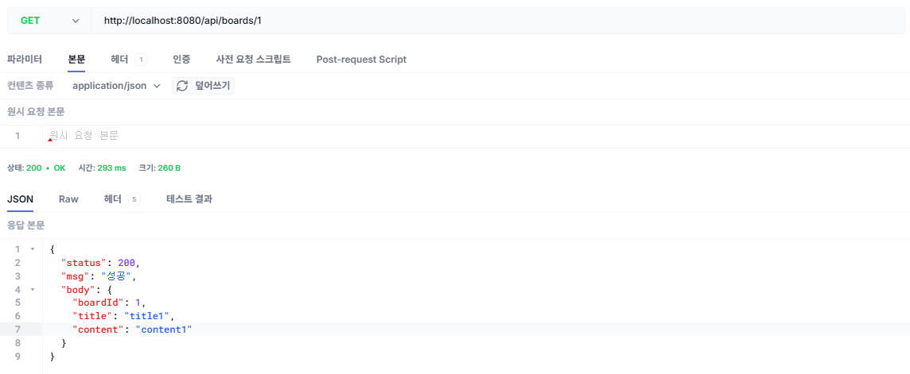
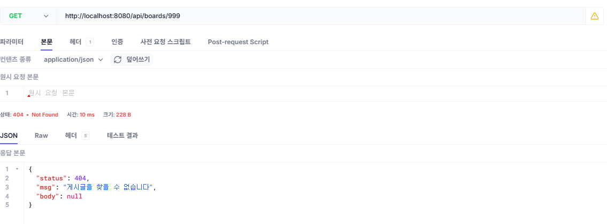

# 챕터 3. 예외 처리와 DTO

게시판의 다섯 기능이 모두 돌아갑니다. 그런데 동료가 화면을 붙이다 물어본 질문에는 아직 답하지 못했습니다. 없는 3번 게시글을 조회하면 빈 값이 성공으로 돌아온다는 것까지는 확인했습니다.

*조회가 이런데, 수정하고 삭제하면?*

없는 999번으로 수정을 걸자 500이 돌아왔고, 삭제도 마찬가지였습니다. 존재하는 1번으로 게시글 상세 API를 호출하자 엔티티에 적힌 필드가 그대로 JSON이 되어 나왔습니다. 응답에 담을 값도, 이름도 고를 수 없었습니다.

*없는 게시글 하나에 답이 두 개네. 응답 모양도 내가 정한 게 아니고.*

오픈이는 선배를 찾아가 화면을 보여줬습니다.

**오픈이**: "선배님, 없는 게시글 번호로 요청을 보냈는데 에러가 안 나고 성공으로 떨어집니다."

**선배**: "지금 코드가 게시글을 찾았을 때와 못 찾았을 때를 구분하지 않아서 그래요. 못 찾으면 빈 값이 그대로 나가니까 조회는 성공이 되고, 수정과 삭제는 빈 값을 건드리다 터집니다. 없다는 걸 코드가 그냥 넘기지 못하게 막고, 내보낼 값도 따로 골라 담아야 합니다."

<div class="svg-figure">
<svg viewBox="0 0 1000 420" xmlns="http://www.w3.org/2000/svg" role="img" aria-label="챕터 2가 남긴 다섯 곳과 챕터 3에서 바꾸는 모습. 엔티티를 그대로 응답에 싣던 것은 응답 DTO에 담아 내보내고, 서비스가 엔티티를 조립하던 것은 요청 DTO가 변환을 맡고, 리포지토리 네 메서드를 직접 적고 없으면 null을 돌려주던 것은 JpaRepository를 상속해 빈 Optional을 돌려주고, 없는 게시글 조회가 200이고 수정과 삭제가 500이던 것은 Exception404를 발생시켜 404가 되고, 예외를 받을 곳이 없던 것은 한 곳에서 JSON으로 바뀐다.">
  <defs>
    <marker id="c3ov-i" markerWidth="10" markerHeight="10" refX="8" refY="3" orient="auto"><path d="M0,0 L0,6 L8,3 z" fill="#4f46e5"/></marker>
  </defs>
  <text x="500" y="28" text-anchor="middle" font-size="17" font-weight="700" fill="#0f172a">챕터 3 한눈에 보기 - 챕터 2 코드에서 고칠 다섯 곳</text>
  <text x="285" y="58" text-anchor="middle" font-size="12" font-weight="700" fill="#c2410c">챕터 2가 남긴 것</text>
  <text x="750" y="58" text-anchor="middle" font-size="12" font-weight="700" fill="#3730a3">챕터 3에서 바꾸는 것</text>

  <rect x="120" y="70" width="330" height="54" rx="8" fill="#fff" stroke="#475569" stroke-width="1.6"/>
  <text x="285" y="94" text-anchor="middle" font-size="12" fill="#0f172a">엔티티를 그대로 응답에 싣는다</text>
  <text x="285" y="113" text-anchor="middle" font-size="11" fill="#6b7280">응답 모양을 엔티티가 정한다</text>
  <line x1="456" y1="97" x2="536" y2="97" stroke="#4f46e5" stroke-width="1.8" marker-end="url(#c3ov-i)"/>
  <rect x="542" y="70" width="330" height="54" rx="8" fill="#eef2ff" stroke="#4f46e5" stroke-width="1.8"/>
  <text x="707" y="102" text-anchor="middle" font-size="12" font-weight="800" fill="#3730a3">응답 DTO에 담아 내보낸다</text>

  <rect x="120" y="138" width="330" height="54" rx="8" fill="#fff" stroke="#475569" stroke-width="1.6"/>
  <text x="285" y="170" text-anchor="middle" font-size="12" fill="#0f172a">서비스가 엔티티를 조립한다</text>
  <line x1="456" y1="165" x2="536" y2="165" stroke="#4f46e5" stroke-width="1.8" marker-end="url(#c3ov-i)"/>
  <rect x="542" y="138" width="330" height="54" rx="8" fill="#eef2ff" stroke="#4f46e5" stroke-width="1.8"/>
  <text x="707" y="170" text-anchor="middle" font-size="12" font-weight="800" fill="#3730a3">요청 DTO가 변환을 맡는다</text>

  <rect x="120" y="206" width="330" height="54" rx="8" fill="#fff" stroke="#475569" stroke-width="1.6"/>
  <text x="285" y="230" text-anchor="middle" font-size="12" fill="#0f172a">리포지토리 네 메서드를 직접 적는다</text>
  <text x="285" y="249" text-anchor="middle" font-size="11" fill="#6b7280">못 찾으면 null이 돌아온다</text>
  <line x1="456" y1="233" x2="536" y2="233" stroke="#4f46e5" stroke-width="1.8" marker-end="url(#c3ov-i)"/>
  <rect x="542" y="206" width="330" height="54" rx="8" fill="#eef2ff" stroke="#4f46e5" stroke-width="1.8"/>
  <text x="707" y="230" text-anchor="middle" font-size="12" font-weight="800" fill="#3730a3">JpaRepository를 상속한다</text>
  <text x="707" y="249" text-anchor="middle" font-size="11" fill="#3730a3">못 찾으면 빈 Optional이 돌아온다</text>

  <rect x="120" y="274" width="330" height="54" rx="8" fill="#fff" stroke="#475569" stroke-width="1.6"/>
  <text x="285" y="298" text-anchor="middle" font-size="12" fill="#0f172a">없는 게시글 조회도 200으로 응답한다</text>
  <text x="285" y="317" text-anchor="middle" font-size="11" fill="#6b7280">수정과 삭제는 500이 난다</text>
  <line x1="456" y1="301" x2="536" y2="301" stroke="#4f46e5" stroke-width="1.8" marker-end="url(#c3ov-i)"/>
  <rect x="542" y="274" width="330" height="54" rx="8" fill="#eef2ff" stroke="#4f46e5" stroke-width="1.8"/>
  <text x="707" y="306" text-anchor="middle" font-size="12" font-weight="800" fill="#3730a3">Exception404를 발생시킨다</text>

  <rect x="120" y="342" width="330" height="54" rx="8" fill="#fff" stroke="#475569" stroke-width="1.6"/>
  <text x="285" y="374" text-anchor="middle" font-size="12" fill="#0f172a">발생한 예외를 받을 곳이 없다</text>
  <line x1="456" y1="369" x2="536" y2="369" stroke="#4f46e5" stroke-width="1.8" marker-end="url(#c3ov-i)"/>
  <rect x="542" y="342" width="330" height="54" rx="8" fill="#eef2ff" stroke="#4f46e5" stroke-width="1.8"/>
  <text x="707" y="366" text-anchor="middle" font-size="12" font-weight="800" fill="#3730a3">한 곳에서 404 JSON으로 바꾼다</text>
  <text x="707" y="385" text-anchor="middle" font-size="11" fill="#3730a3">status · msg · body 형식을 지킨다</text>
</svg>
</div>

*그림 3-1. 챕터 2가 남긴 다섯 곳을 이번 챕터에서 모두 고칩니다*

:::goal
**이번 챕터가 끝나면**

- 엔티티를 응답에 직접 사용하지 않고 DTO로 감싸는 이유를 설명할 수 있습니다
- **JpaRepository**로 바꾸면 없는 데이터가 왜 **Optional**로 반환되는지 이해합니다
- **Optional**과 `orElseThrow()`로 없는 데이터를 예외로 바꾸고, 커스텀 예외가 왜 **RuntimeException**인지 이해합니다
- **@RestControllerAdvice**로 예외를 한 곳에서 JSON으로 바꿔, 없는 게시글도 깔끔한 404로 응답합니다
:::

::::prep
**소스코드 준비**

소스코드 준비에서 클론한 예제 저장소에서 이번 챕터 폴더로 이동합니다. 패키지 루트는 챕터 2와 같은 `com.metacoding.spring`입니다.

```bash [터미널] 챕터 3 폴더로 이동
cd spring-start/ch03
```

이번 챕터에서 새로 만들거나 고치는 파일은 다음과 같습니다. 나머지는 챕터 2 그대로입니다.

```text ch03 파일 구조
spring-start/ch03/src/main/java/com/metacoding/spring/
├── board/
│   ├── Board.java                    # [작성] @Builder + 생성자 추가
│   ├── BoardController.java          # [작성] 응답 타입 DTO로 교체
│   ├── BoardRepository.java          # [작성] JpaRepository 인터페이스로 전환
│   ├── BoardRequest.java             # [작성] toEntity() 추가
│   ├── BoardResponse.java            # [작성] 응답 DTO(DTO/DetailDTO)
│   └── BoardService.java             # [작성] orElseThrow + DTO 반환
└── core/handler/
    ├── ex/Exception400,401,403,404.java   # [작성] 커스텀 예외
    └── GlobalExceptionHandler.java        # [작성] 전역 예외 처리
```

챕터를 따라 코드를 채우고, 막히면 `spring-end`의 완성 코드를 참고하세요.
::::

## 3.1 응답 DTO

### 3.1.1 DTO가 필요한 이유

챕터 2의 컨트롤러는 **Board** 엔티티를 그대로 반환하고, **@RestController**가 이를 JSON으로 변환합니다. 그래서 엔티티에 선언한 필드가 곧 응답 JSON입니다.

응답으로 내보낼 값만 담는 클래스를 따로 정의하면, 컨트롤러는 엔티티 대신 이 클래스를 반환합니다. 챕터 2에서 요청을 받을 때 사용한 DTO를, 이번에는 응답을 내보낼 때도 사용합니다.

<div class="svg-figure">
<svg viewBox="0 0 900 320" xmlns="http://www.w3.org/2000/svg" role="img" aria-label="엔티티와 DTO 경계. 왼쪽 내부에는 id, title, content, createdAt을 테이블 그대로 담은 Board 엔티티가 있고, 가운데 벽에 'DTO만 통과' 표지가 붙어 있다. 벽을 지나 오른쪽 응답에 담긴 것은 boardId, title, content 세 줄만 담은 작은 DTO로, createdAt은 빠지고 id는 boardId로 이름이 바뀌었다.">
  <defs>
    <marker id="c3dto-a" markerWidth="10" markerHeight="10" refX="8" refY="3" orient="auto"><path d="M0,0 L0,6 L8,3 z" fill="#4f46e5"/></marker>
  </defs>
  <text x="175" y="30" text-anchor="middle" font-size="14" font-weight="800" fill="#0f172a">내부</text>
  <text x="661" y="30" text-anchor="middle" font-size="14" font-weight="800" fill="#0f172a">응답 (바깥)</text>
  <rect x="40" y="46" width="270" height="256" rx="10" fill="#eef2ff" stroke="#4f46e5" stroke-width="1.8"/>
  <text x="175" y="78" text-anchor="middle" font-size="13" font-weight="800" fill="#3730a3">Board 엔티티</text>
  <text x="175" y="118" text-anchor="middle" font-size="12" fill="#334155">id : 1</text>
  <text x="175" y="146" text-anchor="middle" font-size="12" fill="#334155">title : 제목</text>
  <text x="175" y="174" text-anchor="middle" font-size="12" fill="#334155">content : 내용</text>
  <text x="175" y="202" text-anchor="middle" font-size="12" fill="#334155">createdAt : 작성시각</text>
  <text x="175" y="250" text-anchor="middle" font-size="11" fill="#6b7280">테이블에 있는 그대로입니다</text>
  <rect x="430" y="40" width="14" height="270" fill="#e2e8f0" stroke="#94a3b8" stroke-width="1.2"/>
  <rect x="418" y="150" width="38" height="52" rx="4" fill="#fff" stroke="#4f46e5" stroke-width="1.6"/>
  <rect x="388" y="102" width="98" height="28" rx="6" fill="#4f46e5"/>
  <text x="437" y="121" text-anchor="middle" font-size="12" font-weight="700" fill="#fff">DTO만 통과</text>
  <rect x="556" y="118" width="210" height="130" rx="10" fill="#fff" stroke="#4f46e5" stroke-width="1.6"/>
  <text x="661" y="148" text-anchor="middle" font-size="12" font-weight="800" fill="#3730a3">BoardResponse.DTO</text>
  <text x="661" y="178" text-anchor="middle" font-size="12" fill="#334155">boardId : 1</text>
  <text x="661" y="202" text-anchor="middle" font-size="12" fill="#334155">title : 제목</text>
  <text x="661" y="226" text-anchor="middle" font-size="12" fill="#334155">content : 내용</text>
  <line x1="310" y1="176" x2="416" y2="176" stroke="#4f46e5" stroke-width="1.8" marker-end="url(#c3dto-a)"/>
  <line x1="458" y1="176" x2="554" y2="176" stroke="#4f46e5" stroke-width="1.8" marker-end="url(#c3dto-a)"/>
</svg>
</div>

*그림 3-2. 엔티티는 내부에 두고, 응답할 값만 DTO에 담아 내보냅니다*

### 3.1.2 응답 DTO 만들기

`board/BoardResponse.java`를 열어 아래와 같이 작성합니다.

```java [실습 1] board/BoardResponse.java. 응답 DTO
public class BoardResponse {

    // 1. 목록용 DTO. 엔티티를 받아 보여줄 값만 담는다
    public record DTO(Integer boardId, String title, String content) {

        public DTO(Board board) {
            this(board.getId(), board.getTitle(), board.getContent());
        }
    }

    // 2. 상세용 DTO. 지금은 목록용과 같지만 앞으로 달라진다
    public record DetailDTO(Integer boardId, String title, String content) {

        public DetailDTO(Board board) {
            this(board.getId(), board.getTitle(), board.getContent());
        }
    }
}
```

엔티티를 받는 생성자를 두었으므로 서비스에서 `new BoardResponse.DTO(board)` 한 줄로 변환합니다. 응답 필드 이름이 `id`가 아니라 `boardId`인 것처럼, 응답에 담길 이름은 응답 DTO에서 따로 지정합니다.

## 3.2 요청 DTO와 엔티티 변환

데이터베이스에 저장되려면 영속성 컨텍스트가 관리하는 객체, 곧 엔티티여야 합니다. **SaveDTO**는 값만 담은 일반 객체라 영속 상태가 되지 못하므로, DTO 안에 엔티티로 바꾸는 `toEntity()`를 둡니다.

변환은 **Board**를 새로 생성하는 작업이므로, 엔티티에 값을 받는 생성자가 먼저 필요합니다. 이를 위해 `board/Board.java`에 아래와 같이 생성자를 추가하고 **@Builder**를 붙입니다.

```java [실습 2] board/Board.java. 빌더로 생성할 수 있게
@NoArgsConstructor
@Data
@Entity
@Table(name = "board_tb")
public class Board {
    // id, title, content, createdAt 필드 (챕터 2와 같음)

    @Builder // 객체 생성 용도
    public Board(Integer id, String title, String content, Timestamp createdAt) {
        this.id = id;
        this.title = title;
        this.content = content;
        this.createdAt = createdAt;
    }
}
```

명시 생성자를 선언하면 자바가 자동으로 제공하던 기본 생성자가 사라지는데, JPA 엔티티는 기본 생성자가 있어야 하므로 **@NoArgsConstructor**도 함께 붙입니다.

`board/BoardRequest.java`의 **SaveDTO**에 엔티티로 변환하는 메서드를 아래와 같이 추가합니다.

```java [실습 3] board/BoardRequest.java. 요청 DTO에 toEntity 추가
    public record SaveDTO(String title, String content) {

        public Board toEntity() {
            return Board.builder()
                    .title(title())
                    .content(content())
                    .build();
        }
    }
```

## 3.3 JpaRepository 적용

없는 게시글을 조회해도 예외가 발생하지 않아 서버는 정상 응답을 내보냅니다.

이 결과를 예외로 바꾸려면 조회가 무엇을 반환하는지부터 달라져야 합니다. 그래서 **JpaRepository**로 바꿉니다. **JpaRepository**는 Spring Data JPA가 제공하는 리포지토리 인터페이스입니다. 이 인터페이스를 상속하면 기본 조회·저장·삭제 메서드를 그대로 사용할 수 있고, **Optional** 타입을 통해 예외 처리를 할 수 있습니다.

`board/BoardRepository.java`를 열어 아래와 같이 변경합니다.

```java [실습 4] board/BoardRepository.java. JpaRepository 상속
public interface BoardRepository extends JpaRepository<Board, Integer> {
}
```

리포지토리는 클래스가 아니라 인터페이스로 선언합니다. `JpaRepository<Board, Integer>`의 꺾쇠 안에는 다룰 엔티티와 기본 키의 타입을 차례로 적습니다.

상속만 해 두면 아래 메서드를 그대로 호출할 수 있습니다.

| 메서드 | 하는 일 |
|---|---|
| `save(엔티티)` | 저장하고 저장된 엔티티를 반환합니다 |
| `findById(기본 키)` | 기본 키로 한 건을 조회해 **Optional**에 담아 반환합니다 |
| `findAll()` | 전체를 **List**로 반환합니다 |
| `delete(엔티티)` | 삭제합니다 |
| `findBy필드명(값)` | 직접 선언합니다. `findBy` 뒤 필드 이름을 보고 select 문이 생성됩니다 |

## 3.4 예외 처리 추가

**Optional**은 값이 존재할 수도, 존재하지 않을 수도 있는 상태를 감싸는 래퍼(Wrapper) 클래스로, 주로 null로 인한 에러를 방지하기 위해 사용됩니다. 내부에 담긴 값을 꺼낼 때는 `orElseThrow()` 메서드를 사용합니다. 이 메서드는 값이 존재하면 해당 값을 그대로 반환하고, 비어있을 경우 인자로 전달한 지정된 예외를 발생시킵니다.

### 3.4.1 커스텀 예외 만들기

예외 처리에 사용할 **Exception404**를 정의합니다. 이를 위해 `core/handler/ex/Exception404.java`를 열어 아래와 같이 작성합니다.

```java [실습 5] core/handler/ex/Exception404.java. 커스텀 예외
public class Exception404 extends RuntimeException {
    public Exception404(String message) {
        super(message);
    }
}
```

상황에 맞게 직접 정의한 예외를 커스텀 예외라고 합니다. **RuntimeException**을 상속하면 이 예외를 사용하는 곳마다 `try-catch`를 적지 않아도 됩니다.

같은 폴더의 **Exception400**, **Exception401**, **Exception403**도 상태 코드만 다를 뿐 형태가 동일합니다. 회원가입과 로그인, 권한을 다루는 다음 챕터에서 사용하므로 미리 준비해 둡니다.

404는 HTTP 상태 코드입니다. 응답이 어떤 상황인지 세 자리 숫자로 알리는 약속입니다. 이 책에서 사용하는 것은 다음과 같습니다.

| 상태 코드 | 뜻 | 예 |
|---|---|---|
| 400 | 요청이 잘못됨 | 이미 쓰는 유저네임으로 가입 |
| 401 | 인증되지 않음 | 로그인 없이 접근 |
| 403 | 권한이 없음 | 작성자가 아닌 사람의 게시글 수정 |
| 404 | 자원이 없음 | 없는 게시글 조회 |
| 500 | 서버 내부 오류 | 처리하지 못한 예외 |

### 3.4.2 전역 예외 처리

다음으로 예외가 발생했을 때 처리할 핸들러를 구현해 보겠습니다. **@RestControllerAdvice** 어노테이션이 지정된 클래스는 각 컨트롤러에서 요청을 처리하는 도중 발생하는 예외를 전역적(Global)으로 가로채어 한 곳에서 일괄 처리하는 역할을 합니다. 컨트롤러와 서비스는 예외를 발생시키기만 하고, 응답으로 바꾸는 일은 이 클래스가 맡습니다.

`core/handler/GlobalExceptionHandler.java`를 열어 아래와 같이 작성합니다.

```java [실습 6] core/handler/GlobalExceptionHandler.java. 전역 예외 처리
@RestControllerAdvice
public class GlobalExceptionHandler {

    // 1. 커스텀 예외는 저마다의 상태 코드로 바꾼다
    @ExceptionHandler(Exception400.class)
    public ResponseEntity<?> ex400(Exception400 e) {
        return Resp.fail(HttpStatus.BAD_REQUEST, e.getMessage());
    }

    @ExceptionHandler(Exception401.class)
    public ResponseEntity<?> ex401(Exception401 e) {
        return Resp.fail(HttpStatus.UNAUTHORIZED, e.getMessage());
    }

    @ExceptionHandler(Exception403.class)
    public ResponseEntity<?> ex403(Exception403 e) {
        return Resp.fail(HttpStatus.FORBIDDEN, e.getMessage());
    }

    @ExceptionHandler(Exception404.class)
    public ResponseEntity<?> ex404(Exception404 e) {
        return Resp.fail(HttpStatus.NOT_FOUND, e.getMessage());
    }

    // 2. 나머지 모든 예외는 500으로 처리한다
    @ExceptionHandler(Exception.class)
    public ResponseEntity<?> exUnknown(Exception e) {
        return Resp.fail(HttpStatus.INTERNAL_SERVER_ERROR, "서버 오류가 발생했습니다");
    }
}
```

**@ExceptionHandler**는 메서드마다 어떤 예외를 맡을지 지정합니다. 커스텀 예외 넷은 저마다 400·401·403·404 응답이 되고, 그 밖의 예외는 모두 500 응답이 됩니다.

<div class="svg-figure">
<svg viewBox="0 0 980 240" xmlns="http://www.w3.org/2000/svg" role="img" aria-label="서비스에서 발생한 Exception404가 위로 전파되어 RestControllerAdvice가 가로채고, 상태 코드 404를 담은 JSON으로 바뀌어 응답된다.">
  <defs>
    <marker id="c3ex-ar" markerWidth="10" markerHeight="10" refX="8" refY="3" orient="auto"><path d="M0,0 L0,6 L8,3 z" fill="#4f46e5"/></marker>
    <marker id="c3ex-warn" markerWidth="10" markerHeight="10" refX="8" refY="3" orient="auto"><path d="M0,0 L0,6 L8,3 z" fill="#ff7849"/></marker>
  </defs>
  <rect x="30" y="150" width="140" height="60" rx="8" fill="#fff" stroke="#475569" stroke-width="1.6"/>
  <text x="100" y="176" text-anchor="middle" font-size="16" font-weight="700" fill="#0f172a">컨트롤러</text>
  <text x="100" y="196" text-anchor="middle" font-size="14" fill="#6b7280">요청을 받는 입구</text>
  <rect x="230" y="150" width="160" height="60" rx="8" fill="#fff" stroke="#475569" stroke-width="1.6"/>
  <text x="310" y="174" text-anchor="middle" font-size="16" font-weight="700" fill="#0f172a">서비스</text>
  <text x="310" y="194" text-anchor="middle" font-size="14" fill="#c2410c">Exception404 던짐</text>
  <line x1="170" y1="180" x2="228" y2="180" stroke="#4f46e5" stroke-width="1.8" marker-end="url(#c3ex-ar)"/>
  <rect x="360" y="40" width="250" height="72" rx="8" fill="#eef2ff" stroke="#4f46e5" stroke-width="1.9"/>
  <text x="485" y="68" text-anchor="middle" font-size="16" font-weight="800" fill="#3730a3">@RestControllerAdvice</text>
  <text x="485" y="90" text-anchor="middle" font-size="14" fill="#3730a3">전파된 예외를 한 곳에서 가로챈다</text>
  <path d="M330,150 C330,112 372,98 400,90" fill="none" stroke="#ff7849" stroke-width="1.9" stroke-dasharray="4,4" marker-end="url(#c3ex-warn)"/>
  <text x="300" y="124" text-anchor="middle" font-size="14" fill="#c2410c">예외 전파</text>
  <rect x="700" y="140" width="250" height="80" rx="8" fill="#fff" stroke="#475569" stroke-width="1.6"/>
  <text x="825" y="166" text-anchor="middle" font-size="15" font-weight="700" fill="#0f172a">404 JSON 응답</text>
  <text x="825" y="188" text-anchor="middle" font-size="14" fill="#6b7280">status 404, msg,</text>
  <text x="825" y="204" text-anchor="middle" font-size="14" fill="#6b7280">body null</text>
  <path d="M610,90 C670,102 700,120 738,138" fill="none" stroke="#4f46e5" stroke-width="1.8" marker-end="url(#c3ex-ar)"/>
  <text x="672" y="96" text-anchor="middle" font-size="14" fill="#4f46e5">Resp.fail</text>
</svg>
</div>

*그림 3-3. 서비스에서 발생한 예외는 위로 전파되고, **@RestControllerAdvice**가 이를 가로채 JSON으로 바꿔 응답합니다*

## 3.5 서비스와 컨트롤러에 적용

이제 **BoardService**가 예외 처리와 DTO 응답을 수행하도록 변경합니다. 이를 반영하여 `board/BoardService.java`를 열어 아래와 같이 작성합니다.

```java [실습 7] board/BoardService.java. 반환 타입을 DTO로, 없으면 예외
    public List<BoardResponse.DTO> 게시글목록() {
        return boardRepository.findAll().stream()
                .map(BoardResponse.DTO::new)
                .toList();
    }

    public BoardResponse.DetailDTO 게시글상세(Integer boardId) {
        Board board = boardRepository.findById(boardId)
                .orElseThrow(() -> new Exception404("게시글을 찾을 수 없습니다"));
        return new BoardResponse.DetailDTO(board);
    }

    @Transactional
    public BoardResponse.DTO 게시글추가(BoardRequest.SaveDTO requestDTO) {
        Board board = requestDTO.toEntity(); // DTO -> 엔티티
        boardRepository.save(board);
        return new BoardResponse.DTO(board); // 저장된 게시글 반환
    }

    @Transactional
    public BoardResponse.DTO 게시글수정(Integer boardId, BoardRequest.UpdateDTO requestDTO) {
        Board board = boardRepository.findById(boardId)
                .orElseThrow(() -> new Exception404("게시글을 찾을 수 없습니다"));
        // 더티 체킹
        board.setTitle(requestDTO.title());
        board.setContent(requestDTO.content());
        return new BoardResponse.DTO(board); // 수정된 게시글 반환
    }

    @Transactional
    public void 게시글삭제(Integer boardId) {
        Board board = boardRepository.findById(boardId)
                .orElseThrow(() -> new Exception404("게시글을 찾을 수 없습니다"));
        boardRepository.delete(board);
    }
```

컨트롤러는 서비스에서 전달받는 값의 타입만 DTO로 바뀝니다. 이를 반영하여 `board/BoardController.java`를 열어 아래와 같이 작성합니다.

```java [실습 8] board/BoardController.java. 응답 타입을 DTO로
    @GetMapping
    public ResponseEntity<?> findAll() {
        List<BoardResponse.DTO> respDTOList = boardService.게시글목록();
        return Resp.ok(respDTOList);
    }

    @GetMapping("/{boardId}")
    public ResponseEntity<?> detail(@PathVariable("boardId") Integer boardId) {
        BoardResponse.DetailDTO respDTO = boardService.게시글상세(boardId);
        return Resp.ok(respDTO);
    }

    @PostMapping
    public ResponseEntity<?> save(@RequestBody BoardRequest.SaveDTO requestDTO) {
        BoardResponse.DTO respDTO = boardService.게시글추가(requestDTO);
        return Resp.ok(respDTO);
    }

    @PutMapping("/{boardId}")
    public ResponseEntity<?> update(@PathVariable("boardId") Integer boardId,
            @RequestBody BoardRequest.UpdateDTO requestDTO) {
        BoardResponse.DTO respDTO = boardService.게시글수정(boardId, requestDTO);
        return Resp.ok(respDTO);
    }

    @DeleteMapping("/{boardId}")
    public ResponseEntity<?> deleteById(@PathVariable("boardId") Integer boardId) {
        boardService.게시글삭제(boardId);
        return Resp.ok(null);
    }
```

주소와 HTTP 메서드는 챕터 2와 같습니다. 게시글 상세 API를 호출하면 응답에는 DTO에 담긴 세 값만 담깁니다.

```json [Hoppscotch] 게시글 상세 조회
GET http://localhost:8080/api/boards/1
```

<!-- [CAPTURE NEEDED: 01_board-detail-dto
  path: assets/CH3/terminal/01_board-detail-dto.png
  desc: GET /api/boards/1 요청에 대한 200 응답. { "status": 200, "msg": "성공", "body": { "boardId": 1, "title": "title1", "content": "content1" } } 형태로, 엔티티가 가진 나머지 필드 없이 DTO에 담긴 세 값만 나온 화면. Hoppscotch 또는 브라우저 응답.
] -->

*그림 3-4. 상세 조회 응답에는 DTO에 담긴 세 값만 담깁니다*

앞에서 만든 전역 예외 처리기가 실제로 404를 돌려주는지, 없는 999번을 조회해 확인합니다.

```json [Hoppscotch] 없는 게시글 다시 조회
GET http://localhost:8080/api/boards/999
```

빈 값이 담긴 성공 대신 404 응답을 받습니다.

<!-- [CAPTURE NEEDED: 02_404-response
  path: assets/CH3/terminal/02_404-response.png
  desc: GET /api/boards/999 요청에 대한 404 JSON 응답. { "status": 404, "msg": "게시글을 찾을 수 없습니다", "body": null } 형태. Hoppscotch 또는 브라우저 응답 화면. HTTP 상태 코드가 404로 표시되면 좋음.
] -->

*그림 3-5. 없는 게시글을 조회하면 빈 값이 아니라 상태 코드 404를 담은 JSON을 응답합니다*

오픈이는 목록 API를 받아 간 동료를 다시 불렀습니다. 키보드에서 손을 뗀 사무실이 잠깐 조용해졌습니다.

**오픈이**: "지난번에 없는 번호 넣으면 어떻게 되냐고 물었잖아요. 이제 없으면 없다고 딱 나와요."<br>
**동료**: "아, 3번 호출해 볼게요. 없다고 딱 나오네요. 저번엔 성공이라면서 아무것도 없더니."

*여기까진 됐다.*

다섯 곳을 정리했지만, 오픈이는 화면을 내려다보다 한 가지가 걸렸습니다. 지금은 로그인 화면도, 게시글 주인을 확인하는 절차도 없습니다. 999번 하나 못 찾는 것은 막아 놨는데, 정작 누구나 게시글을 고치고 지울 수 있는 서버였습니다.

*없는 게시글은 걸렀는데, 문은 여전히 다 열려 있잖아.*

다음 챕터에서는 인증 기능을 추가해, 작성자 본인만 자기 게시글을 관리할 수 있게 합니다.

:::remember
**이것만은 기억하자**

- **엔티티를 응답에 직접 사용하지 않고 DTO에 담아 내보냅니다.** 응답에 담길 값과 이름을 엔티티가 아니라 응답 DTO에서 정합니다.
- **없는 값은 `Optional`에 담고 `orElseThrow`로 예외를 발생시킵니다.** 커스텀 예외는 **RuntimeException**을 상속해, 발생시키는 일과 받는 일을 나눕니다. 발생한 예외는 **@RestControllerAdvice**가 한 곳에서 받아 상태 코드에 맞는 JSON으로 바꿉니다.
:::
