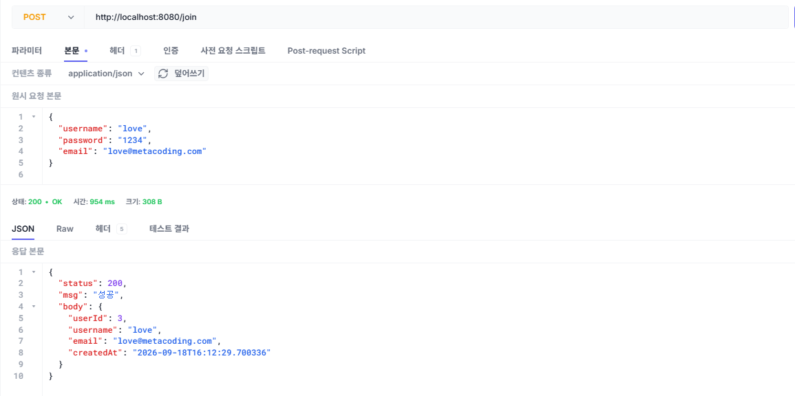
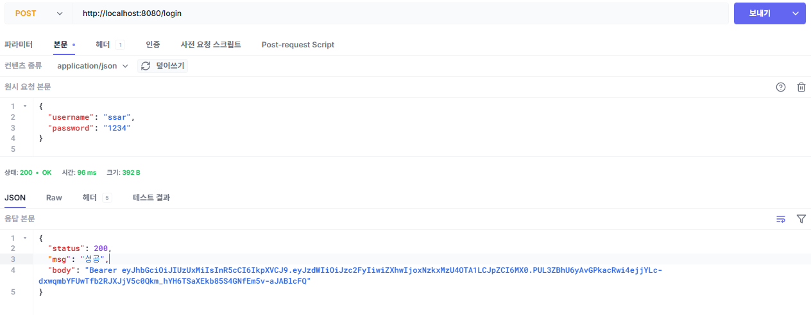
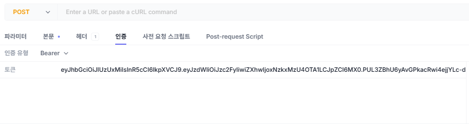
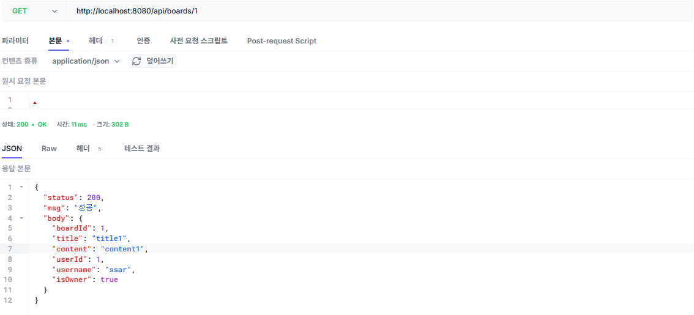
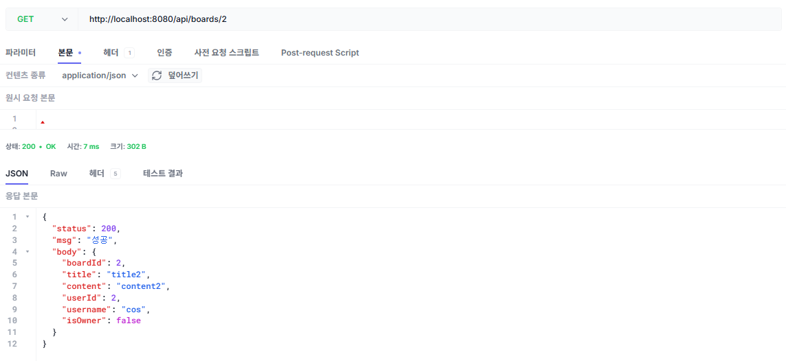
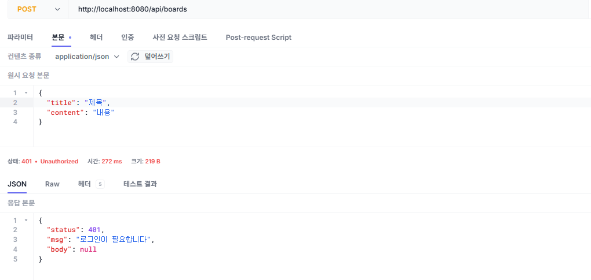
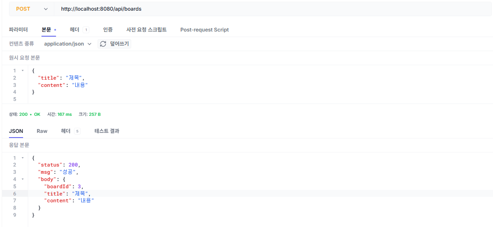
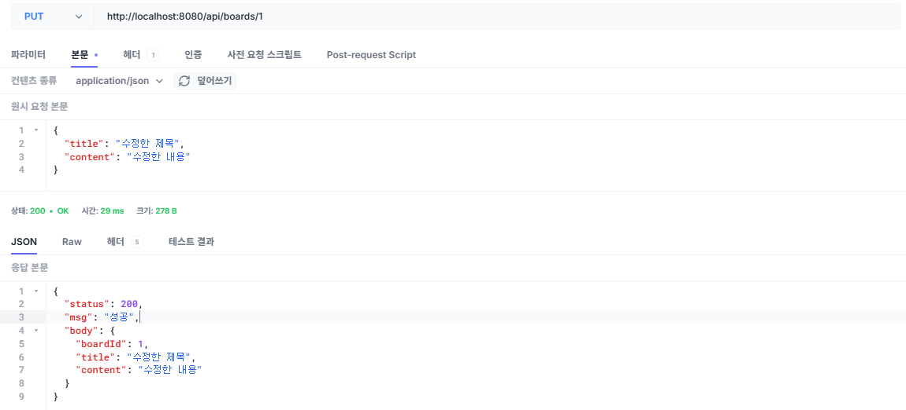
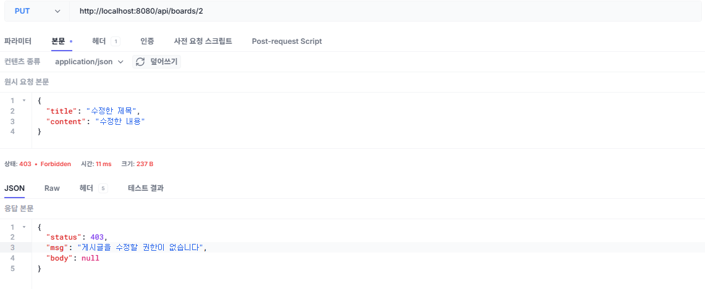
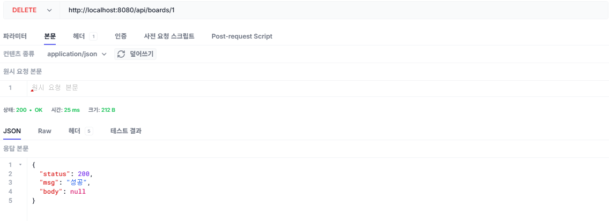

# 챕터 4. 인증과 인가

지금까지 오픈이가 구현한 게시판의 게시글은 누가 작성했는지 알 수 없는 익명 게시글이었습니다. 다음은 회원 기능을 추가해 인증 게시판을 만드는 것입니다. 인증 기능을 추가하기 위해 공부하던 오픈이는 로그인 상태를 관리하는 방식이 크게 두 가지라는 것을 알게 되었습니다. 하나는 서버가 사용자의 로그인 정보를 저장하는 **상태 유지(Stateful)** 방식이고, 다른 하나는 로그인 정보를 저장하지 않는 **무상태(Stateless)** 방식입니다.

*둘 중에 어떤 방식으로 인증을 만들어야 하지?*

오픈이는 선배에게 어떤 방식을 선택하는 것이 좋을지 물어보았습니다.

**선배**: "상태 유지 방식은 서버가 로그인 정보를 직접 관리하니까, 필요할 때 특정 사용자를 바로 로그아웃시키는 것처럼 통제하기 쉬워요. 대신 **사용자가 늘어날수록 서버가 기억해야 할 데이터도 많아져서 부담이 커지고**, 서버가 여러 대가 되면 그 정보를 서로 공유해야 하는 문제가 생겨요."

**선배**: "반면 무상태 방식은 **서버가 로그인 정보를 기억할 필요가 없어서 사용자가 늘어나도 부담이 크지 않고**, 서버가 몇 대든 요청만 검증하면 돼요. 대신 한 번 발급한 인증 정보는 만료되기 전까지 서버가 중간에 무효로 만들기 어렵다는 단점이 있어요. 지금 만드는 REST API 방식에는 무상태 방식이 더 적합할 것 같아요. **JWT**라는 토큰을 사용하면 무상태 방식으로 인증을 할 수 있어요."

<div class="svg-figure svg-figure--wide">
<svg viewBox="0 0 1000 350" xmlns="http://www.w3.org/2000/svg" role="img" aria-label="챕터 4 한눈에 보기. 1단계에서 클라이언트가 로그인하면 서버가 JWT를 발급한다. 2단계에서 클라이언트는 요청마다 JWT를 헤더에 담아 보내고, 필터가 JWT를 확인해 회원 정보를 담고, 컨트롤러는 담긴 회원 정보를 서비스로 전달하고, 서비스가 로그인 여부와 소유자를 확인한다.">
  <defs>
    <marker id="c4ov-i" markerWidth="10" markerHeight="10" refX="8" refY="3" orient="auto"><path d="M0,0 L0,6 L8,3 z" fill="#4f46e5"/></marker>
    <marker id="c4ov-b" markerWidth="10" markerHeight="10" refX="8" refY="3" orient="auto"><path d="M0,0 L0,6 L8,3 z" fill="#3730a3"/></marker>
  </defs>
  <text x="500" y="30" text-anchor="middle" font-size="17" font-weight="700" fill="#0f172a">챕터 4 한눈에 보기 - 로그인부터 소유자 검증까지</text>
  <text x="75" y="72" font-size="12" font-weight="700" fill="#475569">1단계 · 로그인</text>
  <rect x="215" y="82" width="150" height="58" rx="8" fill="#fff" stroke="#475569" stroke-width="1.6"/>
  <text x="290" y="108" text-anchor="middle" font-size="13" font-weight="700" fill="#0f172a">클라이언트</text>
  <text x="290" y="127" text-anchor="middle" font-size="11" fill="#6b7280">아이디 · 비밀번호</text>
  <rect x="565" y="82" width="220" height="58" rx="8" fill="#eef2ff" stroke="#4f46e5" stroke-width="1.8"/>
  <text x="675" y="108" text-anchor="middle" font-size="13" font-weight="800" fill="#3730a3">로그인 처리</text>
  <text x="675" y="127" text-anchor="middle" font-size="11" fill="#3730a3">POST /login</text>
  <line x1="365" y1="100" x2="563" y2="100" stroke="#4f46e5" stroke-width="1.7" marker-end="url(#c4ov-i)"/>
  <text x="464" y="92" text-anchor="middle" font-size="11" font-weight="600" fill="#4f46e5">1. 로그인 요청</text>
  <line x1="565" y1="124" x2="367" y2="124" stroke="#3730a3" stroke-width="1.7" stroke-dasharray="4,3" marker-end="url(#c4ov-b)"/>
  <text x="466" y="139" text-anchor="middle" font-size="11" font-weight="600" fill="#3730a3">2. JWT 발급</text>
  <text x="75" y="214" font-size="12" font-weight="700" fill="#475569">2단계 · 요청마다 (JWT를 헤더에 담아 보냄)</text>
  <rect x="75" y="252" width="120" height="76" rx="8" fill="#fff" stroke="#475569" stroke-width="1.6"/>
  <text x="135" y="284" text-anchor="middle" font-size="13" font-weight="700" fill="#0f172a">클라이언트</text>
  <text x="135" y="304" text-anchor="middle" font-size="11" fill="#6b7280">헤더에 JWT</text>
  <rect x="255" y="248" width="180" height="84" rx="8" fill="#eef2ff" stroke="#4f46e5" stroke-width="1.9"/>
  <text x="345" y="278" text-anchor="middle" font-size="13" font-weight="800" fill="#3730a3">필터 (인증)</text>
  <text x="345" y="300" text-anchor="middle" font-size="11" fill="#3730a3">JWT 확인 · 회원 정보 담기</text>
  <rect x="495" y="248" width="180" height="84" rx="8" fill="#fff" stroke="#475569" stroke-width="1.6"/>
  <text x="585" y="278" text-anchor="middle" font-size="13" font-weight="700" fill="#0f172a">컨트롤러</text>
  <text x="585" y="300" text-anchor="middle" font-size="11" fill="#6b7280">회원 정보를 서비스로 전달</text>
  <rect x="735" y="248" width="190" height="84" rx="8" fill="#fff7ed" stroke="#ff7849" stroke-width="1.9"/>
  <text x="830" y="278" text-anchor="middle" font-size="13" font-weight="800" fill="#c2410c">서비스</text>
  <text x="830" y="300" text-anchor="middle" font-size="11" fill="#c2410c">로그인 확인</text>
  <text x="830" y="318" text-anchor="middle" font-size="11" fill="#c2410c">소유자 검증</text>
  <line x1="195" y1="290" x2="253" y2="290" stroke="#4f46e5" stroke-width="1.7" marker-end="url(#c4ov-i)"/>
  <text x="224" y="282" text-anchor="middle" font-size="11" font-weight="600" fill="#4f46e5">3. 요청</text>
  <line x1="435" y1="290" x2="493" y2="290" stroke="#4f46e5" stroke-width="1.7" marker-end="url(#c4ov-i)"/>
  <line x1="675" y1="290" x2="733" y2="290" stroke="#4f46e5" stroke-width="1.7" marker-end="url(#c4ov-i)"/>
</svg>
</div>

*그림 4-1. 챕터 4의 실습 흐름*

::::prep
**준비하기**

### 1. 소스 코드 클론

```bash [터미널] 레포 클론
git clone https://github.com/metacoding-06-springboot-v1/start.git
cd start/ch04
```

완성 코드는 final 레포(`https://github.com/metacoding-06-springboot-v1/final`)의 `ch04` 폴더에서 확인할 수 있습니다.

### 2. 파일 구조

이번 챕터에서 새로 만들거나 고치는 파일만 표시합니다. 나머지는 챕터 3 그대로입니다.

```text ch04 디렉토리
start/ch04/src/main/
├── java/com/metacoding/spring/
│   ├── board/
│   │   ├── Board.java                           # [참고] 게시글 엔티티
│   │   ├── BoardController.java                 # [작성] 게시글 컨트롤러
│   │   ├── BoardRepository.java                 # [작성] 게시글 리포지토리
│   │   ├── BoardRequest.java                    # [작성] 게시글 요청 DTO
│   │   ├── BoardResponse.java                   # [작성] 게시글 응답 DTO
│   │   └── BoardService.java                    # [작성] 게시글 서비스
│   ├── core/
│   │   ├── filter/JwtAuthenticationFilter.java  # [참고] 인증 필터
│   │   └── util/
│   │       ├── JwtProvider.java                 # [참고] JWT 유저 정보 추출
│   │       └── JwtUtil.java                     # [참고] JWT 발급·검증
│   └── user/
│       ├── User.java                            # [참고] 회원 엔티티
│       ├── UserController.java                  # [작성] 회원 컨트롤러
│       ├── UserRepository.java                  # [작성] 회원 리포지토리
│       ├── UserRequest.java                     # [작성] 회원 요청 DTO
│       ├── UserResponse.java                    # [작성] 회원 응답 DTO
│       └── UserService.java                     # [작성] 회원 서비스
└── resources/db/data.sql                        # [참고] 더미 데이터
```
::::

## 4.1 인증과 인가

지금까지 만든 게시판에는 게시글 작성자가 없는 익명 게시판입니다. 여기에 회원 기능을 추가하게 되면 서버는 인증과 인가를 위한 검증이 필요합니다.

이를 회사의 보안 시스템에 비유해 보겠습니다. 우리가 출근할 때 게이트에 사원증을 찍어 이 회사의 직원임을 증명하듯, 서버에서 요청을 보낸 사람의 신원을 확인하는 과정을 **인증(Authentication)** 이라고 합니다.

하지만 게이트를 통과했다고 해서 회사의 모든 곳에 들어갈 수 있는 것은 아닙니다. 자료실처럼 권한을 부여받은 사람만 출입할 수 있는 곳이 따로 있습니다. 서버도 마찬가지입니다. 인증을 마친 사용자라도 요청한 작업을 수행할 자격이 있는지 확인해야 하며, 이 과정을 **인가(Authorization)** 라고 합니다.

<div class="svg-figure">
<svg viewBox="0 0 800 300" xmlns="http://www.w3.org/2000/svg" role="img" aria-label="왼쪽 인증 장면. 게이트 앞에 선 사람의 얼굴과 크게 그려진 사원증의 얼굴이 점선으로 이어져 있고, 사원증 얼굴 위에 돋보기가 놓여 있다. 오른쪽 인가 장면. 개발팀 사원증을 목에 건 사람 앞에 문이 둘 있고, 개발팀이라 적힌 문은 열려 있으며 자료실이라 적힌 문에는 자물쇠가 걸려 있다.">
  <rect x="30" y="26" width="350" height="252" rx="8" fill="#fff" stroke="#4f46e5" stroke-width="1.8"/>
  <path d="M38,26 H372 a8,8 0 0 1 8,8 V66 H30 V34 a8,8 0 0 1 8,-8 z" fill="#eef2ff"/>
  <line x1="30" y1="66" x2="380" y2="66" stroke="#4f46e5" stroke-width="1.4"/>
  <text x="205" y="53" text-anchor="middle" font-size="14" font-weight="800" fill="#3730a3">인증</text>
  <line x1="50" y1="262" x2="360" y2="262" stroke="#cbd5e1" stroke-width="1.6"/>
  <rect x="300" y="196" width="30" height="66" fill="#f1f5f9" stroke="#475569" stroke-width="1.7"/>
  <rect x="344" y="196" width="30" height="66" fill="#f1f5f9" stroke="#475569" stroke-width="1.7"/>
  <rect x="328" y="212" width="18" height="10" rx="5" fill="#eef2ff" stroke="#4f46e5" stroke-width="1.5"/>
  <circle cx="94" cy="140" r="26" fill="#fff" stroke="#475569" stroke-width="1.8"/>
  <circle cx="85" cy="135" r="3" fill="#475569"/>
  <circle cx="103" cy="135" r="3" fill="#475569"/>
  <path d="M84,150 a12,12 0 0 0 20,0" fill="none" stroke="#475569" stroke-width="1.6"/>
  <path d="M56,262 v-48 a38,38 0 0 1 76,0 v48 z" fill="#fff" stroke="#475569" stroke-width="1.7"/>
  <rect x="182" y="120" width="94" height="112" rx="6" fill="#fff" stroke="#4f46e5" stroke-width="1.9"/>
  <rect x="182" y="120" width="94" height="24" rx="6" fill="#eef2ff"/>
  <line x1="182" y1="144" x2="276" y2="144" stroke="#4f46e5" stroke-width="1.3"/>
  <circle cx="229" cy="176" r="20" fill="#fff" stroke="#4f46e5" stroke-width="1.5"/>
  <circle cx="222" cy="172" r="2.4" fill="#4f46e5"/>
  <circle cx="236" cy="172" r="2.4" fill="#4f46e5"/>
  <path d="M221,184 a10,10 0 0 0 16,0" fill="none" stroke="#4f46e5" stroke-width="1.4"/>
  <rect x="199" y="206" width="60" height="6" rx="3" fill="#cbd5e1"/>
  <rect x="209" y="218" width="40" height="6" rx="3" fill="#e2e8f0"/>
  <line x1="122" y1="146" x2="176" y2="164" stroke="#94a3b8" stroke-width="1.5" stroke-dasharray="5,5"/>
  <circle cx="252" cy="152" r="21" fill="none" stroke="#475569" stroke-width="2.6"/>
  <line x1="266" y1="168" x2="284" y2="188" stroke="#475569" stroke-width="4.5" stroke-linecap="round"/>
  <rect x="420" y="26" width="350" height="252" rx="8" fill="#fff" stroke="#ff7849" stroke-width="1.8"/>
  <path d="M428,26 H762 a8,8 0 0 1 8,8 V66 H420 V34 a8,8 0 0 1 8,-8 z" fill="#fff7ed"/>
  <line x1="420" y1="66" x2="770" y2="66" stroke="#ff7849" stroke-width="1.4"/>
  <text x="595" y="53" text-anchor="middle" font-size="14" font-weight="800" fill="#c2410c">인가</text>
  <line x1="440" y1="262" x2="750" y2="262" stroke="#cbd5e1" stroke-width="1.6"/>
  <circle cx="474" cy="150" r="20" fill="#fff" stroke="#475569" stroke-width="1.7"/>
  <path d="M444,262 v-46 a30,30 0 0 1 60,0 v46 z" fill="#fff" stroke="#475569" stroke-width="1.7"/>
  <line x1="474" y1="188" x2="474" y2="204" stroke="#94a3b8" stroke-width="1.4"/>
  <rect x="448" y="204" width="52" height="30" rx="4" fill="#fff" stroke="#ff7849" stroke-width="1.8"/>
  <text x="474" y="224" text-anchor="middle" font-size="12" font-weight="700" fill="#c2410c">개발팀</text>
  <rect x="546" y="118" width="86" height="144" fill="#fff" stroke="#475569" stroke-width="1.8"/>
  <path d="M550,122 L572,132 L572,248 L550,258 z" fill="#eef2ff" stroke="#4f46e5" stroke-width="1.4"/>
  <rect x="548" y="94" width="82" height="22" rx="3" fill="#fff7ed" stroke="#ff7849" stroke-width="1.6"/>
  <text x="589" y="110" text-anchor="middle" font-size="12" font-weight="700" fill="#c2410c">개발팀</text>
  <rect x="664" y="118" width="86" height="144" fill="#f1f5f9" stroke="#475569" stroke-width="1.8"/>
  <line x1="670" y1="124" x2="670" y2="256" stroke="#cbd5e1" stroke-width="1.4"/>
  <circle cx="740" cy="196" r="3.5" fill="#475569"/>
  <rect x="664" y="94" width="86" height="22" rx="3" fill="#f1f5f9" stroke="#94a3b8" stroke-width="1.6"/>
  <text x="707" y="110" text-anchor="middle" font-size="12" font-weight="700" fill="#64748b">자료실</text>
  <rect x="694" y="182" width="30" height="24" rx="3" fill="#e2e8f0" stroke="#475569" stroke-width="1.7"/>
  <path d="M700,182 v-8 a9,9 0 0 1 18,0 v8" fill="none" stroke="#475569" stroke-width="2.4"/>
  <circle cx="709" cy="194" r="3" fill="#475569"/>
</svg>
</div>

*그림 4-2. 인증과 인가의 차이*

이처럼 안전한 시스템을 구축하려면 서버가 요청마다 인증과 인가를 처리해야 합니다. 서버가 수많은 사용자의 요청을 매번 검증하기 위해 사용하는 대표적인 기술이 **토큰(Token)** 기반 인증입니다.

## 4.2 JWT

### 4.2.1 토큰 인증

토큰을 활용한 인증은 두 단계로 이뤄집니다. 먼저 클라이언트가 서버에 인증을 요청하고, 인증에 성공하면 서버는 토큰을 발급해 클라이언트에 전달하며, 클라이언트는 이 토큰을 저장합니다.

<div class="svg-figure">
<svg viewBox="0 0 700 210" xmlns="http://www.w3.org/2000/svg" role="img" aria-label="클라이언트가 서버로 로그인을 요청하면 서버가 인증에 성공해 토큰을 응답하고, 클라이언트는 받은 토큰을 저장한다.">
  <defs>
    <marker id="c4iss-ar" markerWidth="10" markerHeight="10" refX="8" refY="3" orient="auto"><path d="M0,0 L0,6 L8,3 z" fill="#4f46e5"/></marker>
  </defs>
  <rect x="40" y="50" width="180" height="110" rx="10" fill="#fff" stroke="#475569" stroke-width="1.8"/>
  <text x="130" y="96" text-anchor="middle" font-size="15" font-weight="700" fill="#0f172a">클라이언트</text>
  <text x="130" y="126" text-anchor="middle" font-size="12" fill="#3730a3">4. 토큰 저장</text>
  <rect x="480" y="50" width="180" height="110" rx="10" fill="#fff" stroke="#475569" stroke-width="1.8"/>
  <text x="570" y="96" text-anchor="middle" font-size="15" font-weight="700" fill="#0f172a">서버</text>
  <text x="570" y="126" text-anchor="middle" font-size="12" fill="#3730a3">2. 인증 성공</text>
  <line x1="230" y1="86" x2="470" y2="86" stroke="#4f46e5" stroke-width="2" marker-end="url(#c4iss-ar)"/>
  <text x="350" y="74" text-anchor="middle" font-size="12" font-weight="700" fill="#3730a3">1. 로그인</text>
  <line x1="470" y1="124" x2="230" y2="124" stroke="#4f46e5" stroke-width="2" marker-end="url(#c4iss-ar)"/>
  <text x="350" y="146" text-anchor="middle" font-size="12" font-weight="700" fill="#3730a3">3. 토큰 응답</text>
</svg>
</div>

*그림 4-3. 토큰 발급*

로그인 이후 클라이언트는 요청할 때마다 발급받은 토큰을 함께 전달하고, 서버는 토큰을 검증해 유효하면 요청에 응답합니다.

<div class="svg-figure">
<svg viewBox="0 0 700 210" xmlns="http://www.w3.org/2000/svg" role="img" aria-label="클라이언트가 토큰을 담아 요청을 보내면 서버가 토큰을 검증한 뒤 응답한다.">
  <defs>
    <marker id="c4use-ar" markerWidth="10" markerHeight="10" refX="8" refY="3" orient="auto"><path d="M0,0 L0,6 L8,3 z" fill="#4f46e5"/></marker>
  </defs>
  <rect x="40" y="50" width="180" height="110" rx="10" fill="#fff" stroke="#475569" stroke-width="1.8"/>
  <text x="130" y="111" text-anchor="middle" font-size="15" font-weight="700" fill="#0f172a">클라이언트</text>
  <rect x="480" y="50" width="180" height="110" rx="10" fill="#fff" stroke="#475569" stroke-width="1.8"/>
  <text x="570" y="96" text-anchor="middle" font-size="15" font-weight="700" fill="#0f172a">서버</text>
  <text x="570" y="126" text-anchor="middle" font-size="12" fill="#3730a3">6. 토큰 검증</text>
  <line x1="230" y1="86" x2="470" y2="86" stroke="#4f46e5" stroke-width="2" marker-end="url(#c4use-ar)"/>
  <text x="350" y="74" text-anchor="middle" font-size="12" font-weight="700" fill="#3730a3">5. 요청(토큰)</text>
  <line x1="470" y1="124" x2="230" y2="124" stroke="#4f46e5" stroke-width="2" marker-end="url(#c4use-ar)"/>
  <text x="350" y="146" text-anchor="middle" font-size="12" font-weight="700" fill="#3730a3">7. 응답</text>
</svg>
</div>

*그림 4-4. 토큰 검증*

서버가 토큰을 검증하는 방법은 토큰의 종류에 따라 다릅니다. 일반적으로 토큰은 무작위로 만들어진 문자열이라, 서버는 값을 검증하기 위해 발급한 토큰을 저장하고 있어야 합니다. 반면 **JWT(JSON Web Token)** 는 내부에 사용자 정보를 담고 있습니다. 그래서 서버는 사용자 정보를 저장하지 않아도 JWT 검증만으로 사용자를 식별할 수 있습니다.

이처럼 서버가 사용자의 상태나 정보를 따로 저장하지 않고, 요청이 들어올 때마다 새로 검증하는 방식을 **무상태(Stateless)** 라고 부릅니다.

### 4.2.2 상태 유지와 무상태

그렇다면 서버가 사용자 정보를 기억하는 것과 그렇지 않은 것은 실제 시스템 환경에서 어떤 차이를 만들까요?

로드밸런서를 두고 클라이언트의 요청을 여러 대의 서버로 나누어 처리한다고 가정해 보겠습니다. 서버가 로그인 정보를 보관하는 **상태 유지(Stateful)** 방식에서는 인증 정보가 특정 서버에 종속되기 때문에, 그 서버만 요청을 정상적으로 처리할 수 있습니다. 로드밸런서가 부하 분산을 위해 다른 서버로 요청을 전달하면, 그 서버에는 인증 정보가 없으므로 요청이 실패합니다.

<div class="svg-figure">
<svg viewBox="0 0 820 380" xmlns="http://www.w3.org/2000/svg" role="img" aria-label="상태 유지 방식. 클라이언트의 요청이 로드밸런서를 거쳐 인증 정보를 가진 서버로 가면 성공하지만, 인증 정보가 없는 다른 서버로 전달되면 실패한다.">
  <defs>
    <marker id="c4sf-ar" markerWidth="10" markerHeight="10" refX="8" refY="3" orient="auto"><path d="M0,0 L0,6 L8,3 z" fill="#4f46e5"/></marker>
    <marker id="c4sf-gr" markerWidth="10" markerHeight="10" refX="8" refY="3" orient="auto"><path d="M0,0 L0,6 L8,3 z" fill="#94a3b8"/></marker>
  </defs>
  <rect x="20" y="150" width="150" height="90" rx="10" fill="#fff" stroke="#475569" stroke-width="1.8"/>
  <text x="95" y="201" text-anchor="middle" font-size="13" font-weight="700" fill="#0f172a">클라이언트</text>
  <rect x="285" y="150" width="170" height="90" rx="10" fill="#eef2ff" stroke="#4f46e5" stroke-width="1.9"/>
  <text x="370" y="187" text-anchor="middle" font-size="13" font-weight="800" fill="#3730a3">로드밸런서</text>
  <text x="370" y="212" text-anchor="middle" font-size="11" fill="#3730a3">부하 분산</text>
  <rect x="600" y="20" width="200" height="90" rx="10" fill="#fff" stroke="#475569" stroke-width="1.8"/>
  <text x="700" y="57" text-anchor="middle" font-size="13" font-weight="700" fill="#0f172a">서버</text>
  <text x="700" y="82" text-anchor="middle" font-size="11" fill="#6b7280">인증 정보 있음</text>
  <rect x="600" y="150" width="200" height="90" rx="10" fill="#fff" stroke="#cbd5e1" stroke-width="1.6"/>
  <text x="700" y="187" text-anchor="middle" font-size="13" font-weight="700" fill="#94a3b8">서버</text>
  <text x="700" y="212" text-anchor="middle" font-size="11" fill="#94a3b8">인증 정보 없음</text>
  <rect x="600" y="280" width="200" height="90" rx="10" fill="#fff" stroke="#cbd5e1" stroke-width="1.6"/>
  <text x="700" y="317" text-anchor="middle" font-size="13" font-weight="700" fill="#94a3b8">서버</text>
  <text x="700" y="342" text-anchor="middle" font-size="11" fill="#94a3b8">인증 정보 없음</text>
  <line x1="178" y1="180" x2="277" y2="180" stroke="#4f46e5" stroke-width="2" marker-end="url(#c4sf-ar)"/>
  <text x="228" y="168" text-anchor="middle" font-size="11" font-weight="700" fill="#3730a3">요청</text>
  <line x1="463" y1="170" x2="592" y2="85" stroke="#4f46e5" stroke-width="2" marker-end="url(#c4sf-ar)"/>
  <text x="512" y="140" text-anchor="middle" font-size="11" font-weight="700" fill="#3730a3">요청 성공</text>
  <line x1="463" y1="220" x2="592" y2="305" stroke="#94a3b8" stroke-width="2" stroke-dasharray="6 4" marker-end="url(#c4sf-gr)"/>
  <text x="500" y="295" text-anchor="middle" font-size="11" font-weight="700" fill="#6b7280">요청 실패</text>
  <line x1="516" y1="248" x2="546" y2="278" stroke="#6b7280" stroke-width="2.4"/>
  <line x1="546" y1="248" x2="516" y2="278" stroke="#6b7280" stroke-width="2.4"/>
</svg>
</div>

*그림 4-5. 상태 유지 방식의 요청 실패*

반면 **무상태(Stateless)** 방식은 요청에 포함된 JWT만 검증하면 되므로, 로드밸런서가 어느 서버로 요청을 전달해도 인증이 똑같이 처리되어 클라이언트가 정상 응답을 받습니다.

<div class="svg-figure">
<svg viewBox="0 0 820 380" xmlns="http://www.w3.org/2000/svg" role="img" aria-label="무상태 방식. 클라이언트가 JWT를 담아 보낸 요청이 로드밸런서를 거쳐 어느 서버로 전달되어도 모두 정상 처리된다.">
  <defs>
    <marker id="c4sl-ar" markerWidth="10" markerHeight="10" refX="8" refY="3" orient="auto"><path d="M0,0 L0,6 L8,3 z" fill="#4f46e5"/></marker>
  </defs>
  <rect x="20" y="150" width="150" height="90" rx="10" fill="#fff" stroke="#475569" stroke-width="1.8"/>
  <text x="95" y="201" text-anchor="middle" font-size="13" font-weight="700" fill="#0f172a">클라이언트</text>
  <rect x="285" y="150" width="170" height="90" rx="10" fill="#eef2ff" stroke="#4f46e5" stroke-width="1.9"/>
  <text x="370" y="187" text-anchor="middle" font-size="13" font-weight="800" fill="#3730a3">로드밸런서</text>
  <text x="370" y="212" text-anchor="middle" font-size="11" fill="#3730a3">부하 분산</text>
  <rect x="600" y="20" width="200" height="90" rx="10" fill="#fff" stroke="#475569" stroke-width="1.8"/>
  <text x="700" y="72" text-anchor="middle" font-size="13" font-weight="700" fill="#0f172a">서버</text>
  <rect x="600" y="150" width="200" height="90" rx="10" fill="#fff" stroke="#475569" stroke-width="1.8"/>
  <text x="700" y="202" text-anchor="middle" font-size="13" font-weight="700" fill="#0f172a">서버</text>
  <rect x="600" y="280" width="200" height="90" rx="10" fill="#fff" stroke="#475569" stroke-width="1.8"/>
  <text x="700" y="332" text-anchor="middle" font-size="13" font-weight="700" fill="#0f172a">서버</text>
  <line x1="178" y1="180" x2="277" y2="180" stroke="#4f46e5" stroke-width="2" marker-end="url(#c4sl-ar)"/>
  <text x="228" y="168" text-anchor="middle" font-size="11" font-weight="700" fill="#3730a3">요청(JWT)</text>
  <line x1="463" y1="170" x2="592" y2="85" stroke="#4f46e5" stroke-width="2" marker-end="url(#c4sl-ar)"/>
  <line x1="463" y1="195" x2="592" y2="195" stroke="#4f46e5" stroke-width="2" marker-end="url(#c4sl-ar)"/>
  <line x1="463" y1="220" x2="592" y2="305" stroke="#4f46e5" stroke-width="2" marker-end="url(#c4sl-ar)"/>
  <text x="530" y="128" text-anchor="middle" font-size="11" font-weight="700" fill="#3730a3">요청 성공</text>
  <text x="530" y="288" text-anchor="middle" font-size="11" font-weight="700" fill="#3730a3">요청 성공</text>
</svg>
</div>

*그림 4-6. 무상태 방식의 요청 처리*

:::tip
**세션과 쿠키**

상태 유지(Stateful) 방식의 대표적인 예는 웹에서 널리 쓰이는 **세션(Session)** 입니다.

서버는 로그인한 사용자마다 세션이라는 전용 보관 공간을 만들고, 이 공간을 가리키는 번호를 클라이언트에 전달합니다. 웹 브라우저는 이 번호를 **쿠키(Cookie)** 에 저장해 두었다가 서버에 요청을 보낼 때마다 함께 전송하고, 서버는 이 번호를 대조해 사용자를 확인합니다. 단, 이 구조는 동시 접속자가 늘어날수록 서버가 유지해야 할 세션도 늘어나 부담이 커진다는 단점이 있습니다.
:::

### 4.2.3 JWT의 구조

이번에는 JWT의 구조를 알아보겠습니다. JWT는 점(.)을 기준으로 세 부분으로 나뉘며, 각각을 **헤더(Header)**, **페이로드(Payload)**, **서명(Signature)** 이라고 합니다.

<div class="svg-figure">
<svg viewBox="0 0 940 274" xmlns="http://www.w3.org/2000/svg" role="img" aria-label="로그인에 성공하면 돌아오는 JWT 한 줄을 위에 그대로 보여 주고, 점 두 개로 나뉜 세 부분을 아래에 가로로 나열한다. 헤더 부분과 페이로드 부분은 Base64를 되돌리면 각각 알고리즘 정보와 유저 정보 JSON이 되고, 서명 부분은 헤더와 페이로드와 비밀 문자열을 HMAC512에 넣어 만든 값이다.">
  <defs>
    <marker id="c4tok-h" markerWidth="9" markerHeight="9" refX="7" refY="3" orient="auto"><path d="M0,0 L0,6 L7,3 z" fill="#4f46e5"/></marker>
    <marker id="c4tok-p" markerWidth="9" markerHeight="9" refX="7" refY="3" orient="auto"><path d="M0,0 L0,6 L7,3 z" fill="#ff7849"/></marker>
    <marker id="c4tok-s" markerWidth="9" markerHeight="9" refX="7" refY="3" orient="auto"><path d="M0,0 L0,6 L7,3 z" fill="#475569"/></marker>
  </defs>
  <rect x="40" y="20" width="860" height="76" rx="8" fill="#fff" stroke="#cbd5e1" stroke-width="1.6"/>
  <text x="58" y="52" font-size="13.5" style="font-family:var(--font-mono)"><tspan fill="#3730a3">eyJ0eXAiOiJKV1QiLCJhbGciOiJIUzUxMiJ9</tspan><tspan fill="#0f172a" font-weight="800">.</tspan><tspan fill="#c2410c">eyJzdWIiOiJzc2FyIiwiZXhwIjoxNzY3MjI1NjAwLCJpZCI6MX0</tspan><tspan fill="#0f172a" font-weight="800">.</tspan></text>
  <text x="58" y="80" font-size="13.5" style="font-family:var(--font-mono)"><tspan fill="#475569">hB3ye4zYc3ZhxJtjMdasfzMtpq3Ubi3iWKWPuZKysBH40NDexXHp2ahpt4e_SjnEOHMSJDUrAWIcn31FY5gq1g</tspan></text>
  <line x1="178" y1="102" x2="178" y2="120" stroke="#4f46e5" stroke-width="1.6" marker-end="url(#c4tok-h)"/>
  <line x1="470" y1="102" x2="470" y2="120" stroke="#ff7849" stroke-width="1.6" marker-end="url(#c4tok-p)"/>
  <line x1="762" y1="102" x2="762" y2="120" stroke="#475569" stroke-width="1.6" marker-end="url(#c4tok-s)"/>
  <rect x="40" y="126" width="276" height="128" rx="8" fill="#fff" stroke="#4f46e5" stroke-width="1.7"/>
  <path d="M48,126 H308 a8,8 0 0 1 8,8 V160 H40 V134 a8,8 0 0 1 8,-8 z" fill="#eef2ff"/>
  <line x1="40" y1="160" x2="316" y2="160" stroke="#4f46e5" stroke-width="1.4"/>
  <text x="178" y="149" text-anchor="middle" font-size="13" font-weight="800" fill="#3730a3">헤더</text>
  <text x="60" y="190" font-size="12.5" fill="#0f172a" style="font-family:var(--font-mono)">{"typ":"JWT",</text>
  <text x="60" y="212" font-size="12.5" fill="#0f172a" style="font-family:var(--font-mono)"> "alg":"HS512"}</text>
  <text x="60" y="240" font-size="11" fill="#6b7280">서명에 쓸 알고리즘</text>
  <rect x="332" y="126" width="276" height="128" rx="8" fill="#fff" stroke="#ff7849" stroke-width="1.7"/>
  <path d="M340,126 H600 a8,8 0 0 1 8,8 V160 H332 V134 a8,8 0 0 1 8,-8 z" fill="#fff7ed"/>
  <line x1="332" y1="160" x2="608" y2="160" stroke="#ff7849" stroke-width="1.4"/>
  <text x="470" y="149" text-anchor="middle" font-size="13" font-weight="800" fill="#c2410c">페이로드</text>
  <text x="352" y="190" font-size="12.5" fill="#0f172a" style="font-family:var(--font-mono)">{"sub":"ssar",</text>
  <text x="352" y="212" font-size="12.5" fill="#0f172a" style="font-family:var(--font-mono)"> "exp":1767225600,</text>
  <text x="352" y="234" font-size="12.5" fill="#0f172a" style="font-family:var(--font-mono)"> "id":1}</text>
  <rect x="624" y="126" width="276" height="128" rx="8" fill="#fff" stroke="#475569" stroke-width="1.7"/>
  <path d="M632,126 H892 a8,8 0 0 1 8,8 V160 H624 V134 a8,8 0 0 1 8,-8 z" fill="#f1f5f9"/>
  <line x1="624" y1="160" x2="900" y2="160" stroke="#475569" stroke-width="1.4"/>
  <text x="762" y="149" text-anchor="middle" font-size="13" font-weight="800" fill="#0f172a">서명</text>
  <text x="644" y="190" font-size="12.5" fill="#0f172a" font-weight="700" style="font-family:var(--font-mono)">HMAC512(</text>
  <text x="644" y="212" font-size="12.5" style="font-family:var(--font-mono)"><tspan fill="#3730a3" font-weight="700">  헤더</tspan><tspan fill="#0f172a"> + "." + </tspan><tspan fill="#c2410c" font-weight="700">페이로드</tspan><tspan fill="#0f172a">,</tspan></text>
  <text x="644" y="234" font-size="12.5" style="font-family:var(--font-mono)"><tspan fill="#0f172a" font-weight="700">  SECRET )</tspan></text>
</svg>
</div>

*그림 4-7. JWT의 구성 요소*

각 구성 요소의 특징은 다음과 같습니다.

| 구성 요소 | 설명 |
|------|------|
| 헤더 | JSON을 Base64로 인코딩한 값<br>**typ**: 이 문자열이 JWT라는 표시<br>**alg**: 서명에 사용한 알고리즘 (HS512) |
| 페이로드 | JSON을 Base64로 인코딩한 값<br>**sub**: JWT 주인의 유저네임<br>**id**: 회원의 기본 키<br>**exp**: JWT 만료 시각 |
| 서명 | 헤더와 페이로드를 합친 뒤 서버만 아는 비밀키(**SECRET**)로 해시한 값 |

:::tip
**해시**

**해시(Hash)** 는 원본 데이터를 고정된 길이의 값으로 변환하는 단방향 함수입니다. 입력값이 같으면 항상 동일한 결과가 나오지만, 단 한 글자만 달라져도 전혀 다른 결과가 출력됩니다. 또한 결과값만으로는 원본 데이터를 복원할 수 없습니다.

이러한 특성 덕분에 해시는 데이터가 중간에 위변조되지 않았음을 증명하는 데 널리 쓰입니다.
:::

서버는 전달받은 JWT를 점(.)을 기준으로 나누어 헤더와 페이로드를 꺼냅니다. 그리고 서버가 가진 비밀키를 이용해 이 둘을 다시 해시한 뒤, 그 결과를 **요청에 담긴 서명과 대조하여 위변조 여부를 검증**합니다.

이때 페이로드는 누구나 쉽게 디코딩하여 내용을 읽을 수 있으므로 **비밀번호 같은 민감한 정보를 담아서는 안 됩니다**. 하지만 서버의 비밀키를 모르면 일치하는 서명을 새로 만들 수 없기 때문에 데이터를 조작하면 서버의 서명 검증에서 걸러집니다.

## 4.3 테이블 관계

인증 기능을 구현하려면 회원 정보를 저장할 테이블이 필요합니다. 테이블을 생성하기 전에, 회원 테이블이 게시글 테이블과 어떤 관계를 맺는지 알아보겠습니다.

H2와 같은 **관계형 데이터베이스(RDBMS)** 는 테이블을 서로 연결하는 **관계**를 통해 전체 데이터를 관리합니다. 테이블과 테이블 사이의 관계는 **1:1**, **1:N**, **N:M(다대다)** 세 가지입니다.

### 4.3.1 1:1 관계

먼저 1:1 관계는 **한 테이블의 데이터 하나가 다른 테이블의 데이터 하나와 연결되는 구조**입니다. 예를 들어 고객 테이블과 고객 상세 정보 테이블을 살펴보면, 한 명의 고객은 하나의 상세 정보만 가지며 상세 정보 역시 한 명의 고객에게 속합니다.

<div class="svg-figure">
<svg viewBox="0 0 800 166" xmlns="http://www.w3.org/2000/svg" role="img" aria-label="고객 테이블과 고객 상세 정보 테이블의 1대 1 관계. 고객 ssar 한 행이 상세 정보 한 행에만 대응한다.">
  <defs>
    <marker id="c4rel0-a" markerWidth="10" markerHeight="10" refX="8" refY="3" orient="auto"><path d="M0,0 L0,6 L8,3 z" fill="#475569"/></marker>
  </defs>
  <text x="180" y="32" text-anchor="middle" font-size="14" font-weight="800" fill="#0f172a">고객 테이블</text>
  <rect x="90" y="44" width="60" height="36" fill="#f1f5f9" stroke="#94a3b8" stroke-width="1.3"/>
  <rect x="150" y="44" width="120" height="36" fill="#f1f5f9" stroke="#94a3b8" stroke-width="1.3"/>
  <text x="120" y="67" text-anchor="middle" font-size="12.5" font-weight="700" font-family="ui-monospace, Consolas, monospace" fill="#334155">id</text>
  <text x="210" y="67" text-anchor="middle" font-size="12.5" font-weight="700" font-family="ui-monospace, Consolas, monospace" fill="#334155">username</text>
  <rect x="90" y="80" width="60" height="36" fill="#eef2ff" stroke="#c7d2fe" stroke-width="1.2"/>
  <rect x="150" y="80" width="120" height="36" fill="#eef2ff" stroke="#c7d2fe" stroke-width="1.2"/>
  <text x="120" y="103" text-anchor="middle" font-size="12.5" font-family="ui-monospace, Consolas, monospace" fill="#3730a3">1</text>
  <text x="210" y="103" text-anchor="middle" font-size="12.5" font-family="ui-monospace, Consolas, monospace" fill="#3730a3">ssar</text>
  <rect x="90" y="116" width="60" height="36" fill="#fff" stroke="#cbd5e1" stroke-width="1.2"/>
  <rect x="150" y="116" width="120" height="36" fill="#fff" stroke="#cbd5e1" stroke-width="1.2"/>
  <text x="120" y="139" text-anchor="middle" font-size="12.5" font-family="ui-monospace, Consolas, monospace" fill="#475569">2</text>
  <text x="210" y="139" text-anchor="middle" font-size="12.5" font-family="ui-monospace, Consolas, monospace" fill="#475569">cos</text>
  <text x="610" y="32" text-anchor="middle" font-size="14" font-weight="800" fill="#0f172a">고객 상세 정보 테이블</text>
  <rect x="440" y="44" width="50" height="36" fill="#f1f5f9" stroke="#94a3b8" stroke-width="1.3"/>
  <rect x="490" y="44" width="100" height="36" fill="#f1f5f9" stroke="#94a3b8" stroke-width="1.3"/>
  <rect x="590" y="44" width="80" height="36" fill="#f1f5f9" stroke="#94a3b8" stroke-width="1.3"/>
  <rect x="670" y="44" width="110" height="36" fill="#f1f5f9" stroke="#94a3b8" stroke-width="1.3"/>
  <text x="465" y="67" text-anchor="middle" font-size="12.5" font-weight="700" font-family="ui-monospace, Consolas, monospace" fill="#334155">id</text>
  <text x="540" y="67" text-anchor="middle" font-size="12.5" font-weight="700" font-family="ui-monospace, Consolas, monospace" fill="#334155">username</text>
  <text x="630" y="67" text-anchor="middle" font-size="12.5" font-weight="700" font-family="ui-monospace, Consolas, monospace" fill="#334155">address</text>
  <text x="725" y="67" text-anchor="middle" font-size="12.5" font-weight="700" font-family="ui-monospace, Consolas, monospace" fill="#334155">phone</text>
  <rect x="440" y="80" width="50" height="36" fill="#eef2ff" stroke="#c7d2fe" stroke-width="1.2"/>
  <rect x="490" y="80" width="100" height="36" fill="#eef2ff" stroke="#c7d2fe" stroke-width="1.2"/>
  <rect x="590" y="80" width="80" height="36" fill="#eef2ff" stroke="#c7d2fe" stroke-width="1.2"/>
  <rect x="670" y="80" width="110" height="36" fill="#eef2ff" stroke="#c7d2fe" stroke-width="1.2"/>
  <text x="465" y="103" text-anchor="middle" font-size="12.5" font-family="ui-monospace, Consolas, monospace" fill="#3730a3">1</text>
  <text x="540" y="103" text-anchor="middle" font-size="12.5" font-family="ui-monospace, Consolas, monospace" fill="#3730a3">ssar</text>
  <text x="630" y="103" text-anchor="middle" font-size="12.5" font-family="ui-monospace, Consolas, monospace" fill="#3730a3">부산</text>
  <text x="725" y="103" text-anchor="middle" font-size="12.5" font-family="ui-monospace, Consolas, monospace" fill="#3730a3">010-1111</text>
  <rect x="440" y="116" width="50" height="36" fill="#fff" stroke="#cbd5e1" stroke-width="1.2"/>
  <rect x="490" y="116" width="100" height="36" fill="#fff" stroke="#cbd5e1" stroke-width="1.2"/>
  <rect x="590" y="116" width="80" height="36" fill="#fff" stroke="#cbd5e1" stroke-width="1.2"/>
  <rect x="670" y="116" width="110" height="36" fill="#fff" stroke="#cbd5e1" stroke-width="1.2"/>
  <text x="465" y="139" text-anchor="middle" font-size="12.5" font-family="ui-monospace, Consolas, monospace" fill="#475569">2</text>
  <text x="540" y="139" text-anchor="middle" font-size="12.5" font-family="ui-monospace, Consolas, monospace" fill="#475569">cos</text>
  <text x="630" y="139" text-anchor="middle" font-size="12.5" font-family="ui-monospace, Consolas, monospace" fill="#475569">서울</text>
  <text x="725" y="139" text-anchor="middle" font-size="12.5" font-family="ui-monospace, Consolas, monospace" fill="#475569">010-2222</text>
  <line x1="276" y1="98" x2="434" y2="98" stroke="#475569" stroke-width="2" marker-end="url(#c4rel0-a)"/>
  <text x="302" y="88" text-anchor="middle" font-size="15" font-weight="800" fill="#0f172a">1</text>
  <text x="408" y="88" text-anchor="middle" font-size="15" font-weight="800" fill="#0f172a">1</text>
</svg>
</div>

*그림 4-8. 1:1 관계*

### 4.3.2 1:N 관계

반면 1:N은 **한 테이블의 데이터 하나에 다른 테이블의 데이터 여러 개가 연결되는 구조**입니다. 재고가 단 하나뿐인 제품을 판매한다고 가정해 보겠습니다. 고객 한 명은 **여러 제품을 살 수 있지만**, 특정 제품은 **오직 한 명의 고객에게만 판매됩니다**.

<div class="svg-figure">
<svg viewBox="0 0 800 240" xmlns="http://www.w3.org/2000/svg" role="img" aria-label="고객 테이블과 제품 테이블의 1대 N 관계. 고객 ssar 한 행에 사과, 수박, 딸기 세 제품이 대응한다.">
  <defs>
    <marker id="c4rel1-a" markerWidth="10" markerHeight="10" refX="8" refY="3" orient="auto"><path d="M0,0 L0,6 L8,3 z" fill="#475569"/></marker>
  </defs>
  <text x="180" y="68" text-anchor="middle" font-size="14" font-weight="800" fill="#0f172a">고객 테이블</text>
  <rect x="90" y="80" width="60" height="36" fill="#f1f5f9" stroke="#94a3b8" stroke-width="1.3"/>
  <rect x="150" y="80" width="120" height="36" fill="#f1f5f9" stroke="#94a3b8" stroke-width="1.3"/>
  <text x="120" y="103" text-anchor="middle" font-size="12.5" font-weight="700" font-family="ui-monospace, Consolas, monospace" fill="#334155">id</text>
  <text x="210" y="103" text-anchor="middle" font-size="12.5" font-weight="700" font-family="ui-monospace, Consolas, monospace" fill="#334155">username</text>
  <rect x="90" y="116" width="60" height="36" fill="#eef2ff" stroke="#c7d2fe" stroke-width="1.2"/>
  <rect x="150" y="116" width="120" height="36" fill="#eef2ff" stroke="#c7d2fe" stroke-width="1.2"/>
  <text x="120" y="139" text-anchor="middle" font-size="12.5" font-family="ui-monospace, Consolas, monospace" fill="#3730a3">1</text>
  <text x="210" y="139" text-anchor="middle" font-size="12.5" font-family="ui-monospace, Consolas, monospace" fill="#3730a3">ssar</text>
  <rect x="90" y="152" width="60" height="36" fill="#fff" stroke="#cbd5e1" stroke-width="1.2"/>
  <rect x="150" y="152" width="120" height="36" fill="#fff" stroke="#cbd5e1" stroke-width="1.2"/>
  <text x="120" y="175" text-anchor="middle" font-size="12.5" font-family="ui-monospace, Consolas, monospace" fill="#475569">2</text>
  <text x="210" y="175" text-anchor="middle" font-size="12.5" font-family="ui-monospace, Consolas, monospace" fill="#475569">cos</text>
  <text x="625" y="32" text-anchor="middle" font-size="14" font-weight="800" fill="#0f172a">제품 테이블</text>
  <rect x="470" y="44" width="50" height="36" fill="#f1f5f9" stroke="#94a3b8" stroke-width="1.3"/>
  <rect x="520" y="44" width="80" height="36" fill="#f1f5f9" stroke="#94a3b8" stroke-width="1.3"/>
  <rect x="600" y="44" width="60" height="36" fill="#f1f5f9" stroke="#94a3b8" stroke-width="1.3"/>
  <rect x="660" y="44" width="120" height="36" fill="#f1f5f9" stroke="#94a3b8" stroke-width="1.3"/>
  <text x="495" y="67" text-anchor="middle" font-size="12.5" font-weight="700" font-family="ui-monospace, Consolas, monospace" fill="#334155">id</text>
  <text x="560" y="67" text-anchor="middle" font-size="12.5" font-weight="700" font-family="ui-monospace, Consolas, monospace" fill="#334155">name</text>
  <text x="630" y="67" text-anchor="middle" font-size="12.5" font-weight="700" font-family="ui-monospace, Consolas, monospace" fill="#334155">qty</text>
  <text x="720" y="67" text-anchor="middle" font-size="12.5" font-weight="700" font-family="ui-monospace, Consolas, monospace" fill="#334155">customer_id</text>
  <rect x="470" y="80" width="50" height="36" fill="#eef2ff" stroke="#c7d2fe" stroke-width="1.2"/>
  <rect x="520" y="80" width="80" height="36" fill="#eef2ff" stroke="#c7d2fe" stroke-width="1.2"/>
  <rect x="600" y="80" width="60" height="36" fill="#eef2ff" stroke="#c7d2fe" stroke-width="1.2"/>
  <rect x="660" y="80" width="120" height="36" fill="#eef2ff" stroke="#c7d2fe" stroke-width="1.2"/>
  <text x="495" y="103" text-anchor="middle" font-size="12.5" font-family="ui-monospace, Consolas, monospace" fill="#3730a3">1</text>
  <text x="560" y="103" text-anchor="middle" font-size="12.5" font-family="ui-monospace, Consolas, monospace" fill="#3730a3">사과</text>
  <text x="630" y="103" text-anchor="middle" font-size="12.5" font-family="ui-monospace, Consolas, monospace" fill="#3730a3">1</text>
  <text x="720" y="103" text-anchor="middle" font-size="12.5" font-family="ui-monospace, Consolas, monospace" fill="#3730a3">1</text>
  <rect x="470" y="116" width="50" height="36" fill="#eef2ff" stroke="#c7d2fe" stroke-width="1.2"/>
  <rect x="520" y="116" width="80" height="36" fill="#eef2ff" stroke="#c7d2fe" stroke-width="1.2"/>
  <rect x="600" y="116" width="60" height="36" fill="#eef2ff" stroke="#c7d2fe" stroke-width="1.2"/>
  <rect x="660" y="116" width="120" height="36" fill="#eef2ff" stroke="#c7d2fe" stroke-width="1.2"/>
  <text x="495" y="139" text-anchor="middle" font-size="12.5" font-family="ui-monospace, Consolas, monospace" fill="#3730a3">2</text>
  <text x="560" y="139" text-anchor="middle" font-size="12.5" font-family="ui-monospace, Consolas, monospace" fill="#3730a3">수박</text>
  <text x="630" y="139" text-anchor="middle" font-size="12.5" font-family="ui-monospace, Consolas, monospace" fill="#3730a3">1</text>
  <text x="720" y="139" text-anchor="middle" font-size="12.5" font-family="ui-monospace, Consolas, monospace" fill="#3730a3">1</text>
  <rect x="470" y="152" width="50" height="36" fill="#eef2ff" stroke="#c7d2fe" stroke-width="1.2"/>
  <rect x="520" y="152" width="80" height="36" fill="#eef2ff" stroke="#c7d2fe" stroke-width="1.2"/>
  <rect x="600" y="152" width="60" height="36" fill="#eef2ff" stroke="#c7d2fe" stroke-width="1.2"/>
  <rect x="660" y="152" width="120" height="36" fill="#eef2ff" stroke="#c7d2fe" stroke-width="1.2"/>
  <text x="495" y="175" text-anchor="middle" font-size="12.5" font-family="ui-monospace, Consolas, monospace" fill="#3730a3">3</text>
  <text x="560" y="175" text-anchor="middle" font-size="12.5" font-family="ui-monospace, Consolas, monospace" fill="#3730a3">딸기</text>
  <text x="630" y="175" text-anchor="middle" font-size="12.5" font-family="ui-monospace, Consolas, monospace" fill="#3730a3">1</text>
  <text x="720" y="175" text-anchor="middle" font-size="12.5" font-family="ui-monospace, Consolas, monospace" fill="#3730a3">1</text>
  <rect x="470" y="188" width="50" height="36" fill="#fff" stroke="#cbd5e1" stroke-width="1.2"/>
  <rect x="520" y="188" width="80" height="36" fill="#fff" stroke="#cbd5e1" stroke-width="1.2"/>
  <rect x="600" y="188" width="60" height="36" fill="#fff" stroke="#cbd5e1" stroke-width="1.2"/>
  <rect x="660" y="188" width="120" height="36" fill="#fff" stroke="#cbd5e1" stroke-width="1.2"/>
  <text x="495" y="211" text-anchor="middle" font-size="12.5" font-family="ui-monospace, Consolas, monospace" fill="#475569">4</text>
  <text x="560" y="211" text-anchor="middle" font-size="12.5" font-family="ui-monospace, Consolas, monospace" fill="#475569">포도</text>
  <text x="630" y="211" text-anchor="middle" font-size="12.5" font-family="ui-monospace, Consolas, monospace" fill="#475569">1</text>
  <text x="720" y="211" text-anchor="middle" font-size="12.5" font-family="ui-monospace, Consolas, monospace" fill="#475569">2</text>
  <line x1="276" y1="134" x2="464" y2="134" stroke="#475569" stroke-width="2" marker-end="url(#c4rel1-a)"/>
  <text x="302" y="124" text-anchor="middle" font-size="15" font-weight="800" fill="#0f172a">1</text>
  <text x="438" y="124" text-anchor="middle" font-size="15" font-weight="800" fill="#0f172a">N</text>
</svg>
</div>

*그림 4-9. 1:N 관계*

정리하면 **고객(1)** 과 **제품(N)** 은 **1:N 관계**에 해당합니다. 관계형 데이터베이스에서 이 두 테이블을 연결하려면 **외래 키(Foreign Key)** 가 필요합니다. 외래 키는 다른 테이블의 기본 키와 연결되는 특수한 컬럼으로, 1:N 관계에서는 **N(다수)** 쪽인 제품 테이블에 외래 키를 정의하여 두 테이블을 연결합니다.

### 4.3.3 N:M 관계

이번에는 일반적인 상황처럼 제품마다 재고가 넉넉한 경우를 살펴보겠습니다. 고객 한 명은 여러 제품을 구매할 수 있습니다.

<div class="svg-figure">
<svg viewBox="0 0 800 240" xmlns="http://www.w3.org/2000/svg" role="img" aria-label="수량이 있는 제품 테이블에 대해 고객 한 명이 제품 여러 개를 사는 1대 N 방향.">
  <defs>
    <marker id="c4rel2-a" markerWidth="10" markerHeight="10" refX="8" refY="3" orient="auto"><path d="M0,0 L0,6 L8,3 z" fill="#475569"/></marker>
  </defs>
  <text x="180" y="68" text-anchor="middle" font-size="14" font-weight="800" fill="#0f172a">고객 테이블</text>
  <rect x="90" y="80" width="60" height="36" fill="#f1f5f9" stroke="#94a3b8" stroke-width="1.3"/>
  <rect x="150" y="80" width="120" height="36" fill="#f1f5f9" stroke="#94a3b8" stroke-width="1.3"/>
  <text x="120" y="103" text-anchor="middle" font-size="12.5" font-weight="700" font-family="ui-monospace, Consolas, monospace" fill="#334155">id</text>
  <text x="210" y="103" text-anchor="middle" font-size="12.5" font-weight="700" font-family="ui-monospace, Consolas, monospace" fill="#334155">username</text>
  <rect x="90" y="116" width="60" height="36" fill="#eef2ff" stroke="#c7d2fe" stroke-width="1.2"/>
  <rect x="150" y="116" width="120" height="36" fill="#eef2ff" stroke="#c7d2fe" stroke-width="1.2"/>
  <text x="120" y="139" text-anchor="middle" font-size="12.5" font-family="ui-monospace, Consolas, monospace" fill="#3730a3">1</text>
  <text x="210" y="139" text-anchor="middle" font-size="12.5" font-family="ui-monospace, Consolas, monospace" fill="#3730a3">ssar</text>
  <rect x="90" y="152" width="60" height="36" fill="#fff" stroke="#cbd5e1" stroke-width="1.2"/>
  <rect x="150" y="152" width="120" height="36" fill="#fff" stroke="#cbd5e1" stroke-width="1.2"/>
  <text x="120" y="175" text-anchor="middle" font-size="12.5" font-family="ui-monospace, Consolas, monospace" fill="#475569">2</text>
  <text x="210" y="175" text-anchor="middle" font-size="12.5" font-family="ui-monospace, Consolas, monospace" fill="#475569">cos</text>
  <text x="590" y="32" text-anchor="middle" font-size="14" font-weight="800" fill="#0f172a">제품 테이블</text>
  <rect x="470" y="44" width="60" height="36" fill="#f1f5f9" stroke="#94a3b8" stroke-width="1.3"/>
  <rect x="530" y="44" width="100" height="36" fill="#f1f5f9" stroke="#94a3b8" stroke-width="1.3"/>
  <rect x="630" y="44" width="80" height="36" fill="#f1f5f9" stroke="#94a3b8" stroke-width="1.3"/>
  <text x="500" y="67" text-anchor="middle" font-size="12.5" font-weight="700" font-family="ui-monospace, Consolas, monospace" fill="#334155">id</text>
  <text x="580" y="67" text-anchor="middle" font-size="12.5" font-weight="700" font-family="ui-monospace, Consolas, monospace" fill="#334155">name</text>
  <text x="670" y="67" text-anchor="middle" font-size="12.5" font-weight="700" font-family="ui-monospace, Consolas, monospace" fill="#334155">qty</text>
  <rect x="470" y="80" width="60" height="36" fill="#eef2ff" stroke="#c7d2fe" stroke-width="1.2"/>
  <rect x="530" y="80" width="100" height="36" fill="#eef2ff" stroke="#c7d2fe" stroke-width="1.2"/>
  <rect x="630" y="80" width="80" height="36" fill="#eef2ff" stroke="#c7d2fe" stroke-width="1.2"/>
  <text x="500" y="103" text-anchor="middle" font-size="12.5" font-family="ui-monospace, Consolas, monospace" fill="#3730a3">1</text>
  <text x="580" y="103" text-anchor="middle" font-size="12.5" font-family="ui-monospace, Consolas, monospace" fill="#3730a3">사과</text>
  <text x="670" y="103" text-anchor="middle" font-size="12.5" font-family="ui-monospace, Consolas, monospace" fill="#3730a3">10</text>
  <rect x="470" y="116" width="60" height="36" fill="#eef2ff" stroke="#c7d2fe" stroke-width="1.2"/>
  <rect x="530" y="116" width="100" height="36" fill="#eef2ff" stroke="#c7d2fe" stroke-width="1.2"/>
  <rect x="630" y="116" width="80" height="36" fill="#eef2ff" stroke="#c7d2fe" stroke-width="1.2"/>
  <text x="500" y="139" text-anchor="middle" font-size="12.5" font-family="ui-monospace, Consolas, monospace" fill="#3730a3">2</text>
  <text x="580" y="139" text-anchor="middle" font-size="12.5" font-family="ui-monospace, Consolas, monospace" fill="#3730a3">수박</text>
  <text x="670" y="139" text-anchor="middle" font-size="12.5" font-family="ui-monospace, Consolas, monospace" fill="#3730a3">8</text>
  <rect x="470" y="152" width="60" height="36" fill="#eef2ff" stroke="#c7d2fe" stroke-width="1.2"/>
  <rect x="530" y="152" width="100" height="36" fill="#eef2ff" stroke="#c7d2fe" stroke-width="1.2"/>
  <rect x="630" y="152" width="80" height="36" fill="#eef2ff" stroke="#c7d2fe" stroke-width="1.2"/>
  <text x="500" y="175" text-anchor="middle" font-size="12.5" font-family="ui-monospace, Consolas, monospace" fill="#3730a3">3</text>
  <text x="580" y="175" text-anchor="middle" font-size="12.5" font-family="ui-monospace, Consolas, monospace" fill="#3730a3">딸기</text>
  <text x="670" y="175" text-anchor="middle" font-size="12.5" font-family="ui-monospace, Consolas, monospace" fill="#3730a3">20</text>
  <rect x="470" y="188" width="60" height="36" fill="#fff" stroke="#cbd5e1" stroke-width="1.2"/>
  <rect x="530" y="188" width="100" height="36" fill="#fff" stroke="#cbd5e1" stroke-width="1.2"/>
  <rect x="630" y="188" width="80" height="36" fill="#fff" stroke="#cbd5e1" stroke-width="1.2"/>
  <text x="500" y="211" text-anchor="middle" font-size="12.5" font-family="ui-monospace, Consolas, monospace" fill="#475569">4</text>
  <text x="580" y="211" text-anchor="middle" font-size="12.5" font-family="ui-monospace, Consolas, monospace" fill="#475569">포도</text>
  <text x="670" y="211" text-anchor="middle" font-size="12.5" font-family="ui-monospace, Consolas, monospace" fill="#475569">15</text>
  <line x1="276" y1="134" x2="464" y2="134" stroke="#475569" stroke-width="2" marker-end="url(#c4rel2-a)"/>
  <text x="302" y="124" text-anchor="middle" font-size="15" font-weight="800" fill="#0f172a">1</text>
  <text x="438" y="124" text-anchor="middle" font-size="15" font-weight="800" fill="#0f172a">N</text>
</svg>
</div>

*그림 4-10. 고객에서 본 구매 관계*

반대로 제품 하나도 재고가 있는 만큼 여러 고객에게 팔릴 수 있습니다.

<div class="svg-figure">
<svg viewBox="0 0 800 240" xmlns="http://www.w3.org/2000/svg" role="img" aria-label="수량이 있는 제품 하나가 여러 고객에게 팔리는 반대 방향의 1대 N 관계.">
  <defs>
    <marker id="c4rel3-a" markerWidth="10" markerHeight="10" refX="8" refY="3" orient="auto"><path d="M0,0 L0,6 L8,3 z" fill="#475569"/></marker>
  </defs>
  <text x="180" y="50" text-anchor="middle" font-size="14" font-weight="800" fill="#0f172a">고객 테이블</text>
  <rect x="90" y="62" width="60" height="36" fill="#f1f5f9" stroke="#94a3b8" stroke-width="1.3"/>
  <rect x="150" y="62" width="120" height="36" fill="#f1f5f9" stroke="#94a3b8" stroke-width="1.3"/>
  <text x="120" y="85" text-anchor="middle" font-size="12.5" font-weight="700" font-family="ui-monospace, Consolas, monospace" fill="#334155">id</text>
  <text x="210" y="85" text-anchor="middle" font-size="12.5" font-weight="700" font-family="ui-monospace, Consolas, monospace" fill="#334155">username</text>
  <rect x="90" y="98" width="60" height="36" fill="#fff7ed" stroke="#fed7aa" stroke-width="1.2"/>
  <rect x="150" y="98" width="120" height="36" fill="#fff7ed" stroke="#fed7aa" stroke-width="1.2"/>
  <text x="120" y="121" text-anchor="middle" font-size="12.5" font-weight="700" font-family="ui-monospace, Consolas, monospace" fill="#c2410c">1</text>
  <text x="210" y="121" text-anchor="middle" font-size="12.5" font-weight="700" font-family="ui-monospace, Consolas, monospace" fill="#c2410c">ssar</text>
  <rect x="90" y="134" width="60" height="36" fill="#fff7ed" stroke="#fed7aa" stroke-width="1.2"/>
  <rect x="150" y="134" width="120" height="36" fill="#fff7ed" stroke="#fed7aa" stroke-width="1.2"/>
  <text x="120" y="157" text-anchor="middle" font-size="12.5" font-weight="700" font-family="ui-monospace, Consolas, monospace" fill="#c2410c">2</text>
  <text x="210" y="157" text-anchor="middle" font-size="12.5" font-weight="700" font-family="ui-monospace, Consolas, monospace" fill="#c2410c">cos</text>
  <text x="590" y="32" text-anchor="middle" font-size="14" font-weight="800" fill="#0f172a">제품 테이블</text>
  <rect x="470" y="44" width="60" height="36" fill="#f1f5f9" stroke="#94a3b8" stroke-width="1.3"/>
  <rect x="530" y="44" width="100" height="36" fill="#f1f5f9" stroke="#94a3b8" stroke-width="1.3"/>
  <rect x="630" y="44" width="80" height="36" fill="#f1f5f9" stroke="#94a3b8" stroke-width="1.3"/>
  <text x="500" y="67" text-anchor="middle" font-size="12.5" font-weight="700" font-family="ui-monospace, Consolas, monospace" fill="#334155">id</text>
  <text x="580" y="67" text-anchor="middle" font-size="12.5" font-weight="700" font-family="ui-monospace, Consolas, monospace" fill="#334155">name</text>
  <text x="670" y="67" text-anchor="middle" font-size="12.5" font-weight="700" font-family="ui-monospace, Consolas, monospace" fill="#334155">qty</text>
  <rect x="470" y="80" width="60" height="36" fill="#fff" stroke="#cbd5e1" stroke-width="1.2"/>
  <rect x="530" y="80" width="100" height="36" fill="#fff" stroke="#cbd5e1" stroke-width="1.2"/>
  <rect x="630" y="80" width="80" height="36" fill="#fff" stroke="#cbd5e1" stroke-width="1.2"/>
  <text x="500" y="103" text-anchor="middle" font-size="12.5" font-family="ui-monospace, Consolas, monospace" fill="#475569">1</text>
  <text x="580" y="103" text-anchor="middle" font-size="12.5" font-family="ui-monospace, Consolas, monospace" fill="#475569">사과</text>
  <text x="670" y="103" text-anchor="middle" font-size="12.5" font-family="ui-monospace, Consolas, monospace" fill="#475569">10</text>
  <rect x="470" y="116" width="60" height="36" fill="#fff7ed" stroke="#fed7aa" stroke-width="1.2"/>
  <rect x="530" y="116" width="100" height="36" fill="#fff7ed" stroke="#fed7aa" stroke-width="1.2"/>
  <rect x="630" y="116" width="80" height="36" fill="#fff7ed" stroke="#fed7aa" stroke-width="1.2"/>
  <text x="500" y="139" text-anchor="middle" font-size="12.5" font-weight="700" font-family="ui-monospace, Consolas, monospace" fill="#c2410c">2</text>
  <text x="580" y="139" text-anchor="middle" font-size="12.5" font-weight="700" font-family="ui-monospace, Consolas, monospace" fill="#c2410c">수박</text>
  <text x="670" y="139" text-anchor="middle" font-size="12.5" font-weight="700" font-family="ui-monospace, Consolas, monospace" fill="#c2410c">8</text>
  <rect x="470" y="152" width="60" height="36" fill="#fff" stroke="#cbd5e1" stroke-width="1.2"/>
  <rect x="530" y="152" width="100" height="36" fill="#fff" stroke="#cbd5e1" stroke-width="1.2"/>
  <rect x="630" y="152" width="80" height="36" fill="#fff" stroke="#cbd5e1" stroke-width="1.2"/>
  <text x="500" y="175" text-anchor="middle" font-size="12.5" font-family="ui-monospace, Consolas, monospace" fill="#475569">3</text>
  <text x="580" y="175" text-anchor="middle" font-size="12.5" font-family="ui-monospace, Consolas, monospace" fill="#475569">딸기</text>
  <text x="670" y="175" text-anchor="middle" font-size="12.5" font-family="ui-monospace, Consolas, monospace" fill="#475569">20</text>
  <rect x="470" y="188" width="60" height="36" fill="#fff" stroke="#cbd5e1" stroke-width="1.2"/>
  <rect x="530" y="188" width="100" height="36" fill="#fff" stroke="#cbd5e1" stroke-width="1.2"/>
  <rect x="630" y="188" width="80" height="36" fill="#fff" stroke="#cbd5e1" stroke-width="1.2"/>
  <text x="500" y="211" text-anchor="middle" font-size="12.5" font-family="ui-monospace, Consolas, monospace" fill="#475569">4</text>
  <text x="580" y="211" text-anchor="middle" font-size="12.5" font-family="ui-monospace, Consolas, monospace" fill="#475569">포도</text>
  <text x="670" y="211" text-anchor="middle" font-size="12.5" font-family="ui-monospace, Consolas, monospace" fill="#475569">15</text>
  <line x1="464" y1="134" x2="276" y2="134" stroke="#475569" stroke-width="2" marker-end="url(#c4rel3-a)"/>
  <text x="438" y="124" text-anchor="middle" font-size="15" font-weight="800" fill="#0f172a">1</text>
  <text x="302" y="124" text-anchor="middle" font-size="15" font-weight="800" fill="#0f172a">N</text>
</svg>
</div>

*그림 4-11. 제품에서 본 구매 관계*

이처럼 양쪽 모두가 여럿과 연결되는 구조를 N:M 관계라고 합니다. 관계형 데이터베이스에서는 N:M 관계를 표현하기 위해 **중간 테이블**을 통해 두 테이블을 연결합니다. **구매**라는 중간 테이블을 두면 고객과 구매, 제품과 구매가 각각 **1:N** 관계가 되어, 어떤 고객이 무엇을 구매했는지와 어떤 제품을 누가 구매했는지 조회할 수 있습니다.

<div class="svg-figure">
<svg viewBox="0 0 800 240" xmlns="http://www.w3.org/2000/svg" role="img" aria-label="중간에 구매 테이블을 둔 형태. 고객 테이블과 구매 테이블이 1대 N, 제품 테이블과 구매 테이블이 1대 N으로 이어져 N대 M 관계가 1대 N 두 개로 나뉜다.">
  <defs>
    <marker id="c4rel4-a" markerWidth="10" markerHeight="10" refX="8" refY="3" orient="auto"><path d="M0,0 L0,6 L8,3 z" fill="#475569"/></marker>
  </defs>
  <text x="85" y="104" text-anchor="middle" font-size="14" font-weight="800" fill="#0f172a">고객 테이블</text>
  <rect x="10" y="116" width="50" height="36" fill="#f1f5f9" stroke="#94a3b8" stroke-width="1.3"/>
  <rect x="60" y="116" width="100" height="36" fill="#f1f5f9" stroke="#94a3b8" stroke-width="1.3"/>
  <text x="35" y="139" text-anchor="middle" font-size="12.5" font-weight="700" font-family="ui-monospace, Consolas, monospace" fill="#334155">id</text>
  <text x="110" y="139" text-anchor="middle" font-size="12.5" font-weight="700" font-family="ui-monospace, Consolas, monospace" fill="#334155">username</text>
  <rect x="10" y="152" width="50" height="36" fill="#fff" stroke="#cbd5e1" stroke-width="1.2"/>
  <rect x="60" y="152" width="100" height="36" fill="#fff" stroke="#cbd5e1" stroke-width="1.2"/>
  <text x="35" y="175" text-anchor="middle" font-size="12.5" font-family="ui-monospace, Consolas, monospace" fill="#475569">1</text>
  <text x="110" y="175" text-anchor="middle" font-size="12.5" font-family="ui-monospace, Consolas, monospace" fill="#475569">ssar</text>
  <rect x="10" y="188" width="50" height="36" fill="#fff" stroke="#cbd5e1" stroke-width="1.2"/>
  <rect x="60" y="188" width="100" height="36" fill="#fff" stroke="#cbd5e1" stroke-width="1.2"/>
  <text x="35" y="211" text-anchor="middle" font-size="12.5" font-family="ui-monospace, Consolas, monospace" fill="#475569">2</text>
  <text x="110" y="211" text-anchor="middle" font-size="12.5" font-family="ui-monospace, Consolas, monospace" fill="#475569">cos</text>
  <text x="400" y="32" text-anchor="middle" font-size="14" font-weight="800" fill="#3730a3">구매 테이블</text>
  <rect x="285" y="44" width="115" height="36" fill="#f1f5f9" stroke="#94a3b8" stroke-width="1.3"/>
  <rect x="400" y="44" width="115" height="36" fill="#f1f5f9" stroke="#94a3b8" stroke-width="1.3"/>
  <text x="342.5" y="67" text-anchor="middle" font-size="12.5" font-weight="700" font-family="ui-monospace, Consolas, monospace" fill="#334155">customer_id</text>
  <text x="457.5" y="67" text-anchor="middle" font-size="12.5" font-weight="700" font-family="ui-monospace, Consolas, monospace" fill="#334155">product_id</text>
  <rect x="285" y="80" width="115" height="36" fill="#eef2ff" stroke="#c7d2fe" stroke-width="1.2"/>
  <rect x="400" y="80" width="115" height="36" fill="#eef2ff" stroke="#c7d2fe" stroke-width="1.2"/>
  <text x="342.5" y="103" text-anchor="middle" font-size="12.5" font-family="ui-monospace, Consolas, monospace" fill="#3730a3">1</text>
  <text x="457.5" y="103" text-anchor="middle" font-size="12.5" font-family="ui-monospace, Consolas, monospace" fill="#3730a3">1</text>
  <rect x="285" y="116" width="115" height="36" fill="#eef2ff" stroke="#c7d2fe" stroke-width="1.2"/>
  <rect x="400" y="116" width="115" height="36" fill="#eef2ff" stroke="#c7d2fe" stroke-width="1.2"/>
  <text x="342.5" y="139" text-anchor="middle" font-size="12.5" font-family="ui-monospace, Consolas, monospace" fill="#3730a3">1</text>
  <text x="457.5" y="139" text-anchor="middle" font-size="12.5" font-family="ui-monospace, Consolas, monospace" fill="#3730a3">2</text>
  <rect x="285" y="152" width="115" height="36" fill="#eef2ff" stroke="#c7d2fe" stroke-width="1.2"/>
  <rect x="400" y="152" width="115" height="36" fill="#eef2ff" stroke="#c7d2fe" stroke-width="1.2"/>
  <text x="342.5" y="175" text-anchor="middle" font-size="12.5" font-family="ui-monospace, Consolas, monospace" fill="#3730a3">1</text>
  <text x="457.5" y="175" text-anchor="middle" font-size="12.5" font-family="ui-monospace, Consolas, monospace" fill="#3730a3">3</text>
  <rect x="285" y="188" width="115" height="36" fill="#eef2ff" stroke="#c7d2fe" stroke-width="1.2"/>
  <rect x="400" y="188" width="115" height="36" fill="#eef2ff" stroke="#c7d2fe" stroke-width="1.2"/>
  <text x="342.5" y="211" text-anchor="middle" font-size="12.5" font-family="ui-monospace, Consolas, monospace" fill="#3730a3">2</text>
  <text x="457.5" y="211" text-anchor="middle" font-size="12.5" font-family="ui-monospace, Consolas, monospace" fill="#3730a3">2</text>
  <text x="700" y="32" text-anchor="middle" font-size="14" font-weight="800" fill="#0f172a">제품 테이블</text>
  <rect x="610" y="44" width="45" height="36" fill="#f1f5f9" stroke="#94a3b8" stroke-width="1.3"/>
  <rect x="655" y="44" width="75" height="36" fill="#f1f5f9" stroke="#94a3b8" stroke-width="1.3"/>
  <rect x="730" y="44" width="60" height="36" fill="#f1f5f9" stroke="#94a3b8" stroke-width="1.3"/>
  <text x="632.5" y="67" text-anchor="middle" font-size="12.5" font-weight="700" font-family="ui-monospace, Consolas, monospace" fill="#334155">id</text>
  <text x="692.5" y="67" text-anchor="middle" font-size="12.5" font-weight="700" font-family="ui-monospace, Consolas, monospace" fill="#334155">name</text>
  <text x="760" y="67" text-anchor="middle" font-size="12.5" font-weight="700" font-family="ui-monospace, Consolas, monospace" fill="#334155">qty</text>
  <rect x="610" y="80" width="45" height="36" fill="#fff" stroke="#cbd5e1" stroke-width="1.2"/>
  <rect x="655" y="80" width="75" height="36" fill="#fff" stroke="#cbd5e1" stroke-width="1.2"/>
  <rect x="730" y="80" width="60" height="36" fill="#fff" stroke="#cbd5e1" stroke-width="1.2"/>
  <text x="632.5" y="103" text-anchor="middle" font-size="12.5" font-family="ui-monospace, Consolas, monospace" fill="#475569">1</text>
  <text x="692.5" y="103" text-anchor="middle" font-size="12.5" font-family="ui-monospace, Consolas, monospace" fill="#475569">사과</text>
  <text x="760" y="103" text-anchor="middle" font-size="12.5" font-family="ui-monospace, Consolas, monospace" fill="#475569">10</text>
  <rect x="610" y="116" width="45" height="36" fill="#fff" stroke="#cbd5e1" stroke-width="1.2"/>
  <rect x="655" y="116" width="75" height="36" fill="#fff" stroke="#cbd5e1" stroke-width="1.2"/>
  <rect x="730" y="116" width="60" height="36" fill="#fff" stroke="#cbd5e1" stroke-width="1.2"/>
  <text x="632.5" y="139" text-anchor="middle" font-size="12.5" font-family="ui-monospace, Consolas, monospace" fill="#475569">2</text>
  <text x="692.5" y="139" text-anchor="middle" font-size="12.5" font-family="ui-monospace, Consolas, monospace" fill="#475569">수박</text>
  <text x="760" y="139" text-anchor="middle" font-size="12.5" font-family="ui-monospace, Consolas, monospace" fill="#475569">8</text>
  <rect x="610" y="152" width="45" height="36" fill="#fff" stroke="#cbd5e1" stroke-width="1.2"/>
  <rect x="655" y="152" width="75" height="36" fill="#fff" stroke="#cbd5e1" stroke-width="1.2"/>
  <rect x="730" y="152" width="60" height="36" fill="#fff" stroke="#cbd5e1" stroke-width="1.2"/>
  <text x="632.5" y="175" text-anchor="middle" font-size="12.5" font-family="ui-monospace, Consolas, monospace" fill="#475569">3</text>
  <text x="692.5" y="175" text-anchor="middle" font-size="12.5" font-family="ui-monospace, Consolas, monospace" fill="#475569">딸기</text>
  <text x="760" y="175" text-anchor="middle" font-size="12.5" font-family="ui-monospace, Consolas, monospace" fill="#475569">20</text>
  <rect x="610" y="188" width="45" height="36" fill="#fff" stroke="#cbd5e1" stroke-width="1.2"/>
  <rect x="655" y="188" width="75" height="36" fill="#fff" stroke="#cbd5e1" stroke-width="1.2"/>
  <rect x="730" y="188" width="60" height="36" fill="#fff" stroke="#cbd5e1" stroke-width="1.2"/>
  <text x="632.5" y="211" text-anchor="middle" font-size="12.5" font-family="ui-monospace, Consolas, monospace" fill="#475569">4</text>
  <text x="692.5" y="211" text-anchor="middle" font-size="12.5" font-family="ui-monospace, Consolas, monospace" fill="#475569">포도</text>
  <text x="760" y="211" text-anchor="middle" font-size="12.5" font-family="ui-monospace, Consolas, monospace" fill="#475569">15</text>
  <line x1="166" y1="152" x2="279" y2="152" stroke="#475569" stroke-width="2" marker-end="url(#c4rel4-a)"/>
  <text x="192" y="142" text-anchor="middle" font-size="15" font-weight="800" fill="#0f172a">1</text>
  <text x="253" y="142" text-anchor="middle" font-size="15" font-weight="800" fill="#0f172a">N</text>
  <line x1="604" y1="152" x2="521" y2="152" stroke="#475569" stroke-width="2" marker-end="url(#c4rel4-a)"/>
  <text x="578" y="142" text-anchor="middle" font-size="15" font-weight="800" fill="#0f172a">1</text>
  <text x="547" y="142" text-anchor="middle" font-size="15" font-weight="800" fill="#0f172a">N</text>
</svg>
</div>

*그림 4-12. 구매 테이블로 나눈 관계*

회원 테이블과 게시글 테이블의 관계를 살펴보면, 회원 한 명은 여러 개의 게시글을 작성할 수 있고, 게시글 하나의 작성자는 한 명입니다. 따라서 **회원 테이블과 게시글 테이블은 1:N 관계**이고, **N**에 해당하는 게시글에 외래 키를 추가해야 합니다.

## 4.4 엔티티 만들기

### 4.4.1 회원 엔티티

회원 정보를 저장할 **user_tb** 테이블과 매핑되는 **User** 엔티티를 살펴보겠습니다.

```java [참고] user/User.java. 회원 엔티티
@NoArgsConstructor
@Data
@Entity
@Table(name = "user_tb")
public class User {
    @Id
    @GeneratedValue(strategy = GenerationType.IDENTITY)
    private Integer id;

    @Column(unique = true) // username 컬럼에 유니크 제약을 추가한다
    private String username;
    private String password;
    private String email;

    @CreationTimestamp
    private LocalDateTime createdAt;

    @Builder // 객체 생성 용도
    public User(Integer id, String username, String password,
            String email, LocalDateTime createdAt) {
        this.id = id;
        this.username = username;
        this.password = password;
        this.email = email;
        this.createdAt = createdAt;
    }
}
```

### 4.4.2 게시글에 회원 연결

게시글이 회원을 참조하려면 외래 키가 필요한데, JPA에서는 이 외래 키를 값 대신 객체로 다룹니다. 그래서 **Board** 엔티티에 **User** 객체를 필드로 추가하고, **@ManyToOne** 어노테이션으로 게시글과 회원의 N:1 관계를 표시합니다. JPA는 이 필드를 게시글 테이블의 외래 키 컬럼과 매핑합니다.

```java [참고] board/Board.java. 회원 연관관계 추가
    @ManyToOne
    private User user;

    @Builder
    public Board(Integer id, String title, String content,
            LocalDateTime createdAt, User user) {
        this.id = id;
        this.title = title;
        this.content = content;
        this.createdAt = createdAt;
        this.user = user; // 회원 필드 추가
    }
```

회원 객체를 외래 키로 매핑해 두면, 게시글을 조회할 때 JPA가 연관된 회원 정보까지 `user` 필드에 자동으로 채워 넣습니다. 덕분에 두 테이블을 조인하는 쿼리를 직접 작성하지 않아도 게시글 객체에서 회원 객체를 참조해 회원 정보를 조회할 수 있습니다.

:::tip
**외래 키 컬럼명 생성 규칙**

JPA가 만드는 외래 키 컬럼명은 **게시글 엔티티에 추가한 필드명(user)** 과 **회원 테이블의 기본 키(id)** 를 언더스코어로 합친 **user_id**입니다. 컬럼명을 직접 정하려면 JoinColumn 어노테이션을 사용합니다.
:::

### 4.4.3 더미 데이터

더미 데이터에는 회원이 추가되어 있고, 게시글에는 외래 키 값이 들어 있습니다.

```sql [참고] resources/db/data.sql. 회원과 게시글 더미 데이터
insert into user_tb (username, password, email, created_at)
values ('ssar', '1234', 'ssar@metacoding.com', now());
insert into user_tb (username, password, email, created_at)
values ('cos', '1234', 'cos@metacoding.com', now());

insert into board_tb (title, content, created_at, user_id)
values ('title1', 'content1', now(), 1);
insert into board_tb (title, content, created_at, user_id)
values ('title2', 'content2', now(), 2);
```

## 4.5 core 폴더 살펴보기

회원 인증에 필요한 JWT 발급과 검증 로직은 `core` 폴더에 구현되어 있습니다. 각 클래스가 담당하는 구체적인 역할은 다음과 같습니다.

| 파일 | 역할 |
|------|------|
| **core/util/JwtUtil.java** | 회원 정보로 JWT를 생성하고, JWT를 검증해 회원 정보를 복원합니다 |
| **core/util/JwtProvider.java** | 요청 헤더에서 JWT를 꺼내고, 유효하면 회원 정보를 반환합니다 |
| **core/filter/JwtAuthenticationFilter.java** | JWT가 유효하면 회원 정보를 요청 객체에 담습니다 |

### 4.5.1 JwtUtil

**JwtUtil**은 로그인한 회원 정보를 페이로드에 담고, 비밀키로 서명을 만들어 JWT를 생성합니다. 이후 요청에 JWT가 담겨 오면 같은 비밀키로 서명을 검증하고, 페이로드에서 회원 정보를 복원합니다.

```java [참고] core/util/JwtUtil.java. JWT 발급과 검증
public class JwtUtil {

    public static final String HEADER = "Authorization";
    public static final String TOKEN_PREFIX = "Bearer ";
    public static final String SECRET = "메타코딩시크릿키";
    public static final Duration EXPIRATION_TIME = Duration.ofDays(7);

    // 1. 유저 정보를 페이로드에 담고 SECRET으로 서명해 JWT를 생성한다
    public static String create(User user) {
        String jwt = JWT.create()
                .withSubject(user.getUsername())
                .withExpiresAt(Instant.now().plus(EXPIRATION_TIME))
                .withClaim("id", user.getId())
                .sign(Algorithm.HMAC512(SECRET));
        return TOKEN_PREFIX + jwt; // 토큰 앞에 "Bearer " 접두어를 붙여 반환한다
    }

    // 2. 서명을 검증한 뒤 페이로드에서 유저 정보를 꺼내 User를 복원한다
    public static User verify(String jwt) {
        DecodedJWT decodedJWT = JWT
                .require(Algorithm.HMAC512(SECRET)) // 알고리즘과 SECRET 지정
                .build()                            // 검증 객체 생성
                .verify(jwt);                       // 서명·만료 검증, 실패 시 예외
        Integer userId = decodedJWT.getClaim("id").asInt();
        String username = decodedJWT.getSubject();
        return User.builder().id(userId).username(username).build();
    }
}
```

JWT 발급과 검증에는 `build.gradle`에 추가해 둔 **com.auth0:java-jwt** 라이브러리를 사용합니다.

### 4.5.2 JwtProvider

**JwtProvider**는 요청 헤더에서 JWT를 추출해 **JwtUtil**로 검증하며, 토큰이 유효할 경우 안에 담긴 회원 정보를 가져옵니다.

```java [참고] core/util/JwtProvider.java. 토큰 추출과 유저 복원
@Component
public class JwtProvider {

    // 1. 헤더에서 "Bearer " 접두어를 떼고 토큰만 꺼낸다
    public String resolveToken(HttpServletRequest request) {
        String bearerToken = request.getHeader(JwtUtil.HEADER);
        if (bearerToken != null && bearerToken.startsWith(JwtUtil.TOKEN_PREFIX)) {
            return bearerToken.replace(JwtUtil.TOKEN_PREFIX, "");
        }
        return null;
    }

    // 2. 토큰이 유효하면 User, 아니면 null
    public User getUser(String token) {
        try {
            return JwtUtil.verify(token);
        } catch (Exception e) {
            return null;
        }
    }
}
```

### 4.5.3 인증 필터

필터는 요청이 컨트롤러에 도달하기 전에 거치는 처리 단계입니다. 필터를 만들 때 **OncePerRequestFilter**를 부모 클래스로 상속하면, 하나의 요청에 필터가 한 번만 실행되도록 할 수 있습니다.

**JwtAuthenticationFilter**는 요청이 들어올 때마다 **JwtProvider**로 JWT를 검증하고, 유효하면 꺼낸 회원 정보를 요청 객체에 저장합니다. 이렇게 저장해 두면 컨트롤러는 요청 객체에서 바로 로그인한 회원을 확인할 수 있습니다.

```java [참고] core/filter/JwtAuthenticationFilter.java. 인증 필터
@RequiredArgsConstructor
@Component
public class JwtAuthenticationFilter extends OncePerRequestFilter {

    private final JwtProvider jwtProvider;

    @Override
    protected void doFilterInternal(
            HttpServletRequest request,
            HttpServletResponse response,
            FilterChain filterChain) throws ServletException, IOException {
        // 1. 헤더에서 JWT를 꺼낸다
        String token = jwtProvider.resolveToken(request);
        // 2. JWT가 유효하면 회원 정보를 요청에 담는다
        if (token != null) {
            User loginUser = jwtProvider.getUser(token);
            if (loginUser != null) {
                // "loginUser"라는 이름으로 담고, 컨트롤러는 이 이름으로 꺼낸다
                request.setAttribute("loginUser", loginUser);
            }
        }
        // 3. JWT가 없거나 유효하지 않아도 요청은 통과시킨다
        filterChain.doFilter(request, response);
    }
}
```

## 4.6 회원가입

이제 하나씩 기능을 만들어 보겠습니다. 회원가입 기능은 클라이언트가 입력한 회원 정보를 데이터베이스에 저장한 뒤, 저장된 회원 정보를 응답합니다.

### 4.6.1 리포지토리

먼저 리포지토리를 작성해 보겠습니다. **JpaRepository**를 상속하고, 유저네임으로 회원을 조회하는 메서드를 추가합니다.

`user/UserRepository.java`를 열어 아래와 같이 작성합니다.

```java [실습 1] user/UserRepository.java. 유저네임으로 조회
public interface UserRepository extends JpaRepository<User, Integer> {

    Optional<User> findByUsername(String username);
}
```

:::tip
**메서드 이름과 조회 조건**

findBy 뒤에 엔티티의 필드 이름을 붙이면 Spring Data JPA가 select 문을 자동으로 생성합니다. **findByUsername()** 은 매개변수로 받은 값과 **username**이 일치하는 회원을 조회합니다.
:::

### 4.6.2 요청 DTO

다음으로 클라이언트가 입력한 값을 전달받을 DTO를 만들어 보겠습니다.

`user/UserRequest.java`의 `toEntity()`를 아래와 같이 작성합니다.

```java [실습 2] user/UserRequest.java. 회원가입 요청 DTO
public class UserRequest {

    public record SaveDTO(String username, String password, String email) {

        public User toEntity() {
            return User.builder()
                    .username(username)
                    .password(password)
                    .email(email)
                    .build();
        }
    }
}
```

**SaveDTO**는 유저네임과 비밀번호, 이메일을 받습니다. 요청 데이터를 엔티티로 변환해 저장할 수 있도록, 내부 클래스에 `toEntity()` 메서드를 추가합니다.

### 4.6.3 응답 DTO

이어서 회원 정보 응답에 사용할 DTO를 만들어 보겠습니다. 비밀번호를 제외한 회원 정보만 필드로 선언합니다.

`user/UserResponse.java`를 열어 아래와 같이 작성합니다.

```java [실습 3] user/UserResponse.java. 회원가입 응답 DTO
public class UserResponse {

    public record DTO(
            Integer userId,
            String username,
            String email,
            LocalDateTime createdAt) {

        public DTO(User user) {
            this(
                    user.getId(),
                    user.getUsername(),
                    user.getEmail(),
                    user.getCreatedAt());
        }
    }
}
```

### 4.6.4 서비스

앞에서 만든 리포지토리와 DTO를 사용해 회원가입 메서드를 구현합니다.

`user/UserService.java`를 열어 아래와 같이 작성합니다.

```java [실습 4] user/UserService.java. 회원가입
@RequiredArgsConstructor
@Service
public class UserService {

    private final UserRepository userRepository;

    @Transactional
    public UserResponse.DTO 회원가입(UserRequest.SaveDTO requestDTO) {
        if (userRepository.findByUsername(requestDTO.username()).isPresent()) {
            throw new Exception400("이미 존재하는 유저네임입니다");
        }
        User user = userRepository.save(requestDTO.toEntity());
        return new UserResponse.DTO(user);
    }
}
```

:::tip
**실무에서는 비밀번호를 반드시 암호화합니다**

비밀번호를 원본 그대로 저장하면 보안에 매우 취약하므로, 실무에서는 복호화가 불가능한 단방향 해시 암호화를 거쳐 저장합니다. 하지만 이 책에서는 실습 편의를 위해 비밀번호를 평문으로 처리합니다.
:::

### 4.6.5 컨트롤러

컨트롤러는 DTO를 통해 전달된 데이터를 서비스로 전달합니다.

`user/UserController.java`를 열어 아래와 같이 작성합니다.

```java [실습 5] user/UserController.java. 회원가입 엔드포인트
@RequiredArgsConstructor
@RestController
public class UserController {

    private final UserService userService;

    @PostMapping("/join")
    public ResponseEntity<?> join(@RequestBody UserRequest.SaveDTO requestDTO) {
        UserResponse.DTO respDTO = userService.회원가입(requestDTO);
        return Resp.ok(respDTO);
    }
}
```

코드 작성이 완료되면 서버를 실행한 뒤 회원가입 API를 호출합니다.

```json [Hoppscotch] 회원가입 요청
POST http://localhost:8080/join

{
  "username": "love",
  "password": "1234",
  "email": "love@metacoding.com"
}
```


*그림 4-13. 회원가입 응답*

## 4.7 로그인

로그인 기능은 유저네임과 비밀번호를 받아 회원 정보와 일치하는지 확인하고, 일치하면 JWT를 응답합니다.

### 4.7.1 요청 DTO

로그인 요청을 담을 DTO를 `user/UserRequest.java`에 아래와 같이 추가합니다.

```java [실습 6] user/UserRequest.java. 로그인 요청 DTO
    public record LoginDTO(String username, String password) {
    }
```

### 4.7.2 서비스

전달받은 유저네임으로 회원을 조회해 비밀번호 일치 여부를 확인합니다.

`user/UserService.java`에 아래와 같이 메서드를 추가합니다.

```java [실습 7] user/UserService.java. 로그인
    public String 로그인(UserRequest.LoginDTO requestDTO) {
        User user = userRepository.findByUsername(requestDTO.username())
                .orElseThrow(() -> new Exception401(
                        "유저네임 또는 비밀번호가 일치하지 않습니다"));
        if (!user.getPassword().equals(requestDTO.password())) {
            throw new Exception401("유저네임 또는 비밀번호가 일치하지 않습니다");
        }
        return JwtUtil.create(user);
    }
```

유저네임과 비밀번호가 일치하면 `JwtUtil.create()`로 생성한 JWT를 반환합니다.

### 4.7.3 컨트롤러

컨트롤러는 서비스가 반환한 JWT를 응답합니다.

`user/UserController.java`에 아래와 같이 메서드를 추가합니다.

```java [실습 8] user/UserController.java. 로그인 엔드포인트
    @PostMapping("/login")
    public ResponseEntity<?> login(@RequestBody UserRequest.LoginDTO requestDTO) {
        String accessToken = userService.로그인(requestDTO);
        return Resp.ok(accessToken);
    }
```

JWT를 응답받은 클라이언트는 매 요청 시 JWT를 함께 보내야 합니다.

프로젝트 실행 후 더미 데이터의 ssar 계정으로 로그인 API를 호출합니다.

```json [Hoppscotch] 로그인 요청
POST http://localhost:8080/login

{
  "username": "ssar",
  "password": "1234"
}
```


*그림 4-14. 로그인 응답*

응답에서 서버가 발급한 JWT를 확인할 수 있습니다.

## 4.8 게시글 상세

게시글 상세 응답에 작성자 정보를 포함하려면, 게시글을 조회할 때 회원 엔티티도 함께 조회해야 합니다.

### 4.8.1 JPQL 조인문

이처럼 게시글과 회원 등 둘 이상의 테이블을 함께 조회해야 할 때는 **조인(JOIN)** 을 사용합니다. 조인은 두 테이블의 행을 옆으로 이어 붙여 한 번의 조회로 가져오는 방법이며, 어떤 행끼리 결합할지는 조건으로 지정합니다. SQL 문법에서는 조건을 ON 절에 명시하지만, **JPQL은 연관관계 필드 이름만 명시하면 됩니다**.

```java
select b from Board b join b.user u
```

**Board**에 `user` 필드를 추가해 두었으므로, JPQL에서 `b.user`처럼 필드 이름만으로 회원 엔티티를 조인할 수 있습니다.

조인은 조건이 일치하는 데이터만 가져올 것인지, 아니면 한쪽 테이블을 기준으로 조건이 일치하지 않는 데이터까지 포함할 것인지에 따라 종류가 구분됩니다. 우리가 알아볼 것은 다음 두 종류입니다.

| 조인 종류 | 기준 테이블 | 동작 방식 및 조회 결과 |
|----------|-----------|--------------------|
| (INNER) JOIN | 없음 | 양쪽 테이블 모두에 조건이 일치하는 행만 조회합니다. 조건이 일치하지 않으면 조회 대상에서 제외됩니다 |
| LEFT JOIN | FROM 절 테이블 | FROM 절 테이블의 모든 행을 조회합니다. 상대 테이블에 조건이 일치하는 데이터가 없으면 해당 컬럼은 null로 채워집니다 |

만약 회원 정보가 없는 게시글까지 조회하려면 `left join`을 사용합니다.

```java
select b from Board b left join b.user u
```

JPQL의 SELECT 절에는 보통 **기준이 되는 FROM 절의 엔티티만 명시**합니다. 반환 타입을 하나로 유지해 코드를 간결하게 만들고, 연관된 데이터는 객체 참조로 꺼내 쓸 수 있기 때문입니다. 하지만 일반 조인만으로는 **연관된 회원의 실제 데이터를 함께 가져오지 않습니다**. 게시글 테이블의 외래 키(`user_id`)만 읽어온 상태이므로, 회원 필드의 **다른 값을 채우기 위한 추가 쿼리가 발생**합니다.

이러한 추가 쿼리 문제를 해결하기 위해 사용하는 것이 바로 **FETCH** 키워드입니다. 조인문에 FETCH를 붙이면 추가 쿼리 없이 연관된 엔티티까지 한 번에 조회할 수 있습니다.

```java
select b from Board b join fetch b.user
```

### 4.8.2 리포지토리

게시글 상세에서 사용할 조회 메서드를 만들어 보겠습니다. `findBy` 규칙으로는 조인 방식까지 지정할 수 없으므로, **@Query**에 JPQL을 직접 작성합니다.

`board/BoardRepository.java`를 열어 아래와 같이 작성합니다.

```java [실습 9] board/BoardRepository.java. 회원을 함께 가져오는 조회
    @Query("select b from Board b join fetch b.user where b.id = :boardId")
    Optional<Board> findByIdJoinUser(@Param("boardId") Integer boardId);
```

### 4.8.3 응답 DTO

`board/BoardResponse.java`를 열어 **DetailDTO**에 작성자의 아이디와 유저네임, 그리고 `isOwner`를 아래와 같이 추가합니다.

```java [실습 10] board/BoardResponse.java. 상세 응답에 작성자와 본인 여부 추가
    public record DetailDTO(
            Integer boardId,
            String title,
            String content,
            Integer userId, // 작성자 아이디 추가
            String username, // 작성자 유저네임 추가
            Boolean isOwner) { // 본인 여부 추가

        public DetailDTO(Board board, User loginUser) { // 로그인 유저 매개변수 추가
            this(
                    board.getId(),
                    board.getTitle(),
                    board.getContent(),
                    board.getUser().getId(), // 작성자 아이디 추가
                    board.getUser().getUsername(), // 작성자 유저네임 추가
                    // 비로그인이면 false, 요청자와 작성자가 같으면 true
                    loginUser != null
                            && loginUser.getId().equals(board.getUser().getId()));
        }
    }
```

`isOwner`는 요청을 보낸 사용자가 게시글의 작성자인지 판별하는 값입니다. 비로그인 상태이거나 작성자가 본인이 아니라면 false를 반환하며, 이 값을 기준으로 화면에서 수정 및 삭제 버튼의 활성화 여부를 정할 수 있습니다.

### 4.8.4 서비스

`board/BoardService.java`를 열어 게시글 조회를 `findByIdJoinUser()`로 교체하고, 로그인 유저를 매개변수로 받도록 아래와 같이 변경합니다.

```java [실습 11] board/BoardService.java. 상세 조회에 fetch 조인과 본인 여부
    public BoardResponse.DetailDTO 게시글상세(Integer boardId, User loginUser) {
        Board board = boardRepository.findByIdJoinUser(boardId)
                .orElseThrow(() -> new Exception404("게시글을 찾을 수 없습니다"));
        return new BoardResponse.DetailDTO(board, loginUser);
    }
```

### 4.8.5 컨트롤러

컨트롤러는 필터가 요청 객체에 담아 둔 회원 정보를 꺼내 사용합니다.

`board/BoardController.java`의 상세 메서드를 아래와 같이 변경합니다.

```java [실습 12] board/BoardController.java. 상세 요청에서 로그인 유저 꺼내기
    @GetMapping("/{boardId}")
    public ResponseEntity<?> findById(HttpServletRequest request,
            @PathVariable("boardId") Integer boardId) {
        // 필터가 담아 둔 유저를 꺼낸다 (비로그인이면 null)
        User loginUser = (User) request.getAttribute("loginUser");
        BoardResponse.DetailDTO respDTO = boardService.게시글상세(boardId, loginUser);
        return Resp.ok(respDTO);
    }
```

이제 **API 요청 시 JWT를 함께 보내야 합니다**. Hoppscotch의 인증 탭에서 인증 유형을 Bearer로 선택하면 요청을 보낼 때 JWT 앞에 Bearer가 자동으로 붙으므로, Bearer를 뺀 JWT만 추가합니다.


*그림 4-15. Hoppscotch의 Bearer 토큰 설정*

1번 게시글의 상세 조회 API를 호출합니다.

```json [Hoppscotch] 게시글 상세 조회
GET http://localhost:8080/api/boards/1
```


*그림 4-16. 상세 조회 응답의 isOwner*

같은 JWT로 cos가 작성한 2번 게시글을 조회하면 요청자와 작성자가 다르므로 `isOwner`는 false입니다.

```json [Hoppscotch] 다른 회원의 게시글 상세 조회
GET http://localhost:8080/api/boards/2
```


*그림 4-17. 다른 회원 게시글의 상세 조회 응답*

`isOwner` 값으로 수정·삭제 버튼의 활성화 여부를 제어할 수 있습니다.


## 4.9 게시글 추가

게시글 추가 기능은 로그인 여부를 확인한 뒤, 로그인한 회원 정보와 함께 게시글을 저장하고 저장된 게시글을 응답합니다.

### 4.9.1 요청 DTO

`board/BoardRequest.java`를 열어 `toEntity()`가 `user`를 받도록 아래와 같이 변경합니다.

```java [실습 13] board/BoardRequest.java. toEntity에 회원 추가
    public Board toEntity(User user) {
        return Board.builder()
                .title(title)
                .content(content)
                .user(user)
                .build();
    }
```

### 4.9.2 서비스

로그인을 확인한 뒤 회원 정보와 함께 게시글을 저장하도록 `board/BoardService.java`의 `게시글추가()`를 아래와 같이 변경합니다.

```java [실습 14] board/BoardService.java. 로그인 확인 후 회원과 함께 저장
    @Transactional
    public BoardResponse.DTO 게시글추가(BoardRequest.SaveDTO requestDTO,
            User loginUser) {
        // 1. 넘어온 유저가 없으면 로그인하지 않은 요청이다
        if (loginUser == null) {
            throw new Exception401("로그인이 필요합니다");
        }
        // 2. 회원 정보를 담아 게시글을 저장한다
        Board savedBoard = boardRepository.save(requestDTO.toEntity(loginUser));
        return new BoardResponse.DTO(savedBoard);
    }
```

### 4.9.3 컨트롤러

컨트롤러는 필터가 담아 둔 유저를 꺼내 서비스로 전달합니다.

`board/BoardController.java`의 추가 메서드를 아래와 같이 변경합니다.

```java [실습 15] board/BoardController.java. 추가 요청에서 로그인 유저 꺼내기
    @PostMapping
    public ResponseEntity<?> save(HttpServletRequest request,
            @RequestBody BoardRequest.SaveDTO requestDTO) {
        // 필터가 담아 둔 유저를 꺼낸다 (비로그인이면 null)
        User loginUser = (User) request.getAttribute("loginUser");
        BoardResponse.DTO respDTO = boardService.게시글추가(requestDTO, loginUser);
        return Resp.ok(respDTO);
    }
```

이제 테스트를 해보겠습니다. 먼저 인증 테스트를 위해 Hoppscotch의 **인증 탭의 JWT를 지우고** API 요청을 해보겠습니다.

```json [Hoppscotch] JWT 없이 게시글 추가 요청
POST http://localhost:8080/api/boards

{
  "title": "제목",
  "content": "내용"
}
```


*그림 4-18. JWT 없이 보낸 게시글 추가 응답*

API 요청 시 인증에 실패하여 401 에러가 응답된 것을 확인할 수 있습니다.

이번에는 다시 인증 탭에 JWT를 넣고 요청을 보내보겠습니다.

```json [Hoppscotch] 게시글 추가 요청
POST http://localhost:8080/api/boards

{
  "title": "제목",
  "content": "내용"
}
```


*그림 4-19. 게시글 추가 응답*

이번에는 인증에 성공하여 200 응답과 함께 게시글이 추가된 것을 확인할 수 있습니다.

## 4.10 게시글 수정

### 4.10.1 서비스

게시글을 수정하기 전에 현재 사용자와 게시글 작성자가 일치하는지 검증해야 합니다. 수정은 앞 챕터와 동일하게 더티체킹으로 진행합니다.

`board/BoardService.java`의 `게시글수정()`을 아래와 같이 변경합니다.

```java [실습 16] board/BoardService.java. 로그인 확인과 소유자 검증
    @Transactional
    public BoardResponse.DTO 게시글수정(
            Integer boardId, BoardRequest.UpdateDTO requestDTO, User loginUser) {
        // 1. 넘어온 유저가 없으면 로그인하지 않은 요청이다
        if (loginUser == null) {
            throw new Exception401("로그인이 필요합니다");
        }
        Board board = boardRepository.findByIdJoinUser(boardId)
                .orElseThrow(() -> new Exception404("게시글을 찾을 수 없습니다"));
        // 2. 작성자 본인이 아니면 막는다
        if (!board.getUser().getId().equals(loginUser.getId())) {
            throw new Exception403("게시글을 수정할 권한이 없습니다");
        }
        board.setTitle(requestDTO.title());
        board.setContent(requestDTO.content());
        return new BoardResponse.DTO(board);
    }
```

### 4.10.2 컨트롤러

`board/BoardController.java`의 수정 메서드를 아래와 같이 변경합니다.

```java [실습 17] board/BoardController.java. 수정 요청에서 로그인 유저 꺼내기
    @PutMapping("/{boardId}")
    public ResponseEntity<?> update(HttpServletRequest request,
            @PathVariable("boardId") Integer boardId,
            @RequestBody BoardRequest.UpdateDTO requestDTO) {
        User loginUser = (User) request.getAttribute("loginUser");
        BoardResponse.DTO respDTO =
                boardService.게시글수정(boardId, requestDTO, loginUser);
        return Resp.ok(respDTO);
    }
```

먼저 지금 JWT의 주인인 ssar이 작성한 1번 게시글을 수정해보겠습니다.

```json [Hoppscotch] 게시글 수정 요청
PUT http://localhost:8080/api/boards/1

{
  "title": "수정한 제목",
  "content": "수정한 내용"
}
```


*그림 4-20. 게시글 수정 응답*

인가에 성공해서 게시글이 정상적으로 수정되었습니다.

다음으로 2번 게시물을 수정해보겠습니다. 2번 게시물은 작성자가 다르기 때문에 인가에서 실패합니다.

```json [Hoppscotch] 다른 회원의 게시글 수정 요청
PUT http://localhost:8080/api/boards/2

{
  "title": "수정한 제목",
  "content": "수정한 내용"
}
```


*그림 4-21. 다른 회원 게시글의 수정 응답*


## 4.11 게시글 삭제

삭제도 대상 게시글의 작성자와 요청자의 일치 여부를 검증합니다. 검증을 통과하면 게시글을 삭제하고, 반환할 데이터가 없으므로 성공 응답만 보냅니다.

### 4.11.1 서비스

`board/BoardService.java`의 `게시글삭제()`를 아래와 같이 변경합니다.

```java [실습 18] board/BoardService.java. 삭제의 로그인 확인과 소유자 검증
    @Transactional
    public void 게시글삭제(Integer boardId, User loginUser) {
        // 1. 넘어온 유저가 없으면 로그인하지 않은 요청이다
        if (loginUser == null) {
            throw new Exception401("로그인이 필요합니다");
        }
        Board board = boardRepository.findByIdJoinUser(boardId)
                .orElseThrow(() -> new Exception404("게시글을 찾을 수 없습니다"));
        // 2. 작성자 본인이 아니면 막는다
        if (!board.getUser().getId().equals(loginUser.getId())) {
            throw new Exception403("게시글을 삭제할 권한이 없습니다");
        }
        boardRepository.delete(board);
    }
```

### 4.11.2 컨트롤러

`board/BoardController.java`의 삭제 메서드를 아래와 같이 변경합니다.

```java [실습 19] board/BoardController.java. 삭제 요청에서 로그인 유저 꺼내기
    @DeleteMapping("/{boardId}")
    public ResponseEntity<?> deleteById(HttpServletRequest request,
            @PathVariable("boardId") Integer boardId) {
        User loginUser = (User) request.getAttribute("loginUser");
        boardService.게시글삭제(boardId, loginUser);
        return Resp.ok(null);
    }
```

작성이 완료되면 프로젝트를 실행 후 1번 게시글을 삭제해보겠습니다.

```json [Hoppscotch] 게시글 삭제 요청
DELETE http://localhost:8080/api/boards/1
```


*그림 4-22. 게시글 삭제 응답*

게시글이 정상적으로 삭제되는 것을 확인할 수 있습니다.

이전까지 실습한 게시판은 누가 요청을 보냈는지 알 수 없는 익명 상태였습니다. 하지만 이번 챕터에서는 회원 기능을 추가하여 요청자를 식별하는 구조로 게시판을 수정하였습니다. 서버는 세션 방식처럼 로그인 상태를 따로 저장할 필요 없이, 요청에 포함된 JWT만으로 회원을 식별할 수 있습니다. 그리고 JWT를 활용해 사용자의 인증과 인가도 함께 구현했습니다.

다음 챕터에서는 게시글에 댓글을 추가하고, 회원·게시글·댓글 테이블 간의 관계를 알아보겠습니다.

:::remember
**이것만은 기억하자**

- **인증은 사용자의 신원을 확인하는 과정이고, 인가는 특정 작업을 수행할 권한이 있는지 검증하는 과정입니다.**
- **클라이언트는 요청마다 JWT를 함께 전달합니다.** JWT에는 회원 정보가 포함되어 있어, 서버는 사용자 정보를 따로 저장하지 않아도 JWT를 통해 사용자를 식별할 수 있습니다.
:::