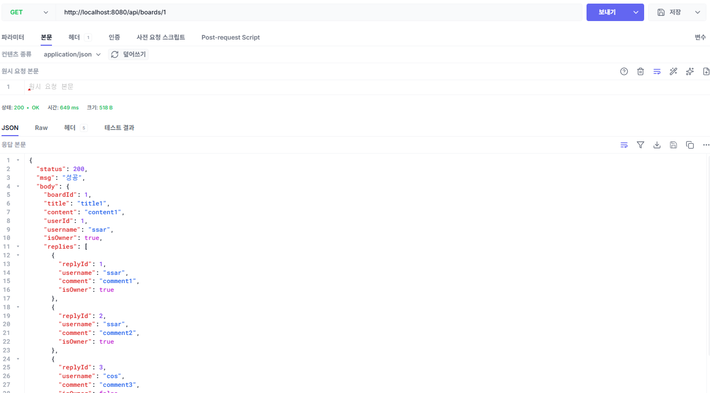
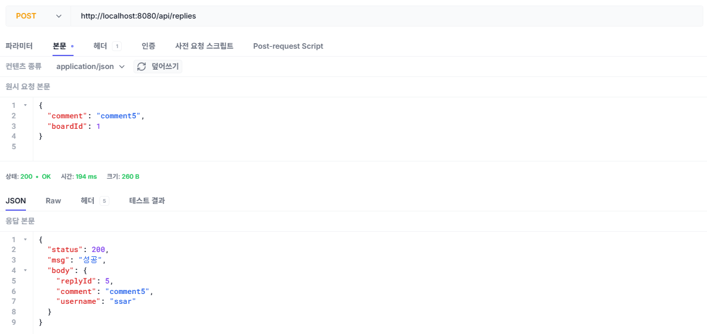
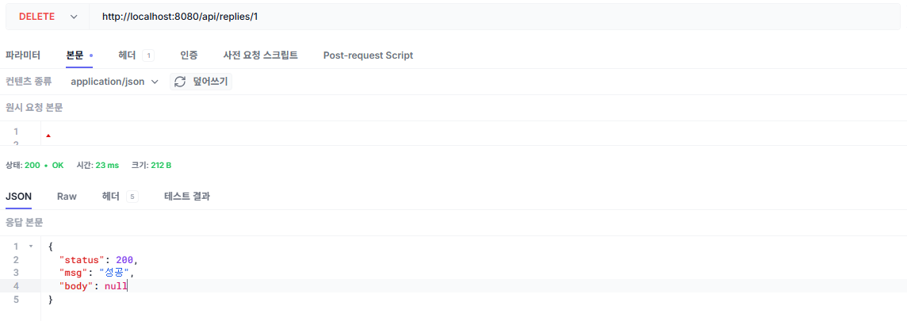

# 챕터 5. 댓글과 JPA 심화

인증 게시판을 완성한 오픈이는 마지막으로 댓글 기능을 추가하기로 했습니다. 댓글은 게시글 상세 화면에서 게시글과 함께 조회되어야 하는데, 게시글 하나에 여러 개의 댓글이 포함되므로 둘 사이를 연결할 **외래키는 댓글 테이블이 가져야 합니다**.

이때 데이터베이스는 외래키로 조인을 하면 양쪽 테이블의 데이터를 가져올 수 있지만, **JPA는 테이블이 아닌 객체 단위로 동작하기 때문에** 게시글->회원, 댓글->게시글 같이 **상대 객체를 필드로 가진 쪽에서만 접근할 수 있습니다**. 그래서 현재 구조에서는 게시글에서 댓글 데이터를 조회할 수 없습니다.

*지금 구조에서는 게시글에서 댓글 정보를 가져올 수가 없는데, JPA를 안 쓰고 직접 SQL을 사용해야 하나?*

오픈이는 선배에게 지금까지 만든 코드를 보여 주며 고민을 이야기했습니다. 선배는 게시글과 댓글 객체를 차례로 살펴보더니 말했습니다.

**선배**: "실무에서는 크게 두 가지 방법을 써요. **첫 번째는 쿼리를 두 번으로 나눠서 조회하는 거예요**. 먼저 게시글을 기준으로 회원 정보를 조회하고, 그다음 댓글을 기준으로 댓글 작성자 정보를 추가로 가져오는 거죠. 그리고 두 데이터를 DTO에서 합치는 방식이에요."

**오픈이**: "그럼 두 번째 방법은요?"

**선배**: "**JPA의 양방향 매핑을 쓰는 거예요**. 게시글에 댓글 필드를 추가하면 게시글에서도 댓글을 참조할 수 있게 돼요. 이렇게 하면 양쪽에서 참조가 가능하기 때문에 조인을 통해 한 번에 데이터를 가져올 수 있어요."

::::prep
**준비하기**

### 1. 소스 코드 클론

```bash [터미널] 레포 클론
git clone https://github.com/metacoding-06-springboot-v1/start.git
cd start/ch05
```

완성 코드는 final 레포(`https://github.com/metacoding-06-springboot-v1/final`)의 `ch05` 폴더에서 확인할 수 있습니다.

### 2. 파일 구조

이번 챕터에서 실습할 패키지 구조는 다음과 같습니다.

```text ch05 디렉토리
start/ch05/src/main/java/com/metacoding/spring/
├── board/
│   ├── Board.java                        # [참고] 게시글 엔티티
│   ├── BoardRepository.java              # [작성] 게시글 리포지토리
│   ├── BoardResponse.java                # [작성] 게시글 응답 DTO
│   └── BoardService.java                 # [작성] 게시글 서비스
└── reply/
    ├── Reply.java                        # [참고] 댓글 엔티티
    ├── ReplyController.java              # [작성] 댓글 컨트롤러
    ├── ReplyRepository.java              # [참고] 댓글 리포지토리
    ├── ReplyRequest.java                 # [작성] 댓글 요청 DTO
    ├── ReplyResponse.java                # [작성] 댓글 응답 DTO
    └── ReplyService.java                 # [작성] 댓글 서비스

start/ch05/src/main/resources/
└── db/data.sql                           # [참고] 더미 데이터
```
::::

## 5.1 양방향 매핑

먼저 게시글과 댓글의 관계를 알아보겠습니다. 하나의 게시글에는 여러 개의 댓글이 달릴 수 있습니다. 그리고 하나의 댓글은 하나의 게시글에만 속하므로, **게시글과 댓글은 1:N 관계입니다**.

관계형 데이터베이스에서는 외래 키가 어느 쪽에 있든 두 테이블을 조인하여 연관된 데이터를 가져올 수 있습니다. 예를 들어 외래 키가 댓글 테이블에 있으면, 조인으로 게시글과 댓글 데이터를 한 번에 조회할 수 있습니다.

<div class="svg-figure">
<svg viewBox="0 0 800 240" xmlns="http://www.w3.org/2000/svg" role="img" aria-label="board_tb 테이블과 reply_tb 테이블의 1대 N 관계. 두 테이블을 잇는 직선의 양끝에 화살촉이 달려 있다. 1번 게시글 한 행에 board_id가 1인 comment1, comment2, comment3 세 댓글이 대응한다.">
  <defs>
    <marker id="c5tbl-two" markerWidth="10" markerHeight="10" refX="8" refY="3" orient="auto-start-reverse"><path d="M0,0 L0,6 L8,3 z" fill="#475569"/></marker>
  </defs>
  <text x="165" y="68" text-anchor="middle" font-size="14" font-weight="800" fill="#0f172a">board_tb 테이블</text>
  <rect x="75" y="80" width="60" height="36" fill="#f1f5f9" stroke="#94a3b8" stroke-width="1.3"/>
  <rect x="135" y="80" width="120" height="36" fill="#f1f5f9" stroke="#94a3b8" stroke-width="1.3"/>
  <text x="105" y="103" text-anchor="middle" font-size="12.5" font-weight="700" font-family="ui-monospace, Consolas, monospace" fill="#334155">id</text>
  <text x="195" y="103" text-anchor="middle" font-size="12.5" font-weight="700" font-family="ui-monospace, Consolas, monospace" fill="#334155">title</text>
  <rect x="75" y="116" width="60" height="36" fill="#eef2ff" stroke="#c7d2fe" stroke-width="1.2"/>
  <rect x="135" y="116" width="120" height="36" fill="#eef2ff" stroke="#c7d2fe" stroke-width="1.2"/>
  <text x="105" y="139" text-anchor="middle" font-size="12.5" font-family="ui-monospace, Consolas, monospace" fill="#3730a3">1</text>
  <text x="195" y="139" text-anchor="middle" font-size="12.5" font-family="ui-monospace, Consolas, monospace" fill="#3730a3">title1</text>
  <rect x="75" y="152" width="60" height="36" fill="#fff" stroke="#cbd5e1" stroke-width="1.2"/>
  <rect x="135" y="152" width="120" height="36" fill="#fff" stroke="#cbd5e1" stroke-width="1.2"/>
  <text x="105" y="175" text-anchor="middle" font-size="12.5" font-family="ui-monospace, Consolas, monospace" fill="#475569">2</text>
  <text x="195" y="175" text-anchor="middle" font-size="12.5" font-family="ui-monospace, Consolas, monospace" fill="#475569">title2</text>
  <text x="590" y="32" text-anchor="middle" font-size="14" font-weight="800" fill="#0f172a">reply_tb 테이블</text>
  <rect x="455" y="44" width="50" height="36" fill="#f1f5f9" stroke="#94a3b8" stroke-width="1.3"/>
  <rect x="505" y="44" width="110" height="36" fill="#f1f5f9" stroke="#94a3b8" stroke-width="1.3"/>
  <rect x="615" y="44" width="110" height="36" fill="#f1f5f9" stroke="#94a3b8" stroke-width="1.3"/>
  <text x="480" y="67" text-anchor="middle" font-size="12.5" font-weight="700" font-family="ui-monospace, Consolas, monospace" fill="#334155">id</text>
  <text x="560" y="67" text-anchor="middle" font-size="12.5" font-weight="700" font-family="ui-monospace, Consolas, monospace" fill="#334155">comment</text>
  <text x="670" y="67" text-anchor="middle" font-size="12.5" font-weight="700" font-family="ui-monospace, Consolas, monospace" fill="#334155">board_id</text>
  <rect x="455" y="80" width="50" height="36" fill="#eef2ff" stroke="#c7d2fe" stroke-width="1.2"/>
  <rect x="505" y="80" width="110" height="36" fill="#eef2ff" stroke="#c7d2fe" stroke-width="1.2"/>
  <rect x="615" y="80" width="110" height="36" fill="#eef2ff" stroke="#c7d2fe" stroke-width="1.2"/>
  <text x="480" y="103" text-anchor="middle" font-size="12.5" font-family="ui-monospace, Consolas, monospace" fill="#3730a3">1</text>
  <text x="560" y="103" text-anchor="middle" font-size="12.5" font-family="ui-monospace, Consolas, monospace" fill="#3730a3">comment1</text>
  <text x="670" y="103" text-anchor="middle" font-size="12.5" font-family="ui-monospace, Consolas, monospace" fill="#3730a3">1</text>
  <rect x="455" y="116" width="50" height="36" fill="#eef2ff" stroke="#c7d2fe" stroke-width="1.2"/>
  <rect x="505" y="116" width="110" height="36" fill="#eef2ff" stroke="#c7d2fe" stroke-width="1.2"/>
  <rect x="615" y="116" width="110" height="36" fill="#eef2ff" stroke="#c7d2fe" stroke-width="1.2"/>
  <text x="480" y="139" text-anchor="middle" font-size="12.5" font-family="ui-monospace, Consolas, monospace" fill="#3730a3">2</text>
  <text x="560" y="139" text-anchor="middle" font-size="12.5" font-family="ui-monospace, Consolas, monospace" fill="#3730a3">comment2</text>
  <text x="670" y="139" text-anchor="middle" font-size="12.5" font-family="ui-monospace, Consolas, monospace" fill="#3730a3">1</text>
  <rect x="455" y="152" width="50" height="36" fill="#eef2ff" stroke="#c7d2fe" stroke-width="1.2"/>
  <rect x="505" y="152" width="110" height="36" fill="#eef2ff" stroke="#c7d2fe" stroke-width="1.2"/>
  <rect x="615" y="152" width="110" height="36" fill="#eef2ff" stroke="#c7d2fe" stroke-width="1.2"/>
  <text x="480" y="175" text-anchor="middle" font-size="12.5" font-family="ui-monospace, Consolas, monospace" fill="#3730a3">3</text>
  <text x="560" y="175" text-anchor="middle" font-size="12.5" font-family="ui-monospace, Consolas, monospace" fill="#3730a3">comment3</text>
  <text x="670" y="175" text-anchor="middle" font-size="12.5" font-family="ui-monospace, Consolas, monospace" fill="#3730a3">1</text>
  <rect x="455" y="188" width="50" height="36" fill="#fff" stroke="#cbd5e1" stroke-width="1.2"/>
  <rect x="505" y="188" width="110" height="36" fill="#fff" stroke="#cbd5e1" stroke-width="1.2"/>
  <rect x="615" y="188" width="110" height="36" fill="#fff" stroke="#cbd5e1" stroke-width="1.2"/>
  <text x="480" y="211" text-anchor="middle" font-size="12.5" font-family="ui-monospace, Consolas, monospace" fill="#475569">4</text>
  <text x="560" y="211" text-anchor="middle" font-size="12.5" font-family="ui-monospace, Consolas, monospace" fill="#475569">comment4</text>
  <text x="670" y="211" text-anchor="middle" font-size="12.5" font-family="ui-monospace, Consolas, monospace" fill="#475569">2</text>
  <line x1="261" y1="134" x2="449" y2="134" stroke="#475569" stroke-width="2" marker-start="url(#c5tbl-two)" marker-end="url(#c5tbl-two)"/>
  <text x="287" y="124" text-anchor="middle" font-size="15" font-weight="800" fill="#0f172a">1</text>
  <text x="423" y="124" text-anchor="middle" font-size="15" font-weight="800" fill="#0f172a">N</text>
</svg>
</div>

*그림 5-1. 테이블의 1:N 관계*

반면 자바 객체의 참조는 한 방향으로만 이루어집니다. **Reply** 객체에 **Board** 타입 필드를 두면 댓글에서 게시글을 참조할 수는 있지만, 반대로 **Board** 객체에는 댓글을 가리키는 필드가 없어 게시글에서 댓글에 접근할 수는 없습니다.

<div class="svg-figure">
<svg viewBox="0 0 720 230" xmlns="http://www.w3.org/2000/svg" role="img" aria-label="Board와 Reply가 나란히 놓이고, Reply의 board 필드에서 Board로 향하는 화살표 하나만 그려져 있다. Board 쪽에는 댓글을 가리키는 필드가 없다.">
  <defs>
    <marker id="c5obj-one" markerWidth="10" markerHeight="10" refX="8" refY="3" orient="auto"><path d="M0,0 L0,6 L8,3 z" fill="#334155"/></marker>
  </defs>
  <rect x="60" y="50" width="200" height="96" rx="10" fill="#fff" stroke="#4f46e5" stroke-width="2"/>
  <rect x="60" y="50" width="200" height="30" rx="10" fill="#eef2ff"/>
  <rect x="60" y="72" width="200" height="8" fill="#eef2ff"/>
  <text x="160" y="71" text-anchor="middle" font-size="15" font-family="monospace" font-weight="800" fill="#3730a3">Board</text>
  <text x="80" y="106" font-size="13" font-family="monospace" fill="#475569">id</text>
  <text x="80" y="130" font-size="13" font-family="monospace" fill="#475569">title</text>
  <rect x="460" y="50" width="200" height="124" rx="10" fill="#fff" stroke="#ff7849" stroke-width="2"/>
  <rect x="460" y="50" width="200" height="30" rx="10" fill="#fff4ed"/>
  <rect x="460" y="72" width="200" height="8" fill="#fff4ed"/>
  <text x="560" y="71" text-anchor="middle" font-size="15" font-family="monospace" font-weight="800" fill="#7b341e">Reply</text>
  <text x="480" y="106" font-size="13" font-family="monospace" fill="#475569">id</text>
  <text x="480" y="130" font-size="13" font-family="monospace" fill="#475569">comment</text>
  <text x="480" y="154" font-size="13" font-family="monospace" font-weight="800" fill="#c2410c">Board board</text>
  <path d="M460,98 H260" fill="none" stroke="#334155" stroke-width="2" marker-end="url(#c5obj-one)"/>
  <text x="360" y="88" text-anchor="middle" font-size="13" font-family="monospace" font-weight="800" fill="#334155">board</text>
  <text x="360" y="206" text-anchor="middle" font-size="13" fill="#475569">참조는 댓글에서 게시글 한 방향뿐입니다</text>
</svg>
</div>

*그림 5-2. 자바 객체의 한 방향 참조*

JPA에서는 이를 해결하기 위해 **양방향 매핑(Bidirectional Mapping)** 을 사용합니다. **Board** 엔티티에 댓글 목록 필드를 추가하고 **@OneToMany**를 설정해, **Reply**의 **@ManyToOne**과 서로 참조하도록 연결하는 방식입니다.

<div class="svg-figure">
<svg viewBox="0 0 720 250" xmlns="http://www.w3.org/2000/svg" role="img" aria-label="Board와 Reply가 나란히 놓이고, Board에는 OneToMany가 설정된 replies 필드가, Reply에는 ManyToOne이 설정된 board 필드가 있다. Reply에서 Board로 향하는 위쪽 화살표에는 board가, Board에서 Reply로 향하는 아래쪽 화살표에는 replies가 적혀 있어 서로를 참조한다.">
  <defs>
    <marker id="c5bi-one" markerWidth="10" markerHeight="10" refX="8" refY="3" orient="auto"><path d="M0,0 L0,6 L8,3 z" fill="#334155"/></marker>
  </defs>
  <rect x="60" y="50" width="200" height="148" rx="10" fill="#fff" stroke="#4f46e5" stroke-width="2"/>
  <rect x="60" y="50" width="200" height="30" rx="10" fill="#eef2ff"/>
  <rect x="60" y="72" width="200" height="8" fill="#eef2ff"/>
  <text x="160" y="71" text-anchor="middle" font-size="15" font-family="monospace" font-weight="800" fill="#3730a3">Board</text>
  <text x="80" y="106" font-size="13" font-family="monospace" fill="#475569">id</text>
  <text x="80" y="130" font-size="13" font-family="monospace" fill="#475569">title</text>
  <text x="80" y="154" font-size="13" font-family="monospace" font-weight="600" fill="#4f46e5">@OneToMany</text>
  <text x="80" y="178" font-size="13" font-family="monospace" font-weight="800" fill="#3730a3">List&lt;Reply&gt; replies</text>
  <rect x="460" y="50" width="200" height="148" rx="10" fill="#fff" stroke="#ff7849" stroke-width="2"/>
  <rect x="460" y="50" width="200" height="30" rx="10" fill="#fff4ed"/>
  <rect x="460" y="72" width="200" height="8" fill="#fff4ed"/>
  <text x="560" y="71" text-anchor="middle" font-size="15" font-family="monospace" font-weight="800" fill="#7b341e">Reply</text>
  <text x="480" y="106" font-size="13" font-family="monospace" fill="#475569">id</text>
  <text x="480" y="130" font-size="13" font-family="monospace" fill="#475569">comment</text>
  <text x="480" y="154" font-size="13" font-family="monospace" font-weight="600" fill="#c2410c">@ManyToOne</text>
  <text x="480" y="178" font-size="13" font-family="monospace" font-weight="800" fill="#c2410c">Board board</text>
  <path d="M460,104 H260" fill="none" stroke="#334155" stroke-width="2" marker-end="url(#c5bi-one)"/>
  <text x="360" y="94" text-anchor="middle" font-size="13" font-family="monospace" font-weight="800" fill="#334155">board</text>
  <path d="M260,146 H460" fill="none" stroke="#334155" stroke-width="2" marker-end="url(#c5bi-one)"/>
  <text x="360" y="168" text-anchor="middle" font-size="13" font-family="monospace" font-weight="800" fill="#334155">replies</text>
</svg>
</div>

*그림 5-3. 양방향 매핑*

### 5.1.1 댓글 엔티티

먼저 댓글 엔티티가 필요합니다. 댓글 엔티티는 댓글을 작성한 회원 정보와 댓글이 포함된 게시글 정보를 위해 **User** 엔티티와 **Board** 엔티티를 필드로 가집니다.

```java [참고] reply/Reply.java. 댓글 엔티티
@NoArgsConstructor
@Data
@Entity
@Table(name = "reply_tb")
public class Reply {
    @Id
    @GeneratedValue(strategy = GenerationType.IDENTITY)
    private Integer id;
    private String comment;

    // 외래 키 필드
    @ManyToOne(fetch = FetchType.LAZY)
    private User user;

    // 외래 키 필드
    @ManyToOne(fetch = FetchType.LAZY)
    private Board board;

    @CreationTimestamp
    private LocalDateTime createdAt;

    @Builder
    public Reply(Integer id, String comment, User user, Board board,
            LocalDateTime createdAt) {
        this.id = id;
        this.comment = comment;
        this.user = user;
        this.board = board;
        this.createdAt = createdAt;
    }
}
```

### 5.1.2 게시글에 댓글 목록 추가

다음으로 **Board** 엔티티에 **@OneToMany**를 사용해 양방향 매핑을 설정합니다. 그리고 `mappedBy` 속성에 상대 엔티티인 **Reply**의 `board` 필드를 지정하면 두 엔티티가 매핑됩니다.

```java [참고] board/Board.java. 댓글 목록 추가와 회원 필드 수정
    @ManyToOne(fetch = FetchType.LAZY)
    private User user;

    @OneToMany(mappedBy = "board", fetch = FetchType.LAZY,
            cascade = CascadeType.REMOVE) // 게시글을 삭제할 때 연관된 댓글도 함께 삭제한다
    private List<Reply> replies = new ArrayList<>();
```

두 필드에 함께 적은 `fetch`는 연관된 데이터를 언제 가져올지 정하는 속성입니다. 자세한 내용은 다음 절에서 설명합니다.

### 5.1.3 더미 데이터

준비된 더미 데이터에는 1번 게시글에 3개, 2번 게시글에 1개의 댓글이 포함되어 있습니다.

```sql [참고] resources/db/data.sql. 댓글 더미 데이터
insert into reply_tb(comment,board_id,user_id,created_at)
values('comment1',1,1,now());
insert into reply_tb(comment,board_id,user_id,created_at)
values('comment2',1,1,now());
insert into reply_tb(comment,board_id,user_id,created_at)
values('comment3',1,2,now());
insert into reply_tb(comment,board_id,user_id,created_at)
values('comment4',2,2,now());
```
## 5.2 즉시 로딩과 지연 로딩

지금까지는 연관관계를 매핑해 객체끼리 연결하는 방법을 알아보았습니다. 이번에는 JPA의 심화 내용으로, 연관된 엔티티를 조회하는 시점을 결정하는 로딩 전략을 알아보겠습니다.

객체 참조는 편리하지만, 당장 필요 없는 연관 데이터까지 데이터베이스에서 함께 조회하게 만들어 성능 저하의 주된 원인이 되곤 합니다. 회원 정보가 필요하지 않은 게시글 목록 화면을 예로 들어 보겠습니다. JPA는 기본적으로 게시글 목록을 조회할 때, 화면에 필요하지 않더라도 추가 쿼리를 실행해 회원 정보를 함께 가져옵니다.

이러한 성능 저하를 막기 위해 연관된 데이터를 **조회하는 시점**에 같이 가져올지, 아니면 **실제 사용하는 시점**에 조회할지에 대한 전략이 필요합니다.

### 5.2.1 즉시 로딩

**즉시 로딩(Eager Loading)** 은 특정 엔티티를 조회할 때 **연관된 엔티티의 데이터까지 같이 가져오는 방식**으로, **@ManyToOne** 어노테이션은 **즉시 로딩이 기본 전략**입니다. 그래서 `fetch` 속성을 별도로 지정하지 않으면, 게시글을 조회하는 순간 JPA가 회원 정보까지 조회해 **Board**의 `user` 필드에 채워 넣습니다.

이러한 설정 때문에 `findAll()`로 게시글 목록을 조회하면 문제가 발생합니다. JPA가 먼저 **board_tb**에서 게시글 목록을 읽어온 뒤, 각 게시글의 비어 있는 회원 정보를 채우기 위해 **user_tb**를 조회하는 쿼리를 따로 실행하기 때문입니다.

<div class="terminal-log">
  <div class="tl-chrome">
    <div class="tl-traffic"><span></span><span></span><span></span></div>
    <div class="tl-title">실행결과</div>
    <div class="tl-spacer"></div>
  </div>
  <div class="tl-body">
    <div><span class="tl-label">Hibernate:</span></div>
    <div>&nbsp;&nbsp;&nbsp;&nbsp;select b1_0.id, b1_0.content, b1_0.created_at, b1_0.title, b1_0.user_id</div>
    <div>&nbsp;&nbsp;&nbsp;&nbsp;from board_tb b1_0</div>
    <div><span class="tl-label">Hibernate:</span></div>
    <div>&nbsp;&nbsp;&nbsp;&nbsp;<span class="tl-hl">select u1_0.id, u1_0.created_at, u1_0.email, u1_0.password, u1_0.username</span></div>
    <div>&nbsp;&nbsp;&nbsp;&nbsp;from user_tb u1_0</div>
    <div>&nbsp;&nbsp;&nbsp;&nbsp;where u1_0.id=?<span class="tl-dim">&nbsp;&nbsp;&nbsp;&nbsp;&nbsp;&nbsp;&nbsp;&nbsp;← 1번 게시글의 작성자(ssar)</span></div>
    <div><span class="tl-label">Hibernate:</span></div>
    <div>&nbsp;&nbsp;&nbsp;&nbsp;<span class="tl-hl">select u1_0.id, u1_0.created_at, u1_0.email, u1_0.password, u1_0.username</span></div>
    <div>&nbsp;&nbsp;&nbsp;&nbsp;from user_tb u1_0</div>
    <div>&nbsp;&nbsp;&nbsp;&nbsp;where u1_0.id=?<span class="tl-dim">&nbsp;&nbsp;&nbsp;&nbsp;&nbsp;&nbsp;&nbsp;&nbsp;← 2번 게시글의 작성자(cos)</span></div>
  </div>
</div>

*그림 5-4. 즉시 로딩으로 목록을 조회할 때의 쿼리*

### 5.2.2 지연 로딩

이러한 문제를 해결하기 위해 사용하는 방식이 **지연 로딩(Lazy Loading)** 입니다.

지연 로딩은 **기준이 되는 엔티티만 먼저 가져오고, 연관된 엔티티는 실제로 데이터에 접근하는 순간에 조회하는 방식**입니다. **@ManyToOne**의 `fetch` 속성을 LAZY로 설정하면 지연 로딩이 적용됩니다.

```java board/Board.java. 회원 조회를 지연 로딩으로
    @ManyToOne(fetch = FetchType.LAZY)
    private User user;
```

LAZY로 설정하면 JPA는 게시글을 조회할 때 회원 엔티티 대신 외래 키(`user_id`)만 가져옵니다. 그리고 회원 정보가 필요한 시점에 외래 키를 사용해 쿼리를 실행합니다.

<div class="terminal-log">
  <div class="tl-chrome">
    <div class="tl-traffic"><span></span><span></span><span></span></div>
    <div class="tl-title">실행결과</div>
    <div class="tl-spacer"></div>
  </div>
  <div class="tl-body">
    <div><span class="tl-label">Hibernate:</span></div>
    <div>&nbsp;&nbsp;&nbsp;&nbsp;<span class="tl-hl">select b1_0.id, b1_0.content, b1_0.created_at, b1_0.title, b1_0.user_id</span></div>
    <div>&nbsp;&nbsp;&nbsp;&nbsp;from board_tb b1_0</div>
  </div>
</div>

*그림 5-5. 지연 로딩으로 목록을 조회할 때의 쿼리*

다만 지연 로딩에서는 연관된 엔티티에 접근할 때마다 조회 쿼리가 실행됩니다. 연관된 엔티티를 함께 사용하는 조회에서는 접근하는 횟수만큼 쿼리가 추가로 실행되므로, 즉시 로딩과 마찬가지로 쿼리 수가 늘어납니다.

:::tip
**실무에서는 어떤 로딩 방식을 쓰는가**

연관된 데이터를 가져올 때 추가 쿼리가 계속해서 발생하는 문제를 방지하기 위해, 실무에서는 가급적 모든 연관관계를 지연 로딩으로 설정합니다. 두 엔티티를 항상 함께 사용하는 경우에 한해 즉시 로딩을 고려할 수 있지만, 기본적으로는 지연 로딩을 유지하면서 필요한 경우에만 쿼리(join fetch)를 통해 한 번에 가져오는 방식이 더 안전합니다. JPA에서 **@ManyToOne**의 기본 전략은 즉시 로딩(EAGER)이며, **@OneToMany**는 지연 로딩(LAZY)입니다.
:::

## 5.3 댓글 목록

이제 게시글 상세 화면에 댓글 목록을 추가해 보겠습니다.

게시글 상세 화면에서는 게시글과 게시글 작성자 정보, 그리고 댓글과 댓글 작성자 정보를 함께 가져와야 합니다. 이때 게시글의 작성자는 항상 존재하므로 INNER JOIN을 사용합니다. 반면 **댓글까지 INNER JOIN을 사용하면 댓글이 없는 게시글은 조회되지 않으므로, LEFT OUTER JOIN을 사용해야 합니다**.

### 5.3.1 리포지토리

댓글 목록을 추가로 가져오기 위해 쿼리를 만들어 보겠습니다.

`board/BoardRepository.java`를 열어 아래와 같이 메서드를 작성합니다.

```java [실습 1] board/BoardRepository.java. 회원과 댓글을 함께 가져오는 조회
    @Query("select b from Board b join fetch b.user left join fetch b.replies r "
            + "left join fetch r.user where b.id = :boardId")
    Optional<Board> findByIdJoinUserAndReplies(@Param("boardId") Integer boardId);
```

게시글 상세 화면의 응답 데이터에는 댓글 목록과 각 댓글 작성자 정보가 모두 포함되어야 합니다. 만약 fetch 없이 일반 조인만 사용하면 댓글과 작성자 정보는 지연 로딩으로 조회되어, **실제로 사용하는 시점에 추가 쿼리가 실행**됩니다. 따라서 댓글과 댓글 작성자 정보도 join fetch를 사용하여 게시글과 함께 한 번에 가져옵니다.

### 5.3.2 응답 DTO

다음으로 데이터베이스에서 조회된 결과를 담을 수 있도록 DTO를 수정해 보겠습니다. 하나의 게시글에는 여러 개의 댓글이 있을 수 있으므로 DTO 내부에 **List** 타입의 DTO 필드를 추가하여 하나씩 담습니다.

`board/BoardResponse.java`의 **DetailDTO**를 아래와 같이 변경합니다.

```java [실습 2] board/BoardResponse.java. 상세에 댓글 목록 추가
    public record DetailDTO(
            Integer boardId,
            String title,
            String content,
            Integer userId,
            String username,
            Boolean isOwner,
            // List 타입의 댓글 DTO 필드
            List<ReplyDTO> replies) {

        public DetailDTO(Board board, User loginUser) {
            this(
                    board.getId(),
                    board.getTitle(),
                    board.getContent(),
                    board.getUser().getId(),
                    board.getUser().getUsername(),
                    // 비로그인이면 false, 요청자와 작성자가 같으면 true
                    loginUser != null
                            && loginUser.getId().equals(board.getUser().getId()),
                    // 댓글 엔티티를 하나씩 ReplyDTO로 변환해 List에 담기
                    board.getReplies().stream()
                            .map(reply -> new ReplyDTO(reply, loginUser))
                            .toList());
        }

        // List 타입의 댓글을 담는 DTO
        public record ReplyDTO(
                Integer replyId,
                String username,
                String comment,
                Boolean isOwner) {

            public ReplyDTO(Reply reply, User loginUser) {
                this(
                        reply.getId(),
                        reply.getUser().getUsername(),
                        reply.getComment(),
                        // 비로그인이면 false, 요청자와 작성자가 같으면 true
                        loginUser != null
                                && loginUser.getId().equals(reply.getUser().getId()));
            }
        }
    }
```

### 5.3.3 서비스

**BoardService**의 상세 메서드는 `findByIdJoinUser()` 대신 `findByIdJoinUserAndReplies()`를 호출합니다.

`board/BoardService.java`를 아래와 같이 변경합니다.

```java [실습 3] board/BoardService.java. 상세 조회를 join fetch로 교체
    public BoardResponse.DetailDTO 게시글상세(Integer boardId, User loginUser) {
        Board board = boardRepository.findByIdJoinUserAndReplies(boardId)
                .orElseThrow(() -> new Exception404("게시글을 찾을 수 없습니다"));
        return new BoardResponse.DetailDTO(board, loginUser);
    }
```

코드 작성이 완료되면 프로젝트를 실행 후 챕터 4에서 사용한 ssar의 JWT로 API 요청을 보냅니다. (JWT가 만료됐다면 ssar로 다시 로그인해 발급받습니다.)

```json [Hoppscotch] 게시글 상세 조회
GET http://localhost:8080/api/boards/1
```


*그림 5-6. 댓글이 담긴 상세 응답*

게시글 상세 응답에 댓글 목록이 함께 담긴 것을 확인할 수 있습니다.

## 5.4 댓글 추가

### 5.4.1 리포지토리

먼저 댓글을 저장할 리포지토리를 살펴보겠습니다. `reply/ReplyRepository.java`를 열어 아래 코드를 확인합니다.

```java [참고] reply/ReplyRepository.java. JpaRepository 상속
public interface ReplyRepository extends JpaRepository<Reply, Integer> {
}
```

### 5.4.2 요청 DTO

**SaveDTO**는 댓글 내용과 대상 게시글 번호를 받습니다. 댓글 작성자는 필터가 요청 객체에 담아 둔 로그인 회원으로 저장합니다.

`reply/ReplyRequest.java`를 열어 아래와 같이 작성합니다.

```java [실습 4] reply/ReplyRequest.java. 댓글 요청 DTO
public class ReplyRequest {

    public record SaveDTO(String comment, Integer boardId) {

        public Reply toEntity(User user, Board board) {
            return Reply.builder()
                    .comment(comment)
                    .user(user)
                    .board(board)
                    .build();
        }
    }
}
```

### 5.4.3 응답 DTO

댓글 추가 후 응답에 사용할 **DTO**를 정의합니다.

`reply/ReplyResponse.java`를 열어 아래와 같이 작성합니다.

```java [실습 5] reply/ReplyResponse.java. 댓글 응답 DTO
public class ReplyResponse {

    public record DTO(Integer replyId, String comment, String username) {

        public DTO(Reply reply) {
            this(
                    reply.getId(),
                    reply.getComment(),
                    reply.getUser().getUsername());
        }
    }
}
```

### 5.4.4 서비스

서비스는 요청으로 받은 게시글 번호로 게시글을 조회합니다. 그리고 조회한 게시글과 로그인 회원 정보로 댓글 엔티티를 생성해 저장합니다.

`reply/ReplyService.java`를 열어 아래와 같이 작성합니다.

```java [실습 6] reply/ReplyService.java. 댓글 저장
@RequiredArgsConstructor
@Service
public class ReplyService {

    private final ReplyRepository replyRepository;
    private final BoardRepository boardRepository;

    @Transactional
    public ReplyResponse.DTO 댓글추가(ReplyRequest.SaveDTO requestDTO,
            User loginUser) {
        // 1. 넘어온 유저가 없으면 로그인하지 않은 요청이다
        if (loginUser == null) {
            throw new Exception401("로그인이 필요합니다");
        }
        // 2. 댓글을 달 게시글을 찾아 연결한다
        Board board = boardRepository.findById(requestDTO.boardId())
                .orElseThrow(() -> new Exception404("게시글을 찾을 수 없습니다"));
        Reply savedReply =
                replyRepository.save(requestDTO.toEntity(loginUser, board));
        return new ReplyResponse.DTO(savedReply);
    }
}
```

### 5.4.5 컨트롤러

마지막으로 댓글 작성 엔드포인트를 구현합니다.

`reply/ReplyController.java`를 열어 아래와 같이 작성합니다.

```java [실습 7] reply/ReplyController.java. 댓글 작성 엔드포인트
@RequiredArgsConstructor
@RestController
@RequestMapping("/api/replies")
public class ReplyController {

    private final ReplyService replyService;

    @PostMapping
    public ResponseEntity<?> save(HttpServletRequest request,
            @RequestBody ReplyRequest.SaveDTO requestDTO) {
        User loginUser = (User) request.getAttribute("loginUser");
        ReplyResponse.DTO respDTO = replyService.댓글추가(requestDTO, loginUser);
        return Resp.ok(respDTO);
    }
}
```

작성이 끝나면 프로젝트 실행 후 ssar로 1번 게시글에 댓글을 추가해 보겠습니다.

```json [Hoppscotch] 댓글 작성
POST http://localhost:8080/api/replies

{
  "comment": "comment5",
  "boardId": 1
}
```


*그림 5-7. 댓글 추가 응답*

## 5.5 댓글 삭제

댓글 삭제는 로그인 여부를 확인하고, 댓글 작성자와 요청자가 같은지 검증한 뒤 삭제합니다.

### 5.5.1 서비스

`reply/ReplyService.java`의 `댓글삭제()`를 아래와 같이 작성합니다.

```java [실습 8] reply/ReplyService.java. 댓글 삭제
    @Transactional
    public void 댓글삭제(Integer replyId, User loginUser) {
        // 1. 넘어온 유저가 없으면 로그인하지 않은 요청이다
        if (loginUser == null) {
            throw new Exception401("로그인이 필요합니다");
        }
        Reply reply = replyRepository.findById(replyId)
                .orElseThrow(() -> new Exception404("댓글을 찾을 수 없습니다"));
        // 2. 작성자 본인이 아니면 막는다
        if (!reply.getUser().getId().equals(loginUser.getId())) {
            throw new Exception403("댓글을 삭제할 권한이 없습니다");
        }
        replyRepository.delete(reply);
    }
```

### 5.5.2 컨트롤러

`reply/ReplyController.java`의 `deleteById()`를 아래와 같이 작성합니다.

```java [실습 9] reply/ReplyController.java. 댓글 삭제 엔드포인트
    @DeleteMapping("/{replyId}")
    public ResponseEntity<?> deleteById(
            HttpServletRequest request, @PathVariable("replyId") Integer replyId) {
        User loginUser = (User) request.getAttribute("loginUser");
        replyService.댓글삭제(replyId, loginUser);
        return Resp.ok(null);
    }
```

작성이 끝나면 프로젝트 실행 후 ssar로 자신이 쓴 1번 댓글을 삭제해 보겠습니다.

```json [Hoppscotch] 댓글 삭제
DELETE http://localhost:8080/api/replies/1
```


*그림 5-8. 댓글 삭제 응답*

댓글이 정상적으로 삭제되었습니다.

댓글 기능을 끝으로 게시판 API에 필요한 모든 기능을 구현했습니다. 요청은 컨트롤러, 서비스, 리포지토리 계층을 거쳐 처리되며, 데이터는 DTO를 통해 안전하게 주고받습니다. 예외가 발생하면 전역 예외 처리기가 상태 코드와 실패 사유를 응답합니다. 또한, 필터에서 식별한 요청자 정보로 권한을 검증하여 게시글과 댓글은 작성자 본인만 제어할 수 있도록 구성했습니다.

:::remember
**이것만은 기억하자**

- **연관된 엔티티를 양쪽에서 참조하려면 양방향 매핑을 설정합니다.** 테이블은 외래 키 하나로 두 테이블을 조인하지만, 객체는 게시글에 댓글 필드를 추가해야 게시글에서 댓글을 참조할 수 있습니다.
- **연관된 엔티티를 함께 조회할 때는 join fetch를 활용해 쿼리를 최적화합니다.** 불필요한 데이터 조회를 막기 위해 평소에는 지연 로딩을 기본으로 하고, 게시글과 댓글을 함께 응답해야 할 때만 join fetch로 한 번에 가져옵니다.
- **댓글처럼 연관된 데이터가 없을 수도 있을 때는 LEFT OUTER JOIN을 사용합니다.** INNER JOIN을 쓰면 댓글이 없는 게시글은 조회 결과에서 누락됩니다. 따라서 LEFT OUTER JOIN으로 가져온 뒤, 게시글 응답 DTO 안에 댓글 목록을 담아 반환합니다.
:::