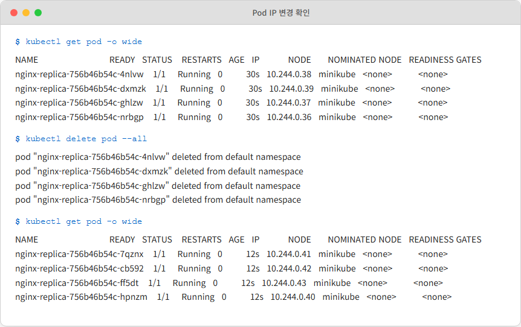

# Ch.5 Kubernetes 네트워킹

Deployment 덕분에 Pod가 죽어도 다시 살아나는 건 확인했습니다. "이제 새벽에 서버 죽었다고 연락 올 일은 없겠네!"라며 가벼운 발걸음으로 퇴근했죠. 하지만 다음 날 아침, 오픈이는 어제보다 더 당혹스러운 상황을 마주하게 됩니다.

출근하자마자 옆 자리 프론트엔드 개발자가 모니터 너머로 쏘아붙입니다.

*동료: "오픈 씨, 어제 알려준 백엔드 주소로 연결이 안 되는데요? 아침부터 작업이 안 돼서 우리 팀 다들 놀고 있어요."*
*오픈: "에이, 그럴 리가요. 제가 쿠버네티스로 자동 복구 다 걸어놨거든요. 잠깐만요."*

자신 있게 터미널을 열어보니, 서버(Pod)는 아주 건강하게 'Running' 상태였습니다. "멀쩡히 살아있는데 왜 그러지?"라며 상세 정보를 확인하던 오픈이의 눈동자가 흔들리기 시작했습니다. 밤사이 Pod가 어떤 이유에서인지 한 번 재시작되었고, 그 과정에서 IP 주소가 미세하게 바뀌어 있었기 때문입니다.


## 5.1 Service — Pod의 대표 전화번호

### 5.1.1 Pod IP가 매번 바뀐다

*'아... 살려주는 게 끝이 아니었구나. 주소가 자꾸 바뀌면 요청을 보낼 수가 없잖아'*

오픈이는 어제 확인했던 그 상황을 다시 재현해 봤습니다. Pod는 소모품이라 언제든 사라지고 다시 태어날 수 있고, 그때마다 이름과 IP는 초기화됩니다.

```bash
kubectl get pod -o wide           # 현재 IP 확인
kubectl delete pod --all          # Pod 삭제
kubectl get pod -o wide           # 다시 조회하면 IP가 달라져 있음
```



*그림 5-1 Pod 재시작 시 IP 변경 확인*

필요한 건 **"Pod IP가 어떻게 바뀌든 항상 같은 주소"** 였습니다. 한 매장에 직원이 여럿이고 교대 근무를 하더라도, 손님은 늘 가맹점 전화번호로 전화를 걸면 안내를 받을 수 있어야 합니다.

그 전화번호 역할을 하는 리소스의 이름이 **Service**입니다.


*그림 5-2 Service는 고정 주소를 제공. Pod IP가 바뀌어도 Service 주소는 그대로*

> **참고: Service**
> Pod 앞단의 고정 접근점입니다. Pod가 죽고 다시 태어나 IP가 바뀌어도 Service 주소는 바뀌지 않습니다. 뒤에 여러 Pod가 붙어 있으면 요청을 골고루 나눠줍니다(로드밸런싱).

### 5.1.2 Service 생성

Service가 연결할 Pod부터 다시 띄워 둡니다.

```bash
kubectl apply -f deploy-ex02.yml   # app=nginx 라벨의 Pod 4개 생성
kubectl get pod -l app=nginx       # 라벨로 Pod 확인
```

Pod가 준비됐으니 Service YAML을 적어 봅니다.

**yaml/service-ex01.yml**
```yaml
apiVersion: v1
kind: Service
metadata:
  name: nginx-service
spec:
  type: NodePort        # 노드 IP+포트로 외부 접근 가능한 타입
  selector:
    app: nginx
  ports:
  - port: 80            # 서비스가 클러스터 내부에서 열어둔 포트
```

Service가 Pod를 찾는 방법은 Deployment와 똑같이 **이름표(Label)** 매칭입니다. IP가 아니라 **이름표(Label)** 로 연결하기 때문에, Pod가 새로 태어나 IP가 바뀌어도 이름표만 같으면 Service는 요청을 정확히 전달합니다.

```bash
kubectl apply -f service-ex01.yml
```


*그림 5-3 Service 생성*

*'Pod는 그대로 두고 대표 번호만 얹었네.'*

### 5.1.3 Service 타입 — 어디서 접근할 수 있는가

YAML을 적으면서 오픈이는 `type: NodePort`라는 설정에 눈이 멈췄습니다.

*'포트(Port)? 아까 80번을 썼는데, 조회해 보니 31234 같은 생소한 번호가 또 있네? 대체 어디로 접속해야 하는 거지?'*

찾아보니 Service에는 접근 범위에 따라 세 가지 타입이 있었고, 범위가 **안쪽에서 바깥쪽으로** 넓어지는 계층이었습니다. 가장 안쪽인 ClusterIP부터 한 겹씩 바깥으로 넓혀 갑니다.

#### ClusterIP — 우리끼리만 아는 내선 번호

아무것도 적지 않으면 기본값으로 설정되는 타입입니다. 클러스터 내부의 Pod끼리만 서로를 부를 때 사용합니다.

*'서버만 DB에 접속하면 되지, 굳이 외부 손님에게 DB 주소를 알려줄 필요는 없잖아?" 그런 용도로 사용하는 타입이네'*


*그림 5-5 ClusterIP — 외부 요청은 닿지 못하고 내부 Pod끼리만 통신*

#### NodePort — 건물 정문에 뚫린 전용 창구

오픈이가 실습에서 썼던 방식입니다. 노드(서버)의 실제 IP에 특정 포트를 열어 외부 접근을 허용합니다.

*'아... 서비스마다 밖으로 나가는 통로를 따로 만들어주는 거구나. 지금은 테스트라 따로 NodePort 번호를 지정하지 않았는데, 나중에 외부에 정식으로 오픈을 하려면 이 NodePort 번호도 직접 지정을 해줘야 하는 거네.'*


*그림 5-6 NodePort — 노드의 특정 포트로 외부 접근 허용*

#### LoadBalancer — 대표 공인 IP와 안내원

실제 운영 환경에서 주로 쓰는 방식입니다. 클라우드 서비스(AWS, GCP 등)를 쓰고 있다면, K8s가 알아서 외부용 공인 IP를 발급받아 서비스에 딱 붙여줍니다.

사용자는 복잡한 노드 IP나 5자리의 포트 번호를 외울 필요가 없습니다. 그저 발급된 대표 IP 하나로 접속하면, LoadBalancer가 여러 노드에 트래픽을 골고루 나눠줍니다.


*그림 5-7 LoadBalancer — 클라우드가 공인 IP를 발급하고 여러 노드에 분산*

오픈이는 서비스 타입과 포트를 다음과 같이 정리했습니다.

| 타입 | 접근 범위 | 사용 사례 |
|------|----------|----------|
| **ClusterIP** | 클러스터 내부만 | 백엔드·DB 등 외부 노출 불필요한 서비스 |
| **NodePort** | 노드IP:포트로 외부 접근 가능 | 테스트, 개발 환경 |
| **LoadBalancer** | 공인 IP로 외부 접근 가능 | 클라우드 운영 환경 |

| 포트 종류 | 누구의 포트인가 | 역할 | 생략 시 |
|----------|----------------|------|--------|
| **nodePort** | **노드(서버) 입장**의 포트 | 외부에서 노드 IP로 접근할 때 열리는 30000~32767 포트 | 범위 내 자동 할당 |
| **port** | **Service 입장**의 포트 | 클러스터 내부에서 Service를 부를 때 쓰는 포트 | 필수 |
| **targetPort** | **Pod(컨테이너) 입장**의 포트 | 실제 컨테이너 안 애플리케이션이 귀를 대고 있는 포트 | `port` 값과 동일하게 설정 |

*'그런데 ClusterIP가 가상 주소라면, 실제로는 누가 요청을 Pod IP로 바꿔주는 거지? Pod IP가 바뀌어도 Service 주소가 그대로 유지되는 것도 누가 해주는 거고.'*

두 질문의 답은 5.3에서 전체 요청 흐름과 함께 한꺼번에 보기로 했습니다.

### 5.1.4 외부에서 Service 접속해 보기

`kubectl get service`로 방금 만든 Service의 상세를 봅니다. `PORT(S)` 열에 `80:3xxxx/TCP` 형태로 찍히는데, 콜론 뒤 다섯 자리 숫자가 자동 할당된 `nodePort`입니다. Minikube는 내부적으로 VM이나 컨테이너로 한 겹 싸여 있어서 호스트 PC에서 NodePort로 바로 찌르기가 까다롭습니다. Minikube에는 이 상황을 위해 임시 터널을 뚫어주는 명령이 있습니다.

```bash
minikube service nginx-service --url   # Service 접근 URL 생성
```


*그림 5-10 minikube service URL 생성*

명령을 치면 터미널이 URL 한 줄을 뱉은 뒤 커서가 그대로 멈춰 섭니다. 프롬프트가 돌아오지 않아 잠깐 당황스럽지만, 이 명령은 원래 실행 중 터미널을 계속 잡고 있는 종류입니다. 생성된 URL로 접속하면 Minikube 내부 Service를 거쳐 Pod로 요청이 전달됩니다.


*그림 5-11 브라우저에서 nginx 접속 확인*

`minikube service --url`은 실행 중 터미널을 계속 잡아 두기 때문에, 확인이 끝나면 `CTRL + C`로 빠져나와야 다음 명령을 이어서 칠 수 있습니다.

이제 오늘 첫 과제를 다시 꺼내볼 차례입니다. Pod를 전부 지워 보고, 같은 URL로 다시 접속해 봅니다.

```bash
kubectl delete pod --all
minikube service nginx-service --url
```


*그림 5-12 Pod 삭제 후 Service 접속*

새 URL로 접속해 봤더니 nginx 페이지가 그대로 떴습니다. 뒤에서 Pod는 새로 태어나 IP가 바뀌었을 텐데, 화면에는 그 흔적이 남아 있지 않았습니다. Service 뒤에서 누군가가 주소를 갈아 끼운 덕분입니다. 누가 어떻게 해줬는지는 5.3에서 자세히 봅니다.

*'IP가 바뀌는 동안에도 사용자는 눈치채지 못한다.'*

Pod IP가 바뀌어도 Service 주소는 그대로였습니다. 프로젝트에서 프론트가 백엔드를 부를 때 이 주소를 쓰면 됩니다. 그런데 실제로 사용자가 브라우저에서 접속하려면 아직 한 단계가 더 필요했습니다.

실습이 끝나면 리소스를 정리합니다.

```bash
kubectl delete deployment nginx-replica
kubectl delete service nginx-service
```

## 5.2 Ingress — 건물 안내 데스크

### 5.2.1 왜 Service만으로는 부족한가

Service 덕분에 Pod를 안정적으로 찾아가는 길은 뚫렸습니다. 그런데 프로젝트에 프론트·백엔드 서비스가 따로 있으니, 사용자가 접속할 때 포트 번호를 외우고 다닐 수는 없었습니다.

**동료**: "포트 번호 외우고 다녀야 돼? 주소만 주면 안 돼?"
**팀장**: "운영 환경에선 도메인으로 들어오잖아. 경로로 나눠 줘야지."

`minikube service`는 터미널 하나를 점유하는 임시 경로였고, NodePort는 `노드IP:3xxxx` 식이라 사용자가 포트 번호를 외우고 입력해야 했습니다. 실제 서비스는 도메인 기반 URL로 접속되고, 같은 도메인 안에서 경로로 나누어 씁니다. Service 혼자서는 이걸 감당하지 못합니다.

*'챕터 3에서 NGINX가 URL 경로 보고 요청 나눠줬던 그 역할 아닌가.'*

K8s 안에서 그 역할을 맡는 리소스가 **Ingress**입니다.

### 5.2.2 L4와 L7 — 고속도로 분기점과 안내 데스크

네트워크 계층이 IP와 포트만 보고 넘기는 경우와 URL 경로를 읽고 안내하는 경우가 다르다는 설명을 봤는데 그 차이가 와닿지 않았습니다. 둘 다 요청을 넘기는 건 같은데 왜 나눠야 하는 걸까. 찾아보니 L4, L7이라는 단어가 나왔습니다. 비유로 보니 한 번에 잡혔습니다.

차가 고속도로 분기점에 들어섭니다. 분기점은 단순합니다. "수도권 방향입니까, 호남선 방향입니까." 방향과 차선만 확인하고, 차 안에 누가 탔는지, 무슨 짐이 실렸는지는 보지 않습니다. 빠르지만 판단은 단순합니다.

건물 1층 안내 데스크는 다릅니다. "어느 부서 찾으세요?" 방문자의 목적지를 듣고, 약속이 있는지 확인한 뒤, 적절한 층과 방 번호를 알려줍니다. 이름과 목적을 읽어야 안내할 수 있습니다. 느리지만 판단은 정확합니다.


*그림 5-13 L4는 빠른 분배, L7은 정확한 라우팅*

K8s 네트워크도 이 둘로 나뉩니다. L4 계층이 고속도로 분기점 역할을 맡아 IP와 포트만 보고 Pod에 넘깁니다. **Ingress Controller**가 건물 안내 데스크 역할을 맡아 URL 경로와 Host 헤더를 읽고 해당 Service로 안내합니다. L4 계층을 구체적으로 누가 담당하는지는 5.3에서 다시 봅니다.

> **참고: L4와 L7**
> L4는 IP와 포트 번호까지만 봅니다. L7은 HTTP의 URL 경로, Host 헤더처럼 사람이 읽는 수준의 내용을 봅니다.

| 구분 | L4 | L7 (Ingress Controller) |
|------|-----------------|------------------------|
| 확인하는 것 | IP, Port | URL 경로, Host 헤더 |
| 비유 | 고속도로 분기점 | 건물 안내 데스크 |

JSON을 해석하고 비즈니스 로직을 태우는 건 최종 목적지인 **Pod 안의 애플리케이션**이 하는 일입니다. 네트워크 계층은 어디까지나 **전달**만 합니다.

*'빠르게 나누는 층과 자세히 읽는 층을 따로 두면 되는 거구나.'*

### 5.2.3 Ingress 리소스와 Ingress Controller

Minikube에서 Ingress를 켜는 법을 찾아봤더니 `minikube addons enable ingress`라는 명령이 나왔습니다. 그런데 공식 문서를 보다 보니 Ingress라는 단어가 두 가지 의미로 쓰이고 있었습니다. 어떤 곳에선 YAML 파일을 Ingress라 하고, 어떤 곳에선 실제로 요청을 받는 프로그램을 Ingress라 했습니다. 같은 이름인데 역할이 다른 두 개, **Ingress 리소스**와 **Ingress Controller**였습니다.

> **참고: Ingress 리소스 vs Ingress Controller**
> - **Ingress 리소스**: 클러스터 외부의 HTTP/HTTPS 요청을 내부 어느 Service로 보낼지 **라우팅 규칙을 YAML로 선언**하는 K8s 오브젝트입니다. 규칙만 담고 있을 뿐, 스스로 요청을 받지는 않습니다.
> - **Ingress Controller**: 위의 Ingress 리소스(규칙)를 읽어 **실제로 외부 요청을 받아 처리하는 소프트웨어**입니다. Nginx Ingress Controller가 대표적입니다.

| 구성 요소 | 역할 | 비유 |
|-----------|------|------|
| **Ingress 리소스** | 어떤 요청을 어떤 Service로 보낼지 정의한 규칙 (YAML) | 안내 데스크의 부서 안내판 |
| **Ingress Controller** | 실제로 외부 요청을 받아 처리하는 소프트웨어 | 안내 데스크에 앉은 직원 |

리소스(YAML)는 "규칙을 적어둔 안내판"이고 Controller는 "그 안내판을 읽고 실제로 손님을 안내하는 직원"입니다. 둘 다 있어야 Ingress가 동작합니다. 규칙 없이 직원만 두면 어디로 안내할지 모르고, 직원 없이 규칙만 붙여두면 종잇장입니다.

*'YAML은 규칙, Controller는 실행. 선언과 집행을 분리한 것도 K8s답네.'*

Ingress 리소스 YAML과 실제 배포는 **다음 챕터 종합실습에서 직접 Ingress를 구성하고 브라우저에서 접속**하는 것으로 확인합니다.

## 5.3 브라우저에서 Pod까지 — 전체 경로 조립

### 5.3.1 보이지 않는 손 — kube-proxy와 Endpoint Controller

ClusterIP가 어느 장비에 붙어 있는 건지 궁금해서 찾아봤습니다. 노드 IP도 아니고 Pod IP도 아닌 낯선 주소였습니다.

어디에도 없었습니다. **가상 주소**라서 실제 장비에 할당되지 않았습니다. 그럼 이 주소로 오는 요청은 누가 처리할까요. 보통이라면 받아줄 장비가 없으니 허공에 떠돌다 버려질 텐데, K8s에서는 사정이 다릅니다. 노드의 커널에 심어둔 규칙이 목적지 주소를 실제 Pod IP로 바꿔줍니다.

여기서 오픈이는 챕터 2에서 본 장면이 겹쳐 올라왔습니다. Docker가 포트포워딩을 구현한 방식이 같은 원리였습니다. 호스트 포트로 들어온 패킷의 목적지를 컨테이너 포트로 바꿔치기. 그 기술의 이름이 **iptables DNAT**입니다. K8s에서도 기본 모드에서는 같은 iptables를 쓰고, 그걸 관리하는 주체가 **kube-proxy**입니다.

> **참고: kube-proxy와 iptables**
> kube-proxy는 모든 워커 노드에서 동작하며, 노드의 리눅스 커널에 네트워크 규칙을 심는 역할을 합니다. ClusterIP로 오는 요청의 목적지를 실제 Pod IP로 바꿔치기. 챕터 2에서 본 Docker의 DNAT과 같은 메커니즘입니다.


*그림 5-8 kube-proxy는 NodePort 처리와 ClusterIP 처리를 모두 담당*

그런데 Pod IP가 바뀌면 iptables 규칙은 누가 고칠까요. **Endpoint Controller**가 맡습니다.

> **참고: Endpoint / Endpoint Controller**
> - **Endpoint**: "이 Service 뒤에 실제로 어떤 Pod IP들이 연결돼 있는지"를 담은 K8s 리소스입니다. 한 줄짜리 주소록이라고 생각하면 됩니다.
> - **Endpoint Controller**: Pod IP 변화를 감시하면서 그 주소록(Endpoint 리소스)을 갱신하는 주체입니다.

흐름은 이렇습니다. Service가 고정 주소를 잡고, Endpoint Controller가 Pod IP 변화를 감시해 주소록을 고치고, kube-proxy가 그 주소록대로 iptables 규칙을 깝니다. 이 삼각 구도가 이어지는 5.3.2의 전체 요청 흐름에서 어떻게 맞물리는지 봅니다.

*'Service가 선언, Endpoint Controller가 주소록, kube-proxy가 현장. 셋이서 한 팀.'*

### 5.3.2 요청의 여정

오픈이는 지금까지 쌓아둔 부품을 하나의 흐름으로 이어 봤습니다. 사용자가 브라우저에 URL을 치는 순간부터 Pod에 도달하기까지, 요청은 여러 손을 차례로 거칩니다. 한꺼번에 보면 복잡해서 한 단계씩 따라가 보기로 했습니다.

**1단계 — 클러스터 입구(NodePort)에 도착**

브라우저에 `localhost:9000`을 친 순간, 요청은 가장 먼저 클러스터의 NodePort로 향했습니다. 클러스터 내부망은 바깥에서 직접 들어올 수 없고, 노드에 뚫린 이 포트 하나가 유일한 출입문이었습니다.


*그림 5-15 외부 요청이 NodePort로 진입*

**2단계 — kube-proxy가 Ingress Controller Pod으로 전달**

NodePort에 도착한 요청을 처음 받아내는 건 kube-proxy였습니다. 미리 심어둔 iptables 규칙에 따라 요청은 Ingress Controller Pod 쪽으로 넘어갑니다. 여기까지 kube-proxy는 URL이 무엇인지 들여다보지 않고, 그저 "Ingress 담당자에게 건네준다"는 역할만 했습니다.


*그림 5-16 kube-proxy가 iptables 규칙으로 Ingress Controller Pod에 전달*

**3단계 — Ingress Controller가 URL을 읽고 Service 선택**

Ingress Controller Pod은 요청의 URL과 Host 헤더를 처음으로 읽습니다. 5.2절에서 적어둔 Ingress 리소스의 규칙을 보고 "이 경로는 Service A로, 저 경로는 Service B로" 방향을 갈라줬습니다. 5.2.2의 "안내 데스크" 비유가 여기서 L7 라우팅이라는 이름으로 다시 등장합니다.


*그림 5-17 Ingress Controller가 URL을 읽고 적절한 Service를 선택*

**4단계 — kube-proxy가 ClusterIP를 Pod IP로 변환**

Ingress가 고른 Service는 ClusterIP라는 가상 주소만 들고 있었습니다. 이 가상 주소를 실제 Pod IP로 바꿔주는 일은 각 노드의 kube-proxy가 맡습니다. 5.3.1에서 본 iptables DNAT가 두 번째로 동작하고, 뒤에 붙은 여러 Pod 중 하나로 요청이 실제로 떨어집니다.


*그림 5-18 각 노드의 kube-proxy가 ClusterIP를 Pod IP로 변환 (L4 로드밸런싱)*

**5단계 — Pod 도달 + 뒤에서 돌던 Endpoint Controller**

요청이 드디어 Pod에 닿고, 애플리케이션이 비로소 비즈니스 로직을 태웁니다. 그런데 이 경로는 어떻게 **항상** 유효할 수 있었을까. 배경에서는 Endpoint Controller가 Pod IP 변화를 꾸준히 감시하며 Endpoints 목록을 갱신해두고, kube-proxy가 그 목록을 읽어 iptables 규칙을 최신으로 유지해둔 덕분이었습니다. 요청 흐름 바깥에서 조용히 돌던 이 컨트롤러가, 4단계의 iptables 규칙을 미리 준비해두고 있었던 셈입니다.


*그림 5-19 Pod 도달 + Endpoint Controller가 뒤에서 Endpoints를 최신으로 유지*

다섯 단계를 한 표로 정리하면 이렇습니다.

| 단계 | 컴포넌트 | 하는 일 | 확인하는 것 |
|------|---------|--------|-----------|
| 1 | **NodePort** | 외부 요청을 클러스터 내부로 받음 | Port |
| 2 | **kube-proxy (1차)** | iptables 규칙으로 Ingress Controller에 전달 | IP, Port |
| 3 | **Ingress Controller** | URL 경로/Host 확인 → 적절한 Service 선택 | URL, Host |
| 4 | **kube-proxy (2차)** | ClusterIP를 실제 Pod IP로 변환 | IP, Port |
| 5 | **Pod** | 애플리케이션이 요청 처리 | 비즈니스 로직 |

각 단계가 보는 게 딱 하나씩입니다. Ingress는 URL, Service는 Label, kube-proxy는 IP/Port. 비즈니스 로직은 Pod까지 가야 태워집니다.

*'각자 한 가지만 본다. 그래서 고장 나도 어느 층에서 막혔는지 찾기 쉽다.'*

다음 챕터 종합실습에서 이 경로가 실제로 동작하는 걸 확인하게 됩니다.

## 이것만은 기억하자

- **Service는 Pod의 대표 전화번호.** Pod가 생겼다 사라지며 IP가 바뀌지만, Service는 고정된 접근점을 제공하고 여러 Pod 사이에 요청을 돌려가며 나눠줍니다.
- **kube-proxy는 챕터 2 iptables가 클러스터로 확장된 것.** ClusterIP는 어디에도 할당되지 않은 가상 주소로, 커널이 iptables DNAT로 실제 Pod IP로 바꿔 보냅니다. Endpoint Controller가 Pod IP 변화를 감시해 주소록을 최신으로 유지합니다.
- **Ingress는 건물 안내 데스크.** L4 고속도로 분기점(kube-proxy)은 IP/Port만 보고, L7 안내 데스크(Ingress Controller)는 URL과 Host를 읽습니다. 규칙을 적는 **Ingress 리소스**와 규칙을 집행하는 **Ingress Controller**는 서로 다릅니다.
- **Docker 네트워크가 이름만 바꿔 Kubernetes에서 반복됩니다.** iptables DNAT → kube-proxy, 컨테이너명 DNS → CoreDNS + Service 이름, NGINX 경로 라우팅 → Ingress Controller. 같은 원리, 다른 규모입니다.

네트워크 경로는 갖춰졌습니다. 그런데 프로젝트를 K8s에 실제로 올리려면 아직 빠진 게 있었습니다. DB 비밀번호를 이미지에 박아두면 안 되고, DB 컨테이너가 재시작될 때 데이터가 날아가서도 안 됩니다. 다음 챕터에서 **설정·비밀번호·데이터 영속성**을 추가하고, 챕터 3에서 만든 풀스택 구성을 Kubernetes 위에 올려 봅니다.
