# Ch.5 Kubernetes 네트워킹

다음 날 아침. 사무실 자리에 앉은 오픈이는 어제 띄워 둔 Pod 네 개를 화면에 다시 펼쳐 놓고 잠시 뿌듯함을 즐겼습니다. 같은 서버가 네 대. 하나가 죽어도 세 대가 받아주고, 롤링 업데이트로 새 버전까지 끊김 없이 올라가는 걸 어제 직접 확인했으니까요. 모니터에 나란히 찍힌 네 줄의 Running 상태가, 식어 가는 커피잔 너머에서 꽤 든든해 보였습니다.

*'그래서... 이제 이걸 어떻게 쓰지?'*

네 대를 만들어 놨는데 실제 요청은 어느 주소로 보내야 하는지가 애매했습니다. 터미널에 Pod 목록을 IP와 함께 펼쳐 보니, 10.244로 시작하는 서로 다른 네 개의 주소가 가지런히 찍혀 나왔습니다. 같은 nginx 백엔드인데 네 개가 다 다른 주소라니, 이 중 어느 쪽으로 요청을 보내야 하는지 감이 오지 않았습니다.

게다가 어제 마지막에 읽었던 한 문장이 마음에 걸렸습니다. Pod는 새로 태어날 때마다 이름도 주소도 새로 받는다고 했다. 그렇다면 오늘 이 네 개의 주소 중 하나를 고른다 해도, 그 주소가 내일도 같은 Pod를 가리킨다는 보장은 없었습니다.

**팀장**: "IP 외워 두고 쓰려는 거 아니지?"

뒤쪽 자리에서 툭 던진 한마디가 방금 전 의심을 그대로 짚어 주었습니다. 네 대 앞에 서서 요청을 대신 받아 주고, 뒤에서 누가 죽고 태어나든 바깥쪽 주소는 바꾸지 않는, 그런 고정된 대표 창구가 필요했습니다.


## 5.1 Service — Pod의 대표 전화번호

### 5.1.1 흔들리지 않는 주소, Service

'고정된 대표 창구'에 정식 이름이 있을 것 같아 오픈이는 쿠버네티스 문서를 뒤적였습니다. 얼마 지나지 않아 눈에 익은 단어 하나에서 손이 멈췄습니다. **Service**. Pod 앞에 서서 요청을 대신 받고, 뒤에서 Pod가 몇 번을 새로 태어나 IP가 바뀌든 바깥에 내걸린 주소는 그대로 두는 리소스였습니다.

가맹점 안에서 직원이 교대 근무를 해도, 손님은 전화번호 하나로 주문을 할 수 있습니다. Service는 쿠버네티스 안에서 바로 그 전화번호 역할을 맡습니다.

*'이게 팀장님이 말한 그 고정 창구였네.'*

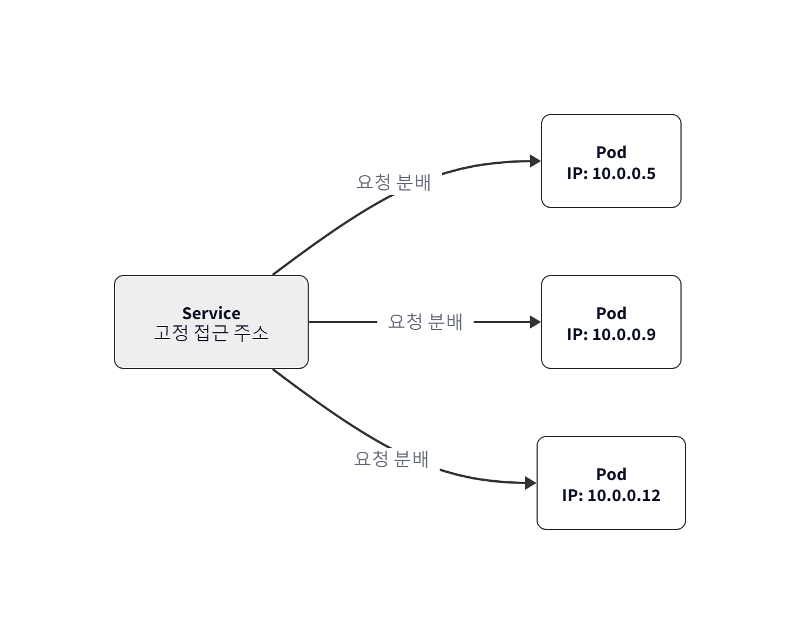

*그림 5-2 Service는 고정 주소를 제공. Pod IP가 바뀌어도 Service 주소는 그대로*

> **참고: Service**
>
> Pod 앞단의 고정 접근점입니다. Pod가 죽고 다시 태어나 IP가 바뀌어도 Service 주소는 바뀌지 않습니다. 뒤에 여러 Pod가 붙어 있으면 요청을 골고루 나눠줍니다(로드밸런싱).

### 5.1.2 Service 생성

Service를 얹으려면 뒤에 붙을 Pod들이 먼저 준비돼 있어야 했습니다. 오픈이는 어제 연습하면서 썼던 Deployment (`deploy-ex02.yml`)을 다시 올려 Pod 네 개부터 복구해 두었습니다.

```bash
kubectl apply -f deploy-ex02.yml   #  Pod 4개 생성
```

이제 그 앞에 세울 Service YAML을 적을 차례였습니다.

**yaml/service-ex01.yml**
```yaml
apiVersion: v1
kind: Service
metadata:
  name: nginx-service
spec:
  type: NodePort        # 노드 IP+포트로 외부 접근 가능한 타입
  selector:
    app: nginx          # 이 라벨을 가진 Pod를 뒤에 붙임
  ports:
  - port: 80            # Service 내부 포트 (클러스터 안에서 부를 때)
    targetPort: 80      # Pod(컨테이너)가 귀를 대고 있는 포트
    nodePort: 30080     # 노드 IP로 외부에서 접근할 때 열리는 포트 (30000~32767)
```

Service가 Pod를 찾는 방법은 Deployment와 똑같이 **이름표(Label)** 매칭입니다. IP가 아니라 **이름표(Label)** 로 연결하기 때문에, Pod가 새로 태어나 IP가 바뀌어도 이름표만 같으면 Service는 요청을 정확히 전달합니다.

### 5.1.3 Service 타입 — 어디서 접근할 수 있는가

YAML을 적으면서 오픈이는 포트 설정에 눈이 멈췄습니다.

*'type: NodePort 이건 뭐지 ? 그리고 포트를 80번을 썼는데, targetPort도 있고 nodePort도 있네?'*

찾아보니 Service에는 접근 범위에 따라 세 가지 타입이 있었고, 범위가 **안쪽에서 바깥쪽으로** 넓어지는 계층이었습니다. 가장 안쪽인 ClusterIP부터 한 겹씩 바깥으로 넓혀 갑니다.

#### ClusterIP — 우리끼리만 아는 내선 번호

아무것도 적지 않으면 기본값으로 설정되는 타입입니다. 위부에서는 접근이 불가능하고 클러스터 내부의 Pod끼리만 서로를 부를 때 사용합니다.

*'백엔드 서버만 DB에 접속하면 되지, 굳이 외부 손님에게 DB 주소를 알려줄 필요는 없잖아?" 그런 용도로 사용하는 타입이네'*

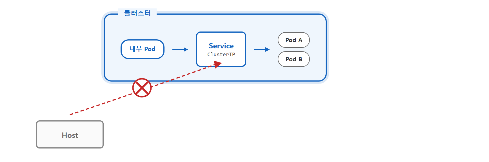

*그림 5-5 ClusterIP — 외부 요청은 닿지 못하고 내부 Pod끼리만 통신*

#### NodePort — 건물 정문에 뚫린 전용 창구

오픈이가 실습에서 썼던 방식입니다. 노드(서버)의 실제 IP에 특정 포트를 열어 외부 접근을 허용합니다.

*'YAML에 30080처럼 nodePort를 넣으면 이 포트로 외부에서 들어올 수 있는 거구나. 그런데 서비스마다 이런 노드포트를 하나씩 열어 주면 금방 관리가 번거로워지겠는데...'*


*그림 5-6 NodePort — 노드의 특정 포트로 외부 접근 허용*

#### LoadBalancer — 대표 공인 IP와 안내원

실제 운영 환경에서 주로 쓰는 방식입니다. 클라우드 서비스(AWS, GCP 등)를 쓰고 있다면, K8s가 알아서 외부용 공인 IP를 발급받아 서비스에 딱 붙여줍니다.

사용자는 복잡한 노드 IP나 5자리의 포트 번호를 외울 필요가 없습니다. 그저 발급된 대표 IP 하나로 접속하면, LoadBalancer가 여러 노드에 트래픽을 골고루 나눠줍니다.

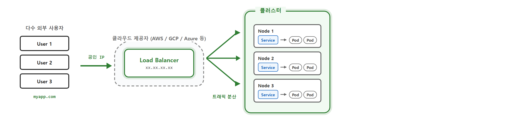

*그림 5-7 LoadBalancer — 클라우드가 공인 IP를 발급하고 여러 노드에 분산*

> **참고: Minikube에서의 LoadBalancer**
>
> LoadBalancer 타입은 클라우드 서비스의 로드밸런서와 연동되어야 공인 IP를 자동으로 할당받을 수 있습니다. Minikube 같은 로컬 환경에서는 이 기능이 지원되지 않기 때문에, minikube tunnel 같은 명령어를 사용해 외부와 통하는 경로를 직접 연결해 주어야 합니다.


오픈이는 서비스 타입과 포트를 다음과 같이 정리했습니다.

| 타입 | 접근 범위 | 사용 사례 |
|------|----------|----------|
| **ClusterIP** | 클러스터 내부만 | 백엔드·DB 등 외부 노출 불필요한 서비스 |
| **NodePort** | 노드IP:포트로 외부 접근 가능 | 테스트, 개발 환경 |
| **LoadBalancer** | 공인 IP로 외부 접근 가능 | 클라우드 운영 환경 |

| 포트 종류 | 누구의 포트인가 | 역할 | 생략 시 |
|----------|----------------|------|--------|
| **nodePort** | **노드(서버) 입장**의 포트 | 외부에서 노드 IP로 접근할 때 열리는 30000~32767 포트 | 30000~32767 중 자동 할당 |
| **port** | **Service 입장**의 포트 | 클러스터 내부에서 Service를 부를 때 쓰는 포트 | 생략 불가 (필수) |
| **targetPort** | **Pod(컨테이너) 입장**의 포트 | 실제 컨테이너 안 애플리케이션이 귀를 대고 있는 포트 | `port` 값과 동일하게 설정 |


### 5.1.4 외부에서 Service 접속해 보기

오픈이는 이제 떨리는 마음으로 서비스를 실행해 보기로 했습니다.

```bash
kubectl apply -f service-ex01.yml
```

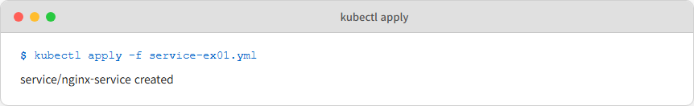

*그림 5-3 Service 생성*

*'아, 그러니까 이 Service라는 녀석이 NGINX처럼 고정된 입구 역할을 해준다는 거지?'*

하지만 여기서 오픈이는 첫 번째 난관에 부딪힙니다. Minikube는 호스트 PC와 격리된 환경이라 브라우저에서 저 포트 번호로 바로 접속하기가 까다롭기 때문입니다.

*'분명 30080을 열어 뒀는데 localhost:30080으로 치니 먹통이네. minikube가 내 노트북이랑 한 꺼풀 떨어져 있어서 그런 건가...'*

> **참고: Minikube는 왜 localhost로 안 닿는가**
>
> Minikube는 내 컴퓨터 내부에서 독립적으로 실행되는 가상 환경(VM 또는 컨테이너)입니다. 즉, Minikube는라는 가상 세계와 우리 PC라는 현실 세계 사이의 네트워크가 격리되어 있습니다. 그래서 도커에서 포트포워딩으로 컨테이너에 연결했던 것 처럼, Minikube와 통신할 수 있는 명령어가 있어야 합니다.

| 명령어 | 용도 |
|--------|------|
| `minikube service <이름> --url` | NodePort·LoadBalancer Service의 접근 URL을 생성. 터미널이 열려 있는 동안만 터널 유지 |
| `minikube tunnel` | LoadBalancer Service에 외부 IP(EXTERNAL-IP)를 부여. 별도 터미널에서 실행 |
| `kubectl port-forward service/<이름> 8080:80` | 호스트의 8080 포트를 Service의 80 포트로 포워딩. Pod에도 직접 가능 |

다행히 Minikube에는 이 상황을 위해 임시 통로를 뚫어주는 전용 명령어가 있습니다.

```bash
minikube service nginx-service --url   # Service 접근 URL 생성
```

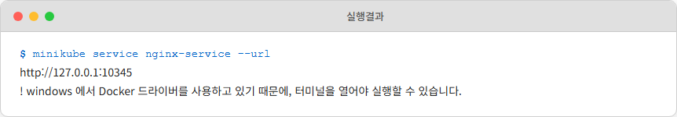

*그림 5-10 minikube service URL 생성*

명령을 치자 터미널에 URL 한 줄이 나타나더니 커서가 그대로 멈춰 섰습니다.

*'어? 왜 프롬프트가 안 나오지? 고장 났나?'*

잠깐 당황했지만, 이 명령은 터미널을 계속 붙잡고 있어야 통로가 유지되는 방식이라는 걸 깨달았습니다. 생성된 URL을 복사해 브라우저에 입력하자, 드디어 기다리던 NGINX 화면이 나타났습니다.

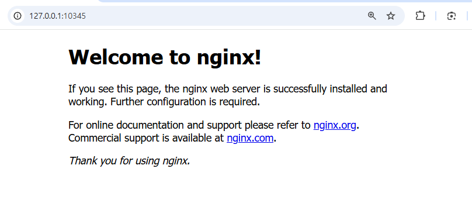

*그림 5-11 브라우저에서 nginx 접속 확인*

이제 확인이 끝났으니 CTRL + C를 눌러 명령을 종료하고, 앞서 말한 핵심 — Pod가 죽어도 Service 주소는 그대로라는 약속 — 이 실제로도 맞는지 확인해 볼 차례입니다. 4장에서 배웠듯 Deployment가 정원을 지키니, 지워도 곧바로 새 Pod가 태어날 것이었습니다. 오픈이는 과감하게 모든 Pod를 삭제해 버렸습니다.

```bash
kubectl delete pod --all
minikube service nginx-service --url
```

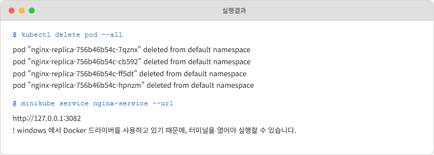

*그림 5-12 Pod 삭제 후 Service 접속*

Pod를 전부 지웠으니 잠시 뒤에 다시 접속하면 에러가 날까요? 결과는 의외였습니다. 다시 생성된 URL로 접속해도 NGINX 페이지는 여전히 평온하게 떠 있었습니다.

*'와, 진짜네. Pod가 새로 만들어지면 IP가 바뀌었을 텐데. Service가 뒤에서 주소를 알아서 연결해주는구나.'*

이처럼 Pod의 IP가 매번 바뀌더라도 Service 주소는 고정되어 있습니다. 프로젝트를 할 때 프론트엔드가 백엔드를 부를 때도 이 Service 주소만 알면 되는 셈입니다.

## 5.2 Ingress — 안내 데스크

### 5.2.1 왜 Service만으로는 부족한가

Service 덕분에 Pod를 안정적으로 찾아가는 길은 뚫렸습니다. 오픈이는 뿌듯한 마음으로 동료들에게 자랑했지만, 곧바로 예상치 못한 피드백이 돌아왔습니다.

**동료** : *"오픈아, 근데 접속할 때마다 이 다섯 자리 포트 번호를 외워서 입력해야 돼? 주소만 딱 주면 안 돼?"*
**팀장** : *"Service만으로는 URL 경로까지는 못 나눠 주지. 도메인으로 들어온 요청을 경로별로 갈라 주는 친구는 따로 있어."*

오픈이는 머리가 복잡해졌습니다. `minikube service`는 터미널 하나를 계속 잡아먹는 임시 방편이었고, NodePort는 서비스마다 30000~32767 중 다른 포트 번호를 외워야 하는 데다 도메인으로 접근할 방법도 없었습니다.

*'사용자는 naver.com 같은 도메인 주소로 접속하고 싶을 텐데, Service만으로는 이걸 감당하기 어렵겠구나. Docker 실습에서 NGINX 리버스 프록시가 URL 경로를 보고 요청을 나눠 줬던 것처럼, 쿠버네티스 안에도 같은 역할을 하는 녀석이 따로 있을 것 같은데...'*

그렇게 찾아낸 정답이 바로 **Ingress** 입니다.

### 5.2.2 L4와 L7 — 고속도로 분기점과 안내 데스크

오픈이가 서비스에게 "URL을 읽어달라"고 부탁할 수 없었던 이유는, 서비스가 **L4(전송 계층)**라는 낮은 층에 살고 있기 때문입니다. 반면 인그레스는 **L7(응용 계층)**이라는 높은 층에 살며 사람의 말을 이해합니다. 이 차이는 생각보다 큽니다.

**L4(서비스)의 방식: 고속도로 분기점**

차가 고속도로 분기점에 들어섭니다. 분기점은 단순합니다. "표지판에 적힌 번호가 몇 번인가요? 왼쪽인가요, 오른쪽인가요?" 차 안에 누가 탔는지, 짐칸에 햄버거가 들었는지 피자가 들었는지는 궁금해하지 않습니다. 오직 **방향과 숫자(IP와 Port)**만 확인하고 빠르게 차를 밀어낼 뿐입니다.

**L7(인그레스)의 방식: 건물 1층 안내 데스크**

건물 1층 안내 데스크는 다릅니다. "어떤 목적으로 방문하셨나요?" 방문자의 말을 듣고, 예약 내용을 확인한 뒤, 적절한 부서로 안내합니다. 방문자가 내뱉는 **말의 의미(도메인과 URL 경로)**를 읽어야 안내가 가능한 거죠. 분기점보다 과정은 복잡하지만 훨씬 똑똑합니다.


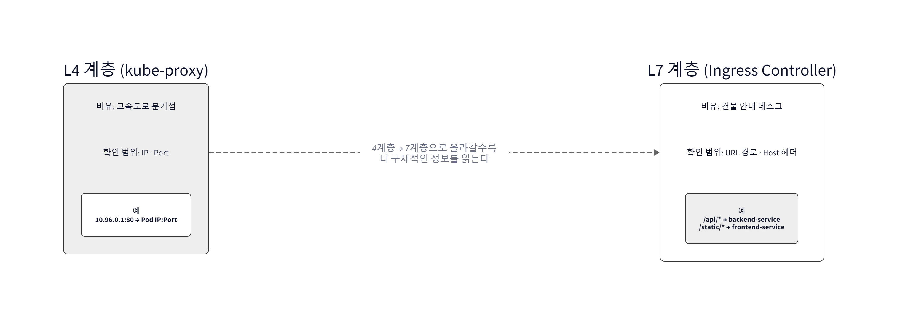
*그림 5-13 L4는 빠른 분배, L7은 정확한 라우팅*

쿠버네티스 네트워크도 이 둘로 나뉩니다. Service는 숫자 주소만 보고 기계적으로 요청을 넘기는 분기점이고, Ingress는 URL 경로와 호스트 이름을 읽어 "아, 이건 A 가맹점으로 가야겠네"라고 판단하는 안내 데스크입니다.

> **참고: L4와 L7**
> L4는 IP와 포트 번호까지만 봅니다. L7은 HTTP의 URL 경로, Host 헤더처럼 사람이 읽는 수준의 내용을 봅니다.

| 구분 | L4 | L7 (Ingress Controller) |
|------|-----------------|------------------------|
| 확인하는 것 | IP, Port | URL 경로, Host 헤더 |
| 비유 | 고속도로 분기점 | 건물 안내 데스크 |

*'서비스는 겉봉투에 적힌 주소(숫자)만 보고 던지는 우체부고, 인그레스는 편지 내용(글자)을 읽고 부서를 정해주는 비서구나!'*

오픈이는 이제야 왜 팀장님이 인그레스를 강조했는지 이해했습니다. 사용자가 도메인과 URL로 접속하려면, 결국 '글자를 읽을 줄 아는' 인그레스가 꼭 필요했던 것입니다.

### 5.2.3 Ingress 리소스와 Ingress Controller

Minikube에서 인그레스를 사용하려고 보니 한 가지 독특한 점이 있었습니다. 인그레스는 이름이 같은 두 가지 요소가 한 팀으로 움직입니다. 바로 **Ingress 리소스** 와 **Ingress Controller** 입니다.

> **참고: Ingress 리소스 vs Ingress Controller**
> - **Ingress 리소스**: 클러스터 외부의 HTTP/HTTPS 요청을 내부 어느 Service로 보낼지 **라우팅 규칙을 YAML로 선언**하는 K8s 오브젝트입니다. 규칙만 담고 있을 뿐, 스스로 요청을 받지는 않습니다.
> - **Ingress Controller**: 위의 Ingress 리소스(규칙)를 읽어 **실제로 외부 요청을 받아 처리하는 프로그램** 입니다.

| 구성 요소 | 역할 | 비유 |
|-----------|------|------|
| **Ingress 리소스** | 어떤 **도메인과 URL 경로의** 요청을 어떤 Service로 보낼지 정의한 규칙 (YAML) | 안내 데스크의 부서 안내판 |
| **Ingress Controller** | 실제로 외부 요청을 받아 처리하는 소프트웨어 | 안내 데스크에 앉은 직원 |


안내판(리소스)만 있고 직원이 없으면 손님은 어디로 갈지 모르고 멍하니 서 있게 됩니다. 반대로 직원(컨트롤러)은 있는데 안내판이 없으면 직원은 누구를 어디로 보낼지 알 수 없습니다.

쿠버네티스에서는 이 둘을 분리해 둡니다. 덕분에 우리는 YAML 파일(리소스)만 수정해서 안내판의 내용만 슥 갈아 끼우면 됩니다. 그러면 안내소에 앉아 있는 직원(컨트롤러)이 바뀐 안내판을 보고 알아서 손님들을 새로운 길로 안내하기 시작합니다.

*'문서(YAML)는 규칙일 뿐이고, 그걸 실행하는 몸체(Controller)가 따로 있는 구조구나. 역시 쿠버네티스는 선언과 집행을 철저히 나누네.'*

#### Ingress Controller 깨우기

한 가지 중요한 점이 있습니다. Ingress 리소스는 쿠버네티스 기본 오브젝트라 바로 쓸 수 있지만, **Ingress Controller는 별도로 설치하거나 활성화해 줘야** 안내 데스크에 직원이 출근합니다. Minikube에는 기본 내장된 Ingress Controller가 있어 한 줄로 깨울 수 있습니다.

```bash
minikube addons enable ingress          # Ingress Controller 애드온 활성화
```

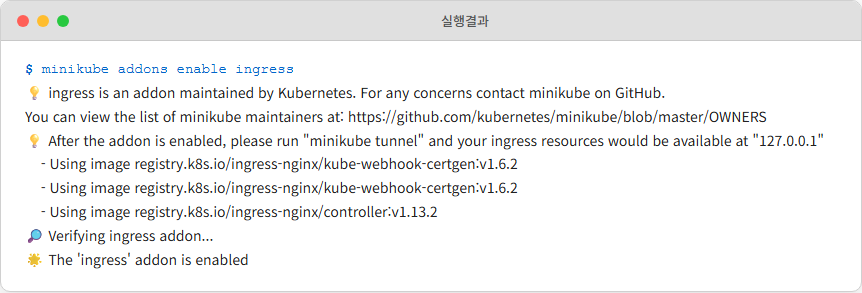

*그림 5-14 minikube에서 ingress 애드온 활성화*

활성화가 끝나면 `ingress-nginx` 네임스페이스에 컨트롤러 Pod가 올라옵니다.

```bash
kubectl get pods -n ingress-nginx       # 컨트롤러 Pod 확인
```

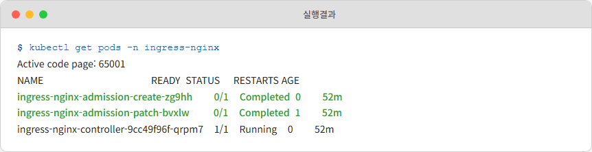

*그림 5-15 Ingress Controller Pod가 Running 상태*

직원이 출근했으니 이제 안내판(Ingress 리소스)을 붙일 차례입니다. 다음 YAML은 `demo.local` 도메인의 `/`로 들어온 요청을 앞서 만든 `nginx-service`로 보내는 가장 단순한 규칙입니다.

**yaml/ingress-ex01.yml**
```yaml
apiVersion: networking.k8s.io/v1
kind: Ingress
metadata:
  name: nginx-ingress
spec:
  ingressClassName: nginx         # 어느 Controller가 이 규칙을 집행할지 지정
  rules:
  - host: demo.local              # 도메인 기반 라우팅
    http:
      paths:
      - path: /
        pathType: Prefix
        backend:
          service:
            name: nginx-service   # 5.1.2에서 만든 Service
            port:
              number: 80
```

```bash
kubectl apply -f ingress-ex01.yml       # 규칙 등록
kubectl get ingress                     # 등록된 Ingress 확인
```

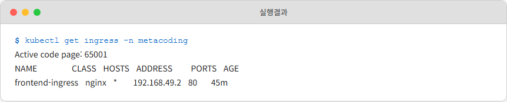

*그림 5-16 Ingress 리소스 등록 확인*

Minikube는 노드가 하나라 외부 DNS가 없으므로, 실제 운영 환경의 DNS를 흉내 내기 위해 `/etc/hosts`(Windows는 `C:\Windows\System32\drivers\etc\hosts`)에 `demo.local`을 `minikube ip`로 매핑해 두고 `minikube tunnel`을 띄우면 브라우저에서 도메인으로 접속해 볼 수 있습니다.

```bash
minikube tunnel                         # 별도 터미널에서 실행
```

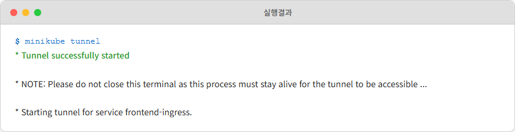

*그림 5-17 minikube tunnel 실행으로 외부 접근 경로 확보*

브라우저에서 `http://demo.local/`로 접속하면, 안내판을 따라 요청이 `nginx-service`까지 도착해 익숙한 NGINX 화면이 뜹니다.

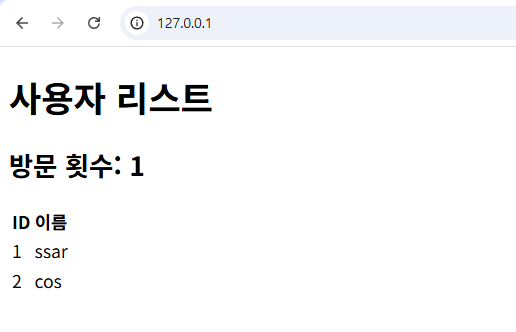

*그림 5-18 도메인으로 접속한 Ingress 경유 요청 결과*

이제 더 이상 다섯 자리 포트를 외워 입력할 필요가 없어졌습니다. 도메인과 경로만으로 요청이 알아서 제자리를 찾아갑니다.


## 5.3 브라우저에서 Pod까지 — 전체 경로 조립

### 5.3.1 보이지 않는 손 — kube-proxy와 Endpoint Controller

오픈이는 문득 궁금해졌습니다. "도대체 ClusterIP라는 주소는 실제 어느 장비에 붙어 있는 걸까?" 노드 IP도 아니고 Pod IP도 아닌 이 낯선 주소의 실체를 찾아 나섰습니다.

놀랍게도 ClusterIP는 물리적인 어디에도 존재하지 않는 가상 주소였습니다. 랜카드에 할당된 주소가 아니니, 보통이라면 이 주소로 오는 요청은 받아줄 장비가 없어 허공에서 사라져야 합니다. 하지만 쿠버네티스에서는 **각 워커 노드의 커널**에 심어둔 **'가로채기 규칙'**이 이 가상 주소를 실제 Pod IP로 바꿔치기합니다. 클러스터의 모든 노드가 똑같은 규칙을 들고 있기 때문에, 요청이 어느 노드로 들어오든 목적지를 찾아갈 수 있습니다. Minikube는 노드가 하나뿐이라 그 노드가 규칙을 전부 들고 있는 셈입니다.

여기서 오픈이는 챕터 2에서 본 장면을 떠올렸습니다. Docker가 호스트 포트로 들어온 패킷을 컨테이너 포트로 목적지를 바꿔 전달하던 iptables DNAT 기술입니다. 쿠버네티스에서도 이 규칙을 모든 노드에 심고 관리하는 주체가 있는데, 그가 바로 kube-proxy입니다.

> **참고: kube-proxy와 iptables**
> kube-proxy는 모든 워커 노드에서 동작하며, 리눅스 커널의 네트워크 규칙(iptables)을 관리합니다. 외부에서 들어오는 NodePort 요청이나 내부의 ClusterIP 요청을 가로채서 실제 Pod IP로 연결해 주는 '교통 경찰' 역할을 합니다.

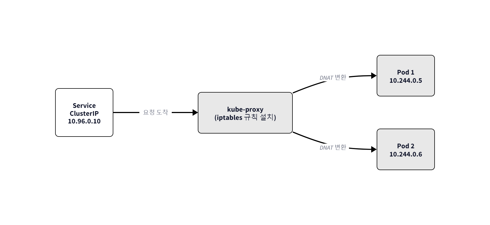

*그림 5-19 kube-proxy는 NodePort 처리와 ClusterIP 처리를 모두 담당*

그런데 Pod가 새로 태어나 IP가 바뀌면 이 규칙은 누가 업데이트할까요? 바로 **Endpoint Controller** 가 담당합니다.

> **참고: Endpoint / Endpoint Controller**
> - **Endpoint**: "이 Service 뒤에 실제로 연결된 Pod IP 리스트"를 담은 리소스입니다. 일종의 **'실시간 주소록'**입니다.
> - **Endpoint Controller**: 각 Service의 selector와 매칭되는 Pod들의 상태를 지켜보며, 해당 Service의 주소록(Endpoint)을 최신으로 갱신하는 관리자입니다. Pod가 Running으로 바뀌거나 종료될 때, 또는 라벨이 변할 때마다 곧바로 주소록을 고쳐 씁니다.

결국 **Service는 '간판'**이고, **Endpoint는 '실제 주소록'**이며, **kube-proxy는 그 주소록을 토대로 길을 닦는 '현장 요원'**인 셈입니다. 주소록은 Endpoint Controller가 뒤에서 자동으로 갱신해 주고, 현장 요원은 최신 주소록을 토대로 요청을 나를 뿐입니다. 셋이 한 팀으로 움직여야 비로소 요청이 목적지를 찾아갑니다.

*'Service가 선언, Endpoint Controller가 주소록, kube-proxy가 현장. 셋이서 한 팀.'*

### 5.3.2 요청의 여정

오픈이는 지금까지 쌓아둔 부품을 하나의 흐름으로 이어 봤습니다. 사용자가 브라우저에 URL을 치는 순간부터 Pod에 도달하기까지, 요청은 여러 손을 차례로 거칩니다. 한꺼번에 보면 복잡해서 한 단계씩 따라가 보기로 했습니다.

**1단계 — 클러스터 입구(NodePort)에 도착**

브라우저에 `demo.local` 같은 도메인으로 요청을 보내면, 요청은 노드에 뚫린 **NodePort(외부 통로)**를 통해 클러스터 정문으로 진입합니다. 이때는 아직 '포트 번호'라는 숫자만 보고 들어오는 L4 단계입니다.

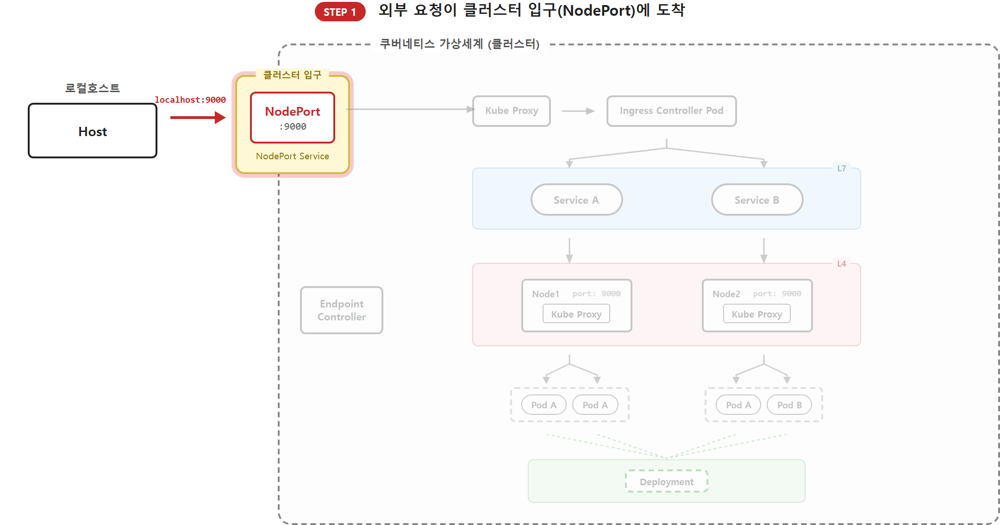

*그림 5-20 외부 요청이 NodePort로 진입*

**2단계 — 안내 데스크(Ingress Controller)로 전달**

NodePort로 들어온 요청은 kube-proxy가 미리 심어둔 규칙에 따라 인그레스 컨트롤러 Pod로 배달됩니다. 여기까지는 아직 편지 봉투를 뜯지 않은 상태입니다. 그저 "안내 데스크 직원이 처리할 패킷"이라는 것만 알고 전달될 뿐입니다.

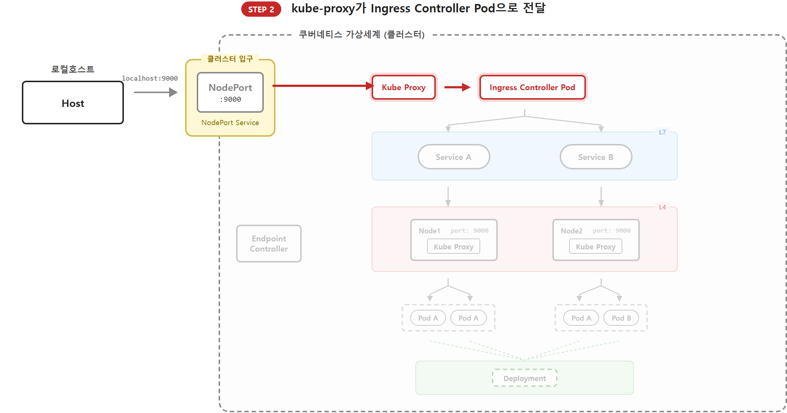

*그림 5-21 kube-proxy가 iptables 규칙으로 Ingress Controller Pod에 전달*

**3단계 — URL을 읽고 목적지 결정 (L7 라우팅)**

인그레스 컨트롤러 Pod에 도착한 요청은 이제야 편지 봉투를 뜯습니다. Ingress Controller 소프트웨어가 HTTP 헤더의 **Host**와 **URL 경로**를 읽고, 등록된 Ingress 규칙과 하나씩 대조합니다. 매칭되는 규칙을 찾으면 "이 요청은 저 뒤쪽 `nginx-service`로 가야겠군"이라고 판단합니다. 숫자가 아니라 글자의 의미를 해석하는 L7 단계입니다.

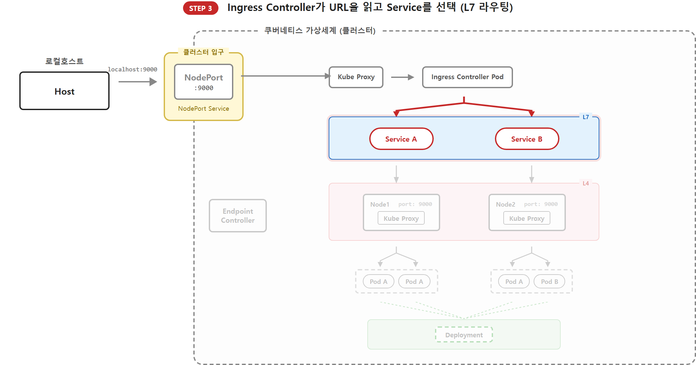

*그림 5-22 Ingress Controller가 URL을 읽고 적절한 Service를 선택*

**4단계 — 다시 내부 통로(ClusterIP)로 전달**

목적지를 정했으니 다시 보내야 합니다. Ingress Controller는 매칭된 백엔드 Service 이름(예: `nginx-service:80`)으로 요청을 넘기고, 이 요청이 네트워크 계층에 닿는 순간 각 노드의 kube-proxy가 개입합니다. 가상 주소인 ClusterIP를 실제로 살아 있는 백엔드 Pod의 IP로 바꿔치기합니다. (다시 숫자를 보고 나르는 L4 단계)

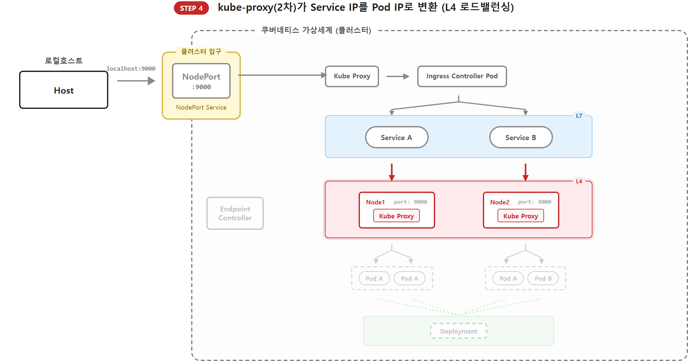

*그림 5-23 각 노드의 kube-proxy가 ClusterIP를 Pod IP로 변환 (L4 로드밸런싱)*

**5단계 — 최종 목적지(Pod) 도달**

드디어 요청이 백엔드 Pod에 닿았습니다. 애플리케이션은 비로소 비즈니스 로직을 실행해 주문을 처리하거나 데이터를 응답합니다. 이 모든 과정 내내, Endpoint Controller는 뒤에서 Pod의 상태를 감시하며 주소록을 최신으로 유지하고 있었습니다. 그 조용한 갱신이 없었다면 kube-proxy의 iptables 규칙은 순식간에 낡은 주소로 가득 찼을 겁니다.

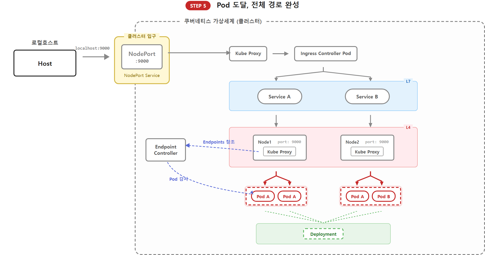

*그림 5-24 Pod 도달 + Endpoint Controller가 뒤에서 Endpoints를 최신으로 유지*

다섯 단계를 한 표로 정리하면 이렇습니다.

| 단계 | 컴포넌트 | 하는 일 | 의사결정 기준 |
|------|---------|--------|--------------|
| 1 | **NodePort** | 외부 요청을 클러스터 내부로 수신 | nodePort (30000~32767) |
| 2 | **kube-proxy (1차)** | iptables 규칙으로 Ingress Controller Pod 지목 | Service ClusterIP, Endpoint 목록 |
| 3 | **Ingress Controller** | Host·경로를 읽어 적절한 Service 선택 | Host 헤더, URL 경로 |
| 4 | **kube-proxy (2차)** | 백엔드 Service의 ClusterIP를 Pod IP로 변환 | Service ClusterIP, Endpoint 목록 |
| 5 | **Pod** | 애플리케이션이 비즈니스 로직 실행 | 요청 데이터 |

각 단계가 담당하는 층이 딱 정해져 있습니다. Ingress는 L7에서 **Host와 경로**를 읽어 목적지를 판단하고, Service는 **Label**로 Pod 그룹을 정의하며, kube-proxy는 **IP와 Port**로 실제 연결을 만듭니다. 비즈니스 로직은 Pod까지 가야 비로소 태워집니다.

오픈이는 이 복잡한 과정을 정리하며 무릎을 쳤습니다.

*'서비스는 통로를 만들고 인그레스는 방향을 잡으며 협업하는 구조네. 각자 맡은 역할이 단순해서 관리하기가 훨씬 편하겠다.'*


## 이것만은 기억하자

- **Service는 Pod의 대표 전화번호.** : Pod는 소모품이라 IP가 수시로 바뀌지만, 서비스는 변하지 않는 주소를 제공합니다. 또한, 하나의 서비스에 여러 개의 Pod를 연결해 요청을 골고루 나누는 로드밸런싱 기능도 수행합니다.
- **kube-proxy와 Endpoint Controller가 네트워크를 실시간으로 관리** : 서비스의 주소(ClusterIP)는 실제 장비에 할당되지 않은 가상 주소입니다. kube-proxy가 각 노드 커널 수준에서 이 주소를 실제 Pod IP로 연결해 주며, Endpoint Controller는 Pod의 상태를 감시하며 주소록을 최신으로 유지합니다.
- **Ingress는 도메인과 URL을 읽는 안내소.** : 숫자(IP/Port)만 보는 서비스(L4)와 달리, 인그레스는 문자열(URL/Host)을 읽고 경로를 결정하는 L7 라우팅을 담당합니다. 규칙을 정의한 **리소스(YAML)**와 그 규칙을 실제로 집행하는 **컨트롤러(S/W)**가 한 팀으로 움직이며, Minikube에서는 `minikube addons enable ingress`로 컨트롤러를 깨워 두어야 동작합니다.

네트워크 경로는 이제 완벽히 갖춰졌습니다. 하지만 프로젝트를 쿠버네티스에 실제로 올리려면 아직 해결해야 할 숙제가 남았습니다. DB 비밀번호를 이미지에 직접 포함할 수는 없으며, 컨테이너가 재시작될 때 소중한 데이터가 사라져서도 안 되기 때문입니다.

다음 챕터에서는 설정값(ConfigMap), 보안 비밀(Secret), 그리고 **데이터의 영속성(Volume)**을 추가하여 챕터 3에서 만든 풀스택 구성을 쿠버네티스 위에 완벽하게 구현해 보겠습니다.
